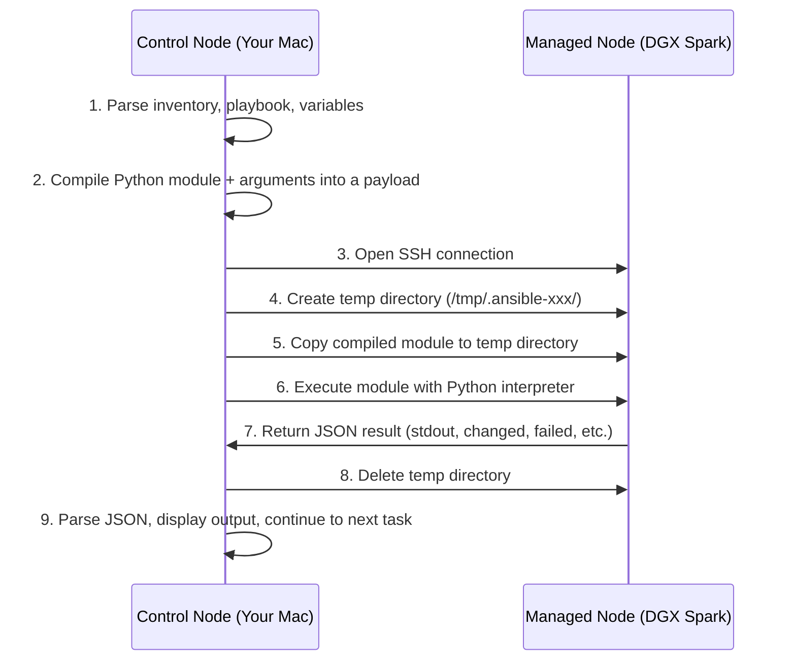
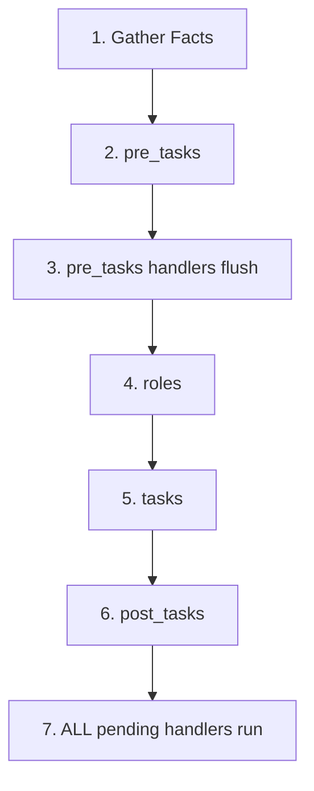

# Deep Dive: Ansible Core — Complete Learning Material

A comprehensive reference covering every major Ansible concept from fundamentals through advanced patterns, with theory, architecture, worked examples, exercises, and troubleshooting.

---

## 📑 Table of Contents

1. [Architecture & How Ansible Works Under the Hood](#1-architecture--how-ansible-works-under-the-hood)
2. [Installation & Environment Setup](#2-installation--environment-setup)
3. [Configuration: `ansible.cfg` Deep Dive](#3-configuration-ansiblecfg-deep-dive)
4. [Inventory: Static, Dynamic & Patterns](#4-inventory-static-dynamic--patterns)
5. [Modules: The Building Blocks](#5-modules-the-building-blocks)
6. [Ad-Hoc Commands](#6-ad-hoc-commands)
7. [Playbooks: Structure, Plays & Tasks](#7-playbooks-structure-plays--tasks)
8. [Variables: Scope, Precedence & Best Practices](#8-variables-scope-precedence--best-practices)
9. [Facts & Magic Variables](#9-facts--magic-variables)
10. [Conditionals (`when`)](#10-conditionals-when)
11. [Loops](#11-loops)
12. [Handlers & Notifications](#12-handlers--notifications)
13. [Jinja2 Templating](#13-jinja2-templating)
14. [Error Handling & Debugging](#14-error-handling--debugging)
15. [Roles](#15-roles)
16. [Ansible Galaxy & Collections](#16-ansible-galaxy--collections)
17. [Tags](#17-tags)
18. [Privilege Escalation (`become`)](#18-privilege-escalation-become)
19. [Delegation, Serial & Rolling Updates](#19-delegation-serial--rolling-updates)
20. [Native Ansible Vault (Encryption)](#20-native-ansible-vault-encryption)
21. [Performance Tuning](#21-performance-tuning)
22. [Testing & Linting](#22-testing--linting)
23. [Lab Exercises](#23-lab-exercises)
24. [Learning Resources](#24-learning-resources)

---

## 1. Architecture & How Ansible Works Under the Hood

### Core Execution Flow



### Key Terminology

| Term | Definition |
| :--- | :--- |
| **Control Node** | The machine where Ansible is installed and commands are executed (your Mac, a CI runner, Tower). Must be Linux/macOS — Windows is NOT supported as a control node. |
| **Managed Node** | Any remote machine Ansible manages. Requires only SSH and Python 3. No Ansible installation needed. |
| **Inventory** | A file (INI/YAML/script) listing managed nodes, grouped logically. |
| **Module** | A unit of code Ansible executes on the managed node (e.g., `apt`, `copy`, `file`, `command`). |
| **Task** | A single call to a module with specific arguments. |
| **Play** | A mapping of a host group to a list of tasks. |
| **Playbook** | A YAML file containing one or more plays. |
| **Role** | A standardized directory structure packaging related tasks, handlers, variables, templates, and files. |
| **Collection** | A distribution format for Ansible content (roles, modules, plugins) published via Ansible Galaxy. |
| **Facts** | System information automatically gathered from managed nodes (OS, IPs, RAM, CPUs). |
| **Handler** | A special task that runs only when triggered by a `notify` directive from another task. |
| **Idempotency** | Running the same task multiple times produces the same result — Ansible checks desired state before acting. |

### Why Agentless Matters

| Feature | Ansible (Agentless) | Puppet/Chef (Agent-based) |
| :--- | :--- | :--- |
| Software on managed node | None (SSH + Python) | Agent daemon required |
| Communication | SSH push on demand | Agent pulls from server |
| State management | Stateless — checks each run | Persistent state catalog |
| Startup overhead | Zero — works immediately | Agent install + certificate signing |
| Firewall complexity | Standard SSH (port 22) | Custom ports (8140, 443) |

---

## 2. Installation & Environment Setup

### Recommended Setup (Python Virtual Environment)

```bash
# Create a dedicated virtual environment
python3 -m venv ~/.ansible-env

# Activate it
source ~/.ansible-env/bin/activate

# Upgrade pip
pip install --upgrade pip

# Install Ansible Core + useful extras
pip install ansible ansible-lint yamllint jmespath

# Verify
ansible --version
ansible-lint --version
```

### What Gets Installed

- **`ansible-core`**: The engine — includes `ansible-playbook`, `ansible-galaxy`, `ansible-vault`, `ansible-doc`, and ~70 built-in modules.
- **`ansible`**: The full package — includes `ansible-core` plus the community collection bundle (~5,000 modules).
- **`ansible-lint`**: Static analysis tool that checks playbooks for best practices.
- **`yamllint`**: Validates YAML syntax before Ansible even parses it.
- **`jmespath`**: Required for the `json_query` Jinja2 filter (querying JSON data structures).

### Directory Structure Convention

```text
dgx-ansible/
├── ansible.cfg              # Project-level config (auto-detected)
├── inventory.ini            # Host inventory
├── group_vars/              # Variables applied to host groups
│   ├── all.yml              # Variables for ALL hosts
│   └── dgx_spark.yml        # Variables for the dgx_spark group
├── host_vars/               # Variables applied to individual hosts
│   └── dgx-spark-1.yml      # Variables for dgx-spark-1 only
├── roles/                   # Reusable automation units
│   └── gpu_monitoring/
│       ├── tasks/main.yml
│       ├── handlers/main.yml
│       ├── templates/
│       ├── files/
│       ├── vars/main.yml
│       └── defaults/main.yml
├── playbooks/               # Playbook files
│   ├── site.yml             # Master playbook
│   ├── gpu-monitor.yml
│   └── spark-health.yml
├── templates/               # Jinja2 template files (if not using roles)
└── files/                   # Static files to copy to targets
```

---

## 3. Configuration: `ansible.cfg` Deep Dive

Ansible searches for configuration in this priority order:

1. `ANSIBLE_CONFIG` environment variable
2. `./ansible.cfg` (current directory — **most common for projects**)
3. `~/.ansible.cfg` (home directory)
4. `/etc/ansible/ansible.cfg` (system-wide default)

### Recommended Project Configuration

```ini
[defaults]
# Inventory source
inventory = inventory.ini

# SSH user
remote_user = dgxadmin

# SSH key
private_key_file = ~/.ssh/dgx_spark_key

# Skip SSH host key verification prompts for new hosts
host_key_checking = False

# Output formatting
stdout_callback = yaml
# Display changed/failed/unreachable count at the end
callback_whitelist = profile_tasks

# Facts caching (speeds up re-runs dramatically)
gathering = smart
fact_caching = jsonfile
fact_caching_connection = /tmp/ansible_facts_cache
fact_caching_timeout = 86400

# Performance
forks = 10                  # Run on 10 hosts simultaneously (default: 5)
pipelining = True           # Reduces SSH operations per task

# Retry files
retry_files_enabled = False # Don't litter the project with .retry files

# Roles path
roles_path = ./roles

[privilege_escalation]
become = True               # Default to sudo
become_method = sudo
become_user = root
become_ask_pass = False      # Don't prompt for sudo password

[ssh_connection]
ssh_args = -o ControlMaster=auto -o ControlPersist=60s
pipelining = True
```

### Key Settings Explained

| Setting | What It Does | Why It Matters |
| :--- | :--- | :--- |
| `forks = 10` | Process 10 hosts in parallel | Default of 5 is slow for clusters |
| `pipelining = True` | Executes module over existing SSH connection instead of copying files | Massive speed improvement (2-4x faster) |
| `gathering = smart` | Only gathers facts if not already cached | Saves 5-15 seconds per play |
| `stdout_callback = yaml` | Formats output as readable YAML instead of raw JSON | Much easier to debug |
| `host_key_checking = False` | Skips SSH fingerprint verification prompt | Required for automation (but adds security risk if not in a trusted network) |

---

## 4. Inventory: Static, Dynamic & Patterns

### Static Inventory (INI Format)

```ini
# Ungrouped hosts
bastion ansible_host=10.0.0.1

[dgx_spark]
dgx-spark-1 ansible_host=192.168.1.100
dgx-spark-2 ansible_host=192.168.1.101 gpu_type=A100

[nfs_servers]
nas-01 ansible_host=192.168.1.200

# Meta-group: group of groups
[infrastructure:children]
dgx_spark
nfs_servers

# Variables for all hosts in dgx_spark
[dgx_spark:vars]
ansible_user=dgxadmin
ansible_python_interpreter=/usr/bin/python3

# Variables for ALL hosts in the inventory
[all:vars]
ansible_ssh_private_key_file=~/.ssh/ansible_id_ed25519
```

### Static Inventory (YAML Format)

```yaml
all:
  vars:
    ansible_ssh_private_key_file: ~/.ssh/ansible_id_ed25519
  children:
    dgx_spark:
      vars:
        ansible_user: dgxadmin
        ansible_python_interpreter: /usr/bin/python3
      hosts:
        dgx-spark-1:
          ansible_host: 192.168.1.100
        dgx-spark-2:
          ansible_host: 192.168.1.101
          gpu_type: A100
    nfs_servers:
      hosts:
        nas-01:
          ansible_host: 192.168.1.200
    infrastructure:
      children:
        dgx_spark:
        nfs_servers:
```

### Inventory Inspection Commands

```bash
# List all hosts
ansible-inventory -i inventory.ini --list

# Show group hierarchy graph
ansible-inventory -i inventory.ini --graph

# Show a specific host's variables
ansible-inventory -i inventory.ini --host dgx-spark-1
```

### Host Patterns (Targeting)

| Pattern | Meaning |
| :--- | :--- |
| `all` | Every host in inventory |
| `dgx_spark` | All hosts in the `dgx_spark` group |
| `dgx-spark-1` | Single specific host |
| `dgx_spark:nfs_servers` | Union of two groups (OR) |
| `dgx_spark:&infrastructure` | Intersection of two groups (AND) |
| `dgx_spark:!dgx-spark-2` | All in group EXCEPT `dgx-spark-2` |
| `~web-\d+` | Regex matching hostnames |

### Dynamic Inventory (Concept)

For cloud environments (AWS, GCP, Azure), inventory can be generated dynamically by a script or plugin that queries the cloud API:

```bash
# AWS EC2 dynamic inventory plugin
ansible-inventory -i aws_ec2.yml --graph

# Google Compute Engine
ansible-inventory -i gcp_compute.yml --graph
```

Dynamic inventory plugins return JSON in the same format as `ansible-inventory --list`.

---

## 5. Modules: The Building Blocks

Modules are the units of work Ansible executes. Each module is idempotent and returns JSON.

### Most Important Modules to Learn First

| Module | Purpose | Example |
| :--- | :--- | :--- |
| `ansible.builtin.ping` | Test connectivity (SSH + Python) | `-m ping` |
| `ansible.builtin.command` | Run a command (no shell features) | `-a "uptime"` |
| `ansible.builtin.shell` | Run via `/bin/sh` (pipes, redirects work) | `-a "ps aux \| grep python"` |
| `ansible.builtin.apt` | Manage Debian/Ubuntu packages | `name: htop state: present` |
| `ansible.builtin.yum` | Manage RHEL/CentOS packages | `name: httpd state: latest` |
| `ansible.builtin.copy` | Copy files from control to managed node | `src: ./file dest: /tmp/file` |
| `ansible.builtin.template` | Render Jinja2 template and copy | `src: app.conf.j2 dest: /etc/app.conf` |
| `ansible.builtin.file` | Manage files/directories/links/permissions | `path: /opt/app state: directory` |
| `ansible.builtin.lineinfile` | Ensure a specific line exists in a file | `path: /etc/hosts line: "10.0.0.1 vault"` |
| `ansible.builtin.service` / `systemd` | Start/stop/restart services | `name: nginx state: restarted` |
| `ansible.builtin.user` | Manage user accounts | `name: deploy state: present` |
| `ansible.builtin.cron` | Manage cron jobs | `name: "backup" minute: "0" hour: "2"` |
| `ansible.builtin.debug` | Print messages or variable values | `msg: "Value is {{ my_var }}"` |
| `ansible.builtin.set_fact` | Define new variables dynamically | `my_var: "computed_value"` |
| `ansible.builtin.uri` | Make HTTP requests | `url: https://api.example.com` |
| `ansible.builtin.git` | Clone/update Git repositories | `repo: https://... dest: /opt/app` |
| `ansible.builtin.stat` | Get file/directory statistics | `path: /etc/config.yml` |
| `ansible.builtin.wait_for` | Wait for a port/file/condition | `port: 8080 timeout: 30` |
| `ansible.builtin.assert` | Validate conditions, fail if false | `that: gpu_temp < 85` |

### Exploring Module Documentation

```bash
# List all available modules
ansible-doc -l | head -50

# Read full documentation for a specific module
ansible-doc ansible.builtin.apt

# Show only the EXAMPLES section
ansible-doc -s ansible.builtin.copy
```

---

## 6. Ad-Hoc Commands

### Syntax

```text
ansible <host-pattern> [-i inventory] -m <module> [-a "arguments"] [options]
```

### Essential Practice Commands

```bash
# 1. Ping all hosts
ansible all -m ping

# 2. Run a command on a group
ansible dgx_spark -m command -a "nvidia-smi"

# 3. Use shell module for pipes and redirects
ansible dgx_spark -m shell -a "free -h | head -2"

# 4. Copy a file to all hosts
ansible dgx_spark -m copy -a "src=./motd.txt dest=/etc/motd" --become

# 5. Install a package
ansible dgx_spark -m apt -a "name=htop state=present update_cache=yes" --become

# 6. Create a directory
ansible dgx_spark -m file -a "path=/opt/monitoring state=directory mode=0755" --become

# 7. Restart a service
ansible dgx_spark -m systemd -a "name=docker state=restarted" --become

# 8. Gather a specific fact
ansible dgx_spark -m setup -a "filter=ansible_memtotal_mb"

# 9. Check disk space (one-liner report)
ansible dgx_spark -m command -a "df -h /"

# 10. Reboot all hosts (with caution!)
ansible dgx_spark -m reboot -a "reboot_timeout=300" --become
```

### When to Use Ad-Hoc vs Playbooks

| Use Ad-Hoc When... | Use Playbooks When... |
| :--- | :--- |
| Quick one-off checks (`uptime`, `df -h`) | Multi-step workflows |
| Testing connectivity | Repeatable automation |
| Emergency fixes | Version-controlled configuration |
| Gathering information | Complex logic (conditionals, loops) |

---

## 7. Playbooks: Structure, Plays & Tasks

### Anatomy of a Playbook

```yaml
---
# A playbook is a list of PLAYS
- name: Play 1 — Configure DGX nodes          # Human-readable description
  hosts: dgx_spark                              # Target host/group pattern
  become: true                                  # Escalate privileges (sudo)
  gather_facts: true                            # Collect system info (default: true)

  vars:                                         # Play-level variables
    monitoring_dir: /opt/monitoring

  pre_tasks:                                    # Run BEFORE roles
    - name: Update package cache
      ansible.builtin.apt:
        update_cache: true
        cache_valid_time: 3600

  roles:                                        # Include roles
    - common_setup

  tasks:                                        # Main task list
    - name: Ensure monitoring directory exists
      ansible.builtin.file:
        path: "{{ monitoring_dir }}"
        state: directory
        mode: '0755'

    - name: Check GPU status
      ansible.builtin.command: nvidia-smi
      register: gpu_output                      # Store the result
      changed_when: false                       # Mark as "no change" (informational only)

    - name: Display GPU info
      ansible.builtin.debug:
        var: gpu_output.stdout_lines

  post_tasks:                                   # Run AFTER tasks
    - name: Send notification
      ansible.builtin.debug:
        msg: "Play 1 completed successfully"

  handlers:                                     # Triggered by 'notify'
    - name: Restart monitoring agent
      ansible.builtin.systemd:
        name: node-exporter
        state: restarted

# Second play targeting different hosts
- name: Play 2 — Configure NFS server
  hosts: nfs_servers
  become: true
  tasks:
    - name: Ensure NFS is installed
      ansible.builtin.apt:
        name: nfs-kernel-server
        state: present
```

### Execution Order Within a Play



### Running Playbooks

```bash
# Basic execution
ansible-playbook playbooks/site.yml

# With a specific inventory
ansible-playbook -i inventory.ini playbooks/site.yml

# Dry run — simulate without changes
ansible-playbook playbooks/site.yml --check

# Show what changes WOULD be made (diff)
ansible-playbook playbooks/site.yml --check --diff

# Limit to specific hosts
ansible-playbook playbooks/site.yml --limit dgx-spark-1

# Run only tasks with specific tags
ansible-playbook playbooks/site.yml --tags "install,configure"

# Skip specific tags
ansible-playbook playbooks/site.yml --skip-tags "reboot"

# Verbose output (-v, -vv, -vvv, or -vvvv for max debug)
ansible-playbook playbooks/site.yml -vvv

# Start at a specific task (resume after failure)
ansible-playbook playbooks/site.yml --start-at-task="Check GPU status"

# Step through tasks one at a time (interactive)
ansible-playbook playbooks/site.yml --step

# Pass extra variables from command line
ansible-playbook playbooks/site.yml -e "http_port=8080 env=production"
```

---

## 8. Variables: Scope, Precedence & Best Practices

### Where to Define Variables

| Location | Scope | Use When |
| :--- | :--- | :--- |
| `group_vars/all.yml` | Every host | Global defaults (NTP servers, DNS) |
| `group_vars/<group>.yml` | All hosts in `<group>` | Group-specific settings |
| `host_vars/<host>.yml` | Single host | Host-specific overrides |
| Play-level `vars:` | Current play | Play-specific parameters |
| Task-level `vars:` | Single task | Task-specific parameters |
| `register:` | Current play | Capture task output |
| `set_fact:` | Current host for remainder of playbook | Computed values |
| `-e` / `--extra-vars` | Entire run, **highest** priority | CLI overrides |
| Role `defaults/main.yml` | Hosts using the role, **lowest** priority | Sane defaults users can override |
| Role `vars/main.yml` | Hosts using the role, **high** priority | Internal role constants |

### Variable Precedence (Lowest → Highest)

Ansible has 22 levels of variable precedence. The most important ones to remember:

```text
1.  Role defaults (defaults/main.yml)         ← Lowest
2.  Inventory file group vars
3.  Inventory group_vars/all
4.  Inventory group_vars/<group>
5.  Inventory host_vars/<host>
6.  Play vars
7.  Play vars_files
8.  Role vars (vars/main.yml)
9.  Task vars
10. set_fact / registered vars
11. Extra vars (-e "key=value")                ← HIGHEST — always wins
```

> **Rule of thumb**: Put defaults in `defaults/main.yml` (easily overridable). Put constants in `vars/main.yml`. Use `group_vars/` for environment-specific values.

### Data Types

```yaml
vars:
  # String
  app_name: "gpu-monitor"

  # Integer
  max_retries: 5

  # Boolean
  enable_monitoring: true

  # List
  packages:
    - htop
    - curl
    - git

  # Dictionary
  gpu_thresholds:
    temperature: 85
    memory_pct: 90
    utilization: 95
```

### Accessing Variables

```yaml
# Simple variable
msg: "App is {{ app_name }}"

# List item by index
msg: "First package: {{ packages[0] }}"

# Dictionary value (dot notation)
msg: "Temp threshold: {{ gpu_thresholds.temperature }}"

# Dictionary value (bracket notation — safer with special chars)
msg: "Temp threshold: {{ gpu_thresholds['temperature'] }}"

# Default value if undefined
msg: "Port: {{ http_port | default(8080) }}"
```

---

## 9. Facts & Magic Variables

### Facts

Facts are automatically gathered system information. Disable with `gather_facts: false` to save time when not needed.

```bash
# View ALL facts for a host
ansible dgx-spark-1 -m setup

# Filter specific facts
ansible dgx-spark-1 -m setup -a "filter=ansible_distribution*"
ansible dgx-spark-1 -m setup -a "filter=ansible_memtotal_mb"
ansible dgx-spark-1 -m setup -a "filter=ansible_default_ipv4"
```

### Most Useful Facts

| Fact | Example Value |
| :--- | :--- |
| `ansible_hostname` | `dgx-spark-1` |
| `ansible_fqdn` | `dgx-spark-1.lab.local` |
| `ansible_default_ipv4.address` | `192.168.1.100` |
| `ansible_distribution` | `Ubuntu` |
| `ansible_distribution_version` | `22.04` |
| `ansible_os_family` | `Debian` |
| `ansible_memtotal_mb` | `131072` |
| `ansible_processor_vcpus` | `16` |
| `ansible_architecture` | `aarch64` |
| `ansible_date_time.iso8601` | `2026-09-27T12:00:00Z` |

### Magic Variables

| Variable | Description |
| :--- | :--- |
| `inventory_hostname` | Name of the current host as defined in inventory |
| `ansible_host` | Connection address for the current host |
| `groups` | Dictionary of all groups and their host lists |
| `group_names` | List of groups the current host belongs to |
| `hostvars` | Dictionary containing all hosts' variables |
| `play_hosts` | List of active hosts in the current play |
| `ansible_play_name` | Name of the current play |
| `role_name` | Name of the current role |

### Accessing Other Hosts' Variables

```yaml
# Get the IP of another host in the same play
msg: "NAS IP is {{ hostvars['nas-01']['ansible_host'] }}"
```

---

## 10. Conditionals (`when`)

```yaml
tasks:
  # String comparison
  - name: Install on Debian-family only
    ansible.builtin.apt:
      name: htop
    when: ansible_os_family == "Debian"

  # Numeric comparison
  - name: Alert if memory is critically low
    ansible.builtin.debug:
      msg: "WARNING: Only {{ ansible_memfree_mb }}MB free!"
    when: ansible_memfree_mb < 1024

  # Boolean variable
  - name: Enable monitoring
    ansible.builtin.systemd:
      name: node-exporter
      state: started
      enabled: true
    when: enable_monitoring | bool

  # Check if variable is defined
  - name: Use custom port if set
    ansible.builtin.debug:
      msg: "Using port {{ custom_port }}"
    when: custom_port is defined

  # AND condition
  - name: Only on Ubuntu 22.04
    ansible.builtin.debug:
      msg: "Running on Ubuntu 22.04"
    when:
      - ansible_distribution == "Ubuntu"
      - ansible_distribution_version == "22.04"

  # OR condition
  - name: On any Debian or Ubuntu
    ansible.builtin.debug:
      msg: "Debian-family detected"
    when: ansible_distribution == "Debian" or ansible_distribution == "Ubuntu"

  # Based on registered output
  - name: Check if Docker is running
    ansible.builtin.command: systemctl is-active docker
    register: docker_status
    failed_when: false
    changed_when: false

  - name: Start Docker if not running
    ansible.builtin.systemd:
      name: docker
      state: started
    when: docker_status.rc != 0
```

---

## 11. Loops

### Simple List Loop

```yaml
- name: Install multiple packages
  ansible.builtin.apt:
    name: "{{ item }}"
    state: present
  loop:
    - htop
    - curl
    - git
    - jq

# More efficient — apt module accepts a list directly:
- name: Install multiple packages (optimized)
  ansible.builtin.apt:
    name:
      - htop
      - curl
      - git
      - jq
    state: present
```

### Loop Over Dictionaries

```yaml
- name: Create multiple users
  ansible.builtin.user:
    name: "{{ item.name }}"
    groups: "{{ item.groups }}"
    shell: "{{ item.shell }}"
  loop:
    - { name: "deploy", groups: "sudo", shell: "/bin/bash" }
    - { name: "monitor", groups: "docker", shell: "/bin/sh" }
```

### Loop with Index

```yaml
- name: Display numbered items
  ansible.builtin.debug:
    msg: "{{ idx + 1 }}. {{ item }}"
  loop:
    - "Check GPU"
    - "Check Memory"
    - "Check Disk"
  loop_control:
    index_var: idx
```

### Loop with `when` Filter

```yaml
- name: Start only enabled services
  ansible.builtin.systemd:
    name: "{{ item.name }}"
    state: started
  loop:
    - { name: "docker", enabled: true }
    - { name: "nginx", enabled: false }
    - { name: "node-exporter", enabled: true }
  when: item.enabled
```

---

## 12. Handlers & Notifications

Handlers run **once** at the end of all tasks (or at a `meta: flush_handlers`), and **only if triggered by a `notify`**.

```yaml
tasks:
  - name: Update NGINX configuration
    ansible.builtin.template:
      src: nginx.conf.j2
      dest: /etc/nginx/nginx.conf
    notify:
      - Validate NGINX config
      - Restart NGINX

  - name: Update application config
    ansible.builtin.template:
      src: app.conf.j2
      dest: /etc/app/app.conf
    notify: Restart application

handlers:
  - name: Validate NGINX config
    ansible.builtin.command: nginx -t
    listen: "Validate NGINX config"

  - name: Restart NGINX
    ansible.builtin.systemd:
      name: nginx
      state: restarted

  - name: Restart application
    ansible.builtin.systemd:
      name: app-service
      state: restarted
```

### Force Immediate Handler Execution

```yaml
tasks:
  - name: Update critical config
    ansible.builtin.template:
      src: critical.conf.j2
      dest: /etc/critical.conf
    notify: Restart critical service

  # Force all pending handlers to run NOW (before next task)
  - name: Flush handlers immediately
    ansible.builtin.meta: flush_handlers

  - name: Verify service is running with new config
    ansible.builtin.uri:
      url: "http://localhost:8080/health"
      status_code: 200
```

---

## 13. Jinja2 Templating

### Template File Example (`templates/gpu-monitor.conf.j2`)

```jinja2
# GPU Monitoring Configuration
# Generated by Ansible on {{ ansible_date_time.iso8601 }}
# Host: {{ inventory_hostname }}

[monitoring]
hostname = {{ ansible_hostname }}
ip_address = {{ ansible_default_ipv4.address }}
gpu_name = {{ gpu_name | default("unknown") }}

[thresholds]
temperature_celsius = {{ temp_threshold_c }}
memory_percent = {{ mem_threshold_pct }}

[logging]
log_file = {{ log_file }}
log_level = {{ log_level | default("INFO") | upper }}

[alerting]

enabled = true
webhook_url = {{ alert_webhook }}

enabled = false


[monitored_gpus]

gpu_{{ loop.index0 }} = {{ gpu }}

```

### Common Jinja2 Filters

```yaml
# String manipulation
"{{ hostname | upper }}"                      # UPPERCASE
"{{ hostname | lower }}"                      # lowercase
"{{ hostname | capitalize }}"                 # Capitalize
"{{ path | basename }}"                       # filename.txt from /a/b/filename.txt
"{{ path | dirname }}"                        # /a/b from /a/b/filename.txt
"{{ password | hash('sha512') }}"             # SHA-512 hash

# List manipulation
"{{ packages | join(', ') }}"                 # "htop, curl, git"
"{{ packages | length }}"                     # 3
"{{ packages | first }}"                      # "htop"
"{{ packages | last }}"                       # "git"
"{{ packages | sort }}"                       # Sorted list
"{{ packages | unique }}"                     # Deduplicated list

# Math
"{{ (mem_used / mem_total * 100) | round(1) }}" # Percentage with 1 decimal
"{{ value | int }}"                           # Cast to integer
"{{ value | float }}"                         # Cast to float

# Default values
"{{ optional_var | default('fallback') }}"    # Use fallback if undefined
"{{ optional_var | default(omit) }}"          # Skip the parameter entirely

# Type conversion
"{{ my_list | to_json }}"                     # Convert to JSON string
"{{ my_dict | to_yaml }}"                     # Convert to YAML string
"{{ json_string | from_json }}"               # Parse JSON string

# Conditional
"{{ 'yes' if enable_feature else 'no' }}"     # Ternary expression
```

### Using Templates in a Task

```yaml
- name: Deploy GPU monitor configuration
  ansible.builtin.template:
    src: gpu-monitor.conf.j2
    dest: /etc/gpu-monitor/config.conf
    owner: root
    group: root
    mode: '0644'
    backup: true         # Keep a backup of the previous version
    validate: '/usr/bin/gpu-monitor --validate %s'  # Validate before replacing
  notify: Restart GPU monitor
```

---

## 14. Error Handling & Debugging

### Ignoring Errors

```yaml
- name: Check if optional service exists
  ansible.builtin.command: systemctl status optional-service
  register: result
  ignore_errors: true    # Continue even if this task fails

- name: Act on result
  ansible.builtin.debug:
    msg: "Service {{ 'is' if result.rc == 0 else 'is NOT' }} running"
```

### Custom Failure Conditions

```yaml
- name: Check GPU temperature
  ansible.builtin.command: nvidia-smi --query-gpu=temperature.gpu --format=csv,noheader,nounits
  register: gpu_temp
  changed_when: false
  failed_when: gpu_temp.stdout | int > 95    # Fail if temp > 95°C
```

### Block / Rescue / Always (Try-Catch-Finally)

```yaml
- name: Safely deploy application
  block:
    - name: Stop the service
      ansible.builtin.systemd:
        name: myapp
        state: stopped

    - name: Deploy new binary
      ansible.builtin.copy:
        src: myapp-v2
        dest: /usr/local/bin/myapp
        mode: '0755'

    - name: Start the service
      ansible.builtin.systemd:
        name: myapp
        state: started

  rescue:
    - name: ROLLBACK — restore previous binary
      ansible.builtin.copy:
        src: myapp-v1
        dest: /usr/local/bin/myapp
        mode: '0755'

    - name: ROLLBACK — start previous version
      ansible.builtin.systemd:
        name: myapp
        state: started

    - name: Alert on failure
      ansible.builtin.debug:
        msg: "⚠️  Deployment FAILED — rolled back to v1"

  always:
    - name: Verify service is running
      ansible.builtin.command: systemctl is-active myapp
      changed_when: false
```

### Debugging Techniques

```bash
# Verbose levels
ansible-playbook site.yml -v        # Task results
ansible-playbook site.yml -vv       # Task input parameters
ansible-playbook site.yml -vvv      # SSH connection details
ansible-playbook site.yml -vvvv     # Full debug including script transfer

# Interactive step-through
ansible-playbook site.yml --step
```

```yaml
# Inline debugging
- name: Inspect a variable
  ansible.builtin.debug:
    var: my_complex_variable

- name: Inspect with message
  ansible.builtin.debug:
    msg: "Type is {{ my_var | type_debug }}, value is {{ my_var }}"

# Pause for inspection
- name: Pause to inspect
  ansible.builtin.pause:
    prompt: "Press Enter to continue or Ctrl+C to abort"
```

---

## 15. Roles

### Creating a Role

```bash
ansible-galaxy role init roles/gpu_monitoring
```

### Role Directory Structure

```text
roles/gpu_monitoring/
├── defaults/
│   └── main.yml       # Default variables (lowest precedence, easily overridden)
├── vars/
│   └── main.yml       # Role variables (high precedence, internal constants)
├── tasks/
│   └── main.yml       # Main task list
├── handlers/
│   └── main.yml       # Handler definitions
├── templates/         # Jinja2 template files (.j2)
├── files/             # Static files to copy
├── meta/
│   └── main.yml       # Role metadata, dependencies, supported platforms
└── README.md          # Documentation
```

### Example Role Tasks (`roles/gpu_monitoring/tasks/main.yml`)

```yaml
---
- name: Install monitoring prerequisites
  ansible.builtin.apt:
    name: "{{ gpu_mon_packages }}"
    state: present
  tags: [install]

- name: Deploy monitoring script
  ansible.builtin.template:
    src: gpu-monitor.sh.j2
    dest: /usr/local/bin/gpu-monitor.sh
    mode: '0755'
  notify: Restart GPU monitor cron
  tags: [configure]

- name: Schedule monitoring cron job
  ansible.builtin.cron:
    name: "GPU monitoring"
    minute: "*/{{ gpu_mon_interval_minutes }}"
    job: /usr/local/bin/gpu-monitor.sh
    user: "{{ gpu_mon_user }}"
  tags: [configure]
```

### Example Role Defaults (`roles/gpu_monitoring/defaults/main.yml`)

```yaml
---
gpu_mon_packages:
  - bc
  - jq
gpu_mon_interval_minutes: 5
gpu_mon_user: dgxadmin
gpu_mon_log_file: /var/log/gpu-monitor.log
gpu_mon_temp_threshold: 85
gpu_mon_mem_threshold: 90
```

### Using Roles in Playbooks

```yaml
---
- name: Full cluster setup
  hosts: dgx_spark
  become: true
  roles:
    # Simple inclusion
    - common_setup

    # With variable overrides
    - role: gpu_monitoring
      vars:
        gpu_mon_temp_threshold: 80
        gpu_mon_interval_minutes: 2

    # Conditional role inclusion
    - role: nvidia_driver_update
      when: update_drivers | default(false) | bool
```

---

## 16. Ansible Galaxy & Collections

### What is a Collection?

A collection is a packaging format that bundles:
- Modules
- Roles
- Plugins (lookup, filter, callback)
- Playbooks

### Installing Collections

```bash
# Install from Galaxy
ansible-galaxy collection install community.general
ansible-galaxy collection install community.hashi_vault

# Install from a requirements file
cat requirements.yml
# ---
# collections:
#   - name: community.general
#     version: ">=8.0.0"
#   - name: community.hashi_vault
#     version: ">=6.0.0"

ansible-galaxy collection install -r requirements.yml

# List installed collections
ansible-galaxy collection list
```

---

## 17. Tags

Tags let you selectively run or skip tasks:

```yaml
tasks:
  - name: Update apt cache
    ansible.builtin.apt:
      update_cache: true
    tags: [always]           # ALWAYS runs, even when filtering by tags

  - name: Install packages
    ansible.builtin.apt:
      name: htop
    tags: [install, packages]

  - name: Configure monitoring
    ansible.builtin.template:
      src: monitor.conf.j2
      dest: /etc/monitor.conf
    tags: [configure]

  - name: Restart services
    ansible.builtin.systemd:
      name: monitor
      state: restarted
    tags: [restart, never]   # NEVER runs unless explicitly requested
```

```bash
# Run only "install" tasks
ansible-playbook site.yml --tags install

# Run install AND configure
ansible-playbook site.yml --tags "install,configure"

# Skip restart tasks
ansible-playbook site.yml --skip-tags restart

# List all available tags in a playbook
ansible-playbook site.yml --list-tags
```

---

## 18. Privilege Escalation (`become`)

```yaml
# Play-level (applies to all tasks in the play)
- name: Configure system
  hosts: dgx_spark
  become: true                 # Enable sudo
  become_user: root            # Target user (default: root)
  become_method: sudo          # Method (sudo, su, pbrun, pfexec, doas, etc.)

  tasks:
    # Task-level override
    - name: Run as specific application user
      ansible.builtin.command: whoami
      become_user: app_user

    # Disable become for a specific task
    - name: Check user's own files
      ansible.builtin.command: ls ~/
      become: false
```

---

## 19. Delegation, Serial & Rolling Updates

### Delegation

Run a task on a different host than the play target:

```yaml
- name: Remove host from load balancer before updating
  ansible.builtin.uri:
    url: "https://lb.example.com/api/deregister/{{ inventory_hostname }}"
    method: POST
  delegate_to: localhost     # Run this on the control node, not the target
```

### Serial (Rolling Updates)

Update hosts in batches to avoid full downtime:

```yaml
- name: Rolling update of application servers
  hosts: dgx_spark
  serial: 1                  # Update one host at a time
  # serial: "30%"            # Or as a percentage
  # serial: [1, 3, 5]        # First 1, then 3, then 5 at a time
  become: true

  tasks:
    - name: Deploy new version
      ansible.builtin.copy:
        src: app-v2
        dest: /opt/app/bin/app

    - name: Restart service
      ansible.builtin.systemd:
        name: app
        state: restarted

    - name: Wait for service to be healthy
      ansible.builtin.uri:
        url: "http://{{ ansible_host }}:8080/health"
        status_code: 200
      retries: 10
      delay: 5
```

---

## 20. Native Ansible Vault (Encryption)

### Encrypt / Decrypt Files

```bash
# Encrypt an existing file
ansible-vault encrypt group_vars/production.yml

# Decrypt a file
ansible-vault decrypt group_vars/production.yml

# View encrypted file without decrypting
ansible-vault view group_vars/production.yml

# Edit encrypted file (opens in $EDITOR)
ansible-vault edit group_vars/production.yml

# Change the encryption password
ansible-vault rekey group_vars/production.yml
```

### Encrypt Individual Strings

```bash
# Encrypt a single value to embed in a YAML file
ansible-vault encrypt_string 'SuperSecretPassword!' --name 'db_password'
```

Output (paste into your variable file):
```yaml
db_password: !vault |
  $ANSIBLE_VAULT;1.1;AES256
  6562626561...
```

### Using Vault in Playbook Runs

```bash
# Prompt for password
ansible-playbook site.yml --ask-vault-pass

# Use a password file
echo "MyVaultPassword" > ~/.vault_pass
chmod 600 ~/.vault_pass
ansible-playbook site.yml --vault-password-file ~/.vault_pass

# Set in ansible.cfg (for convenience)
# vault_password_file = ~/.vault_pass
```

---

## 21. Performance Tuning

| Technique | Setting | Impact |
| :--- | :--- | :--- |
| Increase parallelism | `forks = 20` | Process 20 hosts simultaneously |
| Enable pipelining | `pipelining = True` | Reduces SSH operations per task (2-4x faster) |
| Cache facts | `fact_caching = jsonfile` | Skip fact gathering on subsequent runs |
| Disable fact gathering | `gather_facts: false` | Save ~5s per play if facts aren't needed |
| Use `free` strategy | `strategy: free` | Fast hosts don't wait for slow ones |
| Use `async` for long tasks | `async: 300` / `poll: 5` | Run long tasks without blocking SSH |
| Minimize `command`/`shell` | Use dedicated modules | Modules are idempotent and faster |
| Use `ansible.builtin.package` | Platform-agnostic package management | Avoids conditional `apt`/`yum` blocks |

---

## 22. Testing & Linting

```bash
# Syntax check
ansible-playbook site.yml --syntax-check

# Lint playbooks (checks for best practices)
ansible-lint playbooks/

# YAML syntax validation
yamllint playbooks/

# Dry run (check mode)
ansible-playbook site.yml --check --diff
```

---

## 23. Lab Exercises

### Exercise 1: Basic Connectivity
Write an ad-hoc command to ping all DGX Spark nodes and verify connectivity.

### Exercise 2: System Info Playbook
Write a playbook that gathers and displays: hostname, OS, total RAM, CPU count, GPU name, and disk usage for each DGX Spark node.

### Exercise 3: Package Management
Write a playbook that installs `htop`, `curl`, `tree`, and `jq` on all nodes. Run it twice and observe the idempotency (second run should show 0 changed).

### Exercise 4: Template a Config
Create a Jinja2 template for a monitoring config file that dynamically inserts the hostname, IP address, and threshold variables. Deploy it with the `template` module.

### Exercise 5: Create a Role
Package the GPU monitoring logic into a role with proper `defaults/`, `tasks/`, `handlers/`, and `templates/` directories. Use it in a playbook.

### Exercise 6: Encrypt Secrets
Create a `secrets.yml` file with database credentials. Encrypt it with `ansible-vault`. Write a playbook that uses the encrypted variables.

### Exercise 7: Rolling Update
Write a playbook that deploys a script to hosts one at a time (`serial: 1`), waits for health confirmation between each host.

---

## 24. Learning Resources

### Books
- **"Ansible for DevOps"** by Jeff Geerling — The industry standard practical guide
- **"Ansible: Up & Running"** by Bas Meijer, Lorin Hochstein — O'Reilly comprehensive reference

### Video Courses
- **Jeff Geerling's "Ansible 101"** (YouTube, Free) — Multi-part series from beginner to advanced
- **LearnLinuxTV Ansible Series** (YouTube, Free) — Excellent visual walkthrough

### Interactive Labs
- **[Killercoda Ansible Playground](https://killercoda.com/playgrounds/scenario/ansible)** — Browser-based Linux environment
- **[Red Hat Interactive Labs](https://www.redhat.com/en/interactive-walkthroughs/ansible)** — Guided hands-on scenarios

### Official Documentation
- **[Getting Started Guide](https://docs.ansible.com/ansible/latest/getting_started/index.html)**
- **[Module Index](https://docs.ansible.com/ansible/latest/collections/ansible/builtin/index.html)**
- **[Playbook Best Practices](https://docs.ansible.com/ansible/latest/tips_tricks/ansible_tips_tricks.html)**
- **[Variable Precedence](https://docs.ansible.com/ansible/latest/playbook_guide/playbooks_variables.html#understanding-variable-precedence)**

### Certification
- **Red Hat EX294** — Certified Specialist in Ansible Automation
