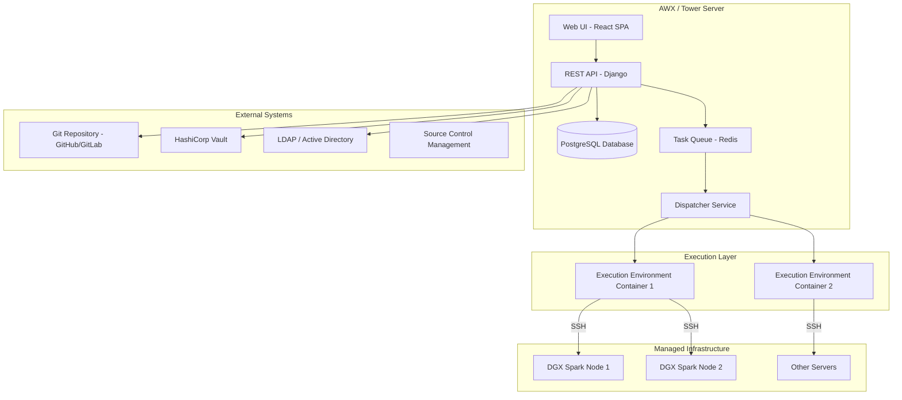
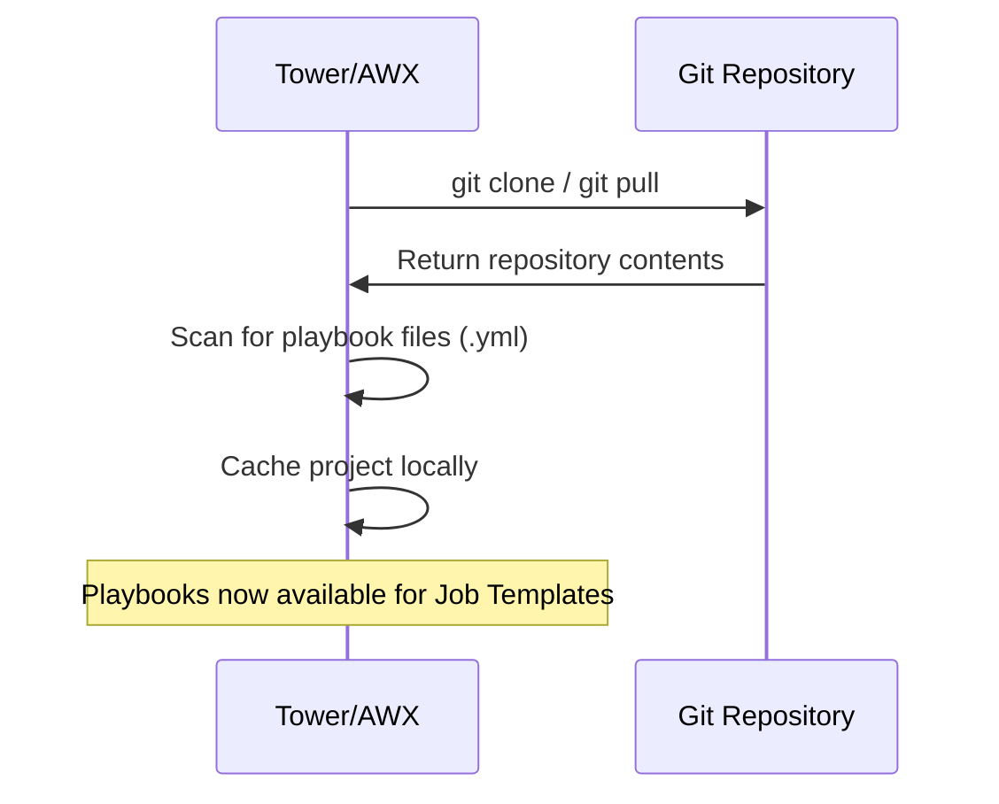
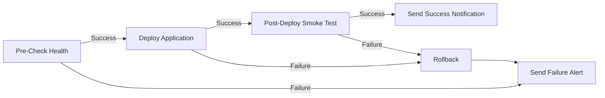
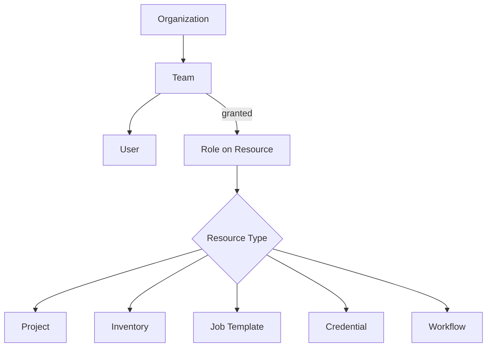

# Deep Dive: Ansible Tower / AWX — Complete Learning Material

A comprehensive guide covering the architecture, installation, core concepts, RBAC, credential management, job templates, workflows, API usage, and operational best practices for Ansible Tower (commercial) and AWX (open-source upstream).

---

## 📑 Table of Contents

1. [What Is Ansible Tower / AWX?](#1-what-is-ansible-tower--awx)
2. [Architecture & Components](#2-architecture--components)
3. [AWX vs Ansible Automation Platform (AAP) vs Tower](#3-awx-vs-ansible-automation-platform-aap-vs-tower)
4. [Installing AWX (Hands-On Lab)](#4-installing-awx-hands-on-lab)
5. [First Login & Initial Configuration](#5-first-login--initial-configuration)
6. [Organizations, Teams & Users](#6-organizations-teams--users)
7. [Projects (Git Integration)](#7-projects-git-integration)
8. [Inventories](#8-inventories)
9. [Credentials & Credential Types](#9-credentials--credential-types)
10. [Execution Environments (EE)](#10-execution-environments-ee)
11. [Job Templates](#11-job-templates)
12. [Surveys (User Prompts)](#12-surveys-user-prompts)
13. [Workflow Templates](#13-workflow-templates)
14. [Notifications](#14-notifications)
15. [Schedules](#15-schedules)
16. [Role-Based Access Control (RBAC)](#16-role-based-access-control-rbac)
17. [The Tower / AWX REST API](#17-the-tower--awx-rest-api)
18. [Logs, Auditing & Activity Stream](#18-logs-auditing--activity-stream)
19. [Backup, Restore & High Availability](#19-backup-restore--high-availability)
20. [Best Practices for Production](#20-best-practices-for-production)
21. [Lab Exercises](#21-lab-exercises)
22. [Learning Resources](#22-learning-resources)

---

## 1. What Is Ansible Tower / AWX?

**Problem**: Running `ansible-playbook` from the CLI has limitations for teams:
- No centralized audit trail
- No role-based access control (RBAC)
- No self-service for non-engineers
- Credentials stored on individual laptops
- No scheduling, no workflow chaining, no dashboard

**Solution**: Ansible Tower / AWX adds an enterprise layer on top of Ansible Core:

| Feature | CLI `ansible-playbook` | Tower / AWX |
| :--- | :--- | :--- |
| Execution | Manual from terminal | Web UI, API, or scheduled |
| Credentials | Files on your machine | Encrypted in Tower's DB, injected at runtime |
| Access control | Whoever has SSH access | RBAC with Organizations, Teams, and Roles |
| Audit trail | Terminal history only | Full job history with stdout logs |
| Scheduling | Cron on control node | Built-in scheduler (recurrence, one-off) |
| Workflows | Manually chain playbooks | Visual workflow designer (conditional branching) |
| Self-service | Requires CLI knowledge | Surveys let non-technical users fill in parameters |
| API | None | Full RESTful API for CI/CD integration |
| Notifications | DIY | Slack, email, PagerDuty, webhooks built-in |

---

## 2. Architecture & Components



### Component Breakdown

| Component | Role |
| :--- | :--- |
| **Web UI** | React single-page app for human interaction |
| **REST API** | Django-based API that powers the UI and external integrations |
| **PostgreSQL** | Stores all configuration: inventories, credentials (encrypted), job history, RBAC |
| **Redis** | Message broker for the task queue |
| **Dispatcher** | Picks up jobs from the queue, launches Execution Environment containers |
| **Execution Environment (EE)** | Container image with Ansible, Python dependencies, and collections pre-installed. Jobs run inside EEs. |
| **Receptor** | Mesh networking component for multi-node/multi-site topologies |

---

## 3. AWX vs Ansible Automation Platform (AAP) vs Tower

| | AWX | Ansible Tower (Legacy) | Ansible Automation Platform (AAP) |
| :--- | :--- | :--- | :--- |
| **Cost** | Free, open-source | Licensed (discontinued) | Licensed subscription |
| **Support** | Community only | Red Hat support (EOL) | Red Hat support |
| **Release cadence** | Frequent (upstream) | Periodic releases | Periodic releases |
| **Use case** | Learning, dev/test, small production | Legacy enterprise | Enterprise production |
| **Current status** | Active development | Superseded by AAP | Current commercial product |
| **Feature parity** | Nearly identical features to AAP | Subset of AAP | Full feature set |

> **For learning**: AWX is the perfect choice. Everything you learn on AWX applies directly to AAP/Tower.

---

## 4. Installing AWX (Hands-On Lab)

### Prerequisites
- A Linux machine or VM (Ubuntu 22.04 recommended) with at least **4 CPUs, 8GB RAM, 40GB disk**
- Docker and Docker Compose OR a Kubernetes cluster (Minikube works for learning)

### Option A: Docker Compose (Simplest for Learning)

```bash
# 1. Install Docker
sudo apt update && sudo apt install -y docker.io docker-compose-v2
sudo usermod -aG docker $USER
newgrp docker

# 2. Clone AWX
git clone https://github.com/ansible/awx.git
cd awx

# 3. Check out a stable release tag
git tag -l | tail -10
git checkout tags/24.6.1

# 4. Build and start with Docker Compose
cd tools/docker-compose
make docker-compose-build
docker compose up -d

# 5. Wait for services to start (~2-5 minutes)
docker compose logs -f awx_1
# Look for: "Successfully registered instance"

# 6. Create admin superuser
docker compose exec awx_1 awx-manage createsuperuser
# Enter username: admin, email, password

# 7. Access the UI
echo "Open http://localhost:8013 in your browser"
```

### Option B: Kubernetes (Minikube)

```bash
# 1. Start Minikube
minikube start --cpus=4 --memory=8192

# 2. Install the AWX Operator
kubectl apply -f https://raw.githubusercontent.com/ansible/awx-operator/main/deploy/awx-operator.yaml

# 3. Deploy AWX instance
cat <<EOF | kubectl apply -f -
apiVersion: awx.ansible.com/v1beta1
kind: AWX
metadata:
  name: awx-lab
spec:
  service_type: NodePort
  admin_user: admin
  admin_password_secret: awx-admin-password
EOF

# 4. Create admin password secret
kubectl create secret generic awx-admin-password \
  --from-literal=password='AdminP@ss2026!'

# 5. Get the NodePort URL
minikube service awx-lab-service --url
```

---

## 5. First Login & Initial Configuration

After accessing the AWX UI at `http://localhost:8013`:

1. **Login** with your admin credentials.
2. You'll see the **Dashboard** with job activity, host counts, and inventory sync status.

### Navigation Sidebar

| Section | Purpose |
| :--- | :--- |
| **Dashboard** | Overview of recent jobs, inventories, and projects |
| **Jobs** | History of all executed jobs with full stdout |
| **Schedules** | Recurring and one-off job schedules |
| **Activity Stream** | Audit log of all user actions (who changed what, when) |
| **Templates** | Job Templates and Workflow Templates |
| **Credentials** | SSH keys, cloud credentials, Vault connections |
| **Projects** | Git-synced playbook repositories |
| **Inventories** | Static and dynamic host lists |
| **Execution Environments** | Container images for job execution |
| **Organizations** | Multi-tenancy boundaries |
| **Users / Teams** | User accounts and team groupings |

---

## 6. Organizations, Teams & Users

### Organizations
An Organization is the **top-level tenant** boundary. Everything in Tower belongs to an Organization.

```text
Organization: "NVIDIA DGX Operations"
├── Teams
│   ├── Platform Engineering
│   ├── GPU Operations
│   └── Security
├── Projects
├── Inventories
├── Credentials
└── Job Templates
```

### Creating an Organization

1. Navigate to **Organizations** → **Add**
2. Set **Name**: `NVIDIA DGX Operations`
3. Set **Description**: `DGX Spark fleet management`
4. Click **Save**

### Teams
Teams group users within an Organization. Teams are granted roles on resources (Projects, Inventories, Templates).

| Team | Members | Access Level |
| :--- | :--- | :--- |
| Platform Engineering | Alice, Bob | Admin — full access |
| GPU Operations | Charlie, Diana | Execute — run jobs, view results |
| Security | Eve | Audit — read-only, view activity stream |

### Users
Users can authenticate via:
- **Local accounts** (built-in)
- **LDAP / Active Directory** (enterprise SSO)
- **SAML / OAuth2** (SSO)

User types:
| Type | Description |
| :--- | :--- |
| **Normal User** | Standard operator, access controlled by RBAC |
| **System Auditor** | Read-only access to everything |
| **System Administrator** | Full superuser access to everything |

---

## 7. Projects (Git Integration)

A **Project** is a reference to a Git repository containing your Ansible playbooks.

### Creating a Project

1. Navigate to **Projects** → **Add**
2. Fill in:
   - **Name**: `DGX Automation`
   - **Organization**: `NVIDIA DGX Operations`
   - **Source Control Type**: `Git`
   - **Source Control URL**: `https://github.com/your-org/dgx-ansible.git`
   - **Source Control Branch**: `main`
   - **Source Control Credential**: (Select your Git credential if private repo)
   - ☑️ **Update Revision on Launch**: Automatically pull latest code before each job
   - ☑️ **Clean**: Remove untracked files from project directory before sync

3. Click **Save** → Click **Sync** (the blue circular arrow icon)

### Project Sync Process



### Best Practices
- **One repo per team or domain** (not one massive repo for everything)
- Use **branches**: `main` for production, `develop` for staging
- Include a `requirements.yml` for collections and roles
- Include an `execution-environment/` directory with EE definition

---

## 8. Inventories

### Static Inventory in Tower

1. Navigate to **Inventories** → **Add** → **Inventory**
2. **Name**: `DGX Spark Fleet`
3. **Organization**: `NVIDIA DGX Operations`
4. Click **Save**
5. Click the **Hosts** tab → **Add**:
   - **Host Name**: `dgx-spark-1`
   - **Variables** (YAML):
     ```yaml
     ansible_host: 192.168.1.100
     gpu_type: GB10
     ```

### Smart Inventories (Dynamic Filtering)

Smart Inventories dynamically filter hosts based on facts or host variables:

1. Navigate to **Inventories** → **Add** → **Smart Inventory**
2. **Name**: `High Memory DGX Nodes`
3. **Smart Host Filter**: `ansible_memtotal_mb__gte=65536`

This creates a virtual inventory containing only hosts with ≥64GB RAM.

### Dynamic Inventory Sources

Connect to cloud APIs to auto-discover hosts:

| Source | What It Discovers |
| :--- | :--- |
| Amazon Web Services (EC2) | EC2 instances |
| Google Compute Engine | GCE VMs |
| Azure Resource Manager | Azure VMs |
| VMware vCenter | vSphere VMs |
| Red Hat Satellite | Registered hosts |
| Custom Script | Any JSON-returning script |

### Inventory Variables Hierarchy in Tower

```text
Global Variables (Settings → Jobs)
  └── Organization Variables
       └── Inventory Variables
            └── Group Variables
                 └── Host Variables
                      └── Job Template Extra Variables  ← Highest priority
```

---

## 9. Credentials & Credential Types

Credentials are stored **encrypted** in Tower's PostgreSQL database (AES-256). They are injected into the Execution Environment at runtime and wiped after the job completes.

### Built-in Credential Types

| Type | Use Case | Fields |
| :--- | :--- | :--- |
| **Machine** | SSH to managed nodes | Username, Password, SSH Private Key, Sudo password |
| **Source Control** | Git authentication | Username, Password/Token |
| **Vault** (Ansible Vault) | Decrypt `ansible-vault` encrypted files | Vault Password |
| **HashiCorp Vault Secret Lookup** | Fetch secrets from HashiCorp Vault at runtime | Server URL, Token/AppRole, CA Cert |
| **Amazon Web Services** | AWS API access | Access Key, Secret Key |
| **Google Compute Engine** | GCP API access | Service Account JSON |
| **Container Registry** | Pull Execution Environment images | Registry URL, Username, Password |

### Creating a Machine Credential

1. Navigate to **Credentials** → **Add**
2. **Name**: `DGX SSH Key`
3. **Credential Type**: `Machine`
4. **Organization**: `NVIDIA DGX Operations`
5. **Username**: `dgxadmin`
6. **SSH Private Key**: Paste the contents of `~/.ssh/dgx_spark_key`
7. **Privilege Escalation Method**: `sudo`
8. Click **Save**

### Custom Credential Types

You can define custom credential types for internal services:

**Input Configuration** (what the user provides):
```yaml
fields:
  - id: api_url
    type: string
    label: API Base URL
  - id: api_token
    type: string
    label: API Token
    secret: true
required:
  - api_url
  - api_token
```

**Injector Configuration** (how Tower injects the values):
```yaml
env:
  MY_API_URL: '{{ api_url }}'
  MY_API_TOKEN: '{{ api_token }}'
extra_vars:
  api_endpoint: '{{ api_url }}'
```

---

## 10. Execution Environments (EE)

### What Is an Execution Environment?

An Execution Environment is a **container image** that contains everything needed to run Ansible:
- `ansible-core`
- Python (3.9+)
- Python libraries (e.g., `hvac`, `boto3`, `google-auth`)
- Ansible collections (e.g., `community.hashi_vault`)
- System packages (e.g., `sshpass`, `git`)

### Why EEs Exist

Before EEs, Tower used "virtual environments" which were fragile and hard to reproduce. EEs provide:
- **Reproducible** execution across environments
- **Isolated** dependencies (no conflicts between teams)
- **Portable** — same image works in dev, staging, production
- **Version-controlled** — EE definition files live in Git

### Building a Custom EE

Install the builder tool:
```bash
pip install ansible-builder
```

Create an `execution-environment.yml`:
```yaml
---
version: 3

dependencies:
  galaxy: requirements.yml    # Ansible collections
  python: requirements.txt    # Python packages
  system: bindep.txt          # System packages

images:
  base_image: quay.io/ansible/ansible-runner:latest

additional_build_steps:
  append_final:
    - RUN pip install --upgrade pip
```

`requirements.yml` (collections):
```yaml
collections:
  - community.hashi_vault
  - community.general
  - ansible.posix
```

`requirements.txt` (Python):
```text
hvac>=2.0.0
jmespath>=1.0.0
```

`bindep.txt` (system packages):
```text
gcc [compile platform:centos-8 platform:rhel-8]
python3-devel [compile platform:centos-8 platform:rhel-8]
```

Build the EE:
```bash
ansible-builder build \
  --tag my-org/dgx-ee:1.0 \
  --container-runtime docker

# Push to a registry
docker push my-org/dgx-ee:1.0
```

Register in AWX:
1. Navigate to **Execution Environments** → **Add**
2. **Name**: `DGX Custom EE`
3. **Image**: `my-org/dgx-ee:1.0`
4. **Pull**: `Always` (to get latest)

---

## 11. Job Templates

A **Job Template** ties together a **Project** (playbook), **Inventory** (hosts), and **Credentials** (authentication) into a launchable job.

### Creating a Job Template

1. Navigate to **Templates** → **Add** → **Job Template**
2. Fill in:

| Field | Value | Notes |
| :--- | :--- | :--- |
| **Name** | `GPU Health Check` | Descriptive name |
| **Job Type** | `Run` | `Run` executes; `Check` is dry-run mode |
| **Inventory** | `DGX Spark Fleet` | Select your inventory |
| **Project** | `DGX Automation` | Select your project |
| **Playbook** | `spark-health.yml` | Dropdown populated from project's playbooks |
| **Execution Environment** | `DGX Custom EE` | Select your EE |
| **Credentials** | `DGX SSH Key` | Machine credential for SSH access |
| **Verbosity** | `0 (Normal)` | 0-5, matching `-v` to `-vvvvv` |
| **Forks** | `10` | Parallel execution limit |
| **Job Tags** | `check` | Only run tasks tagged `check` |
| **Extra Variables** | `temp_threshold: 80` | Override playbook variables |
| **Enable Privilege Escalation** | ☑️ | Equivalent to `--become` |

3. Click **Save** → Click **Launch** (rocket icon)

### Viewing Job Results

After launching, you'll see:
- **Real-time stdout** — the same output you'd see in your terminal
- **Host status summary** — OK, Changed, Unreachable, Failed counts per host
- **Job details** — start/end time, user who launched, credential used
- **Downloadable output** — full stdout log available for download

---

## 12. Surveys (User Prompts)

Surveys add a **form UI** before job launch, allowing non-technical users to provide input without editing YAML.

### Creating a Survey

1. Open a Job Template → Click the **Survey** tab → **Add**
2. Add questions:

| Question | Answer Type | Variable Name | Default | Required |
| :--- | :--- | :--- | :--- | :--- |
| Temperature Alert Threshold (°C) | Integer | `temp_threshold_c` | `85` | Yes |
| Memory Alert Threshold (%) | Integer | `mem_threshold_pct` | `90` | Yes |
| Environment | Multiple Choice | `target_env` | `staging` | Yes |
| Deploy Tag | Text | `deploy_tag` | `latest` | No |

3. **Enable Survey** toggle → **Save**

When a user clicks **Launch**, they see a clean form with these fields. Their answers are injected as `extra_vars` into the playbook.

### Survey Answer Types
- **Text** — Free-form string
- **Textarea** — Multi-line text
- **Password** — Masked input
- **Integer** — Numeric value
- **Float** — Decimal value
- **Multiple Choice** — Single selection from a list
- **Multiple Select** — Multi-selection from a list

---

## 13. Workflow Templates

Workflows chain multiple **Job Templates** into a visual pipeline with conditional branching.

### Workflow Concepts



### Creating a Workflow

1. Navigate to **Templates** → **Add** → **Workflow Template**
2. **Name**: `DGX Full Deployment Pipeline`
3. Click **Save** → **Workflow Visualizer** opens
4. Click **Start** → Add the first Job Template node (`Pre-Check Health`)
5. Hover over the node → Click **+** to add the next step
6. Choose the connection type:
   - **On Success** (green) — next step runs if current succeeds
   - **On Failure** (red) — next step runs if current fails
   - **Always** (blue) — next step always runs

### Workflow Node Types
- **Job Template** — Run a playbook
- **Workflow Template** — Nest another workflow (sub-workflow)
- **Inventory Source Sync** — Refresh dynamic inventory
- **Project Sync** — Pull latest playbooks from Git
- **Approval Node** — Pause and wait for a human to approve before continuing

### Convergence
When multiple branches converge on a single node:
- **Any** — Run if ANY parent succeeds
- **All** — Run only if ALL parents succeed

---

## 14. Notifications

Tower can send notifications on job events (success, failure, start).

### Supported Notification Types
- **Email** (SMTP)
- **Slack**
- **Microsoft Teams** (Webhook)
- **PagerDuty**
- **Grafana**
- **IRC**
- **Webhook** (generic HTTP POST)
- **Twilio** (SMS)

### Setting Up Slack Notifications

1. Navigate to **Notifications** → **Add**
2. **Name**: `DGX Slack Alerts`
3. **Type**: `Slack`
4. **Channels**: `#dgx-operations`
5. **Token**: (Slack Bot Token)
6. Click **Save** → **Test** (sends a test message)

7. Attach to a Job Template:
   - Open Job Template → **Notifications** tab
   - Enable **Start**, **Success**, and/or **Failure** toggles for the notification

---

## 15. Schedules

### Creating a Schedule

1. Open a Job Template → **Schedules** tab → **Add**
2. Fill in:
   - **Name**: `Daily GPU Health Check`
   - **Start Date/Time**: `2026-09-28 06:00:00`
   - **Time Zone**: `America/New_York`
   - **Repeat Frequency**: `Day` (every 1 day)
   - **End**: `Never` (or set an end date)
3. Click **Save**

### Schedule Types
- **Run Once** — One-off at a specific date/time
- **Hourly** — Every N hours
- **Daily** — Every N days
- **Weekly** — On specific days of the week
- **Monthly** — On specific days of the month

---

## 16. Role-Based Access Control (RBAC)

### Permission Model



### Role Types per Resource

| Role | Permissions |
| :--- | :--- |
| **Admin** | Full CRUD + grant roles to others |
| **Use** | Use the resource in job templates (e.g., use a credential) |
| **Update** | Modify the resource |
| **Execute** | Launch jobs / workflows |
| **Read** | View-only access |

### Example RBAC Design

| Team | Projects | Inventories | Credentials | Templates |
| :--- | :--- | :--- | :--- | :--- |
| Platform Engineering | Admin | Admin | Admin | Admin |
| GPU Operations | Read | Read | Use | Execute |
| Security Auditors | Read | Read | Read (no secrets visible) | Read |

### Granting Permissions

1. Navigate to **Teams** → Select team → **Roles** tab
2. Click **Add** → Select resource type (e.g., **Job Templates**)
3. Select the specific template(s) → Choose role (e.g., **Execute**)
4. Click **Save**

---

## 17. The Tower / AWX REST API

Every action in the UI is powered by the REST API. You can automate Tower itself.

### Authentication

```bash
# Using a personal access token
export TOWER_HOST="https://awx.lab.local"
export TOWER_TOKEN="your-api-token"

# Using basic auth
export TOWER_HOST="https://awx.lab.local"
export TOWER_USER="admin"
export TOWER_PASS="password"
```

### Common API Endpoints

```bash
# List all job templates
curl -s -H "Authorization: Bearer $TOWER_TOKEN" \
  "$TOWER_HOST/api/v2/job_templates/" | python3 -m json.tool

# Launch a job template by ID
curl -s -X POST \
  -H "Authorization: Bearer $TOWER_TOKEN" \
  -H "Content-Type: application/json" \
  -d '{"extra_vars": {"temp_threshold_c": 80}}' \
  "$TOWER_HOST/api/v2/job_templates/5/launch/"

# Get job status
curl -s -H "Authorization: Bearer $TOWER_TOKEN" \
  "$TOWER_HOST/api/v2/jobs/42/" | python3 -m json.tool

# List inventories
curl -s -H "Authorization: Bearer $TOWER_TOKEN" \
  "$TOWER_HOST/api/v2/inventories/"

# List hosts in an inventory
curl -s -H "Authorization: Bearer $TOWER_TOKEN" \
  "$TOWER_HOST/api/v2/inventories/1/hosts/"
```

### Using the `awxkit` Python SDK

```bash
pip install awxkit
```

```python
from awxkit import api

# Connect
root = api.Api("https://awx.lab.local")
root.load_session("admin", "password")

# List job templates
for jt in root.job_templates.results:
    print(f"{jt.id}: {jt.name}")

# Launch a job
jt = root.job_templates.get(id=5).results.pop()
job = jt.launch(extra_vars={"temp_threshold_c": 80})
print(f"Job {job.id} status: {job.status}")
```

### Using `tower-cli` / `awx` CLI

```bash
pip install awxkit

# Configure
awx login --conf.host https://awx.lab.local \
          --conf.username admin \
          --conf.password password

# List job templates
awx job_templates list --all -f human

# Launch a job
awx job_templates launch 5 --extra_vars '{"temp_threshold_c": 80}'

# Monitor job output
awx jobs stdout 42
```

---

## 18. Logs, Auditing & Activity Stream

### Activity Stream

The Activity Stream records every change made in Tower — who created, modified, deleted, or launched resources.

Navigate to: **Activity Stream** (in the sidebar)

Each entry shows:
- **Timestamp**
- **User** who performed the action
- **Action** (created, updated, deleted, launched)
- **Resource** affected
- **Details** (what changed)

### Job Logs

Every job stores its complete stdout. Available via:
- **UI**: Click on a job → full stdout with search
- **API**: `GET /api/v2/jobs/{id}/stdout/?format=txt`
- **Download**: Export as plain text

### External Logging

Configure Tower to stream logs to external systems:

1. Navigate to **Settings** → **Logging**
2. Supported backends:
   - **Splunk** (HTTP Event Collector)
   - **Elastic Stack** (Logstash)
   - **Loggly**
   - **Sumologic**

---

## 19. Backup, Restore & High Availability

### Backup

```bash
# AWX on Kubernetes — backup via operator
kubectl apply -f - <<EOF
apiVersion: awx.ansible.com/v1beta1
kind: AWXBackup
metadata:
  name: awx-backup-20260927
spec:
  deployment_name: awx-lab
  backup_pvc: awx-backup-pvc
EOF

# Docker Compose — backup PostgreSQL
docker compose exec postgres pg_dump -U awx awx > awx_backup.sql
```

### Restore

```bash
# Kubernetes — restore via operator
kubectl apply -f - <<EOF
apiVersion: awx.ansible.com/v1beta1
kind: AWXRestore
metadata:
  name: awx-restore
spec:
  deployment_name: awx-lab
  backup_name: awx-backup-20260927
EOF

# Docker Compose — restore PostgreSQL
cat awx_backup.sql | docker compose exec -T postgres psql -U awx awx
```

---

## 20. Best Practices for Production

### Repository Structure
```text
dgx-automation/
├── playbooks/
│   ├── site.yml
│   ├── gpu-monitor.yml
│   └── spark-health.yml
├── roles/
│   ├── common/
│   └── gpu_monitoring/
├── inventories/
│   ├── production/
│   │   ├── hosts.yml
│   │   └── group_vars/
│   └── staging/
│       ├── hosts.yml
│       └── group_vars/
├── execution-environment/
│   ├── execution-environment.yml
│   ├── requirements.yml
│   ├── requirements.txt
│   └── bindep.txt
├── collections/
│   └── requirements.yml
└── README.md
```

### Security Checklist
- ☑️ **Never store secrets in Git** — use Tower Credentials or Vault integration
- ☑️ **Use RBAC** — principle of least privilege
- ☑️ **Enable LDAP/SSO** — centralize authentication
- ☑️ **Use `no_log: true`** on tasks handling secrets
- ☑️ **Rotate credentials** regularly
- ☑️ **Enable external logging** — send audit trail to SIEM
- ☑️ **Use separate credentials per environment** (dev, staging, prod)
- ☑️ **Review Activity Stream** weekly for anomalies

---

## 21. Lab Exercises

### Exercise 1: Install and Explore AWX
Install AWX using Docker Compose. Log in, explore the UI, and note every section in the sidebar.

### Exercise 2: Create a Full Pipeline
Create an Organization → Team → User → Project (Git sync) → Inventory (with hosts) → Machine Credential → Job Template → Launch the job.

### Exercise 3: RBAC Scenario
Create two teams: "Admins" (full access) and "Operators" (execute-only on specific templates). Verify that Operators cannot modify templates.

### Exercise 4: Survey-Driven Job
Add a survey to a Job Template that asks for threshold values. Launch it from two different user accounts and compare the experience.

### Exercise 5: Workflow
Create a workflow: Health Check → (on success) Deploy → (on success) Smoke Test → Notification. Trigger a failure and verify the failure path works.

### Exercise 6: API Automation
Use `curl` or `awxkit` to launch a job template via the API, monitor its status, and retrieve the stdout output.

### Exercise 7: Schedule
Create a scheduled job that runs a health check every morning at 6 AM.

---

## 22. Learning Resources

### Official Documentation
- **[AWX Project Documentation](https://ansible.readthedocs.io/projects/awx/en/latest/)** — Installation, configuration, usage
- **[AWX Operator Documentation](https://ansible.readthedocs.io/projects/awx-operator/en/latest/)** — Kubernetes deployment
- **[AAP Documentation](https://docs.redhat.com/en/documentation/red_hat_ansible_automation_platform)** — Enterprise documentation (applicable to AWX)

### Video Courses
- **Jeff Geerling — "AWX Installation and Configuration"** (YouTube)
- **Red Hat — "Getting Started with Ansible Automation Platform"** (Red Hat Learning)

### Books
- **"Ansible for DevOps"** by Jeff Geerling — Chapters on Tower/AWX
- **"Mastering Ansible"** by James Freeman — Advanced Tower patterns

### Interactive Labs
- **[Red Hat Ansible Automation Platform Labs](https://www.redhat.com/en/interactive-walkthroughs/ansible)** — Guided Tower/AAP exercises
- **[Instruqt Ansible Tracks](https://play.instruqt.com/redhat)** — Hands-on labs

### Certification
- **Red Hat EX467** — Certified Specialist in Managing Automation with Ansible Automation Platform
