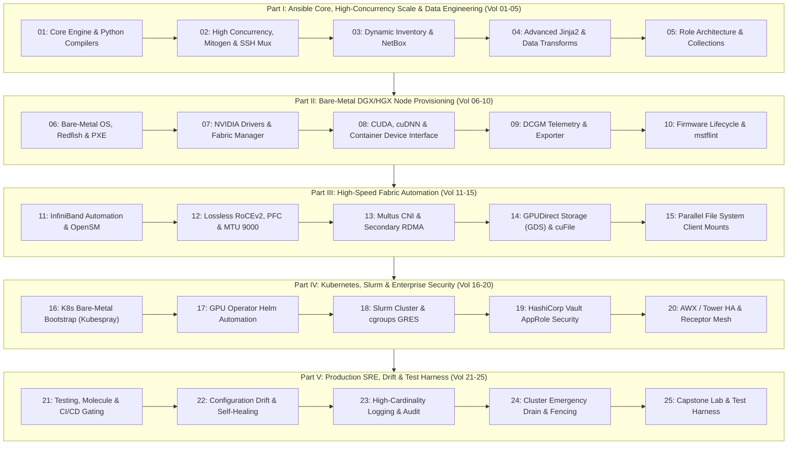

# Module 01: Ansible & Bare-Metal AI Infrastructure Automation

```
====================================================================================================
MODULE 01: ANSIBLE & BARE-METAL AI INFRASTRUCTURE AUTOMATION
HYPERSCALE GPU CLUSTER PROVISIONING, FABRIC ORCHESTRATION & SYSTEMS DRIFT FORENSICS
====================================================================================================
```

## Executive Overview & Architectural Mission

In modern AI supercomputing (clusters operating hundreds to tens of thousands of NVIDIA H100, H200, B200, and GB200 NVL72 accelerators), manual node management is impossible. An AI supercomputer is not an arbitrary collection of servers; it is a single, unified, synchronous, tightly coupled distributed computer. A single node with an out-of-spec Linux kernel setting (`intel_iommu=off` instead of `iommu=pt`), a misaligned PCIe ASPM power state, an unpinned GPU Fabric Manager version, a dropped MTU on a RoCEv2 secondary interface, or an uninstalled GPUDirect Storage kernel module (`nvidia-fs.ko`) will bottleneck or crash an entire distributed foundation model pre-training run.

**Module 01: Ansible & Bare-Metal AI Infrastructure Automation** delivers the complete, production-grade automation fabric required to provision, configure, harden, and monitor enterprise AI infrastructure from bare metal to distributed training runtimes.

---

## 4-Dimensional AI Infrastructure Automation Matrix

```
+-------------------------------------------------------------------------------------------------------------------------+
|                                    THE 4-DIMENSIONAL ANSIBLE AUTOMATION MATRIX                                          |
+----------------------+--------------------------+---------------------------+-------------------------------------------+
| Dimension            | Managed Entities         | Protocols / Low-Level APIs| Automation Mechanism & Core Ansible Engine|
+----------------------+--------------------------+---------------------------+-------------------------------------------+
| 1. Bare-Metal Silicon| CPUs, GPUs, NVSwitches,  | Redfish REST, IPMI KCS,   | Ansible redfish_* modules, raw MFT        |
|    & Firmware        | PCIe Retimers, NVLink    | PCIe VDM, mstflint        | mstflint tasks, BMC lifecycle hooks       |
+----------------------+--------------------------+---------------------------+-------------------------------------------+
| 2. Kernel & Low-Level| Linux VFS, Page Cache,   | sysfs, sysctl, procfs,    | lineinfile, template, modprobe, udev,     |
|    Drivers           | nvidia.ko, nvidia-fs.ko  | DKMS, systemd D-Bus       | ansible.posix.sysctl, Mitogen accelerator |
+----------------------+--------------------------+---------------------------+-------------------------------------------+
| 3. High-Speed Network| InfiniBand Quantum-2,    | IB Verbs, Netplan,        | ansible.netcommon, nmcli, openfabrics,    |
|    Fabrics           | RoCEv2, PFC, ECN, MTU    | mlnx_qos, ethtool, OpenSM | template /etc/network/interfaces          |
+----------------------+--------------------------+---------------------------+-------------------------------------------+
| 4. Distributed AI    | Kubernetes (K8s), Slurm, | Docker/containerd gRPC,   | kubernetes.core, helm, custom Slurm roles,|
|    Workload Runtimes | DCGM, HashiCorp Vault    | Slurmctld REST, Vault API | community.hashi_vault lookup plugins      |
+----------------------+--------------------------+---------------------------+-------------------------------------------+
```

---

## 5-Part Architectural Blueprint



---

## 25-Volume Curriculum Index

### Part I: Ansible Core, High-Concurrency Scale & Data Engineering
- [x] **Volume 01:** [Core Engine, Execution Internals & Python Compilers](01-ansible-core-engine-and-execution-internals.md)
- [x] **Volume 02:** [High-Concurrency Scale Tuning: Mitogen, ControlMaster & Fork Physics](02-high-concurrency-tuning-mitogen-and-ssh-mux.md)
- [x] **Volume 03:** [Dynamic Inventory Architecture: NetBox, Slurm, Cloud & Python Plugins](03-dynamic-inventory-and-cloud-infrastructure.md)
- [x] **Volume 04:** [Advanced Jinja2 Filters, JMESPath Queries & Data Transformation](04-advanced-jinja2-filters-and-data-transforms.md)
- [x] **Volume 05:** [Enterprise Role Architecture, Collections & Execution Environments](05-role-architecture-collections-and-galaxy.md)

### Part II: Bare-Metal DGX/HGX Node Provisioning & Silicon Foundation
- [x] **Volume 06:** [Bare-Metal OS Provisioning, Redfish API, IOMMU & Kernel Hugepages](06-bare-metal-os-provisioning-pxe-and-redfish.md)
- [x] **Volume 07:** [NVIDIA Open Kernel Drivers, Fabric Manager & GSP Firmware](07-nvidia-driver-and-fabric-manager-automation.md)
- [x] **Volume 08:** [CUDA Toolkit, cuDNN & Container Device Interface (CDI) Automation](08-cuda-toolkit-cudnn-and-container-runtime.md)
- [x] **Volume 09:** [Data Center GPU Manager (DCGM) & System Telemetry Orchestration](09-dcgm-telemetry-and-exporter-orchestration.md)
- [x] **Volume 10:** [Firmware Lifecycle: Mellanox MFT, mstflint, NVLink Retimers & Retries](10-firmware-lifecycle-and-gpu-vulnerability-patch.md)

### Part III: High-Speed Fabric Automation (InfiniBand, RoCEv2 & RDMA)
- [x] **Volume 11:** [InfiniBand Fabric Automation: MOFED, OpenSM, PKeys & IPoIB](11-infiniband-fabric-automation-and-opensm.md)
- [x] **Volume 12:** [Lossless RoCEv2 Network Tuning: PFC Priority 3, ECN & MTU 9000](12-lossless-rocev2-and-pfc-switch-host-tuning.md)
- [x] **Volume 13:** [Multus CNI, Secondary RDMA Networks & Macvlan Automation](13-multus-cni-and-secondary-rdma-networking.md)
- [x] **Volume 14:** [GPUDirect Storage (GDS) Provisioning: nvidia-fs.ko & cufile.json](14-gpudirect-storage-gds-and-cufile-provisioning.md)
- [x] **Volume 15:** [Parallel File System Client Orchestration: WekaFS, VAST & Lustre](15-parallel-file-system-client-orchestration.md)

### Part IV: Kubernetes, Slurm & Enterprise Security Orchestration
- [x] **Volume 16:** [Kubernetes Bare-Metal Bootstrapping on DGX/HGX with Kubespray](16-kubernetes-bare-metal-bootstrap-kubespray.md)
- [x] **Volume 17:** [NVIDIA GPU Operator & Network Operator Helm Automation](17-nvidia-gpu-operator-helm-automation.md)
- [x] **Volume 18:** [Slurm Workload Manager Orchestration & cgroup GPU Confinement](18-slurm-cluster-orchestration-and-cgroup-gpus.md)
- [x] **Volume 19:** [HashiCorp Vault Integration: AppRole, Dynamic Secrets & Auto-Unseal](19-hashicorp-vault-approle-and-dynamic-secrets.md)
- [x] **Volume 20:** [AWX / Ansible Automation Platform: HA Clustered Receptor Mesh](20-awx-tower-production-cluster-and-receptor.md)

### Part V: Production SRE, Drift Detection, Testing & Test Harness
- [x] **Volume 21:** [Automated Testing: Molecule, Testinfra, yamllint & ansible-lint CI](21-ansible-testing-linting-and-molecule.md)
- [x] **Volume 22:** [Configuration Drift Detection, State Audit & Automated Self-Healing](22-configuration-drift-detection-and-self-healing.md)
- [x] **Volume 23:** [High-Cardinality Logging, ARA Records & Enterprise Audit Trails](23-high-cardinality-logging-and-audit-compliance.md)
- [x] **Volume 24:** [Cluster-Wide Emergency Drain, Node Fencing & XID Remediation](24-cluster-wide-emergency-drain-and-remediation.md)
- [x] **Volume 25:** [Hands-On Ansible Mastery Lab & Automated Verification Test Harness](25-hands-on-ansible-mastery-lab-and-test-harness.md)

---

## Production Tooling & Verification Suite

1. **Automated Verification Harness:** [`ansible_systems_mastery_harness.py`](ansible_systems_mastery_harness.py)
   - Executes 25 algorithmic and structural assertions verifying inventory logic, Jinja2 filtering, Mitogen concurrency math, Redfish payloads, driver dependencies, RoCEv2 configurations, and drift detection.
2. **Production Drift & Forensic Auditor:** [`cluster_ansible_drift_detector.py`](cluster_ansible_drift_detector.py)
   - Real-time SRE CLI auditing node kernel flags, NVIDIA driver states, InfiniBand links, MTU settings, and configuration drift.
