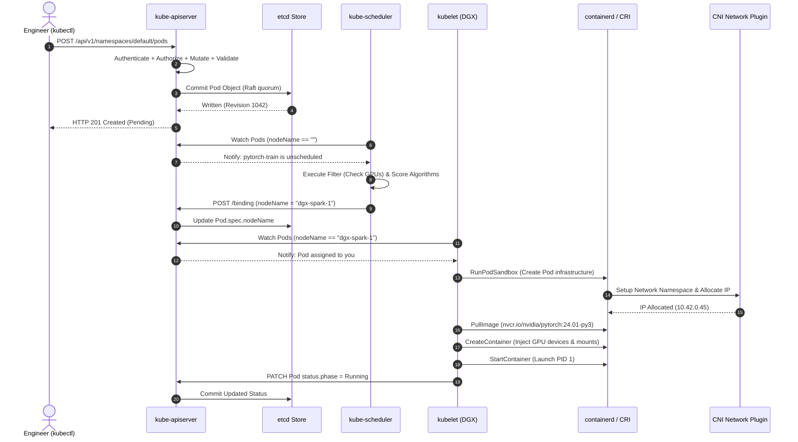

# 01. Kubernetes Core Architecture & Pod Lifecycle

This guide provides an architectural deep dive into Kubernetes internal mechanics, component decoupling, and the end-to-end lifecycle of a Pod from API submission to container execution on physical hardware.

---

## 📑 Table of Contents
1. [Deconstructing Kubernetes Architecture](#1-deconstructing-kubernetes-architecture)
2. [The Control Plane Subsystem](#2-the-control-plane-subsystem)
3. [The Worker Node Subsystem](#3-the-worker-node-subsystem)
4. [Container Runtime Architecture: CRI, containerd & runc](#4-container-runtime-architecture-cri-containerd--runc)
5. [End-to-End Pod Lifecycle: What Happens When You Run `kubectl apply`?](#5-end-to-end-pod-lifecycle-what-happens-when-you-run-kubectl-apply)
6. [Architectural Sequence Diagram](#6-architectural-sequence-diagram)
7. [Production Failure & Diagnostic Scenarios](#7-production-failure--diagnostic-scenarios)
8. [Hands-On Architectural Inspection Labs](#8-hands-on-architectural-inspection-labs)

---

## 1. Deconstructing Kubernetes Architecture

Kubernetes is a declarative, distributed, active-reconciliation platform. Unlike imperative orchestration systems that execute sequential scripts, Kubernetes continuously computes the delta between:
- **Desired State**: Stored immutably as JSON documents in `etcd`.
- **Observed State**: Reported periodically by worker node agents (`kubelet`).

```text
+-----------------------------------------------------------------------------------+
|                              Kubernetes Cluster Boundary                          |
|                                                                                   |
|  +-----------------------------------------------------------------------------+  |
|  |                             Control Plane (Master)                          |  |
|  |                                                                             |  |
|  |      [ kube-apiserver ] <=========> [ etcd Key-Value Store (v3) ]           |  |
|  |             ^                                                               |  |
|  |             |                                                               |  |
|  |      +------+------+                                                        |  |
|  |      |             |                                                        |  |
|  |      v             v                                                        |  |
|  | [ kube-scheduler ] [ kube-controller-manager ]                              |  |
|  +-----------------------------------------------------------------------------+  |
|         |                                                             |           |
|         | mTLS (Port 10250)                                           | mTLS      |
|         v                                                             v           |
|  +-------------------------------+             +-------------------------------+  |
|  |     Worker Node 1 (DGX)       |             |     Worker Node 2 (DGX)       |  |
|  | [ kubelet ]                   |             | [ kubelet ]                   |  |
|  | [ kube-proxy ]                |             | [ kube-proxy ]                |  |
|  | [ containerd (CRI) ]          |             | [ containerd (CRI) ]          |  |
|  | [ NVIDIA Device Plugin ]      |             | [ NVIDIA Device Plugin ]      |  |
|  | ─── Pod A   ─── Pod B         |             | ─── Pod C   ─── Pod D         |  |
|  +-------------------------------+             +-------------------------------+  |
+-----------------------------------------------------------------------------------+
```

---

## 2. The Control Plane Subsystem

### 2.1 `kube-apiserver`
The central nervous system of Kubernetes. It is the **only** component in the entire cluster that communicates directly with `etcd`. All other components (scheduler, controller-manager, kubelet, kubectl) communicate exclusively with the API server over secure HTTPS/mTLS.
- **Stateless**: Can be horizontally scaled behind a Layer 4/Layer 7 load balancer.
- **Pipeline Processing**: Every request traverses Authentication -> Authorization -> Mutation Webhooks -> Schema Validation -> Validation Webhooks -> Storage in etcd.

### 2.2 `etcd`
A distributed, consistent, transactional key-value database implementing the **Raft consensus algorithm**.
- Stores the entire cluster state under the `/registry` keyspace (e.g. `/registry/pods/default/my-pod`).
- Uses MVCC (Multi-Version Concurrency Control): Edits do not overwrite records in place; they create new revisions with monotonic sequence IDs, enabling change notifications via the `Watch` API.

### 2.3 `kube-scheduler`
A specialized loop that watches for Pods with `spec.nodeName == ""` (unscheduled pods).
- Executes a two-phase filtering and scoring algorithm:
  1. **Filtering (Predicates)**: Discards nodes lacking resources (insufficient CPU, RAM, or `nvidia.com/gpu`), nodes with conflicting taints, or nodes with unfulfilled nodeAffinity.
  2. **Scoring (Priorities)**: Ranks surviving candidate nodes to optimize for balanced resource utilization, image locality, and topology spread.
- Updates the Pod specification with `spec.nodeName = <selected-node>` via a `Binding` API call.

### 2.4 `kube-controller-manager`
A monolithic binary packing dozens of distinct control loops into a single process. Each controller continuously executes the **Reconciliation Loop**:
$$\text{Delta} = \text{Desired State (Spec)} - \text{Observed State (Status)}$$
If $\text{Delta} \neq 0$, the controller issues API calls to drive the cluster toward the desired state.
- **Node Controller**: Detects node crashes (heartbeat timeout via NodeLease).
- **Deployment Controller**: Reconciles Deployments into ReplicaSets.
- **ReplicaSet Controller**: Reconciles ReplicaSets into Pods.
- **EndpointSlice Controller**: Keeps Service backend IP addresses synchronized with active Pod IPs.

---

## 3. The Worker Node Subsystem

### 3.1 `kubelet`
The primary daemon running on every worker node.
- Registers the node with the control plane, reporting its capacity (CPU cores, memory, allocatable storage, and custom resources like `nvidia.com/gpu`).
- Maintains a local cache of Pods assigned to this node (`PodWorker` goroutines).
- Communicates with the local container runtime via gRPC over the **CRI (Container Runtime Interface)** Unix socket.
- Executes periodic Liveness, Readiness, and Startup probes.
- Issues NodeLease renewals (every 10 seconds) to notify the control plane that the node is healthy.

### 3.2 `kube-proxy`
The node-level network programmer. It watches Services and Endpoints/EndpointSlices and programs local kernel packet filtering rules (`iptables` chains or `IPVS` hash tables) to direct virtual Service IPs to backend Pod IPs.

---

## 4. Container Runtime Architecture: CRI, containerd & runc

Modern Kubernetes decouples the container engine from Kubernetes core via the **Container Runtime Interface (CRI)**:

```text
+-----------------------------------------------------------------------------------+
| Kubelet                                                                           |
|   │ gRPC over /run/containerd/containerd.sock (CRI API)                           |
v   v                                                                               |
| containerd Daemon                                                                 |
|   │ Fetches OCI images, unpacks rootfs layers, sets up overlayfs                  |
|   │ Manages CNI network namespace plugins                                         |
v   v                                                                               |
| containerd-shim (one process per pod/container)                                  |
|   │ Decouples daemon restarts from container lifecycle                           |
|   │ Holds PTY, stdout/stderr pipes, and exit codes open                           |
v   v                                                                               |
| runc (Low-level OCI Runtime) / nvidia-container-runtime                           |
|   │ Invokes Linux syscalls: `clone()` (namespaces), `unshare()`, `setns()`        |
|   │ Configures `/sys/fs/cgroup/` (limits CPU, RAM, block I/O)                     |
|   │ Injects NVIDIA device nodes (`/dev/nvidia*`)                                  |
|   │ Executes `execve()` to launch container PID 1                                 |
+-----------------------------------------------------------------------------------+
```

---

## 5. End-to-End Pod Lifecycle: What Happens When You Run `kubectl apply`?

Trace the lifecycle of a GPU workload from command execution to running code:

```bash
kubectl apply -f pytorch-train.yaml
```

1. **Client-side Parsing**: `kubectl` parses YAML into a JSON payload, validates the client-side schema against OpenAPI specs, attaches client certificate credentials (`~/.kube/config`), and sends an `HTTP POST` request to `/api/v1/namespaces/default/pods`.
2. **Authentication & Authorization**: `kube-apiserver` verifies the client's mTLS certificate or Bearer Token. It queries RBAC policies to verify if the user has `create` permissions on `pods`.
3. **Admission Controllers**:
   - **Mutating Webhooks**: Inject default parameters (e.g. Istio sidecars, security contexts, default `LimitRange` requests).
   - **Validating Webhooks**: Confirm syntax, verify resource limits, and enforce security policies (rejecting privileged pods if prohibited).
4. **ETCD Persistence**: The validated Pod is serialized and committed to `etcd` under `/registry/pods/default/pytorch-train` via Raft quorum consensus. The API server returns `HTTP 201 Created` to `kubectl`.
5. **Scheduler Detection**: `kube-scheduler` watches the API server via an HTTP chunked stream (`Watch`). It detects a new Pod where `spec.nodeName` is empty.
6. **Filtering & Scoring**:
   - Filter: Node 1 has `nvidia.com/gpu: 1` available; Node 2 has `nvidia.com/gpu: 0`. Node 2 is discarded.
   - Score: Node 1 scores highest.
   - Scheduler posts a `Binding` object: `spec.nodeName = dgx-spark-1`.
7. **Kubelet Acquisition**: The `kubelet` on `dgx-spark-1` has an active `Watch` on pods assigned to its hostname. It detects the assignment and spawns a `PodWorker`.
8. **CRI Sandbox Creation**:
   - `kubelet` calls `RunPodSandbox` over CRI gRPC to `containerd`.
   - `containerd` creates the network namespace and invokes the **CNI plugin** (Flannel/Calico/Cilium) to allocate an IP address and attach a virtual ethernet pair (`veth`).
9. **CSI Volume Attachment**:
   - `kubelet` mounts requested `PersistentVolumes` and projected volumes (Secrets, ConfigMaps, ServiceAccount tokens) into host mount directories.
10. **Container Execution**:
    - `kubelet` calls `CreateContainer` and `StartContainer`.
    - `containerd` launches `nvidia-container-runtime`.
    - NVIDIA hook exposes `/dev/nvidia0` and `/dev/nvidia-uvm` to the container.
    - Application entrypoint process starts (`python3 train.py`).
11. **Status Update**: `kubelet` observes container PID start, collects container ID, and sends a patch request updating `status.phase = Running` to the API server.

---

## 6. Architectural Sequence Diagram



---

## 7. Production Failure & Diagnostic Scenarios

### Scenario 1: Pod Stuck in `Pending` Indefinitely
- **Root Cause**: The `kube-scheduler` cannot find any node satisfying the Pod's constraints.
- **Triage Command**:
  ```bash
  kubectl describe pod <pod-name>
  ```
- **Diagnostic Output**:
  ```text
  Events:
    Type     Reason            Age   From               Message
    ----     ------            ----  ----               -------
    Warning  FailedScheduling  12s   default-scheduler  0/1 nodes are available: 1 Insufficient nvidia.com/gpu.
  ```
- **Resolution**:
  1. Inspect available GPU capacity on nodes:
     ```bash
     kubectl get nodes -o custom-columns=NAME:.metadata.name,GPU_ALLOCATABLE:.status.allocatable.'nvidia\.com/gpu'
     ```
  2. If the physical GPU is fully allocated, enable **GPU Time-Slicing** in the NVIDIA Device Plugin (see Guide 03).

---

### Scenario 2: Node State is `NotReady`
- **Root Cause**: `kubelet` has stopped reporting node heartbeats (`NodeLease`) to the API server due to process crash, network partition, or disk saturation.
- **Triage Commands**:
  ```bash
  # 1. Inspect Node status on control plane
  kubectl describe node dgx-spark-1
  
  # 2. SSH into the node and inspect kubelet daemon logs
  sudo journalctl -u kubelet -n 100 --no-pager
  
  # 3. Check container runtime status
  sudo systemctl status containerd
  ```
- **Common Resolutions**:
  - `containerd` hung on zombie process: `sudo systemctl restart containerd && sudo systemctl restart kubelet`.
  - Root disk full (DiskPressure taint): `df -h /` and prune stale images via `crictl rmi --prune`.

---

## 8. Hands-On Architectural Inspection Labs

### Lab 1: Trace the Raw etcd Storage of a Pod
Inspect how Kubernetes objects are actually serialized inside `etcd`.

```bash
# If using K3s, install etcdctl or query the sqlite/k3s datastore:
sudo k3s kubectl get pod pytorch-benchmark -n k3s-alpha -o json
```
Notice how every detail (annotations, default service account tokens, status conditions) is stored as a single schema object.

### Lab 2: Inspect Low-Level CRI State via `crictl`
The `crictl` utility communicates directly with `containerd` via the CRI socket, bypassing the Kubernetes API server entirely.

```bash
# List all running CRI pods on the host:
sudo crictl pods

# List running containers:
sudo crictl ps

# Inspect low-level Linux process metadata of a container:
CONTAINER_ID=$(sudo crictl ps --name pytorch -q)
sudo crictl inspect $CONTAINER_ID | jq '.info.pid, .info.runtimeSpec.linux.namespaces'
```
*Observe the host PID allocated to the container and the isolated Linux namespaces assigned by the kernel.*

---

Proceed to [**02-kube-apiserver-internals.md**](02-kube-apiserver-internals.md) for a deep dive into API Server authentication, admission controllers, Webhooks, and API Priority & Fairness.
