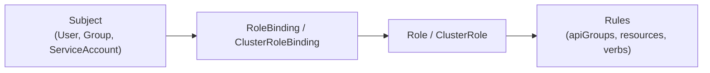
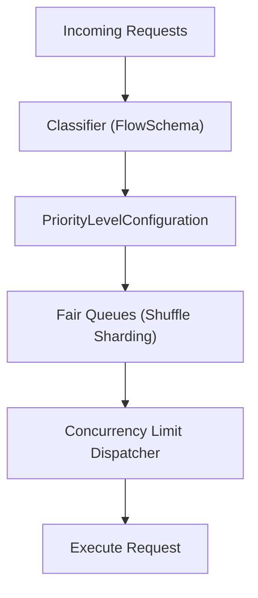

# 02. Kube-API Server Internals — Request Processing, Security & Admission

The **`kube-apiserver`** is the gateway to the Kubernetes cluster. It is the only component that directly mutates and queries the cluster's persistent datastore (`etcd`).

This guide details the request processing pipeline, authentication protocols, Role-Based Access Control (RBAC), admission webhooks, and modern traffic management via API Priority and Fairness (APF).

---

## 📑 Table of Contents
1. [API Server Architectural Pipeline](#1-api-server-architectural-pipeline)
2. [Authentication Layer (AuthN)](#2-authentication-layer-authn)
3. [Authorization Layer (AuthZ) & RBAC](#3-authorization-layer-authz--rbac)
4. [Admission Controllers: Mutating & Validating Webhooks](#4-admission-controllers-mutating--validating-webhooks)
5. [API Priority and Fairness (APF)](#5-api-priority-and-fairness-apf)
6. [Serialization, Versions & etcd Storage Translation](#6-serialization-versions--etcd-storage-translation)
7. [Production Failure Scenarios & Troubleshooting](#7-production-failure-scenarios--troubleshooting)
8. [Hands-On Security & RBAC Labs](#8-hands-on-security--rbac-labs)

---

## 1. API Server Architectural Pipeline

Every HTTP request sent to `kube-apiserver` (whether from `kubectl`, a worker `kubelet`, or an automated controller) passes through an orderly pipeline:

```text
Incoming HTTPS Request (Port 6443)
       │
       ▼
+─────────────────────────────────────────────────────────────+
| 1. Filter Chain (Handlers)                                  |
|    - Request Timeout & Panic Recovery                       |
|    - CORS & WithAudit logging                               |
|    - Authentication Filter (Identifies User, Groups, UID)   |
|    - Impersonation Filter (sudo for K8s)                    |
+─────────────────────────────────────────────────────────────+
       │ (User identified: e.g. "developer", Groups: ["devs"])
       ▼
+─────────────────────────────────────────────────────────────+
| 2. Authorization Layer (AuthZ)                              |
|    - Node Authorizer (Validates worker node identity)       |
|    - RBAC Engine (Evaluates Roles & ClusterRoleBindings)    |
|    - Webhook Authorizer (External policy engines)           |
+─────────────────────────────────────────────────────────────+
       │ (Authorized: Can "create" "pods" in "default")
       ▼
+─────────────────────────────────────────────────────────────+
| 3. Mutating Admission Controllers                           |
|    - NamespaceLifecycle, LimitRanger (Injects defaults)     |
|    - MutatingAdmissionWebhook (External webhooks mutate JSON|
+─────────────────────────────────────────────────────────────+
       │ (Object mutated, defaults injected)
       ▼
+─────────────────────────────────────────────────────────────+
| 4. Schema Validation                                        |
|    - Structural validation against OpenAPI v3 specifications|
|    - Immutability checks (certain fields cannot change)     |
+─────────────────────────────────────────────────────────────+
       │
       ▼
+─────────────────────────────────────────────────────────────+
| 5. Validating Admission Controllers                         |
|    - ResourceQuota (Checks if namespace has quota available)|
|    - ValidatingAdmissionWebhook (OPA Gatekeeper, Kyverno)   |
+─────────────────────────────────────────────────────────────+
       │ (Validated: All checks passed)
       ▼
+─────────────────────────────────────────────────────────────+
| 6. Storage & ETCD Persistence                               |
|    - Conversion to Internal Version                         |
|    - Protobuf / JSON serialization                          |
|    - Atomic commit to `etcd` (writes revision)              |
+─────────────────────────────────────────────────────────────+
```

---

## 2. Authentication Layer (AuthN)

Kubernetes does **not** store human user accounts in `etcd`. It delegates user management to external identity systems. It supports several authentication strategies evaluated in order:

### 2.1 Authentication Strategies
1. **X.509 Client Certificates (mTLS)**:
   - Primary method used for cluster administrators, `kubelet`, and internal control plane components.
   - The user's Common Name (`CN`) becomes the Kubernetes username.
   - Organization (`O`) attributes become the user's groups.
   - *Example*: `CN=dgxadmin, O=ai-engineers, O=system:authenticated`.
2. **OpenID Connect (OIDC) Tokens**:
   - Industry standard for enterprise identity (Okta, Keycloak, Google Workspace, Azure AD).
   - Client sends an OAuth `id_token` (JWT) in the `Authorization: Bearer <token>` header.
3. **ServiceAccount Tokens (JSON Web Tokens - JWT)**:
   - Used by processes running inside Pods.
   - Projected into containers at `/var/run/secrets/kubernetes.io/serviceaccount/token`.
   - Signed by the API Server's private key (`--service-account-key-file`) and verified with its public key.

---

## 3. Authorization Layer (AuthZ) & RBAC

Once a request is authenticated, the authorization engine determines if the user has permission to perform the requested verb on the requested resource.

### 3.1 The RBAC Matrix



| Primitive | Scope | Purpose |
| :--- | :--- | :--- |
| **`Role`** | Single Namespace | Defines permissions within a specific namespace (e.g. read pods in `k3s-alpha`). |
| **`ClusterRole`** | Entire Cluster | Defines permissions spanning all namespaces or cluster-scoped objects (Nodes, PersistentVolumes, Namespaces). |
| **`RoleBinding`** | Single Namespace | Binds a Subject (User/Group/ServiceAccount) to a Role or ClusterRole within that namespace. |
| **`ClusterRoleBinding`**| Entire Cluster | Grants cluster-wide permissions across all namespaces. |

### 3.2 Production RBAC Manifest: AI Infrastructure Engineer
Create a restricted role for an AI developer that allows full control over training jobs, logs, and PVCs, but prevents deleting namespaces or modifying quotas:

```yaml
apiVersion: rbac.authorization.k8s.io/v1
kind: Role
metadata:
  name: ai-workload-operator
  namespace: k3s-alpha
rules:
  # Pods, Services, PVCs
  - apiGroups: [""]
    resources: ["pods", "pods/log", "pods/exec", "services", "persistentvolumeclaims"]
    verbs: ["get", "list", "watch", "create", "update", "delete"]
  # Batch Training Jobs
  - apiGroups: ["batch"]
    resources: ["jobs", "cronjobs"]
    verbs: ["get", "list", "watch", "create", "delete"]
  # Prevent tampering with ResourceQuotas or LimitRanges
  - apiGroups: [""]
    resources: ["resourcequotas", "limitranges"]
    verbs: ["get", "list", "watch"] # Read-only!
---
apiVersion: rbac.authorization.k8s.io/v1
kind: RoleBinding
metadata:
  name: bind-ai-engineer
  namespace: k3s-alpha
subjects:
  - kind: User
    name: "dgxadmin"
    apiGroup: rbac.authorization.k8s.io
roleRef:
  kind: Role
  name: ai-workload-operator
  apiGroup: rbac.authorization.k8s.io
```

---

## 4. Admission Controllers: Mutating & Validating Webhooks

Admission controllers intercept requests **after** authorization but **before** objects are written to `etcd`.

```text
              [ Mutating Webhook ]                [ Validating Webhook ]
                     │                                     │
Request ──> Inject Defaults / Labels ──> Validate Schema ──> Enforce Security / ──> etcd
            (e.g., add limit defaults)                       Deny Unapproved GPUs
```

### 4.1 Mutating Admission Webhook
- Can alter the incoming object.
- **AI Use Case**: Automatically injecting `resources.limits.nvidia.com/gpu: 1` or mounting a shared model checkpoint directory to any pod with the label `ai-training=true`.

### 4.2 Validating Admission Webhook
- Can only accept or reject the object; cannot modify it.
- **AI Infrastructure Use Case**: Rejecting any pod that requests an unapproved container image registry (e.g. blocking unknown registries and allowing only `nvcr.io` or corporate registries).

#### Validating Webhook Manifest (`gpu-policy-webhook.yaml`)
```yaml
apiVersion: admissionregistration.k8s.io/v1
kind: ValidatingWebhookConfiguration
metadata:
  name: enforce-gpu-policy
webhooks:
  - name: gpu-policy.datacenter.internal
    rules:
      - apiGroups: [""]
        apiVersions: ["v1"]
        operations: ["CREATE"]
        resources: ["pods"]
        scope: "Namespaced"
    clientConfig:
      service:
        name: policy-enforcer-svc
        namespace: kube-system
        path: "/validate-gpu-spec"
      caBundle: "LS0tLS1CRUdJTiBDRVJUSUZJQ0FURS0tLS0t..."
    admissionReviewVersions: ["v1"]
    sideEffects: None
    timeoutSeconds: 3
    failurePolicy: Fail # Reject pod if webhook server is unreachable
```

---

## 5. API Priority and Fairness (APF)

In large clusters, if hundreds of misconfigured batch jobs or monitoring scripts flood the API server with requests, they can exhaust the server's thread pool, starving critical `kubelet` heartbeats and crashing the cluster.

**API Priority and Fairness (APF)** solves this by replacing the simple max-in-flight limit with a fair-share queueing system:



### Core APF Primitives:
1. **`FlowSchema`**: Classifies incoming requests into priority levels based on user, group, namespace, or API verb.
2. **`PriorityLevelConfiguration`**: Allocates a specific share of execution seats (concurrency units) to a flow.
   - Built-in levels: `exempt` (health checks), `system` (kubelet heartbeats), `workload-high`, `workload-low`.
3. **Shuffle Sharding**: Distributes requests across multiple queues within a priority level. If one user floods their queue, other users assigned to adjacent queues are completely unaffected.

---

## 6. Serialization, Versions & etcd Storage Translation

Kubernetes maintains API stability by decoupling the **external schema version** (`v1alpha1`, `v1beta1`, `v1`) from the **internal representation**:

```text
External Request (v1beta1 Pod) 
       │
       ▼ (Decoded into memory)
Internal Version (Unversioned Go struct representing all unioned fields)
       │
       ▼ (Encoded into storage version)
Storage Version in etcd (v1 JSON or Protobuf)
```

- When you write an object as `v1beta1`, it is converted in memory to the internal schema, and then encoded into the preferred storage version before writing to `etcd`.
- When another client reads the object as `v1`, the API server automatically converts it on-the-fly.

---

## 7. Production Failure Scenarios & Troubleshooting

### Scenario 1: `HTTP 403 Forbidden` on Pod Deployment
- **Symptom**: User tries to run a pod and receives:
  ```text
  Error from server (Forbidden): pods is forbidden: User "developer" cannot create resource "pods" in API group "" in the namespace "k3s-alpha"
  ```
- **Diagnostic Command**: Test permissions using `kubectl auth can-i`:
  ```bash
  kubectl auth can-i create pods -n k3s-alpha --as=developer
  ```
- **Resolution**: Verify the user's `RoleBinding` matches their exact username or group. Check for namespace typos.

---

### Scenario 2: Webhook Timeout Causes Pod Creation to Hang (500 Internal Error)
- **Symptom**: Every `kubectl apply` hangs for 30 seconds and fails with:
  ```text
  Error from server (InternalError): Internal error occurred: failed calling webhook "gpu-policy.datacenter.internal": Post "https://...": context deadline exceeded
  ```
- **Root Cause**: The admission webhook pod has crashed, its backing service has no ready endpoints, or cluster network CNI is broken.
- **Emergency Recovery**:
  ```bash
  # List active validating webhooks
  kubectl get validatingwebhookconfigurations
  
  # Temporarily delete or change failurePolicy to Ignore to unblock the cluster
  kubectl delete validatingwebhookconfiguration enforce-gpu-policy
  ```

---

## 8. Hands-On Security & RBAC Labs

### Lab 1: Test Access Rules with `can-i`
The `can-i` sub-command allows an administrator to test authorization rules without logging in as that user:

```bash
# Check if admin can delete nodes
kubectl auth can-i delete nodes

# Check if a hypothetical developer can create pods in k3s-alpha:
kubectl auth can-i create pods -n k3s-alpha --as=developer

# Check if a developer can modify ResourceQuotas in k3s-alpha:
kubectl auth can-i update resourcequotas -n k3s-alpha --as=developer
```

### Lab 2: Inspect API Priority and Fairness Configuration
Inspect how the cluster categorizes traffic:

```bash
# List FlowSchemas:
kubectl get flowschemas

# Inspect the system-leader-election flow:
kubectl describe flowschema system-leader-election

# Inspect PriorityLevelConfigurations:
kubectl get prioritylevelconfigurations
```

---

Proceed to [**03-etcd-database-deep-dive.md**](03-etcd-database-deep-dive.md) to explore the `etcd` distributed consensus database, the Raft algorithm, snapshots, compaction, and disaster recovery.
