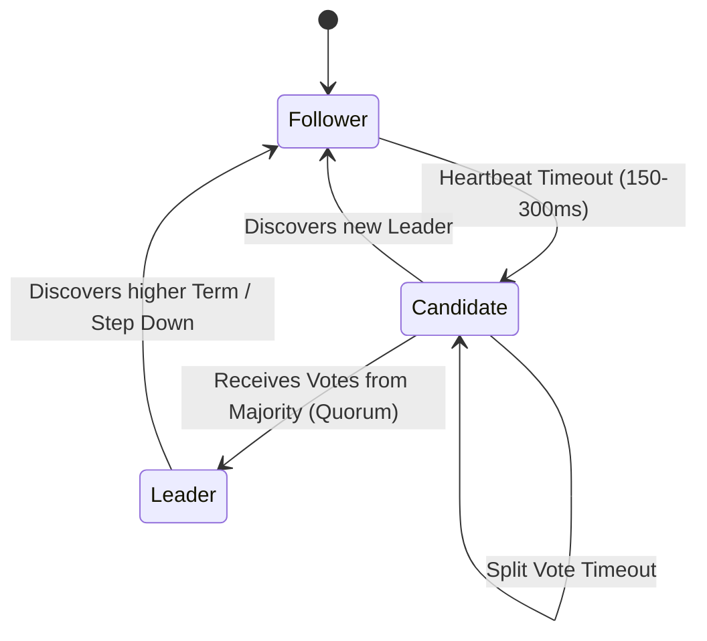

# 03. ETCD Database Deep Dive — Raft Consensus, Architecture & Disaster Recovery

The **`etcd`** database is the single source of truth in a Kubernetes cluster. Every Pod, Service, ConfigMap, and Node status is persisted within its distributed key-value store. If `etcd` loses quorum or suffers disk corruption, the entire Kubernetes control plane halts.

This guide details the Raft consensus protocol, internal storage engines (WAL and bbolt), maintenance procedures (compaction/defrag), and disaster recovery.

---

## 📑 Table of Contents
1. [What is etcd? Architecture & Role](#1-what-is-etcd-architecture--role)
2. [The Raft Consensus Protocol](#2-the-raft-consensus-protocol)
3. [Internal Storage Mechanics: WAL, bbolt & MVCC](#3-internal-storage-mechanics-wal-bbolt--mvcc)
4. [Keyspace Structure in Kubernetes](#4-keyspace-structure-in-kubernetes)
5. [Maintenance: Compaction, Defragmentation & Space Quotas](#5-maintenance-compaction-defragmentation--space-quotas)
6. [Backup, Snapshotting & Disaster Recovery](#6-backup-snapshotting--disaster-recovery)
7. [Production Failure Scenarios & High-Impact Troubleshooting](#7-production-failure-scenarios--high-impact-troubleshooting)
8. [Hands-On etcdctl Operational Labs](#8-hands-on-etcdctl-operational-labs)

---

## 1. What is etcd? Architecture & Role

`etcd` is an open-source, strongly consistent, distributed key-value store written in Go. In Kubernetes:
- It runs as a cluster of distributed members (typically 3 or 5 nodes for high availability).
- It provides linearizable reads and atomic transactions.
- It exposes a gRPC v3 API over TLS (port 2379 for client traffic, port 2380 for peer traffic).

```text
+-----------------------------------------------------------------------------------+
|                                 etcd 3-Node Cluster                               |
|                                                                                   |
|  +-------------------------+                     +-------------------------+      |
|  |     etcd-1 (Follower)   |    Peer Traffic     |      etcd-2 (Leader)    |      |
|  |   - In-memory B-tree    | <=================> |   - In-memory B-tree    |      |
|  |   - WAL on NVMe         |     (Port 2380)     |   - WAL on NVMe         |      |
|  |   - bbolt (db file)     |                     |   - bbolt (db file)     |      |
|  +-------------------------+                     +-------------------------+      |
|                \                                     /                            |
|                 \               Peer Traffic        /                             |
|                  +=================================+                              |
|                                         |                                         |
|                                         v                                         |
|                          +-------------------------+                              |
|                          |     etcd-3 (Follower)   |                              |
|                          |   - In-memory B-tree    |                              |
|                          |   - WAL on NVMe         |                              |
|                          |   - bbolt (db file)     |                              |
|                          +-------------------------+                              |
|                                       ▲                                           |
|                                       │ Client Traffic (mTLS Port 2379)           |
|                          +─────────────────────────+                              |
|                          |      kube-apiserver     |                              |
|                          +─────────────────────────+                              |
+-----------------------------------------------------------------------------------+
```

---

## 2. The Raft Consensus Protocol

Raft ensures that a distributed cluster reaches consensus on a sequence of log entries, even if some nodes fail.

### 2.1 Quorum Math
To survive failures, an etcd cluster must maintain a **Majority Quorum**:
$$\text{Quorum} = \left\lfloor \frac{N}{2} \right\rfloor + 1$$

| Cluster Size ($N$) | Quorum Needed | Fault Tolerance (Max Dead Nodes) | Why Even Numbers are Bad |
| :--- | :--- | :--- | :--- |
| **1** (Lab/K3s) | 1 | 0 nodes | Any failure stops the cluster. |
| **3** (Production) | 2 | **1 node** | Tolerates 1 node failure. |
| **4** | 3 | **1 node** | Still only tolerates 1 node failure, but requires 3 votes (strictly worse than 3 nodes!). |
| **5** (Enterprise) | 3 | **2 nodes** | Recommended for high-scale enterprise clusters. |

### 2.2 Leader Election & State Machine
Every node in the cluster exists in one of three states:
1. **Leader**: Handles all client writes. Replicates logs to followers. Emits periodic heartbeats.
2. **Follower**: Passive. Accepts log entries from the leader. If election timeout elapses without a heartbeat, becomes Candidate.
3. **Candidate**: Increments term, votes for itself, and broadcasts `RequestVote` RPCs to peers.



---

## 3. Internal Storage Mechanics: WAL, bbolt & MVCC

`etcd` maintains two distinct storage layers to guarantee both high performance and durability:

```text
Incoming Write Request (PUT /registry/pods/default/pytorch)
       │
       ▼
1. Append to Write-Ahead Log (WAL) on Disk
   ├── Buffered write
   └── Synchronous `fdatasync()` flush to physical NVMe block storage
       │
       ▼ (Once WAL is safely on disk, consensus is confirmed)
2. In-Memory Key Index (B-tree)
   └── Maps human keys to monotonic generation Revision Numbers
       │
       ▼
3. Backend Storage Engine: `bbolt`
   └── Copy-on-Write B+ Tree database file (`member/snap/db`)
       └── Written asynchronously in memory-mapped pages (mmap)
```

### 3.1 Write-Ahead Log (WAL)
Before any write is applied to memory or confirmed to the client, it is appended to the WAL file on disk and flushed with `fdatasync`.
- If the machine suddenly loses power, `etcd` restarts by reading the WAL from start to finish, restoring exact state with zero data loss.
- **Disk Latency Sensitivity**: Because `fdatasync` is synchronous, slow storage (> 10ms flush latency) immediately causes Raft heartbeats to miss their deadlines, triggering leader election storms.

### 3.2 Multi-Version Concurrency Control (MVCC)
In etcd v3, keys are never updated in place. Every mutation generates a monotonically increasing **64-bit Revision Number**.
- Key: `/registry/pods/default/pod-1`
- Revision 101: `CREATE` (Pod Pending)
- Revision 105: `UPDATE` (Pod Assigned to Node)
- Revision 110: `UPDATE` (Pod Running)
- Revision 120: `DELETE` (Pod Terminated - tombstone written)

This revision history allows the Kubernetes API server to execute the **`Watch`** API efficiently: clients ask for changes starting from a specific revision ID without polling.

---

## 4. Keyspace Structure in Kubernetes

The Kubernetes API server prefixes all resources under `/registry`:

```text
/registry
├── pods
│   ├── default
│   │   └── pytorch-worker
│   └── kube-system
│       └── coredns-xyz
├── services
│   └── endpoints
├── namespaces
│   ├── default
│   └── k3s-alpha
├── persistentvolumeclaims
│   └── k3s-alpha
│       └── data-volume-alpha
└── priorityclasses
```

---

## 5. Maintenance: Compaction, Defragmentation & Space Quotas

Because MVCC retains historical revisions for every update, the database file (`db`) continuously grows.

### 5.1 Compaction
Compaction permanently discards historical revisions older than a specified revision or window.
- The Kubernetes API Server automatically issues compaction commands every 5 minutes (`--etcd-compaction-interval=5m`).
- Compaction marks the pages inside `bbolt` as free, but **it does not shrink the physical database file size on disk**.

### 5.2 Space Quota & Database Alarms
`etcd` enforces a strict space quota (default **2 GiB**, recommended enterprise maximum **8 GiB**).
- If the physical file size exceeds this quota, `etcd` raises a cluster-wide **`NOSPACE` alarm**.
- When `NOSPACE` is active, **all write operations are rejected with HTTP 500 errors**. Only read and delete operations are permitted.

### 5.3 Defragmentation (`etcdctl defrag`)
Defragmentation rewrites the bbolt database into a contiguous sequence of pages, releasing freed space back to the underlying host filesystem.

```bash
# Defragment all cluster endpoints:
etcdctl defrag --cluster \
  --cacert=/etc/kubernetes/pki/etcd/ca.crt \
  --cert=/etc/kubernetes/pki/etcd/server.crt \
  --key=/etc/kubernetes/pki/etcd/server.key
```

---

## 6. Backup, Snapshotting & Disaster Recovery

Taking regular snapshots of `etcd` is the only guaranteed recovery method against ransomware, corrupted etcd databases, or accidental mass namespace deletions.

### 6.1 Creating a Point-In-Time Snapshot
```bash
ETCDCTL_API=3 etcdctl snapshot save /backup/etcd-snapshot-$(date +%Y%m%d_%H%M%S).db \
  --endpoints=https://127.0.0.1:2379 \
  --cacert=/etc/kubernetes/pki/etcd/ca.crt \
  --cert=/etc/kubernetes/pki/etcd/server.crt \
  --key=/etc/kubernetes/pki/etcd/server.key
```

### 6.2 Verifying Snapshot Integrity
Always verify a snapshot immediately after creation:
```bash
ETCDCTL_API=3 etcdctl snapshot status /backup/etcd-snapshot-latest.db -w table
```
*Expected Output:*
```text
+----------+----------+------------+------------+
|   HASH   | REVISION | TOTAL KEYS | TOTAL SIZE |
+----------+----------+------------+------------+
| 3c1a82f4 |    48291 |       2480 |     42 MB  |
+----------+----------+------------+------------+
```

### 6.3 Restoring an etcd Cluster from Snapshot
When disaster strikes:
1. Stop all control plane components (`systemctl stop k3s` or stop `kube-apiserver`).
2. Restore the database file to a fresh directory:
   ```bash
   ETCDCTL_API=3 etcdctl snapshot restore /backup/etcd-snapshot-latest.db \
     --data-dir=/var/lib/etcd-restored
   ```
3. Update the etcd data directory path to point to `/var/lib/etcd-restored`.
4. Restart etcd and the control plane.

---

## 7. Production Failure Scenarios & High-Impact Troubleshooting

### Scenario 1: `etcdserver: mvcc: database space exceeded` (Cluster Read-Only)
- **Symptom**: All `kubectl create` or `apply` commands fail.
- **Root Cause**: Database size reached the 2GB limit; `NOSPACE` alarm triggered.
- **Triage & Recovery Procedure**:
  ```bash
  # 1. Check alarm status
  etcdctl alarm list
  
  # 2. Find current revision number
  REV=$(etcdctl endpoint status --write-out="json" | jq '.[0].Status.header.revision')
  
  # 3. Compact historical revisions up to current
  etcdctl compact $REV
  
  # 4. Defragment database to reclaim disk space
  etcdctl defrag
  
  # 5. Clear the alarm
  etcdctl alarm disarm
  ```

---

### Scenario 2: `fdatasync took too long` & Leader Election Storms
- **Symptom**: `dmesg` or etcd logs show warnings:
  ```text
  apply request took too long (182ms)
  fdatasync took too long (45ms)
  failed to send out heartbeat on time
  ```
- **Root Cause**: The physical disk hosting etcd has high write latency (caused by competing processes like Docker image downloads or heavy logging).
- **Resolution**:
  - Always place etcd's data directory (`/var/lib/etcd` or `/var/lib/rancher/k3s/server/db`) on dedicated NVMe storage with guaranteed IOPS.
  - Set `ionice` priority on the etcd process: `ionice -c2 -n0 -p $(pgrep etcd)`.

---

## 8. Hands-On etcdctl Operational Labs

### Lab 1: Inspect Cluster Health and Endpoint Status
Run this on your control plane node:
```bash
ETCDCTL_API=3 etcdctl endpoint status -w table \
  --endpoints=https://127.0.0.1:2379 \
  --cacert=/etc/kubernetes/pki/etcd/ca.crt \
  --cert=/etc/kubernetes/pki/etcd/server.crt \
  --key=/etc/kubernetes/pki/etcd/server.key
```
*Observe the `IS LEADER` boolean, `DB SIZE`, and `IN USE` metrics.*

### Lab 2: Query Raw Keys from etcd
View the raw Kubernetes object keys stored inside:
```bash
# List all pods stored in etcd keyspace:
ETCDCTL_API=3 etcdctl get /registry/pods --prefix --keys-only

# Read the raw etcd metadata for a specific pod:
ETCDCTL_API=3 etcdctl get /registry/pods/k3s-alpha/pytorch-benchmark
```

---

Proceed to [**04-kube-controller-manager-and-controllers.md**](04-kube-controller-manager-and-controllers.md) to explore the reconciliation loop, Informers, Workqueues, and Custom Resource Controllers.
