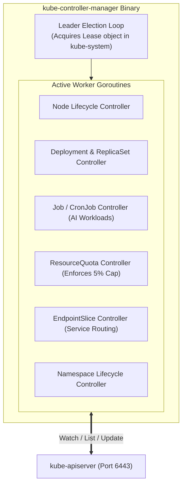

# 04. Kube-Controller Manager & Controllers — Reconciliation Loops & Informers

The **`kube-controller-manager`** is the chief orchestrator of state in Kubernetes. While the API server records what you want and the scheduler decides where pods should run, the controller manager makes sure the cluster actually reaches and maintains that state.

This guide explores the internal mechanics of reconciliation loops, client-go Informers, Workqueues, leader election, and custom controllers.

---

## 📑 Table of Contents
1. [Role & Architecture of the Controller Manager](#1-role--architecture-of-the-controller-manager)
2. [Leader Election & High Availability](#2-leader-election--high-availability)
3. [The Reconciliation Loop Pattern](#3-the-reconciliation-loop-pattern)
4. [Client-Go Architecture: Informers, Listers & Workqueues](#4-client-go-architecture-informers-listers--workqueues)
5. [Core Built-In Controllers Deep Dive](#5-core-built-in-controllers-deep-dive)
6. [Building Custom Controllers & Operators](#6-building-custom-controllers--operators)
7. [Production Failure Scenarios & Diagnostics](#7-production-failure-scenarios--diagnostics)
8. [Hands-On Controller Inspection Labs](#8-hands-on-controller-inspection-labs)

---

## 1. Role & Architecture of the Controller Manager

The `kube-controller-manager` is a single binary that embeds dozens of independent, concurrent control loops.

Each controller is responsible for a single aspect of cluster state:



---

## 2. Leader Election & High Availability

In a multi-master control plane (e.g. 3 control plane nodes), you cannot have 3 controller managers modifying resources at the same time; this would result in duplicate Pod creations and race conditions.

To prevent this, `kube-controller-manager` uses an active-passive leader election mechanism:
- All instances attempt to acquire a distributed lock implemented as a **`Lease`** object in the `kube-system` namespace.
- Only the instance that holds the lease is **Leader** and runs the controller loops.
- Followers sit idle in a tight loop, checking the lease every 2 seconds.
- If the leader crashes and fails to renew the lease within the renew deadline (default 10s), a follower claims the lease and assumes leadership.

Inspect the current leader lease:
```bash
kubectl get lease kube-controller-manager -n kube-system -o yaml
```

---

## 3. The Reconciliation Loop Pattern

Every controller in Kubernetes implements the **Reconciliation Loop**:

$$\text{Reconcile}(\text{Request}) \implies \text{Current State} \to \text{Desired State}$$

```text
+─────────────────────────────────────────────────────────────+
|                     Reconciliation Loop                     |
+─────────────────────────────────────────────────────────────+
                              │
                              ▼
           1. Observe Observed State (Read Cache/Lister)
                              │
                              ▼
           2. Retrieve Desired State (Read Spec from etcd)
                              │
                              ▼
           3. Compute Difference: Delta = Desired - Observed
                              │
                              ▼
           4. Take Corrective Action:
              - Delta > 0: Create resources (e.g., spawn Pod)
              - Delta < 0: Delete resources (e.g., kill Pod)
              - Delta == 0: Do nothing (System in equilibrium)
                              │
                              ▼
           5. Re-queue on Failure (Exponential Backoff)
```

**Key Rule**: Controllers are **edge-triggered and level-driven**. They react to events (edge), but re-verify the full cluster state (level) to guarantee eventual consistency even if network events were missed.

---

## 4. Client-Go Architecture: Informers, Listers & Workqueues

If every controller queried the API server directly every time it needed to inspect a Pod, the API server and `etcd` would collapse under read load.

Kubernetes solves this using the **`client-go` Informer Architecture**:

```text
API Server (Remote)
       │ HTTP Chunked Watch Stream
       ▼
+─────────────────────────────────────────────────────────────+
| Reflector: Establishes List & Watch connections             |
+─────────────────────────────────────────────────────────────+
       │ Pushes events
       ▼
+─────────────────────────────────────────────────────────────+
| DeltaFIFO Queue: Buffers object mutations (Added, Modified) |
+─────────────────────────────────────────────────────────────+
       │ Pops events
       ▼
+─────────────────────────────────────────────────────────────+
| Indexer (Local In-Memory Cache): Stores objects locally     |
|   └── Lister: Allows controllers to read from RAM with 0ms   |
|       latency without touching etcd                         |
+─────────────────────────────────────────────────────────────+
       │ Triggers Callbacks
       ▼
+─────────────────────────────────────────────────────────────+
| ResourceEventHandlerFuncs: OnAdd, OnUpdate, OnDelete        |
+─────────────────────────────────────────────────────────────+
       │ Pushes lightweight keys (e.g. "k3s-alpha/pytorch-job")|
       ▼
+─────────────────────────────────────────────────────────────+
| RateLimitingWorkqueue: Deduplicates and schedules keys      |
+─────────────────────────────────────────────────────────────+
       │
       ▼
Worker Goroutines (Execute Reconcile() logic)
```

---

## 5. Core Built-In Controllers Deep Dive

### 5.1 Deployment & ReplicaSet Controllers
The Deployment controller does **not** create Pods directly. It creates and updates **`ReplicaSets`**:
- When you update a Deployment's image from `v1` to `v2`:
  1. Deployment Controller creates `ReplicaSet-v2` with `replicas=1`.
  2. ReplicaSet Controller detects `desired=1, current=0` and creates Pod 1 (`v2`).
  3. Once Pod 1 is healthy, Deployment Controller scales down `ReplicaSet-v1` to `replicas=0`.

### 5.2 ResourceQuota Controller (Enforcing Your 5% Share)
This controller is critical to your multi-tenant DGX Spark setup.
- Watches all Pods, PVCs, and Services created in namespaces with an active `ResourceQuota`.
- Aggregates the total CPU, RAM, and Storage allocations.
- Writes back the current usage to `ResourceQuota.status.used`.
- If an incoming Pod causes `used + request > hard`, the admission controller rejects the Pod immediately.

### 5.3 Job & CronJob Controllers (AI Workloads)
- **Job Controller**: Manages run-to-completion batch tasks (e.g., training a neural network model for 100 epochs).
- Unlike Deployments (which restart pods if they exit with status 0), a Job treats exit code 0 as **Success** and transitions the Pod to `Completed` without restarting.

---

## 6. Building Custom Controllers & Operators

In modern AI platforms, custom operators automate complex lifecycle actions:
- **NVIDIA GPU Operator**: Manages driver containers and device plugins.
- **KubeFlow Training Operator**: Manages `PyTorchJob` and `TFJob` distributed training topologies.
- **KubeRay Operator**: Orchestrates Ray clusters on Kubernetes for distributed LLM fine-tuning.

### Minimal Custom Controller Loop in Go:
```go
func (r *Reconciler) Reconcile(ctx context.Context, req ctrl.Request) (ctrl.Result, error) {
    // 1. Fetch the custom resource from in-memory cache
    var job aiv1.TrainingJob
    if err := r.Get(ctx, req.NamespacedName, &job); err != nil {
        return ctrl.Result{}, client.IgnoreNotFound(err)
    }

    // 2. Inspect physical state: Check if backing PyTorch pod exists
    var pod corev1.Pod
    err := r.Get(ctx, types.NamespacedName{Name: job.Name + "-worker", Namespace: job.Namespace}, &pod)
    
    if errors.IsNotFound(err) {
        // 3. Desired != Observed: Spawn the GPU worker pod
        newPod := buildGPUPod(&job)
        if err := r.Create(ctx, newPod); err != nil {
            return ctrl.Result{RequeueAfter: 5 * time.Second}, err
        }
        return ctrl.Result{}, nil
    }

    // 4. Update status
    job.Status.Phase = string(pod.Status.Phase)
    r.Status().Update(ctx, &job)

    return ctrl.Result{}, nil
}
```

---

## 7. Production Failure Scenarios & Diagnostics

### Scenario 1: Controller Workqueue Thrashing (Hot Loop)
- **Symptom**: `kube-controller-manager` consumes 100% CPU on the control plane, and logs fill rapidly with retry warnings.
- **Root Cause**: A controller repeatedly encounters an error updating an object (e.g., conflicting resourceVersion: `OptimisticLockError`). It immediately re-enqueues the item without backoff.
- **Triage**:
  ```bash
  # Check controller manager logs for error loops
  kubectl logs -n kube-system kube-controller-manager-dgx-spark-1 | grep -i "re-queuing"
  ```
- **Resolution**: Verify that the controller uses a `RateLimitingQueue` with exponential backoff rather than immediate retries.

---

### Scenario 2: Stale Informer Cache (Ghost Object Deletion)
- **Symptom**: A controller recreates an object that the user explicitly deleted 5 seconds ago.
- **Root Cause**: The controller's local cache has not yet processed the `DELETE` watch event from `etcd`. When the reconciliation loop runs, its outdated Lister still sees the old object and re-issues a creation request.
- **Resolution**: Use deterministic finalizers (`metadata.finalizers`) to prevent premature object removal until controllers explicitly confirm cleanup.

---

## 8. Hands-On Controller Inspection Labs

### Lab 1: Inspect Active Leader Lock & Lease Renewals
```bash
# View current leader lease details:
kubectl describe lease kube-controller-manager -n kube-system
```
*Observe the `Holder Identity`, `Lease Duration (15s)`, and `Renew Time` timestamps updating every 2-5 seconds.*

### Lab 2: Watch Controller Reconciliation in Real Time
Open two terminal windows:
1. In Terminal 1, watch pod lifecycle events:
   ```bash
   kubectl get events -n k3s-alpha --watch
   ```
2. In Terminal 2, create and scale a deployment:
   ```bash
   kubectl create deployment test-worker --image=nginx:alpine -n k3s-alpha
   kubectl scale deployment test-worker --replicas=3 -n k3s-alpha
   ```
3. In Terminal 1, observe the exact cascade:
   - `Deployment` controller scales `ReplicaSet`.
   - `ReplicaSet` controller spawns 3 `Pods`.
   - `kube-scheduler` assigns nodes.
   - `kubelet` pulls images and starts containers.

---

Proceed to [**05-kube-scheduler-and-ai-batch-scheduling.md**](05-kube-scheduler-and-ai-batch-scheduling.md) to explore the scheduler's two-phase framework, node affinity, taints, tolerations, and AI gang-scheduling algorithms.
