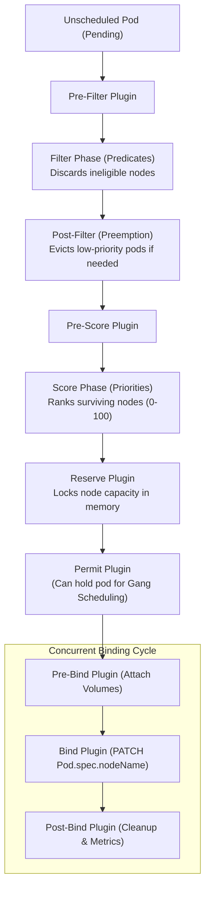
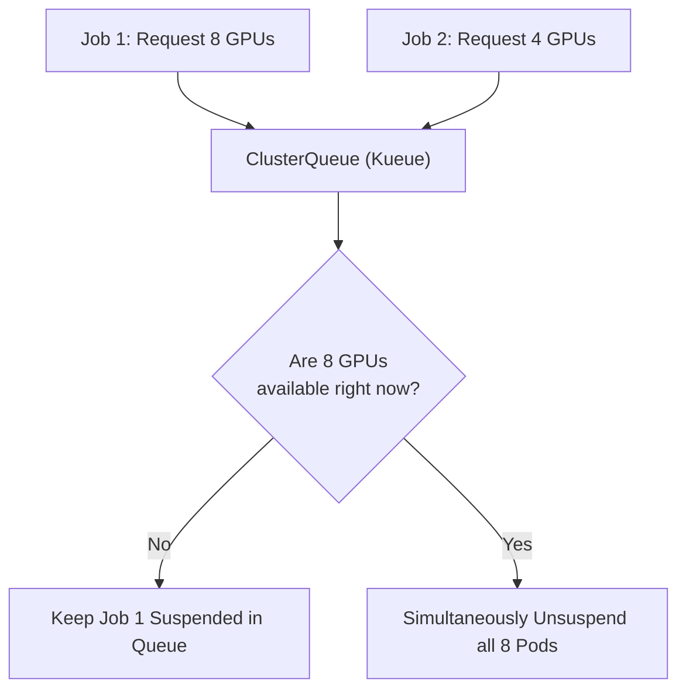

# 05. Kube-Scheduler & AI Batch Scheduling — Gang Scheduling & Resource Allocation

The **`kube-scheduler`** determines where workloads execute in a Kubernetes cluster. While simple web servers can land on any node with free CPU and memory, **AI workloads have strict hardware constraints**: they require specific GPU architectures, high NVLink bandwidth, NUMA-aligned CPU cores, and all-or-nothing scheduling.

This guide explores the internal scheduling framework, node affinity, taints, tolerations, and modern batch scheduling engines (`Kueue` and `Volcano`).

---

## 📑 Table of Contents
1. [The Scheduling Framework Architecture](#1-the-scheduling-framework-architecture)
2. [Filtering (Predicates) & Scoring (Priorities)](#2-filtering-predicates--scoring-priorities)
3. [Guiding Workloads: Affinity, Taints & Tolerations](#3-guiding-workloads-affinity-taints--tolerations)
4. [The Distributed AI Scheduling Problem: Deadlocks](#4-the-distributed-ai-scheduling-problem-deadlocks)
5. [Gang Scheduling (All-or-Nothing) with Kueue](#5-gang-scheduling-all-or-nothing-with-kueue)
6. [Dynamic Resource Allocation (DRA) in Modern Kubernetes](#6-dynamic-resource-allocation-dra-in-modern-kubernetes)
7. [Production Failure Scenarios & Scheduling Diagnostics](#7-production-failure-scenarios--scheduling-diagnostics)
8. [Hands-On GPU Scheduling Labs](#8-hands-on-gpu-scheduling-labs)

---

## 1. The Scheduling Framework Architecture

The Kubernetes scheduler executes a plugin-based pipeline divided into two phases:
1. **Scheduling Cycle** (Runs serially for one pod at a time to prevent race conditions).
2. **Binding Cycle** (Runs concurrently in background goroutines to execute the node binding).



---

## 2. Filtering (Predicates) & Scoring (Priorities)

### 2.1 Filtering Phase (Hard Constraints)
A node must pass **every single filter** to be considered a viable candidate:
- **`NodeResourcesFit`**: Does the node have enough unreserved CPU, RAM, and `nvidia.com/gpu` to satisfy the Pod's `requests`?
- **`NodeName`**: Does the Pod specify a hard target node?
- **`NodePorts`**: Does the requested host port conflict with an already bound port?
- **`NodeAffinity`**: Does the node possess the required labels?
- **`TaintToleration`**: Can the Pod tolerate all taints present on the node?

### 2.2 Scoring Phase (Soft Preferences)
Surviving nodes are ranked using weighted priority plugins (scores from 0 to 100):
- **`ImageLocalityPriority`**: Gives higher scores to nodes that already have the container image (e.g., a 15GB PyTorch image) cached locally on disk.
- **`NodeResourcesBalancedAllocation`**: Favors nodes where the allocation will result in a balanced ratio between CPU, RAM, and GPU usage.
- **`NodeAffinityScoring`**: Ranks nodes matching `preferredDuringSchedulingIgnoredDuringExecution`.

---

## 3. Guiding Workloads: Affinity, Taints & Tolerations

In an AI cluster, you must ensure that standard CPU workloads (e.g. web servers, logging daemons) **never steal compute from expensive GPU nodes**.

```text
+-----------------------------------------------------------------------------------+
| Node: dgx-spark-1                                                                 |
| Taint: `nvidia.com/gpu=present:NoSchedule`                                        |
| Label: `accelerator=nvidia-blackwell`                                             |
+-----------------------------------------------------------------------------------+
       ▲                                                           ▲
       │ Tolerated + Matched                                       │ Untolerated
       │                                                           │
+─────────────────────────────────+             +─────────────────────────────────+
| Pod: PyTorch Training Worker    |             | Pod: Web Frontend Nginx         |
| - Toleration: nvidia.com/gpu    |             | - No toleration defined         |
| - NodeSelector: nvidia-blackwell|             |                                 |
| STATUS: Scheduled Successfully  |             | STATUS: REJECTED (Tainted Node) |
+─────────────────────────────────+             +─────────────────────────────────+
```

### 3.1 Applying a Dedicated GPU Taint to DGX Spark
Taint the node so only authorized GPU workloads can land on it:
```bash
kubectl taint nodes dgx-spark-1 nvidia.com/gpu=present:NoSchedule
```

### 3.2 Pod Spec with Tolerations & NodeAffinity
```yaml
apiVersion: v1
kind: Pod
metadata:
  name: gpu-training-worker
  namespace: k3s-alpha
spec:
  # 1. Toleration: Allows the Pod to schedule onto the tainted GPU node
  tolerations:
    - key: "nvidia.com/gpu"
      operator: "Equal"
      value: "present"
      effect: "NoSchedule"

  # 2. NodeAffinity: Strictly requires an NVIDIA Blackwell GPU node
  affinity:
    nodeAffinity:
      requiredDuringSchedulingIgnoredDuringExecution:
        nodeSelectorTerms:
          - matchExpressions:
              - key: nvidia.com/gpu.family
                operator: In
                values:
                  - blackwell

  containers:
    - name: pytorch
      image: nvcr.io/nvidia/pytorch:24.01-py3
      resources:
        limits:
          nvidia.com/gpu: 1
```

---

## 4. The Distributed AI Scheduling Problem: Deadlocks

Distributed training algorithms (e.g. PyTorch DDP / Megatron-LM) initialize by opening an all-to-all communication mesh across all worker processes using NCCL.

If a training job requires **8 GPUs** across 2 nodes:
1. Standard Kubernetes scheduler schedules **Worker 0-3** on Node 1.
2. An unrelated team submits a single-GPU test job that snatches 1 GPU on Node 2.
3. The scheduler cannot schedule **Worker 4-7** because Node 2 only has 3 GPUs free.
4. **Deadlock**: The first 4 workers sit idle, consuming GPU power and holding memory forever while waiting for workers 4-7 to connect.

```text
Cluster Capacity: 8 Total GPUs
Job A needs 8 GPUs. Job B needs 1 GPU.

Standard Scheduler:
[Node 1: 4 GPUs] ──> Allocated to Job A (Workers 0, 1, 2, 3)
[Node 2: 4 GPUs] ──> 1 GPU allocated to Job B, 3 GPUs Free.
Result: Job A stalls at NCCL barrier. 7 GPUs sit completely idle!
```

---

## 5. Gang Scheduling (All-or-Nothing) with Kueue

To solve distributed training deadlocks, production AI platforms use **Gang Scheduling**: either all $N$ workers are scheduled simultaneously, or none are scheduled.

### 5.1 Architecture of Kubernetes `Kueue`
`Kueue` intercepts batch jobs at the admission layer:
1. Puts jobs into a prioritized cluster queue.
2. Monitors cluster GPU capacity.
3. Holds jobs in a suspended state (`spec.suspend = true`) until **100% of requested GPU resources** are simultaneously available.
4. Unsuspends all workers in the exact same scheduling cycle.



### 5.2 Kueue ResourceFlavor Manifest for DGX Spark
```yaml
apiVersion: kueue.x-k8s.io/v1beta1
kind: ResourceFlavor
metadata:
  name: dgx-spark-blackwell
spec:
  nodeLabels:
    nvidia.com/gpu.family: blackwell
  tolerations:
    - key: "nvidia.com/gpu"
      operator: "Equal"
      value: "present"
      effect: "NoSchedule"
---
apiVersion: kueue.x-k8s.io/v1beta1
kind: ClusterQueue
metadata:
  name: ai-cluster-queue
spec:
  resourceGroups:
    - coveredResources: ["cpu", "memory", "nvidia.com/gpu"]
      flavors:
        - name: dgx-spark-blackwell
          resources:
            - name: "nvidia.com/gpu"
              nominalQuota: 10 # Reflects 10 time-slices
```

---

## 6. Dynamic Resource Allocation (DRA) in Modern Kubernetes

Starting in Kubernetes 1.30+, **Dynamic Resource Allocation (DRA)** provides an alternative to the legacy `nvidia.com/gpu` integer resource counter.

With DRA:
- GPUs are represented as structured hardware claims (`ResourceClaim`).
- Pods can request specialized hardware parameters:
  - "Allocate 2 GPUs that share an NVLink switch."
  - "Allocate a GPU connected to the same PCIe switch as ConnectX NIC 0."
  - "Allocate 1 GPU slice with exactly 16GB VRAM."

---

## 7. Production Failure Scenarios & Scheduling Diagnostics

### Scenario 1: `0/1 nodes are available: 1 node(s) had untolerated taint`
- **Symptom**: Pod stays in `Pending` forever.
- **Triage**:
  ```bash
  kubectl describe pod <pod-name> | grep -A 5 "Events:"
  ```
- **Root Cause**: The node has been tainted (e.g. `nvidia.com/gpu=present:NoSchedule` or `node.kubernetes.io/disk-pressure`), but the Pod manifest lacks a matching `tolerations` block.
- **Resolution**: Add the exact matching toleration to the Pod's `spec.tolerations`.

---

### Scenario 2: Scheduler Affinity Conflict
- **Symptom**: Pod fails to schedule with `0/1 nodes available: 1 node(s) didn't match Pod's node affinity/selector`.
- **Triage**: Compare node labels with the Pod's required match expressions:
  ```bash
  kubectl get nodes --show-labels | tr ',' '\n' | grep nvidia
  ```
- **Resolution**: Update the Pod's `nodeSelector` to match the exact label key-value emitted by GPU Feature Discovery (GFD).

---

## 8. Hands-On GPU Scheduling Labs

### Lab 1: Taint the Node and Verify Workload Protection
1. Apply a taint to your DGX Spark node:
   ```bash
   kubectl taint nodes --all dedicated=ai-gpu:NoSchedule
   ```
2. Deploy a standard web server without tolerations:
   ```bash
   kubectl run unprivileged-web --image=nginx:alpine
   ```
3. Verify that the pod is rejected and remains `Pending`:
   ```bash
   kubectl get pod unprivileged-web
   kubectl describe pod unprivileged-web | grep "untolerated taint"
   ```
4. Clean up:
   ```bash
   kubectl delete pod unprivileged-web
   kubectl taint nodes --all dedicated=ai-gpu:NoSchedule-
   ```

### Lab 2: Pod Anti-Affinity for High-Availability Model Serving
Deploy 2 Triton inference server replicas and enforce that they **must never run on the same physical node** (PodAntiAffinity):

```yaml
apiVersion: apps/v1
kind: Deployment
metadata:
  name: triton-ha
  namespace: k3s-beta
spec:
  replicas: 2
  selector:
    matchLabels:
      app: triton-inference
  template:
    metadata:
      labels:
        app: triton-inference
    spec:
      affinity:
        podAntiAffinity:
          requiredDuringSchedulingIgnoredDuringExecution:
            - labelSelector:
                matchExpressions:
                  - key: app
                    operator: In
                    values:
                      - triton-inference
              topologyKey: "kubernetes.io/hostname"
      containers:
        - name: triton
          image: nvcr.io/nvidia/tritonserver:24.01-py3
          command: ["tritonserver", "--model-repository=/models"]
```

---

Proceed to [**06-kubernetes-networking-deep-dive.md**](06-kubernetes-networking-deep-dive.md) to explore the foundational networking model, Linux virtual ethernet pairs, routing tables, and CNI plugins.
