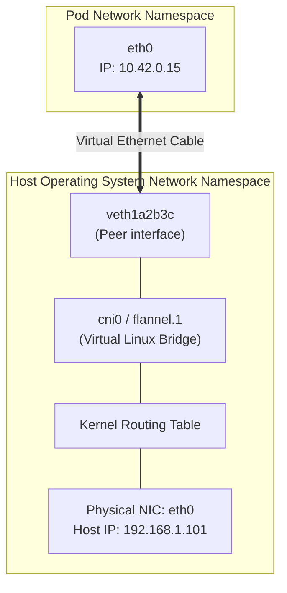

# 06. Kubernetes Networking Deep Dive — CNI, Linux Namespaces & Packet Flows

Networking is the foundation of distributed computing. In an AI cluster, high-throughput, low-latency networking is the difference between an LLM training run finishing in 3 days or stalling for 3 weeks.

This guide explores the foundational Kubernetes networking rules, Linux network namespaces, virtual ethernet pairs, the Container Network Interface (CNI), and end-to-end packet traversal.

---

## 📑 Table of Contents
1. [The Fundamental Kubernetes Networking Model](#1-the-fundamental-kubernetes-networking-model)
2. [Linux Kernel Networking Primitives](#2-linux-kernel-networking-primitives)
3. [The Container Network Interface (CNI) Architecture](#3-the-container-network-interface-cni-architecture)
4. [CNI Plugin Shootout: Flannel vs. Calico vs. Cilium](#4-cni-plugin-shootout-flannel-vs-calico-vs-cilium)
5. [End-to-End Packet Walkthroughs](#5-end-to-end-packet-walkthroughs)
6. [Multi-Homed AI Pods: Secondary RDMA Networks via Multus](#6-multi-homed-ai-pods-secondary-rdma-networks-via-multus)
7. [Production Failure Scenarios & Network Diagnostics](#7-production-failure-scenarios--network-diagnostics)
8. [Hands-On Network Inspection Labs on Host](#8-hands-on-network-inspection-labs-on-host)

---

## 1. The Fundamental Kubernetes Networking Model

Kubernetes imposes three strict networking constraints across the entire cluster:
1. **Unique IP per Pod**: Every Pod receives its own routable IP address within the cluster CIDR (e.g., `10.42.0.0/16`).
2. **Direct Pod-to-Pod Communication**: Any Pod on any node can send packets to any other Pod on any other node **without Network Address Translation (NAT)**.
3. **No Port Multiplexing**: Containers inside a Pod share the same network namespace and loopback interface (`localhost`), meaning they cannot bind to the same port.

```text
+------------------------------------+      +------------------------------------+
|         Node 1 (192.168.1.101)     |      |         Node 2 (192.168.1.102)     |
|                                    |      |                                    |
|  Pod A (10.42.1.10)                |      |  Pod B (10.42.2.20)                |
|  ├── eth0: 10.42.1.10              |      |  ├── eth0: 10.42.2.20              |
+------------------------------------+      +------------------------------------+
                   \                                      /
                    \                                    /
                     ====================================
                        No NAT / Direct Packet Routing
                        (Source IP 10.42.1.10 preserved)
```

---

## 2. Linux Kernel Networking Primitives

Kubernetes networking is not magic; it is composed of fundamental Linux kernel networking abstractions:



1. **Network Namespace (`netns`)**: An isolated instance of the Linux network stack with its own routing tables, iptables rules, loopback device, and interface list (`/proc/net`).
2. **Virtual Ethernet Pair (`veth`)**: Acts like a virtual patch cable with two ends. Packets entering one end automatically exit the other:
   - One end is placed inside the Pod's network namespace as `eth0`.
   - The other end remains in the host's root namespace as `vethXXXX`.
3. **Bridge Device (`cni0`)**: A virtual Layer 2 software switch that forwards Ethernet frames between all local `veth` pairs on that node.

---

## 3. The Container Network Interface (CNI) Architecture

The **Container Network Interface (CNI)** is a Cloud Native Computing Foundation (CNCF) specification that defines how container runtimes (`containerd`) invoke network plugins.

### The CNI Invocation Lifecycle:
When a Pod is scheduled:
1. `containerd` creates an unconfigured network namespace.
2. It executes the CNI binary (e.g. `/opt/cni/bin/flannel` or `calico`) passing a JSON configuration via `stdin` and environment variables:
   - `CNI_COMMAND=ADD`
   - `CNI_CONTAINERID=<container-id>`
   - `CNI_NETNS=/proc/<pid>/ns/net`
   - `CNI_IFNAME=eth0`
3. The CNI plugin allocates an IP address using an IPAM (IP Address Management) plugin (e.g. `host-local`), attaches the `veth` pair, and configures default routing.

---

## 4. CNI Plugin Shootout: Flannel vs. Calico vs. Cilium

| Feature | Flannel (Default in K3s) | Calico | Cilium |
| :--- | :--- | :--- | :--- |
| **Primary Mechanism** | VXLAN Overlay | Direct BGP Routing or IP-in-IP | **eBPF (Extended Berkeley Packet Filter)** |
| **Network Policies** | ❌ None (Requires separate engine) | ✅ Full L3/L4 NetworkPolicies | ✅ Advanced L3/L4/L7 NetworkPolicies |
| **Kernel Overhead** | Low (Encapsulation adds 50B overhead) | Low (Direct routing, no encapsulation) | **Ultra-Low** (Bypasses iptables & conntrack) |
| **Observability** | Minimal | Basic telemetry | **Hubble** (L7 HTTP, gRPC, DNS flow tracing) |
| **Suitability** | Edge / Single-Node / Labs | Enterprise Multi-Cluster | **High-Scale AI Supercomputing & Cloud** |

---

## 5. End-to-End Packet Walkthroughs

### 5.1 Pod-to-Pod on the Same Host
1. Application inside Pod A sends a packet to Pod B (`10.42.0.25`).
2. Inside Pod A, routing table directs packet to default gateway (`eth0`).
3. Packet crosses the `veth` pair and emerges in the host's root namespace at `vethA`.
4. The virtual bridge (`cni0`) inspects the destination MAC address.
5. The bridge forwards the frame directly to `vethB`.
6. Packet enters Pod B's `eth0` and reaches the receiving socket.

### 5.2 Pod-to-Pod Across Different Hosts (VXLAN Encapsulation)
1. Pod A on Node 1 (`10.42.1.10`) sends packet to Pod B on Node 2 (`10.42.2.20`).
2. Node 1 kernel detects destination `10.42.2.0/24` routes via the overlay device (`flannel.1`).
3. **VXLAN Encapsulation**: The kernel wraps the entire original Layer 2 Ethernet frame inside an **Outer UDP Packet**:
   - Outer Source: `192.168.1.101:8472` (Node 1 IP)
   - Outer Destination: `192.168.1.102:8472` (Node 2 IP)
4. Physical network switches route the UDP packet normally.
5. Node 2 receives the UDP packet on port 8472, decapsulates the outer packet, and extracts the inner frame.
6. The inner frame is routed into `cni0` and delivered to Pod B's `eth0`.

```text
+─────────────────────────────────────────────────────────────+
| Outer IP Header: Src 192.168.1.101 -> Dst 192.168.1.102     |
+─────────────────────────────────────────────────────────────+
| Outer UDP Header: Destination Port 8472 (VXLAN)             |
+─────────────────────────────────────────────────────────────+
| VXLAN Header: VNI = 1                                       |
+─────────────────────────────────────────────────────────────+
| Inner Original IP: Src 10.42.1.10 -> Dst 10.42.2.20 (AI Tensor)|
+─────────────────────────────────────────────────────────────+
```

---

## 6. Multi-Homed AI Pods: Secondary RDMA Networks via Multus

Standard Kubernetes CNI plugins (VXLAN, Flannel) introduce encapsulation overhead and routing latencies that severely throttle distributed AI training.

In enterprise AI clusters, we use **Multus CNI** to equip Pods with **two distinct network interfaces**:

```text
+-----------------------------------------------------------------------------------+
|                         Pod: Distributed AI Training Worker                       |
|                                                                                   |
|  +-------------------------------------+   +-----------------------------------+  |
|  | Interface: `eth0`                   |   | Interface: `net1`                 |  |
|  | CNI: Flannel / Calico               |   | CNI: SR-IOV / Host-Device (RDMA)  |  |
|  | Network: 10.42.0.0/16               |   | Network: InfiniBand / RoCE Fabric |  |
|  | Traffic: Logs, Health Checks, K8s   |   | Traffic: NCCL AllReduce (800Gbps) |  |
|  +-------------------------------------+   +-----------------------------------+  |
+-----------------------------------------------------------------------------------+
```

---

## 7. Production Failure Scenarios & Network Diagnostics

### Scenario 1: MTU Mismatch & Hanging Connections
- **Symptom**: Pods can ping each other, small HTTP requests succeed, but large file transfers (e.g. model weights) or TLS handshakes hang indefinitely.
- **Root Cause**: The physical network has a standard MTU of `1500`. VXLAN encapsulation adds a 50-byte header. If the Pod interface is also set to `1500`, the total packet size becomes `1550`. Physical switches with `DF` (Don't Fragment) drop these oversized packets silently (**Path MTU Black Hole**).
- **Resolution**:
  - Configure the CNI plugin's MTU to `1450` (`1500 - 50` bytes for VXLAN).
  - Or enable **Jumbo Frames** (`MTU=9000`) on physical data center switches.

---

### Scenario 2: Node IP Exhaustion (Pod CIDR Full)
- **Symptom**: New Pods fail to start with error: `FailedCreatePodSandBox: failed to allocate for range 0: no IP addresses available in range`.
- **Root Cause**: The node was assigned a `/24` subnet (max 254 Pod IPs), and all IPs are consumed or leaked by crashed sandboxes.
- **Triage**:
  ```bash
  # Check allocated Pod IPs on the node:
  kubectl get pods -A -o wide --field-selector spec.nodeName=dgx-spark-1 | wc -l
  
  # Inspect host IPAM allocation file:
  sudo ls -la /var/lib/cni/networks/cbr0/
  ```

---

## 8. Hands-On Network Inspection Labs on Host

### Lab 1: Find the Host `veth` Peer of a Running Pod
Run these commands on your DGX Spark host:

1. Identify the container process ID of a running pod:
   ```bash
   CONTAINER_ID=$(sudo crictl ps --name pytorch -q)
   PID=$(sudo crictl inspect $CONTAINER_ID | jq '.info.pid')
   echo "Target Container Host PID: $PID"
   ```
2. Inspect the network interface index inside the container's namespace:
   ```bash
   sudo nsenter -t $PID -n ip link show eth0
   ```
   *Notice the output format: `eth0@if14` (The number 14 is the peer index on the host).*
3. Find the matching interface on the host OS:
   ```bash
   ip link show | grep "^14:"
   ```
   *You will see the corresponding `veth` interface (e.g. `vethb91fa09@if2`). You have mapped the container's virtual adapter to the physical host kernel!*

### Lab 2: Inspect Kernel Routing Tables
```bash
# View host routing table:
ip route show

# View routing table inside the container network namespace:
sudo nsenter -t $PID -n ip route show
```

---

Proceed to [**07-kube-proxy-and-cluster-ip-mechanics.md**](07-kube-proxy-and-cluster-ip-mechanics.md) to explore `kube-proxy`, iptables chains, IPVS hash tables, and Headless Services for distributed AI.
