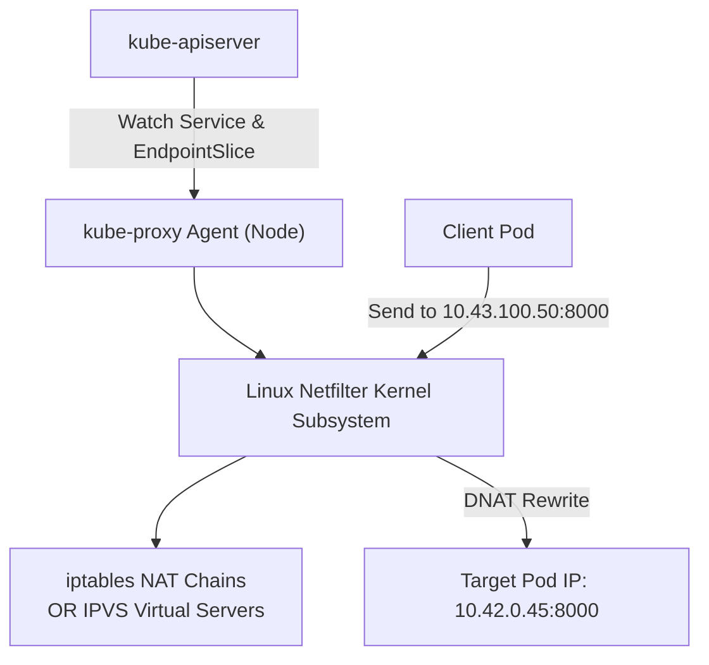

# 07. Kube-Proxy & ClusterIP Mechanics — iptables, IPVS & Headless Services

In Kubernetes, a **Service IP (ClusterIP)** is not a real physical network interface. You cannot ping it with ICMP, and it does not exist in any ARP table. It is a **virtual IP programmed directly into Linux kernel packet-filtering tables** by **`kube-proxy`**.

This guide details how `kube-proxy` translates virtual Service IPs into physical Pod IPs using `iptables` and `IPVS`, connection tracking (`conntrack`), and why **Headless Services** are mandatory for distributed AI workloads.

---

## 📑 Table of Contents
1. [The Virtual IP Problem: Why ClusterIPs Are Not Real](#1-the-virtual-ip-problem-why-clusterips-are-not-real)
2. [Anatomy of `kube-proxy`](#2-anatomy-of-kube-proxy)
3. [Endpoints vs. EndpointSlices: Scaling to Thousands of Pods](#3-endpoints-vs-endpointslices-scaling-to-thousands-of-pods)
4. [`iptables` Mode: Chains, Random Load Balancing & Math](#4-iptables-mode-chains-random-load-balancing--math)
5. [`IPVS` Mode: $O(1)$ Hash Table Load Balancing](#5-ipvs-mode-o1-hash-table-load-balancing)
6. [Connection Tracking (`conntrack`) & The Dreaded Table Full Crash](#6-connection-tracking-conntrack--the-dreaded-table-full-crash)
7. [Headless Services (`clusterIP: None`): The AI Distributed Training Standard](#7-headless-services-clusterip-none-the-ai-distributed-training-standard)
8. [Production Failure Scenarios & Diagnostics](#8-production-failure-scenarios--diagnostics)
9. [Hands-On iptables & Service Inspection Labs](#9-hands-on-iptables--service-inspection-labs)

---

## 1. The Virtual IP Problem: Why ClusterIPs Are Not Real

When you create a Kubernetes Service:
```yaml
apiVersion: v1
kind: Service
metadata:
  name: triton-service
spec:
  clusterIP: 10.43.100.50
  ports:
    - port: 8000
      targetPort: 8000
```
- The IP `10.43.100.50` is allocated from the service CIDR.
- **No virtual network card (`eth0`) is ever created with this IP**.
- Instead, the Linux kernel intercepts outgoing packets matching destination `10.43.100.50:8000` and executes **DNAT (Destination Network Address Translation)**, rewriting the destination to one of the actual running Pod IPs (e.g. `10.42.0.45:8000`).

---

## 2. Anatomy of `kube-proxy`

`kube-proxy` runs on every node (typically as a DaemonSet).



---

## 3. Endpoints vs. EndpointSlices: Scaling to Thousands of Pods

- **Legacy `Endpoints` Object**: Stored every backend Pod IP for a service in a single array. If a cluster had 5,000 pods backing a service, any single pod restart caused `kube-apiserver` to re-serialize a massive 2MB JSON object to `etcd` and broadcast it to every `kube-proxy` in the cluster.
- **Modern `EndpointSlice` Object**: Breaks backends into manageable chunks (default **100 endpoints per slice**). When 1 pod crashes, only its localized slice (a few KB) is updated, reducing network traffic and etcd write amplification by 98%.

Inspect your service's endpoint slices:
```bash
kubectl get endpointslices -l kubernetes.io/service-name=triton-service
```

---

## 4. `iptables` Mode: Chains, Random Load Balancing & Math

In default `iptables` mode, `kube-proxy` builds a tree of custom chains in the Linux kernel `nat` table:

```text
PREROUTING / OUTPUT
       │
       ▼
   KUBE-SERVICES (Matches incoming virtual Service IPs)
       │
       ▼
   KUBE-SVC-TRITON (Calculates probability across backends)
       ├── (Probability 33.3% = 1/3) ──> KUBE-SEP-001 (DNAT -> Pod 1: 10.42.0.11)
       ├── (Probability 50.0% = 1/2) ──> KUBE-SEP-002 (DNAT -> Pod 2: 10.42.0.12)
       └── (Probability 100%  = 1/1) ──> KUBE-SEP-003 (DNAT -> Pod 3: 10.42.0.13)
```

### The Probability Math of Random Balancing
To balance traffic evenly across $N$ pods, iptables uses the `statistic --mode random --probability` flag:
1. First rule matches with probability $P_1 = \frac{1}{N}$.
2. Second rule matches with probability $P_2 = \frac{1}{N-1}$.
3. Last rule matches with probability $P_N = 1.0$ (100% of whatever remains).

### The $O(N)$ Problem at Scale:
Because `iptables` is a linear rule list, every packet must evaluate rules sequentially from top to bottom. In an enterprise cluster with 10,000 services, latency degrades noticeably.

---

## 5. `IPVS` Mode: $O(1)$ Hash Table Load Balancing

To eliminate the $O(N)$ sequential latency penalty, `kube-proxy` supports **IPVS (IP Virtual Server)**:
- Built directly into the Linux kernel for Layer 4 load balancing.
- Stores destination rules in **in-memory hash tables**, guaranteeing $O(1)$ constant-time lookup latency regardless of whether you have 10 services or 50,000 services.
- Supports sophisticated scheduling algorithms:
  - `rr` (Round Robin)
  - `lc` (Least Connection)
  - `wrr` (Weighted Round Robin)
  - `sh` (Source Hashing)

---

## 6. Connection Tracking (`conntrack`) & The Dreaded Table Full Crash

When DNAT rewrites a packet's destination IP, the Linux kernel must remember the translation so that return packets can be un-DNATed. This state is stored in the **`nf_conntrack`** kernel table.

### The Failure Mode:
During sudden high-concurrency inference bursts (e.g. 50,000 requests/sec to a model endpoint):
- The `nf_conntrack` table exhausts its allocated capacity.
- The Linux kernel drops all new connections and logs:
  ```text
  kernel: nf_conntrack: table full, dropping packet
  ```
- **Result**: The node drops network connectivity completely for both pods and SSH!

### Production Fix on DGX Host:
Increase the conntrack maximum size via `sysctl`:
```bash
sudo sysctl -w net.netfilter.nf_conntrack_max=1048576
```

---

## 7. Headless Services (`clusterIP: None`): The AI Distributed Training Standard

For web applications, an abstracted load balancer is desirable.

In **Distributed AI Training (PyTorch Distributed Data Parallel / NCCL / Ray)**, an abstract load balancer is a disaster:
- Workers must establish **direct, persistent peer-to-peer TCP or RDMA sockets** with specific worker ranks (e.g. Rank 0 must connect specifically to Rank 1, not a randomly load-balanced pod).
- Workloads require zero network translation overhead.

### The Solution: Headless Service
By declaring `clusterIP: None`, you instruct Kubernetes: **Do not assign a virtual IP, and do not program kube-proxy rules!**

```yaml
apiVersion: v1
kind: Service
metadata:
  name: pytorch-master-headless
  namespace: k3s-alpha
spec:
  clusterIP: None # HEADLESS!
  selector:
    app: pytorch-training
  ports:
    - name: nccl-comm
      port: 29500
```

### What Happens in DNS:
When a worker queries DNS for `pytorch-master-headless.k3s-alpha.svc.cluster.local`, CoreDNS does **not** return a virtual IP; it returns the **direct physical IP addresses of all backing pods**, allowing PyTorch workers to connect point-to-point directly.

---

## 8. Production Failure Scenarios & Diagnostics

### Scenario 1: Traffic Routed to Terminated Pods (502 Bad Gateway)
- **Symptom**: Rolling update of an inference server returns intermittent 502/504 errors.
- **Root Cause**: When a pod is deleted, there is a sub-second delay between the Pod stopping and `kube-proxy` updating iptables rules on all nodes. During this window, `kube-proxy` continues sending traffic to the dead pod IP.
- **Resolution**: Implement a `preStop` sleep hook in the container spec to give `kube-proxy` time to remove the endpoint before the container exits:
  ```yaml
  lifecycle:
    preStop:
      exec:
        command: ["/bin/sh", "-c", "sleep 5"]
  ```

---

### Scenario 2: NodePort Reachable Locally but Not Externally
- **Symptom**: `curl localhost:30080` succeeds on the DGX host, but requests from external machines timeout.
- **Root Cause**: Host firewall (`ufw` or `firewalld`) is blocking the NodePort range (30000-32767).
- **Resolution**:
  ```bash
  sudo ufw allow 30000:32767/tcp
  ```

---

## 9. Hands-On iptables & Service Inspection Labs

### Lab 1: Inspect the Raw iptables NAT Rules for a Service
1. Find the ClusterIP of your active Kubernetes service:
   ```bash
   kubectl get svc -A
   ```
2. Search the host's Linux kernel NAT table for the generated iptables chains:
   ```bash
   sudo iptables -t nat -L KUBE-SERVICES -n -v | grep 10.43.
   ```
3. Follow the jump chain (e.g. `KUBE-SVC-XXXX`) to see the random probability rules:
   ```bash
   sudo iptables -t nat -L KUBE-SVC-<HASH> -n -v
   ```
   *Observe the `statistic --mode random` parameters matching the backend pods.*

### Lab 2: Monitor Real-Time Conntrack Table Utilization
```bash
# Check current entries vs max:
sudo sysctl net.netfilter.nf_conntrack_count
sudo sysctl net.netfilter.nf_conntrack_max

# Calculate utilization percentage:
COUNT=$(sysctl -n net.netfilter.nf_conntrack_count)
MAX=$(sysctl -n net.netfilter.nf_conntrack_max)
echo "Conntrack Table Usage: $(( COUNT * 100 / MAX ))%"
```

---

Proceed to [**08-coredns-and-service-discovery.md**](08-coredns-and-service-discovery.md) to explore CoreDNS architecture, the infamous `ndots:5` latency problem in AI clusters, and DNS troubleshooting.
