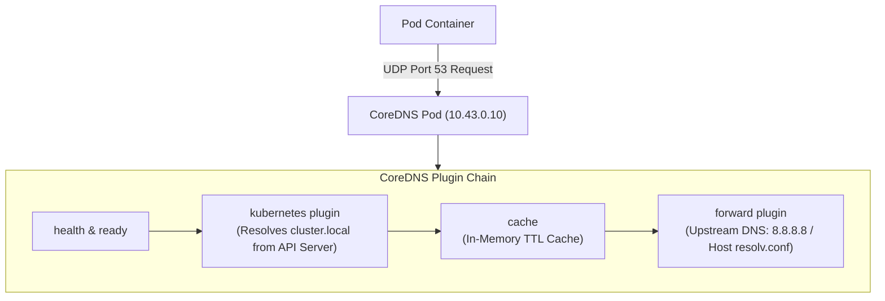

# 08. CoreDNS & Service Discovery — Architecture & The `ndots:5` AI Latency Problem

In Kubernetes, application microservices and distributed AI training workers discover each other using the Domain Name System (DNS). The engine powering this is **CoreDNS**.

This guide details CoreDNS architecture, the Kubernetes DNS specification, the Corefile configuration, and a critical performance issue that plagues AI platforms: **the `ndots:5` DNS lookup amplification penalty**.

---

## 📑 Table of Contents
1. [CoreDNS Architecture & Role in Kubernetes](#1-coredns-architecture--role-in-kubernetes)
2. [The Kubernetes DNS Domain Name Specification](#2-the-kubernetes-dns-domain-name-specification)
3. [Anatomy of the Corefile](#3-anatomy-of-the-corefile)
4. [Container `/etc/resolv.conf` Deep Dive](#4-container-etcresolvconf-deep-dive)
5. [The Infamous `ndots:5` Latency Problem in AI Clusters](#5-the-infamous-ndots5-latency-problem-in-ai-clusters)
6. [NodeLocal DNSCache: Eliminating UDP Conntrack Race Conditions](#6-nodelocal-dnscache-eliminating-udp-conntrack-race-conditions)
7. [Production Failure Scenarios & DNS Troubleshooting](#7-production-failure-scenarios--dns-troubleshooting)
8. [Hands-On DNS Diagnostic Labs](#8-hands-on-dns-diagnostic-labs)

---

## 1. CoreDNS Architecture & Role in Kubernetes

CoreDNS is a fast, flexible, plugin-chained DNS server. In Kubernetes:
- It runs as a Deployment (typically 2 replicas) in the `kube-system` namespace.
- It exposes a Service with a static ClusterIP (e.g. `10.43.0.10` in K3s).
- It connects to the `kube-apiserver` and maintains an in-memory index of all Services and Endpoints.



---

## 2. The Kubernetes DNS Domain Name Specification

Every resource created in Kubernetes is automatically assigned a deterministic Fully Qualified Domain Name (FQDN):

```text
[ Service Name ] . [ Namespace ] . [ Resource Type ] . [ Cluster Domain ]
    triton-svc   .   k3s-alpha   .       svc         .  cluster.local
```

### 1. Normal Services (ClusterIP)
- Returns the single 32-bit virtual ClusterIP address (e.g. `10.43.100.50`).

### 2. Headless Services (`clusterIP: None`)
- Returns the collection of **direct Pod IP addresses** (A records) backing the service:
  ```text
  pytorch-nodes.k3s-alpha.svc.cluster.local. 30 IN A 10.42.0.15
  pytorch-nodes.k3s-alpha.svc.cluster.local. 30 IN A 10.42.0.16
  ```

### 3. Named Service Ports (SRV Records)
- Maps port names to port numbers:
  `_grpc._tcp.triton-svc.k3s-alpha.svc.cluster.local` $\to$ Port `8001`.

---

## 3. Anatomy of the Corefile

The behavior of CoreDNS is configured via a ConfigMap named `coredns` in `kube-system`:

```text
.:53 {
    errors                   # Log all DNS errors to stdout
    health {                 # Health check endpoint on port 8080
       lameduck 5s
    }
    ready                    # Readiness probe on port 8181
    kubernetes cluster.local in-addr.arpa ip6.arpa {
       pods insecure         # Resolve Pod IP addresses
       fallthrough in-addr.arpa ip6.arpa
       ttl 30
    }
    prometheus :9153         # Prometheus metrics endpoint
    forward . /etc/resolv.conf # Forward non-cluster queries to host DNS
    cache 30                 # Cache answers for 30 seconds
    loop                     # Detect and break infinite forwarding loops
    reload                   # Auto-reload configuration on ConfigMap changes
    loadbalance              # Randomize order of A records (round-robin)
}
```

---

## 4. Container `/etc/resolv.conf` Deep Dive

Whenever `kubelet` initializes a Pod's network namespace, it automatically injects a tailored `/etc/resolv.conf`:

```text
nameserver 10.43.0.10
search k3s-alpha.svc.cluster.local svc.cluster.local cluster.local
options ndots:5
```

- **`nameserver`**: Points to the CoreDNS Service ClusterIP.
- **`search`**: Suffixes appended sequentially to any domain query that contains fewer than `ndots` dots.
- **`ndots:5`**: If a query has fewer than 5 dots, **try all search domains first** before querying the root domain!

---

## 5. The Infamous `ndots:5` Latency Problem in AI Clusters

In modern AI engineering, training jobs constantly connect to external APIs:
- Downloading Hugging Face datasets: `huggingface.co` (1 dot).
- Pulling weights from AWS S3: `my-bucket.s3.us-west-2.amazonaws.com` (4 dots).
- Sending telemetry to Weights & Biases: `api.wandb.ai` (2 dots).

### What Actually Happens Over the Network:
Because `api.wandb.ai` has only 2 dots (which is $< 5$), the Linux resolver assumes it is an internal cluster address and executes **4 sequential DNS queries**:

```text
1. Query: api.wandb.ai.k3s-alpha.svc.cluster.local    ──> Response: NXDOMAIN (Wait 5ms)
2. Query: api.wandb.ai.svc.cluster.local              ──> Response: NXDOMAIN (Wait 5ms)
3. Query: api.wandb.ai.cluster.local                  ──> Response: NXDOMAIN (Wait 5ms)
4. Query: api.wandb.ai.                               ──> Response: SUCCESS (Resolved!)
```

### The Cost:
- **300% query amplification**: CoreDNS receives 4x more traffic than necessary.
- **Latency overhead**: Each network request incurs a 15-50ms DNS resolution delay.

### The Solutions for AI Workloads:

#### Solution 1: Add a Trailing Dot to External Hostnames in Code
In your Python training script, use a trailing dot to mark the domain as absolute:
```python
# Tells the Linux resolver to bypass search paths immediately:
WANDB_HOST = "https://api.wandb.ai./" 
```

#### Solution 2: Custom Pod `dnsConfig`
Override `ndots` directly in your Pod or Job manifest:
```yaml
apiVersion: v1
kind: Pod
metadata:
  name: pytorch-fast-dns
spec:
  dnsConfig:
    options:
      - name: ndots
        value: "2"
  containers:
    - name: worker
      image: nvcr.io/nvidia/pytorch:24.01-py3
```

---

## 6. NodeLocal DNSCache: Eliminating UDP Conntrack Race Conditions

Under heavy UDP traffic, the Linux kernel's `conntrack` engine can suffer from race conditions when two DNS queries are sent from the same socket simultaneously, leading to unexplained **5-second DNS timeouts**.

**NodeLocal DNSCache** runs a lightweight DNS caching daemon (CoreDNS) as a DaemonSet on every node, listening on a link-local IP (`169.254.20.10`).

```text
Pod (Container) ──> Localhost Cache (169.254.20.10) [0ms Latency]
                         │
                         ▼ (Cache Miss: Uses persistent TCP connection)
                    Central CoreDNS Service (10.43.0.10)
```
- Queries hit local node memory over a loopback socket (0ms latency).
- Uses **TCP** instead of UDP for upstream queries, completely eliminating conntrack drops.

---

## 7. Production Failure Scenarios & DNS Troubleshooting

### Scenario 1: CoreDNS CrashLoopBackOff (`Loop detected`)
- **Symptom**: CoreDNS pods continuously restart with error:
  ```text
  plugin/loop: Loop (127.0.0.1:55953 -> :53) detected for zone "."
  ```
- **Root Cause**: The host's `/etc/resolv.conf` points to `127.0.0.53` (systemd-resolved). CoreDNS inherits this and forwards queries to itself, creating an infinite forwarding loop.
- **Resolution**: Point K3s / CoreDNS to an upstream upstream DNS server (e.g. `8.8.8.8` or company DNS) in `/etc/resolv.conf`.

---

### Scenario 2: Intermittent `getaddrinfo EAI_AGAIN` in Python Scripts
- **Symptom**: PyTorch or HuggingFace scripts intermittently crash during initialization with DNS resolution failure.
- **Diagnostic Command**: Run `nslookup` inside a debug pod:
  ```bash
  kubectl run dns-test --rm -it --image=busybox:1.28 -- nslookup kubernetes.default
  ```
- **Resolution**: Check CoreDNS resource limits (CPU throttling) and scale CoreDNS replicas from 1 to 2.

---

## 8. Hands-On DNS Diagnostic Labs

### Lab 1: Inspect Container Search Paths
Run an interactive session inside your tenant pod to inspect its resolver configuration:
```bash
kubectl exec -it pytorch-benchmark -n k3s-alpha -- cat /etc/resolv.conf
```
*Observe the exact `nameserver` IP matching the `kube-dns` service and the list of search domains.*

### Lab 2: Trace Query Amplification via CoreDNS Logs
Enable the `log` plugin in CoreDNS to watch live queries:

1. Edit the CoreDNS ConfigMap:
   ```bash
   kubectl edit configmap coredns -n kube-system
   ```
2. Add the `log` directive inside the main server block.
3. Stream logs:
   ```bash
   kubectl logs -n kube-system -l k8s-app=kube-dns -f
   ```
4. In another window, execute `curl huggingface.co` inside a pod. Watch the 3 resulting `NXDOMAIN` log entries appear before the successful resolution!

---

Proceed to [**09-ingress-controllers-and-gateway-api.md**](09-ingress-controllers-and-gateway-api.md) to explore Layer 7 routing, Ingress-Nginx, Traefik, Gateway API, and TLS termination for AI inference endpoints.
