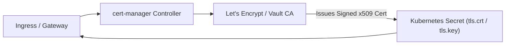

# 09. Ingress Controllers & Gateway API — L7 Routing, gRPC & Inference Gateways

When serving AI models to end users (e.g. streaming LLM tokens via HTTP SSE or high-performance computer vision inference via gRPC), Layer 4 Kubernetes Services (NodePort/ClusterIP) are insufficient. You need an intelligent **Layer 7 reverse proxy** that handles SSL/TLS termination, path routing, streaming connections, and traffic splitting.

This guide explores **Ingress Controllers** (Nginx/Traefik), the next-generation **Kubernetes Gateway API**, and tuning for high-throughput AI inference endpoints.

---

## 📑 Table of Contents
1. [Layer 4 vs. Layer 7 Routing](#1-layer-4-vs-layer-7-routing)
2. [Anatomy of an Ingress Controller](#2-anatomy-of-an-ingress-controller)
3. [Path-Based & Host-Based Routing for AI APIs](#3-path-based--host-based-routing-for-ai-apis)
4. [Tuning Ingress for LLM Streaming & Large Tensors](#4-tuning-ingress-for-llm-streaming--large-tensors)
5. [The Next Generation: Kubernetes Gateway API](#5-the-next-generation-kubernetes-gateway-api)
6. [Automated TLS Termination with `cert-manager`](#6-automated-tls-termination-with-cert-manager)
7. [Production Failure Scenarios & Diagnostics](#7-production-failure-scenarios--diagnostics)
8. [Hands-On Ingress & Inference Routing Labs](#8-hands-on-ingress--inference-routing-labs)

---

## 1. Layer 4 vs. Layer 7 Routing

```text
Layer 4 Routing (Service NodePort / LoadBalancer):
Client ──> TCP Handshake (IP:Port) ──> Blind packet forwarding to Pod
* No inspection of HTTP headers, URL paths, or cookies.
* Cannot terminate TLS per domain name.
* Inefficient for gRPC multiplexing.

Layer 7 Routing (Ingress / Gateway API):
Client ──> TLS Handshake (SNI: api.ai.org) ──> Decrypts HTTP/gRPC stream
       ├── /v1/chat/completions ──────────> vLLM Inference Pod
       ├── /v2/models/resnet50/infer ────> Triton Inference Pod
       └── /metrics ──────────────────────> Monitoring Pod
```

---

## 2. Anatomy of an Ingress Controller

An Ingress setup requires two distinct components:
1. **The Ingress Resource**: A declarative Kubernetes YAML specification defining routing rules.
2. **The Ingress Controller**: A physical reverse proxy daemon (e.g. **Traefik**, **Ingress-Nginx**, or **Envoy**) that watches the API server, dynamically compiles configuration files, and reloads routing tables in memory.

```mermaid
graph TD
    Client["Client / Web Browser / Mobile App"] -->|HTTPS (Port 443)| IC["Ingress Controller<br/>(Nginx / Traefik / Envoy)"]
    IC -->|Terminate TLS & Inspect Path| Router{"URL Path Match"}
    
    Router -->|/v1/chat| LLM["vLLM Service (ClusterIP)<br/>Port 8000"]
    Router -->|/v2/models| Triton["Triton Service (ClusterIP)<br/>Port 8000"]
    
    LLM -.-> P1["vLLM GPU Pod 1"]
    LLM -.-> P2["vLLM GPU Pod 2"]
    Triton -.-> P3["Triton GPU Pod 1"]
```

---

## 3. Path-Based & Host-Based Routing for AI APIs

Deploy an Ingress manifest that routes traffic to two different AI models running on your cluster:

```yaml
apiVersion: networking.k8s.io/v1
kind: Ingress
metadata:
  name: ai-inference-gateway
  namespace: k3s-beta
  annotations:
    kubernetes.io/ingress.class: "traefik" # or "nginx"
    # Enable WebSocket & Server-Sent Events (SSE) for token streaming:
    nginx.ingress.kubernetes.io/proxy-read-timeout: "3600"
    nginx.ingress.kubernetes.io/proxy-send-timeout: "3600"
spec:
  rules:
    - host: api.dgx-spark.local
      http:
        paths:
          # Route 1: LLM OpenAI-compatible endpoint
          - path: /v1/chat/completions
            pathType: Prefix
            backend:
              service:
                name: vllm-service
                port:
                  number: 8000

          # Route 2: Computer Vision Inference Server
          - path: /v2/models
            pathType: Prefix
            backend:
              service:
                name: triton-service
                port:
                  number: 8000
```

---

## 4. Tuning Ingress for LLM Streaming & Large Tensors

Standard web ingress proxies are tuned for lightweight JSON payloads. When serving AI models, default settings will cause connection drops:

### 1. HTTP 413 "Request Entity Too Large"
When uploading 4K video frames, high-res medical images, or audio files for transcription:
- **Default limit**: Ingress-Nginx defaults to `1m` (1 Megabyte).
- **Fix**:
  ```yaml
  nginx.ingress.kubernetes.io/proxy-body-size: "100m"
  ```

### 2. Broken Streaming Tokens (LLM Generation Timeout)
Generating a 4,000-token response with an LLM can take 30 to 60 seconds of continuous HTTP streaming (Server-Sent Events):
- **Default limit**: Standard proxy timeouts terminate idle sockets after 60 seconds.
- **Fix**:
  ```yaml
  nginx.ingress.kubernetes.io/proxy-read-timeout: "600"
  nginx.ingress.kubernetes.io/proxy-buffering: "off" # Stream tokens instantly!
  ```

### 3. gRPC Multiplexing for Triton Inference Server
Triton uses **HTTP/2 gRPC** for maximum throughput. Standard proxies downgrade connections to HTTP/1.1 unless configured:
```yaml
nginx.ingress.kubernetes.io/backend-protocol: "GRPC"
```

---

## 5. The Next Generation: Kubernetes Gateway API

The legacy `Ingress` API suffered from a fundamental flaw: it combined infrastructure provisioning, TLS secrets, and routing rules into a single monolithic object.

The **Kubernetes Gateway API** replaces Ingress with a modular, role-oriented architecture:

```text
+─────────────────────────────────────────────────────────────+
| GatewayClass (Managed by Cloud/Infrastructure Admin)         |
| Defines the proxy controller (e.g. Envoy, Cilium, Traefik)  |
+─────────────────────────────────────────────────────────────+
                               │
                               ▼
+─────────────────────────────────────────────────────────────+
| Gateway (Managed by Cluster Platform Engineer)               |
| Allocates IP address, port 443, and attaches TLS certificate|
+─────────────────────────────────────────────────────────────+
                               │
                               ▼
+─────────────────────────────────────────────────────────────+
| HTTPRoute / GRPCRoute (Managed by AI Application Developer) |
| Defines path rules: /v1/chat -> vllm-service                |
+─────────────────────────────────────────────────────────────+
```

### Gateway API Manifest (`llm-httproute.yaml`)
```yaml
apiVersion: gateway.networking.k8s.io/v1
kind: HTTPRoute
metadata:
  name: llm-api-route
  namespace: k3s-beta
spec:
  parentRefs:
    - name: central-ai-gateway
      namespace: default
  hostnames:
    - "llm.company.internal"
  rules:
    - matches:
        - path:
            type: PathPrefix
            value: /v1
      backendRefs:
        - name: vllm-service
          port: 8000
```

---

## 6. Automated TLS Termination with `cert-manager`

Never manage SSL certificates manually. **`cert-manager`** automates certificate issuance and renewal via Let's Encrypt or corporate HashiCorp Vault instances.



### Ingress Manifest with Automated TLS:
```yaml
spec:
  tls:
    - hosts:
        - api.dgx-spark.local
      secretName: dgx-spark-tls-cert # cert-manager auto-populates this secret!
```

---

## 7. Production Failure Scenarios & Diagnostics

### Scenario 1: `HTTP 504 Gateway Timeout` During LLM Generation
- **Symptom**: User sends a prompt; generation starts, but exactly 60 seconds later, the connection breaks with a 504 Gateway Timeout error.
- **Root Cause**: Proxy buffer timeout reached. The proxy waited for the entire response to finish before sending bytes to the client.
- **Resolution**: Disable proxy buffering (`proxy-buffering: "off"`) so that tokens stream out chunk-by-chunk in real time.

---

### Scenario 2: `HTTP 503 Service Temporarily Unavailable`
- **Symptom**: Ingress endpoint immediately returns 503.
- **Root Cause**: The backing service has no ready Endpoints (all backend AI pods are crashing, failing readiness probes, or loading model weights into GPU VRAM).
- **Triage**:
  ```bash
  # Check if backend endpoints exist:
  kubectl get endpoints triton-service -n k3s-beta
  ```
  *If `ENDPOINTS` is `<none>`, inspect the Pod's readiness probe logs!*

---

## 8. Hands-On Ingress & Inference Routing Labs

### Lab 1: Deploy a Mock Inference API Behind Ingress
1. Deploy a lightweight HTTP echo server simulating an AI endpoint:
   ```bash
   kubectl create deployment mock-inference --image=ealen/echo-server:latest -n k3s-beta
   kubectl expose deployment mock-inference --port=80 --targetPort=80 -n k3s-beta
   ```
2. Apply an Ingress rule:
   ```yaml
   apiVersion: networking.k8s.io/v1
   kind: Ingress
   metadata:
     name: mock-ai-ingress
     namespace: k3s-beta
   spec:
     rules:
       - http:
           paths:
             - path: /ai-test
               pathType: Prefix
               backend:
                 service:
                   name: mock-inference
                   port:
                     number: 80
   ```
   Save as `mock-ingress.yaml` and apply:
   ```bash
   kubectl apply -f mock-ingress.yaml
   ```
3. Test connectivity through the host reverse proxy:
   ```bash
   curl -i http://localhost/ai-test
   ```
   *Verify HTTP 200 response.*

---

Proceed to [**10-advanced-workload-controllers.md**](10-advanced-workload-controllers.md) to explore StatefulSets, DaemonSets, Indexed Jobs, and Pod Disruption Budgets (PDB).
