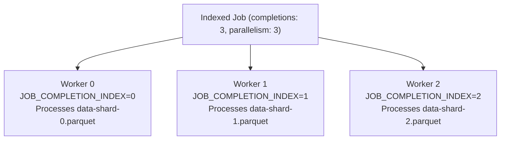

# 10. Advanced Workload Controllers — StatefulSets, DaemonSets & Indexed Jobs

In Kubernetes, stateless web applications use standard Deployments. In **AI and high-performance computing infrastructure**, Deployments are rarely appropriate:
- Model training jobs need to run to completion and exit without restarting (**Jobs**).
- Sharded data preprocessing requires unique worker indices (**Indexed Jobs**).
- Distributed storage and caching require stable network identities and dedicated disks (**StatefulSets**).
- GPU drivers, monitoring agents, and log shippers must run on every physical node (**DaemonSets**).

This guide explores advanced workload controllers, their lifecycle mechanics, and their specific applications in AI infrastructure.

---

## 📑 Table of Contents
1. [StatefulSets: Deterministic Identity & Storage Binding](#1-statefulsets-deterministic-identity--storage-binding)
2. [DaemonSets: Node-Level System Services](#2-daemonsets-node-level-system-services)
3. [Batch Jobs & AI Model Training Lifecycles](#3-batch-jobs--ai-model-training-lifecycles)
4. [Indexed Jobs: Sharded Data Preprocessing & Tokenization](#4-indexed-jobs-sharded-data-preprocessing--tokenization)
5. [Pod Disruption Budgets (PDB): Guarding Cluster Drains](#5-pod-disruption-budgets-pdb-guarding-cluster-drains)
6. [Production Failure Scenarios & Diagnostics](#6-production-failure-scenarios--diagnostics)
7. [Hands-On Workload Engineering Labs](#7-hands-on-workload-engineering-labs)

---

## 1. StatefulSets: Deterministic Identity & Storage Binding

Deployments treat Pods as fungible (interchangeable cattle). If a Pod dies, it is replaced with a completely random new name and a new IP.

A **StatefulSet** guarantees:
1. **Predictable Network Identity**: Pods are named sequentially: `statefulset-0`, `statefulset-1`, `statefulset-2`.
2. **Dedicated Persistent Storage**: Uses `volumeClaimTemplates` to allocate an independent PVC for each replica (`data-statefulset-0`).
3. **Ordered Startup & Teardown**: Pod $N$ only starts after Pod $N-1$ is fully healthy (`Ready`).

```text
StatefulSet: `vector-db` (3 Replicas)
├── Pod: `vector-db-0` <==== Bound To ====> PVC: `data-vector-db-0`
├── Pod: `vector-db-1` <==== Bound To ====> PVC: `data-vector-db-1`
└── Pod: `vector-db-2` <==== Bound To ====> PVC: `data-vector-db-2`
```

### AI Use Case: Vector Databases (Milvus, Qdrant, Chroma)
Vector databases storing billions of embedding vectors require local NVMe persistence and stable node clustering.

#### StatefulSet Manifest (`vector-db-statefulset.yaml`)
```yaml
apiVersion: apps/v1
kind: StatefulSet
metadata:
  name: vector-db
  namespace: k3s-alpha
spec:
  serviceName: "vector-db-headless"
  replicas: 2
  selector:
    matchLabels:
      app: vector-db
  template:
    metadata:
      labels:
        app: vector-db
    spec:
      containers:
        - name: qdrant
          image: qdrant/qdrant:v1.7.4
          ports:
            - containerPort: 6333
              name: http
            - containerPort: 6334
              name: grpc
          volumeMounts:
            - name: storage
              mountPath: /qdrant/storage
  volumeClaimTemplates:
    - metadata:
        name: storage
      spec:
        accessModes: ["ReadWriteOnce"]
        storageClassName: "local-path"
        resources:
          requests:
            storage: 20Gi
```

---

## 2. DaemonSets: Node-Level System Services

A **DaemonSet** ensures that **all (or all qualifying) Nodes run exactly one copy of a Pod**.

### AI Infrastructure Applications:
- **NVIDIA Device Plugin**: Runs on every GPU node to expose `/dev/nvidia*`.
- **NVIDIA DCGM Exporter**: Runs on every GPU node to collect telemetry.
- **Node Problem Detector**: Monitors kernel dmesg for hardware Xid errors.

```yaml
apiVersion: apps/v1
kind: DaemonSet
metadata:
  name: gpu-health-monitor
  namespace: kube-system
spec:
  selector:
    matchLabels:
      name: gpu-health-monitor
  template:
    metadata:
      labels:
        name: gpu-health-monitor
    spec:
      # Critical: Run only on nodes that possess an NVIDIA GPU
      nodeSelector:
        nvidia.com/gpu.present: "true"
      tolerations:
        - key: "nvidia.com/gpu"
          operator: "Exists"
          effect: "NoSchedule"
      containers:
        - name: monitor
          image: ubuntu:22.04
          command: ["/bin/bash", "-c", "while true; do nvidia-smi; sleep 60; done"]
```

---

## 3. Batch Jobs & AI Model Training Lifecycles

Unlike web services that run indefinitely, AI training jobs are finite batch tasks.

### Lifecycle of a Job:
- Spawns a Pod.
- If the application exits with **Exit Code 0 (Success)** $\to$ Pod status becomes `Completed`. Job controller stops.
- If the application exits with **Non-Zero Exit Code (Crash/Error)** $\to$ Re-spawns a replacement Pod until `backoffLimit` (default 6) is reached.

---

## 4. Indexed Jobs: Sharded Data Preprocessing & Tokenization

When preparing a 100-million document dataset for pretraining, sequential processing is too slow. You want 10 parallel workers, each processing exactly 10% of the dataset without overlapping.

An **Indexed Job (`completionMode: Indexed`)** assigns a unique, immutable integer index (`JOB_COMPLETION_INDEX`) from `0` to `completions - 1` to each worker pod.



### Indexed Job Manifest (`data-tokenizer-job.yaml`)
```yaml
apiVersion: batch/v1
kind: Job
metadata:
  name: dataset-tokenizer
  namespace: k3s-alpha
spec:
  completions: 4       # Total tasks to finish
  parallelism: 2       # Run 2 workers concurrently
  completionMode: Indexed
  template:
    spec:
      restartPolicy: OnFailure
      containers:
        - name: tokenizer
          image: python:3.10-slim
          command: ["python3", "-c"]
          args:
            - |
              import os, time
              index = os.environ.get("JOB_COMPLETION_INDEX")
              print(f"--> Worker Rank {index} started.")
              print(f"--> Processing Shard /datasets/shard_{index}.bin ...")
              time.sleep(15) # Simulating heavy tokenization
              print(f"--> Worker Rank {index} finished processing successfully!")
```

---

## 5. Pod Disruption Budgets (PDB): Guarding Cluster Drains

When upgrading host kernels, NVIDIA drivers, or Kubernetes versions, administrators execute `kubectl drain <node>`.

If an administrator drains a node while a 7-day distributed training run is active:
- Standard drain forcefully evicts all pods.
- **The multi-day training checkpoint is lost!**

A **Pod Disruption Budget (PDB)** prevents eviction if doing so would violate application availability:

```yaml
apiVersion: policy/v1
kind: PodDisruptionBudget
metadata:
  name: protect-training-run
  namespace: k3s-alpha
spec:
  minAvailable: 1 # Guarantees this pod cannot be evicted voluntarily
  selector:
    matchLabels:
      app: pytorch-training
```
*When `kubectl drain` runs, the eviction API blocks until the training job completes or the administrator explicitly overrides the budget.*

---

## 6. Production Failure Scenarios & Diagnostics

### Scenario 1: StatefulSet Stuck in `RollingUpdate`
- **Symptom**: Pod `vector-db-1` is stuck in `Pending` or `CrashLoopBackOff`, and the StatefulSet halts completely without updating `vector-db-0`.
- **Root Cause**: StatefulSets execute rolling updates in strict reverse ordinal sequence ($N-1 \to 0$). Pod $N-1$ must reach `Ready` before Pod $N-2$ is touched.
- **Resolution**: Fix the crash in the currently failing pod (`kubectl logs vector-db-1`).

---

### Scenario 2: Job Fails with `BackoffLimitExceeded`
- **Symptom**: Job fails, and no new pods are created. Events show `Job has reached the specified backoff limit`.
- **Triage**:
  ```bash
  # Check failed pods belonging to the job:
  kubectl get pods -l job-name=dataset-tokenizer --field-selector status.phase=Failed
  
  # Inspect container exit logs:
  kubectl logs -l job-name=dataset-tokenizer --tail=50
  ```

---

## 7. Hands-On Workload Engineering Labs

### Lab 1: Deploy and Verify an Indexed Job
1. Apply the `data-tokenizer-job.yaml` manifest above.
2. Watch parallel execution in real time:
   ```bash
   kubectl get pods -n k3s-alpha -l job-name=dataset-tokenizer -w
   ```
3. Inspect logs of individual worker indices:
   ```bash
   kubectl logs dataset-tokenizer-0-xxxx -n k3s-alpha
   kubectl logs dataset-tokenizer-1-yyyy -n k3s-alpha
   ```
   *Verify that each pod received its distinct `JOB_COMPLETION_INDEX`.*

---

Proceed to [**11-storage-csi-and-high-performance-volumes.md**](11-storage-csi-and-high-performance-volumes.md) to explore the Container Storage Interface (CSI), Local Path Provisioner, NVMe high-IOPS storage, and GPUDirect Storage.
