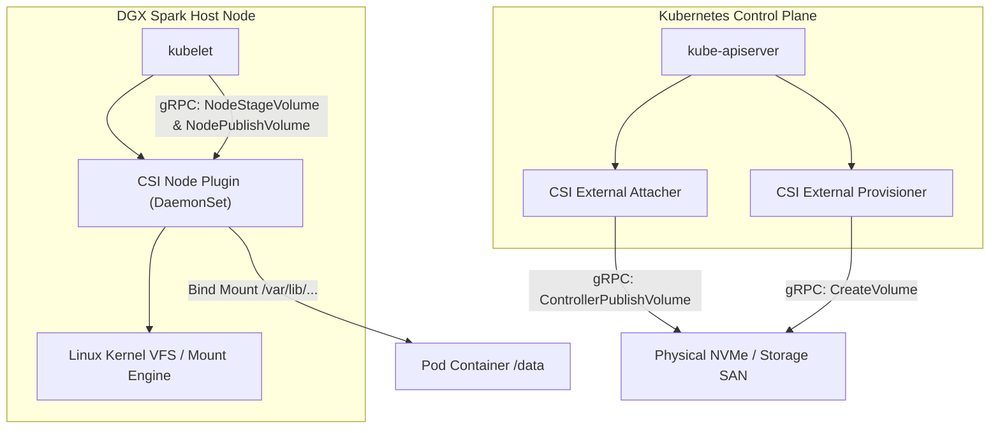

# 11. Storage, CSI & High-Performance Volumes — NVMe, Local Path & GPUDirect Storage

In AI training and deep learning, **compute without fast I/O is useless**. If a Blackwell GPU can crunch 10,000 matrix multiplications per millisecond, but the storage system takes 20 milliseconds to stream the next image batch, the GPU sits idle 95% of the time (**GPU Starvation**).

This guide explores the Container Storage Interface (CSI), dynamic volume provisioning, the K3s Local Path Provisioner, Local PVs on NVMe, and GPUDirect Storage (GDS).

---

## 📑 Table of Contents
1. [The Storage Hierarchy in AI Clusters](#1-the-storage-hierarchy-in-ai-clusters)
2. [The Container Storage Interface (CSI) Architecture](#2-the-container-storage-interface-csi-architecture)
3. [PersistentVolumes (PV) & Claims (PVC) Lifecycle](#3-persistentvolumes-pv--claims-pvc-lifecycle)
4. [StorageClasses: `WaitForFirstConsumer` & Node Binding](#4-storageclasses-waitforfirstconsumer--node-binding)
5. [K3s Local Path Provisioner: Architecture & Quota Isolation](#5-k3s-local-path-provisioner-architecture--quota-isolation)
6. [GPUDirect Storage (GDS) & NVMe Direct DMA](#6-gpudirect-storage-gds--nvme-direct-dma)
7. [Production Failure Scenarios & Storage Diagnostics](#7-production-failure-scenarios--storage-diagnostics)
8. [Hands-On High-Throughput Storage Labs](#8-hands-on-high-throughput-storage-labs)

---

## 1. The Storage Hierarchy in AI Clusters

```text
+-----------------------------------------------------------------------------------+
| Speed & Bandwidth                                                Capacity & Cost  |
|                                                                                   |
|  [ GPU High-Bandwidth Memory (HBM3e) ] ──── 8 TB/s ───────────── 141 GB - 192 GB  |
|                         ▲                                                         |
|                         │ NVLink-C2C (900 GB/s on DGX Spark GB10)                 |
|  [ System Unified Memory (Host RAM) ] ───── 900 GB/s ─────────── 128 GB - 2 TB    |
|                         ▲                                                         |
|                         │ PCIe Gen 5 / GPUDirect Storage (64 GB/s)                |
|  [ Local Host NVMe SSDs ] ───────────────── 14 GB/s ──────────── 2 TB - 30 TB     |
|                         ▲                                                         |
|                         │ InfiniBand Storage Fabric (RDMA / RoCE)                 |
|  [ Distributed Parallel Storage (VAST / Weka) ] 100+ GB/s ────── Petabytes        |
+-----------------------------------------------------------------------------------+
```

---

## 2. The Container Storage Interface (CSI) Architecture

Kubernetes separates storage orchestration from storage implementation via the **Container Storage Interface (CSI)** gRPC specification:



### CSI Operation Flow:
1. **`CreateVolume`**: Provisioner creates raw physical storage block or directory.
2. **`ControllerPublishVolume`**: Attaches raw volume to target node (cloud/SAN).
3. **`NodeStageVolume`**: Formats the raw block device with a filesystem (`ext4` or `xfs`) and mounts it to a global staging directory on the node.
4. **`NodePublishVolume`**: Executes a Linux **bind-mount** (`mount --bind`), projecting the staging directory directly into the container's mount namespace.

---

## 3. PersistentVolumes (PV) & Claims (PVC) Lifecycle

- **PersistentVolume (PV)**: A piece of physical storage provisioned in the cluster (Cluster-scoped resource).
- **PersistentVolumeClaim (PVC)**: A request for storage by a user/pod specifying size and access mode (Namespace-scoped).

### Access Modes:
- **`ReadWriteOnce` (RWO)**: Can be mounted read-write by pods on a **single node only** (standard for high-performance NVMe).
- **`ReadWriteMany` (RWX)**: Can be mounted read-write by multiple pods across **multiple nodes simultaneously** (required for shared training datasets across a cluster; requires NFS/Ceph/VAST).
- **`ReadOnlyMany` (ROX)**: Mounted read-only across multiple nodes simultaneously (ideal for shared frozen model weights).

---

## 4. StorageClasses: `WaitForFirstConsumer` & Node Binding

When using high-speed local NVMe storage on a specific physical machine, standard dynamic provisioning (`volumeBindingMode: Immediate`) causes a severe scheduling conflict:
- If a PVC is created, `Immediate` binds it to an arbitrary node's disk **before the Pod is scheduled**.
- Later, the `kube-scheduler` discovers the Pod requires an NVIDIA Blackwell GPU that exists on Node 1, but the PVC was bound to Node 2!
- **Result: Permanent Scheduling Deadlock!**

### The Fix: `volumeBindingMode: WaitForFirstConsumer`
This mode instructs the storage provisioner: **Do not allocate storage until the Pod has been assigned to a node by the scheduler!**

```yaml
apiVersion: storage.k8s.io/v1
kind: StorageClass
metadata:
  name: nvme-high-iops
provisioner: rancher.io/local-path
volumeBindingMode: WaitForFirstConsumer # MANDATORY FOR LOCAL GPU HOSTS!
reclaimPolicy: Delete
```

---

## 5. K3s Local Path Provisioner: Architecture & Quota Isolation

In your DGX Spark setup, K3s includes Rancher's **Local Path Provisioner** by default.

### How it Works:
- When a PVC requests storage with `storageClassName: local-path`:
  1. The provisioner creates a dedicated directory on the host:
     `/var/lib/rancher/k3s/storage/pvc-<UUID>_<namespace>_<pvc-name>/`
  2. It bind-mounts this directory into the Pod at the requested `mountPath`.
  3. When the PVC is deleted, a helper pod (`local-path-provisioner-helper`) runs `rm -rf` on the host directory.

### Enforcing the 5% Storage Limit:
Because standard Linux directories do not enforce size limits natively, Kubernetes enforces storage consumption at the API level via **`ResourceQuota`**:

```yaml
spec:
  hard:
    requests.storage: "50Gi" # Max 50GB allocated across all PVCs in namespace
    persistentvolumeclaims: "4"
```
*If a developer attempts to submit a PVC requesting 60Gi, the API server rejects it instantly.*

---

## 6. GPUDirect Storage (GDS) & NVMe Direct DMA

In traditional storage I/O:
`NVMe Disk ──> Host CPU ──> Page Cache (Host RAM) ──> Host CPU ──> GPU VRAM`

Every byte travels twice through the host CPU and memory bus, creating high CPU overhead and cache pollution.

### With NVIDIA GPUDirect Storage (GDS):
The host kernel module **`nvidia-fs.ko`** programs direct DMA (Direct Memory Access) transfers between the NVMe controller and GPU memory over PCIe:

```text
+-------------------+                               +-------------------+
|  Local NVMe SSD   | ============ Direct DMA ===========> |  Blackwell GPU    |
|  Controller       |       (No CPU Involvement)    |  VRAM (Unified)   |
+-------------------+                               +-------------------+
```
- **Throughput**: Achieves full line-rate NVMe speeds (14+ GB/s per Gen 5 drive).
- **Latency**: Sub-microsecond access times.
- **CPU Overhead**: Dropped to near 0%.

---

## 7. Production Failure Scenarios & Storage Diagnostics

### Scenario 1: `FailedMountVolume: MountVolume.SetUp failed`
- **Symptom**: Pod stays in `ContainerCreating` indefinitely.
- **Triage**:
  ```bash
  kubectl describe pod <pod-name> | grep -A 5 "Events:"
  ```
- **Diagnostic Output**:
  ```text
  Warning  FailedMount  45s  kubelet  MountVolume.SetUp failed for volume "pvc-xyz" : host path /var/lib/rancher/k3s/storage/... does not exist
  ```
- **Root Cause**: Directory was deleted manually on the host, or permissions prevent the container runtime from reading it.
- **Resolution**: Check host directory permissions:
  ```bash
  sudo ls -ld /var/lib/rancher/k3s/storage/pvc*
  sudo chmod 777 /var/lib/rancher/k3s/storage/pvc*
  ```

---

### Scenario 2: Host Filesystem Inode Exhaustion
- **Symptom**: Disk has 500GB free space (`df -h`), but applications crash with `No space left on device`.
- **Root Cause**: Processing datasets with millions of tiny text/image files exhausted the filesystem's **Inodes**.
- **Triage**:
  ```bash
  df -i /
  ```
  *If `IUse%` is 100%, no new files can be created despite available gigabytes!*

---

## 8. Hands-On High-Throughput Storage Labs

### Lab 1: Benchmark Raw Disk I/O Inside a Pod
Test the sequential write throughput of your local path storage inside the tenant pod:

```bash
kubectl exec -it pytorch-benchmark -n k3s-alpha -- /bin/bash -c "
  dd if=/dev/zero of=/data/test_io.bin bs=1G count=2 oflag=direct
"
```
*Observe the real-time write speed (typically 1.5 GB/s to 4+ GB/s depending on your host NVMe).*

### Lab 2: Clean Up Test Artifacts
```bash
kubectl exec -it pytorch-benchmark -n k3s-alpha -- rm -f /data/test_io.bin
```

---

Proceed to [**12-multi-tenancy-resource-quotas-and-cgroups.md**](12-multi-tenancy-resource-quotas-and-cgroups.md) to explore the deep mechanics of Linux cgroups v2, systemd slices, and strict 5% multi-tenant resource partitioning.
