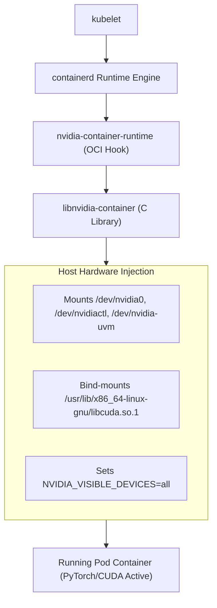

# 14. NVIDIA Container Toolkit & GPU Virtualization — CDI, MIG, Time-Slicing & MPS

By default, Linux containers have zero access to the host's GPU hardware. The character device nodes (`/dev/nvidia0`, `/dev/nvidiactl`) and driver libraries (`libcuda.so`) are isolated outside the container's mount namespace.

This guide explores the **NVIDIA Container Toolkit (`nvidia-ctk`)**, the **Container Device Interface (CDI)**, and a deep architectural comparison of GPU partitioning technologies: **Time-Slicing**, **MIG**, **MPS**, and **vGPU**.

---

## 📑 Table of Contents
1. [The Container GPU Isolation Problem](#1-the-container-gpu-isolation-problem)
2. [Evolution of the NVIDIA Container Stack](#2-evolution-of-the-nvidia-container-stack)
3. [NVIDIA Container Toolkit & CDI Architecture](#3-nvidia-container-toolkit--cdi-architecture)
4. [GPU Sharing Strategy 1: Time-Slicing (Recommended for Lab)](#4-gpu-sharing-strategy-1-time-slicing-recommended-for-lab)
5. [GPU Sharing Strategy 2: Multi-Instance GPU (MIG)](#5-gpu-sharing-strategy-2-multi-instance-gpu-mig)
6. [GPU Sharing Strategy 3: Multi-Process Service (MPS)](#6-gpu-sharing-strategy-3-multi-process-service-mps)
7. [GPU Sharing Strategy 4: vGPU & Why VMware is Avoided](#7-gpu-sharing-strategy-4-vgpu--why-vmware-is-avoided)
8. [Comprehensive Comparison Matrix](#8-comprehensive-comparison-matrix)
9. [Production Diagnostics & Troubleshooting](#9-production-diagnostics--troubleshooting)
10. [Hands-On CDI & Container Toolkit Labs](#10-hands-on-cdi--container-toolkit-labs)

---

## 1. The Container GPU Isolation Problem

When `containerd` creates a Linux container:
- It creates isolated namespaces (`pid`, `net`, `mnt`).
- The `/dev` directory inside the container is an empty `tmpfs`.
- The container cannot see `/dev/nvidia*` or `/dev/nvidia-uvm`.
- The container has its own `/usr/lib/` and lacks the host's proprietary `libcuda.so.1` driver library.

If you run `python3 -c "import torch; torch.cuda.is_available()"` inside a standard unconfigured container, it returns `False`.

---

## 2. Evolution of the NVIDIA Container Stack

```text
1. nvidia-docker (v1) [Deprecated]
   └── Custom Docker daemon wrapper that pre-mounted host volumes. Fragile and non-standard.

2. nvidia-docker2 (v2) [Deprecated]
   └── Injected an OCI prestart hook into Docker engine.

3. NVIDIA Container Toolkit (Current Industry Standard)
   └── Plugs natively into `containerd` and `CRI-O` using OCI hooks and `libnvidia-container`.

4. Container Device Interface (CDI) [Next Generation]
   └── Declarative YAML specification (`/etc/cdi/nvidia.yaml`) standardized by CNCF.
```

---

## 3. NVIDIA Container Toolkit & CDI Architecture



### The Container Device Interface (CDI):
With CDI, device access is declared statically in a YAML manifest:
```yaml
# /etc/cdi/nvidia.yaml
cdiVersion: "0.5.0"
kind: "nvidia.com/gpu"
devices:
  - name: "0"
    containerEdits:
      deviceNodes:
        - path: "/dev/nvidia0"
        - path: "/dev/nvidiactl"
        - path: "/dev/nvidia-uvm"
```

---

## 4. GPU Sharing Strategy 1: Time-Slicing (Recommended for Lab)

Time-slicing allows multiple Pods to share a single physical GPU by alternating execution cycles in time:

```text
Physical GPU: 100% Compute
├── Pod 1 (k3s-alpha) ──> Executes CUDA kernels for 10ms
├── Pod 2 (k3s-beta)  ──> Executes CUDA kernels for 10ms
└── Pod 3             ──> Executes CUDA kernels for 10ms
```

### Pros:
- Works on **every NVIDIA GPU** (including single workstation GPUs, DGX Spark, and GPUs without MIG).
- Configured purely in software via the Kubernetes Device Plugin ConfigMap.

### Cons:
- **No Hardware Memory Isolation**: If Pod 1 allocates 100% of the GPU's memory, Pod 2 will crash with `CUDA out of memory`.

---

## 5. GPU Sharing Strategy 2: Multi-Instance GPU (MIG)

Available on Ampere (A100), Hopper (H100), and Blackwell enterprise architectures.

MIG partitions the **physical silicon** of a single GPU into up to 7 independent GPU instances:

```text
+-----------------------------------------------------------------------------------+
|                        Physical A100/H100/Blackwell GPU (80GB)                    |
|                                                                                   |
|  +------------------+  +------------------+  +----------------------------------+  |
|  | MIG 1g.10gb      |  | MIG 1g.10gb      |  | MIG 3g.40gb                      |  |
|  | - 1/7th SMs      |  | - 1/7th SMs      |  | - 3/7th SMs                      |  |
|  | - 10GB HBM       |  | - 10GB HBM       |  | - 40GB HBM                       |  |
|  | - Isolated Path  |  | - Isolated Path  |  | - Isolated Memory Controller     |  |
|  +------------------+  +------------------+  +----------------------------------+  |
+-----------------------------------------------------------------------------------+
```

### The Superpower of MIG:
- **100% Hardware Fault Isolation**: If Pod 1 triggers a kernel panic or out-of-memory error inside its slice, **the other slices continue running without dropping a single frame**.

---

## 6. GPU Sharing Strategy 3: Multi-Process Service (MPS)

CUDA Multi-Process Service (MPS) allows multiple CUDA processes to execute concurrently on the same GPU without time-slicing context switch overhead:

- A central MPS control daemon runs on the host.
- Multiple client containers connect to the MPS server over a shared IPC domain socket.
- **Resource Limits**:
  - `CUDA_MPS_PINNED_DEVICE_MEM_LIMIT=0=5120M` (Strictly caps memory at 5GB).
  - `CUDA_MPS_ACTIVE_THREAD_PERCENTAGE=20` (Caps compute execution threads at 20%).

---

## 7. GPU Sharing Strategy 4: vGPU & Why VMware is Avoided

In enterprise virtualization (VMware ESXi), GPUs are partitioned using **NVIDIA vGPU (Virtual GPU Manager)**:
- A hypervisor kernel driver intercepts PCI configuration cycles.
- Creates virtual PCI devices attached to virtual machines.

### Why Leading AI Teams Avoid VMware/vGPU:
1. **Virtualization Tax**: 5% to 15% compute overhead from hypervisor CPU scheduling and MMIO page table translations.
2. **Unified Memory Disruption**: High-speed NVLink-C2C coherent memory between Grace CPU and Blackwell GPU cannot traverse the VM boundary natively.
3. **Expensive Licensing**: Requires annual per-GPU enterprise software licenses.
4. **Containerization Superiority**: Bare-metal Linux containers provide native hardware performance (<0.1% overhead) with instant sub-second startup times.

---

## 8. Comprehensive Comparison Matrix

| Feature | Time-Slicing | CUDA MPS | MIG (Multi-Instance) | VMware vGPU |
| :--- | :--- | :--- | :--- | :--- |
| **Isolation Level** | Software Temporal | Software Threads | **Hardware Silicon** | Hardware Emulation |
| **Supported Hardware** | **All NVIDIA GPUs** | All NVIDIA GPUs | A100 / H100 / Blackwell | Enterprise GPUs |
| **Memory Isolation** | ❌ Shared / None | ⚠️ Software Pinned | ✅ **100% Hardware** | ✅ Hardware Memory |
| **Fault Isolation** | ❌ Shared Context | ❌ Shared Context | ✅ **Isolated Slices** | ✅ Isolated VMs |
| **Overhead** | Context Switch Delay | Ultra-Low | **0% (Native Silicon)**| 5% - 15% (Hypervisor) |
| **Suitability for Lab** | **Ideal for DGX Spark** | Advanced Batch | Enterprise Clusters | Virtual Desktops |

---

## 9. Production Diagnostics & Troubleshooting

### Scenario 1: `could not select device driver "" with capabilities: [[gpu]]`
- **Symptom**: Pod fails to start; `containerd` reports device driver error.
- **Root Cause**: `containerd` has not been configured to use the NVIDIA runtime as default, or `nvidia-container-runtime` binary is missing from PATH.
- **Resolution**: Verify `/etc/containerd/config.toml` includes `BinaryName = "/usr/bin/nvidia-container-runtime"` and restart containerd.

---

### Scenario 2: CDI Device Not Found (`unknown device nvidia.com/gpu=0`)
- **Symptom**: Pod fails with `unrecognized CDI device`.
- **Resolution**: Regenerate the CDI specification file on the host:
  ```bash
  sudo nvidia-ctk cdi generate --output=/etc/cdi/nvidia.yaml
  ```

---

## 10. Hands-On CDI & Container Toolkit Labs

### Lab 1: Generate and Inspect the Host CDI Specification
Run this command on your DGX Spark host:
```bash
# Generate CDI configuration:
sudo nvidia-ctk cdi generate --output=/etc/cdi/nvidia.yaml

# Verify recognized devices:
nvidia-ctk cdi list
```
*Inspect `/etc/cdi/nvidia.yaml` using `cat` to see the exact character device nodes and driver libraries injected into containers.*

### Lab 2: Test Low-Level Container GPU Access Without Kubernetes
Verify that the host container runtime can run a GPU container directly via `nerdctl` or `crictl`:
```bash
sudo ctr run --rm --gpus 0 docker.io/nvidia/cuda:12.0.0-base-ubuntu22.04 test-cuda nvidia-smi
```
*Observe the clean `nvidia-smi` output generated from inside the isolated container.*

---

Proceed to [**15-dgx-spark-datacenter-simulation-lab.md**](15-dgx-spark-datacenter-simulation-lab.md) to execute the complete bare-metal simulation lab on your DGX Spark machine.
