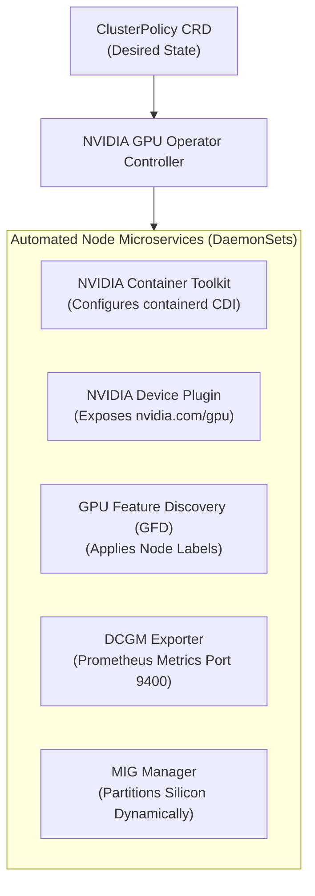
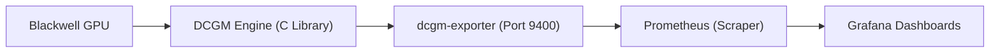

# 16. NVIDIA GPU Operator & Network Operator — Enterprise Cluster Automation

In small lab setups, configuring the NVIDIA driver, container toolkit, and device plugin manually is manageable. However, in enterprise AI data centers with hundreds or thousands of DGX nodes, manual host-by-host configuration is impossible to maintain.

The **NVIDIA GPU Operator** and **NVIDIA Network Operator** form the cloud-native software foundation that automates hardware provisioning, node labeling, telemetry, and high-speed RDMA networking across the entire cluster.

---

## 📑 Table of Contents
1. [The Operator Pattern for High-Performance Hardware](#1-the-operator-pattern-for-high-performance-hardware)
2. [Anatomy of the NVIDIA GPU Operator](#2-anatomy-of-the-nvidia-gpu-operator)
3. [The `ClusterPolicy` Custom Resource](#3-the-clusterpolicy-custom-resource)
4. [Deploying via Helm on DGX Systems](#4-deploying-via-helm-on-dgx-systems)
5. [NVIDIA Network Operator: RoCE, InfiniBand & SR-IOV](#5-nvidia-network-operator-roce-infiniband--sr-iov)
6. [DCGM Metrics & Prometheus / Grafana Dashboards](#6-dcgm-metrics--prometheus--grafana-dashboards)
7. [Production Failure Scenarios & Operator Diagnostics](#7-production-failure-scenarios--operator-diagnostics)
8. [Hands-On GPU Operator & DCGM Labs](#8-hands-on-gpu-operator--dcgm-labs)

---

## 1. The Operator Pattern for High-Performance Hardware

A Kubernetes **Operator** encodes human administrative expertise into software:
- Uses Custom Resource Definitions (CRDs) like `ClusterPolicy` and `NicClusterPolicy`.
- Employs reconciliation loops that continuously enforce the desired hardware state.
- Automatically handles node additions, driver recompilations, and telemetry exporters without administrator intervention.



---

## 2. Anatomy of the NVIDIA GPU Operator

| Component | Responsibility in Cluster |
| :--- | :--- |
| **`ClusterPolicy`** | Root configuration object specifying component versions and operational modes. |
| **NVIDIA Driver Container** | Compiles and loads kernel modules (`nvidia.ko`). *(Disabled on DGX systems with pre-installed host drivers)*. |
| **NVIDIA Container Toolkit** | Injects low-level OCI runtime hooks into `containerd`. |
| **Kubernetes Device Plugin** | Advertises physical or time-sliced GPUs to `kubelet`. |
| **GPU Feature Discovery (GFD)** | Interrogates hardware and applies standard labels (e.g. `nvidia.com/gpu.family=blackwell`). |
| **DCGM Exporter** | Streams real-time metrics (utilization, temperature, power, Xid errors) to Prometheus. |
| **NVIDIA MIG Manager** | Declaratively partitions GPUs into hardware slices according to YAML profiles. |

---

## 3. The `ClusterPolicy` Custom Resource

On DGX systems, the NVIDIA driver is pre-installed in the host kernel. The `ClusterPolicy` must be configured to **use the existing host driver**:

```yaml
apiVersion: nvidia.com/v1
kind: ClusterPolicy
metadata:
  name: gpu-cluster-policy
spec:
  operator:
    defaultRuntime: containerd

  # On DGX systems, host driver is pre-installed:
  driver:
    enabled: false

  toolkit:
    enabled: true

  devicePlugin:
    enabled: true
    config:
      create: true
      name: "time-slicing-config"
      data:
        any: |-
          version: v1
          flags:
            migStrategy: none
          sharing:
            timeSlicing:
              resources:
                - name: nvidia.com/gpu
                  replicas: 10

  dcgmExporter:
    enabled: true
    serviceMonitor:
      enabled: true

  gfd:
    enabled: true

  mig:
    strategy: none
```

---

## 4. Deploying via Helm on DGX Systems

```bash
# 1. Add NVIDIA Helm Repository
helm repo add nvidia https://helm.ngc.nvidia.com/nvidia
helm repo update

# 2. Deploy GPU Operator with DGX values
helm install --wait \
  -n gpu-operator --create-namespace \
  gpu-operator nvidia/gpu-operator \
  --set driver.enabled=false \
  --set toolkit.enabled=true \
  --set dcgmExporter.enabled=true
```

---

## 5. NVIDIA Network Operator: RoCE, InfiniBand & SR-IOV

In distributed multi-node AI clusters, compute is only half of the equation; **networking is the critical bottleneck**.

The **NVIDIA Network Operator** automates the deployment of:
- **MOFED (Mellanox OpenFabrics Enterprise Distribution)**: Kernel drivers for ConnectX NICs.
- **SR-IOV Network Operator**: Partitions 1 physical InfiniBand/Ethernet NIC into multiple Virtual Functions (VFs) with dedicated PCIe addresses.
- **Secondary CNI (Multus)**: Allows a single Pod to possess **two distinct network interfaces**:
  1. `eth0`: Standard Kubernetes CNI (Flannel/Calico) for cluster management and API traffic.
  2. `net1`: High-speed InfiniBand/RoCE interface with direct access to ConnectX NICs for ultra-fast **GPUDirect RDMA** training traffic.

```text
+-----------------------------------------------------------------------------------+
|                         Pod: Distributed PyTorch Worker                           |
|                                                                                   |
|    +----------------------------+             +------------------------------+    |
|    | `eth0` (Cluster Network)   |             | `net1` (RDMA InfiniBand)     |    |
|    | Used for:                  |             | Used for:                    |    |
|    | - Logging & Metrics        |             | - NCCL AllReduce Gradients   |    |
|    | - Health checks            |             | - 800 Gbps Sub-microsecond   |    |
|    | - API Server communication |             | - Direct GPU-to-GPU memory   |    |
|    +----------------------------+             +------------------------------+    |
+-----------------------------------------------------------------------------------+
```

---

## 6. DCGM Metrics & Prometheus / Grafana Dashboards

The **Data Center GPU Manager (DCGM)** exporter streams metrics on port `9400` in standard Prometheus text format:



### Critical DCGM Metrics for Production Monitoring:

| Metric Name | What it Measures | Alert Threshold |
| :--- | :--- | :--- |
| `DCGM_FI_DEV_GPU_UTIL` | GPU core execution percentage (0-100%) | Alert if < 10% on active training jobs (indicates I/O bottleneck) |
| `DCGM_FI_DEV_FB_USED` | Framebuffer (GPU VRAM) consumed in MB | Alert if > 95% (risk of imminent CUDA OOM) |
| `DCGM_FI_DEV_GPU_TEMP` | Silicon core temperature in Celsius | Alert if > 82°C (triggers thermal throttling) |
| `DCGM_FI_DEV_POWER_USAGE` | Real-time electrical power draw in Watts | Monitor for power capping or supply degradation |
| `DCGM_FI_DEV_XID_ERRORS` | Hardware/Driver exception error code | **Critical Alert**: Non-zero indicates driver crash or memory parity error |
| `DCGM_FI_DEV_PCIE_REPLAY_COUNTER`| PCIe transmission error retries | Non-zero indicates damaged cable or dirty PCIe slot |

---

## 7. Production Failure Scenarios & Operator Diagnostics

### Scenario 1: `ClusterPolicy` Stuck in `NotReady`
- **Symptom**: `kubectl get clusterpolicy` displays status `NotReady` indefinitely.
- **Triage**:
  ```bash
  # Check which daemonset component failed to initialize:
  kubectl get daemonsets -n gpu-operator
  
  # Inspect logs of the failing pod:
  kubectl logs -n gpu-operator -l app=nvidia-container-toolkit-daemonset
  ```
- **Root Cause**: Often caused by trying to run the driver container (`driver.enabled=true`) on a machine that already has a host driver loaded, causing an `EADDRINUSE` or kernel module conflict.

---

### Scenario 2: Node Labels Missing (Workloads Cannot Schedule)
- **Symptom**: Workloads with `nodeSelector: nvidia.com/gpu.family=blackwell` stay `Pending`.
- **Root Cause**: The **GPU Feature Discovery (GFD)** pod crashed or failed to communicate with NFD (Node Feature Discovery).
- **Resolution**:
  ```bash
  kubectl restart deployment -n gpu-operator gpu-feature-discovery
  ```

---

## 8. Hands-On GPU Operator & DCGM Labs

### Lab 1: Query DCGM Exporter Endpoint Directly
Query live hardware telemetry emitted by the exporter:
```bash
EXPORTER_POD=$(kubectl get pod -n gpu-operator -l app=nvidia-dcgm-exporter -o jsonpath='{.items[0].metadata.name}')

kubectl exec -n gpu-operator $EXPORTER_POD -- curl -s http://localhost:9400/metrics | grep -E "DCGM_FI_DEV_GPU_UTIL|DCGM_FI_DEV_GPU_TEMP"
```

### Lab 2: Inspect GFD Applied Node Labels
```bash
kubectl get nodes --show-labels | tr ',' '\n' | grep nvidia.com
```
*Verify that `nvidia.com/gpu.family`, `nvidia.com/gpu.product`, and `nvidia.com/cuda.driver.major` are properly registered.*

---

Proceed to [**17-distributed-ai-training-and-nccl.md**](17-distributed-ai-training-and-nccl.md) to master distributed training architectures (DDP, FSDP, Megatron-LM), NCCL collective communications, and GPUDirect RDMA.
