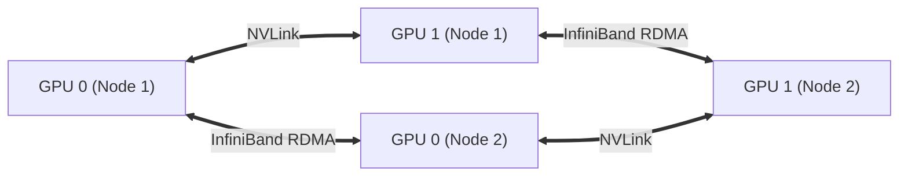

# 17. Distributed AI Training & NCCL — Collective Communications, DDP & GPUDirect RDMA

When training modern artificial intelligence models (such as Llama-3, DeepSeek, or custom enterprise foundation models), the model size exceeds the memory of any single GPU. Training must be distributed across hundreds or thousands of GPUs operating in lockstep.

This guide explores distributed training paradigms (DDP, FSDP, Megatron-LM), the **NVIDIA Collective Communications Library (NCCL)**, **GPUDirect RDMA**, and how to debug multi-node communication hangs.

---

## 📑 Table of Contents
1. [Why Distributed Training? The Memory Equation](#1-why-distributed-training-the-memory-equation)
2. [Distributed Parallelism Paradigms](#2-distributed-parallelism-paradigms)
3. [NCCL: NVIDIA Collective Communications Library](#3-nccl-nvidia-collective-communications-library)
4. [Collective Operations: AllReduce, AllGather & ReduceScatter](#4-collective-operations-allreduce-allgather--reducescatter)
5. [GPUDirect RDMA: Bypassing the Host CPU](#5-gpudirect-rdma-bypassing-the-host-cpu)
6. [Essential NCCL Performance Tuning Flags](#6-essential-nccl-performance-tuning-flags)
7. [Running Multi-Node Training on Kubernetes](#7-running-multi-node-training-on-kubernetes)
8. [Production Diagnostics: Diagnosing NCCL Hangs & Stragglers](#8-production-diagnostics-diagnosing-nccl-hangs--stragglers)
9. [Hands-On Distributed PyTorch AllReduce Lab](#9-hands-on-distributed-pytorch-allreduce-lab)

---

## 1. Why Distributed Training? The Memory Equation

To understand why multi-GPU infrastructure is required, consider the memory footprint of training an LLM in 16-bit precision (FP16/BF16):

$$\text{Total Memory Per Parameter} \approx 16 \text{ to } 20 \text{ bytes}$$

| Component | Bytes per Parameter | 70-Billion Parameter Model (Llama-3 70B) |
| :--- | :--- | :--- |
| **Model Weights (FP16)** | 2 bytes | 140 GB |
| **Gradients (FP16)** | 2 bytes | 140 GB |
| **Optimizer States (AdamW: FP32 Master Weights, Momentum, Variance)** | 12 bytes | 840 GB |
| **Activations & KV Cache** | Variable | 200+ GB |
| **Total VRAM Needed** | **~18 bytes / param** | **~1,320 GB (1.3 TB)** |

A single 80GB or 141GB GPU cannot even load the optimizer states! The workload **must** be sharded across an interconnected cluster of GPUs.

---

## 2. Distributed Parallelism Paradigms

```text
+-----------------------------------------------------------------------------------+
| 1. Data Parallelism (DDP / FSDP)                                                  |
| - Every GPU holds model weights, processes distinct mini-batches of data, and     |
|   synchronizes gradients via AllReduce.                                           |
+-----------------------------------------------------------------------------------+
| 2. Tensor Parallelism (TP - Megatron-LM)                                          |
| - Individual weight matrices (Attention QKV, MLP layers) are mathematically       |
|   split across GPUs in the SAME server over ultra-fast NVLink (900-1800 GB/s).    |
+-----------------------------------------------------------------------------------+
| 3. Pipeline Parallelism (PP)                                                      |
| - Model layers are divided across different physical servers (e.g. Layers 1-16 on |
|   Node 1, Layers 17-32 on Node 2) over InfiniBand fabrics.                        |
+-----------------------------------------------------------------------------------+
| 4. Mixture of Experts (MoE) Routing                                               |
| - Gating network routes tokens dynamically to specialized expert GPUs.            |
+-----------------------------------------------------------------------------------+
```

---

## 3. NCCL: NVIDIA Collective Communications Library

**NCCL** is the high-performance communications backbone developed by NVIDIA. It is the underlying engine invoked by PyTorch (`torch.distributed`), DeepSpeed, Megatron, and JAX.
- Auto-detects physical topology (NVLink vs PCIe vs InfiniBand).
- Automatically builds ring or tree communication graphs to achieve line-rate throughput.



---

## 4. Collective Operations: AllReduce, AllGather & ReduceScatter

Understanding these collective algorithms is mandatory for debugging distributed bottlenecks:

```text
1. AllReduce (The Heart of Distributed Training):
   Input:  [Rank 0: A]   [Rank 1: B]   [Rank 2: C]
   Output: [Rank 0: A+B+C] [Rank 1: A+B+C] [Rank 2: A+B+C]
   (Used by PyTorch DDP to average gradients after every backward pass)

2. AllGather:
   Input:  [Rank 0: A]   [Rank 1: B]   [Rank 2: C]
   Output: [Rank 0: A,B,C] [Rank 1: A,B,C] [Rank 2: A,B,C]
   (Used by FSDP to reconstruct full layer weights right before forward pass)

3. ReduceScatter:
   Input:  [Rank 0: A0,A1]   [Rank 1: B0,B1]
   Output: [Rank 0: A0+B0]   [Rank 1: A1+B1]
   (Used by ZeRO / FSDP to sum and partition gradients simultaneously)
```

---

## 5. GPUDirect RDMA: Bypassing the Host CPU

Traditional network transfers require **CPU bounce buffers**:
`GPU 0 VRAM ──> Host RAM (CPU Copy) ──> Kernel Socket ──> NIC ──> Network`

With **GPUDirect RDMA**:
The ConnectX NIC reads tensors directly out of GPU High-Bandwidth Memory over PCIe/NVLink with **zero CPU cycles involved**:

```text
[ GPU Memory (Server 1) ] ===== GPUDirect RDMA =====> [ ConnectX NIC ]
                                                             │
                                                       InfiniBand Wire
                                                             │
[ GPU Memory (Server 2) ] <==== GPUDirect RDMA ===== [ ConnectX NIC ]
```

---

## 6. Essential NCCL Performance Tuning Flags

When configuring Kubernetes Pod specs for distributed jobs, inject these critical environment variables:

```bash
# 1. Enable detailed debug logging:
export NCCL_DEBUG=INFO
export NCCL_DEBUG_SUBSYS=INIT,COLL,ENV,NET

# 2. Enforce Level 5 GPUDirect RDMA (full NVLink/PCIe bypass):
export NCCL_NET_GDR_LEVEL=5

# 3. Specify network interfaces to use for NCCL:
export NCCL_SOCKET_IFNAME=eth0,ib0

# 4. Set communication ring buffer size to 8MB:
export NCCL_BUFFSIZE=8388608

# 5. Disable InfiniBand only if running on pure Ethernet:
# export NCCL_IB_DISABLE=1
```

---

## 7. Running Multi-Node Training on Kubernetes

A multi-node training job on Kubernetes requires:
1. **`MASTER_ADDR`**: The DNS name of the Rank 0 worker (provided by a Headless Service).
2. **`MASTER_PORT`**: Port `29500` (default PyTorch rendezvous port).
3. **`WORLD_SIZE`**: Total number of GPU processes across the entire cluster.
4. **`RANK`**: The unique global integer ID of this worker (0 to `WORLD_SIZE - 1`).

```yaml
apiVersion: v1
kind: Pod
metadata:
  name: pytorch-worker-0
  namespace: k3s-alpha
spec:
  containers:
    - name: pytorch
      image: nvcr.io/nvidia/pytorch:24.01-py3
      env:
        - name: MASTER_ADDR
          value: "pytorch-master-headless.k3s-alpha.svc.cluster.local"
        - name: MASTER_PORT
          value: "29500"
        - name: WORLD_SIZE
          value: "2"
        - name: RANK
          value: "0"
        - name: NCCL_DEBUG
          value: "INFO"
      resources:
        limits:
          nvidia.com/gpu: 1
```

---

## 8. Production Diagnostics: Diagnosing NCCL Hangs & Stragglers

### The #1 AI Infrastructure Issue: The Silent Hang
- **Symptom**: GPUs show 100% compute utilization for 20 minutes, then suddenly drop to 0% and sit idle forever. No error is thrown.
- **Root Cause**: One worker encountered a dropped packet or hardware exception during an AllReduce barrier. The remaining $N-1$ workers wait at the barrier indefinitely.
- **Triage**:
  1. Inspect container logs with `NCCL_DEBUG=INFO`. Look for the last line logged before the hang:
     ```text
     [0] NCCL INFO Ring 00 : 0 [0] -> 1 [1] via NET/Socket
     ```
  2. Enable NCCL Watchdog timer so PyTorch aborts automatically on timeout:
     ```bash
     export TORCH_DISTRIBUTED_DEBUG=DETAIL
     export NCCL_ASYNC_ERROR_HANDLING=1
     ```

### The Straggler Effect:
If 1 GPU out of 1,024 throttles due to heat and runs 20% slower, **all 1,023 other GPUs must wait at the AllReduce barrier for the slow GPU to finish**. A single slow node degrades the entire supercomputer's throughput.

---

## 9. Hands-On Distributed PyTorch AllReduce Lab

Execute an in-memory distributed tensor synchronization test on your DGX Spark:

```bash
kubectl exec -it pytorch-benchmark -n k3s-alpha -- python3 -c "
import torch
import torch.distributed as dist
import os

# Initialize mock single-node distributed backend using NCCL
os.environ['MASTER_ADDR'] = '127.0.0.1'
os.environ['MASTER_PORT'] = '29500'
dist.init_process_group(backend='nccl', rank=0, world_size=1)

print('NCCL Process Group Initialized Successfully!')
tensor = torch.ones(5, device='cuda') * 42
print('Local GPU Tensor:', tensor)

dist.all_reduce(tensor, op=dist.ReduceOp.SUM)
print('Tensor after NCCL AllReduce:', tensor)
dist.destroy_process_group()
"
```
*Expected: Clean initialization of NCCL communication ring and successful tensor reduction.*

---

Proceed to [**18-large-scale-superpod-and-network-fabrics.md**](18-large-scale-superpod-and-network-fabrics.md) to explore DGX SuperPOD architectures, non-blocking Fat-Tree Clos topologies, and InfiniBand vs Spectrum-X RoCE fabrics.
