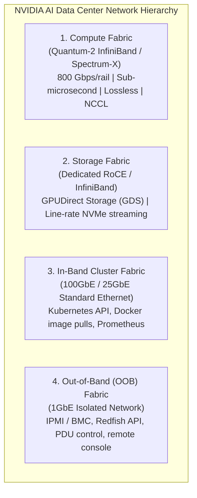

# 18. Large-Scale SuperPOD & Network Fabrics — InfiniBand, RoCE & Topologies

Operating a single DGX node is software engineering; orchestrating **1,000+ DGX nodes in a SuperPOD** is industrial supercomputing. At this scale, physics, optical transceiver health, rack power distribution, and network switch oversubscription dictate cluster throughput.

This guide details the architectural blueprint of an **NVIDIA DGX SuperPOD**, the Four Data Center Fabrics, non-blocking Fat-Tree topologies, Rail-Optimized routing, and InfiniBand vs. Spectrum-X RoCE.

---

## 📑 Table of Contents
1. [Anatomy of an NVIDIA DGX SuperPOD](#1-anatomy-of-an-nvidia-dgx-superpod)
2. [The Four Data Center Physical Fabrics](#2-the-four-data-center-physical-fabrics)
3. [Fat-Tree (Clos) Network Topologies & Non-Blocking Bandwidth](#3-fat-tree-clos-network-topologies--non-blocking-bandwidth)
4. [Rail-Optimized Networking Deep Dive](#4-rail-optimized-networking-deep-dive)
5. [InfiniBand vs. Spectrum-X Ethernet (RoCE v2)](#5-infiniband-vs-spectrum-x-ethernet-roce-v2)
6. [NVIDIA BlueField-3 DPUs: Infrastructure Offloading](#6-nvidia-bluefield-3-dpus-infrastructure-offloading)
7. [Production Fabric Diagnostics & Cable Fault Isolation](#7-production-fabric-diagnostics--cable-fault-isolation)
8. [Hands-On High-Speed Fabric Labs](#8-hands-on-high-speed-fabric-labs)

---

## 1. Anatomy of an NVIDIA DGX SuperPOD

The standard unit of scale in NVIDIA AI supercomputers is the **Scalable Unit (SU)**:

```text
+-----------------------------------------------------------------------------------+
|                        DGX SuperPOD Scalable Unit (SU)                            |
|                                                                                   |
|  ├── 32x DGX Server Nodes (256x Tensor Core GPUs)                                 |
|  ├── Intra-Node: 5th Gen NVLink (1.8 TB/s per GPU bisection bandwidth)           |
|  ├── Inter-Node Compute: 8x Quantum-2 InfiniBand Switches (800 Gbps per rail)     |
|  ├── Storage Fabric: High-Throughput NVMe-oF Array (VAST Data / Weka.IO)          |
|  ├── Management Fabric: 2x 100GbE SN2201 Switches for Kubernetes Control Plane    |
|  └── Power & Cooling: 40kW - 120kW per rack (Direct-to-Chip Liquid Cooling)       |
+-----------------------------------------------------------------------------------+
```

---

## 2. The Four Data Center Physical Fabrics

Every enterprise AI data center operates four strictly segregated network fabrics:



---

## 3. Fat-Tree (Clos) Network Topologies & Non-Blocking Bandwidth

In traditional corporate networks, switches are oversubscribed (e.g. 3:1 ratio: 300 Gbps downlink to servers, but only 100 Gbps uplink to the core).

In an AI SuperPOD, **oversubscription is strictly forbidden**. The network must be **1:1 Full Bisection Non-Blocking**: any GPU can transmit at full 800 Gbps to any other GPU in the data center simultaneously without dropped packets or congestion.

```text
                 [ Spine Switch Layer (Director Switches) ]
                        /            |            \
                       /             |             \
                      /              |              \
           [ Leaf Switch 1 ]   [ Leaf Switch 2 ]   [ Leaf Switch 3 ]
              /        \          /        \          /        \
           DGX-1      DGX-2    DGX-3      DGX-4    DGX-5      DGX-6
```

---

## 4. Rail-Optimized Networking Deep Dive

In an 8-GPU DGX server, each GPU is paired directly with its own dedicated ConnectX Network Interface Card (NIC 0 through 7).

Instead of wiring all NICs on a server to the same switch, DGX SuperPODs use **Rail Optimization**:

```text
DGX Node 1                                              DGX Node 2
+----------------------------+                          +----------------------------+
| GPU 0 ─── ConnectX NIC 0   |==== [ Rail 0 Switch ] ===| ConnectX NIC 0 ─── GPU 0   |
| GPU 1 ─── ConnectX NIC 1   |==== [ Rail 1 Switch ] ===| ConnectX NIC 1 ─── GPU 1   |
| GPU 2 ─── ConnectX NIC 2   |==== [ Rail 2 Switch ] ===| ConnectX NIC 2 ─── GPU 2   |
| GPU 3 ─── ConnectX NIC 3   |==== [ Rail 3 Switch ] ===| ConnectX NIC 3 ─── GPU 3   |
| GPU 4 ─── ConnectX NIC 4   |==== [ Rail 4 Switch ] ===| ConnectX NIC 4 ─── GPU 4   |
| GPU 5 ─── ConnectX NIC 5   |==== [ Rail 5 Switch ] ===| ConnectX NIC 5 ─── GPU 5   |
| GPU 6 ─── ConnectX NIC 6   |==== [ Rail 6 Switch ] ===| ConnectX NIC 6 ─── GPU 6   |
| GPU 7 ─── ConnectX NIC 7   |==== [ Rail 7 Switch ] ===| ConnectX NIC 7 ─── GPU 7   |
+----------------------------+                          +----------------------------+
```

### The Architectural Advantage:
When a distributed AllReduce runs:
- GPU 0 on all 1,000 servers communicates strictly through the **Rail 0 Switch fabric**.
- GPU 1 communicates strictly through **Rail 1 Switch fabric**.
- Traffic never crosses rails, completely eliminating inter-switch cross-talk and buffer contention!

---

## 5. InfiniBand vs. Spectrum-X Ethernet (RoCE v2)

| Criterion | Quantum-2 InfiniBand | Spectrum-X Ethernet (RoCE v2) |
| :--- | :--- | :--- |
| **Flow Control** | **Credit-Based** (Physical hardware flow control; zero packet drops) | **Priority Flow Control (PFC)** + ECN (Congestion Notification) |
| **Routing** | Static / Adaptive via Subnet Manager (OpenSM) | Dynamic Adaptive Routing across Ethernet paths |
| **Latency** | **< 100 nanoseconds** | ~ 400 - 800 nanoseconds |
| **Standard** | Dedicated InfiniBand Standard | Standard IEEE 802.3 Ethernet Compatible |
| **Deployment** | Turnkey DGX SuperPOD standard | Preferred by hyperscalers leveraging existing Ethernet fiber |

---

## 6. NVIDIA BlueField-3 DPUs: Infrastructure Offloading

A **Data Processing Unit (DPU)** is a system-on-chip that pairs high-performance ARM CPU cores with ConnectX network silicon:
- Runs its own independent Linux operating system directly on the PCIe card.
- **Offloads Infrastructure Workloads**:
  - Kubernetes CNI (OVS / Open Virtual Network) runs inside the DPU, consuming 0% of the host Grace CPU.
  - Line-rate hardware encryption (IPsec / TLS).
  - Storage virtualization (emulates local NVMe drives over remote NVMe-oF networks).

---

## 7. Production Fabric Diagnostics & Cable Fault Isolation

In a cluster with 10,000 optical transceivers and fiber cables, cable degradation is a daily occurrence.

### Diagnostic Tools:
```bash
# 1. Query status of InfiniBand ports:
ibstat

# 2. Check for port error counters (symbol errors, link down, buffer overruns):
ibqueryerrors

# 3. Perform automated fabric health check:
sudo ibdiagnet
```

### Symptoms of a Bad Cable:
- `SymbolErrors`: High count indicates dirty optical connector or bend in fiber cable.
- `PortRcvErrors`: Indicates signal integrity loss.
- `LinkDowned`: Port keeps flapping; automatically isolated by Subnet Manager.

---

## 8. Hands-On High-Speed Fabric Labs

### Lab 1: Query High-Speed Network Interfaces on Host
```bash
# Check for ConnectX / InfiniBand network devices:
lspci | grep -i mellanox

# Inspect link speed on host interfaces:
ip -s link show
```

---

Proceed to [**19-cluster-diagnostics-and-failure-scenarios.md**](19-cluster-diagnostics-and-failure-scenarios.md) for the master cluster diagnostics playbook, covering etcd recovery, certificate expiration, network partitions, and NVIDIA Xid errors.
