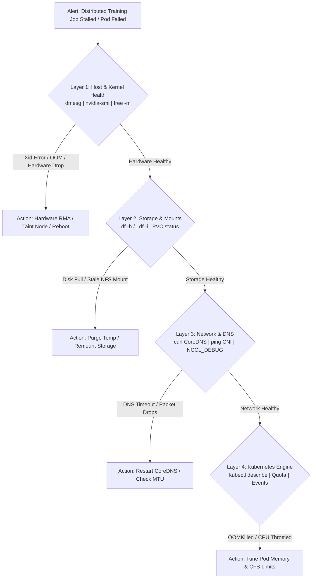

# 19. Cluster Diagnostics & Failure Scenarios — Master Troubleshooting Playbook

When operating production AI clusters, failures are not anomalies; they are normal daily events. At a scale of 10,000 GPUs, hardware failures, optic degradations, silent hangs, memory corruptions, and network partitions happen constantly.

This guide provides the **Master Troubleshooting Playbook** for infrastructure engineers, covering control plane recovery, certificate expiration, network isolation, and the complete **NVIDIA Xid Hardware Error Matrix**.

---

## 📑 Table of Contents
1. [The AI Infrastructure Triage Methodology](#1-the-ai-infrastructure-triage-methodology)
2. [Scenario 1: Control Plane Quorum Loss (etcd Disaster)](#2-scenario-1-control-plane-quorum-loss-etcd-disaster)
3. [Scenario 2: TLS Certificate Expiration Trap](#3-scenario-2-tls-certificate-expiration-trap)
4. [Scenario 3: Complete CNI Network Partition](#4-scenario-3-complete-cni-network-partition)
5. [Scenario 4: CoreDNS Cluster-Wide Lookup Failure](#5-scenario-4-coredns-cluster-wide-lookup-failure)
6. [Scenario 5: The Production NVIDIA Xid Error Matrix](#6-scenario-5-the-production-nvidia-xid-error-matrix)
7. [Scenario 6: Identifying GPU Stragglers in Distributed Training](#7-scenario-6-identifying-gpu-stragglers-in-distributed-training)
8. [Container Exit Codes Diagnostic Reference](#8-container-exit-codes-diagnostic-reference)
9. [Hands-On Fault Injection & Recovery Labs](#9-hands-on-fault-injection--recovery-labs)

---

## 1. The AI Infrastructure Triage Methodology

When an alert fires, follow this deterministic 4-layer diagnostic triage tree:



---

## 2. Scenario 1: Control Plane Quorum Loss (etcd Disaster)

### The Failure:
In a 3-node etcd cluster, 2 nodes experience simultaneous hardware failure. Quorum ($Q = 2$) is lost. The `kube-apiserver` crashes, and `kubectl` commands fail with:
```text
The connection to the server 192.168.1.101:6443 was refused - did you specify the right host or port?
```

### Emergency Recovery Procedure:
Force the single surviving node to re-elect itself as a new standalone cluster:

1. Stop the failing etcd service:
   ```bash
   sudo systemctl stop etcd
   ```
2. Re-initialize the cluster using `--force-new-cluster`:
   ```bash
   etcd --force-new-cluster \
     --data-dir=/var/lib/etcd \
     --listen-peer-urls=https://127.0.0.1:2380 \
     --listen-client-urls=https://127.0.0.1:2379 \
     --initial-advertise-peer-urls=https://127.0.0.1:2380
   ```
3. Once the database is online, restart the Kubernetes API server.
4. Scale up new healthy members to restore 3-node high availability.

---

## 3. Scenario 2: TLS Certificate Expiration Trap

### The Failure:
Standard Kubernetes PKI certificates expire exactly **1 year** after cluster initialization. When they expire, all communication between `kubelet`, `apiserver`, and `scheduler` is terminated:
```text
Unable to connect to the server: x509: certificate has expired or is not yet valid
```

### Emergency Renewal Procedure:
```bash
# 1. Check expiration dates of all cluster certs:
sudo kubeadm certs check-expiration

# 2. Renew all certificates immediately:
sudo kubeadm certs renew all

# 3. If using K3s, rotate certificates with a single restart:
sudo systemctl restart k3s
```

---

## 4. Scenario 3: Complete CNI Network Partition

### The Failure:
Pods on Node 1 cannot send packets to Pods on Node 2. Training jobs hang at the initial socket handshake.

### Root Cause Checklist:
1. **Firewall Blocking VXLAN Port 8472**:
   ```bash
   sudo ufw allow 8472/udp
   ```
2. **iptables FORWARD Chain Set to DROP**:
   Docker or host security software set the default policy of the `FORWARD` chain to `DROP`:
   ```bash
   sudo iptables -P FORWARD ACCEPT
   ```
3. **MTU Black Hole**: Physical network MTU is 1500, but VXLAN packets exceed this size.
   - Configure CNI MTU to `1450`.

---

## 5. Scenario 4: CoreDNS Cluster-Wide Lookup Failure

### The Failure:
Every new Pod reports `curl: (6) Could not resolve host`.

### Triage Commands:
```bash
# 1. Check if CoreDNS pods are running:
kubectl get pods -n kube-system -l k8s-app=kube-dns

# 2. Check CoreDNS endpoint backends:
kubectl get endpoints kube-dns -n kube-system

# 3. Check for infinite loop crash:
kubectl logs -n kube-system -l k8s-app=kube-dns | grep "Loop detected"
```

---

## 6. Scenario 5: The Production NVIDIA Xid Error Matrix

NVIDIA drivers emit **Xid error codes** directly into the Linux kernel log buffer (`dmesg`) whenever an abnormal GPU event occurs.

```bash
sudo dmesg -T | grep -i "NVRM: Xid"
```

### The Definitive AI Infrastructure Xid Reference:

| Xid Code | Error Message | Underlying Root Cause | Required Action |
| :--- | :--- | :--- | :--- |
| **Xid 31** | `GPU memory page fault` | CUDA application accessed an unmapped virtual memory address. | **Software Bug**: Developer error (tensor index out of bounds). No hardware replacement needed. |
| **Xid 45** | `Preemption timeout` | A CUDA kernel ran continuously without yielding to the scheduler, triggering the watchdog timer. | **Software / Algorithmic**: Tune watchdog or optimize monolithic kernel. |
| **Xid 62** | `Internal microcode breakpoint` | GPU microcode or driver internal state corrupted. | **Driver Glitch**: Reload driver (`modprobe -r nvidia`) or reboot server. |
| **Xid 79** | `GPU has fallen off the bus` | The PCIe link between the GPU and motherboard dropped completely. Caused by power dip, thermal spike, or riser failure. | **Hardware Emergency**: Reseat power cables; check PCIe bus; if recurring, initiate RMA replacement. |
| **Xid 92** | `High uncorrectable ECC error` | A double-bit memory corruption occurred in the High-Bandwidth Memory (HBM). Data is unrecoverable. | **Fatal Silicon Failure**: Taint node immediately (`dedicated=broken:NoSchedule`); replace GPU. |

---

## 7. Scenario 6: Identifying GPU Stragglers in Distributed Training

A **Straggler** is a GPU that appears healthy to `nvidia-smi`, but runs 20% to 50% slower than its peers due to subtle thermal throttling, degraded PCIe links, or high uncorrectable ECC retries.

### Detection Script:
Run across all nodes to compare GPU core clocks and PCIe replay counters:
```bash
nvidia-smi --query-gpu=index,name,clocks.current.graphics,clocks.max.graphics,temperature.gpu,pcie.link.gen.current,pcie.link.width.current \
  --format=csv
```
*If all GPUs run at 1,980 MHz but GPU 4 is stuck at 1,200 MHz, GPU 4 is your straggler.*

---

## 8. Container Exit Codes Diagnostic Reference

When a Pod terminates unexpectedly, its exit code reveals the exact cause of death:

| Exit Code | Signal Name | Meaning & Infrastructure Diagnosis |
| :--- | :--- | :--- |
| **0** | `SUCCESS` | Normal termination. Workload completed cleanly (expected for Jobs). |
| **1** | `SIGHUP / General` | Application-level exception (e.g. unhandled Python syntax error or missing file). |
| **137** | `SIGKILL` ($128 + 9$) | **OOMKilled**: Process exceeded container memory limit (`memory.max`) or host ran out of RAM. |
| **139** | `SIGSEGV` ($128 + 11$)| **Segmentation Fault**: Application tried to read/write invalid CPU/GPU memory. |
| **143** | `SIGTERM` ($128 + 15$)| **Graceful Termination**: Kubernetes sent a stop signal (e.g. node drain or scaling down). |

---

## 9. Hands-On Fault Injection & Recovery Labs

### Lab 1: Simulate and Recover from an OOMKilled Event
1. Launch a container that purposely allocates 500MB with a 100MB limit:
   ```yaml
   apiVersion: v1
   kind: Pod
   metadata:
     name: test-oom-crash
     namespace: default
   spec:
     restartPolicy: Never
     containers:
       - name: eater
         image: python:3.10-slim
         command: ["python3", "-c", "x = '0' * (500 * 1024 * 1024)"]
         resources:
           limits:
             memory: "100Mi"
   ```
2. Apply and observe the immediate exit code `137`:
   ```bash
   kubectl apply -f test-oom-crash.yaml
   kubectl get pod test-oom-crash
   kubectl describe pod test-oom-crash | grep -E "Reason|Exit Code"
   ```
3. Clean up:
   ```bash
   kubectl delete pod test-oom-crash
   ```

---

Proceed to [**20-hands-on-practice-exercises-workbook.md**](20-hands-on-practice-exercises-workbook.md) for 20 hands-on practice challenges and mastery exercises.
