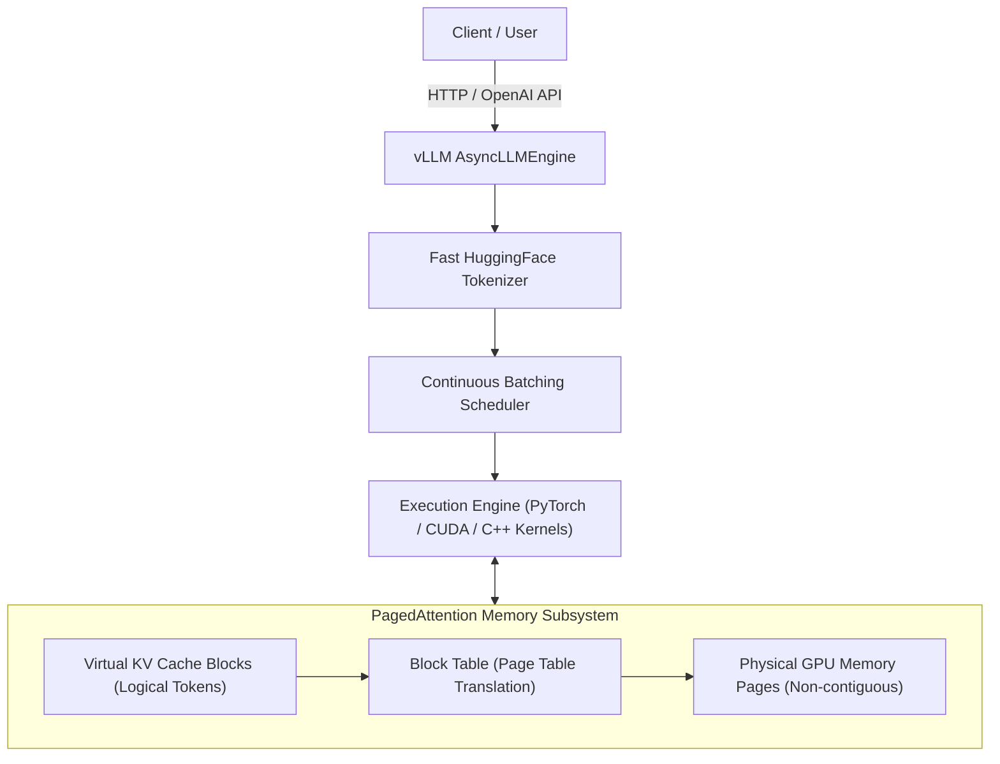
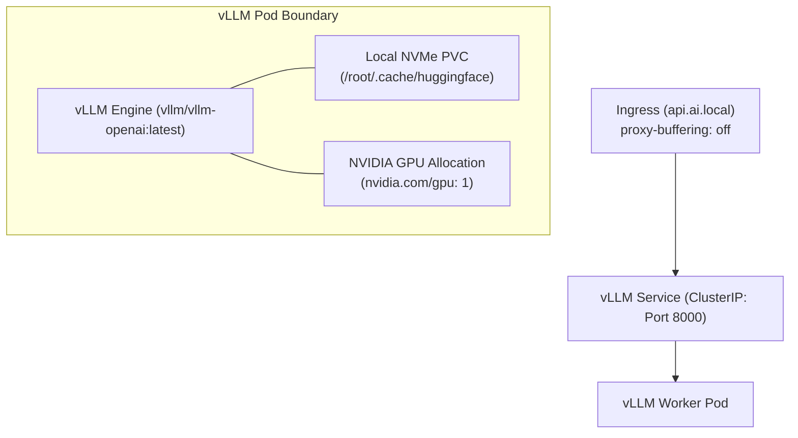

# 21. vLLM High-Throughput LLM Serving on Kubernetes

**vLLM** has emerged as the industry-standard open-source inference and serving engine for Large Language Models (LLMs). Delivering up to 24x higher throughput than HuggingFace Transformers, vLLM powers production AI platforms across major tech companies.

This guide details the internal mechanics of vLLM, its core breakthrough (**PagedAttention**), KV cache memory management, deployment patterns on Kubernetes, fine-grained tuning parameters, and production troubleshooting playbooks.

---

## 📑 Table of Contents
1. [Why vLLM? The LLM Serving Bottleneck](#1-why-vllm-the-llm-serving-bottleneck)
2. [Internal Architecture & PagedAttention](#2-internal-architecture--pagedattention)
3. [KV Cache Math: Memory Budgeting on DGX Spark (GB10)](#3-kv-cache-math-memory-budgeting-on-dgx-spark-gb10)
4. [Continuous (Dynamic) Batching vs. Static Batching](#4-continuous-dynamic-batching-vs-static-batching)
5. [Model Quantization: FP8, AWQ & GPTQ](#5-model-quantization-fp8-awq--gptq)
6. [Kubernetes Production Deployment Architecture](#6-kubernetes-production-deployment-architecture)
7. [Engine Customization & CLI Argument Reference](#7-engine-customization--cli-argument-reference)
8. [Autoscaling with Custom GPU Metrics (HPA)](#8-autoscaling-with-custom-gpu-metrics-hpa)
9. [Production Diagnostics & Troubleshooting Playbook](#9-production-diagnostics--troubleshooting-playbook)
10. [Hands-On vLLM Deployment Lab on DGX Spark](#10-hands-on-vllm-deployment-lab-on-dgx-spark)

---

## 1. Why vLLM? The LLM Serving Bottleneck

Serving LLMs is fundamentally different from traditional deep learning inference (e.g., image classification with ResNet):
- **Autoregressive Generation**: Generating a 500-token response requires executing the neural network **500 sequential times**, generating exactly one token per step.
- **Memory-Bound Computation**: In the decode phase, computation consists of low-arithmetic-intensity Matrix-Vector multiplications. Speed is limited not by Tensor Core TFLOPs, but by **memory bandwidth**.
- **The KV Cache Bottleneck**: To avoid recomputing past attention keys and values for every new token, the model caches historical Key and Value tensors in GPU memory (**KV Cache**). In traditional serving engines, the KV cache wasted **60% to 80% of GPU memory** due to internal and external memory fragmentation!

vLLM was created by UC Berkeley researchers specifically to eliminate KV cache memory waste.

---

## 2. Internal Architecture & PagedAttention



### PagedAttention: Virtual Memory for LLMs
Inspired by traditional OS virtual memory and paging:
- **Traditional Serving**: Required allocating a single, large, contiguous block of GPU memory for the maximum possible sequence length (e.g. 4,096 tokens) in advance. If the prompt was only 20 tokens, the remaining 4,076 tokens of allocated memory sat completely wasted.
- **PagedAttention**: Divides the KV cache into fixed-size **physical blocks** (typically 16 or 32 tokens per block).
  - Memory blocks are allocated dynamically on-demand as new tokens are generated.
  - Blocks do **not** need to be contiguous in physical GPU memory.
  - A **Block Table** translates logical token positions to physical memory blocks.
  - **Memory waste drops from ~70% to under 4%**, allowing 2x to 4x more concurrent requests to run on the exact same GPU!

---

## 3. KV Cache Math: Memory Budgeting on DGX Spark (GB10)

Before deploying a model to a Kubernetes pod, you must calculate its exact memory footprint to avoid **CUDA Out Of Memory** crashes.

### The Memory Equation:
$$\text{Total VRAM Required} = \text{Model Weights} + \text{Activation Memory} + \text{KV Cache Pool}$$

#### Step 1: Model Weights Memory
For a 16-bit model (FP16 / BF16), each parameter occupies 2 bytes:
$$\text{Weight Size} = \text{Parameters} \times 2 \text{ bytes}$$
- **7B Model (Mistral-7B / Llama-3 8B)**: $\approx 16 \text{ GB}$
- **70B Model (Llama-3 70B)**: $\approx 140 \text{ GB}$

#### Step 2: KV Cache per Token Formula
For a model with $L$ layers, $H_{kv}$ key-value attention heads, and hidden head dimension $D$:
$$\text{KV Bytes per Token} = 2 \times (\text{Key} + \text{Value}) \times L \times H_{kv} \times D \times \text{BytesPerElement}$$

*Example: Llama-3 8B (32 layers, 8 KV heads [Grouped-Query Attention], head dim 128, FP16 = 2 bytes):*
$$\text{KV Bytes per Token} = 2 \times 32 \times 8 \times 128 \times 2 = 131,072 \text{ bytes} \approx \mathbf{128\text{ KB per token}}$$

#### Step 3: KV Cache for Concurrency
If your pod handles **20 concurrent users**, each generating sequences of **2,048 tokens**:
$$\text{Total Tokens} = 20 \times 2,048 = 40,960 \text{ tokens}$$
$$\text{Total KV Cache} = 40,960 \times 128 \text{ KB} \approx \mathbf{5.24\text{ GB}}$$

*On your DGX Spark, vLLM defaults to reserving 90% of available GPU VRAM (`--gpu-memory-utilization 0.90`), reserving the remainder after weights for the dynamic KV cache pool.*

---

## 4. Continuous (Dynamic) Batching vs. Static Batching

- **Static Batching (Legacy)**: Waits for $N$ requests, runs them together. If Request 1 finishes in 10 tokens and Request 2 needs 1,000 tokens, the GPU sits idle waiting for Request 2 before processing any new requests.
- **Continuous Batching (vLLM)**: Operates at the **iteration level**. As soon as Request 1 finishes at iteration 10, it is ejected immediately, and a new incoming Request 3 is spliced into the batch at iteration 11 without delay!

```text
Static Batching:
Req 1: [Tok 1-10] ---------------- (Idle / Wasted Compute) -----------------
Req 2: [Tok 1......................................................1000]

Continuous Batching (vLLM):
Req 1: [Tok 1-10] -> Completed!
Req 3:            [Tok 1-500] -----------------------------> Completed!
Req 2: [Tok 1......................................................1000]
```

---

## 5. Model Quantization: FP8, AWQ & GPTQ

When running large models inside your **5% resource envelope**, quantization reduces memory footprint and increases throughput:

| Format | Bits per Weight | Quality Loss | Blackwell / DGX Spark Support | Best Use Case |
| :--- | :--- | :--- | :--- | :--- |
| **BF16 / FP16** | 16-bit | 0% (Baseline) | Native | High-accuracy research |
| **FP8 (Float8)** | 8-bit | < 0.2% | **Native Hardware Acceleration** (Blackwell Transformer Engine) | **Production Enterprise Standard** |
| **AWQ** | 4-bit | < 1% | Software Kernels | Fitting 70B models on single nodes |
| **GPTQ** | 4-bit | ~ 1-2% | Software Kernels | Legacy 4-bit inference |

*To run an FP8 or AWQ model in vLLM, add: `--quantization fp8` or `--quantization awq`.*

---

## 6. Kubernetes Production Deployment Architecture

Deploying vLLM in Kubernetes requires coordinating high-speed storage, GPU pass-through, readiness probing, and real-time token streaming:



### Complete Production Manifest (`vllm-deployment.yaml`)
```yaml
apiVersion: apps/v1
kind: Deployment
metadata:
  name: vllm-llama3
  namespace: k3s-beta
  labels:
    app: vllm-llama3
spec:
  replicas: 1
  selector:
    matchLabels:
      app: vllm-llama3
  template:
    metadata:
      labels:
        app: vllm-llama3
    spec:
      tolerations:
        - key: "nvidia.com/gpu"
          operator: "Exists"
          effect: "NoSchedule"
      volumes:
        - name: model-cache
          persistentVolumeClaim:
            claimName: data-volume-beta # Mounts local high-speed NVMe storage
        - name: dshm
          emptyDir:
            medium: Memory
            sizeLimit: "4Gi" # Shared memory required for PyTorch inter-process IPC
      containers:
        - name: vllm-server
          image: vllm/vllm-openai:v0.4.2
          imagePullPolicy: IfNotPresent
          env:
            - name: HUGGING_FACE_HUB_TOKEN
              value: "hf_xxxxxxxxxxxxxxxxxxxxxxxx"
            - name: HF_HOME
              value: "/data/huggingface"
          command: ["python3", "-m", "vllm.entrypoints.openai.api_server"]
          args:
            - "--model=meta-llama/Meta-Llama-3-8B-Instruct"
            - "--gpu-memory-utilization=0.85"
            - "--max-model-len=4096"
            - "--dtype=bfloat16"
            - "--port=8000"
            - "--trust-remote-code"
          volumeMounts:
            - name: model-cache
              mountPath: /data
            - name: dshm
              mountPath: /dev/shm
          ports:
            - containerPort: 8000
              name: http
          resources:
            requests:
              cpu: "2000m"
              memory: "6Gi"
              nvidia.com/gpu: "1"
            limits:
              cpu: "3200m"      # Bounded by 5% DGX compute limit
              memory: "6400Mi"  # Bounded by 5% DGX memory limit
              nvidia.com/gpu: "1"
          readinessProbe:
            httpGet:
              path: /health
              port: 8000
            initialDelaySeconds: 120 # Model weight loading takes 1-2 minutes
            periodSeconds: 10
          livenessProbe:
            httpGet:
              path: /health
              port: 8000
            periodSeconds: 30
---
apiVersion: v1
kind: Service
metadata:
  name: vllm-service
  namespace: k3s-beta
spec:
  type: ClusterIP
  selector:
    app: vllm-llama3
  ports:
    - name: http
      port: 8000
      targetPort: 8000
```

---

## 7. Engine Customization & CLI Argument Reference

| Flag | Recommended Value | Impact on Infrastructure & Performance |
| :--- | :--- | :--- |
| `--model` | Model name or path | HuggingFace repo ID or local mounted directory path (`/data/models/...`). |
| `--tensor-parallel-size` (`-tp`) | `1`, `2`, `4`, `8` | Number of GPUs to shard the model weights across using Megatron-LM tensor parallelism. |
| `--gpu-memory-utilization` | `0.80` to `0.90` | Fraction of total VRAM reserved for weights + KV cache pool. Lower to `0.70` if sharing with other processes. |
| `--max-model-len` | `2048` to `8192` | Caps context length. **Halving context length saves gigabytes of KV cache memory**. |
| `--quantization` | `fp8` / `awq` | Compresses weights; cuts VRAM requirement by up to 50%. |
| `--kv-cache-dtype` | `fp8` / `auto` | Compresses the KV cache itself to FP8, doubling concurrent token capacity! |
| `--enforce-eager` | Flag (true/false) | Disables CUDA graph capture. Saves ~1.5GB VRAM at the cost of 5% slower execution. |

---

## 8. Autoscaling with Custom GPU Metrics (HPA)

Traditional Horizontal Pod Autoscalers (HPA) scale based on CPU usage. In AI serving, CPU usage is irrelevant; **GPU request queue depth** is the scaling signal.

vLLM exposes Prometheus metrics at `/metrics`:
- `vllm:num_requests_waiting`: Number of requests queued waiting for free KV cache blocks.
- `vllm:gpu_cache_usage_factor`: Percentage of KV cache pages currently in use (0.0 to 1.0).

```yaml
apiVersion: autoscaling/v2
kind: HorizontalPodAutoscaler
metadata:
  name: vllm-scaler
  namespace: k3s-beta
spec:
  scaleTargetRef:
    apiVersion: apps/v1
    kind: Deployment
    name: vllm-llama3
  minReplicas: 1
  maxReplicas: 4
  metrics:
    - type: External
      external:
        metric:
          name: vllm_num_requests_waiting
        target:
          type: Value
          averageValue: "5" # Scale up if more than 5 requests are waiting in queue!
```

---

## 9. Production Diagnostics & Troubleshooting Playbook

### Scenario 1: `CUDA out of memory during initialization`
- **Symptom**: Pod crashes immediately on startup. Logs show:
  ```text
  ValueError: The model's max seq len (8192) is larger than the maximum number of tokens that can be stored in KV cache (3420).
  ```
- **Root Cause**: The model weights + context length exceed available VRAM.
- **Resolution**:
  1. Reduce `--max-model-len` from `8192` to `4096`.
  2. Reduce `--gpu-memory-utilization` or enable `--enforce-eager`.
  3. Use an FP8 or AWQ quantized version of the model.

---

### Scenario 2: Container Terminated with `Exit Code 137` (OOMKilled)
- **Symptom**: Pod starts, loads weights, processes 10 requests, then abruptly dies.
- **Root Cause**: Host CPU RAM limit violated. PyTorch memory leaks or tokenizer RAM usage exceeded `limits.memory: 6400Mi`.
- **Resolution**:
  - In your Pod manifest, increase `limits.memory` from `6400Mi` to `8000Mi`, or mount a dedicated `emptyDir` RAM disk for `/dev/shm`.

---

### Scenario 3: Broken Streaming Tokens (Tokens Arrive All at Once)
- **Symptom**: User connects to `/v1/chat/completions` with `"stream": true`, but waits 15 seconds and receives the entire response in a single burst.
- **Root Cause**: Ingress proxy buffering is enabled, accumulating HTTP chunks before sending.
- **Resolution**: In your Ingress manifest, add annotation:
  ```yaml
  nginx.ingress.kubernetes.io/proxy-buffering: "off"
  ```

---

## 10. Hands-On vLLM Deployment Lab on DGX Spark

Execute these commands to test vLLM with an ultra-lightweight open model (Qwen or TinyLlama) inside your `k3s-beta` namespace:

### 1. Launch a Lightweight vLLM Pod
```bash
kubectl run vllm-tiny \
  -n k3s-beta \
  --image=vllm/vllm-openai:latest \
  --limits='nvidia.com/gpu=1,cpu=2000m,memory=4Gi' \
  --requests='nvidia.com/gpu=1,cpu=1000m,memory=2Gi' \
  --restart=Never \
  -- python3 -m vllm.entrypoints.openai.api_server \
      --model=TinyLlama/TinyLlama-1.1B-Chat-v1.0 \
      --gpu-memory-utilization=0.60 \
      --max-model-len=2048 \
      --port=8000
```

### 2. Follow Logs Until Ready
```bash
kubectl logs vllm-tiny -n k3s-beta -f
```
*Wait until you see:*
```text
INFO:     Started server process [1]
INFO:     Waiting for application startup.
INFO:     Application startup complete.
INFO:     Uvicorn running on http://0.0.0.0:8000 (Press CTRL+C to quit)
```

### 3. Send an OpenAI-Compatible Chat Request
```bash
kubectl exec -it pytorch-benchmark -n k3s-alpha -- curl -s http://vllm-tiny.k3s-beta.svc.cluster.local:8000/v1/chat/completions \
  -H "Content-Type: application/json" \
  -d '{
    "model": "TinyLlama/TinyLlama-1.1B-Chat-v1.0",
    "messages": [
      {"role": "system", "content": "You are a helpful AI infrastructure assistant."},
      {"role": "user", "content": "Explain Kubernetes in one sentence."}
    ],
    "temperature": 0.7,
    "max_tokens": 50
  }' | jq .
```

### 4. Clean Up
```bash
kubectl delete pod vllm-tiny -n k3s-beta
```

---

Proceed to [**22-nvidia-triton-inference-server.md**](22-nvidia-triton-inference-server.md) to explore NVIDIA Triton Inference Server, multi-model execution, dynamic batching, and ensemble pipelines.
