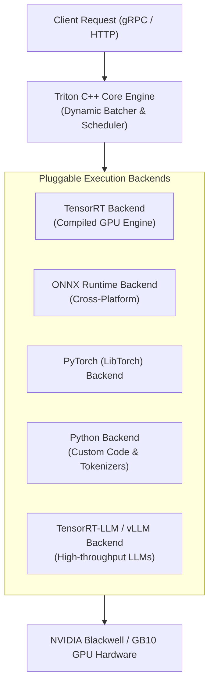

# 22. NVIDIA Triton Inference Server — Multi-Model Pipelines & Dynamic Batching

While engines like vLLM specialize exclusively in autoregressive text generation for Large Language Models, enterprise AI data centers must serve a diverse array of models simultaneously: **Computer Vision (ResNet/YOLO), Speech Recognition (Whisper), Embeddings (BGE/E5), Recommendation Systems, and LLMs**.

**NVIDIA Triton Inference Server** is the gold standard for high-throughput, multi-framework, multi-GPU model serving in enterprise environments.

---

## 📑 Table of Contents
1. [vLLM vs. NVIDIA Triton: Architectural Scope](#1-vllm-vs-nvidia-triton-architectural-scope)
2. [Triton Server Architecture & Pluggable Backends](#2-triton-server-architecture--pluggable-backends)
3. [The Model Repository Directory Specification](#3-the-model-repository-directory-specification)
4. [Dynamic Batching & Concurrent Model Execution](#4-dynamic-batching--concurrent-model-execution)
5. [Ensemble Pipelines & Business Logic Scripting (BLS)](#5-ensemble-pipelines--business-logic-scripting-bls)
6. [Communication Protocols: HTTP, gRPC & C API](#6-communication-protocols-http-grpc--c-api)
7. [Kubernetes Production Deployment Architecture](#7-kubernetes-production-deployment-architecture)
8. [Configuring `config.pbtxt` for Maximum GPU Throughput](#8-configuring-configpbtxt-for-maximum-gpu-throughput)
9. [Production Diagnostics & Troubleshooting Playbook](#9-production-diagnostics--troubleshooting-playbook)
10. [Hands-On Triton Deployment Lab on DGX Spark](#10-hands-on-triton-deployment-lab-on-dgx-spark)

---

## 1. vLLM vs. NVIDIA Triton: Architectural Scope

| Capability | vLLM Engine | NVIDIA Triton Inference Server |
| :--- | :--- | :--- |
| **Primary Domain** | Large Language Models (LLMs) only | **Any Machine Learning Model** (Vision, Audio, NLP, Tabular) |
| **Supported Frameworks** | PyTorch / Custom CUDA Kernels | **TensorRT, ONNX, PyTorch (LibTorch), OpenVINO, Python, vLLM** |
| **Multi-Model Concurrency**| Single model per process | **Dozens of different models running concurrently on 1 GPU** |
| **Pipelining / Ensembles** | Manual code scripting | **Zero-Copy Native Ensembles inside GPU VRAM** |
| **Protocols** | HTTP / OpenAI REST API | **High-speed binary gRPC**, HTTP/REST, and in-process C API |
| **Relationship** | Can run as a standalone server | **Can embed vLLM as an internal Triton backend!** |

---

## 2. Triton Server Architecture & Pluggable Backends

Triton is written in optimized C++ and decouples the serving runtime from the underlying ML frameworks via **Backends**:



---

## 3. The Model Repository Directory Specification

Triton serves models out of a structured file system called the **Model Repository**. The directory structure is strictly enforced:

```text
/models/ (Model Repository Root)
├── text_embedding/
│   ├── config.pbtxt           <── Model configuration & dynamic batching settings
│   └── 1/                     <── Version Directory (Numeric)
│       └── model.onnx         <── Model weights / binary artifact
├── object_detector/
│   ├── config.pbtxt
│   └── 1/
│       └── model.plan         <── Compiled TensorRT Engine
└── preprocessing_step/
    ├── config.pbtxt
    └── 1/
        └── model.py           <── Python backend script
```

---

## 4. Dynamic Batching & Concurrent Model Execution

In production, client requests arrive unpredictably at random millisecond intervals. Running inference on 1 request at a time wastes 90% of GPU compute capability.

### Dynamic Batching:
Triton automatically pauses for a microsecond window (`max_queue_delay_microseconds`), aggregates individual client requests into a single cohesive tensor batch, executes it on the GPU Tensor Cores, and splits the results back to the individual clients:

```text
Client 1: [Req A] (Arrives at 0.0ms) ──┐
Client 2: [Req B] (Arrives at 0.3ms) ──┼──> Combined Batch [A, B, C] ──> GPU Executed in 1 pass!
Client 3: [Req C] (Arrives at 0.8ms) ──┘
```

### Concurrent Model Execution (`instance_group`):
Triton can run **multiple execution instances of the same model** simultaneously on a single GPU to saturate all compute engines:
```protobuf
# config.pbtxt
instance_group [
  {
    count: 2                   # Run 2 parallel instances of this model
    kind: KIND_GPU
    gpus: [ 0 ]
  }
]
```

---

## 5. Ensemble Pipelines & Business Logic Scripting (BLS)

In production AI, you rarely run a model in isolation. A real speech-to-intent pipeline requires:
`Audio File ──> Mel Spectrogram ──> Whisper Model ──> Text Tokens ──> LLM ──> Intent Output`

In traditional microservices, intermediate data travels across the network between 4 different containers, serializing and deserializing JSON at every hop (**Serialization Tax**).

### With Triton Ensembles:
Triton pipelines models **inside GPU memory with zero network hops and zero CPU copying**:

```text
[ Input Audio ] ──> [ Preprocessing ] ──(GPU VRAM)──> [ Whisper Model ] ──(GPU VRAM)──> [ Output Text ]
                     (Python Backend)                  (TensorRT Engine)
```

---

## 6. Communication Protocols: HTTP, gRPC & C API

Triton exposes three distinct interface endpoints:
1. **HTTP/REST (Port 8000)**: Standard JSON protocol conforming to the KServe v2 Data Plane specification.
2. **gRPC (Port 8001)**: **Recommended for Production**. Binary protocol using Protocol Buffers. Reduces network latency by up to 5x and enables bidirectional streaming for real-time speech and tokens.
3. **Metrics (Port 8002)**: Prometheus endpoint exposing real-time GPU compute duration, queue time, and inference counts.

---

## 7. Kubernetes Production Deployment Architecture

```mermaid
graph TD
    Client["Client App"] -->|gRPC (Port 8001)| Ingress["Ingress / Gateway API<br/>(backend-protocol: GRPC)"]
    Ingress --> Service["Triton Service (ClusterIP)"]
    Service --> Pod["Triton Server Pod"]
    
    subgraph TritonPod["Triton Pod (k3s-beta)"]
        Server["tritonserver Daemon"]
        ModelPVC["Local Path PVC (/models)<br/>Shared Model Repository"]
        GPU["NVIDIA GPU (nvidia.com/gpu: 1)"]
        
        Server --- ModelPVC
        Server --- GPU
    end
```

### Complete Production Manifest (`triton-deployment.yaml`)
```yaml
apiVersion: apps/v1
kind: Deployment
metadata:
  name: triton-server
  namespace: k3s-beta
  labels:
    app: triton-server
spec:
  replicas: 1
  selector:
    matchLabels:
      app: triton-server
  template:
    metadata:
      labels:
        app: triton-server
    spec:
      tolerations:
        - key: "nvidia.com/gpu"
          operator: "Exists"
          effect: "NoSchedule"
      volumes:
        - name: model-repo
          persistentVolumeClaim:
            claimName: data-volume-beta # Points to /var/lib/rancher/k3s/storage
        - name: dshm
          emptyDir:
            medium: Memory
            sizeLimit: "2Gi"
      containers:
        - name: triton
          image: nvcr.io/nvidia/tritonserver:24.01-py3
          command: ["tritonserver"]
          args:
            - "--model-repository=/models"
            - "--strict-model-config=false"
            - "--log-verbose=0"
          volumeMounts:
            - name: model-repo
              mountPath: /models
            - name: dshm
              mountPath: /dev/shm
          ports:
            - containerPort: 8000
              name: http
            - containerPort: 8001
              name: grpc
            - containerPort: 8002
              name: metrics
          resources:
            requests:
              cpu: "1000m"
              memory: "3200Mi"
              nvidia.com/gpu: "1"
            limits:
              cpu: "2000m"      # Bounded by 5% DGX compute limit
              memory: "6400Mi"  # Bounded by 5% DGX memory limit
              nvidia.com/gpu: "1"
          readinessProbe:
            httpGet:
              path: /v2/health/ready
              port: 8000
            initialDelaySeconds: 30
            periodSeconds: 10
          livenessProbe:
            httpGet:
              path: /v2/health/live
              port: 8000
            periodSeconds: 30
---
apiVersion: v1
kind: Service
metadata:
  name: triton-service
  namespace: k3s-beta
spec:
  type: ClusterIP
  selector:
    app: triton-server
  ports:
    - name: http
      port: 8000
      targetPort: 8000
    - name: grpc
      port: 8001
      targetPort: 8001
    - name: metrics
      port: 8002
      targetPort: 8002
```

---

## 8. Configuring `config.pbtxt` for Maximum GPU Throughput

Every model in Triton requires a `config.pbtxt` file:

```protobuf
name: "resnet50_onnx"
platform: "onnxruntime_onnx"
max_batch_size: 64

input [
  {
    name: "input_tensor"
    data_type: TYPE_FP32
    dims: [ 3, 224, 224 ]
  }
]
output [
  {
    name: "probabilities"
    data_type: TYPE_FP32
    dims: [ 1000 ]
  }
]

# Enable Dynamic Batching with 2ms window:
dynamic_batching {
  max_queue_delay_microseconds: 2000
  preferred_batch_size: [ 8, 16, 32, 64 ]
}

# Run 2 concurrent instances on GPU 0:
instance_group [
  {
    count: 2
    kind: KIND_GPU
    gpus: [ 0 ]
  }
]
```

---

## 9. Production Diagnostics & Troubleshooting Playbook

### Scenario 1: Model Fails to Load (`inference:model_load_failed`)
- **Symptom**: Pod passes liveness probe but fails readiness probe (`/v2/health/ready` returns 503).
- **Triage**:
  ```bash
  kubectl logs -n k3s-beta -l app=triton-server | grep -E "FAILED|Error"
  ```
- **Common Root Causes**:
  1. `config.pbtxt` input/output dimensions do not match the compiled ONNX/TensorRT graph.
  2. Missing version subfolder (e.g. placing `model.onnx` directly in `/models/my_model/` instead of `/models/my_model/1/model.onnx`).

---

### Scenario 2: gRPC Connection Reset Through Ingress
- **Symptom**: HTTP queries succeed on port 8000, but client Python gRPC calls fail with `UNAVAILABLE: Socket closed`.
- **Root Cause**: The Kubernetes Ingress proxy is treating traffic as standard HTTP/1.1 and stripping HTTP/2 headers.
- **Resolution**: Add the gRPC backend protocol annotation to Ingress:
  ```yaml
  nginx.ingress.kubernetes.io/backend-protocol: "GRPC"
  ```

---

## 10. Hands-On Triton Deployment Lab on DGX Spark

Deploy a standalone Triton container that generates synthetic models in-memory to test your GPU integration:

### 1. Launch Triton Test Instance
```bash
kubectl run triton-smoke-test \
  -n k3s-beta \
  --image=nvcr.io/nvidia/tritonserver:24.01-py3 \
  --limits='nvidia.com/gpu=1,cpu=1000m,memory=3Gi' \
  --restart=Never \
  -- tritonserver --model-repository=/opt/tritonserver/qa/common/models
```

### 2. Verify Health Endpoints Over HTTP
```bash
# Wait 20 seconds, then curl server health:
kubectl exec -it pytorch-benchmark -n k3s-alpha -- curl -s http://triton-smoke-test.k3s-beta.svc.cluster.local:8000/v2/health/ready
```
*Expected Output: HTTP 200 OK.*

### 3. Query Prometheus Telemetry
```bash
kubectl exec -it pytorch-benchmark -n k3s-alpha -- curl -s http://triton-smoke-test.k3s-beta.svc.cluster.local:8002/metrics | head -n 30
```
*Observe real-time telemetry metrics (`nv_inference_request_success`, `nv_gpu_memory_used_bytes`).*

### 4. Clean Up
```bash
kubectl delete pod triton-smoke-test -n k3s-beta
```

---

Proceed to [**23-llm-inference-alternatives-and-kserve.md**](23-llm-inference-alternatives-and-kserve.md) to explore TensorRT-LLM, HuggingFace TGI, SGLang, and KServe/Ray Serve orchestration on Kubernetes.
