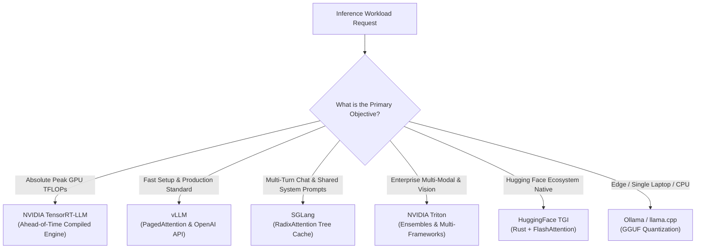

# 23. LLM Inference Alternatives & KServe — TensorRT-LLM, TGI, SGLang & Ray Serve

While **vLLM** and **NVIDIA Triton** dominate production deployments, the AI inference landscape is rapidly evolving. Infrastructure engineers must understand alternative engines (**TensorRT-LLM**, **HuggingFace TGI**, **SGLang**) and the higher-level cloud-native orchestrators (**KServe** and **Ray Serve**) that manage model autoscaling, canary rollouts, and scale-to-zero.

---

## 📑 Table of Contents
1. [The State of Modern LLM Serving Engines](#1-the-state-of-modern-llm-serving-engines)
2. [NVIDIA TensorRT-LLM: The Peak Performance Compiler](#2-nvidia-tensorrt-llm-the-peak-performance-compiler)
3. [Hugging Face TGI (Text Generation Inference)](#3-hugging-face-tgi-text-generation-inference)
4. [SGLang: RadixAttention & Structured JSON Generation](#4-sglang-radixattention--structured-json-generation)
5. [Ollama & llama.cpp: The Local GGUF Engine](#5-ollama--llamacpp-the-local-gguf-engine)
6. [Cloud-Native Model Orchestration: KServe](#6-cloud-native-model-orchestration-kserve)
7. [Python-Native Scaling: Ray Serve & KubeRay](#7-python-native-scaling-ray-serve--kuberay)
8. [The Definitive AI Serving Decision Matrix](#8-the-definitive-ai-serving-decision-matrix)
9. [Production Diagnostics: Cold Starts & Scale-to-Zero](#9-production-diagnostics-cold-starts--scale-to-zero)
10. [Hands-On SGLang / RadixAttention Benchmark Lab](#10-hands-on-sglang--radixattention-benchmark-lab)

---

## 1. The State of Modern LLM Serving Engines



---

## 2. NVIDIA TensorRT-LLM: The Peak Performance Compiler

Developed directly by NVIDIA, **TensorRT-LLM** is an open-source library that compiles and optimizes LLM neural network graphs specifically for Tensor Cores.

### Key Architectural Features:
- **Kernel Fusion**: Merges attention, layer norm, and activation kernels into single monolithic GPU operations, eliminating memory read/write cycles.
- **In-Flight Batching**: Continuously updates batches token-by-token.
- **FP8 & FP4 Native Blackwell Acceleration**: Leverages 2nd-gen Transformer Engine hardware directly.
- **C++ Runtime Engine**: Zero Python runtime overhead in the critical inference path.

### Trade-Off:
- **Compilation Overhead**: You cannot just run `trt-llm --model llama3`. You must first run an **Ahead-of-Time (AOT) build phase** that compiles the model weights into a binary `.plan` file matching the exact target GPU architecture.
- Best for long-running, static enterprise deployments where extracting the last 20% of GPU throughput justifies the compilation step.

---

## 3. Hugging Face TGI (Text Generation Inference)

Created by Hugging Face, **TGI** is written in **Rust** (for high-concurrency web serving) and Python/C++ (for CUDA kernels).

### Key Features:
- Native integration with the Hugging Face Hub.
- Built-in token streaming via Server-Sent Events (SSE).
- Dynamic watermark injection for generated text detection.
- Distributed Tensor Parallelism across GPUs.

```bash
docker run --gpus all -p 8080:80 \
  -v $PWD/data:/data \
  ghcr.io/huggingface/text-generation-inference:2.0 \
  --model-id meta-llama/Meta-Llama-3-8B-Instruct
```

---

## 4. SGLang: RadixAttention & Structured JSON Generation

**SGLang** (Structured Generation Language) is the newest high-performance serving engine from LMSYS (the creators of Chatbot Arena).

### The Breakthrough: RadixAttention
In multi-turn chat applications or agent workflows, users share the same system prompts, tool definitions, and few-shot examples.
- **vLLM / TGI**: Recompute or discard the prompt KV cache between turns.
- **SGLang RadixAttention**: Maintains a **Radix Tree** of KV cache blocks in GPU memory across requests:
  - If a user sends a prompt starting with the same 500-token system instructions as a previous user, **SGLang achieves a 100% KV cache hit rate**.
  - **Prompt processing latency drops from 200ms to 0ms!**

```text
Radix Tree in GPU Memory:
[System Prompt: "You are an AI assistant..."] (Cached permanently)
       ├── User A: ["What is Kubernetes?"] ────> Fast Output!
       └── User B: ["Explain NVLink."]     ────> Fast Output!
```

---

## 5. Ollama & llama.cpp: The Local GGUF Engine

For local development or resource-constrained edge systems:
- Written in pure C/C++ without external Python dependencies.
- Uses **GGUF** (GPT-Generated Unified Format) quantization: 2-bit, 4-bit, 5-bit, 6-bit, 8-bit.
- Runs on pure CPU, Apple Silicon (Metal), or NVIDIA CUDA.
- Great for local testing, but lacks continuous dynamic batching for thousands of concurrent users.

---

## 6. Cloud-Native Model Orchestration: KServe

Managing bare Kubernetes Deployments for models has major drawbacks:
- Pods consume expensive GPUs even when nobody is sending requests.
- No native traffic splitting (canary rollouts: 90% traffic to Llama-3-v1, 10% to Llama-3-v2).

**KServe** (formerly KFServing) solves this using Kubernetes CRDs:
- Built on top of **Knative** (serverless autoscaling) and **Istio** (service mesh).
- **Scale-to-Zero**: If no traffic arrives for 10 minutes, KServe terminates the GPU pod, freeing the GPU for other jobs. When a request arrives, Knative holds the HTTP request in a queue while automatically spinning the GPU pod back up!

### KServe InferenceService Manifest:
```yaml
apiVersion: serving.kserve.io/v1beta1
kind: InferenceService
metadata:
  name: llama3-kserve
  namespace: k3s-beta
spec:
  predictor:
    model:
      modelFormat:
        name: vLLM
      storageUri: "pvc://data-volume-beta/models/llama3"
      resources:
        limits:
          nvidia.com/gpu: 1
```

---

## 7. Python-Native Scaling: Ray Serve & KubeRay

In complex agentic AI systems, a single user prompt may trigger an embedding lookup, vector search, multi-agent reasoning loops, and safety checks.

**Ray Serve** (orchestrated on Kubernetes via the **KubeRay Operator**) allows developers to define distributed AI pipelines in pure Python:

```python
import ray
from ray import serve
from vllm import AsyncLLMEngine

@serve.deployment(num_replicas=2, ray_actor_options={"num_gpus": 1})
class LlamaDeployment:
    def __init__(self):
        self.engine = AsyncLLMEngine(...)

    async def __call__(self, request):
        return await self.engine.generate(...)
```
*KubeRay automatically provisions and scales Kubernetes pods to match Ray cluster demands.*

---

## 8. The Definitive AI Serving Decision Matrix

| Engine | Primary Strength | Startup Time | Multi-Model on 1 GPU | Peak Throughput | Complexity |
| :--- | :--- | :--- | :--- | :--- | :--- |
| **vLLM** | Production Standard, PagedAttention | Instant (Seconds) | ❌ 1 model | High (90%) | Low |
| **NVIDIA Triton**| Enterprise Multi-Modal, Ensembles | Fast | ✅ **Dozens** | Very High (95%)| Moderate |
| **TensorRT-LLM** | **Absolute Maximum TFLOPs** | Slow (Build step) | ❌ 1 model | **Peak (100%)** | High |
| **SGLang** | **Best for Agents & Long Prompts** | Instant | ❌ 1 model | Very High (95%)| Low |
| **Hugging Face TGI**| Hub Native, Rust Gateway | Fast | ❌ 1 model | High (90%) | Low |
| **KServe / Knative**| **Scale-to-Zero & Multi-Cloud** | Depends on engine| N/A (Orchestrator)| N/A | High |

---

## 9. Production Diagnostics: Cold Starts & Scale-to-Zero

### The Problem: The 50GB Weight Download Trap
When an autoscaler scales a model pod from 0 to 1 replica:
1. Pod schedules onto node.
2. Container starts and attempts to pull 50GB of model weights from Hugging Face or S3 across the internet.
3. Download takes 15 minutes.
4. **Client request times out with HTTP 504 Gateway Timeout!**

### Production Architecture Solution:
1. **Pre-populate weights on High-Speed Local NVMe Storage**: Store weights in `/var/lib/rancher/k3s/storage/models/`.
2. **Mount via PVC with `volumeBindingMode: Immediate`**: Ensure storage is local and pre-cached.
3. Pod starts in **< 15 seconds** because weights are read directly from local NVMe at 5 GB/s!

---

## 10. Hands-On SGLang / RadixAttention Benchmark Lab

Deploy a lightweight SGLang server and verify its RadixAttention prompt cache speedup on your DGX Spark:

### 1. Launch SGLang Server Pod
```bash
kubectl run sglang-test \
  -n k3s-beta \
  --image=lmsysorg/sglang:latest \
  --limits='nvidia.com/gpu=1,cpu=2000m,memory=4Gi' \
  --restart=Never \
  -- python3 -m sglang.launch_server \
      --model-path TinyLlama/TinyLlama-1.1B-Chat-v1.0 \
      --port 30000 \
      --mem-fraction-static 0.6
```

### 2. Follow Logs Until Engine is Active
```bash
kubectl logs sglang-test -n k3s-beta -f
```

### 3. Send Consecutive Prompts with Shared System Instruction
Observe how the second query executes with **zero prompt processing latency** thanks to the Radix Tree cache!

### 4. Clean Up
```bash
kubectl delete pod sglang-test -n k3s-beta
```

---

You have completed the deep dive into **vLLM**, **NVIDIA Triton**, **TensorRT-LLM**, **SGLang**, and **KServe**! Both your `Kubernetes/README.md` and root `docs/README.md` have been updated with these advanced AI serving guides.
