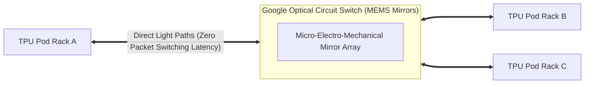

# 25. Hyperscaler Silicon & Compilers — Google TPU, AWS Trainium vs. NVIDIA Blackwell

While NVIDIA GPUs (Hopper, Blackwell) dominate enterprise data centers, the largest frontier AI labs (Google, Anthropic, Amazon) design and deploy proprietary **Application-Specific Integrated Circuits (ASICs)** to escape the "NVIDIA tax" and build custom network fabrics.

This guide provides an architectural comparison of **Google TPUs**, **AWS Trainium**, and **NVIDIA Blackwell**, covering their hardware silicon design, compiler toolchains (**XLA vs. Triton/CUDA**), and cloud-native Kubernetes orchestration.

---

## 📑 Table of Contents
1. [Silicon Taxonomy: General Purpose GPU vs. Domain-Specific ASIC](#1-silicon-taxonomy-general-purpose-gpu-vs-domain-specific-asic)
2. [Google Cloud TPU Architecture (v4, v5p, v6e Trillium)](#2-google-cloud-tpu-architecture-v4-v5p-v6e-trillium)
3. [Google Optical Circuit Switches (OCS) & Dynamic Reconfigurability](#3-google-optical-circuit-switches-ocs--dynamic-reconfigurability)
4. [Software Toolchains: JAX + XLA vs. PyTorch + CUDA/Triton](#4-software-toolchains-jax--xla-vs-pytorch--cudatriton)
5. [AWS Trainium2 & The Neuron SDK Ecosystem](#5-aws-trainium2--the-neuron-sdk-ecosystem)
6. [Kubernetes Orchestration: Scheduling TPU Slices vs. GPU Pods](#6-kubernetes-orchestration-scheduling-tpu-slices-vs-gpu-pods)
7. [Comprehensive Comparison Matrix: NVIDIA vs. Google vs. AWS](#7-comprehensive-comparison-matrix-nvidia-vs-google-vs-aws)

---

## 1. Silicon Taxonomy: General Purpose GPU vs. Domain-Specific ASIC

```text
NVIDIA GPU (Streaming Multiprocessor - SM):
+---------------------------------------------------------------------------------+
| Instruction Cache | Warp Schedulers | Register Files (Huge, flexible)           |
| [INT32 ALU] [FP32 ALU] [FP64 ALU] [Tensor Cores (Dense/Sparse GEMM)] [SFU]     |
| L1 Cache / Shared Memory (Programmable)                                         |
+---------------------------------------------------------------------------------+
-> Highly flexible: Runs graphics, ray tracing, physics, crypto, and general compute.

Google TPU / AWS Trainium (Systolic Array / Matrix Multiply Unit - MXU):
+---------------------------------------------------------------------------------+
| Fixed Dataflow Systolic Array: 128x128 or 256x256 Multiply-Accumulate units      |
| Weights remain stationary in registers; activations stream through horizontally |
| Minimal instruction decoding overhead; near 100% silicon dedicated to math      |
+---------------------------------------------------------------------------------+
-> Specialized ASIC: Does only matrix multiplications and vector reductions with maximum energy efficiency.
```

---

## 2. Google Cloud TPU Architecture (v4, v5p, v6e Trillium)

Google trains and serves **Gemini 1.5/2.0** on its proprietary Tensor Processing Unit (TPU) infrastructure:

### Evolution of Google TPU Generations:
* **TPU v4**: 275 TFLOPs (BF16), 32 GB HBM2, 3D Torus interconnect (4,096 chips per Pod).
* **TPU v5p (Flagship Trainer)**: 459 TFLOPs (BF16), 95 GB HBM3 (2.76 TB/s bandwidth), 8,960 chips per Pod. Built for massive multimodal foundation model training.
* **TPU v6e (Trillium - 6th Gen)**: 4x compute efficiency improvement over v5e, 32 GB HBM, optimized for FP8 and inference serving.

### Key Silicon Innovation: The Systolic Array
Instead of reading and writing to register files for every multiplication, data flows through a grid of ALU cells like blood pumped through a heart (systolic). Results accumulate as they pass through adjacent cells, reducing register-file memory power by **up to 70%**.

---

## 3. Google Optical Circuit Switches (OCS) & Dynamic Reconfigurability

Unlike NVIDIA SuperPODs which rely on fixed, electrical **InfiniBand Fat-Tree Clos switches** with expensive optical transceivers at every hop, Google connects TPUs using **Optical Circuit Switches (OCS)**.



### Advantages of OCS:
1. **Dynamic Topology Reconfiguration**: A cluster can instantly rewire itself from a 3D Torus (ideal for AllReduce in Data Parallelism) to a ring or twisted torus (ideal for Pipeline Parallelism).
2. **Instant Fault Isolation**: If an optical transceiver or fiber breaks, the MEMS mirrors pivot in milliseconds to route light around the failed node, preventing multi-hour training stalls.
3. **50x Lower Switching Power**: Photons pass through mirrors without converting back to electrical signals ($O \to E \to O$).

---

## 4. Software Toolchains: JAX + XLA vs. PyTorch + CUDA/Triton

| Feature | NVIDIA Ecosystem (PyTorch + CUDA/Triton) | Google Ecosystem (JAX + XLA) |
| :--- | :--- | :--- |
| **Execution Paradigm**| Imperative / Eager by default (with `torch.compile`) | Fully Functional & Declarative (`jit`, `grad`, `vmap`) |
| **Compiler Backend** | NVCC, CUDA Drivers, OpenAI Triton JIT | **XLA (Accelerated Linear Algebra)** |
| **Distributed Model** | PyTorch Distributed (`torch.distributed`, NCCL) | **SPMD (Single Program, Multiple Data)** via `jax.experimental.shard_map` |
| **Graph Optimization**| Dynamic graph capture, manual kernel tuning | Ahead-of-Time (AOT) whole-graph fusion & memory scheduling |
| **Memory Management** | PyTorch Caching Allocator (susceptible to fragmentation) | XLA Buffer Allocation (exact static compile-time memory plan) |

---

## 5. AWS Trainium2 & The Neuron SDK Ecosystem

To avoid reliance on NVIDIA, Amazon Web Services developed **AWS Trainium** and **AWS Inferentia**:

* **Trainium2 (Trn2)**: 4x faster training performance than Trn1, deployed in **UltraClusters of up to 100,000 chips** (65 Exaflops of aggregate compute).
* **NeuronCore-v2**: Custom compute engine featuring dedicated Matrix Engines, Vector Engines, and Scalar Engines.
* **AWS Neuron SDK**: Integrates directly with PyTorch via `torch-neuronx`, compiling operations into native Neuron execution graphs.
* **Elastic Fabric Adapter (EFA)**: AWS's proprietary OS-bypass network interface providing up to 800 Gbps network bandwidth per node.

---

## 6. Kubernetes Orchestration: Scheduling TPU Slices vs. GPU Pods

In Kubernetes, managing TPUs differs fundamentally from GPUs due to the rigid physical Torus interconnect.

### NVIDIA GPU Scheduling:
GPUs can be scheduled independently (1 GPU on Node A, 2 GPUs on Node B):
```yaml
resources:
  limits:
    nvidia.com/gpu: "2"
```

### Google TPU Slice Scheduling:
TPUs are allocated as **atomic multi-host Slices** (e.g., `2x2x2` = 8 chips, `4x4x4` = 64 chips). You cannot schedule fractional nodes on a torus without breaking the ring topology:
```yaml
apiVersion: v1
kind: Pod
metadata:
  name: tpu-training-worker
spec:
  nodeSelector:
    cloud.google.com/gke-tpu-topology: "2x2x4" # 16 TPU v5p chips in 3D Torus
    cloud.google.com/gke-tpu-accelerator: "tpu-v5p-slice"
  containers:
  - name: jax-worker
    image: gcr.io/google-samples/jax-tpu:latest
    resources:
      limits:
        google.com/tpu: "4" # Chips per host in the slice
```

---

## 7. Comprehensive Comparison Matrix

| Specification | NVIDIA Grace Blackwell (GB200 / GB10) | Google Cloud TPU v5p | AWS Trainium2 |
| :--- | :--- | :--- | :--- |
| **Silicon Category** | GPU + ARM CPU (Coherent Memory) | Custom Systolic ASIC | Custom Domain ASIC |
| **Primary Language** | Python (PyTorch, Triton, CUDA C++) | Python (JAX, Flax, PyTorch/XLA) | Python (PyTorch via NeuronX) |
| **Peak FP8 Compute** | **20 PFLOPs (GB200 NVL72)** | 918 TFLOPs per chip | ~1.3 PFLOPs per chip |
| **Interconnect Tech** | NVLink 5 (1.8 TB/s per GPU) | Optical Circuit Switch (OCS) 3D Torus | NeuronLink-v2 (800 Gbps EFA) |
| **Memory Architecture**| 900 GB/s NVLink-C2C Unified RAM | 95 GB HBM3 (2.76 TB/s) | 96 GB HBM3 |
| **Scale Envelope** | 576 GPUs per NVLink Domain | 8,960 chips per Pod | 100,000 chips per UltraCluster |
| **Portability** | Universal (On-Prem, Azure, AWS, GCP, OCI) | Google Cloud Platform Exclusive | Amazon Web Services Exclusive |

### Architectural Takeaway:
* Choose **NVIDIA GPUs (DGX Spark)** when you need maximum developer velocity, open-source software compatibility (vLLM, DeepSeek, FlashAttention), and multi-cloud freedom.
* Study **Google TPUs & XLA** to understand how whole-graph compilation and optical switching allow frontier labs to scale beyond electrical switch limitations.
