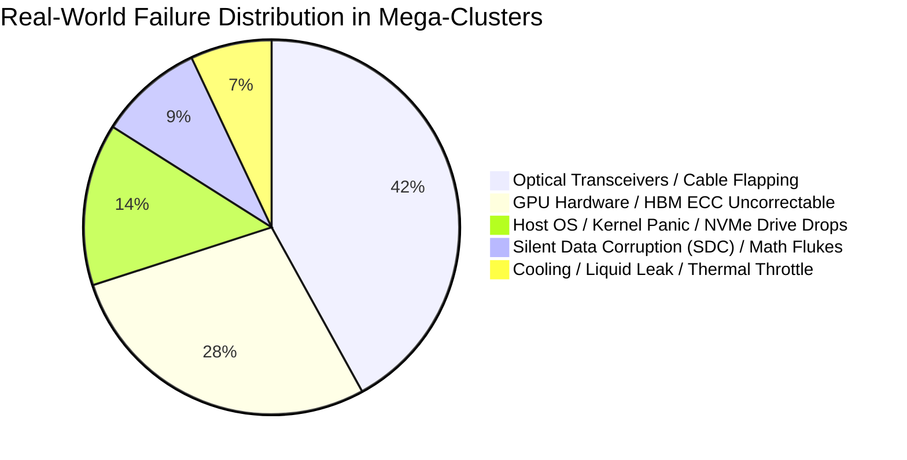
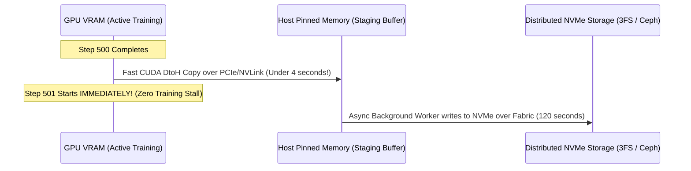
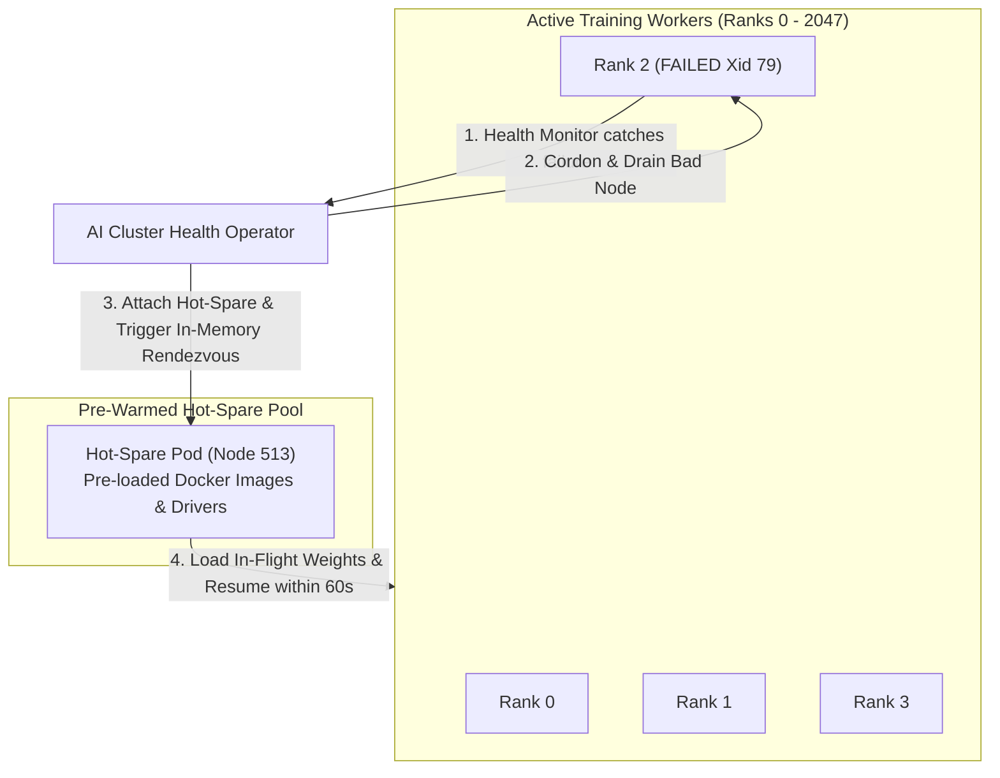

# 26. Ultra-Scale Cluster Resilience & Fault Tolerance (10k–100k Accelerators)

When scaling AI clusters from 8 GPUs (a single server) to **16,384–100,000 GPUs** (Meta Llama-3, OpenAI GPT-4, Google Gemini clusters), the laws of statistics transform hardware failures from rare anomalies into an **uninterrupted continuous state of operation**.

At this scale, a GPU, optical transceiver, memory module, or power delivery unit fails every **2 to 3 hours**. If a failure requires restarting the entire training job from disk, the cluster will spend 100% of its time restarting and 0% making forward training progress.

This volume covers the engineering mechanisms deployed by hyperscalers to survive continuous hardware failures: **Mean Time Between Failures (MTBF)** economics, **Silent Data Corruption (SDC)** triage, **Sub-Minute Asynchronous Checkpointing**, and **Kubernetes Auto-Healing**.

---

## 📑 Table of Contents
1. [The Math of Cluster MTBF at Scale](#1-the-math-of-cluster-mtbf-at-scale)
2. [Failure Taxonomy in Ultra-Scale AI Datacenters](#2-failure-taxonomy-in-ultra-scale-ai-datacenters)
3. [Silent Data Corruption (SDC): The Invisible Training Killer](#3-silent-data-corruption-sdc-the-invisible-training-killer)
4. [Sub-Minute Asynchronous Checkpointing Architecture](#4-sub-minute-asynchronous-checkpointing-architecture)
5. [In-Flight Auto-Healing & Hot-Spare Replacement in Kubernetes](#5-in-flight-auto-healing--hot-spare-replacement-in-kubernetes)
6. [Automated Triage Runbook & Node Quarantine Operator](#6-automated-triage-runbook--node-quarantine-operator)

---

## 1. The Math of Cluster MTBF at Scale

Let single-node MTBF be $T_{node}$ (typically ~3 years or ~26,000 hours for enterprise servers).

For a cluster of $N$ nodes operating simultaneously in a synchronized distributed training job (where one failure stalls the entire synchronous collective AllReduce):

$$\text{Cluster MTBF} = \frac{T_{node}}{N}$$

### The Failure Wall:
* **Single Node (1 DGX Spark)**: MTBF $\approx 3\text{ years}$ (Failure is rare).
* **512 Nodes (4,096 GPUs)**: MTBF $\approx \frac{26,000}{512} \approx 50.7\text{ hours}$ (Failure every 2 days).
* **3,000 Nodes (24,000 GPUs - Meta Llama-3 Cluster)**: MTBF $\approx \frac{26,000}{3,000} \approx 8.6\text{ hours}$ (Failure ~3 times a day).
* **12,500 Nodes (100,000 GPUs)**: MTBF $\approx \frac{26,000}{12,500} \approx 2.08\text{ hours}$ (Failure every 120 minutes!).

```text
The Checkpoint Trap:
If Checkpoint Save Time (30 mins) + Crash Detection Time (10 mins) + Restart Time (25 mins) = 65 mins
And Failure occurs every 120 mins:
-> The cluster spends over 54% of its entire lifetime doing zero productive training!
```

---

## 2. Failure Taxonomy in Ultra-Scale AI Datacenters

Data from production 24k+ GPU runs reveals the following breakdown of failure causes:



### 1. Optical Network Flapping (42%)
* In an InfiniBand or RoCEv2 fabric with over 100,000 optical transceivers, thermal cycling causes micro-expansion. An optical link starts dropping packets intermittently without completely dying, causing massive NCCL collective timeouts.

### 2. Uncorrectable HBM ECC Errors (28%)
* High-Bandwidth Memory (HBM3/HBM3e) runs at extreme thermal density. Multi-bit errors trigger catastrophic hardware interrupts (**NVIDIA Xid 48 / 63**), instantly terminating the CUDA context.

---

## 3. Silent Data Corruption (SDC): The Invisible Training Killer

**Silent Data Corruption (SDC)** is the most dangerous failure mode in modern deep learning:
* **Definition**: A hardware transistor in an ALU or Tensor Core calculates an incorrect mathematical result (e.g., $1 + 1 = 3$), but **no hardware exception, ECC alert, or kernel error is logged**.
* **Symptoms**:
  1. The training loss curve suddenly spikes to $\text{NaN}$ or infinity without explanation.
  2. Gradient norms diverge across distributed workers.
  3. The model begins generating repetitive garbage tokens weeks later.

### Detection Mechanism: Mathematical Canaries (Heartbeat Probing)
Every 100 steps, each GPU runs a micro-benchmark on known static tensor weights:

```python
import torch

def verify_gpu_integrity(device_id: int):
    """Canary test running on each worker to catch Silent Data Corruption."""
    # Deterministic static input
    x = torch.tensor([[1.0, 2.0], [3.0, 4.0]], device=device_id)
    # Known deterministic GEMM
    result = torch.matmul(x, x)
    expected = torch.tensor([[7.0, 10.0], [15.0, 22.0]], device=device_id)
    
    if not torch.allclose(result, expected, atol=1e-5):
        raise RuntimeError(f"CRITICAL: Silent Data Corruption detected on GPU {device_id}!")
```

---

## 4. Sub-Minute Asynchronous Checkpointing Architecture

Traditional checkpointing halts all training workers, serializes weights from GPU VRAM to CPU RAM, and writes them over NFS to a storage array. At 671B parameters (DeepSeek) or 405B parameters (Llama-3), this takes **25 to 45 minutes**.

### Hyperscaler Solution: Non-Blocking Double-Buffered Async Checkpointing



1. **In-Memory Snapshotting**: Weights and optimizer states are copied from GPU HBM to host pinned memory in $<5\text{ seconds}$ via local high-speed buses.
2. **Immediate Training Resume**: Training resumes on the next step immediately.
3. **Background Flush**: A separate CPU thread streams the pinned buffer to distributed parallel storage (**3FS**, **BeeGFS**, or **GPUDirect Storage**) in the background.

---

## 5. In-Flight Auto-Healing & Hot-Spare Replacement in Kubernetes

Traditional Kubernetes setups terminate an entire `MPIJob` or `PyTorchJob` when one pod dies. In hyperscaler clusters, **PyTorch Elastic (Torchrun) + Kubernetes Operators** implement **dynamic rank re-assignment**:



### Torchrun Dynamic Rendezvous Configuration:
```bash
torchrun \
  --nnodes=256:260 \                     # Min 256 nodes, Max 260 nodes (Elastic!)
  --nproc_per_node=8 \
  --rdzv_backend=c10d \
  --rdzv_endpoint=etcd-cluster:2379 \
  --rdzv_conf=read_timeout=30 \
  pretrain.py
```

---

## 6. Automated Triage Runbook & Node Quarantine Operator

Production clusters deploy an automated **Node Problem Detector (NPD)** daemon on every node to catch hardware faults before they crash jobs:

```yaml
apiVersion: apps/v1
kind: DaemonSet
metadata:
  name: gpu-health-sentinel
  namespace: kube-system
spec:
  selector:
    matchLabels:
      app: gpu-sentinel
  template:
    metadata:
      labels:
        app: gpu-sentinel
    spec:
      hostPID: true
      containers:
      - name: sentinel
        image: nvidia/cuda:12.4.0-base-ubuntu22.04
        command: ["/bin/bash", "-c"]
        args:
          - |
            while true; do
              # 1. Check for uncorrectable ECC errors
              ECC_ERR=$(nvidia-smi --query-gpu=ecc.errors.uncorrected.volatile.total --format=csv,noheader,nounits | tr -d ' ' | grep -v 0)
              if [ -n "$ECC_ERR" ]; then
                echo "CRITICAL: ECC Uncorrected Error detected! Tainting node..."
                kubectl taint nodes "$NODE_NAME" ai.infra/fault=ecc-uncorrected:NoSchedule --overwrite
                kubectl cordon "$NODE_NAME"
              fi
              # 2. Check for PCIe bus degradation (Gen4 falling back to Gen1)
              PCIE_WIDTH=$(nvidia-smi --query-gpu=pcie.link.width.current --format=csv,noheader,nounits | tr -d ' ')
              if [ "$PCIE_WIDTH" -lt 16 ]; then
                echo "CRITICAL: PCIe bus width degraded! Tainting node..."
                kubectl taint nodes "$NODE_NAME" ai.infra/fault=pcie-degraded:NoSchedule --overwrite
              fi
              sleep 10
            done
        securityContext:
          privileged: true
```

### Result:
* Bad hardware is isolated in seconds.
* Healthy jobs are shielded from cascading network timeouts.
* Hardware repair tickets are automatically dispatched to data center technicians with specific serial numbers and PCIe slot locations.
