# NVIDIA AI Infrastructure & Kubernetes Mastery Curriculum (20 Volumes)

Welcome to the **NVIDIA AI Infrastructure & Kubernetes Mastery Curriculum** tailored for the **DGX Spark** environment.

This curriculum is structured into **20 comprehensive volumes** designed to take an engineer from **zero knowledge** to **principal data center infrastructure architect** in the NVIDIA GPU and Kubernetes cloud-native ecosystem.

---

## 🗺️ Master Curriculum Index

```mermaid
graph TD
    subgraph Part1["Part I: Control Plane & Core Architecture (01-05)"]
        G01["01. Core Architecture & Pod Lifecycle"]
        G02["02. Kube-API Server Internals"]
        G03["03. ETCD Database Deep Dive"]
        G04["04. Controller Manager & Reconciliation"]
        G05["05. Scheduler & AI Batch Scheduling"]
    end

    subgraph Part2["Part II: Networking, Ingress, DNS & Discovery (06-09)"]
        G06["06. Networking Deep Dive & CNI"]
        G07["07. Kube-Proxy & ClusterIP Mechanics"]
        G08["08. CoreDNS & Service Discovery"]
        G09["09. Ingress & Gateway API"]
    end

    subgraph Part3["Part III: Workloads, Storage & Multi-Tenancy (10-12)"]
        G10["10. Advanced Workload Controllers"]
        G11["11. Storage, CSI & High-IOPS Volumes"]
        G12["12. Multi-Tenancy & cgroups v2"]
    end

    subgraph Part4["Part IV: NVIDIA Hardware & GPU Partitioning (13-16)"]
        G13["13. NVIDIA Hardware & Drivers (GB10)"]
        G14["14. Container Toolkit & Virtualization"]
        G15["15. DGX Spark Hands-On Lab Guide"]
        G16["16. GPU Operator & Network Operator"]
    end

    subgraph Part5["Part V: Large-Scale Distributed AI & Ops (17-20)"]
        G17["17. Distributed AI Training & NCCL"]
        G18["18. SuperPOD & Network Fabrics"]
        G19["19. Diagnostics & Xid Failure Playbook"]
        G20["20. 20 Hands-On Exercises Workbook"]
    end

    subgraph Part6["Part VI: Production Inference & Serving (21-23)"]
        G21["21. vLLM High-Throughput Serving"]
        G22["22. NVIDIA Triton Multi-Model Pipelines"]
        G23["23. LLM Alternatives & KServe"]
    end

    subgraph Part7["Part VII: Hyperscaler Mega-Scale & Multi-Accelerator Infrastructure (24-26)"]
        G24["24. Disaggregated Prefill & Decode Serving"]
        G25["25. Hyperscaler Silicon & Compilers"]
        G26["26. Ultra-Scale Cluster Resilience & SDC"]
    end

    Part1 --> Part2
    Part2 --> Part3
    Part3 --> Part4
    Part4 --> Part5
    Part5 --> Part6
    Part6 --> Part7
```



---

## 📚 Complete 26-Volume Curriculum Matrix

### Part I: Master Control Plane & Core Architecture Internals
| Vol | Title | File | Focus Area |
| :---: | :--- | :--- | :--- |
| **01** | **Core Architecture & Pod Lifecycle** | [01-kubernetes-core-architecture.md](01-kubernetes-core-architecture.md) | Control plane vs. worker decoupling, CRI gRPC, containerd, runc, OCI hooks, end-to-end Pod creation sequence. |
| **02** | **Kube-API Server Internals** | [02-kube-apiserver-internals.md](02-kube-apiserver-internals.md) | Request filter pipeline, AuthN (mTLS/JWT), AuthZ (RBAC), Mutating/Validating Webhooks, API Priority & Fairness. |
| **03** | **ETCD Database Deep Dive** | [03-etcd-database-deep-dive.md](03-etcd-database-deep-dive.md) | Raft consensus algorithm, WAL disk flush latency, bbolt B+ tree engine, MVCC revisions, compaction, defrag, disaster recovery. |
| **04** | **Controller Manager & Controllers** | [04-kube-controller-manager-and-controllers.md](04-kube-controller-manager-and-controllers.md) | Reconciliation loops, client-go Informers, SharedInformerFactory, DeltaFIFO, Workqueues, leader election, custom operators. |
| **05** | **Scheduler & AI Batch Scheduling** | [05-kube-scheduler-and-ai-batch-scheduling.md](05-kube-scheduler-and-ai-batch-scheduling.md) | Filtering (predicates), Scoring (priorities), taints, tolerations, nodeAffinity, gang-scheduling with Kueue, DRA. |

### Part II: Deep Networking, Ingress, DNS & Service Discovery
| Vol | Title | File | Focus Area |
| :---: | :--- | :--- | :--- |
| **06** | **Networking Deep Dive & CNI** | [06-kubernetes-networking-deep-dive.md](06-kubernetes-networking-deep-dive.md) | Linux netns, veth pairs, bridge routing, CNI specification (Flannel vs Calico vs Cilium eBPF), packet walkthroughs, Multus. |
| **07** | **Kube-Proxy & ClusterIP Mechanics** | [07-kube-proxy-and-cluster-ip-mechanics.md](07-kube-proxy-and-cluster-ip-mechanics.md) | Virtual Service IPs, Netfilter iptables chains, IPVS hash tables, conntrack table exhaustion, Headless Services for AI. |
| **08** | **CoreDNS & Service Discovery** | [08-coredns-and-service-discovery.md](08-coredns-and-service-discovery.md) | Corefile syntax, plugin chaining, container `/etc/resolv.conf`, the `ndots:5` 4x query penalty in AI training, NodeLocal DNS. |
| **09** | **Ingress & Gateway API** | [09-ingress-controllers-and-gateway-api.md](09-ingress-controllers-and-gateway-api.md) | L7 routing, Traefik, Ingress-Nginx, LLM token streaming (SSE), gRPC for Triton, Gateway API (HTTPRoute), cert-manager. |

### Part III: Workloads, Storage & Multi-Tenancy
| Vol | Title | File | Focus Area |
| :---: | :--- | :--- | :--- |
| **10** | **Advanced Workload Controllers** | [10-advanced-workload-controllers.md](10-advanced-workload-controllers.md) | StatefulSets (ordered scaling & storage), DaemonSets (node daemons), Indexed Jobs (`JOB_COMPLETION_INDEX`), PDBs. |
| **11** | **Storage, CSI & High-IOPS Volumes** | [11-storage-csi-and-high-performance-volumes.md](11-storage-csi-and-high-performance-volumes.md) | CSI gRPC plugin specification, `WaitForFirstConsumer` binding, K3s Local Path Provisioner, Local PVs on NVMe, GPUDirect Storage. |
| **12** | **Multi-Tenancy & cgroups v2** | [12-multi-tenancy-resource-quotas-and-cgroups.md](12-multi-tenancy-resource-quotas-and-cgroups.md) | Linux cgroups v2 (`cpu.max`, `memory.max`), CFS throttling, QoS classes (Guaranteed vs Burstable), ResourceQuota 5% math. |

### Part IV: NVIDIA Hardware, Drivers & AI Infrastructure
| Vol | Title | File | Focus Area |
| :---: | :--- | :--- | :--- |
| **13** | **NVIDIA Hardware & Drivers (GB10)** | [13-nvidia-hardware-and-driver-stack.md](13-nvidia-hardware-and-driver-stack.md) | DGX lineage, Grace ARM CPU + Blackwell GPU, NVLink-C2C (900 GB/s unified memory), kernel modules (`nvidia.ko`, `nvidia-uvm.ko`). |
| **14** | **Container Toolkit & Virtualization** | [14-nvidia-container-toolkit-and-gpu-virtualization.md](14-nvidia-container-toolkit-and-gpu-virtualization.md) | Container Device Interface (CDI), `nvidia-ctk`, Time-Slicing vs MIG vs MPS vs vGPU, why VMware is avoided in AI. |
| **15** | **DGX Spark Hands-On Lab Guide** | [15-dgx-spark-datacenter-simulation-lab.md](15-dgx-spark-datacenter-simulation-lab.md) | **Step-by-step bare-metal partitioning**: Dual K3s instances / namespaces (`k3s-alpha`, `k3s-beta`), 5% CPU/RAM/Disk quotas, PyTorch test. |
| **16** | **GPU Operator & Network Operator** | [16-nvidia-gpu-operator-and-network-operator.md](16-nvidia-gpu-operator-and-network-operator.md) | Enterprise automation via Helm, `ClusterPolicy`, GPU Feature Discovery (GFD), DCGM Prometheus exporter (port 9400), Network Operator. |

### Part V: Large-Scale Distributed AI & Production Diagnostics
| Vol | Title | File | Focus Area |
| :---: | :--- | :--- | :--- |
| **17** | **Distributed AI Training & NCCL** | [17-distributed-ai-training-and-nccl.md](17-distributed-ai-training-and-nccl.md) | Parallelism (DDP, FSDP, Megatron-LM TP/PP), NCCL collective communications (AllReduce, AllGather), GPUDirect RDMA, tuning flags. |
| **18** | **SuperPOD & Network Fabrics** | [18-large-scale-superpod-and-network-fabrics.md](18-large-scale-superpod-and-network-fabrics.md) | SuperPOD Scalable Units, the Four Data Center Fabrics, Rail-Optimized InfiniBand, non-blocking Clos Fat-Tree, Spectrum-X RoCE v2. |
| **19** | **Diagnostics & Xid Failure Playbook** | [19-cluster-diagnostics-and-failure-scenarios.md](19-cluster-diagnostics-and-failure-scenarios.md) | Master triage flowchart, etcd recovery, cert renewal, network partition fix, **Production NVIDIA Xid Matrix** (Xid 31/45/79/92), exit codes. |
| **20** | **20 Hands-On Exercises Workbook** | [20-hands-on-practice-exercises-workbook.md](20-hands-on-practice-exercises-workbook.md) | **20 practical challenges** covering namespaces, etcdctl, APF, RBAC, webhooks, cgroups, veth, iptables, DNS, GPU benchmarks, and disaster recovery. |

### Part VI: Production AI Inference, LLM Serving & Model Runtimes
| Vol | Title | File | Focus Area |
| :---: | :--- | :--- | :--- |
| **21** | **vLLM High-Throughput Serving** | [21-vllm-high-throughput-llm-serving.md](21-vllm-high-throughput-llm-serving.md) | PagedAttention virtual memory, KV cache sizing formulas, continuous batching, quantization (FP8/AWQ), K8s manifests, HPA queue scaling. |
| **22** | **NVIDIA Triton Inference Server** | [22-nvidia-triton-inference-server.md](22-nvidia-triton-inference-server.md) | Enterprise multi-modal engine, backends (TensorRT, ONNX, Python), model repository spec, dynamic batching, zero-copy ensembles, gRPC streaming. |
| **23** | **LLM Alternatives & KServe** | [23-llm-inference-alternatives-and-kserve.md](23-llm-inference-alternatives-and-kserve.md) | TensorRT-LLM (peak compiler), Hugging Face TGI, SGLang (RadixAttention tree cache), Ollama, KServe scale-to-zero, Ray Serve / KubeRay. |

### Part VII: Hyperscaler Mega-Scale & Multi-Accelerator Infrastructure
| Vol | Title | File | Focus Area |
| :---: | :--- | :--- | :--- |
| **24** | **Disaggregated Prefill & Decode Serving** | [24-disaggregated-prefill-and-decode-serving.md](24-disaggregated-prefill-and-decode-serving.md) | PD separation (Splitwise/Mooncake), KV-cache network transfer via RDMA, K8s prefill vs decode node pools, P99 jitter reduction. |
| **25** | **Hyperscaler Silicon & Compilers** | [25-hyperscaler-silicon-and-compilers.md](25-hyperscaler-silicon-and-compilers.md) | Google Cloud TPU (v5p/v6e Trillium), Optical Circuit Switches (OCS), JAX/XLA SPMD compilation vs NVIDIA Grace Blackwell / CUDA, AWS Trainium2. |
| **26** | **Ultra-Scale Cluster Resilience & SDC** | [26-ultra-scale-cluster-resilience-and-fault-tolerance.md](26-ultra-scale-cluster-resilience-and-fault-tolerance.md) | 10k–100k GPU MTBF math, Silent Data Corruption (SDC) canary tests, sub-minute async checkpointing, Kubernetes node quarantine operators. |

---

## 🎯 Target Lab Architecture: The DGX Spark Data Center Simulator

```text
+---------------------------------------------------------------------------------------------------+
|                                 DGX Spark Bare-Metal Host (Linux OS)                              |
|   Hardware: Grace CPU + Blackwell GPU (GB10 Unified Memory Architecture) + NVMe Storage           |
|   Base Software: NVIDIA Driver + NVIDIA Container Toolkit + containerd runtime                     |
+---------------------------------------------------------------------------------------------------+
                                                  |
                    +-----------------------------+-----------------------------+
                    |                                                           |
                    v                                                           v
+---------------------------------------+                   +---------------------------------------+
|        Tenant Cluster 1 (K3s-Alpha)   |                   |        Tenant Cluster 2 (K3s-Beta)    |
| - Isolation: cgroups v2 + Namespace   |                   | - Isolation: cgroups v2 + Namespace   |
| - Compute Allocation: 5% CPU & RAM    |                   | - Compute Allocation: 5% CPU & RAM    |
| - Storage Allocation: 5% Disk Quota   |                   | - Storage Allocation: 5% Disk Quota   |
| - GPU: 1 Slice (Time-sliced / MPS)    |                   | - GPU: 1 Slice (Time-sliced / MPS)    |
| - Workload: PyTorch Training / Fine-tune|                  | - Workload: vLLM / Triton Model Server|
+---------------------------------------+                   +---------------------------------------+
                    ^                                                           ^
                    +-----------------------------+-----------------------------+
                                                  |
                                  Host Reserve: 90% Compute & Storage
                                  (Guarantees host stability & monitoring)
```

---

## 🚀 Recommended Step-by-Step Learning Order

1. **Phase 1: Control Plane Mastery** $\to$ Read Volumes **01**, **02**, **03**, **04**, **05**.
2. **Phase 2: Networking & Ingress** $\to$ Read Volumes **06**, **07**, **08**, **09**.
3. **Phase 3: Workloads, Storage & Multi-Tenancy** $\to$ Read Volumes **10**, **11**, **12**.
4. **Phase 4: NVIDIA Hardware & Hands-On Lab** $\to$ Read Volumes **13**, **14**, and execute the setup in **15**.
5. **Phase 5: Enterprise Automation & Supercomputing** $\to$ Read Volumes **16**, **17**, **18**, **19**.
6. **Phase 6: Practical Mastery** $\to$ Complete all 20 challenges in Volume **20**.
7. **Phase 7: Production AI Serving & Inference** $\to$ Master Volumes **21**, **22**, and **23**.
