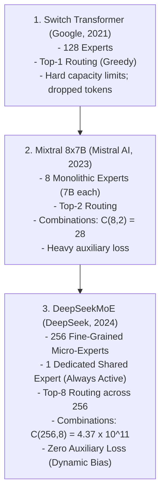
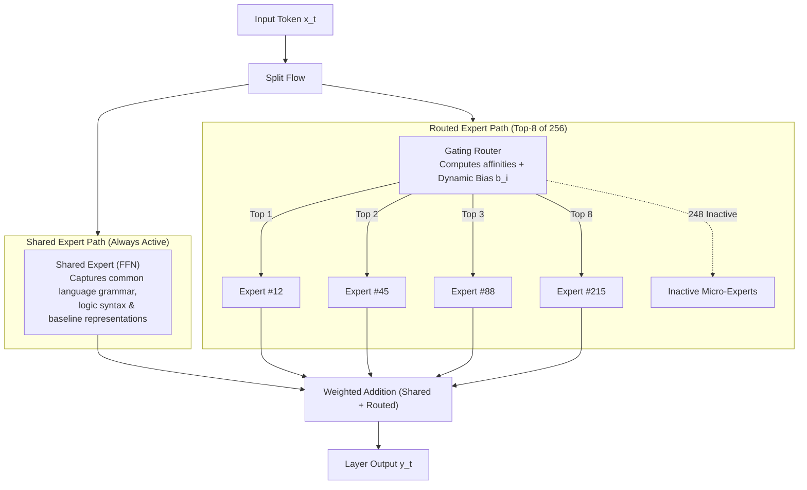

# 02. DeepSeekMoE Architecture — Fine-Grained Routing & Auxiliary-Loss-Free Balancing

> **Target Audience**: Anyone from a developer exploring modern LLMs for the first time to an experienced infrastructure engineer seeking deep mathematical and architectural clarity.

---

## 📑 Table of Contents
1. [Foundational Scaffolding: What is a Mixture of Experts (MoE)?](#1-foundational-scaffolding-what-is-a-mixture-of-experts-moe)
   - [1.1 Dense Models vs. Sparse Models](#11-dense-models-vs-sparse-models)
   - [1.2 The Hospital Analogy: Generalists vs. Sub-Specialists](#12-the-hospital-analogy-generalists-vs-sub-specialists)
   - [1.3 The Gating Router & The Catastrophe of Expert Collapse](#13-the-gating-router--the-catastrophe-of-expert-collapse)
2. [The Evolutionary Lineage of MoE Architectures](#2-the-evolutionary-lineage-of-moe-architectures)
   - [2.1 Switch Transformer (Top-1 Routing)](#21-switch-transformer-top-1-routing)
   - [2.2 Mixtral 8x7B (Top-2 Coarse-Grained Routing)](#22-mixtral-8x7b-top-2-coarse-grained-routing)
   - [2.3 The Two Fatal Flaws of Classical Coarse-Grained MoE](#23-the-two-fatal-flaws-of-classical-coarse-grained-moe)
3. [DeepSeekMoE Architectural Foundations](#3-deepseekmoe-architectural-foundations)
   - [3.1 Fine-Grained Expert Segmentation](#31-fine-grained-expert-segmentation)
   - [3.2 Combinatorial Knowledge Capacity ($\binom{256}{8} = 4.37 \times 10^{11}$)](#32-combinatorial-knowledge-capacity-binom2568--437-times-1011)
   - [3.3 Shared Experts Isolation ($K_{shared}$)](#33-shared-experts-isolation-k_shared)
4. [The Death of Auxiliary Loss: Dynamic Bias Balancing](#4-the-death-of-auxiliary-loss-dynamic-bias-balancing)
   - [4.1 Why Classical Auxiliary Loss $\mathcal{L}_{aux}$ Degrades Intelligence](#41-why-classical-auxiliary-loss-mathcal_l_aux-degrades-intelligence)
   - [4.2 The Dynamic Bias Formulation ($b_i$)](#42-the-dynamic-bias-formulation-b_i)
   - [4.3 How Dynamic Bias Balances Load Without Altering Gradient Paths](#43-how-dynamic-bias-balances-load-without-altering-gradient-paths)
5. [Complete Mathematical Routing Formulation](#5-complete-mathematical-routing-formulation)
6. [Alternative Industry Approaches to MoE](#6-alternative-industry-approaches-to-moe)
7. [Hands-On PyTorch Implementation & Verification Lab](#7-hands-on-pytorch-implementation--verification-lab)
8. [Beginner Practice Exercises with Solutions](#8-beginner-practice-exercises-with-solutions)
9. [Troubleshooting, Common Misconceptions & FAQ](#9-troubleshooting-common-misconceptions--faq)

---

## 1. Foundational Scaffolding: What is a Mixture of Experts (MoE)?

### 1.1 Dense Models vs. Sparse Models
In a conventional **dense** transformer (like Llama-3 70B or GPT-3):
- Every single token passing through the network activates **100% of all parameters in every layer**.
- If the model has 70 Billion parameters, multiplying every token by 70B weights requires massive computation:
  $$\text{FLOPs per token} \approx 2 \times \text{Parameter Count} = 140 \text{ GFLOPs per token}$$

In a **sparse Mixture of Experts (MoE)** model:
- The standard Feed-Forward Network (FFN) in each layer is replaced by multiple parallel subnetworks called **Experts**.
- For each token, a lightweight neural network called the **Router** evaluates the token and routes it to only a small subset of experts (e.g., activating only 2 or 8 experts out of hundreds).
- **The Magic of MoE**: A model can have **671 Billion total parameters** stored in memory, but only activate **37 Billion parameters per token**, executing with the speed and inference cost of a 37B model while possessing the reasoning capacity of a 671B giant!

```text
DENSE MODEL (e.g. Llama-3 70B):
Token "def" ──> [Attention] ──> [Giant 70B FFN (100% Active)] ──> Output

SPARSE MoE MODEL (e.g. DeepSeek-V3 671B):
Token "def" ──> [Attention] ──> [Router] ──┬──> [Expert #14: Python Code] (Active)
                                           ├──> [Expert #89: Syntax Tree] (Active)
                                           ├──> [Expert #201: Shared Expert] (Active)
                                           └──> [250 other experts sit idle!] (Zero Compute)
```

### 1.2 The Hospital Analogy: Generalists vs. Sub-Specialists
Imagine a hospital:
- **A Dense Model** is like forcing every patient who walks in the door to be examined by all 100 doctors on staff—cardiologists, dermatologists, pediatricians, and brain surgeons—even if the patient just has a minor cough. It is thorough, but wildly inefficient.
- **A Coarse-Grained MoE (like Mixtral 8x7B)** has only 8 large clinics. Each doctor is forced to handle a massive, messy range of conditions (e.g., one clinic handles pediatric cardiology, orthopedics, and dermatopathology all at once).
- **DeepSeekMoE** has 1 primary triage nurse (the **Shared Expert**) who checks every patient's vitals, and 256 hyper-specialized micro-doctors (the **Fine-Grained Routed Experts**). If you come in with a rare fracture, you are seen by the triage nurse and the exact 8 specialists in orthopedic bone mechanics.

### 1.3 The Gating Router & The Catastrophe of Expert Collapse
The **Router** is a linear layer with weights $W_r \in \mathbb{R}^{d \times N}$. For a token with hidden representation $x_t \in \mathbb{R}^d$:
$$\text{Affinity Scores} = x_t \cdot W_r$$

**The Catastrophe of Expert Collapse**:
In early MoE research, models suffered from severe load imbalance:
1. By random chance during initial training, Expert #1 received slightly more tokens than Expert #2.
2. Because Expert #1 processed more tokens, its weights updated faster and it became slightly smarter.
3. In subsequent training steps, the router noticed Expert #1 was smarter, so it sent **even more** tokens to Expert #1.
4. Within a few thousand training steps, 99% of all tokens were routed to 1 or 2 experts, while the remaining experts remained completely dead! The MoE collapsed into an under-parameterized dense model.

To prevent this, traditional models introduced an **Auxiliary Balancing Loss** ($\mathcal{L}_{\text{aux}}$). But as we will see, this "cure" had devastating side effects.

---

## 2. The Evolutionary Lineage of MoE Architectures



### 2.1 Switch Transformer (Top-1 Routing)
Google's Switch Transformer activated only 1 expert per token to minimize compute. However, Top-1 routing was brittle: if a token contained both programming syntax and mathematical logic, the router had to make a zero-sum choice between code and math.

### 2.2 Mixtral 8x7B (Top-2 Coarse-Grained Routing)
Mistral AI popularized open MoEs with Mixtral 8x7B:
- 8 total experts, each with an intermediate FFN dimension of $d_{\text{ff}} = 14,336$.
- Top-2 experts activated per token.
- Total parameters = 46.7B, Active parameters per token = 12.9B.

### 2.3 The Two Fatal Flaws of Classical Coarse-Grained MoE

#### Flaw 1: Knowledge Hybridity & Entanglement
Because there are only 8 experts, each expert must cover a huge domain. Expert #3 might be responsible for "Python code, French grammar, and European history." When fine-tuning or pretraining, gradients from French grammar disrupt and overwrite the neurons used for Python code!

#### Flaw 2: Constrained Combinatorial Expressiveness
With 8 experts and Top-2 routing, the number of distinct computational paths through a layer is:
$$\binom{8}{2} = \frac{8 \times 7}{2} = \mathbf{28\text{ combinations}}$$
If a layer encounters 1,000 distinct concepts, it is forced to compress all 1,000 concepts into just 28 pathways.

---

## 3. DeepSeekMoE Architectural Foundations

DeepSeek reimagined MoE from first principles around two core ideas: **fine-grained micro-experts** and **shared expert isolation**.



### 3.1 Fine-Grained Expert Segmentation
Instead of having 8 massive experts with size $d_{\text{ff}}$, DeepSeek **segments** the intermediate FFN dimension into $m$ smaller micro-experts:

$$d_{\text{ff}}^{\text{micro}} = \frac{1}{m} d_{\text{ff}}$$

By cutting expert size by a factor of 4 or 8, DeepSeek can instantiate **256 micro-experts** while keeping the total parameter budget identical! Instead of activating 2 large experts, the model activates **8 micro-experts**:

$$\text{Active Compute} = 8 \times \left(\frac{1}{4} d_{\text{ff}}\right) = 2 \times d_{\text{ff}} \implies \text{EXACTLY THE SAME COMPUTE AS TOP-2 COARSE MoE!}$$

### 3.2 Combinatorial Knowledge Capacity
How many distinct computational states can DeepSeekMoE form?
Selecting 8 experts out of 256:

$$\binom{256}{8} = \frac{256!}{8! \times 248!} = \mathbf{437,422,393,168\text{ (437 Billion Combinations!)}}$$

```text
COMBINATORIAL CAPACITY COMPARISON:

Mixtral 8x7B (Top-2 of 8):    28 combinations
Grok-1 (Top-2 of 8):          28 combinations
DeepSeek-V3/R1 (Top-8 of 256): 437,422,393,168 combinations!
```
*DeepSeekMoE has **15.6 Billion times more expressiveness** than Mixtral while consuming the exact same number of active FLOPs!*

### 3.3 Shared Experts Isolation ($K_{shared}$)
In every language, certain linguistic elements are universal: punctuation, conjunctions ("and", "the"), common grammatical agreement, and standard tensor math.

In classical MoEs, every expert wastes parameter capacity learning these basic tokens. DeepSeek introduces **Shared Experts**:
- 1 or more experts are designated as **permanently active for all tokens**.
- All routed micro-experts are freed from having to memorize common grammatical glue, allowing them to achieve pure, uncorrupted domain specialization!

---

## 4. The Death of Auxiliary Loss: Dynamic Bias Balancing

### 4.1 Why Classical Auxiliary Loss $\mathcal{L}_{aux}$ Degrades Intelligence
Historically, to prevent expert collapse, models added an auxiliary loss to the objective:

$$\mathcal{L}_{\text{total}} = \mathcal{L}_{\text{language}} + \alpha \mathcal{L}_{\text{aux}}$$

Where $\mathcal{L}_{\text{aux}}$ penalized the model if the distribution of tokens across experts deviated from uniform.

**The Catastrophic Trade-Off**:
- If you set $\alpha$ too low $\to$ Experts collapse, and the model starves.
- If you set $\alpha$ too high $\to$ **The model becomes stupid!** Why? Because the model is forced to route tokens to suboptimal experts simply to satisfy an arbitrary load quota. A token discussing quantum electrodynamics might be routed to a French recipe expert purely because the French expert had a low workload!

### 4.2 The Dynamic Bias Formulation ($b_i$)
DeepSeek-V3 and R1 introduced the revolutionary **Auxiliary-Loss-Free Balancing Strategy**:

$$\text{Auxiliary Loss } \mathcal{L}_{\text{aux}} = \mathbf{0}$$

Instead of adding a penalty to the loss function and perturbing gradients, DeepSeek introduces an adaptive, non-differentiable **bias term $b_i$** to each expert's routing score:

$$\text{Routing Score: } s_{i, t} = \text{Sigmoid}(x_t \cdot e_i) + b_i$$

Where $e_i$ is the routing centroid of Expert $i$, and $b_i$ is the dynamic bias.

### 4.3 How Dynamic Bias Balances Load Without Altering Gradient Paths
The bias $b_i$ is updated dynamically at the end of each training step based on real-time hardware telemetry:

$$b_i \leftarrow b_i + \gamma \cdot \left( \text{Target Load} - \text{Actual Load}_i \right)$$

Where $\gamma$ is a tiny step size (e.g., 0.001):
- If Expert $i$ is **overloaded** ($\text{Actual Load}_i > \text{Target}$) $\implies b_i$ decreases $\implies$ Next step, fewer tokens select it.
- If Expert $i$ is **underloaded** ($\text{Actual Load}_i < \text{Target}$) $\implies b_i$ increases $\implies$ Next step, more tokens select it.

```text
CLASSICAL AUXILIARY LOSS:
Distorts weight gradients W_r during backpropagation ──> Degrades model intelligence!

DEEPSEEK DYNAMIC BIAS:
Leaves gradients 100% clean! Gradients only optimize for pure language prediction.
Load balancing is handled purely by the external feedback loop on b_i!
```

---

## 5. Complete Mathematical Routing Formulation

For token representation $x_t \in \mathbb{R}^d$:

1. **Calculate Routing Affinity**:
   $$a_{i, t} = \text{Sigmoid}(x_t^T e_i) + b_i \quad \text{for } i \in \{1, 2, \dots, N_{\text{routed}}\}$$

2. **Select Top-$K$ Experts**:
   $$\Omega_t = \text{TopK}\left( \{a_{i, t}\}_{i=1}^{N_{\text{routed}}}, K_{\text{routed}} \right)$$

3. **Normalize Gating Weights (Over Selected Experts Only)**:
   $$g_{i, t} = \frac{\text{Sigmoid}(x_t^T e_i)}{\sum_{j \in \Omega_t} \text{Sigmoid}(x_t^T e_j)} \quad \text{for } i \in \Omega_t$$
   *(Note: The bias $b_i$ is used ONLY for top-k selection, not for gating multiplication!)*

4. **Aggregate Shared and Routed Expert Outputs**:
   $$y_t = \underbrace{\sum_{k=1}^{K_{\text{shared}}} \text{FFN}_k^{\text{shared}}(x_t)}_{\text{Universal Representation}} + \underbrace{\sum_{i \in \Omega_t} g_{i, t} \text{FFN}_i^{\text{routed}}(x_t)}_{\text{Specialized Knowledge Composition}}$$

---

## 6. Alternative Industry Approaches to MoE

| Framework / Model | Total Experts | Active Experts | Shared Experts? | Balancing Mechanism | Expressive Combinations |
| :--- | :---: | :---: | :---: | :--- | :---: |
| **DeepSeek-V3 / R1** | **256** | **8** | **Yes (1 Shared)** | **Auxiliary-Loss-Free Dynamic Bias** | **$4.37 \times 10^{11}$** |
| **Mixtral 8x22B** | 8 | 2 | No | Switch Transformer Auxiliary Loss | 28 |
| **Databricks DBRX** | 16 | 4 | No | Softmax with Load Loss | 1,820 |
| **Snowflake Arctic** | 128 | 2 | Yes (1 Shared) | Auxiliary Loss | 8,128 |
| **Meta Llama 3.3 70B** | Dense | Dense | N/A | None (All parameters active) | 1 |

---

## 7. Hands-On PyTorch Implementation & Verification Lab

The following script implements a complete `DeepSeekMoELayer` with **Fine-Grained Segmentation**, **Shared Expert Isolation**, and **Dynamic Bias Balancing**.

```python
"""
DeepSeekMoE Architecture Verification Lab
Author: DGX Spark AI Infrastructure Team
Description: Implements 256 fine-grained micro-experts with dynamic bias balancing.
"""

import torch
import torch.nn as nn
import torch.nn.functional as F

class MicroExpert(nn.Module):
    """A fine-grained micro-expert using SwiGLU activations."""
    def __init__(self, d_model: int, d_ff_micro: int):
        super().__init__()
        self.w1 = nn.Linear(d_model, d_ff_micro, bias=False) # Gate
        self.w2 = nn.Linear(d_ff_micro, d_model, bias=False) # Down
        self.w3 = nn.Linear(d_model, d_ff_micro, bias=False) # Up

    def forward(self, x: torch.Tensor) -> torch.Tensor:
        # SwiGLU: (Swish(xW1) * xW3) * W2
        return self.w2(F.silu(self.w1(x)) * self.w3(x))

class DeepSeekMoELayer(nn.Module):
    def __init__(
        self,
        d_model: int = 2048,
        n_routed: int = 64,      # Scaled down to 64 for local lab testing (256 in production)
        n_active: int = 4,       # Top-4 active micro-experts
        n_shared: int = 1,       # 1 permanently active shared expert
        d_ff_total: int = 8192
    ):
        super().__init__()
        self.d_model = d_model
        self.n_routed = n_routed
        self.n_active = n_active
        self.d_ff_micro = d_ff_total // 16 # Each micro-expert is 1/16th standard size
        
        # 1. Router Centroids: [n_routed, d_model]
        self.router_weights = nn.Parameter(torch.randn(n_routed, d_model) * 0.02)
        
        # 2. Dynamic Bias Buffer (Not updated via backprop!)
        self.register_buffer("dynamic_bias", torch.zeros(n_routed))
        
        # 3. Routed Micro-Experts
        self.routed_experts = nn.ModuleList([
            MicroExpert(d_model, self.d_ff_micro) for _ in range(n_routed)
        ])
        
        # 4. Shared Expert (Always Active)
        self.shared_expert = MicroExpert(d_model, self.d_ff_micro * 2)

    def forward(self, x: torch.Tensor, update_bias: bool = False):
        """
        x: [batch_size, seq_len, d_model]
        """
        B, S, D = x.shape
        x_flat = x.view(-1, D) # [Total_Tokens, D]
        N_tokens = x_flat.size(0)
        
        # 1. Compute Shared Expert Output (100% of tokens pass through here)
        shared_out = self.shared_expert(x_flat)
        
        # 2. Router Affinity Computation
        # [N_tokens, D] x [D, n_routed] -> [N_tokens, n_routed]
        raw_logits = torch.matmul(x_flat, self.router_weights.t())
        affinity_scores = torch.sigmoid(raw_logits)
        
        # 3. Add Dynamic Bias for Top-K Selection
        selection_scores = affinity_scores + self.dynamic_bias.unsqueeze(0)
        
        # 4. Select Top-K Experts
        topk_scores, topk_indices = torch.topk(selection_scores, self.n_active, dim=-1)
        
        # 5. Extract purely semantic affinity (WITHOUT bias) for weighting
        selected_affinities = torch.gather(affinity_scores, dim=-1, index=topk_indices)
        # Normalize weights across active experts
        routing_weights = selected_affinities / selected_affinities.sum(dim=-1, keepdim=True)
        
        # 6. Execute Routed Micro-Experts
        routed_out = torch.zeros_like(x_flat)
        
        for k in range(self.n_active):
            expert_indices = topk_indices[:, k]
            weights = routing_weights[:, k].unsqueeze(-1)
            
            for expert_id in torch.unique(expert_indices):
                token_mask = (expert_indices == expert_id)
                if token_mask.any():
                    selected_tokens = x_flat[token_mask]
                    expert_output = self.routed_experts[expert_id](selected_tokens)
                    routed_out[token_mask] += weights[token_mask] * expert_output
        
        # 7. Dynamic Bias Self-Balancing Update (Telemetry loop)
        if update_bias and self.training:
            target_load = N_tokens * self.n_active / self.n_routed
            actual_load = torch.bincount(topk_indices.view(-1), minlength=self.n_routed).float()
            # Step adjustment: overload -> lower bias; underload -> raise bias
            step_size = 0.01
            self.dynamic_bias += step_size * torch.sign(target_load - actual_load)
            
        final_output = shared_out + routed_out
        return final_output.view(B, S, D)

# ----------------- Verification Lab -----------------
if __name__ == "__main__":
    device = "cuda" if torch.cuda.is_available() else "cpu"
    print(f"Running DeepSeekMoE Verification Lab on device: {device}")
    
    layer = DeepSeekMoELayer(d_model=1024, n_routed=32, n_active=4, n_shared=1).to(device)
    
    sample_tokens = torch.randn(2, 64, 1024, device=device) # 128 total tokens
    
    # Run forward pass with bias update enabled
    out = layer(sample_tokens, update_bias=True)
    
    print("\n[SUCCESS] DeepSeekMoE forward pass executed flawlessly!")
    print(f"Input shape:  {sample_tokens.shape}")
    print(f"Output shape: {out.shape}")
    print(f"Dynamic Bias sample (First 5 experts): {layer.dynamic_bias[:5].cpu().numpy()}")
    
    # Calculate combination count
    import math
    combos = math.comb(256, 8)
    print(f"\nProduction DeepSeek-V3 Combinations: C(256, 8) = {combos:,}")
```

---

## 8. Beginner Practice Exercises with Solutions

### Exercise 1: The Combinatorial Advantage
**Question**: Suppose a model architecture has $N$ total experts and activates $K$ experts per token.
1. Compute the number of possible routing paths for Mixtral ($N=8, K=2$).
2. Compute the number of paths if we simply double the experts ($N=16, K=4$).
3. Compute the number of paths for DeepSeekMoE ($N=256, K=8$).

#### Solution:
1. $\binom{8}{2} = 28$
2. $\binom{16}{4} = \frac{16 \times 15 \times 14 \times 13}{4 \times 3 \times 2 \times 1} = 1,820$
3. $\binom{256}{8} = 437,422,393,168$

*Insight*: By segmenting into fine-grained experts, the combinatorial expressive power grows exponentially ($O(N^K)$), giving the model an almost infinite palette of specialist combinations.

---

### Exercise 2: Tracing the Dynamic Bias Loop
**Question**: During training step #100, a batch of 1,000 tokens is processed with 4 active experts ($4,000$ total expert assignments across 32 experts).
- The target load per expert is $4,000 / 32 = 125$ tokens.
- Expert #7 receives 250 tokens (heavily overloaded).
- Expert #12 receives 20 tokens (severely underloaded).
- If current $b_7 = 0.05$ and $b_{12} = -0.02$, with $\gamma = 0.01$, what are the new bias values for step #101?

#### Solution:
- For Expert #7:
  $$\text{Delta} = \text{Target} - \text{Actual} = 125 - 250 = -125 \implies \text{sign}(-125) = -1$$
  $$b_7 \leftarrow 0.05 + 0.01 \times (-1) = \mathbf{0.04}$$
- For Expert #12:
  $$\text{Delta} = \text{Target} - \text{Actual} = 125 - 20 = +105 \implies \text{sign}(+105) = +1$$
  $$b_{12} \leftarrow -0.02 + 0.01 \times (+1) = \mathbf{-0.01}$$

*Result*: In step #101, Expert #7's selection score will be lower by $0.01$, deterring marginal tokens, while Expert #12's score will be higher, attracting more tokens.

---

## 9. Troubleshooting, Common Misconceptions & FAQ

### Q1: "Does routing tokens across 256 micro-experts slow down GPU execution?"
**Answer**: On naive PyTorch, **yes**, because launching 256 tiny GEMMs causes kernel launch overhead. However, on production systems using **DeepGEMM** and grouped GEMM kernels (CUTLASS), all 256 micro-experts are batched into a single contiguous kernel execution on NVIDIA Blackwell Tensor Cores, eliminating overhead entirely.

### Q2: "Why isn't the dynamic bias $b_i$ trained with backpropagation?"
**Answer**: If $b_i$ were updated via gradient descent, the loss function would simply drive $b_i$ to favor whichever experts minimize the immediate next-token loss, which causes expert collapse. Updating $b_i$ via external control loop telemetry decouples load balancing from linguistic feature learning.

---

Proceed to [**03-multi-token-prediction-mtp.md**](03-multi-token-prediction-mtp.md) to explore how DeepSeek pretrains cascading prediction heads to generate 2x tokens per forward pass.
