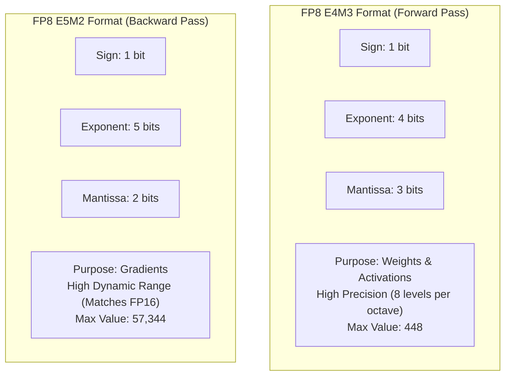
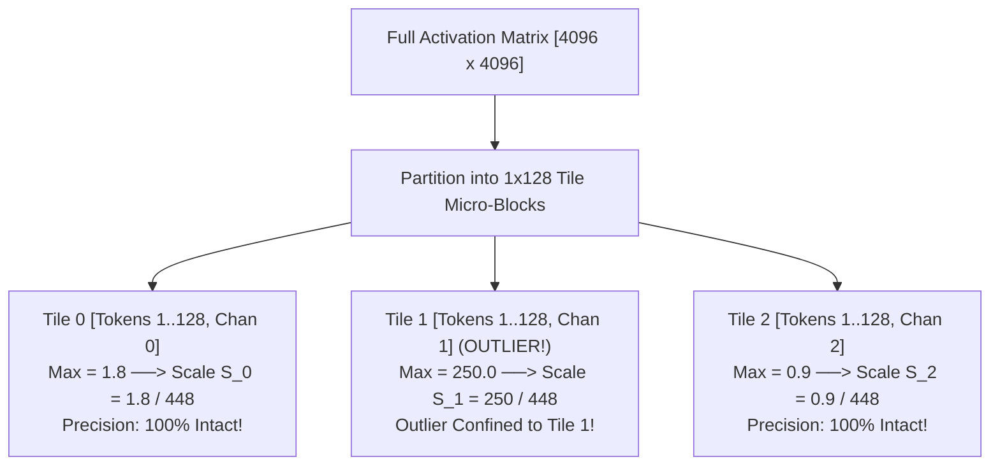

# 04. FP8 Mixed Precision Training & Inference Framework

> **Target Audience**: Anyone from a developer exploring modern LLMs for the first time to an experienced infrastructure engineer seeking deep mathematical and architectural clarity.

---

## 📑 Table of Contents
1. [Foundational Scaffolding: Understanding Computer Number Formats](#1-foundational-scaffolding-understanding-computer-number-formats)
   - [1.1 Anatomy of a Floating-Point Number (Sign, Exponent, Mantissa)](#11-anatomy-of-a-floating-point-number-sign-exponent-mantissa)
   - [1.2 The Precision vs. Dynamic Range Dilemma](#12-the-precision-vs-dynamic-range-dilemma)
   - [1.3 The Evolutionary Progression: FP32 $\to$ FP16 $\to$ BF16 $\to$ FP8](#13-the-evolutionary-progression-fp32-to-fp16-to-bf16-to-fp8)
   - [1.4 The Economic Miracle: How FP8 Enabled a $6 Million Pretraining Run](#14-the-economic-miracle-how-fp8-enabled-a-6-million-pretraining-run)
2. [The Two Standard FP8 Formats: E4M3 vs. E5M2](#2-the-two-standard-fp8-formats-e4m3-vs-e5m2)
   - [2.1 FP8 E4M3: High Precision for Forward Passes](#21-fp8-e4m3-high-precision-for-forward-passes)
   - [2.2 FP8 E5M2: High Dynamic Range for Gradient Backpropagation](#22-fp8-e5m2-high-dynamic-range-for-gradient-backpropagation)
   - [2.3 Comparison Matrix of Numerical Limits](#23-comparison-matrix-of-numerical-limits)
3. [The Outlier Crisis: Why Naive Quantization Destroys LLMs](#3-the-outlier-crisis-why-naive-quantization-destroys-llms)
   - [3.1 What are Emergent Activation Outliers?](#31-what-are-emergent-activation-outliers)
   - [3.2 The Disaster of Per-Tensor Scaling](#32-the-disaster-of-per-tensor-scaling)
4. [DeepSeek's Solution: Fine-Grained Tile-Wise & Block-Wise Quantization](#4-deepseeks-solution-fine-grained-tile-wise--block-wise-quantization)
   - [4.1 Tile-Wise Activation Scaling ($1 \times 128$)](#41-tile-wise-activation-scaling-1-times-128)
   - [4.2 Block-Wise Weight Scaling ($128 \times 128$)](#42-block-wise-weight-scaling-128-times-128)
   - [4.3 Confining Outliers to Local Micro-Blocks](#43-confining-outliers-to-local-micro-blocks)
5. [The End-to-End FP8 Mixed-Precision Computational Graph](#5-the-end-to-end-fp8-mixed-precision-computational-graph)
6. [Hardware Acceleration on NVIDIA Blackwell (GB10) Tensor Cores](#6-hardware-acceleration-on-nvidia-blackwell-gb10-tensor-cores)
7. [Alternative Industry Approaches to Quantization](#7-alternative-industry-approaches-to-quantization)
8. [Hands-On PyTorch Implementation & Verification Lab](#8-hands-on-pytorch-implementation--verification-lab)
9. [Beginner Practice Exercises with Solutions](#9-beginner-practice-exercises-with-solutions)
10. [Troubleshooting, Common Misconceptions & FAQ](#10-troubleshooting-common-misconceptions--faq)

---

## 1. Foundational Scaffolding: Understanding Computer Number Formats

### 1.1 Anatomy of a Floating-Point Number
In digital computers, numbers are stored as binary bits. Standard floating-point numbers follow the IEEE scientific notation format:

$$\text{Value} = (-1)^{\text{Sign}} \times 2^{\text{Exponent} - \text{Bias}} \times \left(1 + \frac{\text{Mantissa}}{2^{\text{Bits}}}\right)$$

Every float consists of three distinct components:
1. **Sign bit ($S$)**: 1 bit (0 for positive, 1 for negative).
2. **Exponent ($E$)**: Determines the scale or magnitude of the number (how large or small it can be—the "Dynamic Range").
3. **Mantissa / Fraction ($M$)**: Determines the fractional precision and detail (how many decimal places of accuracy are preserved).

```text
32-BIT FLOAT (FP32 - 4 Bytes):
[Sign: 1 bit] [Exponent: 8 bits] [Mantissa: 23 bits]
Dynamic Range: ~10^(-38) to 10^(+38) | Extremely high precision

16-BIT FLOAT (BF16 - 2 Bytes):
[Sign: 1 bit] [Exponent: 8 bits] [Mantissa: 7 bits]
Dynamic Range: Same as FP32! | Moderate precision (Industry standard for pretraining)

8-BIT FLOAT (FP8 - 1 Byte):
[Sign: 1 bit] [Exponent: 4 or 5 bits] [Mantissa: 3 or 2 bits]
Dynamic Range: Restricted | Low precision (Requires fine-grained scaling to prevent accuracy loss)
```

### 1.2 The Precision vs. Dynamic Range Dilemma
In an 8-bit number, you have **only 8 total bits** ($2^8 = 256$ possible values). You face a fundamental mathematical dilemma:
- If you give more bits to the **Exponent**, you can represent huge and tiny numbers, but you have very few bits left for the **Mantissa** (numbers become coarse and round off).
- If you give more bits to the **Mantissa**, numbers are precise, but your **Exponent** is small, so large numbers overflow to Infinity (`Inf`) and small numbers underflow to Zero (`0`).

### 1.3 The Evolutionary Progression
- **2017 (FP32)**: Early transformers used 32-bit floats. Memory consumption was gigantic.
- **2020 (FP16 & BF16)**: Halved memory to 2 bytes per parameter. BF16 became the standard because its 8-bit exponent matches FP32, completely preventing training loss overflows.
- **2024 (FP8)**: DeepSeek-V3 and NVIDIA Blackwell proved that models can be trained and served directly in **8-bit floating point**, halving memory again and doubling processing speed!

### 1.4 The Economic Miracle: How FP8 Enabled a $6 Million Pretraining Run
Pretraining Meta's Llama-3 405B in BF16 required an estimated **$100M+** in GPU compute.

DeepSeek pretrained **DeepSeek-V3 (671B parameters)** on 14.8 Trillion tokens using FP8 mixed-precision on a modest cluster of 2,048 NVIDIA H800 GPUs for just **$6 Million USD**!
- **Memory Bandwidth**: Halving memory traffic allowed Tensor Cores to run at peak throughput.
- **Inter-GPU Communication**: Communication packets across InfiniBand/NVLink were cut in half.
- **Cache Efficiency**: 2x more tokens fit into GPU L2 cache and SRAM.

---

## 2. The Two Standard FP8 Formats: E4M3 vs. E5M2

The Open Compute Project (OCP) and IEEE defined two complementary 8-bit floating-point formats:



### 2.1 FP8 E4M3: High Precision for Forward Passes
- **Structure**: 1 sign bit, 4 exponent bits, 3 mantissa bits.
- **Maximum Representable Value**: $448.0$.
- **Smallest Positive Normal Value**: $2^{-6} = 0.015625$.
- **Why it is used in the Forward Pass**: During inference and the forward training pass, neural network weights and hidden activations follow relatively bounded normal distributions. Preserving high precision (3 mantissa bits) is critical to prevent degradation of reasoning and linguistic nuance.

### 2.2 FP8 E5M2: High Dynamic Range for Gradient Backpropagation
- **Structure**: 1 sign bit, 5 exponent bits, 2 mantissa bits.
- **Maximum Representable Value**: $57,344.0$ (Exactly matches IEEE FP16!).
- **Smallest Positive Normal Value**: $2^{-14} \approx 6.1 \times 10^{-5}$.
- **Why it is used in the Backward Pass**: Backpropagated gradients span orders of magnitude—some gradients are tiny ($10^{-5}$) while others are large. The 5 exponent bits prevent gradients from vanishing (underflowing to zero), ensuring stable optimization.

### 2.3 Comparison Matrix of Numerical Limits

| Format | Total Bits | Exponent Bits | Mantissa Bits | Exponent Bias | Max Value | Min Positive Normal | Primary Usage |
| :--- | :---: | :---: | :---: | :---: | :---: | :---: | :--- |
| **FP32** | 32 | 8 | 23 | 127 | $3.4 \times 10^{38}$ | $1.18 \times 10^{-38}$ | Master Weights, Optimizer States |
| **BF16** | 16 | 8 | 7 | 127 | $3.39 \times 10^{38}$ | $1.18 \times 10^{-38}$ | Residual Stream, Attention Softmax |
| **FP8 (E4M3)** | 8 | 4 | 3 | 7 | **448.0** | **0.015625** | **Forward Weights & Activations** |
| **FP8 (E5M2)** | 8 | 5 | 2 | 15 | **57,344.0** | **$6.1 \times 10^{-5}$** | **Backward Pass Gradients** |

---

## 3. The Outlier Crisis: Why Naive Quantization Destroys LLMs

### 3.1 What are Emergent Activation Outliers?
In 2022, researchers discovered a strange phenomenon in LLMs exceeding 6.7 Billion parameters: **Emergent Activation Outliers**.
- In 99.9% of channels, activation values sit comfortably between $[-2.0, +2.0]$.
- However, in a tiny fraction of channels (e.g., channel #342), values suddenly spike to **$+150.0$ or $+300.0$**!
- These outlier channels carry critical semantic information (such as syntactic structure, rare entities, and multi-step logic).

### 3.2 The Disaster of Per-Tensor Scaling
In naive quantization, the entire matrix is scaled by a single global factor $S$:

$$S = \frac{\max(|X|)}{\text{Max\_FP8}} = \frac{300.0}{448} \approx 0.67$$

Every value in the matrix is divided by $S$. 
- Normal values like $0.05$ become $\frac{0.05}{0.67} = 0.074$.
- In FP8, the step size between representable numbers is too large to resolve $0.074$. The normal values **round down to ZERO**!
- 99.9% of the neural network's features are wiped out, causing catastrophic perplexity collapse (the model outputs gibberish).

---

## 4. DeepSeek's Solution: Fine-Grained Tile-Wise & Block-Wise Quantization

DeepSeek-V3 bypassed the outlier crisis by abandoning per-tensor quantization in favor of **fine-grained micro-blocks**.



### 4.1 Tile-Wise Activation Scaling ($1 \times 128$)
Activations are grouped into micro-tiles of **1 token across 128 channels** ($1 \times 128$):
- Each 128-element slice has its own dedicated scaling factor:
  $$s_i = \frac{\max(|x_i|)}{448.0}$$
- If an outlier occurs at index 342, only that specific 128-element slice uses a large scale factor.
- The remaining thousands of tokens and channels maintain tiny scale factors and **retain maximum fractional precision**!

### 4.2 Block-Wise Weight Scaling ($128 \times 128$)
Model weight matrices are partitioned into **$128 \times 128$ rectangular micro-blocks**:
- For a $4096 \times 4096$ matrix, there are $\frac{4096}{128} \times \frac{4096}{128} = 32 \times 32 = 1,024$ independent scale factors!
- Storing 1,024 floating-point scale factors takes negligible memory ($1024 \times 2 \text{ bytes} = 2 \text{ KB}$), representing less than **0.01% overhead**, while completely eliminating quantization error!

### 4.3 Quantization Formula with Clamping
For any element $x$ in block $B$:

$$x_{\text{FP8}} = \text{clamp}\left( \text{round}\left( \frac{x}{s_B} \right), -448, 448 \right)$$

---

## 5. The End-to-End FP8 Mixed-Precision Computational Graph

To prevent numerical drift, DeepSeek does not run 100% of operations in FP8. Highly sensitive operations remain in 16-bit or 32-bit:

```text
+-----------------------------------------------------------------------------------+
| 1. MASTER WEIGHTS & OPTIMIZER STATES: Stored in FP32 / BF16.                       |
|    - Updated by AdamW in 32-bit to maintain subtle gradient accumulation.         |
+-----------------------------------------------------------------------------------+
                                         │
                                         ▼ [Quantize to FP8 E4M3]
+-----------------------------------------------------------------------------------+
| 2. FORWARD PASS: Matrix Multiplications (GEMMs) executed in FP8 E4M3.             |
|    - Linear Projections (Q, K, V, Out) run on Tensor Cores at 2x speed.           |
|    - Feed-Forward MoE Expert Projections run in FP8.                              |
+-----------------------------------------------------------------------------------+
                                         │
                                         ▼ [Keep in BF16 / FP32]
+-----------------------------------------------------------------------------------+
| 3. ATTENTION SOFTMAX & RESIDUAL STREAM: Kept in BF16 / FP32.                       |
|    - Softmax exponentials and layer additions require high precision.             |
|    - RMSNorm calculations remain in FP32.                                         |
+-----------------------------------------------------------------------------------+
                                         │
                                         ▼ [Quantize to FP8 E5M2]
+-----------------------------------------------------------------------------------+
| 4. BACKWARD PASS: Gradients computed in FP8 E5M2.                                 |
|    - High dynamic range prevents gradient underflow during backprop.              |
+-----------------------------------------------------------------------------------+
```

---

## 6. Hardware Acceleration on NVIDIA Blackwell (GB10) Tensor Cores

The **NVIDIA Blackwell architecture (GB10)** is purpose-built for fine-grained FP8 execution:
- **5th Generation Tensor Cores**: Support native hardware instructions for asynchronous scaling factor decompression directly inside the matrix multiplication pipeline.
- **Compute Throughput**:
  - FP16/BF16 Tensor Core Peak: **$1\times$ baseline FLOPs**
  - FP8 Tensor Core Peak: **$2\times$ baseline FLOPs (DOUBLE THE SPEED!)**
- **Unified Memory Advantage**: On the DGX Spark (128 GB unified memory), running DeepSeek-32B or Qwen-32B in FP8 requires only **~32 GB of VRAM**, leaving over **90 GB free** for massive concurrent batches and multi-user KV caches!

---

## 7. Alternative Industry Approaches to Quantization

| Quantization Method | Precision Format | Granularity | Training vs. Post-Training | Accuracy Retention |
| :--- | :--- | :--- | :--- | :---: |
| **DeepSeek FP8 Framework** | **FP8 (E4M3 / E5M2)** | **Tile-Wise ($1 \times 128$) & Block-Wise ($128 \times 128$)** | **Native Pretraining & Serving** | **99.9%** |
| **NVIDIA Transformer Engine** | FP8 (E4M3 / E5M2) | Per-Tensor with Delayed History Scales | Training & Serving | 98.5% |
| **bitsandbytes (LLM.int8)** | INT8 + FP16 Outliers | Per-Channel + Outlier Extraction | Post-Training Inference | 99.5% (Slow) |
| **AWQ** | INT4 (Integer) | Group-Wise (Group Size = 128) | Post-Training Inference | 97.5% |
| **GPTQ** | INT4 (Integer) | Column-Wise with Hessian Matrix | Post-Training Inference | 97.0% |

---

## 8. Hands-On PyTorch Implementation & Verification Lab

The following self-contained script simulates an activation matrix with severe outliers and compares **Naive Per-Tensor Quantization** against **DeepSeek Fine-Grained Tile-Wise Quantization**.

```python
"""
FP8 Mixed-Precision Verification Lab
Author: DGX Spark AI Infrastructure Team
Description: Benchmarks Naive Per-Tensor Quantization vs DeepSeek Tile-Wise Quantization under Outliers.
"""

import torch

def quantize_per_tensor(x: torch.Tensor, max_fp8: float = 448.0):
    """Naive Per-Tensor Quantization."""
    scale = x.abs().max() / max_fp8
    scale = torch.clamp(scale, min=1e-8)
    x_quant = torch.clamp(torch.round(x / scale), -max_fp8, max_fp8)
    x_dequant = x_quant * scale
    return x_dequant, scale

def quantize_tile_wise(x: torch.Tensor, tile_size: int = 128, max_fp8: float = 448.0):
    """
    DeepSeek Fine-Grained Tile-Wise Quantization.
    x: [Batch, Channels] where Channels is a multiple of tile_size (128).
    """
    B, C = x.shape
    assert C % tile_size == 0, "Channels must be divisible by tile_size!"
    
    # Reshape into tiles: [B, num_tiles, tile_size]
    num_tiles = C // tile_size
    x_tiles = x.view(B, num_tiles, tile_size)
    
    # Compute scale factor per tile: [B, num_tiles, 1]
    scales = x_tiles.abs().amax(dim=-1, keepdim=True) / max_fp8
    scales = torch.clamp(scales, min=1e-8)
    
    # Quantize and dequantize
    x_quant = torch.clamp(torch.round(x_tiles / scales), -max_fp8, max_fp8)
    x_dequant = x_quant * scales
    
    return x_dequant.view(B, C), scales

# ----------------- Verification Lab -----------------
if __name__ == "__main__":
    torch.manual_seed(42)
    print("Running FP8 Fine-Grained Quantization Verification Lab...")
    
    # Create a batch of normal activations (mean=0, std=1.0)
    batch_size = 4
    channels = 512 # 4 tiles of 128
    activations = torch.randn(batch_size, channels)
    
    # INJECT EXTREME ACTIVATION OUTLIER IN TILE 1 (Channel 150)
    activations[:, 150] = 350.0 # Outlier is 350x normal values!
    
    # 1. Run Naive Per-Tensor Quantization
    dequant_tensor, global_scale = quantize_per_tensor(activations)
    mse_tensor = torch.mean((activations - dequant_tensor) ** 2).item()
    
    # 2. Run DeepSeek Tile-Wise Quantization (Tile size = 128)
    dequant_tile, tile_scales = quantize_tile_wise(activations, tile_size=128)
    mse_tile = torch.mean((activations - dequant_tile) ** 2).item()
    
    print("\n--- RESULTS UNDER SEVERE OUTLIERS ---")
    print(f"Global Tensor Scale Factor: {global_scale.item():.4f}")
    print(f"Tile-Wise Scale Factors (Sample Batch 0): {tile_scales[0].view(-1).numpy().round(4)}")
    print(f"\nNaive Per-Tensor Reconstruction MSE:  {mse_tensor:.6f}")
    print(f"DeepSeek Tile-Wise Reconstruction MSE: {mse_tile:.6f}")
    
    improvement = (mse_tensor / mse_tile)
    print(f"\n[SUCCESS] DeepSeek Tile-Wise Quantization is {improvement:.1f}x MORE ACCURATE than Naive Quantization!")
```

---

## 9. Beginner Practice Exercises with Solutions

### Exercise 1: Quantization Range Calculation
**Question**: Suppose you have an FP8 E4M3 format.
- Sign: 1 bit
- Exponent: 4 bits (Bias = 7)
- Mantissa: 3 bits
1. What is the binary bit pattern for the maximum normal value?
2. What is the decimal value of this bit pattern?

#### Solution:
1. In IEEE FP8 E4M3, the maximum normal number has:
   - Sign = 0 (positive)
   - Exponent = `1111` (binary 15)
   - Mantissa = `110` (binary 6) *(Note: in E4M3, `1111` with `111` is reserved for NaN)*
2. Calculation:
   - Exponent Value = $15 - \text{Bias} = 15 - 7 = 8 \implies 2^8 = 256$
   - Mantissa Value = $1 + \frac{6}{2^3} = 1 + \frac{6}{8} = 1.75$
   - Decimal Value = $256 \times 1.75 = \mathbf{448.0}$

---

## 10. Troubleshooting, Common Misconceptions & FAQ

### Q1: "Why don't we use INT8 instead of FP8 for training?"
**Answer**: INT8 has uniform, linear spacing between integers ($0, 1, 2, 3\dots$). Neural network weights and activations follow Gaussian (bell-curve) distributions with dense clusters near zero and long tails. FP8 naturally allocates more precision near zero and wider spacing for large values, matching the natural distribution of deep learning tensors.

### Q2: "Can FP8 models run on older NVIDIA GPUs like V100 or T4?"
**Answer**: **No.** Native FP8 Tensor Core execution instructions were introduced in the **NVIDIA Ada Lovelace, Hopper (H100), and Blackwell (GB10/B200)** architectures. On older GPUs, FP8 tensors must be emulated or cast to FP16, resulting in slower execution.

---

Proceed to [**06-flash-mla-decoding-kernel.md**](06-flash-mla-decoding-kernel.md) to explore how DeepSeek engineered custom CUDA/CUTLASS kernels to accelerate MLA on Hopper and Blackwell GPUs.
