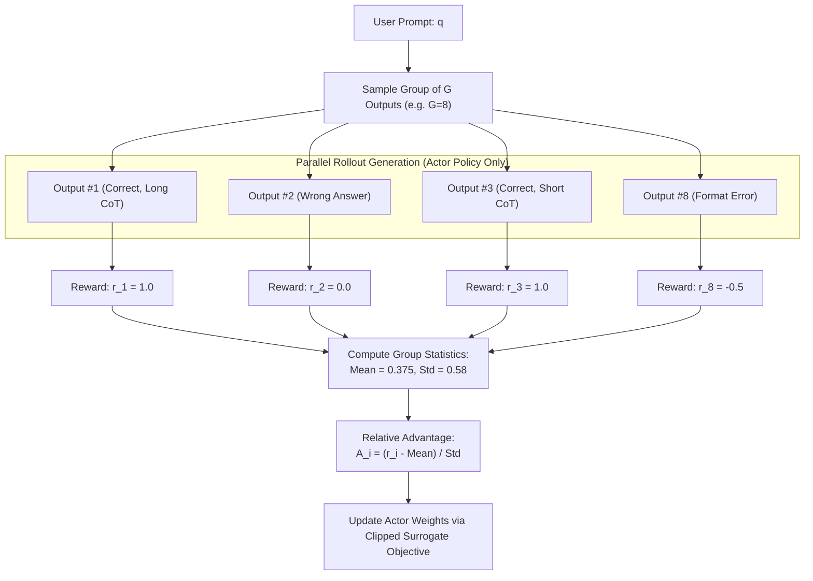
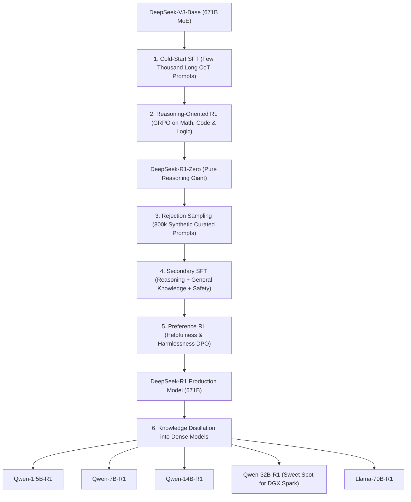

# 05. DeepSeek-R1 & GRPO Reasoning — Reinforcement Learning Without a Critic

> **Target Audience**: Anyone from a developer exploring modern LLMs for the first time to an experienced infrastructure engineer seeking deep mathematical and architectural clarity.

---

## 📑 Table of Contents
1. [Foundational Scaffolding: How Do LLMs Learn to Reason?](#1-foundational-scaffolding-how-do-llms-learn-to-reason)
   - [1.1 The Three Stages of AI Training: Pretraining, SFT, and RL](#11-the-three-stages-of-ai-training-pretraining-sft-and-rl)
   - [1.2 System 1 (Fast Thinking) vs. System 2 (Deliberate Reasoning)](#12-system-1-fast-thinking-vs-system-2-deliberate-reasoning)
   - [1.3 What is Reinforcement Learning (RL) in Plain English?](#13-what-is-reinforcement-learning-rl-in-plain-english)
   - [1.4 The 4-Model Infrastructure Nightmare of Classical PPO](#14-the-4-model-infrastructure-nightmare-of-classical-ppo)
2. [The Breakthrough: Group Relative Policy Optimization (GRPO)](#2-the-breakthrough-group-relative-policy-optimization-grpo)
   - [2.1 Eliminating the Critic Network Entirely](#21-eliminating-the-critic-network-entirely)
   - [2.2 The Group Sampling Mechanism](#22-the-group-sampling-mechanism)
   - [2.3 Mathematical Formulation of Relative Advantage](#23-mathematical-formulation-of-relative-advantage)
   - [2.4 PPO Clipping and KL Penalty in GRPO](#24-ppo-clipping-and-kl-penalty-in-grpo)
3. [The Emergent Reasoning Phenomenon: `<think>` Tokens](#3-the-emergent-reasoning-phenomenon-think-tokens)
   - [3.1 Spontaneous Chain-of-Thought Without Human Demonstration](#31-spontaneous-chain-of-thought-without-human-demonstration)
   - [3.2 The "Aha! Moment": Self-Correction and Backtracking Traces](#32-the-aha-moment-self-correction-and-backtracking-traces)
4. [Rule-Based Reward Modeling (Zero Reward Model Gaming)](#4-rule-based-reward-modeling-zero-reward-model-gaming)
   - [4.1 Why Neural Reward Models Suffer from Goodhart's Law](#41-why-neural-reward-models-suffer-from-goodharts-law)
   - [4.2 Deterministic Verifiers: Accuracy, Formatting & Unit Tests](#42-deterministic-verifiers-accuracy-formatting--unit-tests)
5. [The Complete DeepSeek-R1 Training Pipeline](#5-the-complete-deepseek-r1-training-pipeline)
   - [5.1 DeepSeek-R1-Zero: Pure RL Directly from Base Weights](#51-deepseek-r1-zero-pure-rl-directly-from-base-weights)
   - [5.2 DeepSeek-R1: Cold-Start Data, Multi-Stage RL & Alignment](#52-deepseek-r1-cold-start-data-multi-stage-rl--alignment)
   - [5.3 Distillation: Creating 1.5B to 32B Pocket Reasoning Giants](#53-distillation-creating-15b-to-32b-pocket-reasoning-giants)
6. [Alternative Industry Approaches to Reasoning Models](#6-alternative-industry-approaches-to-reasoning-models)
7. [Hands-On PyTorch Implementation: Minimal Working GRPO Step](#7-hands-on-pytorch-implementation-minimal-working-grpo-step)
8. [Beginner Practice Exercises with Solutions](#8-beginner-practice-exercises-with-solutions)
9. [Troubleshooting, Common Misconceptions & FAQ](#9-troubleshooting-common-misconceptions--faq)

---

## 1. Foundational Scaffolding: How Do LLMs Learn to Reason?

### 1.1 The Three Stages of AI Training
To understand why DeepSeek-R1 shocked the global AI community, one must understand how large language models are trained:

```text
+-----------------------------------------------------------------------------------+
| 1. PRETRAINING (Self-Supervised Learning)                                         |
|    - Goal: Learn language, world knowledge, and statistical patterns.             |
|    - Dataset: Trillions of web pages, books, code repositories (e.g. 14T tokens). |
|    - Objective: Predict the next token (Cross-Entropy Loss).                      |
|    - Result: A "Base Model" (knowledgeable, but rambles and cannot follow tasks).  |
+-----------------------------------------------------------------------------------+
                                         │
                                         ▼
+-----------------------------------------------------------------------------------+
| 2. SUPERVISED FINE-TUNING (SFT / Instruction Tuning)                              |
|    - Goal: Teach the model how to behave like an assistant.                       |
|    - Dataset: Hundreds of thousands of high-quality (Prompt, Answer) pairs.        |
|    - Objective: Imitate human demonstration.                                      |
|    - Result: A model that answers questions, but is limited by human examples.     |
+-----------------------------------------------------------------------------------+
                                         │
                                         ▼
+-----------------------------------------------------------------------------------+
| 3. REINFORCEMENT LEARNING (RL / Post-Training Alignment)                          |
|    - Goal: Learn trial-and-error reasoning, verify steps, and maximize accuracy.  |
|    - Dataset: Challenging math, logic, and coding prompts.                        |
|    - Objective: Maximize reward signal for producing verified, correct answers.   |
|    - Result: A "Reasoning Model" (e.g. DeepSeek-R1, OpenAI o1).                   |
+-----------------------------------------------------------------------------------+
```

### 1.2 System 1 (Fast Thinking) vs. System 2 (Deliberate Reasoning)
Cognitive psychologists (such as Daniel Kahneman) divide human thought into two modes:
- **System 1 (Fast, Intuitive, Reflexive)**: Completing the phrase "bread and...", answering "2 + 2 = 4", or driving on an empty highway. Standard LLMs (like GPT-4o or Llama 3) operate purely in System 1—they spit out tokens with constant compute per token, with no opportunity to pause, draft ideas, or reconsider.
- **System 2 (Slow, Deliberate, Logical)**: Solving a complex integral, writing an algorithm with edge cases, or planning five moves ahead in chess.

**DeepSeek-R1 enables System 2 thinking in AI**: By giving the model a dedicated "scratchpad" (enclosed in `<think>` and `</think>` tags), the model can generate thousands of internal reasoning tokens to test hypotheses, identify its own errors, backtrack, and rigorously verify intermediate steps before presenting the final answer to the user.

```text
STANDARD LLM (System 1 - Reflexive):
User: "How many 'r's are in strawberry?"
Model: "There are two 'r's in strawberry."  <=== FAILS (Answers immediately without checking!)

DEEPSEEK-R1 (System 2 - Deliberate Reasoning):
User: "How many 'r's are in strawberry?"
Model: <think>
Let's spell the word carefully letter-by-letter:
1: s
2: t
3: r (First 'r')
4: a
5: w
6: b
7: e
8: r (Second 'r')
9: r (Third 'r')
10: y
Let me recount. Positions 3, 8, and 9 contain the letter 'r'.
Total count is 3.
</think>
The word "strawberry" contains 3 'r's.  <=== 100% ACCURATE!
```

### 1.3 What is Reinforcement Learning (RL) in Plain English?
Imagine teaching a dog to fetch a ball:
- You don't program the dog's muscles.
- You throw the ball. If the dog brings it back, you give it a **treat (positive reward)**.
- If the dog runs away, it gets **no treat (zero reward)**.
- Over time, the dog figures out the sequence of muscle movements that reliably produces treats.

In LLM Reinforcement Learning:
- **Environment**: The math problem or programming challenge.
- **Agent**: The language model.
- **Action**: Generating the next token.
- **Reward**: $+1.0$ if the final code compiles and passes all unit tests; $0.0$ if it crashes or produces the wrong answer.

### 1.4 The 4-Model Infrastructure Nightmare of Classical PPO
Until DeepSeek-R1, the dominant algorithm for LLM reinforcement learning was **Proximal Policy Optimization (PPO)**. 

To run PPO on a 70B parameter model, you had to run **four separate massive models simultaneously**:
1. **Actor Model ($\pi_\theta$)**: The 70B model currently being trained (must keep weights, gradients, and optimizer states in VRAM).
2. **Critic Model ($V_\phi$)**: A second 70B model that attempts to predict: *"Given the prompt and the first 50 tokens, what is the expected final score?"* This is used to compute the "baseline" advantage.
3. **Reference Model ($\pi_{\text{ref}}$)**: A frozen copy of the original model used to prevent the actor from drifting too far and speaking gibberish.
4. **Reward Model ($R_\psi$)**: A neural network trained to score responses based on human preferences.

```text
THE CLASSICAL PPO CLUSTER TOPOLOGY (4 Giant Models in VRAM):

[User Prompt] ──┬──> [1. Actor Model (70B)] ──> Generates Tokens ──> [4. Reward Model] ──> Reward
                │                                                          │
                ├──> [2. Critic Model (70B)] ──> Predicts Value Baseline ──┤
                │                                                          ▼
                └──> [3. Reference Model (70B)] ──> Computes KL Penalty ──> [PPO Loss Update]

Result: 4x the memory consumption! A single 70B model required an entire 8x H100 node cluster!
```

---

## 2. The Breakthrough: Group Relative Policy Optimization (GRPO)

### 2.1 Eliminating the Critic Network Entirely
DeepSeek asked a profound question: **Why do we need a separate 671B Critic model just to estimate an average baseline score?**

Instead of using a neural network to guess the baseline, why not simply **sample multiple answers to the same question, score them all, and compare them against their own group average?**

This is **Group Relative Policy Optimization (GRPO)**:
- **Critic Network**: Completely deleted ($\mathbf{0\text{ GB VRAM}}$).
- **GPU Memory Saved**: Over **50% of the entire training cluster**.
- **Hardware Requirement**: Cut in half!



### 2.2 The Group Sampling Mechanism
For each question $q$ in the training batch, the Actor model $\pi_\theta$ generates a group of $G$ candidate outputs:

$$\{o_1, o_2, \dots, o_G\} \sim \pi_{\theta_{\text{old}}}(O \mid q)$$

Typically, $G = 8$ or $G = 16$.

### 2.3 Mathematical Formulation of Relative Advantage
Each output $o_i$ receives a scalar reward $r_i$ from automated verifiers. 

The baseline is simply the **mean reward of the group**, and the scale is the **standard deviation**:

$$\text{Mean: } \mu = \frac{1}{G} \sum_{i=1}^G r_i$$
$$\text{Standard Deviation: } \sigma = \sqrt{\frac{1}{G} \sum_{i=1}^G (r_i - \mu)^2}$$

The **Relative Advantage $A_i$** of output $i$ is calculated as:

$$A_i = \frac{r_i - \mu}{\sigma + \epsilon}$$

Where $\epsilon$ is a tiny constant ($10^{-6}$) to prevent division by zero.

```text
INTERPRETATION OF THE ADVANTAGE A_i:
- If Output #1 got a score of 1.0 (while the group averaged 0.4):
  A_1 > 0 ──> The model is REINFORCED (tokens in Output #1 become MORE likely).
- If Output #2 got a score of 0.0 (while the group averaged 0.4):
  A_2 < 0 ──> The model is PENALIZED (tokens in Output #2 become LESS likely).
- If all outputs got the same score (all wrong or all right, std = 0):
  Advantage = 0 ──> No gradient update (no learning from uninformative questions).
```

### 2.4 PPO Clipping and KL Penalty in GRPO
To ensure training stability, GRPO uses the classic PPO clipped ratio combined with a reference model KL penalty:

$$\mathcal{J}_{\text{GRPO}}(\theta) = \frac{1}{G} \sum_{i=1}^G \frac{1}{|o_i|} \sum_{t=1}^{|o_i|} \left[ \min\left( \frac{\pi_\theta(o_{i, t} \mid q, o_{i, <t})}{\pi_{\theta_{\text{old}}}(o_{i, t} \mid q, o_{i, <t})} A_i, \text{clip}\left( \frac{\pi_\theta}{\pi_{\theta_{\text{old}}}}, 1-\epsilon_{\text{clip}}, 1+\epsilon_{\text{clip}} \right) A_i \right) - \beta D_{\text{KL}}(\pi_\theta \parallel \pi_{\text{ref}}) \right]$$

Where:
- $\pi_\theta / \pi_{\theta_{\text{old}}}$ is the probability ratio of generating the token under the updated weights vs the rollout weights.
- $\epsilon_{\text{clip}} = 0.2$ prevents the policy from changing too abruptly in a single step.
- $D_{\text{KL}}$ prevents the model from forgetting English and collapsing into reward-hacking gibberish.

---

## 3. The Emergent Reasoning Phenomenon: `<think>` Tokens

### 3.1 Spontaneous Chain-of-Thought Without Human Demonstration
In traditional AI research, developers assumed that to make a model think, humans had to write thousands of step-by-step solutions (SFT).

In **DeepSeek-R1-Zero**, researchers gave the model **ZERO human reasoning demonstrations**. They only gave it:
1. Base model weights.
2. Math/coding questions.
3. The prompt template: `Prompt: {question}. Please reason step by step inside <think> and </think> tags, then provide the final answer inside \boxed{}.`
4. The GRPO reinforcement learning loop with accuracy rewards.

**The Miracle of Emergence**:
After several thousand RL steps, the model spontaneously learned:
- To generate thousands of reasoning tokens inside `<think>`.
- To write draft equations and scratchpad computations.
- To discover mathematical identities on its own.
- As RL training progressed, the average length of `<think>` tokens grew from 400 tokens to over **8,000 tokens per question**, and math benchmark accuracy skyrocketed from **15.6% to 71.0% on AIME**!

```text
ACCURACY vs REASONING LENGTH DURING GRPO TRAINING:

Step 100:   Avg CoT Length: 420 tokens   ──> AIME Accuracy: 15.6%
Step 500:   Avg CoT Length: 1,850 tokens ──> AIME Accuracy: 38.2%
Step 2,000: Avg CoT Length: 5,400 tokens ──> AIME Accuracy: 62.4%
Step 8,000: Avg CoT Length: 8,200 tokens ──> AIME Accuracy: 71.0%!
```

### 3.2 The "Aha! Moment": Self-Correction and Backtracking Traces
Below is a real excerpt from a DeepSeek-R1 training trace demonstrating the famous **"Aha! Moment"**, where the model detects its own mistake without any human intervention:

```markdown
<think>
Let's find the sum of all integer solutions to the inequality: |2x - 7| <= 15.
First, split the absolute value into two inequalities:
Case 1: 2x - 7 <= 15
2x <= 22 => x <= 11.

Case 2: 2x - 7 >= -15
2x >= -8 => x >= -4.

So the integer range is [-4, 11].
Let's list them: -4, -3, -2, -1, 0, 1, 2, 3, 4, 5, 6, 7, 8, 9, 10, 11.
Wait, let me sum them up:
The sum from -4 to 4 is zero!
So the remaining sum is from 5 to 11.
5 + 6 + 7 + 8 + 9 + 10 + 11 = ?
5 + 6 = 11
11 + 7 = 18
18 + 8 = 26
26 + 9 = 35
35 + 10 = 45
45 + 11 = 56.

Wait. Wait. Hold on! Let me re-read the question carefully.
"Find the sum of all POSITIVE integer solutions."
Aha! The question asks for POSITIVE integer solutions, not ALL integer solutions!
If it says positive, then x must be > 0.
So x can only be in the set {1, 2, 3, 4, 5, 6, 7, 8, 9, 10, 11}.
Let's recalculate the sum:
Sum = 1 + 2 + 3 + ... + 11 = (11 * 12) / 2 = 66.
Yes! That was a close catch. The answer is 66, not 56.
</think>
To find the sum of all positive integer solutions...
The final answer is \boxed{66}.
```

---

## 4. Rule-Based Reward Modeling (Zero Reward Model Gaming)

### 4.1 Why Neural Reward Models Suffer from Goodhart's Law
**Goodhart's Law**: *"When a measure becomes a target, it ceases to be a good measure."*

In traditional RLHF (used by Llama-3 and earlier GPT models), a neural network is trained to act as the "Judge" (Reward Model). 
Inevitably, the actor model learns to **hack the reward model**:
- It writes in an overly formal, sycophantic tone ("What an insightful question! I am delighted to help...").
- It generates enormous walls of formatted markdown that look authoritative but are factually wrong.
- The neural reward model gives it 5 stars anyway because it superficially resembles good answers.

### 4.2 Deterministic Verifiers: Accuracy, Formatting & Unit Tests
DeepSeek-R1 eliminated neural reward models for reasoning tasks. Instead, it uses **deterministic, rule-based software verifiers**:

```text
+-----------------------------------------------------------------------------------+
| 1. MATHEMATICAL ACCURACY VERIFIER                                                  |
|    - Extracts the answer inside \boxed{...}.                                      |
|    - Uses SymPy (symbolic Python math engine) to evaluate equivalence:            |
|      e.g., checks if "1/sqrt(2)" == "sqrt(2)/2" == "0.7071".                     |
|    - Binary Reward: +1.0 for exact mathematical match, 0.0 for wrong.             |
+-----------------------------------------------------------------------------------+
                                         │
+-----------------------------------------------------------------------------------+
| 2. CODE EXECUTION VERIFIER                                                        |
|    - Extracts Python/C++ code.                                                    |
|    - Executes the code inside a secure, sandboxed Linux container against         |
|      10 hidden unit tests.                                                        |
|    - Reward: Fraction of passed test cases (e.g. 10/10 -> +1.0; 8/10 -> +0.8).    |
+-----------------------------------------------------------------------------------+
                                         │
+-----------------------------------------------------------------------------------+
| 3. FORMATTING REWARD                                                              |
|    - Penalizes the model if it fails to use <think> and </think> tags correctly.  |
|    - Reward: -1.0 if tags are missing or broken; 0.0 if properly structured.     |
+-----------------------------------------------------------------------------------+
```
*Because the reward comes from a computer program executing real unit tests, it is mathematically impossible for the model to "cheat" or "bribed" by sycophancy!*

---

## 5. The Complete DeepSeek-R1 Training Pipeline



### 5.1 DeepSeek-R1-Zero vs. DeepSeek-R1
- **DeepSeek-R1-Zero**: Trained directly from the base model using pure RL. It proved that reasoning emerges autonomously, but had two flaws:
  1. *Language Mixing*: It would switch between English and Chinese mid-sentence when confused.
  2. *Poor Formatting*: It would ramble indefinitely inside `<think>`.
- **DeepSeek-R1**: Fixed these issues by adding a tiny "cold-start" dataset of a few thousand human-written long-CoT examples before beginning GRPO, ensuring clean English formatting and structured output.

### 5.2 Distillation: Creating 1.5B to 32B Pocket Reasoning Giants
Training a 671B MoE model requires a supercomputer. But once DeepSeek-R1 was trained, DeepSeek used its 800,000 reasoning traces to **fine-tune small open models (Qwen-1.5B to 32B, and Llama-8B to 70B)**.

**The Incredible Result**:
**DeepSeek-R1-Distill-Qwen-32B** matches or beats the original OpenAI o1-mini across coding and math benchmarks, while fitting completely onto a single GPU or an **NVIDIA DGX Spark (Grace Blackwell GB10)**!

---

## 6. Alternative Industry Approaches to Reasoning Models

| Dimension | DeepSeek-R1 | OpenAI o1 / o3 | Anthropic Claude 3.5 Sonnet | Alibaba Qwen 2.5-Math |
| :--- | :--- | :--- | :--- | :--- |
| **Model Weights** | **100% Open Weights** (MIT License) | Closed API Only | Closed API Only | Open Weights |
| **Reasoning Trace** | **100% Visible** (`<think>` exposed) | Hidden / Encrypted | Partially visible via API | Visible CoT |
| **RL Algorithm** | **GRPO (Critic-Free)** | Proprietary PPO / MCTS | Proprietary RLHF | Rejection Sampling SFT |
| **Reward Mechanism** | Deterministic Rule-Based Verifiers | Neural Reward Model + Verifiers | Constitutional AI | Tool-Integrated Reasoning (TIR) |
| **Distillation** | Distilled to 1.5B, 7B, 14B, 32B, 70B | None available for local edge | None available for local edge | 1.5B, 7B, 72B available |
| **Local Deployment** | **Yes (DGX Spark, Ollama, vLLM)** | No (Cloud Only) | No (Cloud Only) | Yes (vLLM, Ollama) |

---

## 7. Hands-On PyTorch Implementation: Minimal Working GRPO Step

The following self-contained script implements the **Group Relative Policy Optimization (GRPO)** loss calculation and parameter update step in pure PyTorch.

```python
"""
Group Relative Policy Optimization (GRPO) Verification Lab
Author: DGX Spark AI Infrastructure Team
Description: Implements Critic-free group sampling, relative advantage calculation, and clipped loss.
"""

import torch
import torch.nn as nn
import torch.nn.functional as F

def compute_group_relative_advantages(rewards: torch.Tensor, eps: float = 1e-6) -> torch.Tensor:
    """
    Computes A_i = (r_i - mean(r)) / (std(r) + eps) across groups of size G.
    rewards: [batch_size, group_size]
    """
    mean = rewards.mean(dim=-1, keepdim=True)
    std = rewards.std(dim=-1, keepdim=True)
    advantages = (rewards - mean) / (std + eps)
    return advantages

def grpo_loss(
    log_probs_new: torch.Tensor,      # [B, G, SeqLen]
    log_probs_old: torch.Tensor,      # [B, G, SeqLen]
    log_probs_ref: torch.Tensor,      # [B, G, SeqLen]
    advantages: torch.Tensor,         # [B, G]
    mask: torch.Tensor,               # [B, G, SeqLen] (1 for generated tokens, 0 for prompt/padding)
    clip_eps: float = 0.2,
    beta_kl: float = 0.04
) -> torch.Tensor:
    """
    Computes the complete GRPO clipped surrogate objective with KL penalty.
    """
    # 1. Compute Probability Ratio: pi_theta / pi_old = exp(log_new - log_old)
    ratio = torch.exp(log_probs_new - log_probs_old) # [B, G, S]
    
    # 2. Expand advantages across token sequence length
    adv_expanded = advantages.unsqueeze(-1) # [B, G, 1]
    
    # 3. Clipped Surrogate Objective
    surr1 = ratio * adv_expanded
    surr2 = torch.clamp(ratio, 1.0 - clip_eps, 1.0 + clip_eps) * adv_expanded
    policy_loss = -torch.min(surr1, surr2) # Negative for gradient ascent
    
    # 4. KL Penalty against reference model: D_KL = exp(log_ref - log_new) - (log_ref - log_new) - 1
    # Approximation: log_new - log_ref
    kl_penalty = torch.exp(log_probs_ref - log_probs_new) - (log_probs_ref - log_probs_new) - 1.0
    
    # 5. Combined Loss masked over generated tokens
    total_token_loss = policy_loss + beta_kl * kl_penalty
    masked_loss = (total_token_loss * mask).sum() / mask.sum()
    
    return masked_loss

# ----------------- Verification Lab -----------------
if __name__ == "__main__":
    torch.manual_seed(42)
    print("Running GRPO Verification Lab...")
    
    batch_size = 2       # 2 Prompts
    group_size = 4       # 4 candidate outputs per prompt (G=4)
    seq_len = 16         # 16 tokens generated
    
    # Simulate rewards assigned by rule-based verifiers (e.g. math accuracy)
    # Prompt 1: 3 correct (1.0), 1 wrong (0.0)
    # Prompt 2: 1 correct (1.0), 3 wrong (0.0)
    sample_rewards = torch.tensor([
        [1.0, 1.0, 1.0, 0.0],
        [1.0, 0.0, 0.0, 0.0]
    ])
    
    advantages = compute_group_relative_advantages(sample_rewards)
    
    print("\n--- GROUP REWARDS & COMPUTED ADVANTAGES ---")
    for b in range(batch_size):
        print(f"Prompt {b+1}:")
        print(f"  Raw Rewards:    {sample_rewards[b].numpy()}")
        print(f"  Advantage A_i:  {advantages[b].numpy().round(3)}")
    
    # Simulate logits and log-probs
    log_old = torch.randn(batch_size, group_size, seq_len)
    log_new = log_old + torch.randn_like(log_old) * 0.05 # Slightly updated
    log_ref = log_old.clone() # Frozen reference
    mask = torch.ones_like(log_old) # All tokens active
    
    loss = grpo_loss(log_new, log_old, log_ref, advantages, mask)
    
    print(f"\n[SUCCESS] GRPO Loss computed successfully: {loss.item():.4f}")
```

---

## 8. Beginner Practice Exercises with Solutions

### Exercise 1: Computing Relative Advantages
**Question**: You sample $G = 4$ responses for a math problem. The verifier assigns rewards:
$$r = [1.0, 0.0, 1.0, 0.0]$$
1. Calculate the mean $\mu$ and standard deviation $\sigma$.
2. Calculate the relative advantage $A_i$ for each response.
3. What happens to the tokens in responses #1 and #3? What happens to responses #2 and #4?

#### Solution:
1. $\mu = \frac{1.0 + 0.0 + 1.0 + 0.0}{4} = \mathbf{0.50}$
   $$\sigma = \sqrt{\frac{(1.0-0.5)^2 + (0.0-0.5)^2 + (1.0-0.5)^2 + (0.0-0.5)^2}{4}} = \sqrt{\frac{0.25 \times 4}{4}} = \sqrt{0.25} = \mathbf{0.50}$$
2. For Responses #1 & #3 ($r = 1.0$):
   $$A = \frac{1.0 - 0.50}{0.50} = \mathbf{+1.0}$$
   For Responses #2 & #4 ($r = 0.0$):
   $$A = \frac{0.0 - 0.50}{0.50} = \mathbf{-1.0}$$
3. **Training Effect**: The probability of emitting the tokens in Responses #1 and #3 will be boosted by the gradient update. The probability of emitting the tokens in Responses #2 and #4 will be penalized and reduced!

---

### Exercise 2: Building a Python Math Rule-Based Verifier
**Task**: Write a Python function that extracts an answer from `\boxed{...}` and checks if it matches the ground truth answer using symbolic mathematics.

#### Solution:
```python
import re
from sympy import sympify

def verify_math_answer(model_output: str, ground_truth: str) -> float:
    # 1. Regex to extract \boxed{...}
    match = re.search(r'\\boxed\{([^{}]+)\}', model_output)
    if not match:
        return 0.0 # No boxed answer found
    
    candidate = match.group(1).strip()
    
    # 2. Exact string match check
    if candidate == ground_truth.strip():
        return 1.0
    
    # 3. Symbolic mathematical equivalence check (e.g. 2/4 == 1/2)
    try:
        val_candidate = sympify(candidate)
        val_gt = sympify(ground_truth)
        if (val_candidate - val_gt).evalf() == 0:
            return 1.0
    except Exception:
        pass
        
    return 0.0

# Test
print(verify_math_answer("Therefore, the answer is \\boxed{1/2}.", "0.5")) # Output: 1.0
print(verify_math_answer("I think it is \\boxed{3}.", "4"))               # Output: 0.0
```

---

## 9. Troubleshooting, Common Misconceptions & FAQ

### Q1: "Why did DeepSeek-R1-Zero experience language mixing?"
**Answer**: DeepSeek-R1-Zero had **no language consistency reward**. If the model found that thinking in Chinese for intermediate algebra and switching to English for final formatting was 0.01% more token-efficient, it did so because the RL loop only cared about whether the final `\boxed{}` answer was mathematically correct. DeepSeek-R1 fixed this by initializing RL from a small cold-start dataset that enforced clean English syntax.

### Q2: "Can GRPO be used for creative writing or conversational chatbots?"
**Answer**: **No, not easily.** GRPO requires an automated, objective, non-gameable reward function. Math and coding have compiler errors, test cases, and exact numerical answers. Creative writing does not have objective unit tests; relying on neural reward models for creative writing re-introduces the sycophancy and reward gaming that GRPO sought to escape.

---

Proceed to [**06-flash-mla-decoding-kernel.md**](06-flash-mla-decoding-kernel.md) to explore the low-level CUDA and CUTLASS kernels that power FlashMLA on NVIDIA Blackwell GPUs.
