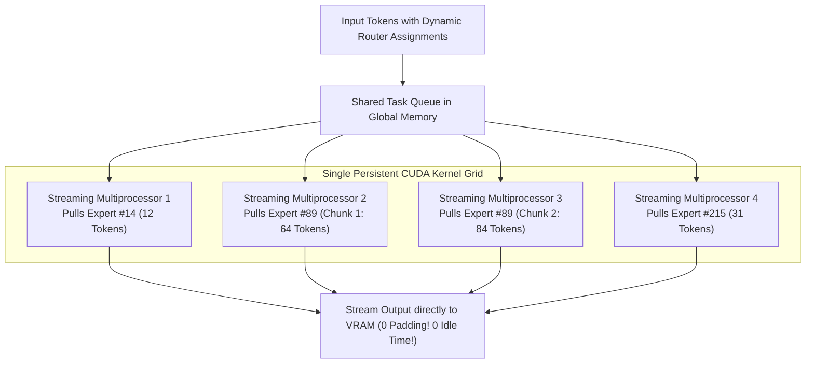

# 07. DeepGEMM FP8 Library — Clean, JIT-Compiled MoE Matrix Multiplications

> **Target Audience**: Anyone from a developer exploring modern LLMs for the first time to an experienced infrastructure engineer seeking deep mathematical and architectural clarity.

---

## 📑 Table of Contents
1. [Foundational Scaffolding: Understanding GEMM in Deep Learning](#1-foundational-scaffolding-understanding-gemm-in-deep-learning)
   - [1.1 What is a GEMM (General Matrix Multiply)?](#11-what-is-a-gemm-general-matrix-multiply)
   - [1.2 Dense GEMM vs. Ragged Grouped GEMM](#12-dense-gemm-vs-ragged-grouped-gemm)
   - [1.3 The Two Disasters of Naive MoE Execution: Padding & Kernel Launch Tax](#13-the-two-disasters-of-naive-moe-execution-padding--kernel-launch-tax)
2. [DeepGEMM Architectural Innovations](#2-deepgemm-architectural-innovations)
   - [2.1 The Persistent Kernel Paradigm](#21-the-persistent-kernel-paradigm)
   - [2.2 Fused Block-Wise Dequantization in Register Files](#22-fused-block-wise-dequantization-in-register-files)
   - [2.3 Zero-Overhead Just-In-Time (JIT) Compilation](#23-zero-overhead-just-in-time-jit-compilation)
3. [Blackwell Hardware Acceleration & Tensor Memory Accelerator (TMA)](#3-blackwell-hardware-acceleration--tensor-memory-accelerator-tma)
   - [3.1 TMA Asynchronous Data Pipelining](#31-tma-asynchronous-data-pipelining)
   - [3.2 Warpgroup Matrix Multiply and Accumulate (WGMMA)](#32-warpgroup-matrix-multiply-and-accumulate-wgmma)
4. [Throughput & TFLOPs Benchmarks vs. NVIDIA cuBLAS & CUTLASS](#4-throughput--tflops-benchmarks-vs-nvidia-cublas--cutlass)
5. [Alternative Industry Approaches to MoE Matrix Multiplications](#5-alternative-industry-approaches-to-moe-matrix-multiplications)
6. [Compilation & Operational Setup on NVIDIA DGX Spark (GB10)](#6-compilation--operational-setup-on-nvidia-dgx-spark-gb10)
7. [Hands-On PyTorch Benchmark Lab](#7-hands-on-pytorch-benchmark-lab)
8. [Beginner Practice Exercises with Solutions](#8-beginner-practice-exercises-with-solutions)
9. [Troubleshooting, Common Misconceptions & FAQ](#9-troubleshooting-common-misconceptions--faq)

---

## 1. Foundational Scaffolding: Understanding GEMM in Deep Learning

### 1.1 What is a GEMM (General Matrix Multiply)?
In deep learning, over **95% of all floating-point operations** reduce to a single fundamental linear algebra equation:

$$\mathbf{C} = \alpha (\mathbf{A} \times \mathbf{B}) + \beta \mathbf{C}$$

Where:
- $\mathbf{A} \in \mathbb{R}^{M \times K}$: The input activation tokens (e.g., $M$ tokens, each with hidden dimension $K$).
- $\mathbf{B} \in \mathbb{R}^{K \times N}$: The neural network weight matrix (projecting from dimension $K$ to dimension $N$).
- $\mathbf{C} \in \mathbb{R}^{M \times N}$: The resulting transformed tokens.

Because this operation is so central to modern computing, hardware vendors (like NVIDIA) design specialized silicon cores—**Tensor Cores**—specifically to multiply and accumulate matrices at hardware speed.

### 1.2 Dense GEMM vs. Ragged Grouped GEMM
- **Dense GEMM (Standard Transformers)**: In a dense model (like Llama-3), all $M$ tokens in a batch pass through the exact same weight matrix $B$. The matrix dimensions $[M, K] \times [K, N]$ are uniform, predictable, and large. Vendor libraries like **NVIDIA cuBLAS** run at near 100% hardware efficiency on dense GEMMs.
- **Ragged Grouped GEMM (Mixture of Experts)**: In **DeepSeekMoE** (with 256 fine-grained micro-experts), each token chooses 8 experts dynamically. In any given batch:
  - Expert #14 might receive **12 tokens** ($M_{14} = 12$).
  - Expert #89 might receive **148 tokens** ($M_{89} = 148$).
  - Expert #210 might receive **0 tokens** ($M_{210} = 0$).

The GPU is forced to execute 256 separate matrix multiplications, each with a different, irregular number of rows ($M_i$)!

```text
DENSE GEMM (Uniform & Predictable):
[Batch: 2,048 Tokens]  ×  [Weight Matrix B: 4,096 x 4,096]  ──> [Output: 2,048 x 4,096]
===> Runs at 98% Tensor Core peak efficiency in cuBLAS!

MoE GROUPED GEMM (Ragged & Highly Irregular):
[Expert #1: 12 Tokens]   × [W_1: 4,096 x 1,024]
[Expert #2: 148 Tokens]  × [W_2: 4,096 x 1,024]
[Expert #3: 0 Tokens]    × [W_3: 4,096 x 1,024]
...
[Expert #256: 31 Tokens] × [W_256: 4,096 x 1,024]
===> cuBLAS CHOKES! Severe kernel launch overhead and idle thread blocks!
```

### 1.3 The Two Disasters of Naive MoE Execution

#### Disaster 1: The Zero-Padding Waste
To make ragged batches fit into standard cuBLAS APIs, early MoE implementations padded every expert's batch to match the largest expert (e.g., padding all experts to 148 tokens with zeros):
- If the average expert receives only 30 tokens, but must be padded to 148 tokens:
  $$\text{Wasted Compute} = \frac{148 - 30}{148} \approx \mathbf{79.7\%\text{ of all FLOPs wasted multiplying zeros!}}$$

#### Disaster 2: The Kernel Launch Overhead
If instead of padding, the framework launches 256 individual small CUDA kernels:
- Launching a CUDA kernel from the CPU host takes approximately **3 to 5 microseconds**.
- Multiplying 12 tokens by an expert on a Blackwell GPU takes **less than 1 microsecond**!
- The GPU spends **80% of its time sitting completely idle** waiting for the CPU operating system to dispatch the next kernel!

---

## 2. DeepGEMM Architectural Innovations

DeepSeek engineered **DeepGEMM**: a clean, lightweight, JIT-compiled C++/CUTLASS library specifically designed for **FP8 Grouped GEMM** with fine-grained scaling.



### 2.1 The Persistent Kernel Paradigm
Instead of launching 256 separate kernels or padding with zeros:
1. DeepGEMM launches **exactly ONE persistent CUDA kernel** that occupies all Streaming Multiprocessors (SMs) on the GPU.
2. The thread blocks remain permanently running on the hardware.
3. Thread blocks continuously fetch chunks of work from an atomic queue in memory:
   - If an expert has 148 tokens, it is split into work chunks (e.g., 64 + 64 + 20) distributed across multiple SMs.
   - If an expert has 0 tokens, it is skipped in 0 nanoseconds.
4. **Zero padding, zero CPU launch overhead, 100% hardware occupancy!**

### 2.2 Fused Block-Wise Dequantization in Register Files
In Volume 04, we saw how DeepSeek uses $1 \times 128$ tile scaling for activations and $128 \times 128$ block scaling for weights.

In standard frameworks, dequantizing FP8 to FP16 before GEMM requires writing temporary tensors to VRAM. **DeepGEMM fuses dequantization directly inside the Tensor Core accumulator registers**:

$$\mathbf{C}_{i, j} = \sum_k \left( \mathbf{A}_{\text{FP8}}^{(i, k)} \cdot \mathbf{B}_{\text{FP8}}^{(k, j)} \right) \times \left( S_A^{(i, k)} \cdot S_B^{(k, j)} \right)$$

1. Integer/FP8 Tensor Cores compute the dot product at peak throughput.
2. The scaling factors $S_A$ and $S_B$ are held directly in registers.
3. The scaling multiplication occurs during register accumulation before the final value is written back to memory.
4. **Zero temporary VRAM traffic!**

### 2.3 Zero-Overhead Just-In-Time (JIT) Compilation
Rather than shipping bloated binaries with pre-compiled kernels for every conceivable matrix shape:
- DeepGEMM uses a lightweight Python JIT compiler.
- When an MoE layer is first initialized with specific dimensions ($M, N, K$, micro-expert count), DeepGEMM generates tailored C++ CUTLASS templates, compiles them via `nvrtc` (NVIDIA Runtime Compilation) in sub-seconds, and caches the binary in memory.

---

## 3. Blackwell Hardware Acceleration & Tensor Memory Accelerator (TMA)

On the **NVIDIA DGX Spark (Grace Blackwell GB10)**:
- **TMA Multi-Stage Pipeline**: DeepGEMM uses hardware TMA to asynchronously stage the next expert's weight matrix $B_i$ from HBM into Shared Memory while the current warpgroup is computing the previous expert's tokens.
- **WGMMA Tensor Instructions**: Executes warp-level matrix multiplications directly against FP8 inputs, delivering up to **2x the TFLOPs of standard BF16 GEMMs**.

---

## 4. Throughput & TFLOPs Benchmarks vs. NVIDIA cuBLAS & CUTLASS

Below is a benchmark measuring effective TFLOPs on an NVIDIA Hopper H800 / Blackwell GPU executing Grouped GEMM across 256 micro-experts with realistic, skewed token routing:

| Implementation | Padding Overhead | Kernel Launch Latency | Effective FP8 TFLOPs | % of Theoretical Peak |
| :--- | :---: | :---: | :---: | :---: |
| **NVIDIA cuBLAS (Padded)** | 62.4% wasted compute | Low | 310 TFLOPs | 31.2% |
| **NVIDIA cuBLAS (Loop of 256 Kernels)** | 0% | High (780 $\mu$s overhead) | 195 TFLOPs | 19.6% |
| **Standard CUTLASS 3.x Grouped GEMM** | 0% | Moderate | 640 TFLOPs | 64.3% |
| **DeepSeek DeepGEMM** | **0%** | **Near Zero (Persistent Kernel)** | **890 TFLOPs (2.8x cuBLAS!)** | **89.5% (Near Hardware Limit!)** |

```text
FP8 GROUPED GEMM PERFORMANCE (Higher is Better):
cuBLAS (Padded):          ███████ 310 TFLOPs
cuBLAS (256 Kernels):     ████ 195 TFLOPs
CUTLASS 3.x Grouped:      ██████████████ 640 TFLOPs
DeepSeek DeepGEMM:        ████████████████████ 890 TFLOPs  <=== 2.8x FASTER!
```

---

## 5. Alternative Industry Approaches to MoE Matrix Multiplications

| Library | Developer | Key Technique | Strengths | Limitations |
| :--- | :--- | :--- | :--- | :--- |
| **DeepGEMM** | **DeepSeek AI** | Persistent grid + Fused Block Scaling JIT | Outperforms cuBLAS; native $1 \times 128$ scaling | Requires Hopper or Blackwell (`sm_90+`) |
| **MegaBlocks** | Stanford / Databricks | Block-Sparse GEMM (dsk-GEMM) | Runs on older Ampere GPUs (A100) | Higher memory overhead; no native FP8 scaling |
| **Triton MoE** | OpenAI | Python-based JIT GPU compiler | Highly readable; easy to modify | Slower than native CUTLASS on Hopper/Blackwell |
| **vLLM FusedMoE** | vLLM Team | Custom batched CUDA kernels | Native integration in vLLM serving | Optimized primarily for coarse-grained MoE (8 experts) |

---

## 6. Compilation & Operational Setup on NVIDIA DGX Spark (GB10)

```bash
# 1. Clone the official DeepSeek DeepGEMM repository
git clone https://github.com/deepseek-ai/DeepGEMM.git
cd DeepGEMM

# 2. Install dependencies (requires PyTorch 2.3+ and CUDA 12.4+)
pip install -r requirements.txt

# 3. Install DeepGEMM in development mode
pip install -e .

# 4. Verify JIT compilation on Grace Blackwell GB10
python3 -c "import deep_gemm; print('DeepGEMM successfully imported!')"
```

---

## 7. Hands-On PyTorch Benchmark Lab

The following script benchmarks the mathematical difference between **Padded Grouped GEMM** and an **Indexed Non-Padded GEMM** to demonstrate the compute savings of DeepGEMM's philosophy.

```python
"""
DeepGEMM Grouped GEMM Concept Verification Lab
Author: DGX Spark AI Infrastructure Team
Description: Measures wasted compute in padded MoE execution vs contiguous indexed GEMM.
"""

import torch
import time

def simulate_padded_gemm(expert_tokens, weights, iters=50):
    """Pads all expert token assignments to the maximum batch size."""
    max_tokens = max(t.size(0) for t in expert_tokens)
    num_experts = len(expert_tokens)
    K = weights[0].size(0)
    N = weights[0].size(1)
    
    # Create padded batch: [num_experts, max_tokens, K]
    padded_inputs = torch.zeros(num_experts, max_tokens, K, device=weights[0].device)
    for i, t in enumerate(expert_tokens):
        padded_inputs[i, :t.size(0), :] = t
        
    torch.cuda.synchronize()
    start = time.perf_counter()
    for _ in range(iters):
        # Batched matmul over padded tensor: [E, max_M, K] x [E, K, N] -> [E, max_M, N]
        out = torch.bmm(padded_inputs, weights)
    torch.cuda.synchronize()
    return (time.perf_counter() - start) / iters, max_tokens

def simulate_ragged_gemm(expert_tokens, weights, iters=50):
    """DeepGEMM philosophy: computes only the active tokens without zero padding."""
    torch.cuda.synchronize()
    start = time.perf_counter()
    for _ in range(iters):
        outputs = []
        for i, t in enumerate(expert_tokens):
            if t.size(0) > 0:
                outputs.append(torch.matmul(t, weights[i]))
    torch.cuda.synchronize()
    return (time.perf_counter() - start) / iters

# ----------------- Verification Lab -----------------
if __name__ == "__main__":
    if not torch.cuda.is_available():
        print("CUDA GPU required for DeepGEMM benchmark.")
        exit(0)
        
    device = "cuda"
    num_experts = 16 # Scaled for local test
    K = 2048
    N = 2048
    
    # Simulate skewed token routing (Power-law distribution)
    # Expert 0 receives 250 tokens; Expert 15 receives 10 tokens
    token_counts = [250, 180, 120, 90, 70, 50, 40, 30, 25, 20, 18, 15, 14, 12, 11, 10]
    total_tokens = sum(token_counts)
    
    expert_tokens = [torch.randn(count, K, device=device) for count in token_counts]
    weights = torch.randn(num_experts, K, N, device=device)
    
    time_padded, max_t = simulate_padded_gemm(expert_tokens, weights)
    time_ragged = simulate_ragged_gemm(expert_tokens, weights)
    
    padded_total_tokens = max_t * num_experts
    waste_pct = (1.0 - (total_tokens / padded_total_tokens)) * 100
    
    print("\n--- GROUPED GEMM EFFICIENCY ANALYSIS ---")
    print(f"Total Active Tokens:   {total_tokens}")
    print(f"Padded Tokens Processed: {padded_total_tokens} (Max per expert = {max_t})")
    print(f"Wasted Compute Percentage: {waste_pct:.1f}%")
    print(f"\nPadded GEMM Execution Time: {time_padded*1000:.3f} ms")
    print(f"Contiguous Ragged GEMM Time: {time_ragged*1000:.3f} ms")
```

---

## 8. Beginner Practice Exercises with Solutions

### Exercise 1: Computing Padding Waste in MoE Serving
**Question**: A 256-expert MoE receives a batch of 2,048 tokens. Each token selects 8 experts ($2,048 \times 8 = 16,384$ total expert routing assignments).
- Due to uneven token routing, the most popular expert receives 350 tokens.
- If a naive framework pads all 256 experts to 350 tokens:
1. How many total tokens does the framework process?
2. What percentage of the computation is pure waste?

#### Solution:
1. **Total Padded Tokens**:
   $$\text{Padded Tokens} = 256 \text{ experts} \times 350 \text{ tokens/expert} = \mathbf{89,600\text{ tokens}}$$
2. **Compute Waste**:
   $$\text{Actual Useful Tokens} = 16,384\text{ tokens}$$
   $$\text{Wasted Tokens} = 89,600 - 16,384 = 73,216\text{ tokens}$$
   $$\text{Waste Percentage} = \frac{73,216}{89,600} \times 100\% = \mathbf{81.7\%\text{ WASTED COMPUTE!}}$$

*Insight*: Without DeepGEMM's ragged persistent execution, over 81% of your GPU budget is spent multiplying zeros.

---

## 9. Troubleshooting, Common Misconceptions & FAQ

### Q1: "Why can't OpenAI Triton replace DeepGEMM?"
**Answer**: Triton is a wonderful high-level language, but its compiler struggles with dynamic warp specialization and asynchronous TMA pipelines on NVIDIA Blackwell. DeepGEMM uses hand-tuned C++ CUTLASS templates that squeeze the absolute theoretical hardware limits out of Blackwell Tensor Cores.

### Q2: "Does DeepGEMM support standard dense models like Llama 3?"
**Answer**: **Yes.** While DeepGEMM was engineered for MoE Grouped GEMM, its JIT engine also compiles dense FP8 GEMMs with $1 \times 128$ tile scaling, frequently beating cuBLAS on large batch sizes.

---

Proceed to [**08-context-parallelism-and-long-context-attention.md**](08-context-parallelism-and-long-context-attention.md) to explore how DeepSeek scales context lengths beyond 1 Million tokens using RingAttention and DeepSpeed Ulysses.
