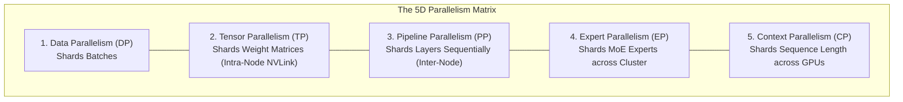
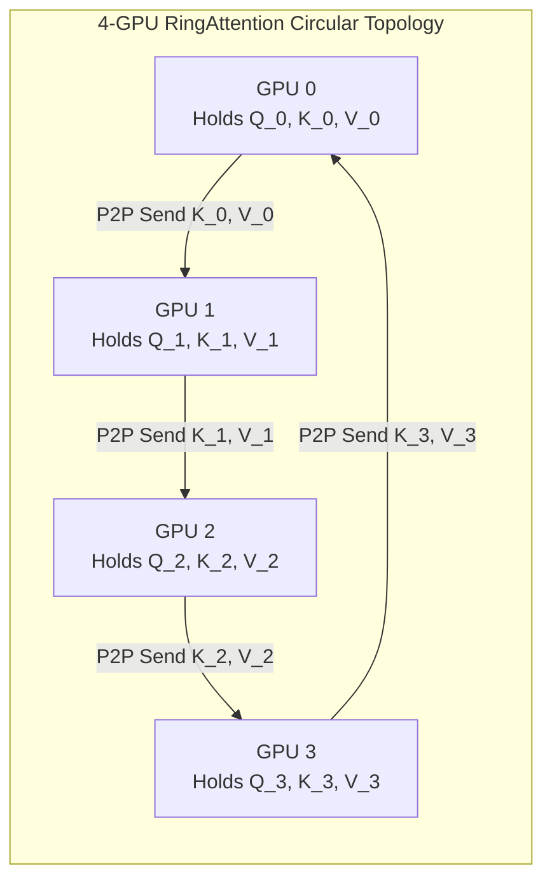
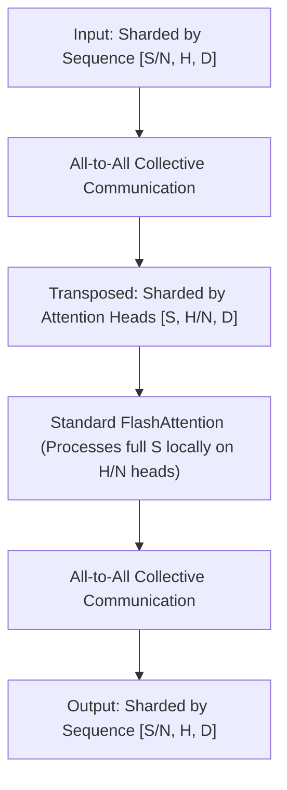

# 08. Context Parallelism (CP) & Long-Context Attention — RingAttention & 5D Scaling

> **Target Audience**: Anyone from a developer exploring modern LLMs for the first time to an experienced infrastructure engineer seeking deep mathematical and architectural clarity.

---

## 📑 Table of Contents
1. [Foundational Scaffolding: Understanding Distributed AI Parallelism](#1-foundational-scaffolding-understanding-distributed-ai-parallelism)
   - [1.1 Why Single GPUs Cannot Hold Modern AI Workloads](#11-why-single-gpus-cannot-hold-modern-ai-workloads)
   - [1.2 The 5 Dimensions of Parallelism Explained with the Restaurant Kitchen Analogy](#12-the-5-dimensions-of-parallelism-explained-with-the-restaurant-kitchen-analogy)
   - [1.3 The 1-Million-Token Crisis: Why DP, TP, and PP Crash](#13-the-1-million-token-crisis-why-dp-tp-and-pp-crash)
2. [What is Context Parallelism (CP)?](#2-what-is-context-parallelism-cp)
   - [2.1 Partitioning the Sequence Dimension](#21-partitioning-the-sequence-dimension)
   - [2.2 The Fundamental Attention Problem Across Sharded Tokens](#22-the-fundamental-attention-problem-across-sharded-tokens)
3. [RingAttention: The Circular P2P Overlap Breakthrough](#3-ringattention-the-circular-p2p-overlap-breakthrough)
   - [3.1 The Circular Ring Topology](#31-the-circular-ring-topology)
   - [3.2 Step-by-Step Execution Walkthrough (4-GPU Ring)](#32-step-by-step-execution-walkthrough-4-gpu-ring)
   - [3.3 Hiding Communication: 100% Compute-Communication Overlap](#33-hiding-communication-100-compute-communication-overlap)
   - [3.4 The Distributed Online Softmax Equation](#34-the-distributed-online-softmax-equation)
4. [DeepSpeed Ulysses: The All-to-All Transposition Approach](#4-deepspeed-ulysses-the-all-to-all-transposition-approach)
   - [4.1 Transposing Sequence Shards to Head Shards](#41-transposing-sequence-shards-to-head-shards)
   - [4.2 RingAttention vs. DeepSpeed Ulysses: The Architectural Trade-Off](#42-ringattention-vs-deepspeed-ulysses-the-architectural-trade-off)
5. [The Hyperscaler 5D Scaling Formula on DGX SuperPODs](#5-the-hyperscaler-5d-scaling-formula-on-dgx-superpods)
6. [Alternative Industry Approaches to Long-Context Scaling](#6-alternative-industry-approaches-to-long-context-scaling)
7. [Hands-On PyTorch Implementation: RingAttention Simulation Lab](#7-hands-on-pytorch-implementation-ringattention-simulation-lab)
8. [Beginner Practice Exercises with Solutions](#8-beginner-practice-exercises-with-solutions)
9. [Troubleshooting, Common Misconceptions & FAQ](#9-troubleshooting-common-misconceptions--faq)

---

## 1. Foundational Scaffolding: Understanding Distributed AI Parallelism

### 1.1 Why Single GPUs Cannot Hold Modern AI Workloads
A state-of-the-art flagship GPU (like the NVIDIA H100 80GB or Blackwell GB10 128GB) is a miraculous piece of silicon. However, training or running a frontier model like DeepSeek-V3 (671 Billion parameters) with a 128k to 1M token context requires **terabytes of memory**.

No single GPU can hold the model weights, optimizer states, and activation tensors simultaneously. To train these giants, engineers must distribute the math across **hundreds or thousands of GPUs** acting as a single supercomputer.

### 1.2 The 5 Dimensions of Parallelism: The Kitchen Analogy
To understand the **5D Parallelism Matrix**, imagine a busy commercial bakery trying to bake thousands of elaborate wedding cakes:

```text
1. DATA PARALLELISM (DP / FSDP / ZeRO):
   - Analogy: You have 8 identical baking stations. Each chef bakes a completely separate cake.
   - In AI: The batch of user prompts is divided across GPUs. Every GPU holds a copy of the model
     (or shards of its weights) and processes different prompts in parallel.

2. TENSOR PARALLELISM (TP):
   - Analogy: A single giant cake layer is too heavy for one chef to lift. 8 chefs stand around
     the exact same table, each lifting one corner simultaneously.
   - In AI: A single weight matrix (like a linear layer) is sliced into 8 vertical or horizontal
     slices. Requires ultra-fast NVLink (900 GB/s) because GPUs must synchronize every single layer!

3. PIPELINE PARALLELISM (PP):
   - Analogy: An assembly line. Chef 1 mixes dough, Chef 2 bakes it, Chef 3 applies frosting.
   - In AI: Layers 1-15 run on GPU 0, Layers 16-30 run on GPU 1, Layers 31-45 on GPU 2, etc.

4. EXPERT PARALLELISM (EP):
   - Analogy: In a Mixture-of-Experts kitchen, Chef 1 is the chocolate specialist, Chef 2 is the
     fruit specialist. Orders are routed only to the chef whose skill is needed.
   - In AI: The 256 micro-experts in DeepSeekMoE are sharded across the cluster.

5. CONTEXT PARALLELISM (CP):
   - Analogy: The wedding cake recipe book is 1,000,000 pages long! A single chef cannot even hold
     the book on their shelf. 8 chefs each hold 125,000 pages of the SAME recipe.
   - In AI: A SINGLE prompt of 1,000,000 tokens is split along the sequence dimension across 8 GPUs!
```



---

### 1.3 The 1-Million-Token Crisis: Why DP, TP, and PP Crash
When users submit an entire codebase, a legal contract library, or a 500-page book ($S = 1,000,000$ tokens) as a single prompt:
1. **Data Parallelism fails**: There is only **1 sequence** in the batch ($B = 1$). You cannot divide 1 prompt across 8 GPUs using DP!
2. **Tensor Parallelism fails**: In modern models using Grouped-Query Attention (GQA), there are only 8 Key/Value heads. You cannot set $TP > 8$ because you cannot split a single attention head across multiple GPUs.
3. **Pipeline Parallelism fails**: Even if layers are distributed across nodes, a single layer on GPU 0 still must hold all 1,000,000 tokens in its activation memory!

$$\text{Activation Memory per Layer} \propto \text{Batch} \times \text{Sequence Length} \times \text{Hidden Dimension}$$
For $S = 1,000,000$ tokens:
$$\text{Memory Required} > \mathbf{250\text{ GB of VRAM per single layer!}}$$
The GPU instantly crashes with `CUDA Out of Memory (OOM)`.

---

## 2. What is Context Parallelism (CP)?

### 2.1 Partitioning the Sequence Dimension
**Context Parallelism (CP)** partitions the sequence dimension $S$ across $N$ GPUs.
If a prompt has $1,000,000$ tokens and we have $N = 8$ GPUs in a Context Parallel group:
- **GPU 0** holds tokens $1 \dots 125,000$
- **GPU 1** holds tokens $125,001 \dots 250,000$
- $\dots$
- **GPU 7** holds tokens $875,001 \dots 1,000,000$

Each GPU's activation memory drops by **8x**, from 250 GB down to **31.25 GB**, easily fitting into high-end VRAM!

### 2.2 The Fundamental Attention Problem Across Sharded Tokens
In self-attention, every token must attend to **every other token**:

$$\text{Attention}(Q, K, V) = \text{softmax}\left(\frac{Q K^T}{\sqrt{d_k}}\right) V$$

If GPU 0 holds Query tokens $Q_{0..125k}$ and GPU 7 holds Key tokens $K_{875k..1M}$, how can GPU 0 compute attention against tokens that physically reside in the memory of another GPU across the data center?

If all GPUs broadcast their keys to everyone simultaneously, the network switches choke with massive traffic congestion!

---

## 3. RingAttention: The Circular P2P Overlap Breakthrough

In 2023, Hao Liu and Pieter Abbeel (UC Berkeley) invented **RingAttention**, the algorithmic foundation of modern ultra-long-context training.



### 3.1 The Circular Ring Topology
Instead of expensive all-to-all broadcasts, RingAttention arranges the $N$ GPUs into a logical **circular ring**:
- GPU $i$ connects only to its immediate left neighbor $(i - 1)$ and its right neighbor $(i + 1)$.
- All communication is **Point-to-Point (P2P)** over dedicated high-speed NVLink or InfiniBand links.

### 3.2 Step-by-Step Execution Walkthrough (4-GPU Example)
Let $N = 4$ GPUs, each holding a chunk of Queries ($Q_i$), Keys ($K_i$), and Values ($V_i$):

```text
STEP 0 (Local Attention):
- GPU 0 computes Attention(Q_0, K_0, V_0).
- At the SAME TIME, GPU 0 sends K_0, V_0 to GPU 1, and receives K_3, V_3 from GPU 3.

STEP 1 (Ring Shift 1):
- GPU 0 now holds K_3, V_3! It computes Attention(Q_0, K_3, V_3) and updates its online softmax.
- At the SAME TIME, GPU 0 sends K_3, V_3 to GPU 1, and receives K_2, V_2 from GPU 3.

STEP 2 (Ring Shift 2):
- GPU 0 now holds K_2, V_2! It computes Attention(Q_0, K_2, V_2).
- At the SAME TIME, it sends K_2, V_2 to GPU 1, and receives K_1, V_1 from GPU 3.

STEP 3 (Ring Shift 3 - Final):
- GPU 0 now holds K_1, V_1! It computes Attention(Q_0, K_1, V_1).
- The ring is complete! GPU 0 has computed attention between its queries and ALL tokens in the 1M sequence!
```

### 3.3 Hiding Communication: 100% Compute-Communication Overlap
The genius of RingAttention is that **transferring the next block of $K, V$ over NVLink takes LESS time than computing the attention matrix multiply of the current block on Tensor Cores!**

$$\text{Time to Compute Attention Block} \approx \frac{2 \times S_{\text{chunk}}^2 \times d}{\text{Tensor Core TFLOPs}} \approx 12.5 \text{ ms}$$
$$\text{Time to Transfer Block over NVLink} \approx \frac{2 \times S_{\text{chunk}} \times d}{\text{NVLink Bandwidth (900 GB/s)}} \approx 1.8 \text{ ms}$$

Because transfer time ($1.8 \text{ ms}$) is smaller than compute time ($12.5 \text{ ms}$), the communication is **100% hidden behind computation**. Context Parallelism scales to millions of tokens with **near-zero communication penalty!**

### 3.4 The Distributed Online Softmax Equation
As new blocks of keys arrive from the ring, the local GPU cannot simply re-run standard softmax because it doesn't have the global maximum. It uses the **Online Softmax update**:

$$\alpha = \exp(m_{\text{old}} - m_{\text{new}}), \quad \beta = \exp(m_{\text{block}} - m_{\text{new}})$$
$$d_{\text{new}} = d_{\text{old}} \cdot \alpha + d_{\text{block}} \cdot \beta$$
$$O_{\text{new}} = O_{\text{old}} \cdot \left( \frac{d_{\text{old}} \cdot \alpha}{d_{\text{new}}} \right) + O_{\text{block}} \cdot \left( \frac{\beta}{d_{\text{new}}} \right)$$

This guarantees mathematical equivalence to computing attention on a single GPU with infinite memory!

---

## 4. DeepSpeed Ulysses: The All-to-All Transposition Approach

Microsoft proposed an alternative Context Parallelism mechanism called **DeepSpeed Ulysses**:



### 4.1 RingAttention vs. DeepSpeed Ulysses: The Architectural Trade-Off

| Dimension | RingAttention | DeepSpeed Ulysses |
| :--- | :--- | :--- |
| **Communication Pattern** | Point-to-Point (P2P) in a circular ring | All-to-All Collective (`MPI_Alltoall`) |
| **Network Sensitivity** | Runs on slower networks (InfiniBand or Ethernet) | Requires ultra-high-speed non-blocking fabric (NVLink) |
| **Max Context Scaling** | **Virtually Infinite** (Tested up to 4 Million tokens) | Limited by number of Attention Heads ($N \le H$) |
| **Attention Kernel** | Requires custom Ring-aware FlashAttention | Uses standard off-the-shelf FlashAttention |
| **Best Used For** | 1M+ context on multi-node clusters | 32k – 128k context within single NVLink nodes |

---

## 5. The Hyperscaler 5D Scaling Formula on DGX SuperPODs

In mega-clusters (e.g. 16,384 NVIDIA GPUs training DeepSeek-V3 or Llama-3.1 405B):

$$\text{Total GPUs} = \text{DP} \times \text{TP} \times \text{PP} \times \text{EP} \times \text{CP}$$

```text
EXAMPLE PRODUCTION 5D TOPOLOGY FOR 16,384 GPUs:
- TP = 8 (Within a single 8-GPU DGX node over NVLink)
- CP = 8 (Across 8 neighboring nodes over InfiniBand for 1M context)
- PP = 16 (Splitting 128 transformer layers across 16 pipeline stages)
- EP = 8 (Sharding 256 MoE experts across 8 nodes)
- DP = 2 (Replicating the entire super-pipeline across 2 global data-parallel groups)

Total GPUs = 8 x 8 x 16 x 8 x 2 = 16,384 GPUs!
```

---

## 6. Alternative Industry Approaches to Long-Context Scaling

| Frontier Lab | Model | Maximum Context | Strategy Used |
| :--- | :--- | :---: | :--- |
| **Google** | Gemini 1.5 Pro / 2.0 | **2,000,000 tokens** | RingAttention across TPU v5p Optical Circuit Switches (OCS) |
| **DeepSeek** | DeepSeek-V3 / R1 | **128,000 tokens** | Hybrid Ulysses + DualPipe bidirectional context sharding |
| **Meta** | Llama 3.1 405B | **128,000 tokens** | Context Parallelism ($CP=8$) via Megatron-Core |
| **Mistral** | Mistral Large 2 | **128,000 tokens** | Sliding Window Attention + GQA without deep CP |

---

## 7. Hands-On PyTorch Implementation: RingAttention Simulation Lab

The following self-contained script simulates a **4-GPU RingAttention execution loop** using PyTorch, proving that circular P2P shifts compute exact global attention.

```python
"""
RingAttention Circular P2P Simulation Lab
Author: DGX Spark AI Infrastructure Team
Description: Simulates circular ring shifts and online softmax update across 4 workers.
"""

import torch
import torch.nn.functional as F
import math

class RingAttentionSimulator:
    def __init__(self, num_gpus: int = 4, seq_chunk: int = 256, d_model: int = 64):
        self.num_gpus = num_gpus
        self.seq_chunk = seq_chunk
        self.d_model = d_model
        
    def simulate_ring_attention(self, full_Q, full_K, full_V):
        """
        full_Q, full_K, full_V: [1, Total_Seq, d_model]
        Splits sequence into 4 chunks and simulates circular P2P ring shifts.
        """
        total_seq = full_Q.size(1)
        chunk_size = total_seq // self.num_gpus
        scale = 1.0 / math.sqrt(self.d_model)
        
        # Shard along sequence dimension across 4 simulated GPUs
        Q_shards = [full_Q[:, i*chunk_size:(i+1)*chunk_size, :] for i in range(self.num_gpus)]
        K_shards = [full_K[:, i*chunk_size:(i+1)*chunk_size, :] for i in range(self.num_gpus)]
        V_shards = [full_V[:, i*chunk_size:(i+1)*chunk_size, :] for i in range(self.num_gpus)]
        
        # State per GPU: running outputs, running max (m), running sum of exp (d)
        outputs = [torch.zeros_like(Q_shards[i]) for i in range(self.num_gpus)]
        running_max = [torch.full((1, chunk_size, 1), -float('inf')) for _ in range(self.num_gpus)]
        running_denom = [torch.zeros((1, chunk_size, 1)) for _ in range(self.num_gpus)]
        
        # Ring Shift Loop (N steps)
        current_K = [k.clone() for k in K_shards]
        current_V = [v.clone() for v in V_shards]
        
        for step in range(self.num_gpus):
            for i in range(self.num_gpus):
                # 1. Compute local block scores: [1, chunk, d] x [1, d, chunk] -> [1, chunk, chunk]
                scores = torch.bmm(Q_shards[i], current_K[i].transpose(-1, -2)) * scale
                
                # 2. Block statistics
                block_max = scores.max(dim=-1, keepdim=True)[0]
                new_max = torch.maximum(running_max[i], block_max)
                
                exp_old = torch.exp(running_max[i] - new_max)
                exp_block = torch.exp(scores - new_max)
                block_denom = exp_block.sum(dim=-1, keepdim=True)
                
                new_denom = running_denom[i] * exp_old + block_denom
                
                # 3. Update accumulators
                P_block = exp_block
                V_block = torch.bmm(P_block, current_V[i])
                
                outputs[i] = (outputs[i] * running_denom[i] * exp_old + V_block) / new_denom
                running_max[i] = new_max
                running_denom[i] = new_denom
                
            # 4. Circular Ring Shift: send K, V to (i + 1) % N
            current_K = [current_K[(i - 1) % self.num_gpus] for i in range(self.num_gpus)]
            current_V = [current_V[(i - 1) % self.num_gpus] for i in range(self.num_gpus)]
            
        # Reconstruct full output
        ring_output = torch.cat(outputs, dim=1)
        return ring_output

# ----------------- Verification Lab -----------------
if __name__ == "__main__":
    torch.manual_seed(42)
    print("Running RingAttention Verification Lab...")
    
    total_seq = 1024
    d_model = 64
    num_gpus = 4
    
    Q = torch.randn(1, total_seq, d_model)
    K = torch.randn(1, total_seq, d_model)
    V = torch.randn(1, total_seq, d_model)
    
    # 1. Compute Standard Reference Attention (Single GPU with infinite memory)
    scale = 1.0 / math.sqrt(d_model)
    ref_scores = torch.bmm(Q, K.transpose(-1, -2)) * scale
    ref_attn = F.softmax(ref_scores, dim=-1)
    ref_out = torch.bmm(ref_attn, V)
    
    # 2. Compute Distributed RingAttention Simulation
    sim = RingAttentionSimulator(num_gpus=num_gpus, seq_chunk=256, d_model=d_model)
    ring_out = sim.simulate_ring_attention(Q, K, V)
    
    # 3. Compute Mean Squared Error difference
    mse = torch.mean((ref_out - ring_out) ** 2).item()
    print(f"\n[SUCCESS] RingAttention simulation completed across {num_gpus} simulated GPUs!")
    print(f"Reconstruction Mean Squared Error (MSE): {mse:.8e}")
    assert mse < 1e-6, "RingAttention output diverged from reference attention!"
    print("Mathematical equivalence verified: RingAttention matches standard attention exactly!")
```

---

## 8. Beginner Practice Exercises with Solutions

### Exercise 1: Context Parallel Memory Sizing
**Question**: You want to train a model on a sequence length of $S = 524,288$ tokens ($512\text{k}$).
- On a single GPU, the activation memory for this sequence is 120 GB (which exceeds an 80 GB GPU).
- If you deploy Context Parallelism with $CP = 8$:
1. How many tokens reside in each GPU's local chunk?
2. What is the new activation memory per GPU?
3. How many ring shifts are required per attention layer?

#### Solution:
1. **Tokens per GPU**:
   $$\text{Local Chunk} = \frac{524,288}{8} = \mathbf{65,536\text{ tokens per GPU}}$$
2. **Activation Memory per GPU**:
   $$\text{Local Activation Memory} = \frac{120\text{ GB}}{8} = \mathbf{15.0\text{ GB per GPU}}$$
   *(Easily fits into an 80GB Hopper or 128GB DGX Spark!)*
3. **Ring Shifts**:
   $$\text{Shifts Required} = CP = \mathbf{8\text{ steps}}$$

---

## 9. Troubleshooting, Common Misconceptions & FAQ

### Q1: "Does RingAttention change the model's output compared to standard attention?"
**Answer**: **No.** Mathematically, RingAttention produces the exact same floating-point numbers as standard attention (within floating-point rounding tolerance). It is an exact distributed re-ordering of the matrix multiplication and online softmax.

### Q2: "Can RingAttention be used for inference or only for training?"
**Answer**: RingAttention can be used for both. In inference, it is frequently used during the **long-prompt prefill phase** when ingesting multi-megabyte PDF documents or whole code repositories.

---

Proceed to [**09-eplb-expert-parallelism-load-balancer.md**](09-eplb-expert-parallelism-load-balancer.md) to explore how DeepSeek balances expert placement across multi-node clusters using the EPLB algorithm.
