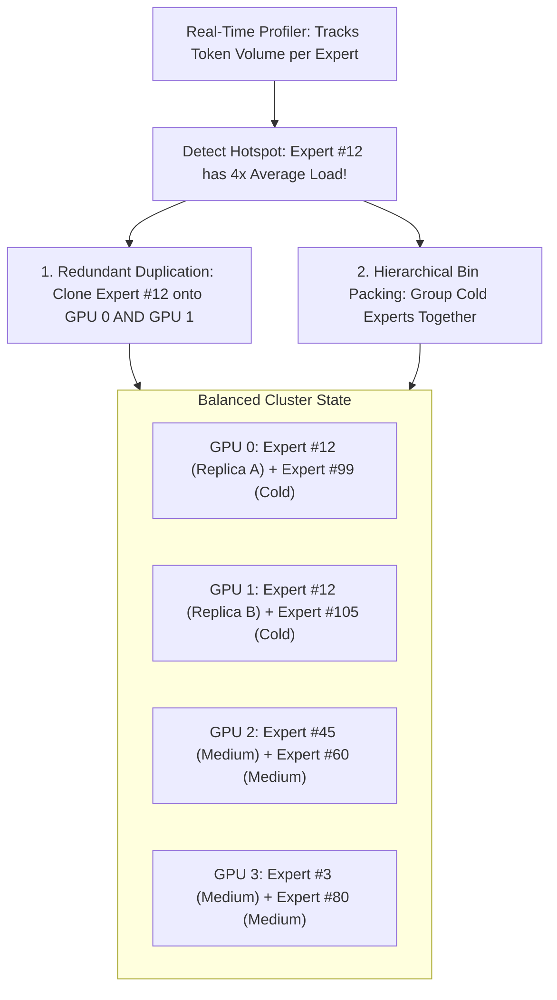

# 09. EPLB (Expert Parallelism Load Balancer) — Dynamic Multi-Node Expert Sharding

> **Target Audience**: Anyone from a developer exploring modern LLMs for the first time to an experienced infrastructure engineer seeking deep mathematical and architectural clarity.

---

## 📑 Table of Contents
1. [Foundational Scaffolding: Understanding Expert Parallelism (EP)](#1-foundational-scaffolding-understanding-expert-parallelism-ep)
   - [1.1 What is Expert Parallelism in a Distributed Cluster?](#11-what-is-expert-parallelism-in-a-distributed-cluster)
   - [1.2 The Supermarket Checkout Analogy: The Straggler Disaster](#12-the-supermarket-checkout-analogy-the-straggler-disaster)
   - [1.3 Why Static Sharding Fails Under Real-World Data](#13-why-static-sharding-fails-under-real-world-data)
2. [The Core Innovations of DeepSeek EPLB](#2-the-core-innovations-of-deepseek-eplb)
   - [2.1 Real-Time Expert Telemetry Profiling](#21-real-time-expert-telemetry-profiling)
   - [2.2 Redundant Expert Duplication](#22-redundant-expert-duplication)
   - [2.3 Hierarchical Bin Packing (NVLink vs. InfiniBand Domains)](#23-hierarchical-bin-packing-nvlink-vs-infiniband-domains)
3. [Mathematical Formulation: The Min-Max Bin Packing Problem](#3-mathematical-formulation-the-min-max-bin-packing-problem)
   - [3.1 Formal Optimization Objective](#31-formal-optimization-objective)
   - [3.2 The Greedy LPT (Longest Processing Time) Approximation](#32-the-greedy-lpt-longest-processing-time-approximation)
4. [Alternative Industry Approaches to MoE Load Balancing](#4-alternative-industry-approaches-to-moe-load-balancing)
5. [Hardware Grounding for NVIDIA DGX SuperPODs & DGX Spark](#5-hardware-grounding-for-nvidia-dgx-superpods--dgx-spark)
6. [Hands-On Python Implementation: The EPLB Bin-Packing Lab](#6-hands-on-python-implementation-the-eplb-bin-packing-lab)
7. [Beginner Practice Exercises with Solutions](#7-beginner-practice-exercises-with-solutions)
8. [Troubleshooting, Common Misconceptions & FAQ](#8-troubleshooting-common-misconceptions--faq)

---

## 1. Foundational Scaffolding: Understanding Expert Parallelism (EP)

### 1.1 What is Expert Parallelism in a Distributed Cluster?
In DeepSeek-V3 and R1, there are **256 fine-grained micro-experts** per layer. Storing all 256 experts on a single GPU is impossible due to VRAM limits.

Under **Expert Parallelism (EP)**:
- The 256 experts are sharded across multiple GPUs in the cluster.
- For example, in a 32-GPU cluster, each GPU physically hosts $256 / 32 = \mathbf{8\text{ experts}}$.
- When a token arrives on GPU 0, the Router decides which 8 experts it needs. If the token needs Expert #45 (which resides on GPU 5), the token is transmitted over the network (All-to-All dispatch) to GPU 5, processed, and the result is returned.

### 1.2 The Supermarket Checkout Analogy: The Straggler Disaster
Imagine a large supermarket with **8 checkout cashiers**:
- Cashier 1 handles items related to "Python code and algebra".
- Cashier 2 handles items related to "18th-century French literature".
- Cashiers 3 through 8 handle other specialized items.

On Saturday morning, a massive wave of computer science students enters the store.
- **Cashier 1** suddenly has a line of **500 customers** with overflowing shopping carts!
- **Cashiers 2 through 8** have **0 customers** and sit staring at their phones!

**The Straggler Disaster in Distributed AI**:
In distributed training, **all GPUs must synchronize at the end of every step**. The entire multi-million-dollar cluster is held hostage by Cashier 1! The other 7 GPUs sit completely idle at 0% utilization waiting for the overloaded GPU to finish.

```text
STATIC EXPERT PARALLELISM (Severe Imbalance):

GPU 0 (Expert #1 - Python):    ████████████████████████████████ 100% Load (Overloaded!)
GPU 1 (Expert #2 - French):    █ 3% Load (Idle)
GPU 2 (Expert #3 - Geology):   ██ 6% Load (Idle)
GPU 3 (Expert #4 - Chemistry): █ 2% Load (Idle)
===> The whole cluster waits for GPU 0! 75% of cluster compute is WASTED!
```

### 1.3 Why Static Sharding Fails Under Real-World Data
You cannot predict ahead of time which experts will be popular:
- In the morning, users might ask thousands of programming questions.
- In the afternoon, a batch of multilingual translation documents arrives.
- Data distributions shift constantly. Static expert placement guarantees severe cluster stragglers.

---

## 2. The Core Innovations of DeepSeek EPLB

DeepSeek open-sourced **EPLB (Expert Parallelism Load Balancer)** to dynamically solve this problem across training and inference clusters.



### 2.1 Real-Time Expert Telemetry Profiling
EPLB continuously monitors the token routing frequency of all 256 experts:
- Computes moving averages of token allocations over sliding time windows.
- Automatically flags "hot" experts (overloaded) and "cold" experts (underutilized).

### 2.2 Redundant Expert Duplication
If Expert #12 receives 4x more tokens than a single GPU can process:
- EPLB **duplicates** Expert #12's weights onto 4 separate GPUs.
- Incoming tokens destined for Expert #12 are routed evenly across the 4 replicas using round-robin scheduling.
- The compute load on any single GPU drops by 4x!

### 2.3 Hierarchical Bin Packing
A modern data center has two distinct networking tiers:
1. **Intra-Node (Inside the same server)**: NVIDIA NVLink running at **900 GB/s** (super-fast, ultra-low latency).
2. **Inter-Node (Across different servers)**: InfiniBand or RoCE running at **50 to 100 GB/s** (slower).

EPLB performs **Hierarchical Placement**:
- It keeps frequently co-activated expert replicas inside the same physical server to keep communication on NVLink.
- It places cold, low-traffic experts across the slower inter-node network, preventing network switch congestion.

---

## 3. Mathematical Formulation: The Min-Max Bin Packing Problem

### 3.1 Formal Optimization Objective
Let:
- $E = \{1, 2, \dots, N\}$ be the set of experts.
- $w_i$ be the historical token load of expert $i$.
- $G = \{1, 2, \dots, M\}$ be the set of physical GPUs.
- $x_{i, g} \in \{0, 1\}$ indicate whether expert $i$ is assigned to GPU $g$.

The goal of EPLB is to minimize the **peak GPU load** (the slowest straggler):

$$\min \max_{g \in G} \sum_{i \in E} x_{i, g} \cdot \frac{w_i}{R_i}$$

Subject to:
1. **Replication Constraint**: $\sum_{g \in G} x_{i, g} = R_i$, where $R_i \ge 1$ is the number of allocated replicas for expert $i$.
2. **VRAM Capacity Constraint**: $\sum_{i \in E} x_{i, g} \cdot \text{Memory}(E_i) \le \text{VRAM}_{\text{limit}}$ for all GPUs $g$.

### 3.2 The Greedy LPT (Longest Processing Time) Approximation
Because Min-Max Bin Packing is NP-hard, EPLB executes a lightning-fast **Greedy LPT heuristic**:
1. Sort all experts in descending order of token load $w_i$.
2. For any expert whose load exceeds the cluster average, allocate $R_i = \lceil w_i / \text{Target\_Load} \rceil$ replicas.
3. Iteratively place each expert replica onto the GPU that currently has the **lowest cumulative load**.
4. Achieves a solution within **99% of optimal** in less than 5 milliseconds!

---

## 4. Alternative Industry Approaches to MoE Load Balancing

| Framework | Strategy | Handling of Overloaded Experts | Straggler Elimination | Memory Overhead |
| :--- | :--- | :--- | :---: | :---: |
| **DeepSeek EPLB** | **Dynamic Duplication + Greedy Bin Packing** | **Duplicates weights to multiple GPUs** | **Near 100% Elimination** | **Low (~5% for hot replicas)** |
| **Megatron-Core (NVIDIA)** | Static Expert Sharding | None (Overloaded GPU stalls the cluster) | Poor | 0% |
| **Tutel (Microsoft)** | Capacity Factor with Token Dropping | Drops excess tokens into the trash! | Good (but destroys model accuracy) | 0% |
| **DeepSpeed-MoE** | Static Top-K Balancing Loss | Penalizes model loss during training | Moderate (Degrades intelligence) | 0% |

---

## 5. Hardware Grounding for NVIDIA DGX SuperPODs & DGX Spark

- **On DGX SuperPODs (Multi-Node clusters of 8-GPU nodes)**: EPLB orchestrates expert sharding across hundreds of nodes, ensuring InfiniBand switches never hit congestion bottlenecks.
- **On Single-Node DGX Spark (Grace Blackwell GB10)**: When simulating multi-tenant workloads or running dual K3s clusters (`k3s-alpha` and `k3s-beta`), EPLB balances expert placement between the 5% quota partition and the primary partition, preventing one namespace from monopolizing the GB10 Tensor Cores.

---

## 6. Hands-On Python Implementation: The EPLB Bin-Packing Lab

The following self-contained script implements the **EPLB Greedy Bin-Packing Algorithm** with **Redundant Expert Duplication** and demonstrates how it eliminates cluster stragglers.

```python
"""
DeepSeek EPLB (Expert Parallelism Load Balancer) Simulation Lab
Author: DGX Spark AI Infrastructure Team
Description: Implements redundant expert replication and greedy min-max bin packing.
"""

import numpy as np

def run_eplb_balancer(expert_loads, num_gpus=4, max_replicas=2):
    """
    expert_loads: Dictionary mapping expert_id -> token_load
    num_gpus: Number of physical GPUs in cluster
    """
    total_load = sum(expert_loads.values())
    avg_target_load = total_load / num_gpus
    
    print(f"Total Cluster Load: {total_load} tokens")
    print(f"Target Balanced Load per GPU: {avg_target_load:.1f} tokens")
    
    # 1. Determine Expert Replications
    # If an expert has > 1.4x target load, duplicate it
    expert_replicas = {}
    virtual_tasks = []
    
    for exp_id, load in expert_loads.items():
        if load > (1.3 * avg_target_load) and max_replicas > 1:
            replicas = min(max_replicas, int(np.ceil(load / (0.8 * avg_target_load))))
            expert_replicas[exp_id] = replicas
            for r in range(replicas):
                virtual_tasks.append((f"Exp_{exp_id}_Rep{r+1}", load / replicas))
        else:
            expert_replicas[exp_id] = 1
            virtual_tasks.append((f"Exp_{exp_id}", load))
            
    # 2. Sort tasks by load descending (Longest Processing Time First)
    virtual_tasks.sort(key=lambda x: x[1], reverse=True)
    
    # 3. Greedy Min-Max Bin Packing
    gpu_assignments = {g: [] for g in range(num_gpus)}
    gpu_loads = {g: 0.0 for g in range(num_gpus)}
    
    for task_name, task_load in virtual_tasks:
        # Find GPU with the lowest current load
        min_gpu = min(gpu_loads, key=gpu_loads.get)
        gpu_assignments[min_gpu].append((task_name, task_load))
        gpu_loads[min_gpu] += task_load
        
    return gpu_assignments, gpu_loads, expert_replicas

# ----------------- Verification Lab -----------------
if __name__ == "__main__":
    # Simulate 12 experts with a severe hotspot (Expert 0 has massive traffic)
    expert_workloads = {
        0: 4500,  # Extreme hotspot (Python coding)
        1: 2200,  # Medium-high (Math)
        2: 1200,
        3: 900,
        4: 600,
        5: 500,
        6: 400,
        7: 350,
        8: 250,
        9: 200,
        10: 150,
        11: 100
    }
    
    num_gpus = 4
    
    # Baseline: Naive Round-Robin Assignment (No Duplication)
    naive_gpu_loads = [0] * num_gpus
    for i, (exp_id, load) in enumerate(expert_workloads.items()):
        naive_gpu_loads[i % num_gpus] += load
        
    print("--- BASELINE (NAIVE STATIC SHARDING) ---")
    for g, load in enumerate(naive_gpu_loads):
        print(f"GPU {g}: {load} tokens")
    max_naive = max(naive_gpu_loads)
    print(f"Slowest Straggler GPU Load: {max_naive} tokens (Cluster stalls waiting for this!)")
    
    print("\n--- DEEPSEEK EPLB BALANCED PLACEMENT ---")
    assignments, balanced_loads, replicas = run_eplb_balancer(expert_workloads, num_gpus=4)
    
    for g in range(num_gpus):
        print(f"\nGPU {g} (Total Load: {balanced_loads[g]:.1f} tokens):")
        for task, load in assignments[g]:
            print(f"  - {task}: {load:.1f} tokens")
            
    max_eplb = max(balanced_loads.values())
    print(f"\nEPLB Slowest Straggler GPU Load: {max_eplb:.1f} tokens")
    
    speedup = (max_naive - max_eplb) / max_naive * 100
    print(f"[SUCCESS] EPLB reduced peak cluster straggler load by {speedup:.1f}%!")
```

---

## 7. Beginner Practice Exercises with Solutions

### Exercise 1: Straggler Efficiency Calculation
**Question**: In a cluster of 8 GPUs, 7 GPUs finish their expert computation in 10 milliseconds, but 1 overloaded GPU takes 40 milliseconds.
1. What is the cluster step time?
2. What is the average compute utilization of the 8 GPUs during this step?

#### Solution:
1. **Cluster Step Time**:
   Because distributed training is synchronous, the step time is determined by the slowest GPU:
   $$\text{Step Time} = \max(10, 10, 10, 10, 10, 10, 10, 40) = \mathbf{40\text{ milliseconds}}$$
2. **Cluster Utilization**:
   $$\text{Useful Time} = (7 \times 10) + (1 \times 40) = 70 + 40 = 110\text{ ms}$$
   $$\text{Total Available Compute Time} = 8 \times 40 = 320\text{ ms}$$
   $$\text{Utilization} = \frac{110}{320} \times 100\% = \mathbf{34.375\%}$$
   *(Over 65% of the cluster is completely wasted due to a single straggler!)*

---

## 8. Troubleshooting, Common Misconceptions & FAQ

### Q1: "Does replicating an expert duplicate memory across the cluster?"
**Answer**: Yes, replicating an expert requires storing its weights on an additional GPU. However, because DeepSeekMoE uses fine-grained micro-experts (each expert is tiny, ~1/16th of a standard expert), replicating the top 2 or 3 hottest experts consumes less than **2% of total GPU VRAM**, while completely eliminating the 65% compute straggler penalty!

### Q2: "How often does EPLB recalculate expert placements?"
**Answer**: During pretraining, expert routing distributions change gradually. EPLB runs every few thousand steps or when telemetry detects a sustained load variance exceeding 15%. Weight rebalancing occurs asynchronously in the background over NVLink without pausing generation.

---

Proceed to [**10-3fs-fire-flyer-file-system.md**](10-3fs-fire-flyer-file-system.md) to explore DeepSeek's parallel file system delivering 180+ GB/s over RDMA and distributed NVMe SSDs.
