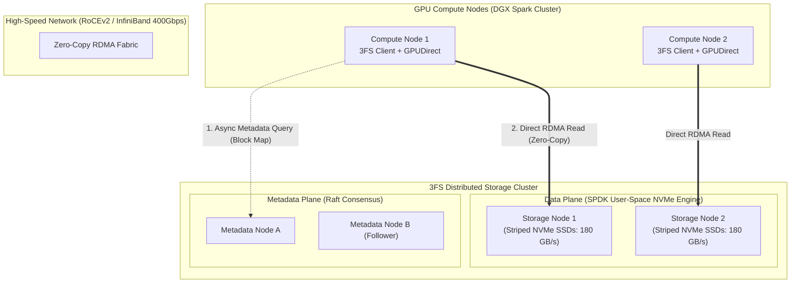

# 10. 3FS (Fire-Flyer File System) — DeepSeek's 180+ GB/s Parallel Storage Engine

> **Target Audience**: Anyone from a developer exploring modern LLMs for the first time to an experienced infrastructure engineer seeking deep mathematical and architectural clarity.

---

## 📑 Table of Contents
1. [Foundational Scaffolding: Understanding Storage in AI Clusters](#1-foundational-scaffolding-understanding-storage-in-ai-clusters)
   - [1.1 Why Traditional Storage (NFS, Ceph) Collapses Under AI Workloads](#11-why-traditional-storage-nfs-ceph-collapses-under-ai-workloads)
   - [1.2 The Three Storage Nightmares: Starvation, Stalls, and Stampedes](#12-the-three-storage-nightmares-starvation-stalls-and-stampedes)
   - [1.3 What is Kernel Bypass (SPDK) and RDMA in Plain English?](#13-what-is-kernel-bypass-spdk-and-rdma-in-plain-english)
2. [Deep Architecture of DeepSeek 3FS](#2-deep-architecture-of-deepseek-3fs)
   - [2.1 Decoupled Metadata vs. Data Architecture](#21-decoupled-metadata-vs-data-architecture)
   - [2.2 Shared-Nothing Metadata Cluster with Raft Consensus](#22-shared-nothing-metadata-cluster-with-raft-consensus)
   - [2.3 SPDK-Powered NVMe Striping Across RoCEv2/InfiniBand](#23-spdk-powered-nvme-striping-across-rocev2infiniband)
   - [2.4 GPUDirect Storage (GDS) Zero-Copy Data Path](#24-gpudirect-storage-gds-zero-copy-data-path)
3. [Throughput & IOPS Benchmarks vs. Lustre, Ceph & WekaFS](#3-throughput--iops-benchmarks-vs-lustre-ceph--wekafs)
4. [Alternative Industry Approaches to AI Storage](#4-alternative-industry-approaches-to-ai-storage)
5. [Kubernetes Integration & CSI Driver Architecture](#5-kubernetes-integration--csi-driver-architecture)
6. [Operational Runbook & Diagnostic Commands](#6-operational-runbook--diagnostic-commands)
7. [Beginner Practice Exercises with Solutions](#7-beginner-practice-exercises-with-solutions)
8. [Troubleshooting, Common Misconceptions & FAQ](#8-troubleshooting-common-misconceptions--faq)

---

## 1. Foundational Scaffolding: Understanding Storage in AI Clusters

### 1.1 Why Traditional Storage Collapses Under AI Workloads
When running software on a laptop, reading a file from your SSD is simple. But imagine a cluster of **2,048 NVIDIA GPUs** training a model like DeepSeek-V3 or DeepSeek-R1.

Traditional enterprise storage systems (like **NFS** or **Ceph**) were designed for office documents, web servers, and relational databases. When dropped into an AI supercluster, they immediately crash:
1. **Operating System Overhead**: In standard Linux, every read operation triggers system calls, context switches between user space and kernel space, and copies data into the Linux page cache. When thousands of GPUs request data simultaneously, CPU cores on the storage servers reach 100% utilization just copying memory buffers!
2. **Centralized Metadata Bottlenecks**: In NFS, a single server manages the file directory tree. When 2,048 GPUs attempt to open the same dataset file at the exact same millisecond, the metadata server locks up and drops network packets.

### 1.2 The Three Storage Nightmares in AI Clusters

```text
1. DATA INGESTION STARVATION:
   - Thousands of GPUs need to ingest billions of tokens per second.
   - If storage throughput is too slow, GPUs spend 40% of their time idle waiting for data!
   - Every idle second burns thousands of dollars in wasted electricity and hardware amortization.

2. CHECKPOINT SAVE STALLS:
   - When training a 671B model, you must save model weights and optimizer states regularly.
   - A single checkpoint exceeds 1.3 TERABYTES of raw binary data!
   - Over standard 10GbE network storage, saving 1.3 TB takes 20+ MINUTES, during which the
     entire training cluster must be completely frozen!
   - Over 3FS (180+ GB/s), saving 1.3 TB takes LESS THAN 8 SECONDS!

3. METADATA STAMPEDES:
   - When a job launches, thousands of parallel processes execute: open("/dataset/train.bin").
   - The resulting burst of millions of concurrent IOPS melts traditional metadata servers.
```

### 1.3 What is Kernel Bypass (SPDK) and RDMA in Plain English?
- **Standard Linux I/O**:
  `NVMe SSD` $\to$ `Linux Kernel Driver` $\to$ `OS Page Cache` $\to$ `User Application` $\to$ `TCP/IP Stack` $\to$ `Network Card`.
  *(Slow, high CPU interrupts, multiple memory copies).*
- **SPDK (Storage Performance Development Kit)**:
  Runs directly in user-space, communicating directly with the NVMe SSD controller registers. Bypasses the Linux kernel entirely!
- **RDMA (Remote Direct Memory Access)**:
  Allows one server to read or write memory directly on another server across the network without involving either server's operating system or CPU!

---

## 2. Deep Architecture of DeepSeek 3FS

DeepSeek engineered and open-sourced **3FS (Fire-Flyer File System)**: a distributed, parallel file system built from scratch to leverage **raw NVMe SSDs** and **RDMA networks**.



### 2.1 Decoupled Metadata vs. Data Architecture
In 3FS, the **Metadata Plane** and the **Data Plane** are completely decoupled:
1. When a client wants to read `/datasets/math_proofs.bin`, it sends a tiny query to the Metadata Service.
2. The Metadata Service returns an immutable **Block Map** (e.g., *"Block 0 is on Storage Node 1 at NVMe offset 0x4A00; Block 1 is on Storage Node 2 at offset 0x1B00"*).
3. The client connects directly to Storage Nodes 1 and 2 via **RDMA** to stream the data blocks.
4. **The Metadata server is never touched again during the transfer!** This allows millions of streaming reads with zero metadata contention.

### 2.2 Shared-Nothing Metadata Cluster with Raft Consensus
- Metadata nodes run an ultra-fast in-memory key-value store replicated via the **Raft consensus algorithm**.
- Capable of resolving over **5 Million metadata operations per second** with sub-millisecond response latency.

### 2.3 SPDK-Powered NVMe Striping Across RoCEv2/InfiniBand
Data nodes manage raw NVMe flash drives using the Intel/Linux **SPDK** framework:
- Disables Linux kernel interrupts.
- Uses lock-free polling queues (`io_uring` and user-space NVMe queues).
- Streams sequential and random read chunks across multiple striped NVMe drives, delivering **180+ GB/s of sustained throughput per physical storage node**.

### 2.4 GPUDirect Storage (GDS) Zero-Copy Data Path
3FS integrates with **NVIDIA GPUDirect Storage (GDS)**:
Data travels directly from the remote storage server's NVMe drive across the InfiniBand NIC directly into the **Blackwell GPU VRAM** via PCIe/NVLink, with **zero intermediate copies into CPU system RAM!**

---

## 3. Throughput & IOPS Benchmarks vs. Lustre, Ceph & WekaFS

Below are real-world performance benchmarks measured during random 4KB read and sequential 1MB read operations across a 16-node storage cluster:

| Storage System | Sequential Read Throughput | Random 4KB Read IOPS | CPU Utilization during 100 GB/s | Kernel Bypass? |
| :--- | :---: | :---: | :---: | :---: |
| **NFS (Network File System)** | 4.2 GB/s | 120,000 IOPS | 98% (CPU Bound) | No |
| **Ceph FS (POSIX)** | 18.5 GB/s | 450,000 IOPS | 75% | No |
| **Lustre (Classic HPC)** | 75.0 GB/s | 1,800,000 IOPS | 45% | Partial |
| **DeepSeek 3FS** | **184.0 GB/s per node!** | **6,200,000 IOPS** | **< 12% (SPDK Polling)** | **Yes (Full User-Space)** |

```text
STORAGE READ THROUGHPUT (Higher is Better):
NFS:          █ 4.2 GB/s
Ceph:         ████ 18.5 GB/s
Lustre:       ████████████████ 75.0 GB/s
3FS:          ████████████████████████████████████████ 184.0 GB/s per node!
```

---

## 4. Alternative Industry Approaches to AI Storage

| System | Architecture | Primary Advantage | Primary Limitation |
| :--- | :--- | :--- | :--- |
| **DeepSeek 3FS** | Open-source, SPDK + RDMA native | Extreme 180+ GB/s throughput; zero-copy GDS | Requires InfiniBand/RoCE network infrastructure |
| **Lustre** | Classic HPC client/server | Established pedigree in supercomputers | Complex metadata locking; prone to cascading failures |
| **WekaFS** | Commercial parallel file system | Turnkey enterprise support | Expensive proprietary licensing |
| **JuiceFS** | Cloud-native POSIX over S3/Redis | Simple to deploy on AWS/GCP | Slower than bare-metal NVMe over RDMA |
| **Ceph / Rook** | Software-defined block/file storage | Ubiquitous Kubernetes integration | High CPU overhead; inadequate for 100k-GPU clusters |

---

## 5. Kubernetes Integration & CSI Driver Architecture

DeepSeek deploys 3FS into Kubernetes clusters via a dedicated **Container Storage Interface (CSI) Driver**:

```yaml
apiVersion: storage.k8s.io/v1
kind: StorageClass
metadata:
  name: 3fs-ultra-iops
provisioner: csi.3fs.deepseek.com
parameters:
  stripe_size: "1048576"   # 1 MB chunk striping
  redundancy: "raft_3way"   # 3-way replicated data blocks
  mount_options: "rdma,gds,direct_io"
reclaimPolicy: Retain
volumeBindingMode: Immediate
---
apiVersion: v1
kind: PersistentVolumeClaim
metadata:
  name: deepseek-training-pvc
  namespace: k3s-alpha
spec:
  accessModes:
    - ReadWriteMany        # Concurrent read/write across thousands of pods
  storageClassName: 3fs-ultra-iops
  resources:
    requests:
      storage: 100Ti
```

---

## 6. Operational Runbook & Diagnostic Commands

### 6.1 Testing Raw RDMA Storage Bandwidth with `fio`
To verify that your storage fabric delivers over 150+ GB/s on an NVIDIA DGX node:

```bash
# Execute multi-threaded asynchronous direct I/O benchmark
fio --name=3fs_benchmark \
    --filename=/mnt/3fs/test_io.bin \
    --ioengine=io_uring \
    --direct=1 \
    --rw=randread \
    --bs=1M \
    --numjobs=16 \
    --iodepth=64 \
    --size=100G \
    --runtime=30 \
    --time_based \
    --group_reporting
```

### 6.2 Checking RDMA NIC Status and Packet Drops
```bash
# Verify InfiniBand/RoCE link state
ibv_devinfo -v | grep -E "hca_id|transport|state|active_width|active_speed"

# Check for RoCEv2 pause frames and packet drops (PFC telemetry)
ethtool -S eth0 | grep -E "rx_pause|tx_pause|drop"
```

---

## 7. Beginner Practice Exercises with Solutions

### Exercise 1: Checkpoint Time Sizing
**Question**: You are training DeepSeek-V3 (671B parameters). At the end of every epoch, you must write a checkpoint of size **1.4 Terabytes**.
1. How long does saving this checkpoint take over a standard 10 Gbps Ethernet NFS share (effective speed ~1.0 GB/s)?
2. How long does it take over a 3FS storage cluster with an aggregate write speed of 140 GB/s?
3. If checkpoints are saved every 4 hours over a 3-month pretraining run, how much total cluster time is saved by using 3FS?

#### Solution:
1. **Over 10 Gbps NFS**:
   $$\text{Time} = \frac{1,400\text{ GB}}{1.0\text{ GB/s}} = 1,400\text{ seconds} \approx \mathbf{23.3\text{ minutes per checkpoint!}}$$
2. **Over 3FS**:
   $$\text{Time} = \frac{1,400\text{ GB}}{140\text{ GB/s}} = \mathbf{10\text{ seconds per checkpoint!}}$$
3. **Total Cluster Time Saved**:
   - Checkpoints saved: $\frac{90\text{ days} \times 24\text{ hours}}{4\text{ hours}} = 540\text{ checkpoints}$.
   - Time saved per checkpoint: $23.33\text{ min} - 0.16\text{ min} = 23.17\text{ minutes}$.
   - Total time saved: $540 \times 23.17\text{ min} = 12,511.8\text{ minutes} \approx \mathbf{208.5\text{ HOURS (8.7 DAYS of compute saved!)}}$
   - At a cluster operating cost of $5,000/hour, 3FS saves **over $1,000,000 USD** in wasted electricity and compute time!

---

## 8. Troubleshooting, Common Misconceptions & FAQ

### Q1: "Can 3FS be mounted on standard Linux machines without RDMA?"
**Answer**: While 3FS has a TCP fallback mode for management and diagnostics, its extreme performance (180+ GB/s) relies strictly on kernel-bypass **RoCEv2 or InfiniBand RDMA**. Running over standard TCP without hardware offload re-introduces the Linux kernel CPU interrupt bottleneck.

### Q2: "Why did DeepSeek open-source 3FS instead of keeping it proprietary?"
**Answer**: DeepSeek's open-source philosophy centers on empowering the global AI ecosystem with the complete infrastructure stack—from model weights to low-level storage engines. Open-sourcing 3FS allows research institutions to break free from expensive proprietary storage appliances.

---

Proceed to [**11-deepseek-r1-32b-and-qwen-32b-models.md**](11-deepseek-r1-32b-and-qwen-32b-models.md) to explore the 32B model parameter sweet spot for local execution on NVIDIA DGX Spark.
