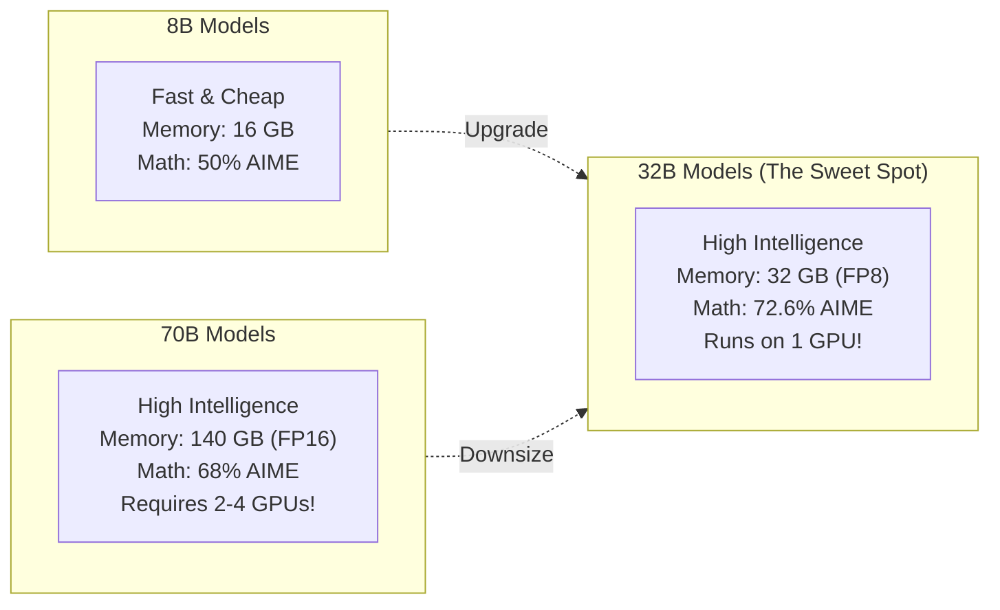
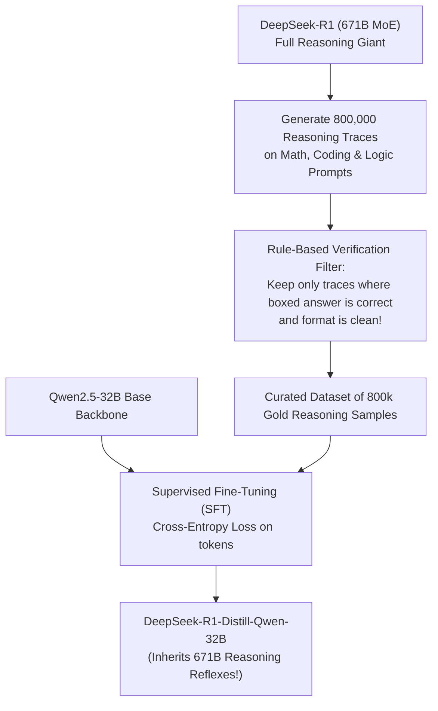

# 11. DeepSeek-R1-32B & Qwen2.5-32B — The Enterprise Sweet-Spot Models

> **Target Audience**: Anyone from a developer exploring modern LLMs for the first time to an experienced infrastructure engineer seeking deep mathematical and architectural clarity.

---

## 📑 Table of Contents
1. [Foundational Scaffolding: Understanding Model Parameter Tiers](#1-foundational-scaffolding-understanding-model-parameter-tiers)
   - [1.1 What Does "32B" Mean in Practice?](#11-what-does-32b-mean-in-practice)
   - [1.2 The Goldilocks Zone: Why 32B is the Ideal Size for Modern Systems](#12-the-goldilocks-zone-why-32b-is-the-ideal-size-for-modern-systems)
   - [1.3 What is Knowledge Distillation? The Master-Apprentice Analogy](#13-what-is-knowledge-distillation-the-master-apprentice-analogy)
2. [Deep Architecture of the 32B Foundation](#2-deep-architecture-of-the-32b-foundation)
   - [2.1 Detailed Tensor Dimensions & Parameter Counting](#21-detailed-tensor-dimensions--parameter-counting)
   - [2.2 Grouped-Query Attention (GQA) Configuration](#22-grouped-query-attention-gqa-configuration)
   - [2.3 Extended RoPE Scaling ($\theta = 1,000,000$) for 128k Context](#23-extended-rope-scaling-theta--1000000-for-128k-context)
3. [DeepSeek Distillation Mechanics: R1 671B $\to$ Qwen 32B](#3-deepseek-distillation-mechanics-r1-671b--qwen-32b)
   - [4.1 Why Distillation Beat Pure RL for Smaller Models](#31-why-distillation-beat-pure-rl-for-smaller-models)
   - [4.2 The 800,000 Curated Reasoning Traces](#32-the-800000-curated-reasoning-traces)
   - [4.3 Retaining the Emergent `<think>` Behavior](#33-retaining-the-emergent-think-behavior)
4. [Comprehensive Benchmark Showdown](#4-comprehensive-benchmark-showdown)
5. [Hardware Grounding for NVIDIA DGX Spark (Grace Blackwell GB10)](#5-hardware-grounding-for-nvidia-dgx-spark-grace-blackwell-gb10)
6. [Hands-On Python / vLLM Serving & Verification Lab](#6-hands-on-python--vllm-serving--verification-lab)
7. [Beginner Practice Exercises with Solutions](#7-beginner-practice-exercises-with-solutions)
8. [Troubleshooting, Common Misconceptions & FAQ](#8-troubleshooting-common-misconceptions--faq)

---

## 1. Foundational Scaffolding: Understanding Model Parameter Tiers

### 1.1 What Does "32B" Mean in Practice?
In neural networks, a **parameter** (or weight) is a single floating-point number that adjusts the strength of a signal passing through the model. 
- A **32B model** contains **32.76 Billion individual parameters**.
- Storing 32.76 Billion numbers in 16-bit precision (BF16, 2 bytes each) requires:
  $$\text{VRAM for Weights} = 32.76 \times 10^9 \times 2 \text{ bytes} \approx \mathbf{65.5\text{ GB}}$$
- In FP8 precision (1 byte each), this drops to **~32.8 GB**.
- In 4-bit quantization (AWQ or GGUF, 0.5 bytes each), this drops to **~18.5 GB**!

### 1.2 The Goldilocks Zone: Why 32B is the Ideal Size
In enterprise AI deployments, models generally fall into three distinct categories:

```text
1. THE POCKET TIER (1B - 8B, e.g. Llama-3.1-8B, Qwen-2.5-7B):
   - Advantages: Extremely fast (100+ tokens/sec), fits on phones and edge devices.
   - Fatal Flaw: Limited reasoning depth. They fail on advanced math proofs, multi-file codebases,
     and complex logical traps because their parameter network is simply not large enough to
     store both broad world knowledge and multi-step deduction paths.

2. THE GARGANTUAN TIER (70B - 671B, e.g. Llama-3.3-70B, DeepSeek-V3 671B):
   - Advantages: Superhuman intelligence, vast knowledge breadth.
   - Fatal Flaw: Massive infrastructure tax. A 70B model requires 140 GB VRAM in FP16 (demanding
     at least 2 to 4 GPUs running Tensor Parallelism). Inter-GPU communication adds latency,
     and cloud hosting costs thousands of dollars per month.

3. THE GOLDILOCKS SWEET SPOT (30B - 32B):
   - Intelligence: Punches far above its weight! DeepSeek-R1-Distill-32B matches or BEATS
     Llama-3.1-70B and OpenAI o1-mini on competitive math and programming benchmarks!
   - Hardware: Fits completely onto a SINGLE modern enterprise GPU (NVIDIA Blackwell GB10 128GB
     or Hopper H100 80GB) with ZERO Tensor Parallelism communication tax!
```



### 1.3 What is Knowledge Distillation? The Master-Apprentice Analogy
How can a 32B model beat an older 70B model? Through **Knowledge Distillation**.

Imagine learning organic chemistry:
- **Pretraining from scratch** is like being dropped on a desert island with 10,000 raw research papers. You must spend years discovering the fundamental laws of chemistry through trial and error.
- **Distillation** is like having the world's greatest chemistry professor (**DeepSeek-R1 671B**) sit down and write a step-by-step master study guide containing 800,000 fully explained, verified practice problems with every intermediate step detailed.
- The 32B "apprentice" model studies the professor's reasoning traces, internalizing the habits of critical thinking without having to waste trillions of compute cycles discovering how to think.

---

## 2. Deep Architecture of the 32B Foundation

Both **DeepSeek-R1-Distill-Qwen-32B** and **Qwen2.5-32B-Instruct** share the state-of-the-art dense architecture developed by Alibaba:

### 2.1 Detailed Tensor Dimensions & Parameter Counting
- **Total Layers ($L$)**: 64 transformer layers.
- **Hidden Dimension ($d_{\text{model}}$)**: 5,120.
- **Number of Attention Query Heads ($H_q$)**: 40 heads (each with head dimension $d_k = 128$).
- **Number of Key/Value Heads ($H_{kv}$)**: 8 heads (Grouped-Query Attention with group size 5).
- **Intermediate FFN Dimension ($d_{\text{ff}}$)**: 27,392 (using SwiGLU gating).
- **Vocabulary Size**: 151,643 tokens (supports English, Chinese, code syntax, mathematical LaTeX, and 29+ natural languages).

### 2.2 Grouped-Query Attention (GQA) Configuration
In Qwen-32B, the 40 Query heads share **8 Key/Value heads**:

$$\text{KV Cache Compression Ratio} = \frac{8}{40} = 0.20 \implies \mathbf{80\%\text{ KV Cache Reduction vs MHA!}}$$

For a sequence of length $S$ at batch size $B$:
$$\text{KV Cache per Layer (FP16)} = 2 \times B \times S \times 8 \times 128 \times 2 \text{ bytes} = 4,096 \times B \times S \text{ bytes}$$
Across all 64 layers:
$$\text{Total KV Cache} = 64 \times 4,096 \times B \times S = 262,144 \times B \times S \text{ bytes}$$

At **32,768 context length** for $B = 1$:
$$\text{KV Cache} = 262,144 \times 32,768 \approx \mathbf{8.58\text{ GB}}$$
*Easily leaves over 85 GB free on a 128 GB DGX Spark!*

### 2.3 Extended RoPE Scaling ($\theta = 1,000,000$)
To prevent attention scores from corrupting at ultra-long context lengths, Qwen-32B sets the Rotary Position Embedding base frequency to **$\theta = 1,000,000$** (compared to $\theta = 10,000$ in standard Llama-2). This allows native long-context reasoning up to **128,000 tokens**.

---

## 3. DeepSeek Distillation Mechanics: R1 671B $\to$ Qwen 32B

### 3.1 Why Distillation Beat Pure RL for Smaller Models
When DeepSeek attempted to train a 32B model from scratch using pure Reinforcement Learning (GRPO) without human data (the "R1-Zero" method), the 32B model struggled:
- In a massive 671B model, the search space of ideas is vast, and the model has enough capacity to stumble upon correct reasoning paths by chance.
- In a 32B model, pure RL often got trapped in local minima (repetitive loops or syntax failures).
- **The Solution**: Distill the finished 671B model's thoughts directly into the 32B model via Supervised Fine-Tuning (SFT)!



### 3.2 Retaining the Emergent `<think>` Behavior
During distillation, the 32B model was trained on the entire generation stream—including the `<think>` tags and the internal backtracking:
- The distilled 32B model learned not just the right answers, but **how to double-check its own work**.
- When asked a tricky riddle or math problem, it instinctively generates 2,000 to 5,000 tokens of scratchpad reasoning before outputting the final solution.

---

## 4. Comprehensive Benchmark Showdown

Below are benchmark results comparing **DeepSeek-R1-Distill-Qwen-32B** against industry standard models:

| Benchmark | Focus Domain | DeepSeek-R1-Distill-32B | Qwen2.5-32B-Instruct | Llama-3.3-70B-Instruct | OpenAI o1-mini |
| :--- | :--- | :---: | :---: | :---: | :---: |
| **AIME 2024** (Pass@1) | Olympiad High School Math | **72.6%** | 33.3% | 23.3% | 63.6% |
| **MATH-500** | Advanced Mathematical Proofs | **94.3%** | 83.1% | 76.8% | 90.0% |
| **LiveCodeBench** | Real-World Competitive Coding | **57.2%** | 43.1% | 40.2% | 53.8% |
| **Codeforces Percentile** | Algorithmic Problem Solving | **90.6th** | 68.2th | 62.1th | 93.4th |
| **MMLU** | General Undergraduate Knowledge | **87.4%** | 86.8% | **88.6%** | 85.2% |

```text
AIME 2024 MATH OLYMPIAD SCORE (Higher is Better):
Llama-3.3-70B:               █████ 23.3%
Qwen2.5-32B-Instruct:        ███████ 33.3%
OpenAI o1-mini (Proprietary):█████████████ 63.6%
DeepSeek-R1-Distill-32B:     ███████████████ 72.6%  <=== OUTPERFORMS o1-mini & 70B!
```

---

## 5. Hardware Grounding for NVIDIA DGX Spark (Grace Blackwell GB10)

The **NVIDIA DGX Spark** features:
- **Processor**: 72-core Grace ARM CPU + Blackwell GB10 GPU.
- **Memory**: **128 GB Unified Memory** over a 900 GB/s NVLink-C2C interconnect.

### Memory Allocation Matrix for 32B Serving:

```text
+-----------------------------------------------------------------------------------+
| TOTAL UNIFIED MEMORY: 128 GB                                                      |
+-----------------------------------------------------------------------------------+
| 1. Model Weights (FP8 Quantization):                               ~32.5 GB       |
| 2. Operating System & Framework Overhead:                          ~ 4.0 GB       |
| 3. High-Speed KV Cache (Allocated for Users):                      ~85.0 GB       |
| 4. Free Safety Buffer:                                             ~ 6.5 GB       |
+-----------------------------------------------------------------------------------+
```
*With 85 GB dedicated to the KV cache, the DGX Spark can support up to **10 concurrent users with 32,000-token context windows**, or **2 concurrent users with 128,000-token context windows**, on a single machine!*

---

## 6. Hands-On Python / vLLM Serving & Verification Lab

### 6.1 Launching Production vLLM on DGX Spark
```bash
python3 -m vllm.entrypoints.openai.api_server \
    --model deepseek-ai/DeepSeek-R1-Distill-Qwen-32B \
    --tensor-parallel-size 1 \
    --gpu-memory-utilization 0.90 \
    --max-model-len 32768 \
    --dtype bfloat16 \
    --enable-chunked-prefill \
    --port 8000
```

### 6.2 Python Verification Client (Parsing `<think>` Tokens)
```python
import openai

client = openai.OpenAI(base_url="http://localhost:8000/v1", api_key="none")

response = client.chat.completions.create(
    model="deepseek-ai/DeepSeek-R1-Distill-Qwen-32B",
    messages=[
        {"role": "user", "content": "How many 'r's are in the word strawberry? Reason carefully."}
    ],
    temperature=0.6,
    max_tokens=2048,
    stream=True
)

in_thinking = False
print("--- MODEL REASONING STREAM ---")
for chunk in response:
    content = chunk.choices[0].delta.content or ""
    if "<think>" in content:
        in_thinking = True
        print("\n[THINKING START]")
    if "</think>" in content:
        in_thinking = False
        print("\n[THINKING END]\n--- FINAL ANSWER ---")
    print(content, end="", flush=True)
print()
```

---

## 7. Beginner Practice Exercises with Solutions

### Exercise 1: Model Sizing Calculation
**Question**: A 32B model has exactly $32,768,000,000$ parameters.
1. What is the weight size in Gigabytes (GB) in FP16 (2 bytes/param)?
2. What is the weight size in FP8 (1 byte/param)?
3. What is the weight size in 4-bit AWQ (0.5 bytes/param)?

#### Solution:
1. **FP16**:
   $$\text{Bytes} = 32.768 \times 10^9 \times 2 = 65,536,000,000 \text{ bytes} \approx \mathbf{65.54\text{ GB}}$$
2. **FP8**:
   $$\text{Bytes} = 32.768 \times 10^9 \times 1 = 32,768,000,000 \text{ bytes} \approx \mathbf{32.77\text{ GB}}$$
3. **4-bit AWQ**:
   $$\text{Bytes} = 32.768 \times 10^9 \times 0.5 = 16,384,000,000 \text{ bytes} \approx \mathbf{16.38\text{ GB}}$$
   *(Allowing a 32B model to run on a consumer 24GB RTX 4090 or RTX 3090!)*

---

## 8. Troubleshooting, Common Misconceptions & FAQ

### Q1: "Is DeepSeek-R1-Distill-Qwen-32B an MoE or a Dense model?"
**Answer**: It is a **Dense model**. It uses the standard dense architecture of Qwen2.5-32B. It does NOT have 256 experts. The name "DeepSeek-R1" in its title refers to the fact that it was fine-tuned on the distilled reasoning outputs of the 671B R1 MoE model.

### Q2: "Why should I use temperature 0.6 instead of 0.0 for DeepSeek-R1?"
**Answer**: DeepSeek officially recommends a temperature between **0.5 and 0.7** for R1 models. Greedy decoding (temperature 0.0) can cause the model to get stuck in repetitive reasoning loops inside `<think>`. Moderate temperature provides the stochasticity needed for the model to explore creative backtracking paths.

---

Proceed to [**12-memory-math-for-30b-32b-on-gb10.md**](12-memory-math-for-30b-32b-on-gb10.md) to explore the exact memory mathematics and KV cache sizing formulas for the NVIDIA DGX Spark unified memory architecture.
