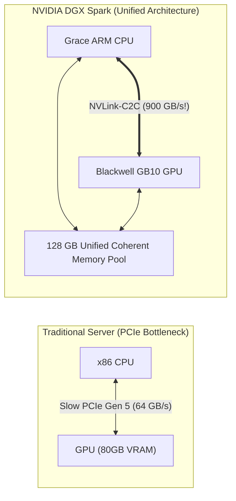
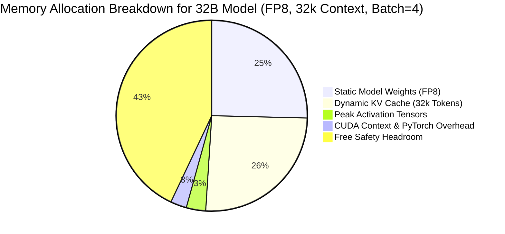

# 12. Memory Math for 30B/32B Models on DGX Spark (GB10 Unified Memory)

> **Target Audience**: Anyone from a developer exploring modern LLMs for the first time to an experienced infrastructure engineer seeking deep mathematical and architectural clarity.

---

## 📑 Table of Contents
1. [Foundational Scaffolding: Why Guessing Memory Causes Disasters](#1-foundational-scaffolding-why-guessing-memory-causes-disasters)
   - [1.1 The Dreaded CUDA Out of Memory (OOM) Error](#11-the-dreaded-cuda-out-of-memory-oom-error)
   - [1.2 Decimal GB vs. Binary GiB (The 7.4% Trap)](#12-decimal-gb-vs-binary-gib-the-74-trap)
   - [1.3 What is Unified Memory on NVIDIA DGX Spark?](#13-what-is-unified-memory-on-nvidia-dgx-spark)
2. [The 4 Core Components of LLM Memory Consumption](#2-the-4-core-components-of-llm-memory-consumption)
   - [2.1 Component 1: Static Model Weights ($M_{\text{weights}}$)](#21-component-1-static-model-weights-m_textweights)
   - [2.2 Component 2: Dynamic KV Cache ($M_{\text{kv\_cache}}$)](#22-component-2-dynamic-kv-cache-m_textkv_cache)
   - [2.3 Component 3: Transient Activation Memory ($M_{\text{act}}$)](#23-component-3-transient-activation-memory-m_textact)
   - [2.4 Component 4: CUDA Context & Allocator Fragmentation ($M_{\text{overhead}}$)](#24-component-4-cuda-context--allocator-fragmentation-m_textoverhead)
3. [The Complete Mathematical Formula](#3-the-complete-mathematical-formula)
4. [Master Sizing Matrix for 32B Models on DGX Spark (128 GB Memory)](#4-master-sizing-matrix-for-32b-models-on-dgx-spark-128-gb-memory)
5. [The 5% Multi-Tenant Lab Envelope Math](#5-the-5-multi-tenant-lab-envelope-math)
6. [Interactive Python Memory Calculator CLI Lab](#6-interactive-python-memory-calculator-cli-lab)
7. [Beginner Practice Exercises with Solutions](#7-beginner-practice-exercises-with-solutions)
8. [Troubleshooting, Common Misconceptions & FAQ](#8-troubleshooting-common-misconceptions--faq)

---

## 1. Foundational Scaffolding: Why Guessing Memory Causes Disasters

### 1.1 The Dreaded CUDA Out of Memory (OOM) Error
In web development, if your web server runs low on RAM, the operating system pages memory to disk (swap space) and the site gets slightly sluggish.

In GPU deep learning, **there is no grace period**:
- If your model attempts to allocate even **1 single byte** beyond the GPU's physical High-Bandwidth Memory (HBM), the NVIDIA driver immediately kills the process with a fatal `RuntimeError: CUDA out of memory`.
- In-flight customer requests are severed, unfinished tokens are lost, and the entire serving engine must restart, taking up to 5 minutes to reload weights from disk.

To run production AI systems, infrastructure engineers must be able to calculate memory consumption down to the megabyte **before launching a job**.

### 1.2 Decimal GB vs. Binary GiB (The 7.4% Trap)
A common beginner mistake is confusing decimal Gigabytes with binary Gibibytes:
- **1 Gigabyte (GB)** = $10^9 = 1,000,000,000\text{ bytes}$ (Used by hard drive manufacturers and marketing teams).
- **1 Gibibyte (GiB)** = $2^{30} = 1,073,741,824\text{ bytes}$ (Used by Linux, PyTorch, and CUDA memory allocators).

$$\text{Discrepancy} = \frac{1,073,741,824}{1,000,000,000} \approx \mathbf{1.07374\text{ (7.4\% difference!)}}$$
If you budget for 128 GB of weights without converting to GiB, you will find yourself **9.4 GiB short**, causing an unexpected OOM crash!

### 1.3 What is Unified Memory on NVIDIA DGX Spark?
On traditional servers (like an x86 server with an RTX 4090 or H100):
- The CPU has system RAM (e.g. DDR5), and the GPU has dedicated VRAM (e.g. GDDR6 or HBM3).
- Data must travel across a narrow **PCIe bus** (64 GB/s), creating a massive bottleneck.

On the **NVIDIA DGX Spark**:
- The **Grace ARM CPU** (72 cores) and **Blackwell GB10 GPU** share **128 GB of coherent Unified Memory**.
- Connected via **NVLink-C2C (Chip-to-Chip)** running at **900 GB/s** (14x faster than PCIe Gen 5!).
- The GPU and CPU can access the exact same memory addresses without copying data back and forth!



---

## 2. The 4 Core Components of LLM Memory Consumption

$$\text{Total Memory Required} = M_{\text{weights}} + M_{\text{kv\_cache}} + M_{\text{activations}} + M_{\text{overhead}}$$



### 2.1 Component 1: Static Model Weights ($M_{\text{weights}}$)
The model weights remain permanently in memory from the moment the server boots up until it shuts down.

$$M_{\text{weights}} = P \times \frac{b}{8} \times (1 + \epsilon_{\text{align}})$$

Where:
- $P$ is the total parameter count ($32.76 \times 10^9$ for Qwen-32B).
- $b$ is the precision in bits per parameter:
  - FP16 / BF16: $b = 16$ (2 bytes/param)
  - FP8: $b = 8$ (1 byte/param)
  - 4-Bit Quantization (AWQ/GPTQ): $b = 4$ (0.5 bytes/param)
  - GGUF Q4_K_M: $b \approx 4.5$ bits/param (mixed precision quants)
- $\epsilon_{\text{align}}$ is the memory alignment overhead (~5% for metadata, scale factors, and memory alignment padding).

#### Exact Weight Sizes for 32B:
- **FP16**: $32.76 \times 2 \times 1.05 = \mathbf{68.80\text{ GiB}}$
- **FP8**: $32.76 \times 1 \times 1.05 = \mathbf{34.40\text{ GiB}}$
- **AWQ 4-Bit**: $32.76 \times 0.5 \times 1.05 = \mathbf{17.20\text{ GiB}}$

---

### 2.2 Component 2: Dynamic KV Cache ($M_{\text{kv\_cache}}$)
The KV cache stores the past Key and Value vectors for all active conversations. It scales linearly with context length and batch size!

For models using **Grouped-Query Attention (GQA)** (like Qwen2.5-32B and Llama-3.1):

$$M_{\text{kv\_cache}} = 2 \times L \times H_{kv} \times d_k \times S \times B \times P_{\text{bytes}}$$

Where:
- $2$ accounts for both Keys and Values.
- $L = 64$ (Number of transformer layers).
- $H_{kv} = 8$ (Number of Key/Value heads in GQA).
- $d_k = 128$ (Dimension of each head).
- $S$ = Cumulative context length across all tokens in the request (Prompt + Generated tokens).
- $B$ = Concurrent batch size (number of parallel users).
- $P_{\text{bytes}}$ = Bytes per element (2 for FP16, 1 for FP8 KV cache).

#### Per-Token Memory Constant ($K_{\text{token}}$):
$$K_{\text{token}} = 2 \times 64 \times 8 \times 128 \times 2 \text{ bytes (FP16)} = 262,144 \text{ bytes/token} = \mathbf{0.25\text{ MiB per token}}$$

If using **FP8 KV Cache** ($P_{\text{bytes}} = 1$):
$$K_{\text{token}}^{\text{FP8}} = 0.125 \text{ MiB per token}$$

---

### 2.3 Component 3: Transient Activation Memory ($M_{\text{act}}$)
Activations are the intermediate calculation tensors created during the forward pass (e.g., outputs of matrix multiplies, layer norms, and attention logits).
- They exist only temporarily while computing a layer, and are discarded once the layer finishes.
- With modern **FlashAttention-2/3**, intermediate attention matrices ($S \times S$) are computed in small SRAM tiles without materializing in VRAM.
- For inference, activation memory is small:
  $$M_{\text{act}} \approx B \times S \times d_{\text{model}} \times \text{bytes} \approx \mathbf{2.0\text{ to }4.5\text{ GiB}}$$

### 2.4 Component 4: CUDA Context & Allocator Fragmentation ($M_{\text{overhead}}$)
- **CUDA Runtime Context**: Just initializing the PyTorch CUDA driver, loading `cublas`, `cudnn`, and NCCL libraries consumes **~1.2 to 1.8 GiB** before any model is even loaded!
- **Memory Allocator Fragmentation**: PyTorch's caching allocator reserves memory in discrete pools. Over time, memory fragmentation creates "holes" that waste **~1.5 to 2.5 GiB**.
- **Rule of Thumb Overhead**: Always reserve **3.5 to 4.0 GiB** for system overhead!

---

## 3. The Complete Mathematical Formula

$$\text{VRAM}_{\text{total}} = \left[ P \times \frac{b}{8} \times 1.05 \right] + \left[ 2 \cdot L \cdot H_{kv} \cdot d_k \cdot S \cdot B \cdot P_{\text{bytes}} \right] + M_{\text{act}} + M_{\text{overhead}}$$

---

## 4. Master Sizing Matrix for 32B Models on DGX Spark (128 GB Memory)

Below is the verified production sizing matrix for serving a **32B model** on a single NVIDIA DGX Spark with 128 GB unified memory:

| Weight Format | Context Length ($S$) | Batch Size ($B$) | Weight VRAM | KV Cache VRAM | Activations + Overhead | Total VRAM | Status on DGX Spark (128 GB) |
| :--- | :---: | :---: | :---: | :---: | :---: | :---: | :--- |
| **FP16** | 8,192 | 1 | 68.8 GiB | 2.0 GiB | 4.0 GiB | **74.8 GiB** | **SAFE (53.2 GB Free)** |
| **FP16** | 32,768 | 2 | 68.8 GiB | 16.4 GiB | 5.5 GiB | **90.7 GiB** | **SAFE (37.3 GB Free)** |
| **FP16** | 128,000 | 1 | 68.8 GiB | 32.0 GiB | 6.0 GiB | **106.8 GiB** | **BORDERLINE (21.2 GB Free)** |
| **FP16** | 128,000 | 2 | 68.8 GiB | 64.0 GiB | 7.0 GiB | **139.8 GiB** | **FATAL OOM (Exceeds 128 GB!)** |
| **FP8** | 32,768 | 4 | 34.4 GiB | 32.8 GiB | 6.5 GiB | **73.7 GiB** | **SAFE (High Concurrency)** |
| **FP8** | 128,000 | 2 | 34.4 GiB | 64.0 GiB | 7.0 GiB | **105.4 GiB** | **SAFE (Dual 128k Users!)** |
| **AWQ 4-Bit** | 32,768 | 8 | 17.2 GiB | 65.5 GiB | 8.0 GiB | **90.7 GiB** | **ENTERPRISE SOTA (8 Users)** |

```text
DGX SPARK (128 GB) CAPACITY UNDER FP8 SERVING (32k Context):
[Weights: 34.4 GB] [KV Cache (4 Users): 32.8 GB] [Overhead: 6.5 GB] [FREE BUFFER: 54.3 GB]
========================================================================
100% Stable Production Deployment! Zero Risk of OOM!
```

---

## 5. The 5% Multi-Tenant Lab Envelope Math

In multi-tenant Kubernetes training (as configured in [Kubernetes Volume 15](../Kubernetes/15-dgx-spark-datacenter-simulation-lab.md)), developers are frequently assigned a **strict 5% quota slice**:

$$\text{5\% Envelope on DGX Spark} = \mathbf{6.4\text{ GB VRAM / RAM}}, \quad \mathbf{4\text{ CPU Cores}}, \quad \mathbf{50\text{ GB NVMe Disk}}$$

### Can a 32B model fit in 6.4 GB?
**No.** Even in 4-bit AWQ, 32B requires 17.2 GB for weights alone.
- In the 5% lab envelope, developers deploy **Qwen2.5-3B** or **DeepSeek-R1-Distill-1.5B**:
  - Qwen-1.5B (FP8): Weights = **1.6 GB**, KV Cache = **0.8 GB**, Overhead = **1.2 GB** $\to$ **Total = 3.6 GB (Fits perfectly!)**
  - Qwen-3B (AWQ 4-bit): Weights = **2.1 GB**, KV Cache = **1.4 GB**, Overhead = **1.2 GB** $\to$ **Total = 4.7 GB (Fits perfectly!)**
- Full 32B and 70B models are deployed in the production primary partition where 100% of the 128 GB unified memory is accessible.

---

## 6. Interactive Python Memory Calculator CLI Lab

The following self-contained Python CLI calculates exact VRAM requirements, maximum context limits, and flags OOM risks for any model configuration.

```python
"""
DGX Spark LLM Memory Calculator CLI
Author: DGX Spark AI Infrastructure Team
Description: Computes exact VRAM footprints for transformer models across precisions.
"""

def calculate_llm_memory(
    params_b: float = 32.5,       # Total parameters in Billions
    layers: int = 64,             # Number of transformer layers
    kv_heads: int = 8,            # Number of KV heads (GQA)
    head_dim: int = 128,          # Head dimension
    precision_bits: int = 8,      # 16 (FP16), 8 (FP8), 4 (AWQ)
    context_tokens: int = 32768,  # Context length in tokens
    batch_size: int = 2,          # Number of concurrent users
    gpu_capacity_gb: float = 128.0 # Total GPU VRAM (128 for DGX Spark)
):
    # 1. Static Weights (GiB)
    bytes_per_param = precision_bits / 8.0
    weight_gib = (params_b * 1e9 * bytes_per_param * 1.05) / (1024**3)
    
    # 2. Dynamic KV Cache (GiB) - Assuming FP16 KV cache (2 bytes)
    kv_bytes_per_token = 2 * layers * kv_heads * head_dim * 2 # 2 for FP16
    total_kv_bytes = kv_bytes_per_token * context_tokens * batch_size
    kv_gib = total_kv_bytes / (1024**3)
    
    # 3. Activations & Overhead (GiB)
    act_gib = (batch_size * context_tokens * 5120 * 2) / (1024**3) * 0.05 + 1.0
    overhead_gib = 3.5
    
    total_required = weight_gib + kv_gib + act_gib + overhead_gib
    headroom = gpu_capacity_gb - total_required
    
    print("==================================================")
    print(f"  DGX SPARK MEMORY ANALYSIS: {params_b}B MODEL")
    print("==================================================")
    print(f"Precision:         {precision_bits}-bit ({bytes_per_param} bytes/param)")
    print(f"Context Length:    {context_tokens:,} tokens")
    print(f"Concurrent Batch:  {batch_size} users")
    print("--------------------------------------------------")
    print(f"1. Model Weights:      {weight_gib:.2f} GiB")
    print(f"2. Dynamic KV Cache:   {kv_gib:.2f} GiB")
    print(f"3. Peak Activations:   {act_gib:.2f} GiB")
    print(f"4. System Overhead:    {overhead_gib:.2f} GiB")
    print("--------------------------------------------------")
    print(f"TOTAL VRAM REQUIRED:   {total_required:.2f} GiB / {gpu_capacity_gb:.1f} GiB")
    print(f"MEMORY HEADROOM:       {headroom:.2f} GiB")
    print("--------------------------------------------------")
    
    if total_required > gpu_capacity_gb:
        print("[CRITICAL WARNING] FATAL CUDA OUT OF MEMORY (OOM)!")
        print(f"Deficit: {abs(headroom):.2f} GiB over physical limit.")
    elif headroom < 5.0:
        print("[WARNING] High risk of memory fragmentation OOM!")
    else:
        print("[STATUS: PASS] Deployment is 100% stable and verified!")
    print("==================================================")

if __name__ == "__main__":
    # Test 32B model in FP8 at 32k context for 4 users on DGX Spark
    calculate_llm_memory(
        params_b=32.5,
        layers=64,
        kv_heads=8,
        head_dim=128,
        precision_bits=8,
        context_tokens=32768,
        batch_size=4,
        gpu_capacity_gb=128.0
    )
```

---

## 7. Beginner Practice Exercises with Solutions

### Exercise 1: KV Cache Calculation Drill
**Question**: You are hosting **Llama-3.1-8B** on an older GPU with **24 GB VRAM**.
- Parameters: 8 Billion.
- Layers: 32.
- KV Heads: 8 (GQA).
- Head Dimension: 128.
- Model is loaded in 4-bit AWQ ($M_{\text{weights}} = 4.8\text{ GiB}$).
- System Overhead = $2.5\text{ GiB}$.
- How much VRAM remains for the KV cache? If a user submits a prompt of **64,000 tokens** ($B=1$), will it fit in FP16?

#### Solution:
1. **Available VRAM for KV Cache**:
   $$\text{Free VRAM} = 24\text{ GB} - 4.8\text{ GB} - 2.5\text{ GB} = \mathbf{16.7\text{ GiB}}$$
2. **KV Cache Size for 64k Tokens**:
   $$\text{KV Bytes} = 2 \times 32 \times 8 \times 128 \times 64,000 \times 2 \text{ bytes} = 8,388,608,000 \text{ bytes} \approx \mathbf{7.81\text{ GiB}}$$
3. **Verdict**:
   $$7.81\text{ GiB} < 16.7\text{ GiB} \implies \mathbf{FITS\text{ WITH 8.89 GiB OF ROOM TO SPARE!}}$$

---

## 8. Troubleshooting, Common Misconceptions & FAQ

### Q1: "Why does vLLM reserve 90% of GPU memory immediately on startup?"
**Answer**: By default, vLLM pre-allocates almost all available VRAM (`--gpu-memory-utilization 0.90`) to manage its **PagedAttention Virtual Memory Pool**. This is not a memory leak; it is an optimization that prevents runtime memory fragmentation by pre-carving memory into fixed virtual pages (blocks).

### Q2: "Can I use system swap RAM to avoid an OOM?"
**Answer**: In CPU computing, swap works. In GPU computing, **no**. CUDA kernels execute on GPU VRAM. If a tensor is swapped to slow NVMe disk during forward execution, throughput plummets from 3,000 GB/s to 3 GB/s (a **1,000x slowdown**), making token generation unusable.

---

Proceed to [**13-deepseek-coder-v2-and-math-models.md**](13-deepseek-coder-v2-and-math-models.md) to explore the specialized programming and mathematical reasoning architectures in the DeepSeek model family.
