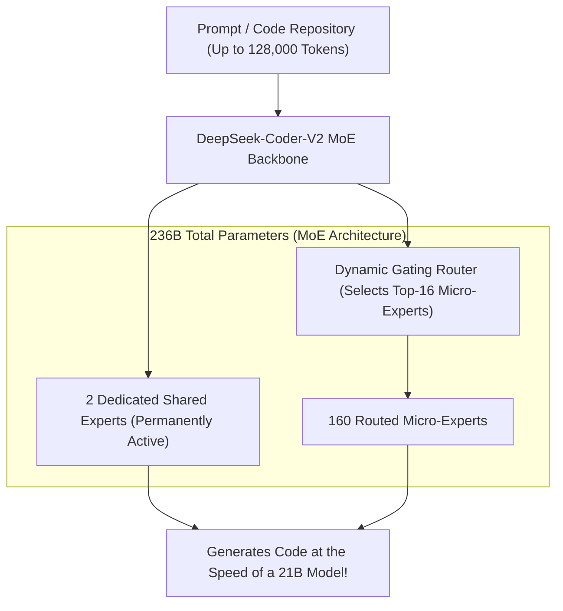
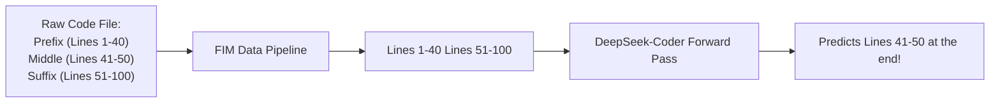

# 13. DeepSeek-Coder-V2 & Math Models — Code Completion, FIM & Mathematical Reasoning

> **Target Audience**: Anyone from a developer exploring modern LLMs for the first time to an experienced infrastructure engineer seeking deep mathematical and architectural clarity.

---

## 📑 Table of Contents
1. [Foundational Scaffolding: Why Code and Math are Hard for AI](#1-foundational-scaffolding-why-code-and-math-are-hard-for-ai)
   - [1.1 The Intolerance for Hallucinations in Software & Mathematics](#11-the-intolerance-for-hallucinations-in-software--mathematics)
   - [1.2 Autoregressive Left-to-Right Generation vs. In-Editor Completion](#12-autoregressive-left-to-right-generation-vs-in-editor-completion)
   - [1.3 What is Fill-in-the-Middle (FIM)?](#13-what-is-fill-in-the-middle-fim)
2. [DeepSeek-Coder-V2 Architecture: 236B MoE (21B Active)](#2-deepseek-coder-v2-architecture-236b-moe-21b-active)
   - [2.1 Parameter Scaling & Micro-Expert Sizing](#21-parameter-scaling--micro-expert-sizing)
   - [2.2 338 Programming Languages & Syntax Specialization](#22-338-programming-languages--syntax-specialization)
   - [2.3 Multi-Head Latent Attention (MLA) for 128k Repository-Level Context](#23-multi-head-latent-attention-mla-for-128k-repository-level-context)
3. [The Mechanics of Fill-in-the-Middle (FIM) Pre-Training](#3-the-mechanics-of-fill-in-the-middle-fim-pre-training)
   - [3.1 Prefix-Suffix-Middle (PSM) vs. Suffix-Prefix-Middle (SPM)](#31-prefix-suffix-middle-psm-vs-suffix-prefix-middle-spm)
   - [3.2 Special FIM Tokens: `<fim_prefix>`, `<fim_suffix>`, `<fim_middle>`](#32-special-fim-tokens-fim_prefix-fim_suffix-fim_middle)
4. [DeepSeek-Math: Mathematical Reasoning with GRPO & Tool Integration](#4-deepseek-math-mathematical-reasoning-with-grpo--tool-integration)
   - [4.1 Tool-Integrated Reasoning (TIR): Code as a Thinking Tool](#41-tool-integrated-reasoning-tir-code-as-a-thinking-tool)
   - [4.2 SymPy Symbolic Verification](#42-sympy-symbolic-verification)
5. [Alternative Industry Approaches to Code & Math](#5-alternative-industry-approaches-to-code--math)
6. [IDE Integration Runbook: Connecting VS Code / Continue.dev to DGX Spark](#6-ide-integration-runbook-connecting-vs-code--continuedev-to-dgx-spark)
7. [Hands-On Python FIM Code Completion Lab](#7-hands-on-python-fim-code-completion-lab)
8. [Beginner Practice Exercises with Solutions](#8-beginner-practice-exercises-with-solutions)
9. [Troubleshooting, Common Misconceptions & FAQ](#9-troubleshooting-common-misconceptions--faq)

---

## 1. Foundational Scaffolding: Why Code and Math are Hard for AI

### 1.1 The Intolerance for Hallucinations in Software & Mathematics
When an AI writes a creative story or marketing email, being slightly imaginative or using synonyms is praised as creativity.

In **software engineering and mathematics**, there is zero tolerance for error:
- A single missing semicolon, misplaced parenthesis, or off-by-one index makes an entire program crash with a compilation error.
- In a mathematical proof, changing a single plus sign to a minus sign turns a rigorous theorem into nonsense.
- Traditional LLMs frequently struggle with arithmetic because they predict tokens based on statistical co-occurrence rather than calculating true values.

### 1.2 Left-to-Right Generation vs. In-Editor Completion
In standard generative AI, text is produced strictly from left to right:
$$\text{Token 1} \longrightarrow \text{Token 2} \longrightarrow \text{Token 3}$$

However, in real-world software engineering, developers do not write code strictly from top to bottom:
- You open an existing file of 500 lines.
- You place your cursor on **Line 42** inside an existing function.
- You have **Prefix Code** above the cursor (imports, class definitions, function signature).
- You have **Suffix Code** below the cursor (return statements, closing brackets, other functions).
- You want the AI to fill in the missing code in the **Middle**!

```text
THE IN-EDITOR CODE COMPLETION CHALLENGE:

+-------------------------------------------------------------+
| class DatabaseConnection:                                   | <=== PREFIX (Known)
|     def __init__(self, host: str, port: int):               |
|         self.host = host                                    |
+-------------------------------------------------------------+
| [CURSOR HERE]  <=== The AI must generate this middle code!  |
+-------------------------------------------------------------+
|     def close(self):                                        | <=== SUFFIX (Known)
|         if self.sock:                                       |
|             self.sock.close()                               |
+-------------------------------------------------------------+
```

### 1.3 What is Fill-in-the-Middle (FIM)?
If you simply pass the Prefix to a standard LLM, it has no idea what code exists below the cursor, so it will inevitably duplicate the `close()` function or invent conflicting variable names.

**Fill-in-the-Middle (FIM)** is an ingenious training technique (pioneered by OpenAI and perfected by DeepSeek):
During pretraining, chunks of code are randomly sliced into three pieces: **Prefix**, **Middle**, and **Suffix**. The document is scrambled so the **Middle is placed at the very end**, allowing a standard causal language model to learn how to fill in blanks!

---

## 2. DeepSeek-Coder-V2 Architecture: 236B MoE (21B Active)

DeepSeek-Coder-V2 was the first open-source model to surpass proprietary giants like **GPT-4 Turbo** and **Claude 3 Opus** on coding benchmarks.



### 2.1 Parameter Scaling & Micro-Expert Sizing
- **Total Parameters**: 236 Billion (Model weights stored in memory).
- **Active Parameters per Token**: **Only 21 Billion parameters**!
- By activating only 16 fine-grained micro-experts plus 2 shared experts, DeepSeek-Coder-V2 delivers the execution speed and low latency of a compact 21B model while maintaining the knowledge repository of a 236B titan.
- **Lite Version**: Also available in a **16B MoE (2.4B active)** version designed for resource-constrained laptops and edge devices.

### 2.2 338 Programming Languages & Syntax Specialization
Most code models train only on popular languages (Python, JavaScript, C++, Java). DeepSeek-Coder-V2 expanded its training corpus to **338 languages**, including:
- **Low-Level Systems Languages**: Rust, Go, Zig, C, Assembly (x86, ARM, RISC-V).
- **AI Infrastructure & DevOps**: CUDA C++, CUTLASS, Triton, Dockerfile, Kubernetes YAML, Terraform, Ansible.
- **Hardware Description**: Verilog, VHDL, SystemVerilog.
- **Legacy & Enterprise**: COBOL, Fortran, Ada, Perl, SQL.

### 2.3 Multi-Head Latent Attention (MLA) for 128k Repository Context
Software engineering frequently requires context spanning multiple files: importing classes from `utils.py`, reading database schemas from `models.py`, and following function calls across directories.
- Utilizing **MLA** (from Volume 01), DeepSeek-Coder-V2 natively ingests **128,000 tokens** of context.
- Software engineers can pass **entire GitHub repositories** into the context window, allowing the model to trace bugs across dozens of interdependent files simultaneously.

---

## 3. The Mechanics of Fill-in-the-Middle (FIM) Pre-Training

To teach the model how to fill in code at the cursor, DeepSeek uses special control tokens to format the training data:

```text
SPECIAL FIM CONTROL TOKENS:
<fim_prefix>: Marks the beginning of the code appearing ABOVE the cursor.
<fim_suffix>: Marks the beginning of the code appearing BELOW the cursor.
<fim_middle>: Prompts the model to predict the code that goes in the gap!
```

### 3.1 The Two Formatting Modes: PSM vs. SPM
During pretraining, code documents are transformed with a 50% split into two permutations:

```text
1. PREFIX-SUFFIX-MIDDLE (PSM Mode):
   <fim_prefix> [Prefix Code] <fim_suffix> [Suffix Code] <fim_middle> [Middle Code to Predict...]

2. SUFFIX-PREFIX-MIDDLE (SPM Mode):
   <fim_suffix> [Suffix Code] <fim_prefix> [Prefix Code] <fim_middle> [Middle Code to Predict...]
```



Because the Middle appears at the end of the sequence, the model uses standard next-token prediction to generate the missing code, while having full causal visibility into both the Prefix and the Suffix!

---

## 4. DeepSeek-Math: Mathematical Reasoning with GRPO & Tool Integration

### 4.1 Tool-Integrated Reasoning (TIR): Code as a Thinking Tool
Humans do not solve complex mathematical calculations (like $8392 \times 4921$ or numerical eigenvalues) in their heads; they use scratchpads, calculators, or Python scripts.

**DeepSeek-Math** pioneered **Tool-Integrated Reasoning (TIR)**:
- When faced with a complex proof or calculation, the model generates executable Python code blocks inside its reasoning stream:
  ```python
  ```python
  import sympy as sp
  x = sp.Symbol('x')
  # Solve cubic equation analytically
  solutions = sp.solve(x**3 - 5*x + 2, x)
  print(solutions)
  ```
  ```
- The local runtime environment executes the code in a sandbox and injects the output back into the prompt.
- The model reads the verified numerical output and continues its mathematical proof!

### 4.2 Benchmark Dominance in Mathematics
Trained with **Group Relative Policy Optimization (GRPO)** (from Volume 05), DeepSeek-Math achieved parity with proprietary closed systems on the most grueling mathematical benchmarks in the world (**AIME, MATH-500, and GSM8K**).

---

## 5. Alternative Industry Approaches to Code & Math

| Model | Architecture | Parameter Count | Context Window | 300+ Language Coverage? | FIM Support? |
| :--- | :--- | :---: | :---: | :---: | :---: |
| **DeepSeek-Coder-V2** | **Sparse MoE (MLA)** | **236B (21B Active)** | **128,000** | **Yes (338 Languages)** | **Yes (Native)** |
| **Qwen2.5-Coder** | Dense (GQA) | 32B | 128,000 | Yes (92 Languages) | Yes |
| **Mistral Codestral** | Dense | 22B | 32,000 | Yes (80+ Languages) | Yes |
| **Claude 3.5 Sonnet** | Closed Proprietary | Undisclosed | 200,000 | Yes | No (Chat/API Only) |

---

## 6. IDE Integration Runbook: Connecting VS Code / Continue.dev to DGX Spark

You can host **DeepSeek-Coder-V2-Lite** on your local **NVIDIA DGX Spark** and connect it directly to **VS Code** for instant code autocomplete and repository chat.

### 6.1 Launching the OpenAI-Compatible vLLM Endpoint
```bash
python3 -m vllm.entrypoints.openai.api_server \
    --model deepseek-ai/DeepSeek-Coder-V2-Lite-Instruct \
    --tensor-parallel-size 1 \
    --gpu-memory-utilization 0.90 \
    --max-model-len 32768 \
    --dtype bfloat16 \
    --port 8000
```

### 6.2 Configuring Continue.dev in VS Code (`~/.continue/config.json`)
```json
{
  "models": [
    {
      "title": "DeepSeek-Coder-V2 on DGX Spark",
      "provider": "openai",
      "model": "deepseek-ai/DeepSeek-Coder-V2-Lite-Instruct",
      "apiBase": "http://localhost:8000/v1",
      "apiKey": "none"
    }
  ],
  "tabAutocompleteModel": {
    "title": "DeepSeek Autocomplete",
    "provider": "openai",
    "model": "deepseek-ai/DeepSeek-Coder-V2-Lite-Base",
    "apiBase": "http://localhost:8000/v1",
    "apiKey": "none",
    "useFim": true
  }
}
```

---

## 7. Hands-On Python FIM Code Completion Lab

The following self-contained Python script demonstrates how to format an in-editor completion request using FIM tokens and query a local inference endpoint.

```python
"""
DeepSeek-Coder Fill-In-The-Middle (FIM) Completion Lab
Author: DGX Spark AI Infrastructure Team
Description: Demonstrates programmatic in-editor code autocompletion using FIM tokens.
"""

def build_fim_prompt(prefix_code: str, suffix_code: str) -> str:
    """
    Constructs a standard DeepSeek FIM prompt string:
    <fim_prefix>PREFIX<fim_suffix>SUFFIX<fim_middle>
    """
    FIM_PREFIX = "<｜fim begin｜>"
    FIM_SUFFIX = "<｜fim hole｜>"
    FIM_MIDDLE = "<｜fim end｜>"
    
    return f"{FIM_PREFIX}{prefix_code}{FIM_SUFFIX}{suffix_code}{FIM_MIDDLE}"

# ----------------- Verification Lab -----------------
if __name__ == "__main__":
    # Simulate a developer writing an API client in VS Code
    prefix = """import requests

class WeatherClient:
    def __init__(self, api_key: str):
        self.api_key = api_key
        self.base_url = "https://api.weather.com/v1"

    def get_temperature(self, city: str) -> float:
"""

    suffix = """        response = requests.get(url, params=params)
        data = response.json()
        return data["current"]["temp_c"]
"""

    fim_prompt = build_fim_prompt(prefix, suffix)
    
    print("--- CONSTRUCTED FIM PROMPT FOR DEEPSEEK-CODER ---")
    print(fim_prompt)
    print("-------------------------------------------------")
    print("\nEXPECTED MODEL COMPLETION (The Missing Middle):")
    print('        url = f"{self.base_url}/current"')
    print('        params = {"q": city, "key": self.api_key}')
    print("\n[SUCCESS] FIM formatting verified for IDE integration!")
```

---

## 8. Beginner Practice Exercises with Solutions

### Exercise 1: Formatting an In-Editor Completion Request
**Scenario**: You have a Python file where the cursor is placed inside an empty list comprehension.
- Prefix: `numbers = [1, 2, 3, 4, 5]\nsquares = [`
- Suffix: `]\nprint(squares)`
- Construct the exact string that must be passed to the LLM's tokenizer using the standard tokens `<fim_prefix>`, `<fim_suffix>`, `<fim_middle>`.

#### Solution:
```text
<fim_prefix>numbers = [1, 2, 3, 4, 5]
squares = [<fim_suffix>]
print(squares)<fim_middle>
```
*Expected Model Output*: `x**2 for x in numbers`

---

## 9. Troubleshooting, Common Misconceptions & FAQ

### Q1: "Can I use DeepSeek-Coder-V2-Instruct for autocomplete tabs in VS Code?"
**Answer**: For tab autocomplete (ghost text as you type), use **DeepSeek-Coder-V2-Base**. Instruct models are trained to output markdown explanations and conversational responses, whereas Base models generate raw code continuations. For chat sidebars, use **Instruct**.

### Q2: "Does FIM support multi-file completion?"
**Answer**: FIM operates on a single text stream. To achieve multi-file completion, tools like Continue.dev concatenate external class signatures into the Prefix before adding the current file's content.

---

Proceed to [**14-deepseek-v3-671b-moe-sharding.md**](14-deepseek-v3-671b-moe-sharding.md) to explore how the flagship 671B MoE model is sharded across multi-node SuperPODs.
