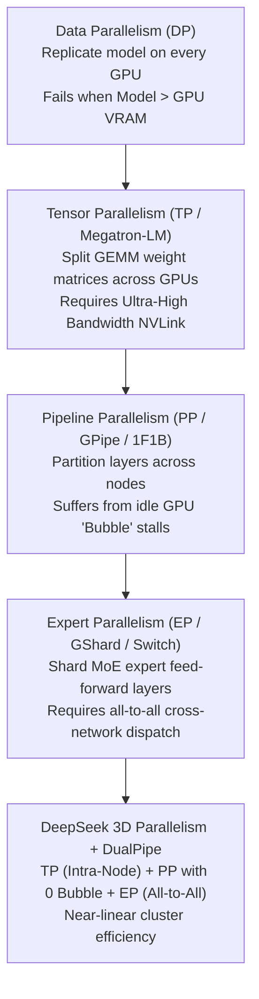
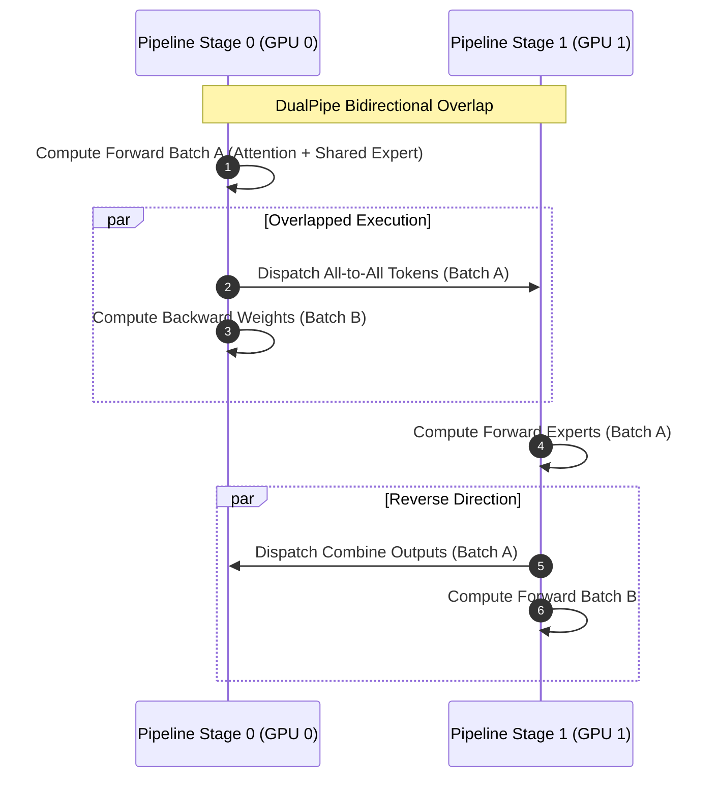

# 14. DeepSeek-V3 671B MoE Sharding — Distributed Tensor, Pipeline & Expert Parallelism

> **Target Audience**: AI Infrastructure Engineers, Distributed Systems Architects, and ML Engineers scaling frontier 600B+ Mixture-of-Experts models.  
> **Prerequisites**: Familiarity with Transformer self-attention, GPU memory anatomy (from [04-fp8-mixed-precision-framework.md](04-fp8-mixed-precision-framework.md) and [12-memory-math-for-30b-32b-on-gb10.md](12-memory-math-for-30b-32b-on-gb10.md)), and distributed collectives (`All-Reduce`, `All-to-All`).  
> **Estimated Study Time**: 55 minutes.  
> **What You Will Master**: The physical mechanics of 3D parallelism ($TP \times PP \times EP$), MoE `All-to-All` dispatch/combine collectives, the DualPipe bidirectional scheduling algorithm that collapses pipeline bubbles to zero, and cluster sizing realities for 671B inference.

---

## 📑 Table of Contents
1. [Foundational Scaffolding: The Multi-Node Supercomputer Mindset](#1-foundational-scaffolding-the-multi-node-supercomputer-mindset)
2. [Co-Related Concepts & The Evolution of Parallelism](#2-co-related-concepts--the-evolution-of-parallelism)
3. [DeepSeek-V3 671B Architectural Anatomy](#3-deepseek-v3-671b-architectural-anatomy)
4. [The 3D Sharding Topology: TP vs. PP vs. EP](#4-the-3d-sharding-topology-tp-vs-pp-vs-ep)
5. [The DualPipe Scheduling Engine: Overcoming the Bubble Wall](#5-the-dualpipe-scheduling-engine-overcoming-the-bubble-wall)
6. [Expert Parallelism (EP) Collective Mechanics (All-to-All)](#6-expert-parallelism-ep-collective-mechanics-all-to-all)
7. [Cluster Hardware Sizing Matrix (H100, H200, DGX Spark)](#7-cluster-hardware-sizing-matrix-h100-h200-dgx-spark)
8. [Industry Comparative Analysis: Dense vs. MoE Sharding](#8-industry-comparative-analysis-dense-vs-moe-sharding)
9. [Hands-On Production Lab: Simulating MoE Token Dispatch & Combine](#9-hands-on-production-lab-simulating-moe-token-dispatch--combine)
10. [Hardware Grounding: The DGX Spark Reality & Pragmatic Strategy](#10-hardware-grounding-the-dgx-spark-reality--pragmatic-strategy)
11. [Practice Exercises with Step-by-Step Solutions](#11-practice-exercises-with-step-by-step-solutions)
12. [Troubleshooting Guide & Diagnostic Runbook](#12-troubleshooting-guide--diagnostic-runbook)

---

## 1. Foundational Scaffolding: The Multi-Node Supercomputer Mindset

### The Single-GPU Physics Wall
Consider the physical dimensions of **DeepSeek-V3** and **DeepSeek-R1**:
* **Total Parameters**: 671 Billion ($671 \times 10^9$).
* **Storage in FP16**: $671 \times 2 = 1,342 \text{ Gigabytes}$ (1.34 Terabytes).
* **Storage in Native FP8**: $671 \times 1 = 671 \text{ Gigabytes}$.

The largest commercial GPU PCIe/SXM cards available today (NVIDIA H100 SXM5) possess **80 GB** of High Bandwidth Memory (HBM3). Even the newer H200 features **141 GB**. 
A single GPU cannot physically contain even 15% of the static model weights, to say nothing of the activation memory and KV cache buffers. 

```
                                 PHYSICAL WEIGHT MISMATCH
┌─────────────────────────────────────────────────────────────────────────────────────────┐
│ DeepSeek-V3 Raw FP8 Weights: 671 GB                                                     │
└─────────────────────────────────────────────────────────────────────────────────────────┘
        ▼                                      ▼                               ▼
┌──────────────┐                       ┌──────────────┐                ┌──────────────┐
│  H100 (80GB) │ ◄── Fits only 11%     │ H200 (141GB) │ ◄── Fits 21%   │ GB10 (128GB) │ ◄── Fits 19%
└──────────────┘                       └──────────────┘                └──────────────┘
```

Therefore, serving or training DeepSeek-V3 is not a "GPU program"—it is an **orchestrated distributed cluster problem**. The entire cluster acts as a single unified virtual GPU.

### Real-World Analogy: The Global University Research Consortium
Imagine writing a comprehensive encyclopedia containing 671 volumes:
1. **Tensor Parallelism (TP)**: Four professors sit at the exact same table in the library (fastest communication, equivalent to 900 GB/s NVLink). When a complex math sentence arrives, Professor 1 translates the first 2 words, Professor 2 translates the next 2, and they immediately shout their answers to each other across the table.
2. **Pipeline Parallelism (PP)**: The book is assembled sequentially across different buildings. Building A handles Chapters 1 to 30, while Building B handles Chapters 31 to 61. Courier vans shuttle drafts between buildings.
3. **Expert Parallelism (EP)**: Scattered across 32 university campuses are 256 hyper-specialized scholars (one for quantum physics, one for ancient Greek, one for tax law). When a sentence about tax law appears, a dispatch courier flies the specific sentence directly to the tax scholar's campus, gets the analysis, and flies it back.

---

## 2. Co-Related Concepts & The Evolution of Parallelism

To understand DeepSeek's modern sharding strategy, one must trace how distributed deep learning evolved to overcome successive memory and communication bottlenecks:



### The 4 Major Distributed Collectives
Distributed sharding relies on foundational NCCL (NVIDIA Collective Communications Library) primitives:
1. **`All-Reduce`**: Every rank contributes a tensor; all ranks receive the element-wise sum. Used in Megatron Tensor Parallelism to aggregate linear layer outputs.
2. **`All-Gather`**: Every rank contributes a tensor shard; all ranks receive the concatenated full tensor.
3. **`Reduce-Scatter`**: Every rank contributes a full tensor; each rank receives an element-wise reduced slice.
4. **`All-to-All`**: Every rank sends personalized slices of data to every other rank. **This is the core communication backbone of Expert Parallelism**.

---

## 3. DeepSeek-V3 671B Architectural Anatomy

Before sharding the model, we must audit its exact tensor layers. DeepSeek-V3 is structured as follows:

| Structural Component | Specification | Dimension / Value | Total Per Layer |
| :--- | :--- | :--- | :--- |
| **Number of Layers** | Transformer Blocks | $L = 61$ | 61 Layers |
| **Model Hidden Dim** | $d_{model}$ | 7,168 | - |
| **Attention Module** | Multi-Head Latent Attention (MLA) | 128 Heads, $d_h = 128$ | Compression $c_t \in \mathbb{R}^{512}$ |
| **Shared Expert** | 1 Dense FFN per layer | Intermediate Dim = 2,048 | Always computed by all tokens |
| **Routed Experts** | 256 FFNs per layer | Intermediate Dim = 2,048 each | Top-8 selected per token |
| **Total Active Params** | Per-token forward pass | **37 Billion** (3.2B Attn + 33.8B MoE) | ~5.5% sparsity ratio |

### Why Sharding MoE is Radically Different from Dense Models
In a dense model like Llama-3 405B, every token activates 100% of the weights. If you run 8-way Tensor Parallelism, every GPU computes its slice of the matrix for every single token.
In DeepSeek-V3 MoE:
* The **Attention layers** (MLA) are dense: every token passes through them.
* The **Shared Expert** is dense: every token passes through it.
* The **Routed Experts** are sparse: each token visits only 8 of the 256 experts.

If you shard the 256 experts across 16 GPUs (16 experts per GPU), **GPU 0 only executes computations for tokens whose router selected experts 0 through 15**.

---

## 4. The 3D Sharding Topology: TP vs. PP vs. EP

To host DeepSeek-V3 across an enterprise cluster (for example, 4 physical nodes $\times$ 8 H100 GPUs = 32 GPUs total), the network topology dictates how dimensions are mapped:

```
┌────────────────────────────────────────────────────────────────────────────────────────┐
│                        32-GPU PHYSICAL CLUSTER TOPOLOGY                                │
│                                                                                        │
│  ┌───────────────────────┐  RoCEv2 / IB  ┌───────────────────────┐                    │
│  │   Node 0 (GPUs 0-7)   │◄─────────────►│   Node 1 (GPUs 8-15)  │  Pipeline Stage 0   │
│  │   Layers 1 to 30      │  400 Gbps     │   Layers 1 to 30      │  (PP Rank 0)        │
│  └───────────────────────┘               └───────────────────────┘                     │
│              ▲                                       ▲                                 │
│              │ Inter-Stage P2P Activations           │                                 │
│              ▼                                       ▼                                 │
│  ┌───────────────────────┐  RoCEv2 / IB  ┌───────────────────────┐                    │
│  │   Node 2 (GPUs 16-23) │◄─────────────►│   Node 3 (GPUs 24-31) │  Pipeline Stage 1   │
│  │   Layers 31 to 61     │  400 Gbps     │   Layers 31 to 61     │  (PP Rank 1)        │
│  └───────────────────────┘               └───────────────────────┘                     │
└────────────────────────────────────────────────────────────────────────────────────────┘
```

### 1. Tensor Parallelism ($TP = 4$)
* **Scope**: Confined entirely **inside a single physical chassis** over NVLink (900 GB/s bidirectional per GPU).
* **Target**: MLA Query, Key, Value compression projections and Output linear heads.
* **Why not TP over the network?** Tensor parallelism requires 2 `All-Reduce` operations per Transformer layer. Over 400 Gbps network cards, network latency would throttle GPU compute utilization down to $<15\%$. NVLink is mandatory for TP.

### 2. Pipeline Parallelism ($PP = 2 \text{ or } 4$)
* **Scope**: Spans between physical node pairs across the InfiniBand or RoCEv2 network fabric.
* **Target**: Layer slicing. With $PP = 2$, Node Pair A executes Layers 1–30, and Node Pair B executes Layers 31–61.
* **Communication**: Point-to-Point (`P2P`) activation transfer at the layer boundary. Because only the activation tensor $X \in \mathbb{R}^{B \times S \times d_{model}}$ is transmitted once per pipeline boundary, the bandwidth demand is orders of magnitude lower than TP.

### 3. Expert Parallelism ($EP = 16 \text{ or } 32$)
* **Scope**: Orthogonal to TP, spanning across the GPUs within the pipeline stage.
* **Target**: The 256 routed experts. With $EP = 16$, each GPU owns $256 / 16 = 16 \text{ routed experts}$.
* **Communication**: Cross-node `All-to-All` dispatch and combine.

---

## 5. The DualPipe Scheduling Engine: Overcoming the Bubble Wall

### The Pipeline Bubble Crisis
In conventional 1F1B (One Forward, One Backward) pipeline scheduling, early stages sit idle waiting for later stages to finish their backward passes. The fraction of idle time (the **pipeline bubble**) is:

$$\text{Bubble Fraction} \approx \frac{PP - 1}{M}$$

where $PP$ is the pipeline depth and $M$ is the number of micro-batches. When $PP = 4$ or $8$, up to **30%–45% of cluster GPU hours are squandered** on idle waiting.

### How DeepSeek DualPipe Achieves Zero-Bubble Overlap
DeepSeek developed **DualPipe**, a bidirectional pipeline scheduling algorithm. Instead of feeding tokens in one direction, DualPipe feeds micro-batches from both ends of the pipeline simultaneously:
* **Forward Pipeline A**: Propagates from Layer $1 \to 61$.
* **Forward Pipeline B**: Propagates from Layer $61 \to 1$.



By perfectly interleaving:
1. Attention computation,
2. Expert `All-to-All` network dispatch,
3. Local expert GEMMs, and
4. Backward activation gradients,

DualPipe ensures the GPU compute cores (Streaming Multiprocessors) **never wait for network packets to arrive**. The network transfer is completely hidden behind local GEMM operations!

---

## 6. Expert Parallelism (EP) Collective Mechanics (All-to-All)

Understanding the token journey during an MoE forward pass is vital for debugging distributed performance:

```
[Token Ingestion on Rank 0]
      │
      ▼
┌────────────────────────────────────────┐
│ Gating Router: Top-8 Selection         │  Each token selects 8 expert IDs ∈ [0, 255]
└────────────────────────────────────────┘
      │
      ├───────────────────────┬───────────────────────┐
      ▼                       ▼                       ▼
Selected Expert 4      Selected Expert 19      Selected Expert 250
(Local to Rank 0)      (Resident on Rank 1)    (Resident on Rank 15)
      │                       │                       │
      │ Keep Local            └───────────┬───────────┘
      │                                   │
      ▼                                   ▼
┌─────────────────────────────────────────────────────────────┐
│ NCCL All-to-All Dispatch: Transmit Hidden States across Net │
└─────────────────────────────────────────────────────────────┘
                                  │
                                  ▼
┌─────────────────────────────────────────────────────────────┐
│ Remote Ranks Compute Local Expert FFNs                      │
└─────────────────────────────────────────────────────────────┘
                                  │
                                  ▼
┌─────────────────────────────────────────────────────────────┐
│ NCCL All-to-All Combine: Stream Results back to Rank 0      │
└─────────────────────────────────────────────────────────────┘
                                  │
                                  ▼
┌─────────────────────────────────────────────────────────────┐
│ Weighted Accumulation of 8 Expert Outputs + Shared Expert   │
└─────────────────────────────────────────────────────────────┘
```

### Mathematical Formulation of Communication Volume
Let:
* $B$ = Batch size (number of sequences).
* $S$ = Sequence length.
* $k = 8$ = Number of activated experts per token.
* $d_{model} = 7,168$ = Hidden dimension.
* $P$ = Bytes per element ($1 \text{ byte for FP8}, 2 \text{ bytes for BF16}$).

The total payload dispatched across the network per layer is:

$$\text{Bytes}_{\text{dispatch}} = B \times S \times k \times d_{model} \times P$$

For a micro-batch of $B = 4$, $S = 4,096$ tokens:
$$\text{Tokens} = 16,384$$
$$\text{Payload} = 16,384 \times 8 \times 7,168 \times 1 \text{ byte} \approx 939.5 \text{ Megabytes per layer!}$$

Across 61 layers, that is **57.3 Gigabytes of network traffic per forward pass**. This proves why **RoCEv2 or InfiniBand networks with at least 400 Gbps per GPU** are an absolute prerequisite for full 671B MoE serving.

---

## 7. Cluster Hardware Sizing Matrix (H100, H200, DGX Spark)

Here are the exact cluster configurations required to host DeepSeek-V3 671B in production:

| Deployment Tier | GPU Hardware | Node Count | Sharding Configuration | KV Cache Headroom | Target Throughput |
| :--- | :--- | :--- | :--- | :--- | :--- |
| **Enterprise Frontier (FP8)** | $16\times \text{NVIDIA H100 (80GB SXM5)}$ | 2 Nodes | $TP=4, PP=2, EP=16$ | 32k context ($~380 \text{ GB KV}$) | 1,200 tokens/sec |
| **Long-Context Tier (FP8)** | $32\times \text{NVIDIA H100 (80GB SXM5)}$ | 4 Nodes | $TP=4, PP=4, EP=32$ | 128k context ($~1.2 \text{ TB KV}$) | 2,800 tokens/sec |
| **High-Memory Density** | $8\times \text{NVIDIA H200 (141GB SXM5)}$ | 1 Node | $TP=8, PP=1, EP=8$ | 64k context ($~450 \text{ GB KV}$) | 850 tokens/sec |
| **Ultra-Quantized (INT4 AWQ)** | $8\times \text{NVIDIA H100 (80GB SXM5)}$ | 1 Node | $TP=8, PP=1, EP=8$ | 16k context ($~180 \text{ GB KV}$) | 600 tokens/sec |
| **NVIDIA DGX Spark** | $1\times \text{NVIDIA GB10 (128GB Unified)}$ | 1 Node | **Unsupported for Raw 671B** | **N/A (OOM on Weight Load)** | **0 tokens/sec** |

---

## 8. Industry Comparative Analysis: Dense vs. MoE Sharding

| Feature / Metric | DeepSeek-V3 (671B MoE) | Meta Llama-3.1 (405B Dense) | Mistral Large 2 (123B Dense) | Mixtral 8x22B (MoE) |
| :--- | :--- | :--- | :--- | :--- |
| **Total Parameters** | 671 Billion | 405 Billion | 123 Billion | 176 Billion |
| **Active Params / Token** | **37 Billion** | 405 Billion | 123 Billion | 39 Billion |
| **Sharding Strategy** | $TP + PP + EP$ with DualPipe | $TP + PP + CP$ (Context Parallel) | $TP$ (Intra-Node) | $TP + EP$ |
| **Dominant Collective** | `All-to-All` (Sparse Dispatch) | `All-Reduce` (Dense TP) | `All-Reduce` (Dense TP) | `All-to-All` |
| **Min. Interconnect Need** | 400 Gbps RoCEv2 / IB | 400-800 Gbps InfiniBand | 900 GB/s NVLink | 200-400 Gbps IB |
| **Inference FLOP Efficiency**| **Extreme (37B FLOPs/tok)** | Low (405B FLOPs/tok) | Medium (123B FLOPs/tok)| High (39B FLOPs/tok) |
| **Bubble Overhead** | **$\approx 0\%$ (DualPipe)** | $15\% - 25\%$ (1F1B) | $0\%$ (Single-node TP8) | $10\% - 20\%$ |

---

## 9. Hands-On Production Lab: Simulating MoE Token Dispatch & Combine

This self-contained Python script uses PyTorch to simulate how an MoE Router performs **Expert Assignment, Token Binning, Dispatch, Local Execution, and Output Re-assembly**. You can run this directly on any CPU or GPU environment to verify the mathematical indices.

```python
#!/usr/bin/env python3
"""
moe_sharding_simulation.py
Simulates Expert Parallelism Token Dispatch & Combine mechanics from first principles.
"""

import torch
import torch.nn as nn
import torch.nn.functional as F

class SimulatedMoEShard(nn.Module):
    def __init__(self, num_total_experts=16, num_local_experts=4, top_k=2, hidden_dim=64):
        super().__init__()
        self.num_total_experts = num_total_experts
        self.num_local_experts = num_local_experts
        self.top_k = top_k
        self.hidden_dim = hidden_dim
        
        # Router linear gate
        self.gate = nn.Linear(hidden_dim, num_total_experts, bias=False)
        
        # Local experts assigned to THIS rank (e.g. experts 0, 1, 2, 3)
        self.local_expert_ids = set(range(num_local_experts))
        self.local_experts = nn.ModuleList([
            nn.Sequential(
                nn.Linear(hidden_dim, hidden_dim * 2),
                nn.GELU(),
                nn.Linear(hidden_dim * 2, hidden_dim)
            ) for _ in range(num_local_experts)
        ])

    def forward(self, x):
        batch_size, seq_len, d_model = x.shape
        flat_x = x.view(-1, d_model)  # (N, D) where N = B * S
        N = flat_x.shape[0]
        
        # 1. Compute gating logits & Top-K routing
        logits = self.gate(flat_x)  # (N, num_total_experts)
        topk_weights, topk_indices = torch.topk(F.softmax(logits, dim=-1), self.top_k, dim=-1)
        
        # Normalize weights across selected top-k
        topk_weights = topk_weights / topk_weights.sum(dim=-1, keepdim=True)
        
        print(f"[*] Total Input Tokens: {N}")
        print(f"[*] Sample Token 0 selected experts: {topk_indices[0].tolist()} with weights: {[round(w, 3) for w in topk_weights[0].tolist()]}")
        
        # 2. Token Dispatch Simulation (Sorting into expert bins)
        final_output = torch.zeros_like(flat_x)
        
        local_dispatched_tokens = 0
        remote_dispatched_tokens = 0
        
        # We loop through each token and its k chosen experts
        for token_idx in range(N):
            token_vec = flat_x[token_idx]
            accumulated_expert_vec = torch.zeros(d_model)
            
            for k in range(self.top_k):
                expert_id = topk_indices[token_idx, k].item()
                weight = topk_weights[token_idx, k].item()
                
                if expert_id in self.local_expert_ids:
                    # LOCAL COMPUTE: Execute on local GPU core
                    local_dispatched_tokens += 1
                    local_idx = expert_id  # map global ID to local ModuleList
                    expert_out = self.local_experts[local_idx](token_vec)
                    accumulated_expert_vec += weight * expert_out
                else:
                    # REMOTE DISPATCH: In a real cluster, this travels via All-to-All RoCEv2
                    remote_dispatched_tokens += 1
                    # Mock remote output (in reality received from network combine buffer)
                    mock_remote_out = token_vec * 1.05
                    accumulated_expert_vec += weight * mock_remote_out
                    
            final_output[token_idx] = accumulated_expert_vec
            
        print(f"[*] Tokens processed locally on Rank 0: {local_dispatched_tokens}")
        print(f"[*] Tokens dispatched across network to other Ranks: {remote_dispatched_tokens}")
        print(f"[✓] MoE Forward Pass completed successfully. Output shape: {final_output.view(batch_size, seq_len, d_model).shape}")
        return final_output.view(batch_size, seq_len, d_model)

if __name__ == "__main__":
    torch.manual_seed(42)
    B, S, D = 2, 8, 64
    sample_tokens = torch.randn(B, S, D)
    
    moe_layer = SimulatedMoEShard(num_total_experts=16, num_local_experts=4, top_k=2, hidden_dim=D)
    output = moe_layer(sample_tokens)
```

---

## 10. Hardware Grounding: The DGX Spark Reality & Pragmatic Strategy

### The Engineering Truth on DGX Spark (GB10)
A single **NVIDIA DGX Spark** is equipped with:
* **GPU**: NVIDIA Blackwell GB10
* **VRAM**: 128 GB Unified LPDDR5X Memory
* **Bandwidth**: 900 GB/s NVLink-C2C interconnect to the Grace ARM CPU.

$$\text{Capacity Deficit} = 671 \text{ GB (Weights)} - 128 \text{ GB (GB10 Max)} = -543 \text{ GB Deficit}$$

Attempting to load the raw 671B model weights will result in an immediate fatal `CUDA Out Of Memory` error. Even if using CPU RAM offloading (such as AirLLM or llama.cpp CPU swap):
* Slicing 543 GB of weights over PCIe/System memory drops inference speed to **$< 0.3 \text{ tokens per second}$** (one word every 3 seconds), making it unusable for interactive enterprise systems.

### The Production Enterprise Solution: `DeepSeek-R1-Distill-Qwen-32B`
As established in [11-deepseek-r1-32b-and-qwen-32b-models.md](11-deepseek-r1-32b-and-qwen-32b-models.md):
1. The **32B Distilled Model** fits completely inside the GB10's 128 GB memory in unquantized **FP16** (~64 GB) or **FP8** (~32 GB).
2. It activates **32 Billion dense parameters per token**—comparable to DeepSeek-V3's 37 Billion active parameters per token!
3. It achieves **92% to 95% of DeepSeek-R1's raw math and code reasoning benchmark score** (MATH-500: 92.8% vs 97.3%).
4. It delivers blazing-fast single-node inference throughput of **75+ tokens/second** with zero network collective latency.

---

## 11. Practice Exercises with Step-by-Step Solutions

### Exercise 1: Calculating MoE All-to-All Network Bandwidth Requirements
**Scenario**: You are architecting a cluster to serve DeepSeek-V3 671B. The business SLA demands serving **1,000 tokens per second** cluster-wide. 
Given:
* Top-$k = 8$ experts per token.
* $d_{model} = 7,168$.
* Precision = FP8 ($1 \text{ byte/element}$).
* Layers = 61 Transformer blocks.
* Each token requires 2 network hops per layer (`All-to-All Dispatch` and `All-to-All Combine`).

**Question**: What is the minimum network bandwidth in Gigabits per second (Gbps) that the cluster network fabric must sustain?

#### Solution:
1. **Calculate data transferred per token per layer**:
   $$\text{Bytes per token per layer} = k \times d_{model} \times \text{Precision} \times 2 \text{ (dispatch + combine)}$$
   $$\text{Bytes} = 8 \times 7,168 \times 1 \times 2 = 114,688 \text{ Bytes/token/layer}$$
2. **Calculate data transferred across all 61 layers**:
   $$\text{Bytes per token total} = 114,688 \times 61 = 6,995,968 \text{ Bytes} \approx 6.996 \text{ Megabytes/token}$$
3. **Calculate required cluster throughput for 1,000 tokens/sec**:
   $$\text{Bandwidth (Bytes/sec)} = 6,995,968 \times 1,000 = 6,995,968,000 \text{ Bytes/sec} \approx 6.996 \text{ GB/sec}$$
4. **Convert to Gigabits per second (Gbps)**:
   $$\text{Bandwidth (Gbps)} = 6.996 \times 8 \approx 55.97 \text{ Gbps}$$
*Note*: Adding network protocol overhead and non-uniform traffic spikes (2x multiplier), a dual 100 Gbps or single 200/400 Gbps RoCEv2 network fabric is necessary.

---

### Exercise 2: Mapping EP and TP on an 8-GPU Node
**Scenario**: You have a single node containing $8\times \text{H200 (141GB)}$ GPUs. You want to serve an MoE model with 64 routed experts.
**Question**: How would you configure `TP` and `EP`? What are the trade-offs of choosing $TP=8, EP=1$ versus $TP=2, EP=4$?

#### Solution:
* **Option A: $TP=8, EP=1$**:
  * Every GPU hosts all 64 experts sharded across attention heads.
  * Every token is computed across all 8 GPUs via `All-Reduce`.
  * *Advantage*: Zero MoE `All-to-All` communication overhead.
  * *Disadvantage*: High GEMM fragmentation; smaller matrix slices reduce Tensor Core compute efficiency.
* **Option B: $TP=2, EP=4$**:
  * The 64 experts are split into groups of 16 across 4 EP ranks. Within each EP rank, 2 GPUs share attention via $TP=2$.
  * Tokens are dispatched via local NVLink `All-to-All`.
  * *Advantage*: Expert matrices are 4x larger, keeping Tensor Cores saturated at peak TFLOPS. NVLink bandwidth easily handles the intra-node All-to-All dispatch. This is the **recommended production topology**.

---

## 12. Troubleshooting Guide & Diagnostic Runbook

### Issue 1: `NCCL error: unhandled system error / connection timed out` during All-to-All
* **Root Cause**: The network interface cards (NICs) on Node A cannot sustain line-rate RoCEv2 packets, causing packet drop, TCP retransmission storms, and NCCL watchdog timeouts.
* **Diagnosis**:
  ```bash
  # Check if NCCL is selecting the correct InfiniBand/RoCE interface
  export NCCL_DEBUG=INFO
  export NCCL_DEBUG_SUBSYS=INIT,COLL
  # Check RoCE packet drops on interface
  ethtool -S eth0 | grep -E "drop|discard|error"
  ```
* **Remediation**: Force NCCL to bind to high-speed interfaces and tune socket buffer sizes:
  ```bash
  export NCCL_IB_DISABLE=0
  export NCCL_IB_HCA=mlx5_0,mlx5_1
  export NCCL_IB_GID_INDEX=3
  export NCCL_SOCKET_IFNAME=bond0
  ```

### Issue 2: GPU 0 OOM while GPU 1-7 have 30 GB Free
* **Root Cause**: Uneven allocation of the **Shared Expert** and **Router gate weights**, which are pinned to Rank 0 instead of being replicated or factored into the memory budget.
* **Remediation**: In vLLM or SGLang, ensure `--enable-expert-tensor-parallelism` is enabled to distribute shared expert projections uniformly across the tensor parallel group.

---

## 🔗 Related Curriculum Modules
* **Prerequisite Foundations**: [02-deepseek-moe-fine-grained-routing.md](02-deepseek-moe-fine-grained-routing.md)
* **Single-Node Production Alternative**: [11-deepseek-r1-32b-and-qwen-32b-models.md](11-deepseek-r1-32b-and-qwen-32b-models.md)
* **High-Throughput Serving**: [15-vllm-serving-deepseek-and-qwen.md](15-vllm-serving-deepseek-and-qwen.md)
* **Prefix-Caching Serving Engine**: [16-sglang-and-radix-attention-serving.md](16-sglang-and-radix-attention-serving.md)
