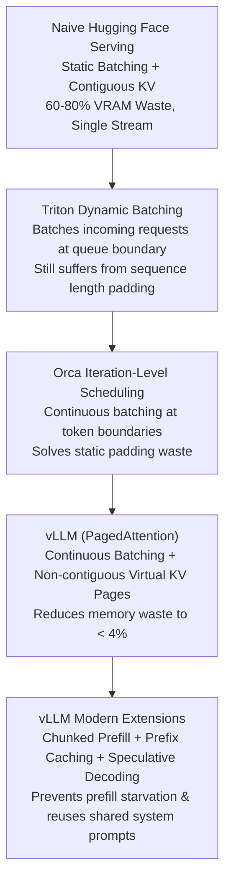
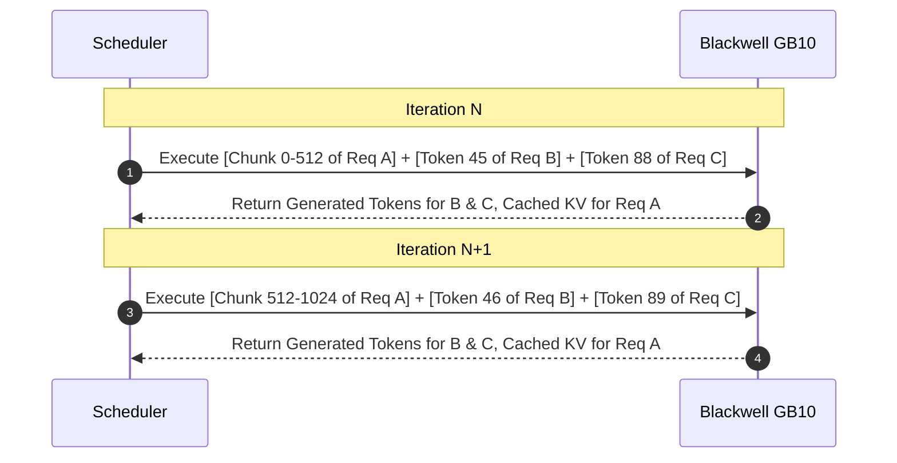

# 15. vLLM Serving for DeepSeek & Qwen — Production High-Throughput Engine

> **Target Audience**: AI Infrastructure Engineers, DevOps Specialists, and Backend Developers building production LLM inference endpoints.  
> **Prerequisites**: Understanding of LLM inference stages (Prefill vs. Decode from [01-multi-head-latent-attention-mla.md](01-multi-head-latent-attention-mla.md)) and memory sizing (from [12-memory-math-for-30b-32b-on-gb10.md](12-memory-math-for-30b-32b-on-gb10.md)).  
> **Estimated Study Time**: 60 minutes.  
> **What You Will Master**: The physical mechanics of **PagedAttention**, continuous in-flight batching, chunked prefill scheduling, speculative decoding integration, and tuning vLLM for peak concurrency on the **NVIDIA DGX Spark (GB10)**.

---

## 📑 Table of Contents
1. [Foundational Scaffolding: Why Naive Serving Collapses](#1-foundational-scaffolding-why-naive-serving-collapses)
2. [Co-Related Concepts & The Evolution of Serving Engines](#2-co-related-concepts--the-evolution-of-serving-engines)
3. [Deep First-Principles: PagedAttention & Block Tables](#3-deep-first-principles-pagedattention--block-tables)
4. [Continuous In-Flight Batching & Chunked Prefill Mechanics](#4-continuous-in-flight-batching--chunked-prefill-mechanics)
5. [Comparative Analysis: vLLM vs. SGLang vs. TensorRT-LLM vs. TGI](#5-comparative-analysis-vllm-vs-sglang-vs-tensorrt-llm-vs-tgi)
6. [Hardware Grounding: Tuning Flags for NVIDIA DGX Spark (GB10)](#6-hardware-grounding-tuning-flags-for-nvidia-dgx-spark-gb10)
7. [Production Deployment: CLI, Systemd Service & Healthchecks](#7-production-deployment-cli-systemd-service--healthchecks)
8. [Hands-On Python Lab: Async Streaming Client & Telemetry Benchmark](#8-hands-on-python-lab-async-streaming-client--telemetry-benchmark)
9. [Practice Exercises with Step-by-Step Solutions](#9-practice-exercises-with-step-by-step-solutions)
10. [Troubleshooting Guide & Diagnostic Runbook](#10-troubleshooting-guide--diagnostic-runbook)

---

## 1. Foundational Scaffolding: Why Naive Serving Collapses

### The Naive Serving Disaster
When beginners build an inference API using standard Hugging Face `pipeline` or `model.generate()`, they encounter catastrophic throughput ceilings:
1. **Static Batching Waste**: If Request A asks for 50 tokens and Request B asks for 1,000 tokens, the GPU runs Request A for 50 tokens, and then Request A sits idle in the batch, padding empty spaces with zero tokens until Request B finishes 950 tokens later!
2. **Contiguous Memory Allocation Trap**: Standard PyTorch requires pre-allocating a contiguous tensor for each sequence's Key-Value (KV) cache for the *maximum possible context* (e.g., 32,768 tokens). If the user only submits a 200-token prompt and gets a 100-token response, **99% of that pre-allocated GPU VRAM is wasted idle space** that cannot be given to any other user.
3. **Severe Memory Fragmentation**: Between internal fragmentation (over-allocating for max sequence length) and external fragmentation (freed buffers leaving jagged holes in memory), traditional frameworks waste **60% to 80% of GPU memory**.

```
                   CONVENTIONAL CONTIGUOUS ALLOCATION (60-80% WASTED)
┌────────────────────────────────────────────────────────────────────────────────────────┐
│ Request 1 (Prompt: 200 tok, Actual Gen: 100 tok)                                       │
│ [KV: 300 tokens used] │ [RESERVED UNUSED VRAM BUFFER: 32,468 TOKENS WASTED]           │
└────────────────────────────────────────────────────────────────────────────────────────┘
┌────────────────────────────────────────────────────────────────────────────────────────┐
│ Request 2 (Prompt: 500 tok, Actual Gen: 50 tok)                                        │
│ [KV: 550 tokens used] │ [RESERVED UNUSED VRAM BUFFER: 32,218 TOKENS WASTED]           │
└────────────────────────────────────────────────────────────────────────────────────────┘
```

### The Operating System Analogy: Virtual Memory Paging
Decades ago, operating systems faced this exact crisis with physical RAM. If an OS required contiguous RAM for every program, memory quickly fragmented and machines crashed. The solution was **Virtual Memory Paging**:
* Physical memory is divided into fixed-size pages (e.g., 4 KB).
* The OS maintains a **Page Table** that maps contiguous virtual addresses to arbitrary non-contiguous physical pages.
* **PagedAttention (invented by the vLLM team at UC Berkeley)** does the exact same thing for LLM Key-Value caches!

---

## 2. Co-Related Concepts & The Evolution of Serving Engines



### Key Serving Terminology Demystified
* **TTFT (Time To First Token)**: The latency from when a user hits "Send" until the first generated token appears on screen. Dominated by the compute-bound **Prefill phase**.
* **ITL (Inter-Token Latency)** or **TPOT (Time Per Output Token)**: The time between successive generated tokens during streaming. Dominated by the memory-bandwidth-bound **Decode phase**.
* **Continuous In-Flight Batching**: Instead of waiting for an entire batch to finish, new requests are injected into the running batch at *every single iteration* (token step), and finished requests are immediately evicted.
* **Prefix Caching**: Automatically detecting identical prompt prefixes (e.g., system instructions, few-shot examples, RAG documents) and reusing their existing KV cache instead of recomputing them.

---

## 3. Deep First-Principles: PagedAttention & Block Tables

### How PagedAttention Operates Under the Hood
1. Physical GPU memory dedicated to the KV cache is partitioned into a pool of fixed-size **Physical Blocks** (typically 16 or 32 tokens per block).
2. As a sequence generates tokens, vLLM allocates blocks on-demand from the free list.
3. A **Block Table** maintains the mapping from logical sequence positions to physical memory blocks:

```
LOGICAL SEQUENCE TOKENS: [ "The", "capital", "of", "France", "is", "Paris", ... ]
                          │◄────── Logical Block 0 ──────►│ │◄───── Logical Block 1 ──►│
                          (Tokens 0 - 3)                    (Tokens 4 - 7)

                              BLOCK TABLE MAPPING
                          Logical Block 0  ──►  Physical Block 42 (GPU Address 0x7F10)
                          Logical Block 1  ──►  Physical Block 105 (GPU Address 0x9A20)

PHYSICAL GPU VRAM POOL:
[Block 0] [Block 1] ... [Block 42 (Tokens 0-3)] ... [Block 105 (Tokens 4-7)] ... [Free Block]
```

### The Waste Equation
In PagedAttention, memory waste only occurs in the **very last block** of a sequence:

$$\text{Max Memory Waste Per Sequence} = (\text{Block Size} - 1) \times \text{Size of 1 Token KV Cache}$$

For a block size of 16 tokens, the average waste per sequence is only **8 tokens of KV cache** ($< 4\%$). This unlocks **4x to 8x higher concurrency** on the exact same GPU!

---

## 4. Continuous In-Flight Batching & Chunked Prefill Mechanics

### The Prefill Starvation Problem
When a user submits a massive 16,000-token prompt while 50 other users are actively streaming responses:
* Computing a 16k-token prefill requires hundreds of milliseconds of uninterrupted Tensor Core execution.
* If the engine runs the full prefill in one shot, all 50 ongoing decode streams **freeze** for 300 ms, causing severe jitter in Inter-Token Latency (ITL).

### Chunked Prefill Resolution
vLLM solves this using **Chunked Prefill** (`--enable-chunked-prefill`):
* Long prompts are divided into fixed chunks (e.g., 512 tokens).
* In each iteration, the scheduler pairs a 512-token chunk of the new prompt with the active single-token decode steps of all running requests.
* Compute-bound prefill operations are co-scheduled with memory-bound decode operations, achieving near **100% GPU compute and memory saturation simultaneously** without stalling user streams!



---

## 5. Comparative Analysis: vLLM vs. SGLang vs. TensorRT-LLM vs. TGI

| Feature / Capability | vLLM (v0.6+) | SGLang | NVIDIA TensorRT-LLM | Hugging Face TGI |
| :--- | :--- | :--- | :--- | :--- |
| **Primary Strength** | Broadest model support & industry ecosystem standard | Fastest Radix prefix caching & structured JSON output | Absolute highest raw FLOP throughput on Hopper/Blackwell | Battle-tested Hugging Face hub integration |
| **Paged KV Cache** | Yes (PagedAttention) | Yes (RadixAttention) | Yes (Paged KV) | Yes (PagedAttention) |
| **Prefix Caching** | Dynamic hash caching | Tree-based Radix tree | KV cache reuse | Yes |
| **Chunked Prefill** | Production default | Production default | Supported | Supported |
| **Quantization Support** | FP8, AWQ, GPTQ, Marlin, INT4 | FP8, AWQ, GPTQ, Marlin | Native FP8, FP4, INT4, AWQ | AWQ, GPTQ, FP8, EETQ |
| **Model Compilation** | PyTorch 2.0 `torch.compile` | Custom CUDA / Torch | Offline C++ TensorRT Engine build | Torch compile |
| **Speculative Decoding**| Draft model, Medusa, MTP | Draft model, Speculative | Medusa, Draft, Lookahead | Draft model |
| **Setup Complexity** | **Low (pip install vllm)** | **Low (pip install sglang)** | High (complex container builds) | Medium (Docker image) |

---

## 6. Hardware Grounding: Tuning Flags for NVIDIA DGX Spark (GB10)

The **NVIDIA DGX Spark** features an integrated **GB10 GPU with 128 GB of unified LPDDR5X memory** connected to a Grace ARM CPU via a **900 GB/s NVLink-C2C** bridge.

### Master Configuration Parameter Guide for GB10

```bash
# Recommended Production Flags for DeepSeek-R1-Distill-Qwen-32B on GB10
python3 -m vllm.entrypoints.openai.api_server \
  --model /data/models/DeepSeek-R1-Distill-Qwen-32B \
  --served-model-name deepseek-r1 \
  --host 0.0.0.0 \
  --port 8000 \
  --tensor-parallel-size 1 \
  --gpu-memory-utilization 0.92 \
  --max-model-len 32768 \
  --max-num-seqs 128 \
  --max-num-batched-tokens 8192 \
  --enable-chunked-prefill \
  --enable-prefix-caching \
  --kv-cache-dtype fp8 \
  --trust-remote-code
```

### Explaining the GB10 Tuning Flags:
1. `--gpu-memory-utilization 0.92`:
   * $128 \text{ GB} \times 0.92 = 117.76 \text{ GB}$ managed by vLLM.
   * Model weights (in FP8): ~32 GB.
   * Activation working memory: ~4 GB.
   * **Remaining Dedicated KV Cache Pool**: $117.76 - 36 = 81.76 \text{ GB}$!
2. `--kv-cache-dtype fp8`:
   * Compresses each Key and Value tensor from 16-bit to 8-bit.
   * Doubles the maximum number of concurrent tokens that can be stored in the 81.76 GB pool from ~130,000 to **~260,000 cached tokens**!
3. `--max-num-batched-tokens 8192`:
   * Limits iteration prefill workload to 8,192 tokens to ensure Tensor Core execution time per iteration stays under 40 milliseconds.
4. `--enable-prefix-caching`:
   * Reuses common system prompts (such as complex coding system instructions or long RAG documents) across multiple user queries with 0 ms prefill recomputation.

---

## 7. Production Deployment: CLI, Systemd Service & Healthchecks

### Systemd Production Unit (`/etc/systemd/system/vllm.service`)

```ini
[Unit]
Description=vLLM Production Inference Engine for DeepSeek-R1-32B
After=network.target nvidia-persistenced.service
Wants=nvidia-persistenced.service

[Service]
Type=simple
User=root
WorkingDirectory=/data
Environment="HF_HOME=/data/models/cache"
Environment="CUDA_VISIBLE_DEVICES=0"
Environment="VLLM_ENGINE_ITERATION_TIMEOUT_S=60"
ExecStart=/usr/local/bin/python3 -m vllm.entrypoints.openai.api_server \
  --model /data/models/DeepSeek-R1-Distill-Qwen-32B \
  --served-model-name deepseek-r1 \
  --host 0.0.0.0 \
  --port 8000 \
  --tensor-parallel-size 1 \
  --gpu-memory-utilization 0.92 \
  --max-model-len 32768 \
  --max-num-seqs 128 \
  --enable-chunked-prefill \
  --enable-prefix-caching \
  --kv-cache-dtype fp8 \
  --trust-remote-code

# Resilience & Auto-Restart Policies
Restart=always
RestartSec=5s
LimitNOFILE=1048576
LimitMEMLOCK=infinity
TimeoutStartSec=300

[Install]
WantedBy=multi-user.target
```

### Management Commands
```bash
# Reload systemd and start service
sudo systemctl daemon-reload
sudo systemctl enable --now vllm.service

# Inspect live startup logs
sudo journalctl -u vllm.service -f

# Verify API healthcheck
curl -s http://localhost:8000/health | jq .
# Expected Output: {} (HTTP 200 OK)
```

---

## 8. Hands-On Python Lab: Async Streaming Client & Telemetry Benchmark

This self-contained Python script queries the running vLLM server, streams responses token-by-token, and calculates exact **Time To First Token (TTFT)** and **Inter-Token Latency (ITL)** metrics.

```python
#!/usr/bin/env python3
"""
benchmark_vllm_stream.py
Asynchronous client measuring live TTFT, ITL, and total generation throughput.
"""

import time
import json
import asyncio
import aiohttp

API_URL = "http://localhost:8000/v1/chat/completions"
MODEL_NAME = "deepseek-r1"

PROMPT = "Provide a comprehensive architectural explanation of PagedAttention in modern LLM serving engines."

async def query_streaming():
    headers = {"Content-Type": "application/json"}
    payload = {
        "model": MODEL_NAME,
        "messages": [{"role": "user", "content": PROMPT}],
        "temperature": 0.6,
        "max_tokens": 512,
        "stream": True
    }
    
    start_time = time.perf_counter()
    first_token_time = None
    token_timestamps = []
    generated_text = []

    print("[*] Dispatching request to vLLM engine...")
    async with aiohttp.ClientSession() as session:
        async with session.post(API_URL, headers=headers, json=payload) as response:
            if response.status != 200:
                print(f"[!] Error: Server returned HTTP {response.status}")
                return

            async for line in response.content:
                decoded = line.decode('utf-8').strip()
                if not decoded or not decoded.startswith("data: "):
                    continue
                data_str = decoded[6:]
                if data_str == "[DONE]":
                    break
                
                try:
                    data = json.loads(data_str)
                    delta = data["choices"][0]["delta"]
                    content = delta.get("content", "")
                    if content:
                        now = time.perf_counter()
                        if first_token_time is None:
                            first_token_time = now
                        token_timestamps.append(now)
                        generated_text.append(content)
                        # Print token stream to stdout
                        print(content, end="", flush=True)
                except json.JSONDecodeError:
                    continue

    end_time = time.perf_counter()
    print("\n\n" + "=" * 60)
    print("TELEMETRY PERFORMANCE REPORT")
    print("=" * 60)
    
    total_tokens = len(token_timestamps)
    if total_tokens > 1:
        ttft_ms = (first_token_time - start_time) * 1000
        total_gen_time = end_time - first_token_time
        tokens_per_sec = (total_tokens - 1) / total_gen_time
        
        # Calculate inter-token latencies
        itls = [(token_timestamps[i] - token_timestamps[i-1]) * 1000 for i in range(1, total_tokens)]
        avg_itl_ms = sum(itls) / len(itls)
        p95_itl_ms = sorted(itls)[int(len(itls) * 0.95)]
        
        print(f"Total Output Tokens   : {total_tokens}")
        print(f"Time To First Token   : {ttft_ms:.2f} ms")
        print(f"Avg Inter-Token Latency: {avg_itl_ms:.2f} ms/token")
        print(f"P95 Inter-Token Latency: {p95_itl_ms:.2f} ms/token")
        print(f"Generation Throughput : {tokens_per_sec:.2f} tokens/second")
    print("=" * 60)

if __name__ == "__main__":
    asyncio.run(query_streaming())
```

---

## 9. Practice Exercises with Step-by-Step Solutions

### Exercise 1: Computing KV Cache Sizing & Concurrency
**Scenario**: You deploy `Qwen2.5-32B` on the DGX Spark (GB10).
* Model architecture: 64 layers, 8 KV heads ($GQA$), head dimension $d_k = 128$.
* After loading FP8 weights and runtime buffers, you have **80 GB** of VRAM free for the PagedAttention KV cache pool.
* Each user session requires an average context of **4,096 tokens**.

**Question**: 
1. How many bytes of KV cache are required per token in FP16 precision?
2. How many bytes of KV cache are required per token in FP8 precision?
3. How many concurrent 4,096-token sessions can be served simultaneously in FP8?

#### Solution:
1. **Calculate FP16 KV size per token**:
   $$\text{Bytes per token} = 2 \times L \times n_{kv} \times d_k \times \text{Precision Bytes}$$
   $$\text{Bytes} = 2 \times 64 \times 8 \times 128 \times 2 = 262,144 \text{ Bytes} = 256 \text{ KiB per token}$$
2. **Calculate FP8 KV size per token**:
   $$\text{Bytes (FP8)} = 2 \times 64 \times 8 \times 128 \times 1 = 131,072 \text{ Bytes} = 128 \text{ KiB per token}$$
3. **Calculate total token capacity in 80 GB**:
   $$\text{Total Tokens} = \frac{80 \times 10^9 \text{ Bytes}}{131,072 \text{ Bytes/token}} \approx 610,351 \text{ tokens}$$
4. **Calculate concurrent 4k sessions**:
   $$\text{Concurrent Sessions} = \frac{610,351 \text{ tokens}}{4,096 \text{ tokens/session}} \approx \mathbf{149 \text{ concurrent sessions!}}$$

---

### Exercise 2: Prefix Caching Math in Multi-Turn Agentic Chat
**Scenario**: An enterprise agentic customer support bot uses a **3,500-token system prompt** containing company policy and tool descriptions. Each user turn adds 100 new tokens of conversation.
Without prefix caching, a 10-turn conversation requires recomputing the 3,500-token prompt on every turn.
**Question**: With `--enable-prefix-caching`, what percentage of prompt prefill FLOPs are saved over a 10-turn conversation?

#### Solution:
* **Without Prefix Caching**:
  * Turn 1: 3,500 + 100 = 3,600 prefill tokens
  * Turn 2: 3,500 + 200 = 3,700 prefill tokens
  * Turn $i$: $3,500 + 100 \times i$
  * Total Prefill Tokens = $\sum_{i=1}^{10} (3,500 + 100 \times i) = 35,000 + 5,500 = \mathbf{40,500 \text{ tokens computed}}$.
* **With Prefix Caching**:
  * Turn 1: 3,600 tokens computed (and 3,500 cached).
  * Turns 2 through 10: Only the incremental 100 new tokens are computed per turn!
  * Total Prefill Tokens = $3,600 + (9 \times 100) = \mathbf{4,500 \text{ tokens computed}}$.
* **Total FLOP Savings**:
  $$\text{Savings} = \frac{40,500 - 4,500}{40,500} = \frac{36,000}{40,500} = \mathbf{88.89\% \text{ reduction in compute latency!}}$$

---

## 10. Troubleshooting Guide & Diagnostic Runbook

### Issue 1: `ValueError: The model's max_model_len (131072) is larger than the maximum number of tokens that can be stored in KV cache (64000)`
* **Root Cause**: The model's config specifies a 128k native context window, but the GPU VRAM pool cannot support a single 128k sequence without running out of memory.
* **Remediation**: Explicitly restrict `--max-model-len` to match your intended production context (e.g., `--max-model-len 32768`).

### Issue 2: CUDA Graph Capture Crash (`CUDA error: out of memory`) During Warmup
* **Root Cause**: vLLM captures CUDA graphs for various batch sizes during initialization. If `--gpu-memory-utilization` is set too high (e.g. 0.98), there is insufficient workspace memory for the CUDA graph allocator.
* **Remediation**: Lower `--gpu-memory-utilization` from 0.98 to **0.90 or 0.92**, or append `--enforce-eager` to disable CUDA graph compilation if memory is ultra-constrained.

### Issue 3: Port 8000 Already in Use
* **Diagnosis**:
  ```bash
  sudo lsof -i :8000
  ```
* **Remediation**: Terminate the zombie process or launch vLLM on a distinct port:
  ```bash
  python3 -m vllm.entrypoints.openai.api_server ... --port 8001
  ```

---

## 🔗 Related Curriculum Modules
* **Underlying Architecture**: [01-multi-head-latent-attention-mla.md](01-multi-head-latent-attention-mla.md)
* **Memory Budgeting**: [12-memory-math-for-30b-32b-on-gb10.md](12-memory-math-for-30b-32b-on-gb10.md)
* **Prefix Caching Alternative Engine**: [16-sglang-and-radix-attention-serving.md](16-sglang-and-radix-attention-serving.md)
* **Kubernetes Orchestration**: [19-kubernetes-manifests-for-deepseek.md](19-kubernetes-manifests-for-deepseek.md)
