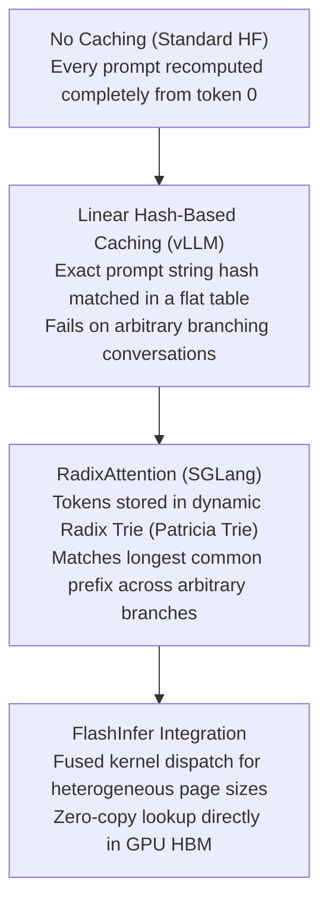
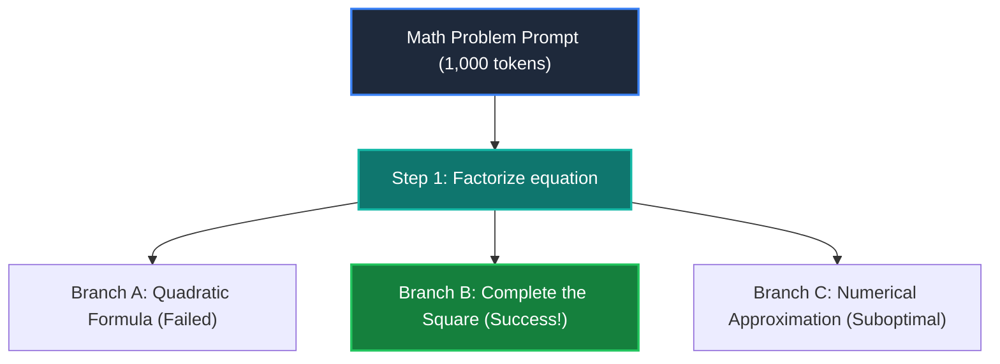

# 16. SGLang & RadixAttention Serving — Radix Tree Caching & Complex Reasoning

> **Target Audience**: AI Systems Engineers, Agentic Workflow Developers, and Infrastructure Specialists building high-concurrency multi-turn chat and structured reasoning pipelines.  
> **Prerequisites**: Understanding of Key-Value (KV) cache mechanics (from [01-multi-head-latent-attention-mla.md](01-multi-head-latent-attention-mla.md)) and PagedAttention (from [15-vllm-serving-deepseek-and-qwen.md](15-vllm-serving-deepseek-and-qwen.md)).  
> **Estimated Study Time**: 55 minutes.  
> **What You Will Master**: The algorithmic foundations of **RadixAttention**, dynamic KV cache tree management, zero-compute prefix reuse for reasoning agents, and constrained JSON decoding on the **NVIDIA DGX Spark (GB10)**.

---

## 📑 Table of Contents
1. [Foundational Scaffolding: The Multi-Turn Redundancy Trap](#1-foundational-scaffolding-the-multi-turn-redundancy-trap)
2. [Co-Related Concepts & The Evolution of Prefix Caching](#2-co-related-concepts--the-evolution-of-prefix-caching)
3. [Deep First-Principles: Radix Tree Data Structure & Mechanics](#3-deep-first-principles-radix-tree-data-structure--mechanics)
4. [Agentic Tree-of-Thought & Reasoning Branching](#4-agentic-tree-of-thought--reasoning-branching)
5. [Constrained Decoding & Fast Structured JSON Generation](#5-constrained-decoding--fast-structured-json-generation)
6. [Comparative Analysis: SGLang vs. vLLM vs. Outlines vs. TensorRT-LLM](#6-comparative-analysis-sglang-vs-vllm-vs-outlines-vs-tensorrt-llm)
7. [Hardware Grounding: Production SGLang Setup on NVIDIA DGX Spark](#7-hardware-grounding-production-sglang-setup-on-nvidia-dgx-spark)
8. [Hands-On Python Lab: Simulating Radix Tree KV Cache Management](#8-hands-on-python-lab-simulating-radix-tree-kv-cache-management)
9. [Practice Exercises with Step-by-Step Solutions](#9-practice-exercises-with-step-by-step-solutions)
10. [Troubleshooting Guide & Diagnostic Runbook](#10-troubleshooting-guide--diagnostic-runbook)

---

## 1. Foundational Scaffolding: The Multi-Turn Redundancy Trap

### The Hidden Bottleneck in Conversational AI
Consider a typical 5-turn interaction between a developer and an AI assistant:
* **Turn 1**: The user sends a 2,000-token system prompt (coding guidelines, API documentation) plus a 50-token query. The model computes the prefill for **2,050 tokens**.
* **Turn 2**: The user asks a 30-token follow-up. Standard inference engines concatenate: `System Prompt (2,000) + Turn 1 Q (50) + Turn 1 A (300) + Turn 2 Q (30) = 2,380 tokens`. The engine **re-computes all 2,380 tokens from scratch**!
* **Turn 5**: The context has expanded to 4,500 tokens. The engine spends 90% of its execution time and power recalculating Key-Value vectors for tokens it has already seen four times!

```
                  NAIVE RE-COMPUTATION IN MULTI-TURN SESSIONS
Turn 1: [System: 2000 tok] [Q1: 50 tok]  ──► Compute 2050 tok
Turn 2: [System: 2000 tok] [Q1: 50 tok] [A1: 300 tok] [Q2: 30 tok]  ──► Re-compute 2380 tok!
Turn 3: [System: 2000 tok] [Q1: 50 tok] [A1: 300 tok] [Q2: 30 tok] [A2: 250 tok] [Q3: 40 tok] ──► Re-compute 2670 tok!
Total Redundant Prefill Computations: > 7,000 FLOPs squandered on identical tokens!
```

### The Bookmark Analogy
If you are reading an encyclopedia and pause to ask a librarian a question about page 40, you do not close the book, walk back to the entrance, re-read pages 1 through 39, and then ask your second question. You simply keep your bookmark on page 40.
**RadixAttention (created by the LMSYS research team behind SGLang)** provides an automated, multi-branching bookmarking system for GPU VRAM.

---

## 2. Co-Related Concepts & The Evolution of Prefix Caching



### Key Differences Between Hash-Based and Radix-Based Caching
* **Linear Hash Caching (vLLM)**: Computes a cryptographic hash of the prompt prefix (e.g., tokens 0 to 1,024). If the hash matches, it reuses those blocks. However, if a conversation branches or shares an intermediate segment, matching breaks down.
* **RadixAttention (SGLang)**: Maintains an active tree data structure in host memory where edges represent sequences of tokens, and nodes represent physical KV cache page pointers. It supports **arbitrary branching, tree-of-thought exploration, and dynamic LRU pruning**.

---

## 3. Deep First-Principles: Radix Tree Data Structure & Mechanics

A **Radix Tree** (or Compact Trie) is a space-optimized tree where each node with only one child is merged with its child. In SGLang:
* **Nodes**: Hold references to physical GPU KV cache blocks.
* **Edges**: Represent sequences of token IDs.
* **Reference Counts**: Track how many active requests are currently reading from this branch of the tree.
* **Timestamps**: Record the last access time for Least-Recently-Used (LRU) eviction when VRAM fills up.

```
                                  [ROOT NODE]
                                       │
                      "You are an expert engineer..." (Tokens 0-1999)
                      [Node 1: GPU KV Blocks #10 to #55]
                                       │
               ┌───────────────────────┴───────────────────────┐
               │                                               │
   "Explain MLA compression"                       "Write a Kubernetes Pod"
   (Tokens 2000-2025)                              (Tokens 2000-2035)
   [Node 2: Blocks #56-#62]                        [Node 4: Blocks #70-#78]
               │                                               │
   "MLA compresses KV into..."                     "apiVersion: v1..."
   (Tokens 2026-2150)                              (Tokens 2036-2180)
   [Node 3: Blocks #63-#69]                        [Node 5: Blocks #79-#85]
               │
      USER ASKS TURN 2:
   "What is Decoupled RoPE?"
   ──► CACHE HIT: 2,150 TOKENS!
   ──► PREFILL REQUIRED: ONLY 5 TOKENS!
```

### The Three Core Tree Operations:
1. **Prefix Match**: When a new prompt arrives, traverse down the tree from the root, matching token sequences. If 2,150 tokens match, the engine loads their KV block pointers directly into the forward pass. **Time To First Token drops from 350 ms to 4 ms!**
2. **Node Insertion & Split**: When a running request generates new tokens, they are appended to the tree. If two users share a 500-token prefix but diverge at token 501, the existing node is split into a parent (shared prefix) and two children.
3. **LRU Eviction**: When GPU memory exceeds a high-water mark (e.g., 90% VRAM utilization), the tree traverses its **leaf nodes with a reference count of 0** (no active users), evicting the oldest leaves to free physical pages.

---

## 4. Agentic Tree-of-Thought & Reasoning Branching

Complex reasoning models like **DeepSeek-R1** frequently utilize search algorithms:
* **Best-of-$N$ Sampling**: Generating $N=16$ candidate solutions to a math problem and picking the best one via a verifier.
* **Tree-of-Thought (ToT)**: Exploring multiple reasoning trajectories, backtracking when an error occurs, and branching from an earlier premise.



Under conventional serving engines, generating 16 branches of 2,048 tokens each requires computing:
$$\text{Tokens} = 16 \times (1,000 + 2,048) = \mathbf{48,768 \text{ prefill tokens}}$$

Under SGLang with RadixAttention:
* The 1,000-token prompt is computed **exactly once** and locked in the root node.
* Step 1 (200 tokens) is computed **once**.
* Total Prefill Tokens = $1,000 + 200 + (16 \times \text{branch delta}) \approx \mathbf{12,400 \text{ tokens (74% compute savings!)}}$.

---

## 5. Constrained Decoding & Fast Structured JSON Generation

Modern AI agents must emit strictly structured JSON to interact with external databases and APIs.
Traditional methods (such as prompting `"Return only valid JSON"` or using naive Python post-processing) frequently fail due to hallucinations or syntax errors.

### SGLang's Compressed Finite-State Automata (FSA)
SGLang compiles a target JSON Schema or Regular Expression into a **Grammar State Machine** executed directly on the GPU:
1. At each token decoding step, the FSA determines the set of mathematically legal vocabulary tokens.
2. In the final Softmax projection, all illegal tokens have their logits set to $-\infty$.
3. Result: **100% syntactically valid JSON output** guaranteed on the very first pass, with **zero post-processing retries and near-zero latency penalty**.

---

## 6. Comparative Analysis: SGLang vs. vLLM vs. Outlines vs. TensorRT-LLM

| Feature / Dimension | SGLang (LMSYS) | vLLM (v0.6+) | Outlines + vLLM | NVIDIA TensorRT-LLM |
| :--- | :--- | :--- | :--- | :--- |
| **Prefix Caching Engine** | Dynamic Radix Tree (Trie) | Flat Hash-Based Cache | Delegated to vLLM | Fixed Context Cache |
| **Multi-Turn Chat Speedup** | **10x to 15x TTFT reduction**| 3x to 5x TTFT reduction| 3x to 5x TTFT reduction | 2x to 4x TTFT reduction |
| **Agent Tree-of-Thought** | **Native Zero-Copy Branching**| Partial reuse | Partial reuse | Manual management |
| **Constrained JSON Engine**| High-Speed Native FSA | Outlines integration | Outlines Library | Guided decoding |
| **Attention Backend** | FlashInfer / FlashMLA | FlashAttention-3 / FlashMLA | FlashAttention-3 | C++ Fused MHA |
| **Target Workload** | **Conversational Agents, RAG, Reasoning** | **Broad enterprise serving, high static batching** | Structured data extraction | Extreme raw FLOP throughput |

---

## 7. Hardware Grounding: Production SGLang Setup on NVIDIA DGX Spark

The **NVIDIA DGX Spark** (Grace ARM CPU + Blackwell GB10 GPU with 128 GB Unified Memory) is the premier platform for SGLang:

### SGLang CLI Launch Command on DGX Spark:
```bash
# Launch SGLang server with FlashInfer kernels and RadixAttention
python3 -m sglang.launch_server \
  --model-path /data/models/DeepSeek-R1-Distill-Qwen-32B \
  --port 30000 \
  --host 0.0.0.0 \
  --tp-size 1 \
  --mem-fraction-static 0.88 \
  --context-length 32768 \
  --enable-flashinfer \
  --trust-remote-code
```

### Explaining the DGX Spark Parameters:
* `--mem-fraction-static 0.88`: Reserves 88% of the 128 GB unified memory (~112.6 GB) for weights and the Radix KV cache pool.
* `--context-length 32768`: Restricts tree depth to 32k tokens to prevent memory exhaustion on extreme prompts.
* `--enable-flashinfer`: Activates customized FlashInfer kernels that accelerate attention computation across non-contiguous Radix Tree pages on Blackwell architectures.

---

## 8. Hands-On Python Lab: Simulating Radix Tree KV Cache Management

This runnable Python script implements a pure-Python **Radix Tree KV Cache Simulator** demonstrating prefix matching, node insertion, and zero-compute token reuse.

```python
#!/usr/bin/env python3
"""
radix_attention_simulation.py
Simulates Radix Tree prefix matching and KV cache reuse from first principles.
"""

import time

class RadixNode:
    def __init__(self, token_ids, physical_blocks=None):
        self.token_ids = token_ids  # List of integer token IDs
        self.physical_blocks = physical_blocks or []  # Simulated GPU VRAM page IDs
        self.children = {}  # Map: first_token_id -> RadixNode
        self.last_accessed = time.time()
        self.ref_count = 0

class RadixTreeKVCache:
    def __init__(self):
        self.root = RadixNode(token_ids=[])
        self.total_cached_tokens = 0
        self.block_counter = 0

    def _allocate_blocks(self, count):
        blocks = list(range(self.block_counter, self.block_counter + count))
        self.block_counter += count
        return blocks

    def match_prefix(self, prompt_tokens):
        """
        Traverses the tree to find the longest matching prefix for incoming prompt_tokens.
        Returns: (matched_tokens_count, list_of_reused_gpu_blocks)
        """
        curr = self.root
        matched_tokens = 0
        reused_blocks = []
        idx = 0
        
        while idx < len(prompt_tokens):
            first_tok = prompt_tokens[idx]
            if first_tok not in curr.children:
                break  # Branch diverges; stop matching
            
            child = curr.children[first_tok]
            edge_len = len(child.token_ids)
            
            # Check how much of child.token_ids matches prompt_tokens[idx : idx + edge_len]
            match_len = 0
            while match_len < edge_len and (idx + match_len) < len(prompt_tokens):
                if child.token_ids[match_len] == prompt_tokens[idx + match_len]:
                    match_len += 1
                else:
                    break
                    
            if match_len == edge_len:
                # Full edge matched! Advance deeper into the tree
                matched_tokens += edge_len
                reused_blocks.extend(child.physical_blocks)
                child.last_accessed = time.time()
                curr = child
                idx += edge_len
            else:
                # Partial edge match
                matched_tokens += match_len
                reused_blocks.extend(child.physical_blocks[:match_len])
                break
                
        return matched_tokens, reused_blocks

    def insert(self, prompt_tokens):
        """
        Inserts new prompt tokens into the Radix Tree.
        """
        matched_tokens, _ = self.match_prefix(prompt_tokens)
        remaining_tokens = prompt_tokens[matched_tokens:]
        
        if not remaining_tokens:
            return  # Entire prompt already cached!
            
        # Allocate mock GPU VRAM blocks for new tokens
        new_blocks = self._allocate_blocks(len(remaining_tokens))
        
        # Navigate to the insertion insertion point
        curr = self.root
        idx = 0
        while idx < matched_tokens:
            first_tok = prompt_tokens[idx]
            child = curr.children[first_tok]
            idx += len(child.token_ids)
            curr = child
            
        # Insert remaining as a new child branch
        new_node = RadixNode(token_ids=remaining_tokens, physical_blocks=new_blocks)
        curr.children[remaining_tokens[0]] = new_node
        self.total_cached_tokens += len(remaining_tokens)

if __name__ == "__main__":
    cache = RadixTreeKVCache()
    
    # 1. System Prompt (Tokens 100 to 110)
    sys_prompt = [100, 101, 102, 103, 104, 105]
    print(f"[*] Turn 1: Inserting System Prompt ({len(sys_prompt)} tokens)...")
    cache.insert(sys_prompt)
    
    # User A asks Question 1 (Tokens 201 to 203)
    user_a_prompt = sys_prompt + [201, 202, 203]
    matched, blocks = cache.match_prefix(user_a_prompt)
    print(f"[*] User A Query: Total {len(user_a_prompt)} tokens.")
    print(f"    -> Radix Cache Hit: {matched} tokens! Reused GPU Blocks: {blocks}")
    print(f"    -> Physical Prefill Required: ONLY {len(user_a_prompt) - matched} tokens!")
    cache.insert(user_a_prompt)
    
    # User B asks a different Question (Tokens 301 to 304) with the same System Prompt
    user_b_prompt = sys_prompt + [301, 302, 303, 304]
    matched_b, blocks_b = cache.match_prefix(user_b_prompt)
    print(f"\n[*] User B Query (Branching): Total {len(user_b_prompt)} tokens.")
    print(f"    -> Radix Cache Hit: {matched_b} tokens! Reused GPU Blocks: {blocks_b}")
    print(f"    -> Physical Prefill Required: ONLY {len(user_b_prompt) - matched_b} tokens!")
    
    print("\n[✓] Radix Tree simulation verified. Shared prompt prefill computation eliminated!")
```

---

## 9. Practice Exercises with Step-by-Step Solutions

### Exercise 1: Quantifying TTFT Reduction in Best-of-8 Reasoning
**Scenario**: You run a mathematical reasoning pipeline on the DGX Spark using `DeepSeek-R1-Distill-32B`.
* Problem prompt length: **2,500 tokens**.
* Generation policy: Best-of-8 (generating 8 parallel candidate solutions of 1,024 tokens each).
* Hardware compute throughput during prefill: **5,000 tokens/second**.

**Question**: 
1. How long does the prefill stage take across all 8 candidates *without* RadixAttention?
2. How long does the prefill stage take *with* RadixAttention?
3. What is the total latency and compute savings?

#### Solution:
1. **Without RadixAttention**:
   * All 8 candidates must prefill the full 2,500-token prompt independently.
   * Total Prefill Tokens = $8 \times 2,500 = 20,000 \text{ tokens}$.
   * Prefill Latency = $\frac{20,000}{5,000} = \mathbf{4.00 \text{ seconds}}$.
2. **With RadixAttention**:
   * The 2,500-token prompt is prefilled **only once**.
   * Candidates 2 through 8 experience a **100% cache hit** on the prompt.
   * Total Prefill Tokens = $2,500 \text{ tokens}$.
   * Prefill Latency = $\frac{2,500}{5,000} = \mathbf{0.50 \text{ seconds}}$.
3. **Savings**:
   * Latency drops from 4.00s to 0.50s (**8x faster response time!**).
   * Total compute reduction = $\frac{20,000 - 2,500}{20,000} = \mathbf{87.5\% \text{ reduction in GPU energy & compute}}$.

---

## 10. Troubleshooting Guide & Diagnostic Runbook

### Issue 1: `ImportError: cannot import name 'flashinfer'`
* **Root Cause**: FlashInfer pre-built wheels are compiled for specific CUDA versions and x86_64 architectures. The DGX Spark runs on **Grace ARM64 (aarch64)**.
* **Remediation**: Build FlashInfer from source with ARM64 flags:
  ```bash
  git clone https://github.com/flashinfer-ai/flashinfer.git --recursive
  cd flashinfer
  pip install -e . --no-build-isolation
  ```

### Issue 2: Low Cache Hit Rate in Multi-Turn Chat
* **Root Cause**: The client application is injecting dynamic timestamps or nonces (e.g. `"Current time: 14:02:15"`) at the **beginning** of the system prompt. Because the very first tokens diverge, the Radix Tree cannot match any child branches!
* **Remediation**: Re-order the prompt layout:
  * Place completely static text (Guidelines, Tool Definitions) at the **very top** (Tokens 0 to $N$).
  * Place dynamic variables (User ID, Timestamps) at the **bottom**, immediately before the user query.

---

## 🔗 Related Curriculum Modules
* **Underlying Attention Architecture**: [01-multi-head-latent-attention-mla.md](01-multi-head-latent-attention-mla.md)
* **High-Throughput Serving Alternative**: [15-vllm-serving-deepseek-and-qwen.md](15-vllm-serving-deepseek-and-qwen.md)
* **Local Quantized Serving**: [17-ollama-and-llamacpp-local-gguf.md](17-ollama-and-llamacpp-local-gguf.md)
* **Structured Tool Calling**: [30-tool-calling-and-agentic-json.md](30-tool-calling-and-agentic-json.md)
