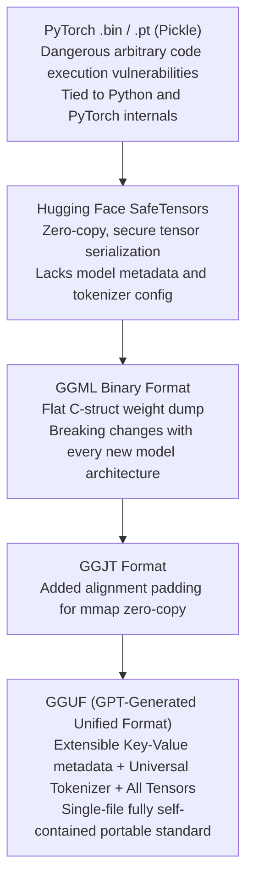

# 17. Ollama & llama.cpp Local GGUF — Lightweight Testing & CPU/GPU Offloading

> **Target Audience**: AI Developers, Edge Computing Engineers, and QA Teams requiring rapid local model execution, offline test suites, and zero-dependency deployments.  
> **Prerequisites**: Basic C/C++ compilation concepts, command-line terminal navigation, and quantization foundations (from [04-fp8-mixed-precision-framework.md](04-fp8-mixed-precision-framework.md)).  
> **Estimated Study Time**: 50 minutes.  
> **What You Will Master**: The binary anatomy of the **GGUF format**, the mathematical mechanics of **K-quants (Q4_K_M, Q8_0)**, compiling `llama.cpp` natively on Grace ARM64, and configuring Ollama for reasoning models on the **NVIDIA DGX Spark (GB10)**.

---

## 📑 Table of Contents
1. [Foundational Scaffolding: The C/C++ Zero-Dependency Philosophy](#1-foundational-scaffolding-the-cc-zero-dependency-philosophy)
2. [Co-Related Concepts & The Evolution of GGUF](#2-co-related-concepts--the-evolution-of-gguf)
3. [Deep First-Principles: GGUF Binary Anatomy & K-Quants Math](#3-deep-first-principles-gguf-binary-anatomy--k-quants-math)
4. [Unified Memory Supercharging: NVLink-C2C vs. PCIe Bottlenecks](#4-unified-memory-supercharging-nvlink-c2c-vs-pcie-bottlenecks)
5. [Comparative Analysis: llama.cpp vs. vLLM vs. ExLlamaV2 vs. llamafile](#5-comparative-analysis-llamacpp-vs-vllm-vs-exllamav2-vs-llamafile)
6. [Hardware Grounding: Native Compilation on DGX Spark (Grace ARM64 + GB10)](#6-hardware-grounding-native-compilation-on-dgx-spark-grace-arm64--gb10)
7. [Production Deployment: Ollama Service & Custom Reasoning Modelfiles](#7-production-deployment-ollama-service--custom-reasoning-modelfiles)
8. [Hands-On Python Lab: Direct HTTP Streaming Client for Ollama](#8-hands-on-python-lab-direct-http-streaming-client-for-ollama)
9. [Practice Exercises with Step-by-Step Solutions](#9-practice-exercises-with-step-by-step-solutions)
10. [Troubleshooting Guide & Diagnostic Runbook](#10-troubleshooting-guide--diagnostic-runbook)

---

## 1. Foundational Scaffolding: The C/C++ Zero-Dependency Philosophy

### The Python Ecosystem Tax
Production Python inference frameworks (such as PyTorch, vLLM, and Hugging Face) carry an immense operational footprint:
* **Disk Footprint**: A standard PyTorch + CUDA 12 environment easily consumes 10 GB to 15 GB of disk space.
* **Warmup Latency**: Initializing Python runtimes, importing torch, and capturing CUDA graphs takes 30 to 90 seconds.
* **Interpreter Overhead**: Python's Global Interpreter Lock (GIL) and runtime memory management introduce latency jitter.

### The Single-Binary Alternative
**`llama.cpp` (created by Georgi Gerganov)** rewrites LLM tensor execution in pure, dependency-free C and C++.
* It compiles down to a single standalone binary with zero external runtime requirements.
* It cold-starts in **under 500 milliseconds**.
* **Ollama** wraps `llama.cpp` in an intuitive, Docker-like CLI and REST API daemon, making local model management as simple as running `ollama run deepseek-r1:32b`.

```
                  PYTHON RUNTIME VS. NATIVE C++ RUNTIME
┌──────────────────────────────────────┐     ┌──────────────────────────────────────┐
│        Python Serving (vLLM)         │     │         Native C++ (llama.cpp)       │
│  - Python Interpreter + GIL          │     │  - Single Compiled C++ Executable    │
│  - PyTorch (2.5 GB) + Triton + CUDA  │     │  - Zero external shared libraries    │
│  - 30-90s Warmup & CUDA Graph Capt.  │     │  - <500ms Instant Cold-Start         │
│  - Designed for 100+ Concurrency     │     │  - Designed for Single-User / Edge   │
└──────────────────────────────────────┘     └──────────────────────────────────────┘
```

---

## 2. Co-Related Concepts & The Evolution of GGUF

To understand why the **GGUF** format exists, one must trace the file format iterations that preceded it:



### What Makes GGUF Unique?
A `.gguf` file is completely **self-contained**. It embeds:
1. **Model Hyperparameters**: Hidden dimensions, layer counts, head counts, RoPE base frequency.
2. **Complete Tokenizer Vocabulary**: BPE / WordPiece merges, special tokens, chat templates.
3. **Quantized Tensor Data**: All weights pre-formatted into byte-aligned blocks suitable for instant memory mapping (`mmap()`).

---

## 3. Deep First-Principles: GGUF Binary Anatomy & K-Quants Math

### Binary Layout of a GGUF File
When `llama.cpp` loads a GGUF file, it uses `mmap()` to map the file directly into virtual memory in microseconds:

```
┌────────────────────────────────────────────────────────────────────────┐
│ GGUF HEADER (Magic Bytes: 0x47 0x47 0x55 0x46 = 'GGUF')                │
│ Version (e.g., 3) │ Tensor Count (e.g., 362) │ Metadata KV Count       │
├────────────────────────────────────────────────────────────────────────┤
│ METADATA KEY-VALUE DICTIONARY                                          │
│ - general.architecture = "qwen2"                                       │
│ - qwen2.context_length = 32768                                         │
│ - tokenizer.ggml.tokens = ["<|endoftext|>", "The", "world", ...]      │
├────────────────────────────────────────────────────────────────────────┤
│ TENSOR INFO DIRECTORY                                                  │
│ - "blk.0.attn_q.weight": Shape [4096, 4096], Offset: 0x1A400, Type: Q4 │
│ - "blk.0.attn_k.weight": Shape [4096, 512],  Offset: 0x2A800, Type: Q4 │
├────────────────────────────────────────────────────────────────────────┤
│ ALIGNED TENSOR BINARY DATA (Raw Quantized Weight Blocks)               │
│ [Block 0 (32 weights + scale)] [Block 1 (32 weights + scale)] ...      │
└────────────────────────────────────────────────────────────────────────┘
```

### The Mathematics of K-Quants (Block Quantization)
Naive round-to-nearest (RTN) quantization causes severe perplexity degradation on outlier weights. `llama.cpp` introduced **K-Quants**, which group weights into hierarchical blocks:

In **Q4_K_M (4-bit Medium K-Quant)**:
* Weights are grouped into **Super-Blocks of 256 weights**.
* Each super-block is divided into **8 Sub-Blocks of 32 weights**.
* Each 32-weight sub-block uses a 4-bit integer $q_i \in [0, 15]$.
* The scale factor $d$ for each sub-block is itself quantized using a 6-bit value derived from the super-block master scale $d_{super}$.

$$W_{i} = d_{super} \times \left( \text{scale}_{sub} \times q_i - \text{offset}_{sub} \right)$$

```
                       Q4_K_M SUPER-BLOCK ANATOMY (256 WEIGHTS)
┌────────────────────────────────────────────────────────────────────────────────────────┐
│ Master Super-Scale (FP16: 2 bytes)                                                     │
├────────────────────────────────────────────────────────────────────────────────────────┤
│ 8 Sub-Block Scales & Offsets (Quantized to 6 bits each = 12 bytes)                     │
├────────────────────────────────────────────────────────────────────────────────────────┤
│ 256 Quantized Weights (4 bits each = 128 bytes)                                        │
├────────────────────────────────────────────────────────────────────────────────────────┤
│ TOTAL BYTES PER 256 WEIGHTS: 142 bytes  ──►  4.4375 bits per parameter!                │
└────────────────────────────────────────────────────────────────────────────────────────┘
```

### Perplexity vs. Size Trade-Off on 32B Models

| Quantization Format | Bits / Param | File Size (32B Model) | Perplexity Degradation | Recommended Usage |
| :--- | :--- | :--- | :--- | :--- |
| **FP16 (Unquantized)** | 16.0 | 64.0 GiB | Baseline (0.00) | Training & Reference Ground Truth |
| **Q8_0 (8-bit Quant)** | 8.5 | 34.2 GiB | +0.004 (Imperceptible) | High-precision scientific evaluation |
| **Q5_K_M (5-bit Medium)**| 5.5 | 22.8 GiB | +0.021 (Negligible) | Quality-sensitive enterprise tasks |
| **Q4_K_M (4-bit Medium)**| **4.5** | **19.1 GiB** | **+0.052 (Near Lossless)**| **Best overall speed/memory balance** |
| **Q3_K_M (3-bit Medium)**| 3.4 | 14.8 GiB | +0.280 (Noticeable) | Extreme memory constraints only |

---

## 4. Unified Memory Supercharging: NVLink-C2C vs. PCIe Bottlenecks

### The Traditional x86 Offloading Bottleneck
In a standard x86 workstation with an RTX 4090 (24 GB) or A100 (80 GB), if a model exceeds GPU memory:
* `llama.cpp` must split layers: 40 layers run on GPU, 24 layers run on CPU RAM.
* Every single generated token requires transmitting activation tensors across the **PCIe Gen4/Gen5 bus (32–64 GB/s)**.
* Result: Token generation speed collapses from 60 tok/s to **3 tok/s** due to PCIe bus contention.

### The DGX Spark Grace Blackwell Breakthrough
The **NVIDIA DGX Spark** features unified memory connected via **NVLink-C2C**:
* **Bandwidth**: **900 GB/s bidirectional** coherent memory fabric.
* **Unified Physical Address Space**: The Grace ARM CPU and Blackwell GPU cores access the exact same 128 GB LPDDR5X memory array.
* When running `llama.cpp`, zero-copy buffer sharing means the GPU and CPU can execute kernels on shared memory with **zero PCIe bus penalties**!

---

## 5. Comparative Analysis: llama.cpp vs. vLLM vs. ExLlamaV2 vs. llamafile

| Metric / Dimension | llama.cpp / Ollama | vLLM | ExLlamaV2 (EXL2) | Mozilla llamafile |
| :--- | :--- | :--- | :--- | :--- |
| **Core Architecture** | Pure C/C++ (GGML) | Python + PyTorch + Triton | C++/CUDA Python extension | Cosmopolitan libc single binary |
| **Primary Target** | Local dev, edge devices, zero-setup | Cloud cluster serving | Maximum tokens/sec on single GPU | Cross-platform portable executable |
| **Continuous Batching**| Limited | Industry Standard | No (Single stream focus) | No |
| **Format** | GGUF | SafeTensors / Hugging Face | EXL2 | Embedded GGUF in ELF/PE |
| **Cold-Start Time** | **< 500 ms** | 30–90 seconds | ~3 seconds | **< 200 ms** |
| **RAM Footprint (Engine)**| **< 50 MB** | 2.5 GB to 4 GB | ~500 MB | **< 20 MB** |

---

## 6. Hardware Grounding: Native Compilation on DGX Spark (Grace ARM64 + GB10)

Because the DGX Spark runs on **Grace ARM64 (aarch64)** architecture, you must build `llama.cpp` natively with ARM-NEON and Blackwell CUDA optimizations:

```bash
# 1. Install system build dependencies on Ubuntu
sudo apt-get update && sudo apt-get install -y \
  build-essential cmake git libcurl4-openssl-dev

# 2. Clone repository
git clone https://github.com/ggerganov/llama.cpp.git
cd llama.cpp

# 3. Configure CMake with native ARM64 and CUDA support
cmake -B build \
  -DGGML_CUDA=ON \
  -DGGML_NATIVE=ON \
  -DCMAKE_BUILD_TYPE=Release \
  -DCMAKE_CUDA_ARCHITECTURES="native"

# 4. Compile in parallel across all Grace ARM CPU cores
cmake --build build --config Release -j$(nproc)

# 5. Verify successful binary generation
./build/bin/llama-cli --version
```

---

## 7. Production Deployment: Ollama Service & Custom Reasoning Modelfiles

### Step 1: Install Ollama Daemon
```bash
curl -fsSL https://ollama.com/install.sh | sh
```

### Step 2: Configure Systemd Daemon (`/etc/systemd/system/ollama.service.d/override.conf`)
Ensure Ollama binds to all network interfaces and stores models on high-speed NVMe storage:
```ini
[Service]
Environment="OLLAMA_HOST=0.0.0.0:11434"
Environment="OLLAMA_MODELS=/data/models/ollama"
Environment="OLLAMA_KEEP_ALIVE=24h"
Environment="OLLAMA_NUM_PARALLEL=4"
```

```bash
sudo systemctl daemon-reload
sudo systemctl restart ollama
```

### Step 3: Authoring a Custom Reasoning `Modelfile`
Reasoning models like `DeepSeek-R1` require specific system prompt framing and template structures to prevent reasoning leakage:

```dockerfile
# /data/models/Modelfile.r1-32b
FROM /data/models/DeepSeek-R1-Distill-Qwen-32B-Q4_K_M.gguf

# Model Parameters
PARAMETER temperature 0.6
PARAMETER top_p 0.95
PARAMETER top_k 40
PARAMETER num_ctx 32768
PARAMETER num_gpu 999
PARAMETER stop "<|endoftext|>"
PARAMETER stop "<|im_end|>"

# Custom Chat Template mapping reasoning tags
TEMPLATE """{{ if .System }}<|im_start|>system
{{ .System }}<|im_end|>
{{ end }}{{ if .Prompt }}<|im_start|>user
{{ .Prompt }}<|im_end|>
{{ end }}<|im_start|>assistant
<think>
"""

SYSTEM """You are DeepSeek-R1, a specialized reasoning model. Solve problems methodically step-by-step inside the <think> tags before delivering your final answer."""
```

### Step 4: Register and Test the Custom Model
```bash
# Register model into Ollama catalog
ollama create deepseek-r1-32b -f /data/models/Modelfile.r1-32b

# Verify in local list
ollama list
```

---

## 8. Hands-On Python Lab: Direct HTTP Streaming Client for Ollama

This Python script connects directly to Ollama's REST API without requiring any third-party SDKs, parsing the token stream and separating reasoning `<think>` tokens from the final response:

```python
#!/usr/bin/env python3
"""
ollama_reasoning_stream.py
Native REST streaming client for Ollama separating Chain-of-Thought from final output.
"""

import json
import requests

OLLAMA_URL = "http://localhost:11434/api/generate"
MODEL_NAME = "deepseek-r1-32b"

PROMPT = "If a farmer has 17 sheep and all but 9 run away, how many sheep are left? Explain your reasoning."

def stream_ollama():
    payload = {
        "model": MODEL_NAME,
        "prompt": PROMPT,
        "stream": True,
        "options": {
            "temperature": 0.6,
            "num_ctx": 4096
        }
    }
    
    print(f"[*] Querying Ollama endpoint: {OLLAMA_URL}")
    print(f"[*] Prompt: {PROMPT}\n")
    print("-" * 60)
    
    in_think_block = False
    
    with requests.post(OLLAMA_URL, json=payload, stream=True) as r:
        r.raise_for_status()
        for line in r.iter_lines():
            if not line:
                continue
            chunk = json.loads(line.decode('utf-8'))
            token = chunk.get("response", "")
            
            if "<think>" in token:
                in_think_block = True
                print("\033[93m[REASONING THOUGHT PROCESS]:\033[0m")
                token = token.replace("<think>", "")
            
            if "</think>" in token:
                in_think_block = False
                token = token.replace("</think>", "")
                print("\n\n\033[92m[FINAL ANSWER]:\033[0m")
            
            # Print tokens with color differentiation
            if in_think_block:
                print(f"\033[90m{token}\033[0m", end="", flush=True)
            else:
                print(token, end="", flush=True)
                
            if chunk.get("done", False):
                print("\n" + "-" * 60)
                eval_count = chunk.get("eval_count", 0)
                eval_dur_ns = chunk.get("eval_duration", 1)
                tok_per_sec = eval_count / (eval_dur_ns / 1e9)
                print(f"[✓] Generation Complete!")
                print(f"    Total Tokens Generated : {eval_count}")
                print(f"    Inference Speed        : {tok_per_sec:.2f} tokens/second")

if __name__ == "__main__":
    stream_ollama()
```

---

## 9. Practice Exercises with Step-by-Step Solutions

### Exercise 1: Sizing Model Footprint Across Quantization Levels
**Scenario**: You are provisioning a test server for multiple developers.
You need to download three versions of `DeepSeek-R1-Distill-32B`:
* One unquantized version in FP16 (16.0 bits/param).
* One standard testing version in Q8_0 (8.5 bits/param).
* One lightweight edge version in Q4_K_M (4.5 bits/param).

**Question**: Calculate the storage footprint on disk in Gigabytes ($10^9 \text{ bytes}$) for all three variants, given $N = 32.5 \times 10^9$ parameters.

#### Solution:
1. **FP16 Footprint**:
   $$\text{Bytes} = 32.5 \times 10^9 \times 2 \text{ bytes} = 65.0 \times 10^9 \text{ Bytes} = \mathbf{65.0 \text{ GB}}$$
2. **Q8_0 Footprint**:
   $$\text{Bytes} = 32.5 \times 10^9 \times \frac{8.5}{8} \text{ bytes} \approx 34.53 \times 10^9 \text{ Bytes} = \mathbf{34.53 \text{ GB}}$$
3. **Q4_K_M Footprint**:
   $$\text{Bytes} = 32.5 \times 10^9 \times \frac{4.5}{8} \text{ bytes} \approx 18.28 \times 10^9 \text{ Bytes} = \mathbf{18.28 \text{ GB}}$$
4. **Total Combined Storage**:
   $$\text{Total} = 65.0 + 34.53 + 18.28 = \mathbf{117.81 \text{ GB}}$$

---

### Exercise 2: Configuring Ollama for Concurrent Testing
**Scenario**: Your QA team wants to run 4 automated integration test runners concurrently against Ollama on the DGX Spark. By default, Ollama executes requests serially.
**Question**: What exact environment variables must you configure in `ollama.service.d/override.conf`, and what is the memory implication for KV cache?

#### Solution:
1. **Set Environment Variable**:
   ```ini
   Environment="OLLAMA_NUM_PARALLEL=4"
   ```
2. **Memory Implication**:
   * Ollama will allocate 4 independent context slots in GPU memory.
   * If `num_ctx` is set to 8,192 tokens:
     $$\text{Total Active Context} = 4 \times 8,192 = 32,768 \text{ tokens}$$
   * In 16-bit KV cache, 32k tokens consumes ~8.5 GB of additional VRAM.
   * With model weights (19.1 GB in Q4_K_M) + 8.5 GB KV cache = **~27.6 GB total**, easily fitting inside the 128 GB unified memory!

---

## 10. Troubleshooting Guide & Diagnostic Runbook

### Issue 1: `CUDA error: no kernel image is available for execution on the device`
* **Root Cause**: `llama.cpp` was compiled with an x86 or older GPU compute architecture flag (e.g., `sm_75` or `sm_80`), but the DGX Spark runs on the Blackwell GB10 architecture (`sm_100` / `sm_120`).
* **Remediation**: Recompile specifying native architecture detection:
  ```bash
  cd llama.cpp && rm -rf build
  cmake -B build -DGGML_CUDA=ON -DCMAKE_CUDA_ARCHITECTURES="native"
  cmake --build build --config Release -j$(nproc)
  ```

### Issue 2: `connection refused` on `http://<SERVER_IP>:11434`
* **Root Cause**: By default, Ollama binds exclusively to localhost (`127.0.0.1:11434`), blocking remote requests from developer laptops.
* **Remediation**: Set `OLLAMA_HOST=0.0.0.0:11434` in systemd:
  ```bash
  sudo systemctl edit ollama
  # Add:
  # [Service]
  # Environment="OLLAMA_HOST=0.0.0.0:11434"
  sudo systemctl daemon-reload && sudo systemctl restart ollama
  ```

---

## 🔗 Related Curriculum Modules
* **Precision Fundamentals**: [04-fp8-mixed-precision-framework.md](04-fp8-mixed-precision-framework.md)
* **Distilled 32B Benchmark Models**: [11-deepseek-r1-32b-and-qwen-32b-models.md](11-deepseek-r1-32b-and-qwen-32b-models.md)
* **Production High-Throughput Serving**: [15-vllm-serving-deepseek-and-qwen.md](15-vllm-serving-deepseek-and-qwen.md)
* **Web UI Interface for Ollama**: [27-open-webui-deployment-and-integration.md](27-open-webui-deployment-and-integration.md)
