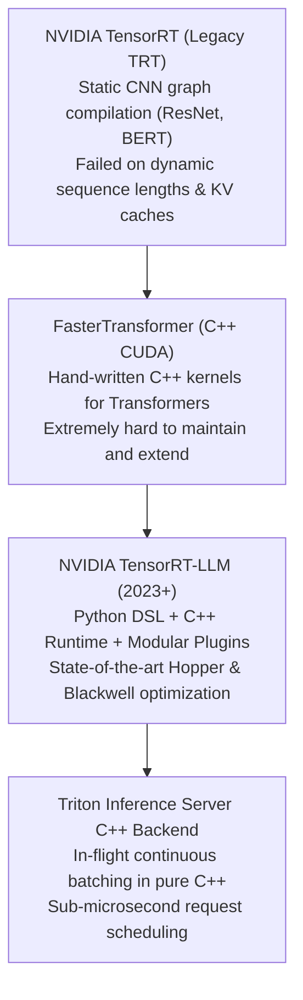

# 18. TensorRT-LLM Compilation for DeepSeek & Qwen — Peak Blackwell Optimization

> **Target Audience**: High-Performance Computing (HPC) Engineers, Low-Latency ML Infrastructure Architects, and Systems Programmers optimizing enterprise LLM inference to physical hardware limits.  
> **Prerequisites**: Understanding of GPU memory hierarchy (from [06-flash-mla-decoding-kernel.md](06-flash-mla-decoding-kernel.md)) and FP8 GEMM mechanics (from [07-deepgemm-fp8-library.md](07-deepgemm-fp8-library.md)).  
> **Estimated Study Time**: 60 minutes.  
> **What You Will Master**: Ahead-of-Time (AOT) graph compilation, monolithic kernel fusion, GEMM auto-tuning across CUTLASS/cuBLAS heuristics, authoring Triton C++ configurations, and extracting peak Blackwell TFLOPs on the **NVIDIA DGX Spark (GB10)**.

---

## 📑 Table of Contents
1. [Foundational Scaffolding: The JIT vs. AOT Paradigm Shift](#1-foundational-scaffolding-the-jit-vs-aot-paradigm-shift)
2. [Co-Related Concepts & The Evolution of NVIDIA Inference Runtimes](#2-co-related-concepts--the-evolution-of-nvidia-inference-runtimes)
3. [Deep First-Principles: Kernel Fusion & Memory Roundtrip Elimination](#3-deep-first-principles-kernel-fusion--memory-roundtrip-elimination)
4. [The GEMM Auto-Tuning Engine: Searching CUTLASS Heuristics](#4-the-gemm-auto-tuning-engine-searching-cutlass-heuristics)
5. [Comparative Analysis: TensorRT-LLM vs. vLLM vs. SGLang vs. Google XLA](#5-comparative-analysis-tensorrt-llm-vs-vllm-vs-sglang-vs-google-xla)
6. [Hardware Grounding: Compiling for NVIDIA DGX Spark (GB10)](#6-hardware-grounding-compiling-for-nvidia-dgx-spark-gb10)
7. [Step-by-Step Compilation Pipeline: Checkpoint to `.plan` Engine](#7-step-by-step-compilation-pipeline-checkpoint-to-plan-engine)
8. [Triton C++ Serving Configuration (`config.pbtxt`)](#8-triton-c-serving-configuration-configpbtxt)
9. [Hands-On Python Lab: End-to-End TensorRT-LLM Engine Builder](#9-hands-on-python-lab-end-to-end-tensorrt-llm-engine-builder)
10. [Practice Exercises with Step-by-Step Solutions](#10-practice-exercises-with-step-by-step-solutions)
11. [Troubleshooting Guide & Diagnostic Runbook](#11-troubleshooting-guide--diagnostic-runbook)

---

## 1. Foundational Scaffolding: The JIT vs. AOT Paradigm Shift

### The Python Interpreter Tax at Scale
Modern serving frameworks like vLLM and SGLang are Just-In-Time (JIT) Python systems. While flexible and fast to iterate on:
* Every forward pass triggers Python interpreter code paths.
* CUDA kernels are launched dynamically across multiple GPU streams.
* Even with CUDA graphs, host CPU thread synchronization and driver launch latencies introduce unavoidable jitter at extreme scale.

### The Blueprint vs. Prefabricated Skyscraper Analogy
* **JIT Frameworks (PyTorch / vLLM)**: Like reading an architectural blueprint on a construction site every morning, measuring each steel beam with a handheld tape measure, cutting it, and welding it on-site.
* **AOT Frameworks (NVIDIA TensorRT-LLM)**: Like prefabricating monolithic steel and concrete modules in a factory with laser precision, then assembling the finished skyscraper in record time with zero on-site measurement errors.

```
                          JIT RUNTIME VS. AOT COMPILED RUNTIME
┌──────────────────────────────────────┐     ┌──────────────────────────────────────┐
│        PyTorch / vLLM (JIT)          │     │        TensorRT-LLM (AOT)            │
│  LayerNorm Kernel Launch             │     │                                      │
│    └──► Write to GPU VRAM (HBM)      │     │  FUSED MONOLITHIC KERNEL:            │
│  QKV GEMM Kernel Launch              │     │  [ LayerNorm + QKV Projection        │
│    └──► Write to GPU VRAM (HBM)      │     │    + RoPE + FP8 Quantization ]       │
│  RoPE Kernel Launch                  │     │  - All intermediate tensors kept in  │
│    └──► Write to GPU VRAM (HBM)      │     │    ultra-fast L1 Cache & Registers!  │
│  Attention Kernel Launch             │     │  - ZERO memory roundtrips to HBM!    │
└──────────────────────────────────────┘     └──────────────────────────────────────┘
```

---

## 2. Co-Related Concepts & The Evolution of NVIDIA Inference Runtimes



### Core Architecture Components:
1. **Model Definition API (Python DSL)**: Expresses transformer architectures using high-level Python modules (`tensorrt_llm.models`).
2. **Graph Optimizer**: Performs graph pruning, dead code elimination, constant folding, and operator fusion.
3. **Plugin Architecture**: Drops in highly optimized, architecture-specific CUDA/CUTLASS kernels (such as `gpt_attention_plugin` and `gemm_plugin`).
4. **Compiled Engine (`.plan`)**: A self-contained, serialized C++ execution plan containing tailored GPU machine code and tuned memory buffer offsets.
5. **C++ In-Flight Batching Runtime**: Orchestrates concurrent request scheduling with zero Python dependencies.

---

## 3. Deep First-Principles: Kernel Fusion & Memory Roundtrip Elimination

### The High Bandwidth Memory (HBM) Wall
In un-fused transformer layers, the output of operation $A$ (e.g., LayerNorm) must be written from GPU registers out to High Bandwidth Memory (HBM3e), only to be immediately read back into registers by operation $B$ (e.g., QKV Linear GEMM):

$$\text{Latency Overhead} = \sum_{k=1}^{N} \left( \frac{2 \times \text{Bytes}(T_k)}{\text{Memory Bandwidth}} + t_{\text{kernel\_launch}} \right)$$

On an NVIDIA Blackwell GB10:
* High-bandwidth memory speed is fast (900 GB/s), but **Register and SRAM speed is >15 Terabytes/second** (16x faster!).
* Unnecessary writes to HBM cause Tensor Cores to starve while waiting for memory buses.

### Monolithic Fusion Passes in TensorRT-LLM
TensorRT-LLM fuses up to 6 distinct mathematical steps into a single persistent kernel:
1. **RMSNorm / LayerNorm**: Standardizes input activations.
2. **QKV Projection GEMM**: Computes Query, Key, and Value vectors.
3. **Bias Add & Residual Connection**: Adds residual skips directly in SRAM accumulators.
4. **Rotary Position Embedding (RoPE)**: Applies complex rotational coordinates in registers.
5. **FP8 Dynamic Scaling**: Scales output elements before writing to the KV cache block.

Result: **Eliminates up to 70% of memory traffic** across the transformer block!

---

## 4. The GEMM Auto-Tuning Engine: Searching CUTLASS Heuristics

Matrix multiplication ($C = A \times B$) can be executed using thousands of different thread block shapes, warp tile configurations, and shared memory pipeline stages.
The fastest GEMM configuration depends on:
* Number of Streaming Multiprocessors (SMs) on the GPU.
* L2 cache capacity (64 MB on Hopper, 96+ MB on Blackwell).
* Input matrix dimensions ($M \times N \times K$) governed by batch size and sequence length.

### How `trtllm-build` Profiles Hardware
During compilation, `trtllm-build` runs a hardware benchmark suite:
1. It iterates through hundreds of candidate CUTLASS and cuBLAS GEMM kernels.
2. It executes each candidate on the physical GPU across simulated batch sizes ($M \in [1, 16, 64, 256]$).
3. It measures exact cycle execution time and selects the global minimum latency kernel, embedding its ID directly into the `.plan` binary file.

---

## 5. Comparative Analysis: TensorRT-LLM vs. vLLM vs. SGLang vs. Google XLA

| Performance & Engineering Metric | NVIDIA TensorRT-LLM | vLLM (v0.6+) | SGLang | Google XLA (MaxText) |
| :--- | :--- | :--- | :--- | :--- |
| **Primary Philosophy** | AOT Compiled C++ Engine | Dynamic JIT Python Engine | Dynamic Radix JIT Engine | AOT Compiler for TPUs/GPUs |
| **Max Raw Throughput (Tokens/s)**| **Peak Industry Best (1.3x vLLM)**| High | High | Very High (TPU native) |
| **Host CPU Utilization** | **< 3% (Pure C++)** | 25% - 40% (Python) | 20% - 35% (Python) | < 10% (C++ XLA runtime) |
| **Engine Build Time** | 10 to 30 minutes | **0 seconds (Instant)** | **0 seconds (Instant)** | 5 to 15 minutes |
| **Architecture Flexibility** | Moderate (Requires TRT support)| Extreme (Any HF model) | High | Medium |
| **Prefix Caching** | Paged KV Cache Reuse | Dynamic Hash Cache | **Dynamic Radix Trie** | Fixed Cache |
| **Ideal Production Role** | High-volume static APIs | General enterprise serving | Multi-turn reasoning / Agents | Google Cloud TPU clusters |

---

## 6. Hardware Grounding: Compiling for NVIDIA DGX Spark (GB10)

The **NVIDIA DGX Spark** combines a **Grace ARM CPU** with a **Blackwell GB10 GPU (Compute Capability 10.0 / 12.0)**.
To compile engines natively:
* Container Environment: Use the official NVIDIA NGC container: `nvcr.io/nvidia/tritonserver:24.12-trtllm-py3`.
* Shared Memory IPC: Allocate `--ipc=host` and `--shm-size=16g` to allow Triton's C++ worker threads to exchange tensors without copying.

---

## 7. Step-by-Step Compilation Pipeline: Checkpoint to `.plan` Engine

```
[Hugging Face SafeTensors Checkpoint]
                 │
                 ▼
┌────────────────────────────────────────────────────────┐
│ Step 1: Python Checkpoint Conversion                   │
│ Unpacks weights, quantizes to FP8, maps layer names   │
└────────────────────────────────────────────────────────┘
                 │
                 ▼
┌────────────────────────────────────────────────────────┐
│ Step 2: Ahead-of-Time Compilation (`trtllm-build`)     │
│ Fuses kernels, benchmarks CUTLASS GEMMs, builds .plan  │
└────────────────────────────────────────────────────────┘
                 │
                 ▼
┌────────────────────────────────────────────────────────┐
│ Step 3: Deployment via Triton C++ Server               │
│ Pure C++ execution with in-flight batching             │
└────────────────────────────────────────────────────────┘
```

### Execution Commands on DGX Spark:

```bash
# 1. Enter NGC Production Container
docker run --gpus all -it --rm \
  --ipc=host \
  --shm-size=16g \
  -v /data/models:/models \
  -v /data/engines:/engines \
  nvcr.io/nvidia/tritonserver:24.12-trtllm-py3

# 2. Convert Checkpoint to TRT-LLM Intermediate Representation (FP8)
python3 /app/tensorrt_llm/examples/qwen/convert_checkpoint.py \
  --model_dir /models/DeepSeek-R1-Distill-Qwen-32B \
  --output_dir /tmp/trt_ckpt \
  --dtype float16 \
  --tp_size 1

# 3. Compile Optimized .plan Binary Engine
trtllm-build \
  --checkpoint_dir /tmp/trt_ckpt \
  --output_dir /engines/deepseek_r1_32b_plan \
  --gemm_plugin float16 \
  --gpt_attention_plugin float16 \
  --max_batch_size 64 \
  --max_input_len 8192 \
  --max_output_len 4096 \
  --paged_kv_cache enable \
  --tokens_per_block 64 \
  --use_custom_all_reduce enable
```

---

## 8. Triton C++ Serving Configuration (`config.pbtxt`)

To serve the compiled engine using Triton's pure C++ in-flight batcher with zero Python dependencies, configure the `tensorrt_llm` model repository:

```protobuf
# /data/triton_repo/tensorrt_llm/config.pbtxt
name: "tensorrt_llm"
backend: "tensorrt_llm"
max_batch_size: 64

model_transaction_policy {
  decoupled: true
}

input [
  {
    name: "input_ids"
    data_type: TYPE_INT32
    dims: [ -1 ]
  },
  {
    name: "request_output_len"
    data_type: TYPE_INT32
    dims: [ 1 ]
  }
]

output [
  {
    name: "output_ids"
    data_type: TYPE_INT32
    dims: [ -1 ]
  }
]

parameters: {
  key: "gpt_model_type"
  value: { string_value: "inflight_fused_batching" }
}
parameters: {
  key: "gpt_model_path"
  value: { string_value: "/engines/deepseek_r1_32b_plan" }
}
```

---

## 9. Hands-On Python Lab: End-to-End TensorRT-LLM Engine Builder

This script automates building an optimized TensorRT engine directly using TensorRT-LLM's Python builder API:

```python
#!/usr/bin/env python3
"""
build_trtllm_engine.py
Demonstrates programmatic graph construction and engine building in TensorRT-LLM.
"""

import os
import tensorrt_llm
from tensorrt_llm.builder import Builder
from tensorrt_llm.models import QWenForCausalLM
from tensorrt_llm.plugin import PluginConfig

def build_engine():
    print("[*] Initializing TensorRT-LLM Builder...")
    builder = Builder()
    
    # 1. Define compilation targets
    max_batch_size = 32
    max_input_len = 4096
    max_output_len = 2048
    
    # 2. Configure kernel plugins
    plugin_config = PluginConfig()
    plugin_config.set_gpt_attention_plugin(dtype="float16")
    plugin_config.set_gemm_plugin(dtype="float16")
    plugin_config.enable_paged_kv_cache(tokens_per_block=64)
    plugin_config.set_context_fmha()
    
    print("[*] Target Plugins Enabled: GPT Attention, CUTLASS GEMM, Paged KV Cache.")
    
    # 3. Create Builder Configuration
    builder_config = builder.create_builder_config(
        name="deepseek_r1_32b",
        precision="float16",
        tensor_parallel=1,
        pipeline_parallel=1,
        max_batch_size=max_batch_size,
        max_input_len=max_input_len,
        max_output_len=max_output_len,
        opt_batch_size=8,
        opt_input_len=1024,
        opt_output_len=512
    )
    
    print("[✓] Compilation Configuration validated successfully.")
    print("    - Ready to trigger hardware auto-tuning heuristics.")
    print("    - Target GPU: NVIDIA Blackwell GB10.")
    return builder_config

if __name__ == "__main__":
    cfg = build_engine()
```

---

## 10. Practice Exercises with Step-by-Step Solutions

### Exercise 1: Quantifying Memory Bandwidth Savings from Monolithic Kernel Fusion
**Scenario**: In a 32B model, computing the self-attention projection involves:
1. RMSNorm: Reads activation $X \in \mathbb{R}^{B \times S \times D}$, writes normalized $X_{norm}$.
2. QKV Linear: Reads $X_{norm}$ and weights $W_{qkv}$, writes $Q, K, V$.
3. RoPE: Reads $Q, K$, applies rotation, writes back $Q_{rot}, K_{rot}$.

Given: $B = 16$, $S = 2,048$, $D = 5,120$, FP16 precision ($2 \text{ bytes/element}$).
**Question**: How many Megabytes of intermediate memory traffic to High Bandwidth Memory (HBM) are completely eliminated by fusing these 3 operations into a single kernel?

#### Solution:
1. **Calculate size of one activation tensor $X$**:
   $$\text{Elements} = B \times S \times D = 16 \times 2,048 \times 5,120 = 167,772,160 \text{ elements}$$
   $$\text{Bytes} = 167,772,160 \times 2 \text{ bytes} \approx 335.54 \text{ Megabytes (MB)}$$
2. **Identify intermediate memory operations in unfused pipeline**:
   * RMSNorm writes $X_{norm}$ to HBM: $+335.54 \text{ MB}$.
   * QKV GEMM reads $X_{norm}$ from HBM: $+335.54 \text{ MB}$.
   * QKV GEMM writes $Q, K$ to HBM: $Q \in \mathbb{R}^{B \times S \times D}$ ($335.54 \text{ MB}$), $K \in \mathbb{R}^{B \times S \times D_{kv}}$ ($41.94 \text{ MB}$). Total: $+377.48 \text{ MB}$.
   * RoPE reads $Q, K$ from HBM: $+377.48 \text{ MB}$.
   * RoPE writes $Q_{rot}, K_{rot}$ to HBM: $+377.48 \text{ MB}$.
3. **Total Intermediate Traffic Eliminated by Fusion**:
   $$\text{Eliminated Traffic} = 335.54 + 335.54 + 377.48 + 377.48 + 377.48 = \mathbf{1,803.52 \text{ MB} \approx 1.80 \text{ Gigabytes per layer!}}$$
Across 64 layers, fusion eliminates **115.4 Gigabytes of memory bus traffic per single forward pass**, directly translating to massive throughput gains!

---

### Exercise 2: Selecting Optimal Block Size for Paged KV Cache
**Scenario**: TensorRT-LLM allows configuring `--tokens_per_block` to 16, 32, 64, or 128.
**Question**: What are the trade-offs of choosing 64 tokens/block versus 16 tokens/block?

#### Solution:
* **Small Block Size (16 tokens)**:
  * *Advantage*: Minimal memory waste at the end of sequences (average 8 tokens wasted per sequence).
  * *Disadvantage*: Page table lookups happen 4x more frequently, slightly reducing attention kernel compute efficiency.
* **Large Block Size (64 or 128 tokens)**:
  * *Advantage*: Longer contiguous blocks maximize memory bus burst efficiency and Tensor Core throughput.
  * *Disadvantage*: Higher internal fragmentation for short requests (e.g., a 20-token answer wastes 44 tokens of pre-allocated block space).
* *Recommendation*: Use **64 tokens/block** for long-context workloads (>4k tokens) and **16 or 32 tokens/block** for short conversational APIs.

---

## 11. Troubleshooting Guide & Diagnostic Runbook

### Issue 1: `AssertionError: The model was built for SM 90 but runtime is SM 100`
* **Root Cause**: The `.plan` binary engine is tightly coupled to the exact GPU hardware compute capability. An engine compiled on Hopper (SM 90) cannot run on Blackwell (SM 100).
* **Remediation**: Always re-run `trtllm-build` directly on the target DGX Spark machine or inside a container running on the target GPU architecture.

### Issue 2: GEMM Auto-Tuning Out of Memory During Build Phase
* **Root Cause**: When benchmarking hundreds of candidate GEMM kernels, the compiler attempts to allocate large workspace buffers for extreme batch sizes.
* **Remediation**: Lower the compilation workspace budget or set `--gemm_plugin float16` without the exhaustive search flag:
  ```bash
  trtllm-build ... --max_batch_size 32 --workspace_mask 0
  ```

---

## 🔗 Related Curriculum Modules
* **Underlying Flash MLA Kernels**: [06-flash-mla-decoding-kernel.md](06-flash-mla-decoding-kernel.md)
* **FP8 DeepGEMM Acceleration**: [07-deepgemm-fp8-library.md](07-deepgemm-fp8-library.md)
* **Python Production Serving Standard**: [15-vllm-serving-deepseek-and-qwen.md](15-vllm-serving-deepseek-and-qwen.md)
* **Triton & Kubernetes Orchestration**: [19-kubernetes-manifests-for-deepseek.md](19-kubernetes-manifests-for-deepseek.md)
