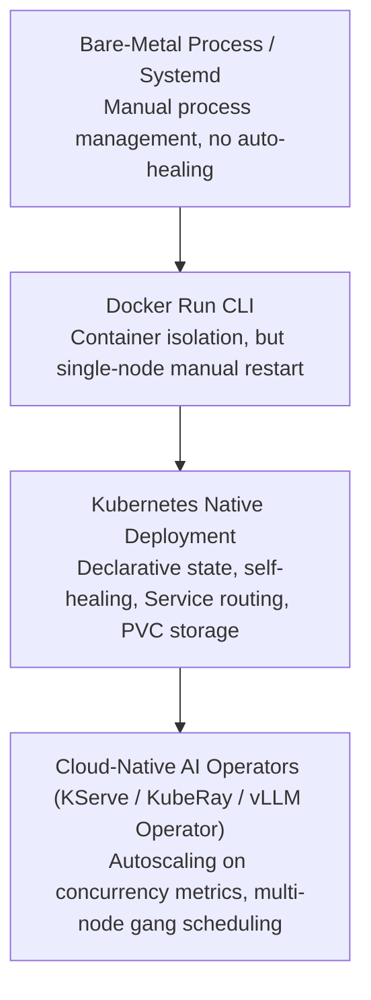

# 19. Kubernetes Manifests for DeepSeek & Qwen on DGX Spark

> **Target Audience**: Kubernetes Platform Engineers, MLOps Architects, and SREs responsible for orchestrating containerized LLM inference on accelerated GPU hardware.  
> **Prerequisites**: Core Kubernetes concepts (Pods, Deployments, Services, PVCs), Linux container fundamentals, and vLLM configuration (from [15-vllm-serving-deepseek-and-qwen.md](15-vllm-serving-deepseek-and-qwen.md)).  
> **Estimated Study Time**: 60 minutes.  
> **What You Will Master**: Declarative production orchestration of **DeepSeek-R1-Distill-32B** and **Qwen2.5-32B**, triple-probe healthcheck architecture (Startup, Liveness, Readiness), IPC shared memory sizing, and multi-tenant resource quotas on the **NVIDIA DGX Spark (GB10)**.

---

## 📑 Table of Contents
1. [Foundational Scaffolding: Why Bare-Metal Scripts Fail in Enterprise](#1-foundational-scaffolding-why-bare-metal-scripts-fail-in-enterprise)
2. [Co-Related Concepts & The Evolution of Cloud-Native AI](#2-co-related-concepts--the-evolution-of-cloud-native-ai)
3. [Deep First-Principles: The GPU Pod Architecture](#3-deep-first-principles-the-gpu-pod-architecture)
4. [The Critical Triple-Probe Healthcheck Lifecycle](#4-the-critical-triple-probe-healthcheck-lifecycle)
5. [Comparative Analysis: Raw K8s vs. KServe vs. KubeRay vs. Slurm](#5-comparative-analysis-raw-k8s-vs-kserve-vs-kuberay-vs-slurm)
6. [Hardware Grounding: Resource Allocation on DGX Spark (GB10)](#6-hardware-grounding-resource-allocation-on-dgx-spark-gb10)
7. [Complete Production Manifest Suite (Namespace to NetworkPolicy)](#7-complete-production-manifest-suite-namespace-to-networkpolicy)
8. [Deployment Runbook & Cluster Operations](#8-deployment-runbook--cluster-operations)
9. [Practice Exercises with Step-by-Step Solutions](#9-practice-exercises-with-step-by-step-solutions)
10. [Troubleshooting Guide & Diagnostic Runbook](#10-troubleshooting-guide--diagnostic-runbook)

---

## 1. Foundational Scaffolding: Why Bare-Metal Scripts Fail in Enterprise

### The Fragility of Shell Scripts
Running LLM inference servers via ad-hoc terminal commands (`python3 -m vllm ... &`) or unmanaged systemd scripts creates critical operational risks:
* **Silent Process Death**: If a worker encounters an unhandled CUDA out-of-memory exception, the process terminates silently. Without orchestration, traffic continues routing to a dead port.
* **No Declarative Quotas**: Multiple developers or jobs can inadvertently allocate the exact same GPU device, causing catastrophic memory collisions.
* **Rolling Zero-Downtime Upgrades Impossible**: Updating a model weight checkpoint or container image requires manual downtime and port teardowns.

### The Shipping Container Fleet Analogy
Deploying an LLM without Kubernetes is like loading 30-ton industrial machinery onto an open flatbed pickup truck with bungee cords. 
**Kubernetes** provides the standardized ISO shipping container, dock cranes, automated weigh stations (**ResourceQuotas**), and maritime safety inspectors (**Startup, Liveness, and Readiness Probes**). If a container fails inspection, it is instantly replaced without disrupting port operations.

```
                          KUBERNETES GPU POD ANATOMY
┌────────────────────────────────────────────────────────────────────────────────────────┐
│ Kubernetes Pod: deepseek-r1-serving-79d8f9b8c-x2k4p                                    │
│                                                                                        │
│  ┌──────────────────────────────────────────────────────────────────────────────────┐  │
│  │ Container: vllm-engine                                                           │  │
│  │  - Command: python3 -m vllm.entrypoints.openai.api_server                        │  │
│  │  - Resources: limits: { nvidia.com/gpu: 1, memory: 96Gi, cpu: 16 }               │  │
│  │  - Environment: HF_HOME=/models/cache, CUDA_DEVICE_ORDER=PCI_BUS_ID              │  │
│  └──────────────────────────────────────────────────────────────────────────────────┘  │
│              │                                                   │                     │
│              ▼                                                   ▼                     │
│  ┌───────────────────────┐                           ┌───────────────────────┐         │
│  │ Volume: model-storage │ (Local NVMe 80GB PVC)     │ Volume: dshm          │         │
│  │ Mount: /models        │ Fast mmap weight load     │ Mount: /dev/shm       │         │
│  │                       │ Zero re-download tax      │ SizeLimit: 16Gi RAM   │         │
│  └───────────────────────┘                           └───────────────────────┘         │
└────────────────────────────────────────────────────────────────────────────────────────┘
```

---

## 2. Co-Related Concepts & The Evolution of Cloud-Native AI



### Key Kubernetes Concepts for LLM Infrastructure:
1. **NVIDIA Container Toolkit (k8s-device-plugin)**: Exposes physical GPUs to Kubernetes as allocatable resources (`nvidia.com/gpu: 1`).
2. **IPC Shared Memory (`/dev/shm`)**: Docker containers default to a tiny 64 MB `/dev/shm` buffer. PyTorch distributed processes and vLLM worker threads exchange intermediate activations via shared memory; an under-sized `/dev/shm` causes instant `SIGBUS` or `Bus error` fatal crashes!
3. **Local-Path Storage Provisioner**: Mounts high-speed host NVMe storage directly into the Pod, allowing 32 GB of model weights to load in seconds across Pod restarts.

---

## 3. Deep First-Principles: The GPU Pod Architecture

### Memory Allocation Math in Containerized Pods
When configuring Kubernetes limits for a Pod hosting `DeepSeek-R1-Distill-32B`:

$$\text{Pod Memory Request} = W_{\text{model}} + KV_{\text{pool}} + M_{\text{CUDA Runtime}} + M_{\text{Host Overhead}}$$

On the **Grace Blackwell GB10 (128 GB Unified Memory)**:
* FP8 Model Weights: **32 GB**.
* vLLM KV Cache Pool (at 0.90 utilization): **~75 GB**.
* CUDA Driver, PyTorch context, and NCCL buffers: **~4 GB**.
* Host System & Operating System reserve: **~17 GB**.

Therefore, the container `limits.memory` must be set to **`96Gi`** or **`100Gi`**, with `limits.nvidia.com/gpu: "1"`. Setting a memory limit below 90 GiB will trigger the Linux OOM (Out Of Memory) Killer, terminating the pod with **Exit Code 137**.

---

## 4. The Critical Triple-Probe Healthcheck Lifecycle

One of the most common beginner mistakes in Kubernetes AI deployments is configuring only a `livenessProbe`. 

```
                                POD STARTUP LIFECYCLE
[Pod Scheduled] ──► [Pull Container Image] ──► [Mount Local NVMe Model PVC]
                                                      │
                                                      ▼
                                       ┌─────────────────────────────┐
                                       │ Container Starts:           │
                                       │ python3 -m vllm ...         │
                                       └─────────────────────────────┘
                                                      │
                                                      ▼
                                       ┌─────────────────────────────┐
                                       │ Phase 1: Startup Probe      │ ◄── 45s Delay, Period 10s
                                       │ Loading 32GB weights &      │     FailureThreshold 30
                                       │ capturing CUDA graphs...    │     (Allows up to 5 min!)
                                       └─────────────────────────────┘
                                                      │
                                             Startup Probe SUCCEEDS
                                                      │
                                                      ▼
                      ┌────────────────────────────────────────────────────────┐
                      │ Phase 2: Readiness Probe & Liveness Probe Take Over    │
                      ├──────────────────────────┬─────────────────────────────┤
                      │ Readiness Probe:         │ Liveness Probe:             │
                      │ Checks if KV cache is    │ Checks if server is dead.   │
                      │ full. If full, stops     │ If dead, restarts the Pod.  │
                      │ sending new HTTP traffic!│                             │
                      └──────────────────────────┴─────────────────────────────┘
```

* **Startup Probe**: Prevents Kubernetes from prematurely killing the Pod during the 60–120 second period where vLLM is reading model weights from disk and capturing CUDA graphs.
* **Readiness Probe**: Dictates whether the Pod's IP is included in the Service endpoints. If the engine is overwhelmed, it drops traffic without crashing.
* **Liveness Probe**: Detects true deadlocks or frozen processes and restarts the container.

---

## 5. Comparative Analysis: Raw K8s vs. KServe vs. KubeRay vs. Slurm

| Orchestration Layer | Deployment Mechanism | Primary Advantage | Scaling Trigger | Setup Complexity |
| :--- | :--- | :--- | :--- | :--- |
| **Native Kubernetes (This Module)** | Standard Deployments & PVCs | Zero external dependencies, pure declarative YAML | CPU / HPA / Custom Metrics | **Low (Vanilla K8s)** |
| **KServe v0.14+** | Custom Resource Definition (`InferenceService`) | Native serverless scale-to-zero, canary deployments | Request concurrency / queue depth | High (Requires Istio/Cert-Manager) |
| **KubeRay** | `RayCluster` / `RayJob` | Multi-node distributed pipelines, MoE sharding | Ray autoscaler | Medium |
| **HPC Slurm** | Batch scripts (`sbatch`) | Traditional supercomputing job scheduling | Job queue priority | High (Non-cloud-native) |

---

## 6. Hardware Grounding: Resource Allocation on DGX Spark (GB10)

The **NVIDIA DGX Spark** features a single unified compute board:
* **CPU**: 72-core NVIDIA Grace ARM Neoverse V2.
* **GPU**: NVIDIA Blackwell GB10 (128 GB Unified Memory).
* **Interconnect**: 900 GB/s NVLink-C2C.

In the multi-tenant architecture defined in the cluster setup, our serving pod runs in the `ai-inference` namespace:
* We allocate **16 CPU cores** (`requests.cpu: "16"`).
* We allocate **1 physical GPU** (`limits.nvidia.com/gpu: "1"`).
* We pass through the host NVMe cache at `/data/models` using a `PersistentVolume` with `storageClassName: local-path`.

---

## 7. Complete Production Manifest Suite (Namespace to NetworkPolicy)

Save the following manifests into a unified file or individual configuration modules:

### `01-namespace-and-quota.yaml`
```yaml
apiVersion: v1
kind: Namespace
metadata:
  name: ai-inference
  labels:
    environment: production
    workload: llm-serving
    hardware: dgx-spark
---
apiVersion: v1
kind: ResourceQuota
metadata:
  name: inference-quota
  namespace: ai-inference
spec:
  hard:
    requests.cpu: "16"
    requests.memory: "64Gi"
    limits.cpu: "32"
    limits.memory: "100Gi"
    requests.nvidia.com/gpu: "1"
    limits.nvidia.com/gpu: "1"
    requests.storage: "100Gi"
```

### `02-storage-pvc.yaml`
```yaml
apiVersion: v1
kind: PersistentVolumeClaim
metadata:
  name: nvme-model-cache-pvc
  namespace: ai-inference
spec:
  accessModes:
    - ReadWriteOnce
  storageClassName: local-path
  resources:
    requests:
      storage: 80Gi
```

### `03-deepseek-deployment.yaml`
```yaml
apiVersion: apps/v1
kind: Deployment
metadata:
  name: deepseek-r1-serving
  namespace: ai-inference
  labels:
    app.kubernetes.io/name: deepseek-r1
    app.kubernetes.io/part-of: ai-inference-stack
spec:
  replicas: 1
  strategy:
    type: Recreate  # Avoid dual-allocation of the single GPU during rolling update
  selector:
    matchLabels:
      app: deepseek-r1
  template:
    metadata:
      labels:
        app: deepseek-r1
    spec:
      restartPolicy: Always
      containers:
      - name: vllm-engine
        image: vllm/vllm-openai:latest
        imagePullPolicy: IfNotPresent
        command: ["python3", "-m", "vllm.entrypoints.openai.api_server"]
        args:
          - "--model=/models/DeepSeek-R1-Distill-Qwen-32B"
          - "--served-model-name=deepseek-r1"
          - "--host=0.0.0.0"
          - "--port=8000"
          - "--gpu-memory-utilization=0.90"
          - "--max-model-len=32768"
          - "--max-num-seqs=128"
          - "--enable-chunked-prefill"
          - "--enable-prefix-caching"
          - "--kv-cache-dtype=fp8"
          - "--trust-remote-code"
        resources:
          requests:
            cpu: "8"
            memory: "32Gi"
            nvidia.com/gpu: "1"
          limits:
            cpu: "24"
            memory: "96Gi"
            nvidia.com/gpu: "1"
        ports:
          - name: http-api
            containerPort: 8000
        env:
          - name: HF_HOME
            value: "/models/cache"
          - name: VLLM_ENGINE_ITERATION_TIMEOUT_S
            value: "60"
        volumeMounts:
          - name: model-storage
            mountPath: /models
          - name: dshm
            mountPath: /dev/shm
        # Phase 1: Startup Probe (permits up to 5 minutes for weight load & CUDA graphs)
        startupProbe:
          httpGet:
            path: /health
            port: 8000
          initialDelaySeconds: 30
          periodSeconds: 10
          failureThreshold: 30
        # Phase 2: Liveness Probe
        livenessProbe:
          httpGet:
            path: /health
            port: 8000
          periodSeconds: 15
          timeoutSeconds: 5
          failureThreshold: 3
        # Phase 3: Readiness Probe
        readinessProbe:
          httpGet:
            path: /health
            port: 8000
          periodSeconds: 5
          timeoutSeconds: 3
          failureThreshold: 2
      volumes:
        - name: model-storage
          persistentVolumeClaim:
            claimName: nvme-model-cache-pvc
        # Crucial: 16 GB RAM-backed shared memory to prevent PyTorch IPC SIGBUS
        - name: dshm
          emptyDir:
            medium: Memory
            sizeLimit: 16Gi
```

### `04-service-and-networkpolicy.yaml`
```yaml
apiVersion: v1
kind: Service
metadata:
  name: deepseek-r1-service
  namespace: ai-inference
  labels:
    app: deepseek-r1
spec:
  type: ClusterIP
  selector:
    app: deepseek-r1
  ports:
    - name: http
      port: 8000
      targetPort: 8000
---
apiVersion: networking.k8s.io/v1
kind: NetworkPolicy
metadata:
  name: allow-inference-ingress
  namespace: ai-inference
spec:
  podSelector:
    matchLabels:
      app: deepseek-r1
  ingress:
  - from:
    - namespaceSelector:
        matchLabels:
          environment: production
    ports:
    - protocol: TCP
      port: 8000
```

---

## 8. Deployment Runbook & Cluster Operations

### 1. Applying the Manifests:
```bash
# Apply stack in sequence
kubectl apply -f 01-namespace-and-quota.yaml
kubectl apply -f 02-storage-pvc.yaml
kubectl apply -f 03-deepseek-deployment.yaml
kubectl apply -f 04-service-and-networkpolicy.yaml
```

### 2. Monitoring the Startup Lifecycle:
```bash
# Watch pod phase transitions
kubectl get pods -n ai-inference -w

# Stream startup logs and CUDA graph capture
kubectl logs -n ai-inference -l app=deepseek-r1 -f
```

### 3. Port-Forwarding & Validation:
```bash
# Forward cluster port to localhost
kubectl port-forward svc/deepseek-r1-service -n ai-inference 8000:8000 &

# Validate model endpoint
curl -s http://localhost:8000/v1/models | jq .
```

---

## 9. Practice Exercises with Step-by-Step Solutions

### Exercise 1: Sizing the Startup Probe Timeout Window
**Scenario**: You are deploying an unquantized 65 GB model over a network storage volume where read speeds average **250 MB/s**.
Following weight loading, vLLM takes **45 seconds** to compile CUDA graphs and run warmup batches.
**Question**: If `periodSeconds` is set to `10`, what is the minimum `failureThreshold` you must configure on `startupProbe` to prevent Kubernetes from killing the pod prematurely?

#### Solution:
1. **Calculate Model Weight Loading Time**:
   $$\text{Loading Time} = \frac{65 \times 1,000 \text{ MB}}{250 \text{ MB/s}} = 260 \text{ seconds}$$
2. **Add CUDA Graph Warmup Time**:
   $$\text{Total Initialization Time} = 260 + 45 = 305 \text{ seconds}$$
3. **Calculate Required Probe Checks**:
   $$\text{Checks Required} = \frac{305 \text{ seconds}}{10 \text{ seconds/period}} = 30.5 \text{ periods}$$
4. **Add Operational Safety Margin (20%)**:
   $$\text{Safety Buffer} = 30.5 \times 1.20 = 36.6 \to \mathbf{37 \text{ or } 40 \text{ periods}}$$
*Configuration*: Set `failureThreshold: 40` and `periodSeconds: 10` (total allowance = 400 seconds).

---

### Exercise 2: Debugging PyTorch `/dev/shm` Bus Errors
**Scenario**: A developer deploys a custom vLLM pod without defining the `emptyDir: medium: Memory` volume for `/dev/shm`.
During high-concurrency requests, the pod crashes with:
`RuntimeError: DataLoader worker (pid 42) is killed by signal: Bus error (core dumped).`
**Question**: Explain why this error occurred and provide the exact YAML snippet to resolve it.

#### Solution:
* **Explanation**: By default, Docker/Kubernetes mounts a tiny **64 Megabyte** POSIX shared memory buffer (`/dev/shm`). PyTorch uses shared memory for inter-process tensor queues and NCCL communications. When concurrent requests fill the 64 MB buffer, the Linux kernel raises a `SIGBUS` signal to kill the process.
* **Resolution**: Mount a RAM-backed volume directly to `/dev/shm`:
  ```yaml
  volumeMounts:
    - name: dshm
      mountPath: /dev/shm
  volumes:
    - name: dshm
      emptyDir:
        medium: Memory
        sizeLimit: 16Gi
  ```

---

## 10. Troubleshooting Guide & Diagnostic Runbook

### Issue 1: Pod Status `Pending` with `0/1 nodes available: Insufficient nvidia.com/gpu`
* **Root Cause**: The Kubernetes node has not registered the GPU resource or the NVIDIA device plugin daemonset is not running.
* **Remediation**:
  ```bash
  # Check if node detects the GPU
  kubectl describe node | grep -A 8 "Allocatable:" | grep nvidia.com/gpu
  
  # If 0, check NVIDIA device plugin pod
  kubectl get pods -n kube-system -l app=nvidia-device-plugin-daemonset
  ```

### Issue 2: Pod Terminated with `Exit Code 137` (OOMKilled)
* **Root Cause**: The container exceeded `limits.memory`. Linux cgroups terminated the process.
* **Remediation**:
  1. Inspect pod events: `kubectl describe pod -n ai-inference -l app=deepseek-r1 | grep -i oom`
  2. Increase container `limits.memory` from `64Gi` to `96Gi` or `100Gi`.
  3. Lower vLLM's internal budget: `--gpu-memory-utilization 0.88`.

---

## 🔗 Related Curriculum Modules
* **Underlying Serving Engine**: [15-vllm-serving-deepseek-and-qwen.md](15-vllm-serving-deepseek-and-qwen.md)
* **High-Speed NVMe Caching**: [20-nvme-local-storage-and-weight-caching.md](20-nvme-local-storage-and-weight-caching.md)
* **Realtime Streaming Ingress**: [21-ingress-and-realtime-streaming-gateways.md](21-ingress-and-realtime-streaming-gateways.md)
* **Autoscaling with KServe**: [22-autoscaling-with-kserve-and-kueue.md](22-autoscaling-with-kserve-and-kueue.md)
