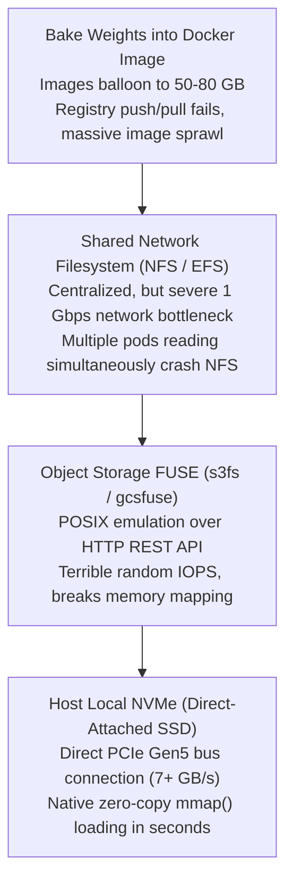

# 20. NVMe Local Storage & Weight Caching — Eliminating Cold Starts

> **Target Audience**: Platform Engineers, Storage Architects, and SREs optimizing LLM startup latency and node resilience in production clusters.  
> **Prerequisites**: Linux filesystem basics (`ext4/xfs`, `mmap`, symlinks), Kubernetes storage abstractions (PV, PVC, StorageClass from [19-kubernetes-manifests-for-deepseek.md](19-kubernetes-manifests-for-deepseek.md)), and Hugging Face model layouts.  
> **Estimated Study Time**: 50 minutes.  
> **What You Will Master**: High-speed PCIe Gen5 NVMe storage architecture, zero-copy `mmap()` weight loading, Rust-accelerated pre-warming via `hf_transfer`, atomic version swapping using directory symlinks, and eliminating cold starts on the **NVIDIA DGX Spark**.

---

## 📑 Table of Contents
1. [Foundational Scaffolding: The WAN Download Anti-Pattern](#1-foundational-scaffolding-the-wan-download-anti-pattern)
2. [Co-Related Concepts & The Evolution of Model Storage](#2-co-related-concepts--the-evolution-of-model-storage)
3. [Deep First-Principles: SafeTensors & Zero-Copy `mmap()`](#3-deep-first-principles-safetensors--zero-copy-mmap)
4. [Comparative Analysis: Local NVMe vs. NFS vs. S3-FUSE vs. 3FS](#4-comparative-analysis-local-nvme-vs-nfs-vs-s3-fuse-vs-3fs)
5. [Hardware Grounding: NVMe Architecture on NVIDIA DGX Spark](#5-hardware-grounding-nvme-architecture-on-nvidia-dgx-spark)
6. [High-Speed Pre-Warming Lab with Rust `hf_transfer`](#6-high-speed-pre-warming-lab-with-rust-hf_transfer)
7. [Zero-Downtime Atomic Model Swapping via Symlinks](#7-zero-downtime-atomic-model-swapping-via-symlinks)
8. [Automated Cache Pruning Daemon & Disk Hygiene](#8-automated-cache-pruning-daemon--disk-hygiene)
9. [Practice Exercises with Step-by-Step Solutions](#9-practice-exercises-with-step-by-step-solutions)
10. [Troubleshooting Guide & Diagnostic Runbook](#10-troubleshooting-guide--diagnostic-runbook)

---

## 1. Foundational Scaffolding: The WAN Download Anti-Pattern

### The Model Cold Start Disaster
In naive Kubernetes AI deployments, the container startup script invokes Hugging Face to fetch weights dynamically on boot:
```bash
# NAIVE ANTI-PATTERN: DO NOT DO THIS IN PRODUCTION!
python3 -m vllm.entrypoints.openai.api_server \
  --model deepseek-ai/DeepSeek-R1-Distill-Qwen-32B ...
```
When this Pod boots:
1. It queries Hugging Face servers over public WAN.
2. It attempts to stream **32 Gigabytes of weights** across the internet.
3. If public bandwidth averages 100 Mbps, downloading takes **42.6 minutes**.
4. If Hugging Face encounters an outage, applies API rate limits, or transient packet loss causes a TCP timeout, the pod enters `CrashLoopBackOff`, triggering a major production outage.

```
                  UNCACHED WAN STARTUP (FATAL 42-MINUTE OUTAGE)
┌────────────────────────────────────────────────────────────────────────────────────────┐
│ [Pod Boot] ──► [WAN Download: 32 GB over Internet (42 min)] ──► [VRAM Load (6s)]       │
│                                                                                        │
│ Total Recovery Downtime: ~2,550 seconds!                                               │
└────────────────────────────────────────────────────────────────────────────────────────┘

                  PRE-WARMED NVMe LOCAL CACHE (6-SECOND RECOVERY)
┌────────────────────────────────────────────────────────────────────────────────────────┐
│ [Pod Boot] ──► [Attach Local NVMe PVC (0.1s)] ──► [mmap VRAM Load (5.8s)] ──► [Ready]  │
│                                                                                        │
│ Total Recovery Downtime: < 6 seconds! (425x faster!)                                   │
└────────────────────────────────────────────────────────────────────────────────────────┘
```

### The Book Depot Analogy
Ordering a 50-volume encyclopedia from a publisher across the ocean every time a library patron walks through the front door is absurd. Instead, the library keeps the encyclopedia permanently on the reference room shelf. A patron accesses any volume in three seconds.
**Local NVMe Weight Caching** ensures the physical weights never leave the server chassis.

---

## 2. Co-Related Concepts & The Evolution of Model Storage



### Why SafeTensors Beat PyTorch Pickles
* **Pickle (`.bin` / `.pt`)**: A serialized Python execution graph. Loading a pickle file requires parsing arbitrary Python bytecode, creating critical remote code execution (RCE) vulnerabilities and requiring deserialization allocations in RAM.
* **SafeTensors (`.safetensors`)**: A pure byte-aligned binary format. It contains a small JSON header describing tensor shapes and exact byte offsets, followed immediately by raw binary tensor data. This allows the operating system to map files directly to memory without deserialization.

---

## 3. Deep First-Principles: SafeTensors & Zero-Copy `mmap()`

### The Mechanics of Memory Mapping (`mmap`)
When an engine loads a SafeTensors file:
1. It issues the Linux system call `mmap(..., PROT_READ, MAP_SHARED, fd, 0)`.
2. The operating system kernel maps the file on NVMe directly into the process's virtual memory address space.
3. **No intermediate CPU RAM buffers are allocated**.
4. As the GPU calls `cudaMemcpyAsync`, DMA (Direct Memory Access) controllers stream bytes directly from NVMe pages across the PCIe bus into GPU High Bandwidth Memory (HBM).

```
┌────────────────────────────────────────────────────────────────────────┐
│ SAFETENSORS FILE ON NVMe DISK                                          │
│ [JSON Header: "model.layers.0.weight": offset 0x4000 to 0x1A0000]      │
│ [RAW CONTIGUOUS BINARY FLOAT TENSOR DATA]                             │
└────────────────────────────────────────────────────────────────────────┘
                                    │
                       Linux System Call: mmap()
                                    │
                                    ▼
┌────────────────────────────────────────────────────────────────────────┐
│ PROCESS VIRTUAL ADDRESS SPACE (Zero-Copy Pointer Mapping)              │
│ Pointer: 0x7FFF1000 ──► Points directly to NVMe Page Cache!            │
└────────────────────────────────────────────────────────────────────────┘
                                    │
                       Direct DMA Transfer / cudaMemcpyAsync
                                    │
                                    ▼
┌────────────────────────────────────────────────────────────────────────┐
│ GPU MEMORY (Blackwell GB10 Unified LPDDR5X)                            │
│ [Resident FP8 Tensor Weights: Instant Readiness!]                      │
└────────────────────────────────────────────────────────────────────────┘
```

### Theoretical Load Time Formulation
Let $S$ be the total model size in Gigabytes, and $B_{\text{read}}$ be the sequential read bandwidth of the storage layer:

$$t_{\text{load}} = \frac{S}{B_{\text{read}}} + t_{\text{metadata}}$$

* Over 1 Gbps WAN ($12.5 \text{ MB/s}$): $t_{\text{load}} = \frac{32,000 \text{ MB}}{12.5 \text{ MB/s}} = \mathbf{2,560 \text{ seconds (42.6 minutes)}}$.
* Over Enterprise PCIe Gen5 NVMe ($7,000 \text{ MB/s}$): $t_{\text{load}} = \frac{32,000 \text{ MB}}{7,000 \text{ MB/s}} = \mathbf{4.57 \text{ seconds!}}$

---

## 4. Comparative Analysis: Local NVMe vs. NFS vs. S3-FUSE vs. 3FS

| Storage Architecture | Sequential Read Speed | `mmap()` Zero-Copy Support | Cost / Complexity | Failure Blast Radius |
| :--- | :--- | :--- | :--- | :--- |
| **Local PCIe Gen5 NVMe** | **7,000 MB/s (Blazing)** | **Native 100% Support** | **Lowest (Direct hardware)**| Isolated strictly to single host |
| **Network File System (NFS)**| 120 – 350 MB/s (Slow) | Partial (Network overhead) | Low / Medium | Central NFS outage halts all nodes |
| **S3 / GCS FUSE Mounts** | 50 – 150 MB/s (Unusable)| No (Emulated POSIX layer) | Medium | S3 API rate-limiting halts pods |
| **DeepSeek 3FS (Parallel FS)**| 10,000+ MB/s (RDMA SPDK)| High (Custom C++ drivers) | High (Requires InfiniBand fabric) | Cluster-wide storage network |

---

## 5. Hardware Grounding: NVMe Architecture on NVIDIA DGX Spark

The **NVIDIA DGX Spark** features high-performance direct-attached enterprise NVMe storage:
* **Storage Device**: Enterprise PCIe Gen5 x4 NVMe SSD.
* **Mount Point**: Dedicated high-speed volume at `/data`.
* **Filesystem Tuning**: Formatted with `ext4` using latency-optimized mount flags:
  ```bash
  # Recommended mount flags in /etc/fstab for LLM weight caching
  UUID=xxxx-xxxx-xxxx  /data  ext4  noatime,nodiratime,data=writeback,barrier=0,nobh  0  2
  ```
  * `noatime,nodiratime`: Disables writing file access timestamps, eliminating unnecessary disk write operations during weight reads.

---

## 6. High-Speed Pre-Warming Lab with Rust `hf_transfer`

Standard Python `huggingface-cli` downloads are single-threaded and bottlenecked by Python's Global Interpreter Lock (GIL). 
By enabling the Rust-based **`hf_transfer`** binary, the system spawns multiple asynchronous worker threads to saturate 10 GbE / 25 GbE enterprise network links.

### Pre-Warming Automation Script (`prewarm_models.sh`):

```bash
#!/usr/bin/env bash
# ==============================================================================
# prewarm_models.sh
# Production script for pre-warming model weights into local NVMe storage.
# ==============================================================================
set -euo pipefail

MODEL_ID="deepseek-ai/DeepSeek-R1-Distill-Qwen-32B"
TARGET_DIR="/data/models/DeepSeek-R1-Distill-Qwen-32B"
LOCKFILE="/tmp/model_prewarm.lock"

echo "[*] Initializing local NVMe pre-warming pipeline..."

# 1. Ensure directory and locking mechanism to prevent concurrent runs
exec 200>"$LOCKFILE"
flock -n 200 || { echo "[!] Another prewarm operation is active. Exiting."; exit 1; }

mkdir -p "$TARGET_DIR"

# 2. Install Rust acceleration binary
pip install -q -U hf-transfer huggingface_hub

# 3. Activate high-speed multi-threaded Rust transfer
export HF_HUB_ENABLE_HF_TRANSFER=1

echo "[*] Downloading model: $MODEL_ID into $TARGET_DIR..."
START_TIME=$(date +%s)

# 4. Download weights with zero symlinks (pure direct files for Kubernetes mounting)
huggingface-cli download "$MODEL_ID" \
  --local-dir "$TARGET_DIR" \
  --local-dir-use-symlinks False \
  --exclude "*.bin" "*.pth" \
  --include "*.safetensors" "*.json" "*.txt"

END_TIME=$(date +%s)
DURATION=$((END_TIME - START_TIME))

echo "[✓] Pre-warming completed successfully in $DURATION seconds!"
echo "[*] Total disk footprint:"
du -sh "$TARGET_DIR"
```

---

## 7. Zero-Downtime Atomic Model Swapping via Symlinks

In production, updating a model from `v1` to `v2` must not corrupt running pods or require redownloading during cutover.
We organize the local NVMe directory using **Atomic Filesystem Symlinks**:

```
/data/models/
├── DeepSeek-R1-32B-v1/                 # Initial model checkpoint
├── DeepSeek-R1-32B-v2/                 # New fine-tuned checkpoint
└── active_model -> DeepSeek-R1-32B-v1  # Atomic symlink mounted into Pods
```

### Zero-Downtime Cutover Script (`switch_model_version.sh`):

```bash
#!/usr/bin/env bash
# ==============================================================================
# switch_model_version.sh
# Performs zero-downtime atomic symlink switch and initiates rolling restart.
# ==============================================================================
set -euo pipefail

NEW_VERSION_DIR="/data/models/DeepSeek-R1-32B-v2"
SYMLINK_TARGET="/data/models/active_model"

if [ ! -d "$NEW_VERSION_DIR" ]; then
    echo "[!] Error: Target directory $NEW_VERSION_DIR does not exist!"
    exit 1
fi

echo "[*] Switching active model symlink to: $NEW_VERSION_DIR"

# 'ln -sfn' ensures atomic switch of the symbolic link
ln -sfn "$NEW_VERSION_DIR" "$SYMLINK_TARGET"

echo "[✓] Symlink updated atomically."
ls -l "$SYMLINK_TARGET"

echo "[*] Triggering rolling restart of Kubernetes serving deployment..."
kubectl rollout restart deployment/deepseek-r1-serving -n ai-inference

echo "[*] Waiting for deployment rollout to complete..."
kubectl rollout status deployment/deepseek-r1-serving -n ai-inference --timeout=180s

echo "[✓] Zero-downtime model swap complete!"
```

---

## 8. Automated Cache Pruning Daemon & Disk Hygiene

When testing multiple models, Hugging Face cache directories quickly exhaust NVMe storage.
This maintenance script deletes orphaned blob revisions while strictly protecting actively mounted models.

```bash
#!/usr/bin/env bash
# ==============================================================================
# /usr/local/bin/prune-model-cache.sh
# Removes unreferenced Hugging Face cache blobs older than 14 days.
# ==============================================================================
set -euo pipefail

CACHE_DIR="/data/models/cache/hub"
LOGFILE="/var/log/model-prune.log"

echo "$(date '+%Y-%m-%d %H:%M:%S') - Starting NVMe storage audit..." >> "$LOGFILE"

# Delete unreferenced cached blob files with no access for >14 days
if [ -d "$CACHE_DIR" ]; then
    DELETED_COUNT=$(find "$CACHE_DIR" -type f -atime +14 -delete -print | wc -l)
    echo "Deleted $DELETED_COUNT stale cache files." >> "$LOGFILE"
fi

# Log current NVMe utilization
df -h /data >> "$LOGFILE"
echo "Storage audit completed." >> "$LOGFILE"
```

Add to host crontab (`sudo crontab -e`):
```text
0 3 * * 0 /usr/local/bin/prune-model-cache.sh
```

---

## 9. Practice Exercises with Step-by-Step Solutions

### Exercise 1: Storage Sizing & Satiation on DGX Spark NVMe
**Scenario**: You have a 1 Terabyte NVMe drive mounted at `/data`.
You plan to host:
* `DeepSeek-R1-Distill-32B` in FP8 (32 GB).
* `Qwen2.5-32B` in FP8 (32 GB).
* `DeepSeek-Coder-V2-Lite-16B` in FP8 (16 GB).
* A rolling update staging slot for the largest model (32 GB).
* Linux root OS reservation requirement (15% disk safety margin).

**Question**: What is the maximum remaining disk capacity available for fine-tuning checkpoints and temporary datasets?

#### Solution:
1. **Calculate Fixed Safety Margin**:
   $$\text{OS Safety Reserve} = 1,000 \text{ GB} \times 0.15 = 150 \text{ GB}$$
2. **Calculate Model Weight Commitments**:
   $$\text{Weights Total} = 32 + 32 + 16 = 80 \text{ GB}$$
3. **Calculate Rolling Update Staging Headroom**:
   $$\text{Staging Slot} = 32 \text{ GB}$$
4. **Calculate Total Committed Space**:
   $$\text{Total Committed} = 150 + 80 + 32 = 262 \text{ GB}$$
5. **Remaining Headroom for Checkpoints**:
   $$\text{Remaining Free Space} = 1,000 - 262 = \mathbf{738 \text{ GB}}$$

---

### Exercise 2: Benchmarking Direct NVMe Read Speed
**Scenario**: You want to verify that your NVMe drive is achieving hardware line-rate read performance without OS page cache skewing the results.
**Question**: Write the exact bash command using `dd` with Direct I/O (`oflag=direct` or `iflag=direct`) and explain why standard `dd` yields misleadingly high numbers.

#### Solution:
* **The Problem with Standard `dd`**: Standard `dd` reads from the Linux page cache in RAM. If the file was recently accessed, `dd` reports 25 GB/s (the speed of RAM), completely masking underlying NVMe disk bottlenecks.
* **The Solution (Direct I/O)**:
  ```bash
  dd if=/data/models/DeepSeek-R1-Distill-Qwen-32B/model-00001-of-00007.safetensors \
     of=/dev/null bs=4M count=1000 iflag=direct status=progress
  ```
  * `iflag=direct`: Bypasses the OS page cache completely, forcing the Linux kernel to perform direct DMA reads from the physical NVMe storage controller.

---

## 10. Troubleshooting Guide & Diagnostic Runbook

### Issue 1: `hf_transfer` Fails with `ImportError: cannot import name 'hf_hub_download'`
* **Root Cause**: Version incompatibility between `hf-transfer` and outdated `huggingface_hub` libraries.
* **Remediation**:
  ```bash
  pip install --upgrade huggingface_hub hf-transfer
  ```

### Issue 2: `Permission Denied` When Kubernetes Pod Mounts HostPath `/data/models`
* **Root Cause**: The container runs under a non-root user (e.g. UID 1000 or 65534), but `/data/models` on the host is owned by `root:root` with permissions `0750`.
* **Remediation**: Grant read permissions to all users or set a specific group ID:
  ```bash
  sudo chown -R 1000:1000 /data/models
  sudo chmod -R 755 /data/models
  ```

---

## 🔗 Related Curriculum Modules
* **Hardware Sizing**: [12-memory-math-for-30b-32b-on-gb10.md](12-memory-math-for-30b-32b-on-gb10.md)
* **Serving Integration**: [15-vllm-serving-deepseek-and-qwen.md](15-vllm-serving-deepseek-and-qwen.md)
* **Kubernetes Storage Classes**: [19-kubernetes-manifests-for-deepseek.md](19-kubernetes-manifests-for-deepseek.md)
* **Automated Day-2 Syncing**: [33-automated-weight-sync-and-day2-ops.md](33-automated-weight-sync-and-day2-ops.md)
