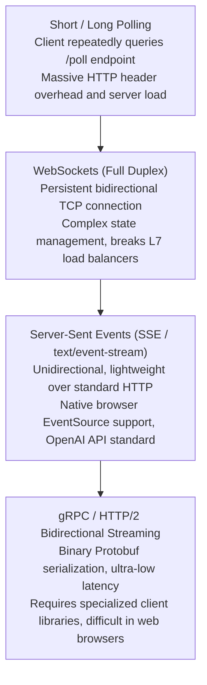

# 21. Ingress & Real-Time Streaming Gateways — SSE, gRPC & Long Reasoning Timeouts

> **Target Audience**: Networking Engineers, Kubernetes Platform Administrators, and Frontend/Full-Stack Developers integrating live AI streaming into user interfaces.  
> **Prerequisites**: HTTP/1.1 and HTTP/2 protocol fundamentals, Kubernetes Ingress and Services (from [19-kubernetes-manifests-for-deepseek.md](19-kubernetes-manifests-for-deepseek.md)), and SSE protocol basics.  
> **Estimated Study Time**: 55 minutes.  
> **What You Will Master**: The physical networking mechanics of **Server-Sent Events (SSE)**, neutralizing the **Proxy Buffering Trap** in NGINX and Traefik, tuning long reasoning timeout ceilings (600s) for **DeepSeek-R1**, and implementing resilient streaming gateways on the **NVIDIA DGX Spark**.

---

## 📑 Table of Contents
1. [Foundational Scaffolding: The Streaming Networking Problem](#1-foundational-scaffolding-the-streaming-networking-problem)
2. [Co-Related Concepts & The Evolution of AI Transport Protocols](#2-co-related-concepts--the-evolution-of-ai-transport-protocols)
3. [Deep First-Principles: Server-Sent Events (SSE) Protocol Anatomy](#3-deep-first-principles-server-sent-events-sse-protocol-anatomy)
4. [The Proxy Buffering Trap: Why Default Reverse Proxies Break LLMs](#4-the-proxy-buffering-trap-why-default-reverse-proxies-break-llms)
5. [The Reasoner Timeout Crisis: Handling Multi-Minute `<think>` Blocks](#5-the-reasoner-timeout-crisis-handling-multi-minute-think-blocks)
6. [Comparative Analysis: NGINX vs. Traefik vs. Envoy vs. Cloudflare](#6-comparative-analysis-nginx-vs-traefik-vs-envoy-vs-cloudflare)
7. [Production Gateway Manifests (NGINX & Traefik for K3s)](#7-production-gateway-manifests-nginx--traefik-for-k3s)
8. [Hands-On Python Lab: End-to-End SSE Latency Benchmarking Client](#8-hands-on-python-lab-end-to-end-sse-latency-benchmarking-client)
9. [Practice Exercises with Step-by-Step Solutions](#9-practice-exercises-with-step-by-step-solutions)
10. [Troubleshooting Guide & Diagnostic Runbook](#10-troubleshooting-guide--diagnostic-runbook)

---

## 1. Foundational Scaffolding: The Streaming Networking Problem

### Traditional REST vs. Generative Token Streams
In traditional web applications (such as querying a PostgreSQL database or fetching a user profile), the backend produces a complete response object:
```json
HTTP/1.1 200 OK
Content-Length: 142
{"user_id": 104, "status": "active", "roles": ["admin"]}
```
The entire payload is packaged into a single TCP frame and delivered immediately.

In generative LLMs, waiting for the entire 1,500-token answer to generate before sending an HTTP response causes an agonizing **15 to 30 second delay** where the user stares at a blank screen. To deliver a fluid user experience, the inference engine emits tokens incrementally as they roll off the GPU Tensor Cores.

```
                          STREAMING ARCHITECTURAL FLOW
┌──────────────┐          ┌───────────────────────┐          ┌───────────────────────┐
│ Browser / UI │ ◄─────── │ Ingress Proxy Gateway │ ◄─────── │ vLLM / SGLang Pod     │
│ Client       │   SSE    │ (NGINX / Traefik)     │   HTTP   │ (Blackwell GB10 GPU)  │
└──────────────┘          └───────────────────────┘          └───────────────────────┘
      ▲                              ▲                                   ▲
      │                              │                                   │
      │ 1 Token every 15ms           │ MUST FLUSH TCP IMMEDIATELY!       │ Generates Token
      │ Typewriter effect            │ Do NOT buffer in memory!          │ Pushes to SSE Stream
```

### The Garden Hose vs. Bucket Brigade Analogy
* **Default Proxy Buffering**: Like a fire brigade using buckets. A firefighter refuses to pass water until the 5-gallon bucket is completely full. If the water source is a slow drip (token generation), the house burns down while waiting for the bucket to fill.
* **Non-Buffering Streaming**: Like a high-pressure garden hose. The moment water enters the hose, it sprays out of the nozzle continuously without waiting to fill any reservoir.

---

## 2. Co-Related Concepts & The Evolution of AI Transport Protocols



### Why the Industry Standardized on SSE
The OpenAI Chat Completions API standard (`/v1/chat/completions` with `"stream": true`) chose **Server-Sent Events** because:
1. It runs over standard HTTP/1.1 and HTTP/2 without requiring protocol upgrades like WebSockets.
2. It is natively supported in web browsers via JavaScript's `fetch()` ReadableStream or `EventSource`.
3. It traverses enterprise firewalls and corporate proxies that often terminate or block WebSockets.

---

## 3. Deep First-Principles: Server-Sent Events (SSE) Protocol Anatomy

An SSE stream consists of an ongoing HTTP response with no fixed `Content-Length`. Instead, it uses **Chunked Transfer Encoding** (`Transfer-Encoding: chunked` in HTTP/1.1) or HTTP/2 DATA frames:

```http
HTTP/1.1 200 OK
Content-Type: text/event-stream; charset=utf-8
Cache-Control: no-cache, no-transform
Connection: keep-alive
X-Accel-Buffering: no

data: {"id":"chat-1","choices":[{"delta":{"role":"assistant","content":""}}]}

data: {"id":"chat-1","choices":[{"delta":{"content":"<think>"}}]}

data: {"id":"chat-1","choices":[{"delta":{"content":"\nLet"}}]}

data: {"id":"chat-1","choices":[{"delta":{"content":" us"}}]}

data: {"id":"chat-1","choices":[{"delta":{"content":" calculate"}}]}

data: [DONE]
```

### Crucial SSE Framing Rules:
* Each event line must begin with the literal prefix `data: `.
* Each message must terminate with **two consecutive newline characters (`\n\n`)**.
* The stream is gracefully closed when the server transmits the terminal sentinel: `data: [DONE]\n\n`.

---

## 4. The Proxy Buffering Trap: Why Default Reverse Proxies Break LLMs

Reverse proxies (like NGINX, HAProxy, and Traefik) were originally engineered to protect slow upstream servers from fast clients. 
By default:
1. The proxy allocates an **internal memory buffer** (typically 4 KB, 8 KB, or 16 KB).
2. It reads chunks from the upstream vLLM pod into this buffer.
3. It holds the data in memory until the buffer is 100% full, and only then flushes a single large TCP packet to the client.

### Mathematical Proof of Perceived Latency Degradation
Let:
* Target buffer size $B = 4,096 \text{ bytes}$.
* Average token length = 4 bytes (encoded in UTF-8 JSON chunk = ~60 bytes total).
* Model generation throughput = 30 tokens/second.
* Bytes emitted per second = $30 \times 60 = 1,800 \text{ bytes/sec}$.

$$\text{Buffer Delay} = \frac{4,096 \text{ bytes}}{1,800 \text{ bytes/sec}} = \mathbf{2.27 \text{ seconds of artificial lag!}}$$

If the buffer is 16 KB (NGINX default on 64-bit systems), the user experiences **over 9 seconds of complete silence**, followed by a jarring dump of 250 tokens all at once!

### The Solution: Direct TCP Socket Flushing
We must explicitly instruct the reverse proxy to:
* Disable upstream response buffering (`proxy_buffering off;`).
* Set the `TCP_NODELAY` flag on the socket to disable Nagle's algorithm.
* Pass the `X-Accel-Buffering: no` header to downstream proxies.

---

## 5. The Reasoner Timeout Crisis: Handling Multi-Minute `<think>` Blocks

Conventional microservices enforce a strict **30-second or 60-second gateway timeout**.
In reasoning models like **DeepSeek-R1**:
* For complex mathematical proofs, competitive programming, or logic deduction, the model performs deep Chain-of-Thought search inside its internal `<think>...</think>` block.
* The model may compute for **90 to 180 seconds** before emitting its first output tokens to the stream!
* A standard reverse proxy sees no HTTP data for 60 seconds and terminates the connection with `504 Gateway Timeout`.

```
                    THE 504 GATEWAY TIMEOUT DISASTER
Client ──► Ingress Proxy ──► DeepSeek-R1 Pod (Blackwell GB10)
                 │                   │
                 │                   ├─ Thinking: Token 1... (inside <think>)
                 │                   ├─ Thinking: Token 100...
                 │                   ├─ Thinking: Token 500...
                 │                   │
        [60 Seconds Elapses]         │ (Still crunching proof)
                 │                   │
Ingress drops socket!                │
Returns HTTP 504 Gateway Timeout!    │
                 │                   │
                 ▼                   ▼
      User sees CRASH!      GPU compute wasted!
```

**Mandatory Rule**: All proxy read, send, and idle timeouts for DeepSeek-R1 must be set to at least **600 seconds (10 minutes)**.

---

## 6. Comparative Analysis: NGINX vs. Traefik vs. Envoy vs. Cloudflare

| Reverse Proxy | Buffering Disable Directive | Timeout Directive | SSE Realtime Performance | Native K8s Ingress |
| :--- | :--- | :--- | :--- | :--- |
| **Ingress-NGINX** | `proxy-buffering: "off"` | `proxy-read-timeout: "600"` | **Flawless (Instant flush)** | Kubernetes Standard |
| **Traefik (K3s Default)** | `maxResponseBodyBytes: 0` | `respondingTimeouts.readTimeout` | **Flawless** | K3s Built-in |
| **Envoy / Istio** | `route.timeout: 0s` | `stream_idle_timeout: 600s` | Excellent (HTTP/2 native) | Service Mesh standard |
| **Cloudflare Proxy** | Requires Enterprise Plan | Capped at 100s on Free/Pro | Poor (Kills long `<think>`) | Cloud edge CDN |

---

## 7. Production Gateway Manifests (NGINX & Traefik for K3s)

### 1. Ingress-NGINX Production Manifest (`01-nginx-streaming-ingress.yaml`)

```yaml
apiVersion: networking.k8s.io/v1
kind: Ingress
metadata:
  name: deepseek-streaming-ingress
  namespace: ai-inference
  annotations:
    kubernetes.io/ingress.class: "nginx"
    # CRITICAL: Disable all proxy buffering for immediate TCP token flushing
    nginx.ingress.kubernetes.io/proxy-buffering: "off"
    # CRITICAL: Extend timeouts to 10 minutes for DeepSeek-R1 reasoning chains
    nginx.ingress.kubernetes.io/proxy-connect-timeout: "60"
    nginx.ingress.kubernetes.io/proxy-send-timeout: "600"
    nginx.ingress.kubernetes.io/proxy-read-timeout: "600"
    # Instruct downstream CDNs not to buffer
    nginx.ingress.kubernetes.io/configuration-snippet: |
      more_set_headers "X-Accel-Buffering: no";
      more_set_headers "Cache-Control: no-cache, no-transform";
    # Allow large prompt payloads (up to 50MB for RAG context)
    nginx.ingress.kubernetes.io/proxy-body-size: "50m"
    # Enable HTTP/2 multiplexing
    nginx.ingress.kubernetes.io/server-tokens: "false"
spec:
  rules:
  - host: deepseek.local
    http:
      paths:
      - path: /
        pathType: Prefix
        backend:
          service:
            name: deepseek-r1-service
            port:
              number: 8000
```

### 2. Traefik IngressRoute for K3s on DGX Spark (`02-traefik-streaming.yaml`)

Because K3s deploys Traefik by default, use this custom `IngressRoute` and `Middleware`:

```yaml
apiVersion: traefik.io/v1alpha1
kind: Middleware
metadata:
  name: llm-streaming-policy
  namespace: ai-inference
spec:
  buffering:
    maxResponseBodyBytes: 0       # 0 completely disables response body buffering!
    memResponseBodyBytes: 0
  headers:
    customResponseHeaders:
      X-Accel-Buffering: "no"
      Cache-Control: "no-cache, no-transform"
---
apiVersion: traefik.io/v1alpha1
kind: IngressRoute
metadata:
  name: deepseek-traefik-route
  namespace: ai-inference
spec:
  entryPoints:
    - web
  routes:
  - match: Host(`deepseek.local`) && PathPrefix(`/`)
    kind: Rule
    services:
    - name: deepseek-r1-service
      port: 8000
    middlewares:
    - name: llm-streaming-policy
```

---

## 8. Hands-On Python Lab: End-to-End SSE Latency Benchmarking Client

This diagnostic script connects to your ingress gateway, verifies that buffering is completely disabled, and calculates the exact latency gap between successive tokens:

```python
#!/usr/bin/env python3
"""
benchmark_sse_gateway.py
Audits ingress gateway buffering behavior and measures live inter-token latency.
"""

import time
import json
import requests

INGRESS_URL = "http://deepseek.local/v1/chat/completions"
HEADERS = {
    "Content-Type": "application/json",
    "Accept": "text/event-stream"
}

PAYLOAD = {
    "model": "deepseek-r1",
    "messages": [
        {"role": "user", "content": "Count from 1 to 20 slowly, explaining each number in 1 short phrase."}
    ],
    "temperature": 0.6,
    "max_tokens": 256,
    "stream": True
}

def audit_gateway_streaming():
    print(f"[*] Dispatching streaming request to: {INGRESS_URL}")
    start_time = time.perf_counter()
    
    response = requests.post(INGRESS_URL, headers=HEADERS, json=PAYLOAD, stream=True, timeout=600)
    
    # 1. Audit HTTP Headers
    print("\n" + "=" * 60)
    print("GATEWAY RESPONSE HEADERS AUDIT")
    print("=" * 60)
    content_type = response.headers.get("Content-Type", "")
    buffering_header = response.headers.get("X-Accel-Buffering", "")
    transfer_encoding = response.headers.get("Transfer-Encoding", "")
    
    print(f"Status Code        : {response.status_code}")
    print(f"Content-Type       : {content_type}")
    print(f"Transfer-Encoding  : {transfer_encoding}")
    print(f"X-Accel-Buffering  : {buffering_header}")
    
    if "text/event-stream" not in content_type:
        print("[!] WARNING: Content-Type is not text/event-stream! Gateway may be stripping headers.")
    if buffering_header != "no":
        print("[!] WARNING: X-Accel-Buffering: no is missing! Proxies may buffer data.")
    print("=" * 60 + "\n")
    
    # 2. Measure Live Token Arrival
    first_token_time = None
    last_token_time = None
    latencies = []
    token_count = 0
    
    print("[*] Streaming Tokens:")
    for line in response.iter_lines():
        if not line:
            continue
        decoded = line.decode('utf-8').strip()
        if not decoded.startswith("data: "):
            continue
        data_body = decoded[6:]
        if data_body == "[DONE]":
            break
            
        now = time.perf_counter()
        if first_token_time is None:
            first_token_time = now
            ttft_ms = (first_token_time - start_time) * 1000
            print(f"\n[✓] First Token Received! TTFT: {ttft_ms:.2f} ms\n")
        else:
            delta_ms = (now - last_token_time) * 1000
            latencies.append(delta_ms)
            
        last_token_time = now
        token_count += 1
        
        try:
            chunk = json.loads(data_body)
            delta = chunk["choices"][0]["delta"].get("content", "")
            print(delta, end="", flush=True)
        except json.JSONDecodeError:
            pass

    print("\n\n" + "=" * 60)
    print("STREAMING JITTER AUDIT")
    print("=" * 60)
    if latencies:
        avg_itl = sum(latencies) / len(latencies)
        max_itl = max(latencies)
        print(f"Total Streamed Tokens   : {token_count}")
        print(f"Average Inter-Token Gap : {avg_itl:.2f} ms")
        print(f"Maximum Jitter Spike    : {max_itl:.2f} ms")
        
        # Buffering detection heuristic
        if max_itl > 1500 and avg_itl < 20:
            print("[!] CRITICAL ALERT: Extreme jitter detected! Ingress is likely buffering chunks.")
        else:
            print("[✓] PASS: Smooth streaming verified. Zero proxy buffering.")
    print("=" * 60)

if __name__ == "__main__":
    audit_gateway_streaming()
```

---

## 9. Practice Exercises with Step-by-Step Solutions

### Exercise 1: Quantifying the User Impact of Proxy Buffering
**Scenario**: An AI chatbot generates text at **40 tokens per second**. Each token packet averages **75 bytes** of JSON overhead.
The enterprise ingress proxy is misconfigured with default **8 KB response buffering**.
**Question**: How many tokens will be trapped in the proxy buffer before the user sees the first text chunk, and how many seconds of frozen silence will the user experience?

#### Solution:
1. **Calculate tokens required to fill the 8 KB buffer**:
   $$\text{Tokens} = \frac{8 \times 1,024 \text{ bytes}}{75 \text{ bytes/token}} = \frac{8,192}{75} \approx \mathbf{109.2 \to 110 \text{ tokens}}$$
2. **Calculate user perceived delay**:
   $$\text{Delay} = \frac{110 \text{ tokens}}{40 \text{ tokens/sec}} = \mathbf{2.75 \text{ seconds of frozen silence!}}$$
3. *Impact*: Instead of seeing the first token in 100 ms, the user experiences almost 3 seconds of lag, after which 110 tokens explode onto the screen simultaneously.

---

### Exercise 2: Debugging Ingress Timeout Math
**Scenario**: A student submits a complex calculus problem to DeepSeek-R1. The model takes **140 seconds** to formulate its internal Chain-of-Thought before emitting the first token.
The Ingress is configured with:
* `proxy-connect-timeout: "30"`
* `proxy-read-timeout: "120"`
* `proxy-send-timeout: "120"`

**Question**: Will this request succeed or fail? What HTTP status code will the user see, and at what second?

#### Solution:
* The connection phase succeeds in under 1 second ($< 30\text{s}$).
* Once connected, the proxy waits for data from the vLLM pod.
* Because DeepSeek-R1 generates internal reasoning without emitting public tokens for 140 seconds, the proxy's `proxy-read-timeout` of 120 seconds is exceeded at $t = 120 \text{ seconds}$.
* **Result**: The request **fails at exactly 120 seconds with HTTP 504 Gateway Timeout**.
* **Fix**: Increase `proxy-read-timeout` to **`600`** (10 minutes).

---

## 10. Troubleshooting Guide & Diagnostic Runbook

### Issue 1: `504 Gateway Timeout` on Complex Reasoning Queries
* **Root Cause**: The client connection timed out while DeepSeek-R1 was computing in its `<think>` block.
* **Remediation**: In your Ingress resource, update the read and send timeouts:
  ```yaml
  nginx.ingress.kubernetes.io/proxy-read-timeout: "600"
  nginx.ingress.kubernetes.io/proxy-send-timeout: "600"
  ```

### Issue 2: `ERR_INCOMPLETE_CHUNKED_ENCODING` in Chrome
* **Root Cause**: The client or reverse proxy terminated the TCP socket before receiving the terminal `data: [DONE]` sentinel.
* **Remediation**: Check the vLLM container logs for an unhandled Python OOM exception that crashed the worker mid-stream:
  ```bash
  kubectl logs -n ai-inference -l app=deepseek-r1 --tail=100
  ```

---

## 🔗 Related Curriculum Modules
* **High-Throughput Engine**: [15-vllm-serving-deepseek-and-qwen.md](15-vllm-serving-deepseek-and-qwen.md)
* **Kubernetes Deployments**: [19-kubernetes-manifests-for-deepseek.md](19-kubernetes-manifests-for-deepseek.md)
* **Enterprise Gateway Load Balancing**: [28-litellm-proxy-gateway-load-balancing.md](28-litellm-proxy-gateway-load-balancing.md)
* **Web UI Frontend Integration**: [27-open-webui-deployment-and-integration.md](27-open-webui-deployment-and-integration.md)
