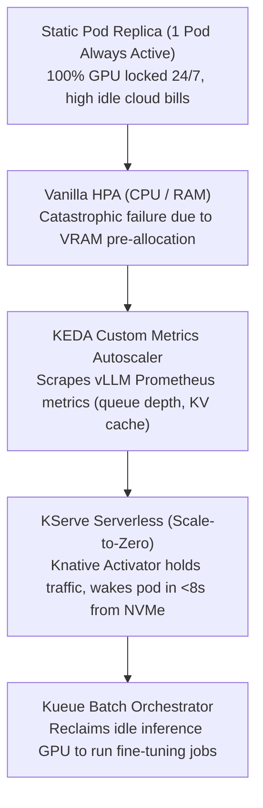
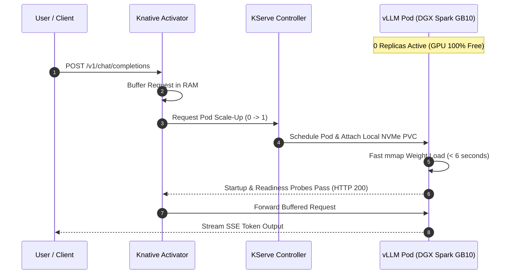

# 22. Autoscaling with KServe & Kueue — Queue-Depth HPA & Scale-to-Zero

> **Target Audience**: Platform Engineers, MLOps Architects, and SREs optimizing GPU utilization across mixed interactive serving and batch training workloads.  
> **Prerequisites**: Kubernetes Deployments and Services (from [19-kubernetes-manifests-for-deepseek.md](19-kubernetes-manifests-for-deepseek.md)), Prometheus metric scraping, and vLLM telemetry basics.  
> **Estimated Study Time**: 60 minutes.  
> **What You Will Master**: Why traditional CPU/RAM HPA fails for LLMs, autoscaling on **vLLM queue depth (`num_requests_waiting`)**, implementing **Scale-to-Zero serverless serving with KServe & Knative**, and fair-share GPU batch admission control with **Kueue** on the **NVIDIA DGX Spark**.

---

## 📑 Table of Contents
1. [Foundational Scaffolding: The VRAM Pre-Allocation Paradox](#1-foundational-scaffolding-the-vram-pre-allocation-paradox)
2. [Co-Related Concepts & The Evolution of Cloud-Native AI Scaling](#2-co-related-concepts--the-evolution-of-cloud-native-ai-scaling)
3. [Deep First-Principles: Queue-Depth & KV Cache Saturation Metrics](#3-deep-first-principles-queue-depth--kv-cache-saturation-metrics)
4. [Scale-to-Zero Serverless Mechanics with KServe & Knative](#4-scale-to-zero-serverless-mechanics-with-kserve--knative)
5. [Kueue Fair-Share Admission: Merging Serving with Batch Training](#5-kueue-fair-share-admission-merging-serving-with-batch-training)
6. [Comparative Analysis: KServe vs. KEDA vs. Ray Serve vs. SageMaker](#6-comparative-analysis-kserve-vs-keda-vs-ray-serve-vs-sagemaker)
7. [Hardware Grounding: The Single-Node Reality on DGX Spark (GB10)](#7-hardware-grounding-the-single-node-reality-on-dgx-spark-gb10)
8. [Complete Production Manifest Suite (KEDA, KServe, Kueue)](#8-complete-production-manifest-suite-keda-kserve-kueue)
9. [Hands-On Python Lab: Bursty Load Generator & Autoscaling Verification](#9-hands-on-python-lab-bursty-load-generator--autoscaling-verification)
10. [Practice Exercises with Step-by-Step Solutions](#10-practice-exercises-with-step-by-step-solutions)
11. [Troubleshooting Guide & Diagnostic Runbook](#11-troubleshooting-guide--diagnostic-runbook)

---

## 1. Foundational Scaffolding: The VRAM Pre-Allocation Paradox

### Why Traditional CPU/Memory HPA Fails for LLMs
Standard Kubernetes Horizontal Pod Autoscaler (HPA) monitors container CPU percentage and RAM usage:
```yaml
# THE NAIVE ANTI-PATTERN: DO NOT USE THIS FOR LLMs!
metrics:
- type: Resource
  resource:
    name: memory
    target:
      type: Utilization
      averageUtilization: 80
```
When this HPA controller observes an inference engine like vLLM or TensorRT-LLM:
1. **The VRAM Illusion**: During initialization, vLLM immediately pre-allocates **90% of GPU memory** to construct its physical PagedAttention block tables.
2. Even if the server is processing **0 active user requests**, the GPU memory shows **90% utilized**!
3. The traditional HPA controller believes the Pod is in a critical bottleneck state and triggers an immediate scale-out, exhausting cluster GPU quotas.
4. Conversely, during token decoding, host CPU utilization often hovers at **3% to 6%**, so a CPU-based HPA will never scale out, even if 100 users are stalled in an incoming queue!

```
                  THE TRADITIONAL HPA METRIC ILLUSION
┌────────────────────────────────────────────────────────────────────────────────────────┐
│ vLLM Engine State: IDLE (0 Active Requests)                                            │
│  - Host CPU Usage : 2.8%   ──► Traditional HPA: "System is idle, do nothing!"          │
│  - GPU VRAM Usage : 90.0%  ──► Traditional HPA: "Out of memory! Scale to 10 pods!"     │
└────────────────────────────────────────────────────────────────────────────────────────┘
```

### The Airport Runway Analogy
Air traffic control does not evaluate airport congestion by checking how much fuel is sitting inside the tanks of parked airplanes at passenger gates. It monitors the **taxiway takeoff queue**. If 20 airplanes are queued up waiting on the runway, you open a secondary runway.
For LLMs, the true congestion metric is the **vLLM request queue depth** (`vllm:num_requests_waiting`).

---

## 2. Co-Related Concepts & The Evolution of Cloud-Native AI Scaling



### Key Scaling Components Demystified:
* **KEDA (Kubernetes Event-driven Autoscaling)**: A lightweight Kubernetes operator that drives pod autoscaling based on arbitrary event triggers (Kafka lag, Prometheus queries, Redis lengths).
* **KServe**: A cloud-native model serving platform built on top of Knative and Istio, enabling declarative multi-model routing, canary rollouts, and **Scale-to-Zero**.
* **Knative Activator**: An in-memory reverse proxy that catches incoming HTTP requests when 0 pods are running, buffers the payload, signals KServe to boot a pod, and delivers the request once the pod is ready.
* **Kueue**: A Kubernetes-native job queueing system that manages resource quotas across batch jobs (PyTorch distributed, Ray, Job) and interactive serving workloads.

---

## 3. Deep First-Principles: Queue-Depth & KV Cache Saturation Metrics

vLLM exposes rich Prometheus metrics on port `8000/metrics`. Two critical signals govern autoscaling decisions:

```
┌────────────────────────────────────────────────────────────────────────┐
│ CRITICAL TELEMETRY SIGNALS IN vLLM EXPORTER                            │
├────────────────────────────────────────────────────────────────────────┤
│ 1. vllm:num_requests_waiting                                           │
│    Number of HTTP requests queued in the scheduler waiting for free   │
│    KV cache blocks. Normal healthy value = 0.                          │
│    Threshold for Scale-Up: > 5 requests for > 30 seconds.              │
├────────────────────────────────────────────────────────────────────────┤
│ 2. vllm:gpu_cache_usage_factor                                         │
│    Fraction of PagedAttention blocks actively holding token cache.     │
│    0.0 = completely free, 1.0 = completely full.                      │
│    Threshold for Warning: > 0.85 (Imminent preemption danger!).        │
└────────────────────────────────────────────────────────────────────────┘
```

### The Kubernetes Autoscaling Math Formulation
The Horizontal Pod Autoscaler calculates the desired replica count using:

$$\text{Desired Replicas} = \left\lceil \text{Current Replicas} \times \left( \frac{\text{Current Metric Value}}{\text{Target Metric Value}} \right) \right\rceil$$

For example, if:
* Current Replicas = 1
* Current Metric (`sum(vllm:num_requests_waiting)`) = 18 requests waiting
* Target Metric Threshold = 6 requests

$$\text{Desired Replicas} = \left\lceil 1 \times \left( \frac{18}{6} \right) \right\rceil = \mathbf{3 \text{ Replicas}}$$

---

## 4. Scale-to-Zero Serverless Mechanics with KServe & Knative

On high-end hardware like the **Grace Blackwell GB10**, letting a GPU sit completely idle over a 12-hour night shift wastes valuable compute capacity.
**Scale-to-Zero** allows the inference pod to shut down completely when traffic ceases for a configurable duration (e.g., 10 minutes):



Because weights are pre-warmed on direct-attached NVMe storage (as proven in [20-nvme-local-storage-and-weight-caching.md](20-nvme-local-storage-and-weight-caching.md)), cold-start recovery takes **under 8 seconds**, which is well within acceptable tolerance for serverless enterprise batch triggers!

---

## 5. Kueue Fair-Share Admission: Merging Serving with Batch Training

When the inference deployment scales to zero, what should the GPU do? 
It should train!
**Kueue** acts as the cluster gatekeeper:
1. Data scientists submit batch jobs (LoRA fine-tuning, RL rollout evaluations) to a Kueue `LocalQueue`.
2. When interactive serving is active, the GPU quota (`nominalQuota: 1`) is occupied; Kueue holds the training jobs in an orderly `Pending` state.
3. The moment KServe scales inference to 0 replicas, Kueue detects the released GPU resource and **immediately admits the training job**!
4. When a user sends an interactive query during business hours, KServe pre-empts the batch job, restoring immediate inference priority.

---

## 6. Comparative Analysis: KServe vs. KEDA vs. Ray Serve vs. SageMaker

| Feature / Architecture | KServe (v0.14+) | KEDA + Deployment | Ray Serve (KubeRay) | AWS SageMaker Serverless |
| :--- | :--- | :--- | :--- | :--- |
| **Autoscaling Metric** | Concurrency, RPS, KEDA | Any Prometheus metric | Custom replicas & Ray queue | Managed HTTP concurrency |
| **Scale-to-Zero** | **Native (Knative Activator)**| Supported (KEDA HTTP add-on)| Supported | Native |
| **Cold-Start Time** | **<8s (with NVMe PVC)** | 30–60 seconds | 20–45 seconds | 45–90 seconds |
| **Multi-Node MoE Serving** | Via Torch Distributed | Manual configuration | **Native Ray cluster** | Manual |
| **Batch Job Integration** | Integrates with Kueue | Manual orchestration | Ray Train integration | Separate batch endpoints |

---

## 7. Hardware Grounding: The Single-Node Reality on DGX Spark (GB10)

The **NVIDIA DGX Spark** contains **one physical Blackwell GB10 GPU (128 GB Unified Memory)**.
In this single-GPU context:
* You cannot scale out to `replicas: 4` on the same physical board unless you configure NVIDIA Multi-Process Service (MPS) or GPU time-slicing.
* **The Recommended Production Sizing**:
  * Set `minReplicas: 0` (Scale-to-Zero enabled).
  * Set `maxReplicas: 1` (Dedicated pass-through of the entire GB10 chip).
  * Use **KEDA / Kueue** to arbitrate between the 1 inference replica and queued batch training jobs.

---

## 8. Complete Production Manifest Suite (KEDA, KServe, Kueue)

### 1. KEDA ScaledObject for vLLM Queue Depth (`keda-vllm-scaler.yaml`)

```yaml
apiVersion: keda.sh/v1alpha1
kind: ScaledObject
metadata:
  name: vllm-queue-depth-scaler
  namespace: ai-inference
spec:
  scaleTargetRef:
    apiVersion: apps/v1
    kind: Deployment
    name: deepseek-r1-serving
  minReplicaCount: 0              # Scale-to-Zero when idle
  maxReplicaCount: 1              # Bound to 1 physical GB10 GPU
  cooldownPeriod: 600             # Wait 10 minutes (600s) before scaling down to 0
  pollingInterval: 10             # Poll Prometheus every 10 seconds
  triggers:
  # Trigger A: Waiting Requests in vLLM Scheduler Queue
  - type: prometheus
    metadata:
      serverAddress: http://prometheus-k8s.monitoring.svc:9090
      metricName: vllm_num_requests_waiting
      query: sum(vllm:num_requests_waiting{namespace="ai-inference"})
      threshold: "1"              # Wake up or scale if >= 1 request waiting
  # Trigger B: KV Cache High Watermark
  - type: prometheus
    metadata:
      serverAddress: http://prometheus-k8s.monitoring.svc:9090
      metricName: vllm_gpu_cache_usage_factor
      query: max(vllm:gpu_cache_usage_factor{namespace="ai-inference"})
      threshold: "0.85"           # Flag high utilization
```

### 2. Kueue ClusterQueue & ResourceFlavor Configuration (`kueue-dgx-setup.yaml`)

```yaml
apiVersion: kueue.x-k8s.io/v1beta1
kind: ResourceFlavor
metadata:
  name: dgx-spark-gb10-flavor
spec:
  nodeLabels:
    ai.infra/gpu-type: blackwell-gb10
---
apiVersion: kueue.x-k8s.io/v1beta1
kind: ClusterQueue
metadata:
  name: dgx-spark-cluster-queue
spec:
  namespaceSelector: {}
  resourceGroups:
  - coveredResources: ["nvidia.com/gpu", "cpu", "memory"]
    flavors:
    - name: dgx-spark-gb10-flavor
      resources:
      - name: "nvidia.com/gpu"
        nominalQuota: 1
      - name: "cpu"
        nominalQuota: "32"
      - name: "memory"
        nominalQuota: "96Gi"
---
apiVersion: kueue.x-k8s.io/v1beta1
kind: LocalQueue
metadata:
  name: batch-training-queue
  namespace: ai-inference
spec:
  clusterQueue: dgx-spark-cluster-queue
```

### 3. Production KServe `InferenceService` Manifest (`kserve-vllm.yaml`)

```yaml
apiVersion: serving.kserve.io/v1beta1
kind: InferenceService
metadata:
  name: deepseek-r1-serverless
  namespace: ai-inference
  annotations:
    serving.kserve.io/autoscalerClass: "keda"
    serving.kserve.io/targetMetric: "vllm:num_requests_waiting"
spec:
  predictor:
    minReplicas: 0
    maxReplicas: 1
    scaleTarget: 5
    scaleMetric: "concurrency"
    model:
      modelFormat:
        name: vLLM
      storageUri: "pvc://nvme-model-cache-pvc/DeepSeek-R1-Distill-Qwen-32B"
      args:
        - "--gpu-memory-utilization=0.90"
        - "--max-model-len=32768"
        - "--enable-chunked-prefill"
        - "--kv-cache-dtype=fp8"
      resources:
        limits:
          nvidia.com/gpu: "1"
          memory: "96Gi"
          cpu: "24"
        requests:
          nvidia.com/gpu: "1"
          memory: "32Gi"
          cpu: "8"
```

---

## 9. Hands-On Python Lab: Bursty Load Generator & Autoscaling Verification

This script generates synthetic concurrent load against the serving endpoint to trigger autoscaling alarms:

```python
#!/usr/bin/env python3
"""
load_generator_autoscale.py
Simulates a burst of concurrent users to observe Prometheus metrics and KEDA scaling.
"""

import time
import asyncio
import aiohttp

TARGET_URL = "http://deepseek.local/v1/chat/completions"
CONCURRENT_USERS = 25  # High concurrency to saturate single GPU and create queue

async def send_prompt(session, user_id):
    payload = {
        "model": "deepseek-r1",
        "messages": [
            {"role": "user", "content": f"User {user_id}: Write a detailed 500-word essay on distributed consensus."}
        ],
        "temperature": 0.7,
        "max_tokens": 512,
        "stream": False
    }
    
    start = time.perf_counter()
    try:
        async with session.post(TARGET_URL, json=payload, timeout=300) as resp:
            status = resp.status
            elapsed = time.perf_counter() - start
            print(f"[User {user_id:02d}] Finished with HTTP {status} in {elapsed:.2f}s")
    except Exception as e:
        print(f"[User {user_id:02d}] Request Error: {e}")

async def run_burst():
    print(f"[*] Firing burst of {CONCURRENT_USERS} simultaneous requests to force queue build-up...")
    async with aiohttp.ClientSession() as session:
        tasks = [send_prompt(session, i) for i in range(CONCURRENT_USERS)]
        await asyncio.gather(*tasks)

if __name__ == "__main__":
    asyncio.run(run_burst())
```

---

## 10. Practice Exercises with Step-by-Step Solutions

### Exercise 1: Computing Metric Thresholds for KEDA
**Scenario**: You serve `Qwen2.5-32B`. Benchmarking shows that the Blackwell GB10 GPU can process **6 concurrent active streams** with an average Inter-Token Latency (ITL) under **25 ms/token**.
When active streams exceed 6, ITL spikes above your SLA threshold of 40 ms/token.
**Question**: How would you configure the KEDA trigger query and threshold to scale up *before* SLA violation occurs?

#### Solution:
* When active streams hit 6, vLLM's internal KV cache is near capacity.
* Requests exceeding 6 will be shifted by the vLLM scheduler into the waiting queue: `vllm:num_requests_waiting`.
* **KEDA Configuration**:
  * Set `metricName: vllm_num_requests_waiting`.
  * Set `threshold: "2"` (trigger immediately when 2 or more requests are stuck waiting).
  * Set `cooldownPeriod: 300` (prevent scaling down until queue has been 0 for 5 minutes).

---

### Exercise 2: Preventing Autoscaling Flapping (Thrashing)
**Scenario**: During intermittent bursts, traffic arrives every 4 minutes, lasts for 45 seconds, and then stops.
With default KEDA settings (`cooldownPeriod: 60`), the system scales up to 1 pod, scales down to 0 after 60 seconds, and then must cold-start again 2 minutes later.
**Question**: What exact parameter in the `ScaledObject` prevents this flapping behavior, and what is its optimal value?

#### Solution:
* The parameter is **`cooldownPeriod`** in seconds.
* **Calculation**:
  * If request bursts occur every 4 to 5 minutes, setting `cooldownPeriod: 600` (10 minutes) ensures the pod remains alive in memory during the intermediate valleys.
  * The pod only scales down to 0 during true sustained idle periods (such as overnight or over weekends).

---

## 11. Troubleshooting Guide & Diagnostic Runbook

### Issue 1: KEDA ScaledObject Status Shows `FailedGetMetrics`
* **Root Cause**: KEDA cannot connect to the Prometheus server or the PromQL query returned an empty result because the vLLM metrics endpoint has no label matching `namespace="ai-inference"`.
* **Remediation**:
  1. Test the PromQL query directly in the Prometheus UI:
     ```promql
     sum(vllm:num_requests_waiting{namespace="ai-inference"})
     ```
  2. If empty, remove the namespace filter to inspect raw metric labels:
     ```promql
     sum(vllm:num_requests_waiting)
     ```

### Issue 2: Knative Activator Returns `HTTP 503 Service Unavailable` on Cold Start
* **Root Cause**: The vLLM pod took longer to start than Knative's default request hold timeout (default 60 seconds).
* **Remediation**: Update Knative configuration to extend the activation timeout:
  ```bash
  kubectl edit configmap config-network -n knative-serving
  # Set: activator-read-timeout: "180s"
  ```

---

## 🔗 Related Curriculum Modules
* **vLLM Serving Core**: [15-vllm-serving-deepseek-and-qwen.md](15-vllm-serving-deepseek-and-qwen.md)
* **Kubernetes Deployments**: [19-kubernetes-manifests-for-deepseek.md](19-kubernetes-manifests-for-deepseek.md)
* **NVMe Model Caching**: [20-nvme-local-storage-and-weight-caching.md](20-nvme-local-storage-and-weight-caching.md)
* **Distributed RL Rollouts**: [25-distributed-rl-rollout-infrastructure.md](25-distributed-rl-rollout-infrastructure.md)
