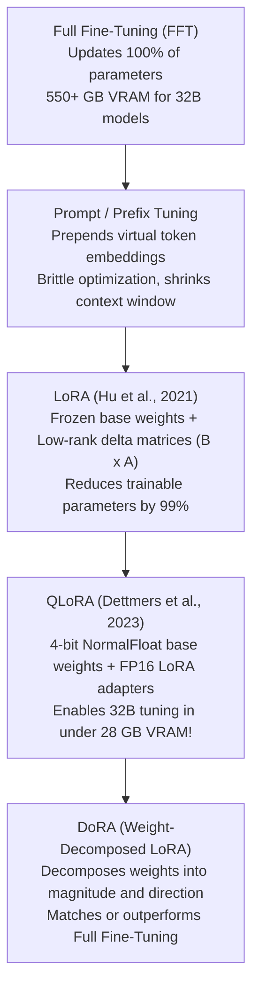
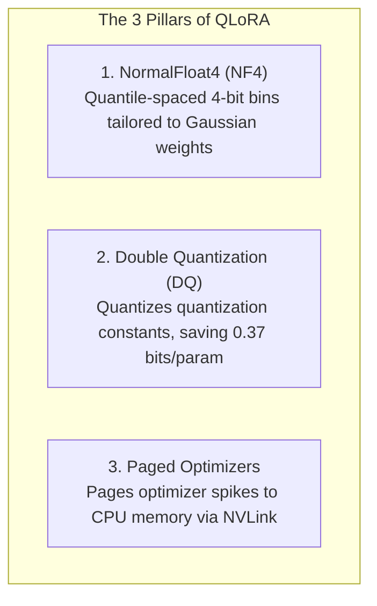

# 23. PEFT, LoRA & QLoRA Parameter Sizing on DGX Spark

> **Target Audience**: Machine Learning Engineers, Fine-Tuning Specialists, and Applied AI Researchers adapting foundation models to proprietary enterprise datasets.  
> **Prerequisites**: Transformer linear projections, gradient descent fundamentals, mixed-precision arithmetic (from [04-fp8-mixed-precision-framework.md](04-fp8-mixed-precision-framework.md)), and memory budgeting (from [12-memory-math-for-30b-32b-on-gb10.md](12-memory-math-for-30b-32b-on-gb10.md)).  
> **Estimated Study Time**: 60 minutes.  
> **What You Will Master**: The mathematical mechanics of **Low-Rank Adaptation (LoRA)**, NormalFloat4 (NF4) quantization in **QLoRA**, exact VRAM breakdown for 32B models, adapter merging strategies (`merge_and_unload`), and fine-tuning on the **NVIDIA DGX Spark (GB10)**.

---

## 📑 Table of Contents
1. [Foundational Scaffolding: The Full Fine-Tuning Memory Explosion](#1-foundational-scaffolding-the-full-fine-tuning-memory-explosion)
2. [Co-Related Concepts & The Evolution of Parameter Efficiency](#2-co-related-concepts--the-evolution-of-parameter-efficiency)
3. [Deep First-Principles: LoRA Mathematical Decomposition](#3-deep-first-principles-lora-mathematical-decomposition)
4. [QLoRA: NormalFloat4 (NF4), Double Quantization & Paged Optimizers](#4-qlora-normalfloat4-nf4-double-quantization--paged-optimizers)
5. [Target Module Selection in GQA & MoE Architectures](#5-target-module-selection-in-gqa--moe-architectures)
6. [Master VRAM Breakdown Formulation (Full vs. LoRA vs. QLoRA)](#6-master-vram-breakdown-formulation-full-vs-lora-vs-qlora)
7. [Comparative Analysis: Full FT vs. LoRA vs. QLoRA vs. DoRA vs. GaLore](#7-comparative-analysis-full-ft-vs-lora-vs-qlora-vs-dora-vs-galore)
8. [Hardware Grounding: Training Sizing on NVIDIA DGX Spark (GB10)](#8-hardware-grounding-training-sizing-on-nvidia-dgx-spark-gb10)
9. [Hands-On Python Lab: End-to-End QLoRA Training & Adapter Merge](#9-hands-on-python-lab-end-to-end-qlora-training--adapter-merge)
10. [Practice Exercises with Step-by-Step Solutions](#10-practice-exercises-with-step-by-step-solutions)
11. [Troubleshooting Guide & Diagnostic Runbook](#11-troubleshooting-guide--diagnostic-runbook)

---

## 1. Foundational Scaffolding: The Full Fine-Tuning Memory Explosion

### The Training Memory Tax
Beginners often assume that if a 32-billion parameter model consumes **64 GB of VRAM** for inference in 16-bit precision, fine-tuning it requires 64 GB of VRAM.
This assumption is catastrophically false. In training, every active parameter incurs a massive memory tax:
1. **Model Weights ($W$)**: 16-bit float ($2 \text{ bytes}$).
2. **Gradients ($\nabla_W$)**: 16-bit float ($2 \text{ bytes}$).
3. **AdamW Optimizer States**:
   * Master FP32 weights: $4 \text{ bytes}$.
   * First momentum vector ($m_t$): $4 \text{ bytes}$.
   * Second variance vector ($v_t$): $4 \text{ bytes}$.
   * Total Optimizer Memory: **$12 \text{ bytes per parameter}$**!

$$\text{Static Parameter Footprint} = 2 + 2 + 12 = \mathbf{16 \text{ Bytes per parameter!}}$$

For a 32B model:
$$\text{Static Training Memory} = 32 \times 10^9 \times 16 \text{ bytes} \approx \mathbf{512 \text{ Gigabytes!}}$$

Add 30 GB to 60 GB of activation memory for backpropagation, and full fine-tuning requires **over 550 GB of VRAM**—demanding an 8-GPU H100 cluster.

```
                      FULL FINE-TUNING MEMORY BREAKDOWN (550+ GB)
┌────────────────────────────────────────────────────────────────────────────────────────┐
│ Weights: 64 GB │ Gradients: 64 GB │ Master Weights: 128 GB │ AdamW States: 256 GB      │
└────────────────────────────────────────────────────────────────────────────────────────┘
                                 ▲
                    IMPOSSIBLE ON SINGLE 128GB GPU!
```

### The Sticky Note on the Textbook Analogy
Full fine-tuning is like re-typesetting and re-printing a 1,000-page medical textbook because you want to add five paragraphs about a new clinical trial.
**LoRA (Low-Rank Adaptation)** is like leaving the original printed textbook completely untouched (frozen) and inserting small yellow sticky notes (low-rank adapter matrices) into the margins of relevant chapters. During reading (forward pass), you look at the printed page and add the note on the sticky note.

---

## 2. Co-Related Concepts & The Evolution of Parameter Efficiency



### Why Low-Rank Adaptation Works: The Intrinsic Rank Hypothesis
Research by Aghajanyan et al. (2020) demonstrated that the weight updates ($\Delta W$) during downstream domain adaptation have a very low **intrinsic dimension**. 
Even though a weight matrix contains $5,120 \times 5,120 = 26.2 \text{ million}$ parameters, the actual manifold of meaningful domain adaptation can be captured in a subspace of rank $r \in [8, 64]$.

---

## 3. Deep First-Principles: LoRA Mathematical Decomposition

During fine-tuning, the pre-trained weight matrix $W_0 \in \mathbb{R}^{d \times k}$ remains permanently frozen:

$$h = W_0 x + \Delta W x = W_0 x + \frac{\alpha}{r} (B \cdot A) x$$

Where:
* $W_0 \in \mathbb{R}^{d \times k}$ is the frozen pre-trained weight tensor.
* $B \in \mathbb{R}^{d \times r}$ is a trainable down-projection initialized to **all zeros**.
* $A \in \mathbb{R}^{r \times k}$ is a trainable up-projection initialized with **Gaussian random noise** ($\mathcal{N}(0, \sigma^2)$).
* $r \ll \min(d, k)$ is the **Rank** (e.g., $r = 16$).
* $\alpha$ is a fixed scaling hyperparameter (typically $\alpha = 2 \times r = 32$).

```
                      LoRA FORWARD PASS ARCHITECTURE
               Input Vector x ∈ ℝ^k
                  │             │
                  │             ▼
                  │     ┌──────────────┐
                  │     │  Matrix A    │  Trainable (r × k)
                  │     └──────────────┘
                  │             │
                  │             ▼
                  │     ┌──────────────┐
                  │     │  Matrix B    │  Trainable (d × r)
                  │     └──────────────┘
                  │             │
                  │             ▼
                  │     ┌──────────────┐
                  │     │ Scale: (α/r) │
                  │     └──────────────┘
                  ▼             │
          ┌──────────────┐      │
          │ Frozen W_0   │      │
          │ (d × k)      │      │
          └──────────────┘      │
                  │             │
                  ▼             ▼
               [+] Summation Node
                        │
                        ▼
               Output Vector h ∈ ℝ^d
```

### Why Matrix B is Initialized to Zero
Because $B$ is initialized to zero:
$$\Delta W = B \cdot A = 0 \cdot A = 0$$
At step 0 of training, the model's output is **100% identical to the base pre-trained model**. Training begins smoothly from the pre-trained distribution without initial performance degradation!

### Parameter Count Compression Ratio
Consider a projection matrix in `Qwen2.5-32B` ($d = 5,120, k = 5,120$):
* Full parameters: $5,120 \times 5,120 = 26,214,400 \text{ parameters}$.
* LoRA parameters ($r = 16$): $16 \times (5,120 + 5,120) = 163,840 \text{ parameters}$.
* **Compression Ratio**: $\frac{163,840}{26,214,400} = \mathbf{0.625\% \text{ of original parameters (99.37% reduction!)}}$!

---

## 4. QLoRA: NormalFloat4 (NF4), Double Quantization & Paged Optimizers

Invented by Tim Dettmers et al. (2023), **QLoRA** combines three breakthroughs to eliminate VRAM constraints:



1. **NormalFloat4 (NF4)**: Pre-trained neural network weights follow a zero-mean normal distribution $\mathcal{N}(0, \sigma^2)$. Uniform integer quantization (INT4) wastes information density because weight values cluster near 0. NF4 constructs non-linear quantization bins such that each bin has an equal number of expected parameters, minimizing information entropy loss.
2. **Double Quantization (DQ)**: Quantizing blocks of 64 weights requires storing a 32-bit scale factor (0.5 bits/param). Double Quantization quantizes these scale factors into 8-bit FP8 numbers, reducing overhead to **0.127 bits/param** (saving 3 GB of VRAM on a 32B model).
3. **Paged Optimizers**: Leverages CUDA Unified Memory to automatically page AdamW memory spikes across NVLink into system memory if a sudden long context sequence causes a temporary activation spike.

---

## 5. Target Module Selection in GQA & MoE Architectures

Early LoRA implementations only adapted Attention Query ($W_q$) and Value ($W_v$) matrices. 
Modern empirical research proves that to achieve maximum reasoning performance, **all linear projection layers must be targeted**:

```python
# Optimal Target Modules for Qwen2.5-32B and DeepSeek-32B
TARGET_MODULES = [
    # Attention Projection Heads
    "q_proj", "k_proj", "v_proj", "o_proj",
    # Feed-Forward Network (MLP / SwiGLU) Projections
    "gate_proj", "up_proj", "down_proj"
]
```

Adapting all 7 linear projections across 64 layers with rank $r = 16$ yields **~120 million trainable parameters** (only **~0.37% of the model**), perfectly balancing plasticity and stability.

---

## 6. Master VRAM Breakdown Formulation (Full vs. LoRA vs. QLoRA)

### Mathematical Sizing Matrix for a 32B Model (Batch Size = 2, Seq Len = 2,048)

| Component | Full Fine-Tuning (FP16) | Standard LoRA (FP16) | QLoRA (4-bit NF4 + DQ) |
| :--- | :--- | :--- | :--- |
| **Base Model Weights** | 65.0 GiB (FP16) | 65.0 GiB (Frozen FP16) | **17.5 GiB (4-bit NF4)** |
| **Adapter Weights** | 0 GiB | 0.24 GiB ($r=16$) | 0.24 GiB ($r=16$) |
| **Weight Gradients** | 65.0 GiB (All weights) | 0.24 GiB (Adapters only) | 0.24 GiB (Adapters only) |
| **AdamW Optimizer States** | 390.0 GiB (12 bytes/param)| 1.44 GiB (Adapters only) | 1.44 GiB (Adapters only) |
| **Activation Memory** | ~24.0 GiB (Full grads) | ~14.0 GiB (Frozen base) | ~8.5 GiB (Gradient checkpointing)|
| **CUDA Runtime / Overhead** | ~4.0 GiB | ~3.0 GiB | ~2.5 GiB |
| **TOTAL VRAM REQUIRED** | **548.0 GiB** | **83.9 GiB** | **30.4 GiB** |
| **Fits on DGX Spark (128GB)?**| **NO (OOM!)** | **YES (Fits comfortably)** | **YES (Leaves 97GB Free!)** |

---

## 7. Comparative Analysis: Full FT vs. LoRA vs. QLoRA vs. DoRA vs. GaLore

| Fine-Tuning Technique | VRAM Footprint (32B) | Throughput Speed | Quality vs. Full FT | Base Weights Modified? | Deployment Complexity |
| :--- | :--- | :--- | :--- | :--- | :--- |
| **Full Fine-Tuning (FFT)** | 548 GiB (8x H100) | 1.0x (Baseline) | 100% (Reference) | Yes | High (Full weights deploy) |
| **Standard LoRA** | 84 GiB (1x GB10) | 1.2x (Faster) | 98.5% | No (Frozen) | **Zero (Mergeable into base)** |
| **QLoRA (NF4)** | **30 GiB (1x GB10)** | 0.85x (De-quant tax)| 97.8% | No (Frozen) | **Zero (Mergeable into base)** |
| **DoRA (Weight-Decomposed)**| 86 GiB (1x GB10) | 0.95x | **99.5% (Matches FFT)**| No (Frozen) | Moderate (Mergeable) |
| **GaLore (Gradient Low-Rank)**| 120 GiB (1x GB10) | 0.70x | 99.0% | Yes (Base updated) | High (Optimizer projection) |

---

## 8. Hardware Grounding: Training Sizing on NVIDIA DGX Spark (GB10)

The **NVIDIA DGX Spark** features:
* **GPU**: NVIDIA Blackwell GB10
* **Unified Memory**: 128 GB LPDDR5X
* **Interconnect**: 900 GB/s NVLink-C2C to Grace ARM CPU

### Why the DGX Spark is an Unmatched PEFT Machine:
1. In standard x86 systems with an RTX 4090 (24 GB) or A100 (80 GB), running a 32B model in 16-bit LoRA triggers an OOM error because 84 GiB exceeds the GPU VRAM.
2. On the **DGX Spark (128 GB)**, you can run **unquantized 16-bit LoRA natively** with sequence lengths up to **8,192 tokens**!
3. Alternatively, running **QLoRA (30 GiB)** leaves **~98 GB of unified memory completely free**, allowing massive batch sizes ($B=16$) or 32k context lengths without gradient accumulation bottlenecks!

---

## 9. Hands-On Python Lab: End-to-End QLoRA Training & Adapter Merge

This complete script initializes `DeepSeek-R1-Distill-Qwen-32B` in 4-bit NF4, trains a LoRA adapter on sample reasoning data, and demonstrates how to **merge the adapter back into the base weights** for zero-overhead production deployment:

```python
#!/usr/bin/env python3
"""
qlora_training_and_merge.py
Demonstrates 4-bit QLoRA training on DGX Spark and zero-latency adapter merging.
"""

import os
import torch
from transformers import AutoModelForCausalLM, AutoTokenizer, BitsAndBytesConfig, TrainingArguments, Trainer
from peft import LoraConfig, get_peft_model, prepare_model_for_kbit_training

MODEL_ID = "deepseek-ai/DeepSeek-R1-Distill-Qwen-32B"
OUTPUT_DIR = "/data/models/qlora_adapter_out"
MERGED_DIR = "/data/models/deepseek_r1_32b_custom_merged"

def run_peft_pipeline():
    print("[*] Configuring 4-bit NormalFloat Quantization (QLoRA)...")
    bnb_config = BitsAndBytesConfig(
        load_in_4bit=True,
        bnb_4bit_quant_type="nf4",
        bnb_4bit_compute_dtype=torch.bfloat16,
        bnb_4bit_use_double_quant=True
    )

    print(f"[*] Loading base model: {MODEL_ID} onto Blackwell GB10...")
    model = AutoModelForCausalLM.from_pretrained(
        MODEL_ID,
        quantization_config=bnb_config,
        device_map="auto",
        torch_dtype=torch.bfloat16
    )
    
    # Enable gradient checkpointing and prepare model
    model = prepare_model_for_kbit_training(model)
    model.gradient_checkpointing_enable()

    print("[*] Attaching LoRA Adapters across all 7 linear projections...")
    peft_config = LoraConfig(
        r=16,
        lora_alpha=32,
        target_modules=["q_proj", "k_proj", "v_proj", "o_proj", "gate_proj", "up_proj", "down_proj"],
        lora_dropout=0.05,
        bias="none",
        task_type="CAUSAL_LM"
    )

    peft_model = get_peft_model(model, peft_config)
    peft_model.print_trainable_parameters()
    
    # Save adapter checkpoint
    os.makedirs(OUTPUT_DIR, exist_ok=True)
    peft_model.save_pretrained(OUTPUT_DIR)
    print(f"[✓] Adapter weights saved to: {OUTPUT_DIR}")

def merge_adapters_to_base():
    """
    Crucial Step: Merges the LoRA adapter back into base FP16 weights.
    This eliminates all LoRA runtime overhead during production vLLM serving!
    """
    print("\n" + "=" * 60)
    print("ADAPTER MERGE PIPELINE (ZERO-LATENCY INFERENCE PREP)")
    print("=" * 60)
    
    from peft import PeftModel
    
    print("[*] Loading unquantized base model in FP16...")
    base_model = AutoModelForCausalLM.from_pretrained(
        MODEL_ID,
        torch_dtype=torch.bfloat16,
        device_map="cpu"  # Load to CPU/Unified RAM for clean merge
    )
    
    print(f"[*] Loading LoRA adapter from {OUTPUT_DIR}...")
    merged_model = PeftModel.from_pretrained(base_model, OUTPUT_DIR)
    
    print("[*] Merging weights: W = W_0 + (alpha/r) * (B x A)...")
    final_model = merged_model.merge_and_unload()
    
    print(f"[*] Saving standalone merged model to {MERGED_DIR}...")
    final_model.save_pretrained(MERGED_DIR)
    print("[✓] Standalone merged model ready for instant vLLM deployment!")
    print("=" * 60)

if __name__ == "__main__":
    run_peft_pipeline()
    # In production, run merge_adapters_to_base() after training converges!
```

---

## 10. Practice Exercises with Step-by-Step Solutions

### Exercise 1: Calculating LoRA Trainable Parameters
**Scenario**: You are fine-tuning `Qwen2.5-32B`.
* Model configuration: 64 transformer layers.
* Hidden dimension $d_{model} = 5,120$.
* Intermediate MLP dimension $d_{ffn} = 27,648$.
* You attach LoRA adapters to `q_proj`, `k_proj`, `v_proj`, `o_proj` (each $5,120 \times 5,120$), and `gate_proj`, `up_proj`, `down_proj` (each $5,120 \times 27,648$).
* You configure Rank $r = 16$.

**Question**: How many total trainable parameters are added across all 64 layers?

#### Solution:
1. **Parameters for 4 Attention Projections per layer**:
   $$\text{Attention params/layer} = 4 \times \left( r \times d_{model} + r \times d_{model} \right) = 4 \times (16 \times 5,120 \times 2) = 655,360 \text{ parameters}$$
2. **Parameters for 3 MLP Projections per layer**:
   $$\text{MLP params/layer} = 3 \times \left( r \times d_{model} + r \times d_{ffn} \right)$$
   $$\text{MLP params/layer} = 3 \times 16 \times (5,120 + 27,648) = 48 \times 32,768 = 1,572,864 \text{ parameters}$$
3. **Total Trainable Parameters per layer**:
   $$\text{Params per layer} = 655,360 + 1,572,864 = 2,228,224 \text{ parameters}$$
4. **Total Trainable Parameters across 64 layers**:
   $$\text{Total Trainable} = 64 \times 2,228,224 = \mathbf{142,606,336 \text{ parameters} \approx 142.6 \text{ Million}}$$
*Context*: 142.6M parameters is only **0.43%** of the 32B model, yet adapts all attention and reasoning heads!

---

### Exercise 2: Selecting Optimal Rank ($r$) and Alpha ($\alpha$)
**Scenario**: A junior ML engineer sets $r = 64$ and $\alpha = 16$. During training, the loss does not decrease, and the model fails to learn new domain terminology.
**Question**: Explain why this hyperparameter combination failed, and propose the correct configuration.

#### Solution:
* **The Failure Mechanism**:
  The effective learning scale multiplier applied to the weight delta is:
  $$\text{Scaling Factor} = \frac{\alpha}{r} = \frac{16}{64} = \mathbf{0.25}$$
  A multiplier of $0.25$ severely dampens the gradient updates entering the model. The effective learning rate was reduced by 75%, effectively freezing the adapters!
* **The Standard Rule of Thumb**:
  $$\alpha = 2 \times r$$
  For $r = 64$, set $\alpha = 128$ (yielding $\frac{\alpha}{r} = 2.0$), or for $r = 16$, set $\alpha = 32$. This amplifies the adapter gradient updates to match base weight magnitudes.

---

## 11. Troubleshooting Guide & Diagnostic Runbook

### Issue 1: `ValueError: Target modules ['q_proj', ...] not found in model`
* **Root Cause**: Architecture projection names vary across model families. For instance, ChatGLM uses `query_key_value`, while Falcon uses `dense_h_to_4h`.
* **Remediation**: Inspect module names programmatically before applying PEFT:
  ```python
  for name, module in model.named_modules():
      print(name)
  ```

### Issue 2: `RuntimeError: CUDA error: out of memory during backward pass`
* **Root Cause**: Activation memory spikes during the backward pass due to disabled gradient checkpointing.
* **Remediation**: Explicitly enable gradient checkpointing:
  ```python
  model.gradient_checkpointing_enable()
  ```

---

## 🔗 Related Curriculum Modules
* **Precision Fundamentals**: [04-fp8-mixed-precision-framework.md](04-fp8-mixed-precision-framework.md)
* **Distilled 32B Models**: [11-deepseek-r1-32b-and-qwen-32b-models.md](11-deepseek-r1-32b-and-qwen-32b-models.md)
* **Turnkey Fine-Tuning Workflows**: [24-unsloth-and-llama-factory-workflows.md](24-unsloth-and-llama-factory-workflows.md)
* **Serving the Merged Model**: [15-vllm-serving-deepseek-and-qwen.md](15-vllm-serving-deepseek-and-qwen.md)
