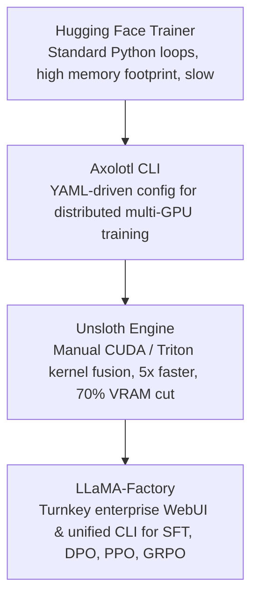

# 24. Unsloth & LLaMA-Factory Workflows — Accelerated Fine-Tuning & WebUI

> **Target Audience**: Machine Learning Engineers, Fine-Tuning Practitioners, and AI Product Teams needing high-velocity model adaptation with minimal operational friction.  
> **Prerequisites**: PEFT and LoRA foundations (from [23-peft-lora-qlora-parameter-sizing.md](23-peft-lora-qlora-parameter-sizing.md)), Linux CLI basics, and dataset formatting (Alpaca, ShareGPT).  
> **Estimated Study Time**: 55 minutes.  
> **What You Will Master**: Manual CUDA backpropagation kernels in **Unsloth**, eliminating the 10 GB cross-entropy logit memory tax, running multi-stage alignment (SFT $\to$ DPO) via **LLaMA-Factory**, and exporting quantized GGUF checkpoints on the **NVIDIA DGX Spark**.

---

## 📑 Table of Contents
1. [Foundational Scaffolding: Why Standard Autograd is Inefficient](#1-foundational-scaffolding-why-standard-autograd-is-inefficient)
2. [Co-Related Concepts & The Evolution of Fine-Tuning Toolchains](#2-co-related-concepts--the-evolution-of-fine-tuning-toolchains)
3. [Deep First-Principles: Unsloth Fused CUDA Backpropagation](#3-deep-first-principles-unsloth-fused-cuda-backpropagation)
4. [The Giant Logit Tensor Crisis & Fused Cross-Entropy](#4-the-giant-logit-tensor-crisis--fused-cross-entropy)
5. [Comparative Analysis: Unsloth vs. LLaMA-Factory vs. Axolotl vs. Torchtune](#5-comparative-analysis-unsloth-vs-llama-factory-vs-axolotl-vs-torchtune)
6. [Hardware Grounding: Optimization on NVIDIA DGX Spark (Grace ARM64 + GB10)](#6-hardware-grounding-optimization-on-nvidia-dgx-spark-grace-arm64--gb10)
7. [Hands-On Python Lab: Fast Unsloth Fine-Tuning & GGUF Export](#7-hands-on-python-lab-fast-unsloth-fine-tuning--gguf-export)
8. [LLaMA-Factory Production Runbook: SFT $\to$ DPO Alignment Pipeline](#8-llama-factory-production-runbook-sft--dpo-alignment-pipeline)
9. [Practice Exercises with Step-by-Step Solutions](#9-practice-exercises-with-step-by-step-solutions)
10. [Troubleshooting Guide & Diagnostic Runbook](#10-troubleshooting-guide--diagnostic-runbook)

---

## 1. Foundational Scaffolding: Why Standard Autograd is Inefficient

### The PyTorch Generic Execution Bottleneck
PyTorch's automatic differentiation engine (`torch.autograd`) is engineered for universal generality across all neural network architectures:
* Every operation in a transformer layer (`Linear`, `RMSNorm`, `SiLU`, `RoPE`, `Softmax`) is registered as a separate node in a dynamic computation graph.
* Intermediate activation tensors must be saved to High Bandwidth Memory (HBM) during the forward pass so they are available for gradient calculation in the backward pass.
* Dozens of separate, uncoordinated CUDA kernels are launched per layer, incurring host CPU overhead and keeping memory buses constantly saturated.

### The Hand-Crafted Sports Car Analogy
* **Standard PyTorch Autograd**: Like a mass-produced family sedan built on an automated factory line to drive on any road. It functions reliably, but it carries heavy shock absorbers and air conditioning units that slow it down.
* **Unsloth**: Like a hand-forged Formula 1 racing car stripped of all excess weight. Daniel and Michael Han manually rewrote the mathematical backward passes in raw **Triton and CUDA**, cutting training time by **60% to 80%** with **zero precision loss**.

```
                   PYTORCH AUTOGRAD VS. UNSLOTH FUSED BACKPROP
┌──────────────────────────────────────┐     ┌──────────────────────────────────────┐
│        Standard PyTorch Autograd     │     │             Unsloth Engine           │
│  - 5 to 8 separate CUDA kernels      │     │  - 1 Fused Triton / CUDA Kernel      │
│  - Giant intermediate activation     │     │  - Intermediate activations kept in  │
│    buffers dumped to HBM             │     │    GPU SRAM & registers              │
│  - 10 GB Logit matrix materialized   │     │  - Fused Cross-Entropy calculates    │
│  - Training: 18 hours                │     │    loss directly (Zero logit VRAM!)  │
│                                      │     │  - Training: 4.5 hours (4x faster!)  │
└──────────────────────────────────────┘     └──────────────────────────────────────┘
```

---

## 2. Co-Related Concepts & The Evolution of Fine-Tuning Toolchains



### The Alignment Pipeline Hierarchy:
1. **SFT (Supervised Fine-Tuning)**: Training on prompt-response pairs (`(x, y)`) to teach the model instruction following and tone.
2. **DPO (Direct Preference Optimization)**: Training on pairwise preferences (`(x, y_{chosen}, y_{rejected})`) to steer the model towards helpful responses without needing an unstable reinforcement learning reward model.
3. **GRPO (Group Relative Policy Optimization)**: DeepSeek's critic-free mathematical reasoning reinforcement learning engine (detailed in [05-deepseek-r1-and-grpo-reasoning.md](05-deepseek-r1-and-grpo-reasoning.md)).

---

## 3. Deep First-Principles: Unsloth Fused CUDA Backpropagation

In a standard transformer MLP block, the forward and backward passes execute sequentially:

$$\text{MLP Forward: } h = \left( \text{SiLU}(x W_{\text{gate}}) \odot (x W_{\text{up}}) \right) W_{\text{down}}$$

Standard PyTorch stores:
* $x$
* $a = x W_{\text{gate}}$
* $b = x W_{\text{up}}$
* $c = \text{SiLU}(a)$
* $d = c \odot b$

This requires writing and reading **five intermediate tensors to GPU HBM**.
**Unsloth fuses the entire backward pass**:
It recomputes $\text{SiLU}(a)$ on-the-fly inside fast GPU registers during backprop rather than reading it from HBM. Because GPU compute is 10x faster than memory bandwidth, **recomputing activations in registers is significantly faster than reading them from memory**!

---

## 4. The Giant Logit Tensor Crisis & Fused Cross-Entropy

In modern LLMs like `Qwen2.5-32B` and `DeepSeek-V3`, the vocabulary size $V$ is massive ($V = 152,064$ tokens).

### The Math of Naive Cross-Entropy Memory Allocation:
Before computing Cross-Entropy loss, the final hidden state $H \in \mathbb{R}^{B \times S \times d}$ must be multiplied by the language model head $W_{\text{lm}} \in \mathbb{R}^{d \times V}$:

$$\text{Logits Tensor Shape} = [B, S, V]$$

For a modest fine-tuning batch of Batch Size $B = 4$, Sequence Length $S = 4,096$, and Vocab $V = 152,064$ in FP32 ($4 \text{ bytes/element}$):

$$\text{Elements} = 4 \times 4,096 \times 152,064 = 2,491,482,112 \text{ float32 numbers}$$
$$\text{Memory Allocated} = 2,491,482,112 \times 4 \text{ bytes} \approx \mathbf{9.965 \text{ Gigabytes of VRAM!}}$$

Just to compute a single scalar loss value, PyTorch must allocate **10 Gigabytes of VRAM**! This single allocation is the primary cause of out-of-memory errors during fine-tuning.

### Unsloth's Fused Streaming Cross-Entropy:
Unsloth tiles the computation across vocabulary chunks directly in SRAM:
1. It projects hidden states against chunks of vocabulary (e.g., 4,096 tokens at a time).
2. It accumulates the log-sum-exp normalization factor online.
3. It computes the loss scalar directly without ever allocating the 10 GB $[B, S, V]$ tensor in VRAM!

---

## 5. Comparative Analysis: Unsloth vs. LLaMA-Factory vs. Axolotl vs. Torchtune

| Dimension / Metric | Unsloth | LLaMA-Factory | Axolotl | PyTorch Torchtune |
| :--- | :--- | :--- | :--- | :--- |
| **Primary Strength** | Raw speed & lowest VRAM | Multi-method WebUI & CLI | Large-scale multi-node clusters | Clean, hackable PyTorch code |
| **Speed Multiplier** | **3x to 5x faster** | 1.5x (with FlashAttn) | 1.5x | 1.0x (Standard) |
| **VRAM Reduction** | **Up to 70% reduction** | Standard PEFT | Standard PEFT | Low (Native PyTorch) |
| **WebUI Interface** | No (Python script based)| **Yes (LLaMA-Board GUI)**| No | No |
| **Supported Methods** | SFT, DPO, GRPO | SFT, DPO, ORPO, PPO, KTO | SFT, DPO, FFT | SFT, DPO |
| **Target Audience** | Performance engineers | Teams & product developers | HPC cluster administrators | Researchers writing custom archs|

---

## 6. Hardware Grounding: Optimization on NVIDIA DGX Spark (Grace ARM64 + GB10)

The **NVIDIA DGX Spark** combines:
* **Grace ARM Neoverse V2 CPU (aarch64)**
* **Blackwell GB10 GPU (128 GB Unified Memory)**

### Setup Considerations on DGX Spark:
1. **ARM64 Triton Wheels**: Unsloth relies heavily on OpenAI Triton for its fused kernels. Ensure Triton is compiled for ARM64:
   ```bash
   pip install triton --extra-index-url https://aiinfra.pkgs.visualstudio.com/PublicPackages/_packaging/Triton-ARM64/pypi/simple/
   ```
2. **Unified Memory Headroom**: Because the DGX Spark has 128 GB of unified memory, Unsloth can run 32B model fine-tuning with **sequence lengths up to 16,384 tokens** without triggering host paging!

---

## 7. Hands-On Python Lab: Fast Unsloth Fine-Tuning & GGUF Export

This script uses Unsloth to fine-tune `Qwen2.5-32B` on reasoning data, and exports directly to 4-bit GGUF format:

```python
#!/usr/bin/env python3
"""
unsloth_fast_finetune.py
Accelerated LoRA fine-tuning and instant GGUF export using Unsloth.
"""

import torch
from unsloth import FastLanguageModel
from datasets import load_dataset
from trl import SFTTrainer
from transformers import TrainingArguments

MAX_SEQ_LENGTH = 4096
DTYPE = torch.bfloat16
MODEL_NAME = "Qwen/Qwen2.5-Coder-32B-Instruct"
OUTPUT_DIR = "/data/checkpoints/unsloth_qwen_coder"

def train_and_export():
    print(f"[*] Loading {MODEL_NAME} with Unsloth accelerated CUDA kernels...")
    model, tokenizer = FastLanguageModel.from_pretrained(
        model_name=MODEL_NAME,
        max_seq_length=MAX_SEQ_LENGTH,
        dtype=DTYPE,
        load_in_4bit=True  # 4-bit QLoRA
    )

    print("[*] Applying Unsloth fast PEFT patching...")
    model = FastLanguageModel.get_peft_model(
        model,
        r=16,
        target_modules=["q_proj", "k_proj", "v_proj", "o_proj", "gate_proj", "up_proj", "down_proj"],
        lora_alpha=32,
        lora_dropout=0,  # Unsloth optimized: 0 dropout enables kernel fusion
        bias="none",
        use_gradient_checkpointing="unsloth"  # 70% VRAM savings!
    )

    # Prepare demo reasoning dataset
    print("[*] Loading sample reasoning instruction dataset...")
    dataset = load_dataset("yahma/alpaca-cleaned", split="train[:1000]")

    trainer = SFTTrainer(
        model=model,
        tokenizer=tokenizer,
        train_dataset=dataset,
        dataset_text_field="instruction",
        max_seq_length=MAX_SEQ_LENGTH,
        dataset_num_proc=2,
        packing=False,  # Can set to True for 2x faster multi-example packing
        args=TrainingArguments(
            per_device_train_batch_size=2,
            gradient_accumulation_steps=4,
            warmup_steps=10,
            max_steps=60,
            learning_rate=2e-4,
            fp16=not torch.cuda.is_bf16_supported(),
            bf16=torch.cuda.is_bf16_supported(),
            logging_steps=1,
            output_dir=OUTPUT_DIR,
            optim="adamw_8bit"  # 8-bit AdamW for maximum memory headroom
        ),
    )

    print("[*] Launching accelerated training loop...")
    trainer.train()
    print("[✓] Fine-tuning converged successfully!")

    # Instant GGUF Export for Ollama & llama.cpp
    print("\n" + "=" * 60)
    print("DIRECT GGUF QUANTIZATION & EXPORT")
    print("=" * 60)
    gguf_path = "/data/models/Qwen2.5-32B-Custom-Q4_K_M.gguf"
    print(f"[*] Quantizing and exporting model to GGUF format: {gguf_path}...")
    model.save_pretrained_gguf(
        "/data/models/qwen_custom_gguf",
        tokenizer,
        quantization_method="q4_k_m"
    )
    print("[✓] GGUF file generated and ready for instant edge deployment!")

if __name__ == "__main__":
    train_and_export()
```

---

## 8. LLaMA-Factory Production Runbook: SFT $\to$ DPO Alignment Pipeline

For teams wanting a declarative, reproducible YAML workflow, **LLaMA-Factory** standardizes alignment:

```
[Base Model: Qwen-32B / DeepSeek-32B]
                 │
                 ▼
┌────────────────────────────────────────────────────────┐
│ Stage 1: Supervised Fine-Tuning (SFT)                  │
│ Teaches response format, tone, and tool-calling        │
└────────────────────────────────────────────────────────┘
                 │ Checkpoint: /data/checkpoints/sft_out
                 ▼
┌────────────────────────────────────────────────────────┐
│ Stage 2: Direct Preference Optimization (DPO)          │
│ Aligns against chosen vs rejected reasoning steps     │
└────────────────────────────────────────────────────────┘
                 │ Final Checkpoint: /data/checkpoints/dpo_out
                 ▼
┌────────────────────────────────────────────────────────┐
│ Stage 3: Merge & Export                                │
│ Outputs standalone FP16 weights for vLLM or GGUF       │
└────────────────────────────────────────────────────────┘
```

### 1. Stage 1 SFT Configuration (`stage1_sft.yaml`):
```yaml
model_name_or_path: /data/models/DeepSeek-R1-Distill-Qwen-32B
stage: sft
do_train: true
finetuning_type: lora
lora_target: all
dataset: identity,alpaca_en_demo
template: deepseek
cutoff_len: 4096
max_samples: 5000
output_dir: /data/checkpoints/r1_stage1_sft

per_device_train_batch_size: 2
gradient_accumulation_steps: 8
learning_rate: 1.0e-4
num_train_epochs: 2.0
lr_scheduler_type: cosine
warmup_ratio: 0.1
bf16: true
flash_attn: fa2
```

### 2. Stage 2 DPO Configuration (`stage2_dpo.yaml`):
```yaml
model_name_or_path: /data/models/DeepSeek-R1-Distill-Qwen-32B
adapter_name_or_path: /data/checkpoints/r1_stage1_sft
stage: dpo
do_train: true
finetuning_type: lora
lora_target: all
dataset: dpo_en_demo
template: deepseek
cutoff_len: 4096
output_dir: /data/checkpoints/r1_stage2_dpo

# DPO Hyperparameters
dpo_beta: 0.1                   # Implicit reward scale factor
per_device_train_batch_size: 1
gradient_accumulation_steps: 16
learning_rate: 5.0e-6           # DPO requires much lower learning rate!
num_train_epochs: 1.0
bf16: true
```

### 3. Execution Commands:
```bash
# Execute Stage 1 SFT
llamafactory-cli train stage1_sft.yaml

# Execute Stage 2 DPO
llamafactory-cli train stage2_dpo.yaml

# Export final merged model
llamafactory-cli export \
  --model_name_or_path /data/models/DeepSeek-R1-Distill-Qwen-32B \
  --adapter_name_or_path /data/checkpoints/r1_stage2_dpo \
  --template deepseek \
  --export_dir /data/models/DeepSeek-R1-Aligned-Production \
  --export_size 5 \
  --export_device cpu
```

---

## 9. Practice Exercises with Step-by-Step Solutions

### Exercise 1: Calculating Memory Waste of Unfused Cross-Entropy
**Scenario**: You are fine-tuning a model with vocabulary size $V = 128,000$.
* Micro-batch size $B = 4$.
* Sequence length $S = 8,192$.
* Precision = Float32 ($4 \text{ bytes/element}$).

**Question**: How many Gigabytes of VRAM are consumed by the un-fused logit tensor during backpropagation, and how does Unsloth's fused kernel eliminate this?

#### Solution:
1. **Calculate total elements in the logit tensor**:
   $$\text{Elements} = B \times S \times V = 4 \times 8,192 \times 128,000 = 4,194,304,000 \text{ elements}$$
2. **Calculate total memory in Gigabytes**:
   $$\text{Bytes} = 4,194,304,000 \times 4 \text{ bytes} = 16,777,216,000 \text{ Bytes} \approx \mathbf{16.78 \text{ Gigabytes!}}$$
3. **Unsloth Mechanism**:
   Unsloth never creates this $16.78 \text{ GB}$ tensor in VRAM. It streams hidden states in chunks of 512 tokens through GPU SRAM, computing the log-softmax and cross-entropy loss accumulators in-place. **Memory consumption drops to $< 50 \text{ Megabytes}$!**

---

### Exercise 2: Understanding DPO Learning Rate Selection
**Scenario**: An engineer runs DPO alignment using the same learning rate used during SFT ($1 \times 10^{-4}$). After 200 steps, the model outputs repetitive gibberish.
**Question**: Explain why DPO requires a significantly smaller learning rate than SFT, and state the recommended value.

#### Solution:
* **The Failure Mechanism**:
  In SFT, the cross-entropy loss provides strong, stable gradient direction across the target tokens. In DPO, the gradient is proportional to the difference between the model's implicit reward and the reference model's implicit reward:
  $$\nabla \mathcal{L}_{\text{DPO}} \propto \beta \cdot \nabla \log \frac{\pi_\theta(y_w | x)}{\pi_{ref}(y_w | x)}$$
  A high learning rate ($1 \times 10^{-4}$) causes the policy model $\pi_\theta$ to diverge violently from the reference model $\pi_{ref}$, breaking the mathematical bounds of the KL divergence constraint and destroying language modeling capabilities.
* **The Recommended DPO Learning Rate**:
  Set learning rate to **$1 \times 10^{-6}$ to $5 \times 10^{-6}$** (20x to 100x smaller than SFT!).

---

## 10. Troubleshooting Guide & Diagnostic Runbook

### Issue 1: `AssertionError: Unsloth currently only supports Linux x86_64`
* **Root Cause**: An older version of Unsloth was installed. Recent versions natively support Linux aarch64 (ARM64) for NVIDIA Grace processors.
* **Remediation**: Install latest Unsloth directly from main branch with no-deps flag:
  ```bash
  pip install --no-deps "unsloth[colab-new] @ git+https://github.com/unslothai/unsloth.git"
  ```

### Issue 2: LLaMA-Factory WebUI Port 7860 Not Accessible from Remote Machine
* **Root Cause**: The Gradio web server is binding to `127.0.0.1` instead of `0.0.0.0`.
* **Remediation**: Explicitly specify the host interface flag:
  ```bash
  llamafactory-cli webui --host 0.0.0.0 --port 7860
  ```

---

## 🔗 Related Curriculum Modules
* **Underlying PEFT Foundations**: [23-peft-lora-qlora-parameter-sizing.md](23-peft-lora-qlora-parameter-sizing.md)
* **Reinforcement Learning with GRPO**: [05-deepseek-r1-and-grpo-reasoning.md](05-deepseek-r1-and-grpo-reasoning.md)
* **Serving Exported Models**: [15-vllm-serving-deepseek-and-qwen.md](15-vllm-serving-deepseek-and-qwen.md)
* **Local GGUF Testing**: [17-ollama-and-llamacpp-local-gguf.md](17-ollama-and-llamacpp-local-gguf.md)
