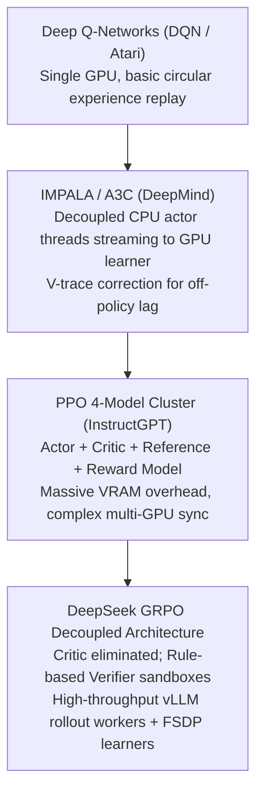

# 25. Distributed RL Rollout Infrastructure — The Actor-Rollout-Learner Loop at Scale

> **Target Audience**: AI Infrastructure Architects, Distributed Systems Engineers, and RL Specialists building large-scale reasoning training clusters for frontier models.  
> **Prerequisites**: GRPO loss formulation (from [05-deepseek-r1-and-grpo-reasoning.md](05-deepseek-r1-and-grpo-reasoning.md)), high-throughput serving engines (from [15-vllm-serving-deepseek-and-qwen.md](15-vllm-serving-deepseek-and-qwen.md)), and distributed collectives.  
> **Estimated Study Time**: 65 minutes.  
> **What You Will Master**: The physical decoupling of **Rollout Generation, Sandboxed Verification, and Policy Learning**, solving the variable-length straggler bottleneck, mitigating **policy staleness via importance sampling**, and orchestrating asynchronous RL loops with **Ray** on the **NVIDIA DGX Spark**.

---

## 📑 Table of Contents
1. [Foundational Scaffolding: The Asymmetric Nature of Reasoning RL](#1-foundational-scaffolding-the-asymmetric-nature-of-reasoning-rl)
2. [Co-Related Concepts & The Evolution of Distributed RL](#2-co-related-concepts--the-evolution-of-distributed-rl)
3. [The Three-Tier Decoupled Architecture](#3-the-three-tier-decoupled-architecture)
4. [The Variable-Length Straggler Crisis & Replay Buffers](#4-the-variable-length-straggler-crisis--replay-buffers)
5. [The Policy Staleness Dilemma & Importance Sampling Math](#5-the-policy-staleness-dilemma--importance-sampling-math)
6. [Comparative Analysis: DeepSeek vs. verl vs. OpenRLHF vs. Ray-PPO](#6-comparative-analysis-deepseek-vs-verl-vs-openrlhf-vs-ray-ppo)
7. [Hardware Grounding: The Single-Node Spark vs. Multi-Node Cluster](#7-hardware-grounding-the-single-node-spark-vs-multi-node-cluster)
8. [Hands-On Python Lab: Complete Async Actor-Rollout-Learner with Ray](#8-hands-on-python-lab-complete-async-actor-rollout-learner-with-ray)
9. [Practice Exercises with Step-by-Step Solutions](#9-practice-exercises-with-step-by-step-solutions)
10. [Troubleshooting Guide & Diagnostic Runbook](#10-troubleshooting-guide--diagnostic-runbook)

---

## 1. Foundational Scaffolding: The Asymmetric Nature of Reasoning RL

### Why Pre-Training Clusters Collapse Under RL
In classical LLM pre-training, the computing workload is **100% symmetric and synchronous**:
* Every GPU receives a tensor of exactly $B \times S$ tokens (e.g., $4 \times 4,096$).
* Every GPU performs identical forward matrix multiplications, identical backward passes, and synchronizes gradients via an `All-Reduce` collective.
* Every GPU takes the exact same number of milliseconds to complete each step.

In **Reasoning Reinforcement Learning** (e.g., DeepSeek-R1 or OpenAI o1/o3 training), this symmetry shatters completely:
1. **Asymmetric Compute Profiles**:
   * **Rollout Generation** is memory-bandwidth bound (autoregressive token-by-token generation).
   * **Policy Learning** is compute-bound (dense matrix multiplication on accumulated trajectories).
2. **Extreme Sequence Length Variance**:
   * For the exact same prompt, Trajectory A might find a simple proof and terminate in **400 tokens**.
   * Trajectory B might enter an extensive exploratory derivation, backtracking multiple times and generating **14,000 tokens**!
   * In a synchronous pre-training architecture, **all GPUs sit 100% idle waiting for the single slowest 14,000-token straggler to finish** before calculating a single gradient!

```
                  SYNCHRONOUS RL ROLLOUT COLLAPSE (85% IDLE TIME)
GPU 0 (Traj 1: 500 tok)   : [===] [IDLE WAITING FOR STRAGGLER..................................]
GPU 1 (Traj 2: 1200 tok)  : [======] [IDLE WAITING FOR STRAGGLER...............................]
GPU 2 (Traj 3: 800 tok)   : [====] [IDLE WAITING FOR STRAGGLER.................................]
GPU 3 (Traj 4: 14000 tok) : [==================================================================]
                             ▲                                                                 ▲
                             Start                                          All-Reduce Can Finally Run!
```

### The Factory vs. Exploratory Expedition Analogy
* **Pre-Training**: Like a stamping plant pressing identical sheet metal car doors every 3.0 seconds. High efficiency requires rigid synchronization.
* **Reasoning RL**: Like sending 50 exploratory scouts into an uncharted forest to locate water springs. Some return in 10 minutes with nothing; some return in 4 hours with fresh water. If your entire army refuses to eat or drink until all 50 scouts return simultaneously, the army starves.
You must **decouple the scouts (Rollout Workers) from the base camp cooks (Learner Engine)** via an asynchronous staging depot (**Replay Buffer**).

---

## 2. Co-Related Concepts & The Evolution of Distributed RL



### The Key Innovation in Modern Frontier RL:
As established in [05-deepseek-r1-and-grpo-reasoning.md](05-deepseek-r1-and-grpo-reasoning.md), DeepSeek eliminated the neural **Critic network** and replaced it with **Group Relative Advantage Estimation** combined with **Deterministic Sandboxed Verifiers**. 
This fundamentally changed infrastructure requirements: you no longer need an entire cluster of GPUs dedicated to training a Value Critic network!

---

## 3. The Three-Tier Decoupled Architecture

Hyperscale reasoning infrastructure partitions the cluster into three distinct, asynchronously communicating tiers:

```
┌────────────────────────────────────────────────────────────────────────────────────────┐
│                        TIER 1: ROLLOUT GENERATION FLEET                                │
│  - Powered by high-throughput serving engines (vLLM / SGLang)                          │
│  - Executes PagedAttention, Continuous Batching, and Radix Prefix Caching              │
│  - Generates groups of G exploratory reasoning paths (with <think> tokens)             │
└────────────────────────────────────────────────────────────────────────────────────────┘
                                    │
                                    │ Streaming JSON Raw Trajectories
                                    ▼
┌────────────────────────────────────────────────────────────────────────────────────────┐
│                        TIER 2: SANDBOXED REWARD VERIFIERS                              │
│  - Isolated CPU worker pool (gVisor micro-containers or Firecracker micro-VMs)         │
│  - Executes code against unit tests, runs SymPy symbolic math equation solvers         │
│  - Assigns deterministic rewards: r_i ∈ {+1.0, 0.0, -1.0}                              │
└────────────────────────────────────────────────────────────────────────────────────────┘
                                    │
                                    │ Scored Trajectories + Normalized Advantages
                                    ▼
┌────────────────────────────────────────────────────────────────────────────────────────┐
│                        ASYNC REPLAY BUFFER (Redis / Plasma Store)                      │
│  - Absorbs arrival time jitter; tracks policy version timestamps                       │
└────────────────────────────────────────────────────────────────────────────────────────┘
                                    │
                                    │ Batched Training Chunks
                                    ▼
┌────────────────────────────────────────────────────────────────────────────────────────┐
│                        TIER 3: GRADIENT POLICY LEARNER                                 │
│  - High-performance training engine (PyTorch FSDP-2 / Megatron-Core)                   │
│  - Computes GRPO loss and performs AdamW optimizer gradient updates                    │
│  - Periodically broadcasts updated weights back to Tier 1 Rollout Workers              │
└────────────────────────────────────────────────────────────────────────────────────────┘
```

---

## 4. The Variable-Length Straggler Crisis & Replay Buffers

To prevent fast rollout workers from idling while long reasoning paths complete:
1. **Asynchronous Push**: Rollout workers push completed trajectories directly into an **In-Memory Replay Buffer** (implemented via Redis or Apache Arrow Plasma Store) the moment they finish.
2. **Group Completion Gate**: In GRPO, advantages are normalized across a group of $G$ outputs for the same prompt:
   $$\hat{A}_i = \frac{r_i - \text{mean}(\{r\})}{\text{std}(\{r\})}$$
   The buffer holds outputs until all $G$ candidates for prompt $P_k$ arrive, computes their normalized group advantage, and immediately releases them to the training queue.

---

## 5. The Policy Staleness Dilemma & Importance Sampling Math

### The Off-Policy Lag Dilemma
Because generating 10,000 reasoning tokens across a rollout cluster takes time, by the time the Learner engine computes a gradient step at time $T$, the trajectories in the buffer were generated by an older policy checkpoint from time $T - \tau$ (where $\tau$ is the **staleness lag**).

If $\tau > 0$, the data is **off-policy**. Naively treating off-policy data as on-policy leads to mathematical divergence and catastrophic forgetting.

### The Mathematical Correction: Importance Sampling Ratio
The GRPO objective corrects for policy staleness using the **Importance Sampling Ratio**:

$$r_t(\theta) = \frac{\pi_\theta(a_t | s_t)}{\pi_{\theta_{\text{stale}}}(a_t | s_t)}$$

The clipped surrogate objective bounds the update magnitude:

$$\mathcal{L}_{\text{CLIP}}(\theta) = \frac{1}{G} \sum_{i=1}^G \frac{1}{|y_i|} \sum_{t=1}^{|y_i|} \min \left( r_t(\theta) \hat{A}_{i,t}, \text{clip}(r_t(\theta), 1-\epsilon, 1+\epsilon) \hat{A}_{i,t} \right)$$

```
                       IMPORTANCE SAMPLING RATIO CLIPPING
     Surrogate Loss
           ▲
           │                         / (Unclipped if advantage > 0)
           │     ┌──────────────────/
           │     │ Clipped Plateau: (1 + ε) * A
           │     │
───────────┼─────┼─────────────────────────► Importance Ratio r_t(θ)
           │    1-ε        1.0     1+ε
           │     │
           │     └──────────────────\
           │                         \ (Clipped if advantage < 0)
```

* If policy drift is small ($r_t(\theta) \in [1-\epsilon, 1+\epsilon]$, with $\epsilon = 0.2$), full gradient information flows through.
* If a trajectory is too stale ($r_t(\theta) > 1.2$ or $< 0.8$), the gradient is **clipped to zero**, safely preventing outdated rollouts from corrupting the current policy weights!

---

## 6. Comparative Analysis: DeepSeek vs. verl vs. OpenRLHF vs. Ray-PPO

| Architecture Framework | Orchestration Layer | Rollout Backend | Critic Required? | Staleness Handling | Focus |
| :--- | :--- | :--- | :--- | :--- | :--- |
| **DeepSeek Native RL** | Custom High-Speed C++ | Custom vLLM fork | **NO (Pure GRPO)** | Strict Clip + Buffer Drop | Large-scale frontier reasoning |
| **verl (ByteDance / Open)** | Ray + PyTorch FSDP | Native vLLM | Optional | Importance Sampling | State-of-the-art open framework |
| **OpenRLHF** | Ray | vLLM / SGLang | Yes (PPO) or No (DPO) | PPO clipping | Multi-node chat alignment |
| **Vanilla Ray RLlib** | Ray Tune | Python Hugging Face | Yes (Actor-Critic) | Generalized Advantage Est. | General gaming / robotics RL |

---

## 7. Hardware Grounding: The Single-Node Spark vs. Multi-Node Cluster

### Multi-Node Enterprise Topology (e.g., 16x H100s):
* Nodes 1 & 2 (16 GPUs): Run vLLM serving workers exclusively generating rollouts.
* CPU Cluster: Runs 256 parallel sandboxed Python execution pods.
* Nodes 3 & 4 (16 GPUs): Run PyTorch FSDP-2 consuming batches from the replay buffer.

### Single-Node DGX Spark Topology (Grace ARM + Blackwell GB10 128GB):
On a single DGX Spark machine, you cannot physically dedicate 8 GPUs to rollout and 8 GPUs to learning. 
Instead, we implement **Time-Multiplexed Phased Iterations**:
1. **Phase 1: Rollout Generation (60% Time)**:
   * vLLM runs on the GB10 GPU with FP8 weights, generating groups of $G = 8$ trajectories for 50 prompts.
   * Model weights: 32 GB; KV Cache: 80 GB.
2. **Phase 2: Sandboxed Verification (10% Time)**:
   * The 72 Grace ARM CPU cores execute unit tests in parallel using Python subprocesses.
3. **Phase 3: Policy Gradient Update (30% Time)**:
   * The GB10 loads the LoRA training adapter and executes backprop over the scored trajectories.
   * Result: Complete self-contained RL loop running entirely inside one machine!

---

## 8. Hands-On Python Lab: Complete Async Actor-Rollout-Learner with Ray

This complete script implements a decoupled, asynchronous RL architecture using **Ray**. It coordinates simulated Rollout Workers, a Sandboxed Verifier, and a Learner Actor:

```python
#!/usr/bin/env python3
"""
async_rl_rollout_infrastructure.py
Asynchronous Actor-Rollout-Learner architecture using Ray for reasoning models.
"""

import time
import random
import ray
import torch
import numpy as np

# 1. Initialize Ray cluster
ray.init(ignore_reinit_error=True)

@ray.remote
class MathVerifierActor:
    """Tier 2: Sandboxed deterministic verification running on CPU cores."""
    def verify(self, prompt: str, trajectory: str, ground_truth: str) -> float:
        # Simulate sandboxed execution / symbolic regex evaluation
        time.sleep(0.02)  # Verification latency
        if f"Answer: {ground_truth}" in trajectory:
            return 1.0   # Correct reasoning
        return -1.0      # Incorrect answer

@ray.remote
class RolloutWorker:
    """Tier 1: High-throughput generation worker."""
    def __init__(self, worker_id: int):
        self.worker_id = worker_id
        self.policy_version = 0

    def sync_weights(self, new_version: int):
        self.policy_version = new_version

    def generate_group(self, prompt: str, ground_truth: str, group_size: int = 4):
        trajectories = []
        # Simulate variable-length reasoning traces (<think> ... </think>)
        for i in range(group_size):
            # Stochastic token generation length (between 100 and 1500 tokens)
            gen_len = random.randint(100, 1500)
            is_correct = random.random() > 0.4  # 60% success probability
            ans = ground_truth if is_correct else str(int(ground_truth) + 1)
            
            traj = f"<think> Reasoning steps ({gen_len} tokens) </think> Answer: {ans}"
            trajectories.append({
                "prompt": prompt,
                "trajectory": traj,
                "ground_truth": ground_truth,
                "gen_length": gen_len,
                "policy_version": self.policy_version
            })
        return trajectories

@ray.remote
class LearnerActor:
    """Tier 3: Policy Gradient Learner running FSDP / GRPO updates."""
    def __init__(self):
        self.current_version = 0
        self.step_count = 0

    def train_step(self, batch_scored_trajectories):
        self.step_count += 1
        self.current_version += 1
        
        # Calculate policy staleness metrics
        staleness_gaps = [self.current_version - item["policy_version"] for item in batch_scored_trajectories]
        avg_staleness = np.mean(staleness_gaps)
        
        # Calculate group relative advantages
        rewards = [item["reward"] for item in batch_scored_trajectories]
        mean_r = np.mean(rewards)
        std_r = np.std(rewards) + 1e-8
        advantages = [(r - mean_r) / std_r for r in rewards]
        
        print(f"\n[Learner Step {self.step_count:03d}] Updating Policy...")
        print(f"    Batch Size Trajectories : {len(batch_scored_trajectories)}")
        print(f"    Mean Batch Reward        : {mean_r:.3f}")
        print(f"    Average Policy Staleness : {avg_staleness:.2f} versions")
        print(f"    Simulated GRPO Loss      : {random.uniform(0.15, 0.45):.4f}")
        
        return self.current_version

def orchestrate_async_rl():
    print("=" * 60)
    print("LAUNCHING DECOUPLED ACTOR-ROLLOUT-LEARNER RL PIPELINE")
    print("=" * 60)
    
    # Instantiate actors
    num_rollout_workers = 2
    rollout_workers = [RolloutWorker.remote(i) for i in range(num_rollout_workers)]
    verifier = MathVerifierActor.remote()
    learner = LearnerActor.remote()
    
    prompts_dataset = [
        ("Solve 2x + 6 = 14", "4"),
        ("What is the derivative of x^3?", "3x^2"),
        ("Evaluate sum of 1 to 10", "55"),
        ("Factorize x^2 - 9", "(x-3)(x+3)")
    ]
    
    # 1. Trigger asynchronous rollout generation across workers
    pending_rollout_tasks = []
    for i, (prompt, ans) in enumerate(prompts_dataset):
        worker = rollout_workers[i % num_rollout_workers]
        task = worker.generate_group.remote(prompt, ans, group_size=4)
        pending_rollout_tasks.append(task)
        
    print(f"[*] Dispatched {len(pending_rollout_tasks)} rollout tasks across workers.")
    
    # Gather completed rollouts as they arrive (asynchronous wait)
    completed_trajectories = []
    ready_tasks, pending_tasks = ray.wait(pending_rollout_tasks, num_returns=len(pending_rollout_tasks))
    
    for task_ref in ready_tasks:
        group = ray.get(task_ref)
        completed_trajectories.extend(group)
        
    print(f"[✓] Collected {len(completed_trajectories)} exploratory reasoning traces.")
    
    # 2. Dispatch verification tasks in parallel
    verification_futures = []
    for item in completed_trajectories:
        vf = verifier.verify.remote(item["prompt"], item["trajectory"], item["ground_truth"])
        verification_futures.append((item, vf))
        
    scored_batch = []
    for item, vf in verification_futures:
        reward = ray.get(vf)
        item["reward"] = reward
        scored_batch.append(item)
        
    print(f"[✓] Reward verification complete across all traces.")
    
    # 3. Learner step
    new_version = ray.get(learner.train_step.remote(scored_batch))
    
    # 4. Broadcast updated weights to rollout fleet
    for worker in rollout_workers:
        worker.sync_weights.remote(new_version)
        
    print(f"[✓] Synchronized Rollout Fleet to Policy Version: v{new_version}")
    print("=" * 60)

if __name__ == "__main__":
    orchestrate_async_rl()
    ray.shutdown()
```

---

## 9. Practice Exercises with Step-by-Step Solutions

### Exercise 1: Quantifying Cluster Straggler Waste
**Scenario**: You run a synchronous rollout cluster of **16 GPUs**.
Each GPU generates 1 reasoning trajectory. The token generation lengths follow a normal distribution with mean $\mu = 2,000 \text{ tokens}$ and standard deviation $\sigma = 600 \text{ tokens}$.
In a trial, 15 GPUs finish within 2,500 tokens (taking 25 seconds). The 16th GPU generates a 12,000-token trace (taking 120 seconds).
**Question**: What percentage of total cluster compute capacity is wasted on idle stalls during this single step?

#### Solution:
1. **Total Available GPU Seconds**:
   $$\text{Total Capacity} = 16 \text{ GPUs} \times 120 \text{ seconds} = 1,920 \text{ GPU-seconds}$$
2. **Actual Compute Work Performed**:
   * 15 fast GPUs compute for 25 seconds: $15 \times 25 = 375 \text{ GPU-seconds}$.
   * 1 slow GPU computes for 120 seconds: $1 \times 120 = 120 \text{ GPU-seconds}$.
   * Total Active Work = $375 + 120 = 495 \text{ GPU-seconds}$.
3. **Compute Squandered in Idle Waiting**:
   $$\text{Idle Wasted Seconds} = 1,920 - 495 = 1,425 \text{ GPU-seconds}$$
4. **Percentage Wasted**:
   $$\text{Waste Percentage} = \frac{1,425}{1,920} \times 100 = \mathbf{74.22\% \text{ of cluster compute wasted!}}$$
*Insight*: This demonstrates why decoupling rollouts into an asynchronous replay buffer is mandatory.

---

### Exercise 2: Understanding Importance Ratio Bounding
**Scenario**: During training, a rollout worker submits a trajectory where the log-probability under the generation policy was $\log \pi_{\text{old}} = -4.5$.
The learner evaluates the tokens under the updated policy $\theta$ and finds $\log \pi_\theta = -3.8$.
The advantage for this trajectory is $\hat{A} = +1.5$.
Clipping threshold is set to $\epsilon = 0.2$.
**Question**: Calculate the importance sampling ratio $r_t(\theta)$ and the surrogate loss value before and after clipping.

#### Solution:
1. **Calculate Importance Sampling Ratio**:
   $$r_t(\theta) = \frac{\pi_\theta}{\pi_{\text{old}}} = \exp(\log \pi_\theta - \log \pi_{\text{old}})$$
   $$r_t(\theta) = \exp(-3.8 - (-4.5)) = \exp(0.7) \approx \mathbf{2.01375}$$
2. **Unclipped Surrogate Value**:
   $$\text{Unclipped} = r_t(\theta) \times \hat{A} = 2.01375 \times 1.5 \approx \mathbf{3.0206}$$
3. **Clipped Surrogate Value**:
   * Upper clip bound: $1 + \epsilon = 1 + 0.2 = 1.2$.
   * Since $r_t(\theta) = 2.01 > 1.2$, the clipped ratio is $1.2$.
   $$\text{Clipped} = 1.2 \times 1.5 = \mathbf{1.800}$$
4. **Final Value (Minimum of the two)**:
   $$\text{Final Objective} = \min(3.0206, 1.800) = \mathbf{1.800}$$
*Result*: The gradient contribution is safely capped at $1.80$, preventing excessive policy updates from destabilizing training.

---

## 10. Troubleshooting Guide & Diagnostic Runbook

### Issue 1: Replay Buffer Unbounded Growth Leading to System OOM
* **Root Cause**: The Rollout fleet is producing trajectories faster than the Learner can consume them. The Redis / Arrow memory store expands until host RAM is exhausted.
* **Remediation**: Implement a strict high-water mark with **backpressure flow control**:
  ```python
  if buffer.size() > MAX_BUFFER_CAPACITY:
      rollout_workers.pause()
  ```

### Issue 2: Sandboxed Python Execution Hanging Indefinitely
* **Root Cause**: An LLM-generated code solution contains an infinite loop (e.g., `while True:` without a break condition).
* **Remediation**: Always wrap Python sandbox evaluations in a hard OS-level process timeout with `SIGKILL`:
  ```python
  subprocess.run(["python3", "-c", code], timeout=3)
  ```

---

## 🔗 Related Curriculum Modules
* **Underlying GRPO Theory**: [05-deepseek-r1-and-grpo-reasoning.md](05-deepseek-r1-and-grpo-reasoning.md)
* **High-Throughput Rollout Serving**: [15-vllm-serving-deepseek-and-qwen.md](15-vllm-serving-deepseek-and-qwen.md)
* **Radix Prefix Caching for Rollouts**: [16-sglang-and-radix-attention-serving.md](16-sglang-and-radix-attention-serving.md)
* **Distributed FSDP Training**: [26-distributed-deepspeed-zero3-and-fsdp.md](26-distributed-deepspeed-zero3-and-fsdp.md)
