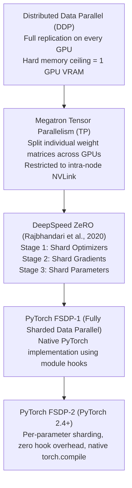

# 26. Distributed DeepSpeed ZeRO-3 & PyTorch FSDP-2 — Full Parameter Fine-Tuning

> **Target Audience**: Distributed Training Engineers, ML Infrastructure Architects, and HPC Researchers scaling full parameter adaptation across multi-GPU clusters.  
> **Prerequisites**: PyTorch `torchrun` distributed basics, NCCL collective communications (`All-Gather`, `Reduce-Scatter`), and memory arithmetic (from [23-peft-lora-qlora-parameter-sizing.md](23-peft-lora-qlora-parameter-sizing.md)).  
> **Estimated Study Time**: 65 minutes.  
> **What You Will Master**: The physical memory sharding mechanics of **DeepSpeed ZeRO-1/2/3**, the modern **PyTorch FSDP-2** per-parameter sharding standard, communication volume mathematics ($3\times$ parameter transfers), and supercharging ZeRO-Offload over **900 GB/s NVLink-C2C** on the **NVIDIA DGX Spark**.

---

## 📑 Table of Contents
1. [Foundational Scaffolding: The DDP Memory Wall](#1-foundational-scaffolding-the-ddp-memory-wall)
2. [Co-Related Concepts & The Evolution of Sharded Data Parallelism](#2-co-related-concepts--the-evolution-of-sharded-data-parallelism)
3. [Deep First-Principles: The 3 Stages of ZeRO Sharding](#3-deep-first-principles-the-3-stages-of-zero-sharding)
4. [Communication Volume Mathematics: All-Gather vs. Reduce-Scatter](#4-communication-volume-mathematics-all-gather-vs-reduce-scatter)
5. [PyTorch FSDP-2: The Modern Native PyTorch Standard](#5-pytorch-fsdp-2-the-modern-native-pytorch-standard)
6. [Comparative Analysis: DeepSpeed ZeRO-3 vs. FSDP-2 vs. Megatron 3D](#6-comparative-analysis-deepspeed-zero-3-vs-fsdp-2-vs-megatron-3d)
7. [Hardware Grounding: ZeRO-Offload Over 900 GB/s NVLink-C2C on DGX Spark](#7-hardware-grounding-zero-offload-over-900-gbs-nvlink-c2c-on-dgx-spark)
8. [Hands-On Python Lab: Native PyTorch FSDP-2 Sharding Implementation](#8-hands-on-python-lab-native-pytorch-fsdp-2-sharding-implementation)
9. [Production DeepSpeed ZeRO-3 Configuration Suite (`ds_config.json`)](#9-production-deepspeed-zero-3-configuration-suite-ds_configjson)
10. [Practice Exercises with Step-by-Step Solutions](#10-practice-exercises-with-step-by-step-solutions)
11. [Troubleshooting Guide & Diagnostic Runbook](#11-troubleshooting-guide--diagnostic-runbook)

---

## 1. Foundational Scaffolding: The DDP Memory Wall

### The Redundancy Flaw in Distributed Data Parallelism (DDP)
In traditional Distributed Data Parallelism (DDP):
* Every single GPU in the cluster maintains a **100% complete, identical replica** of the model weights, gradients, and AdamW optimizer states.
* Each GPU processes a distinct slice of training data, calculates local gradients, and aggregates them across all GPUs using an `All-Reduce` collective.

```
                  TRADITIONAL DDP REDUNDANCY TRAP (16 BYTES/PARAM ON EVERY GPU)
┌───────────────────────┐  ┌───────────────────────┐  ┌───────────────────────┐
│         GPU 0         │  │         GPU 1         │  │         GPU 2         │
├───────────────────────┤  ├───────────────────────┤  ├───────────────────────┤
│ Weights: 2 bytes      │  │ Weights: 2 bytes      │  │ Weights: 2 bytes      │
│ Gradients: 2 bytes    │  │ Gradients: 2 bytes    │  │ Gradients: 2 bytes    │
│ AdamW States: 12 bytes│  │ AdamW States: 12 bytes│  │ AdamW States: 12 bytes│
└───────────────────────┘  └───────────────────────┘  └───────────────────────┘
  100% IDENTICAL!            100% IDENTICAL!            100% IDENTICAL!
```

If a 32-billion parameter model requires **512 GB of static memory** during training, DDP requires **each individual GPU to possess >512 GB of VRAM**. Even if you have a cluster of 1,000 GPUs, **DDP crashes with Out-Of-Memory (OOM) on step 0** because no single GPU card can hold the replica!

### The Classroom Whiteboard Analogy
Imagine eight math students in a classroom solving a 1,000-step equation:
* **DDP**: Forcing each of the eight students to buy an expensive giant whiteboard and write out all 1,000 steps identically on their own board.
* **ZeRO / FSDP**: Student 1 writes steps 1–125; Student 2 writes 126–250, and so on. When Student 1 needs to review step 500, they simply look across the room at Student 4's board. By eliminating redundancy, the classroom solves an **8x larger problem without buying larger whiteboards**!

---

## 2. Co-Related Concepts & The Evolution of Sharded Data Parallelism



---

## 3. Deep First-Principles: The 3 Stages of ZeRO Sharding

Invented by Microsoft Research, **ZeRO (Zero Redundancy Optimizer)** systematically eliminates state redundancy in three progressive stages:

```
┌────────────────────────────────────────────────────────────────────────────────────────┐
│ ZeRO-1: Optimizer State Partitioning (4x Memory Reduction)                             │
│ - Base weights (FP16: 2B) and Gradients (FP16: 2B) are replicated on all GPUs.         │
│ - AdamW Optimizer States (FP32: 12B) are partitioned evenly across N_gpus.            │
│ - Memory per GPU = 2 + 2 + (12 / N_gpus) bytes/param.                                  │
├────────────────────────────────────────────────────────────────────────────────────────┤
│ ZeRO-2: Gradient + Optimizer State Partitioning (8x Memory Reduction)                  │
│ - Base weights are replicated on all GPUs.                                             │
│ - Gradients and Optimizer States are partitioned across N_gpus.                        │
│ - Memory per GPU = 2 + (14 / N_gpus) bytes/param.                                      │
├────────────────────────────────────────────────────────────────────────────────────────┤
│ ZeRO-3: Complete Parameter Partitioning (Linear Memory Scaling!)                       │
│ - Weights, Gradients, and Optimizer States are all partitioned across N_gpus!          │
│ - Each GPU stores ONLY 1/N_gpus of the entire model.                                   │
│ - Memory per GPU = 16 / N_gpus bytes/param.                                            │
└────────────────────────────────────────────────────────────────────────────────────────┘
```

### Static Memory Footprint on an 8-GPU Cluster for a 32B Model ($16 \text{ bytes/param}$ total):

| Sharding Strategy | Weights / GPU | Gradients / GPU | Optimizer / GPU | Total Static Memory | Fits 80GB GPU? |
| :--- | :--- | :--- | :--- | :--- | :--- |
| **Traditional DDP** | 64.0 GiB | 64.0 GiB | 384.0 GiB | **512.0 GiB** | **NO (Fatal OOM)** |
| **ZeRO-1** | 64.0 GiB | 64.0 GiB | 48.0 GiB ($384 / 8$) | **176.0 GiB** | **NO (OOM)** |
| **ZeRO-2** | 64.0 GiB | 8.0 GiB ($64 / 8$) | 48.0 GiB ($384 / 8$) | **120.0 GiB** | **NO (OOM)** |
| **ZeRO-3 / FSDP-2** | **8.0 GiB ($64 / 8$)**| **8.0 GiB ($64 / 8$)** | **48.0 GiB ($384 / 8$)** | **64.0 GiB** | **YES (Fits easily!)** |

---

## 4. Communication Volume Mathematics: All-Gather vs. Reduce-Scatter

ZeRO-3 trades communication bandwidth for memory capacity. To compute forward and backward passes when weights are sharded across $N$ GPUs:

```
FORWARD PASS:
Layer 0 Begins ──► All-Gather: Collect missing weights from peer GPUs ──► Compute GEMM ──► Discard Weights!
                                                                                           (Free VRAM)

BACKWARD PASS:
Layer 0 Backprop ──► All-Gather: Collect weights again ──► Compute Gradients ──► Reduce-Scatter Gradients!
                                                                                 (Store only local 1/N slice)
```

### Mathematical Formulation of Communication Traffic
Let $\Psi$ be the total number of model parameters:
1. **Traditional DDP**:
   * Forward pass: 0 communication.
   * Backward pass: 1 `All-Reduce` on gradients = $2 \times \Psi$ words transmitted.
   * **Total Traffic**: $2 \Psi$.
2. **ZeRO-3 / FSDP-2**:
   * Forward pass: 1 `All-Gather` on weights = $1 \times \Psi$ words.
   * Backward pass: 1 `All-Gather` on weights = $1 \times \Psi$ words.
   * Backward pass: 1 `Reduce-Scatter` on gradients = $1 \times \Psi$ words.
   * **Total Traffic**: $1 \Psi + 1 \Psi + 1 \Psi = \mathbf{3 \Psi}$.

$$\text{Communication Overhead Ratio} = \frac{3 \Psi}{2 \Psi} = \mathbf{1.5\times \text{ the traffic of DDP}}$$

This proves that **ZeRO-3 requires high-speed interconnects (NVLink or 400 Gbps RoCEv2/InfiniBand)** to prevent communication stalls from throttling GPU compute cores.

---

## 5. PyTorch FSDP-2: The Modern Native PyTorch Standard

In PyTorch 2.4+, **FSDP-2 (`torch.distributed.fsdp`)** replaced legacy hook-based wrappers with a clean, per-parameter sharded tensor implementation:
* **Per-Parameter Sharding**: Operates directly on individual `nn.Parameter` tensors rather than wrapping entire `nn.Module` subtrees in opaque hooks.
* **Native `torch.compile` Support**: Fully compatible with Triton compiler optimizations.
* **Asynchronous Communication-Computation Overlap**: Automatically issues non-blocking `All-Gather` CUDA calls for Layer $L+1$ while Layer $L$ is computing its GEMM operations!

---

## 6. Comparative Analysis: DeepSpeed ZeRO-3 vs. FSDP-2 vs. Megatron 3D

| Metric / Dimension | DeepSpeed ZeRO-3 | PyTorch FSDP-2 | Megatron-Core 3D |
| :--- | :--- | :--- | :--- |
| **Origin / Maintainer** | Microsoft DeepSpeed | PyTorch Core (Meta) | NVIDIA |
| **Target Scale** | 1 to 512 GPUs | 1 to 1024 GPUs | 1,000+ Supercomputing Nodes |
| **Installation** | Requires external C++ build | **Native in PyTorch 2.4+** | Complex Git submodule |
| **PyTorch 2.0 `torch.compile`**| Partial / Complex | **Flawless Native Support**| Custom integration |
| **Offload to CPU** | ZeRO-Offload (Highly tuned)| CPU Offload supported | Slurm / Host swap |
| **Recommended Use Case** | Legacy clusters, CLI tools | **Modern production PyTorch standard** | Extreme-scale pre-training |

---

## 7. Hardware Grounding: ZeRO-Offload Over 900 GB/s NVLink-C2C on DGX Spark

### The Traditional PCIe Offloading Bottleneck
In an x86 workstation, offloading AdamW optimizer states to CPU RAM requires streaming 384 GB of data across a narrow **PCIe Gen5 bus (32–64 GB/s)** during every training step, stalling the GPU for 8 to 12 seconds per step.

### The DGX Spark Grace Blackwell Breakthrough
The **NVIDIA DGX Spark** connects the Grace ARM CPU to the Blackwell GB10 GPU via **NVLink-C2C**:
* **Bandwidth**: **900 GB/s bidirectional coherent bandwidth** (14x to 28x faster than PCIe!).
* **Zero-Latency CPU Offload**: AdamW optimizer updates execute on Grace CPU cores while streaming updated weights back into the GB10 GPU at near-HBM speeds.
* **Capacity**: Enables full fine-tuning of **up to 70B parameter models** directly on a single DGX Spark node!

---

## 8. Hands-On Python Lab: Native PyTorch FSDP-2 Sharding Implementation

This script demonstrates native PyTorch FSDP-2 configuration with mixed-precision, gradient checkpointing, and activation prefetching:

```python
#!/usr/bin/env python3
"""
train_fsdp2_native.py
Native PyTorch FSDP-2 distributed training implementation for 32B models.
"""

import os
import torch
import torch.nn as nn
import torch.distributed as dist
from torch.distributed.fsdp import FullyShardedDataParallel as FSDP
from torch.distributed.fsdp import (
    MixedPrecision,
    BackwardPrefetch,
    ShardingStrategy,
    CPUOffload
)
from transformers import AutoModelForCausalLM

def setup_distributed():
    dist.init_process_group("nccl")
    local_rank = int(os.environ["LOCAL_RANK"])
    torch.cuda.set_device(local_rank)
    return local_rank

def clean_distributed():
    dist.destroy_process_group()

def run_fsdp2_training():
    local_rank = setup_distributed()
    rank = dist.get_rank()
    world_size = dist.get_world_size()

    if rank == 0:
        print(f"[*] Initializing FSDP-2 across {world_size} GPU ranks...")

    # 1. Configure FSDP Mixed Precision Policy (BF16 computation, FP32 buffers)
    mixed_precision_policy = MixedPrecision(
        param_dtype=torch.bfloat16,
        reduce_dtype=torch.bfloat16,
        buffer_dtype=torch.float32
    )

    # 2. Configure ZeRO-3 Style Full Parameter Sharding
    sharding_policy = ShardingStrategy.FULL_SHARD  # ZeRO-3 equivalent!

    # 3. Load base model architecture
    model_name = "Qwen/Qwen2.5-Coder-32B-Instruct"
    if rank == 0:
        print(f"[*] Loading model architecture: {model_name}...")
        
    model = AutoModelForCausalLM.from_pretrained(
        model_name,
        torch_dtype=torch.bfloat16,
        low_cpu_mem_usage=True
    )

    # 4. Wrap with FSDP
    fsdp_model = FSDP(
        model,
        sharding_strategy=sharding_policy,
        mixed_precision=mixed_precision_policy,
        backward_prefetch=BackwardPrefetch.BACKWARD_PRE,  # Overlap All-Gather with compute!
        device_id=torch.cuda.current_device(),
        limit_all_gathers=True,  # Prevent memory spikes
        use_orig_params=True     # Essential for torch.compile
    )

    if rank == 0:
        print("[✓] Model successfully sharded across cluster using FSDP-2 FULL_SHARD.")
        print("    - Each GPU stores exactly 1/N of parameters, gradients, and optimizer states.")

    # 5. Define AdamW Optimizer over sharded parameters
    optimizer = torch.optim.AdamW(fsdp_model.parameters(), lr=1e-5, weight_decay=0.01)

    # Simulated Forward + Backward Pass
    dummy_input = torch.randint(0, 1000, (2, 512), device=torch.cuda.current_device())
    outputs = fsdp_model(dummy_input, labels=dummy_input)
    loss = outputs.loss

    loss.backward()
    optimizer.step()
    optimizer.zero_grad()

    if rank == 0:
        print(f"[✓] Step completed successfully! Loss: {loss.item():.4f}")

    clean_distributed()

if __name__ == "__main__":
    # Launch via: torchrun --nproc_per_node=4 train_fsdp2_native.py
    run_fsdp2_training()
```

---

## 9. Production DeepSpeed ZeRO-3 Configuration Suite (`ds_config.json`)

For DeepSpeed CLI workflows, save this configuration into `/data/config/ds_zero3_spark.json`:

```json
{
  "train_batch_size": "auto",
  "train_micro_batch_size_per_gpu": "auto",
  "gradient_accumulation_steps": "auto",
  "bf16": {
    "enabled": true
  },
  "zero_optimization": {
    "stage": 3,
    "offload_optimizer": {
      "device": "cpu",
      "pin_memory": true
    },
    "offload_param": {
      "device": "none"
    },
    "overlap_comm": true,
    "contiguous_gradients": true,
    "sub_group_size": 1e9,
    "reduce_bucket_size": "auto",
    "stage3_prefetch_bucket_size": "auto",
    "stage3_param_persistence_threshold": "auto",
    "stage3_max_live_parameters": 1e9,
    "stage3_max_reuse_distance": 1e9,
    "stage3_gather_16bit_weights_on_model_save": true
  },
  "gradient_clipping": 1.0,
  "steps_per_print": 10,
  "wall_clock_breakdown": false
}
```

---

## 10. Practice Exercises with Step-by-Step Solutions

### Exercise 1: Memory Sharding Calculation for 70B Models
**Scenario**: You want to perform full fine-tuning of `Llama-3-70B` in 16-bit precision.
* Parameters $\Psi = 70 \times 10^9$.
* Precision: BF16 ($2 \text{ bytes/param}$).
* Gradients: BF16 ($2 \text{ bytes/param}$).
* AdamW optimizer states: FP32 master weights + 2 momentum vectors = $12 \text{ bytes/param}$.
* Cluster hardware: $4\times \text{NVIDIA H100 (80 GB SXM5)}$ GPUs.

**Question**: Calculate the static VRAM requirement per GPU under:
1. Traditional DDP.
2. DeepSpeed ZeRO-2.
3. DeepSpeed ZeRO-3 / FSDP-2.
Will ZeRO-3 fit within the 80 GB cards?

#### Solution:
1. **Total State Memory**:
   $$\text{Total Memory} = 70 \times 10^9 \times (2 + 2 + 12) = 70 \times 16 \text{ GB} = \mathbf{1,120 \text{ Gigabytes!}}$$
2. **Traditional DDP per GPU**:
   $$\text{DDP Memory} = 1,120 \text{ GB per GPU} \implies \mathbf{\text{Fatal OOM (Requires 14x 80GB cards per GPU!)}}$$
3. **ZeRO-2 per GPU ($N = 4$)**:
   $$\text{Weights (Replicated)} = 70 \times 2 = 140 \text{ GB}$$
   $$\text{Gradients + Optimizer (Sharded)} = \frac{70 \times 14}{4} = \frac{980}{4} = 245 \text{ GB}$$
   $$\text{ZeRO-2 Total} = 140 + 245 = \mathbf{385 \text{ GB per GPU}} \implies \mathbf{\text{Fatal OOM}}$$
4. **ZeRO-3 per GPU ($N = 4$)**:
   $$\text{ZeRO-3 Total} = \frac{1,120 \text{ GB}}{4} = \mathbf{280 \text{ GB per GPU}} \implies \mathbf{\text{Exceeds 80GB VRAM!}}$$
*Takeaway*: To fit a 70B model in full fine-tuning without CPU offloading, you need at least **$1,120 / 60 \approx 19 \to 16 \text{ to } 32\times \text{H100 GPUs}$**, or you must enable **ZeRO-Offload** to Grace CPU RAM!

---

### Exercise 2: Communication Volume Calculation in ZeRO-3
**Scenario**: You train a 32B model using ZeRO-3 across 8 GPUs. Each training step takes **1.2 seconds**.
**Question**: What is the average network throughput in Gigabits per second (Gbps) required to prevent NCCL communication from stalling training?

#### Solution:
1. **Calculate total bytes transferred per step**:
   $$\text{Words transferred} = 3 \times \Psi = 3 \times 32 \times 10^9 = 96 \times 10^9 \text{ elements}$$
   $$\text{Bytes (BF16)} = 96 \times 10^9 \times 2 \text{ bytes} = 192 \times 10^9 \text{ Bytes} = 192 \text{ GB}$$
2. **Calculate required bandwidth over 1.2 seconds**:
   $$\text{Bandwidth (GB/s)} = \frac{192 \text{ GB}}{1.2 \text{ s}} = 160 \text{ GB/sec}$$
3. **Convert to Gigabits per second (Gbps)**:
   $$\text{Bandwidth (Gbps)} = 160 \times 8 = \mathbf{1,280 \text{ Gbps}}$$
*Takeaway*: Divided across 8 GPUs, each GPU must sustain $\frac{1280}{8} = \mathbf{160 \text{ Gbps}}$ line-rate network bandwidth. This requires at least **200 Gbps or 400 Gbps InfiniBand/RoCEv2 cards**!

---

## 11. Troubleshooting Guide & Diagnostic Runbook

### Issue 1: `RuntimeError: Expected to have finished reduction in the prior iteration before starting a new one`
* **Root Cause**: Module hooks in FSDP or ZeRO are being called out of order because some layers were skipped in the forward pass (e.g., unused conditional branches).
* **Remediation**: Set `find_unused_parameters=False` and verify that all registered submodules participate in the loss computation.

### Issue 2: Severe Slowdown During Backward Pass (`NCCL AllGather Stalls`)
* **Root Cause**: Insufficient NCCL buffer memory leading to communication ring stalls.
* **Remediation**: Tune NCCL environment variables in your launch script:
  ```bash
  export NCCL_BUFFSIZE=16777216
  export NCCL_NET_GDR_LEVEL=5
  export NCCL_CROSS_NIC=1
  ```

---

## 🔗 Related Curriculum Modules
* **Hardware Memory Architecture**: [12-memory-math-for-30b-32b-on-gb10.md](12-memory-math-for-30b-32b-on-gb10.md)
* **Single-Node PEFT Alternative**: [23-peft-lora-qlora-parameter-sizing.md](23-peft-lora-qlora-parameter-sizing.md)
* **Turnkey Workflows**: [24-unsloth-and-llama-factory-workflows.md](24-unsloth-and-llama-factory-workflows.md)
* **Distributed RL Infrastructure**: [25-distributed-rl-rollout-infrastructure.md](25-distributed-rl-rollout-infrastructure.md)
