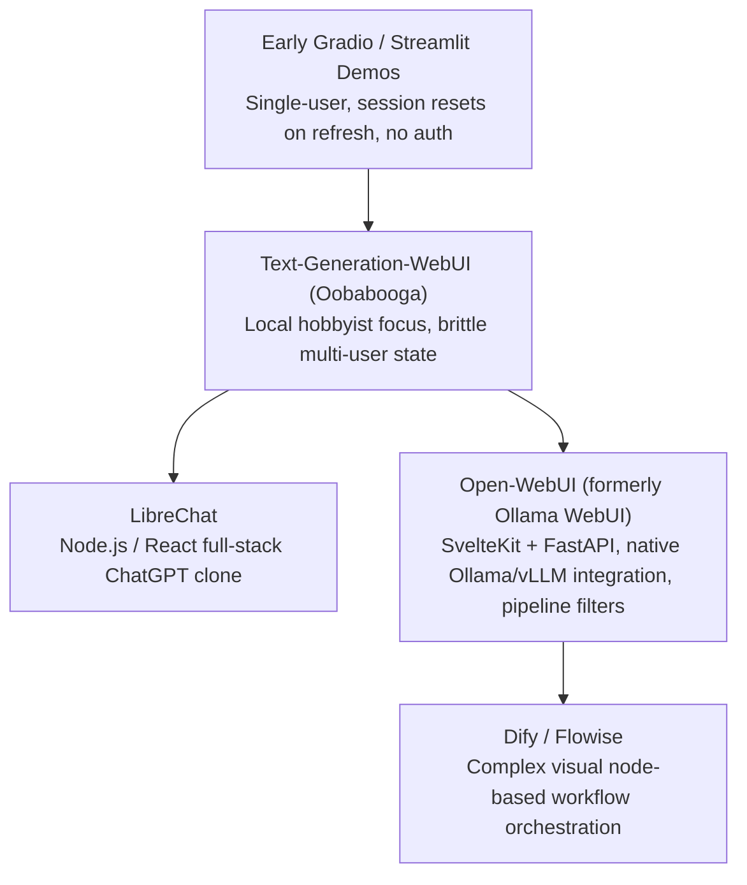

# 27. Open-WebUI Deployment & Thinking-Token Integration

> **Target Audience**: Full-Stack AI Engineers, Platform Administrators, and Enterprise Solution Architects deploying turnkey ChatGPT-style interfaces for internal business teams.  
> **Prerequisites**: Docker / Docker Compose basics, Kubernetes Services & Ingress (from [19-kubernetes-manifests-for-deepseek.md](19-kubernetes-manifests-for-deepseek.md) and [21-ingress-and-realtime-streaming-gateways.md](21-ingress-and-realtime-streaming-gateways.md)), and vLLM OpenAI API endpoints.  
> **Estimated Study Time**: 50 minutes.  
> **What You Will Master**: The system architecture of **Open-WebUI**, parsing and rendering collapsible **`<think>` reasoning accordions**, multi-model routing between **DeepSeek-R1** and **Qwen2.5**, enterprise role-based access control (RBAC), and deployment on the **NVIDIA DGX Spark**.

---

## 📑 Table of Contents
1. [Foundational Scaffolding: Why Raw Endpoints Fail in Enterprise](#1-foundational-scaffolding-why-raw-endpoints-fail-in-enterprise)
2. [Co-Related Concepts & The Evolution of Self-Hosted AI Interfaces](#2-co-related-concepts--the-evolution-of-self-hosted-ai-interfaces)
3. [Deep First-Principles: Thinking-Token Regex Parsing & Accordion UI](#3-deep-first-principles-thinking-token-regex-parsing--accordion-ui)
4. [Comparative Analysis: Open-WebUI vs. LibreChat vs. Dify vs. Chainlit](#4-comparative-analysis-open-webui-vs-librechat-vs-dify-vs-chainlit)
5. [Hardware Grounding: Resource Allocation on DGX Spark (Grace ARM64)](#5-hardware-grounding-resource-allocation-on-dgx-spark-grace-arm64)
6. [Production Deployment Suite (Docker Compose with PostgreSQL & K8s)](#6-production-deployment-suite-docker-compose-with-postgresql--k8s)
7. [Enterprise RBAC, OAuth / SSO & System Prompt Defaults](#7-enterprise-rbac-oauth--sso--system-prompt-defaults)
8. [Hands-On Python Lab: Custom Open-WebUI Pipeline Filter](#8-hands-on-python-lab-custom-open-webui-pipeline-filter)
9. [Practice Exercises with Step-by-Step Solutions](#9-practice-exercises-with-step-by-step-solutions)
10. [Troubleshooting Guide & Diagnostic Runbook](#10-troubleshooting-guide--diagnostic-runbook)

---

## 1. Foundational Scaffolding: Why Raw Endpoints Fail in Enterprise

### The Developer vs. Enterprise User Disconnect
While ML engineers are comfortable querying inference models using `curl`, Python scripts, or terminal shells:
* **Business Users**: Non-technical employees (lawyers, doctors, financial analysts, product managers) require an intuitive, graphical web application.
* **Persistent Sessions**: Users need persistent conversation histories, organized folders, search, and session bookmarking.
* **Document Grounding**: Users expect drag-and-drop document upload (PDF, DOCX, CSV) for instant conversational Question-and-Answering (RAG).
* **Enterprise Governance**: Security teams require Single Sign-On (SSO / OAuth / SAML), audit logging, and Role-Based Access Control (RBAC) to ensure unapproved users cannot consume expensive GPU tokens.

### The Raw Telegraph vs. Executive Workstation Analogy
Interacting with an LLM via raw terminal `curl` is like receiving a stream of Morse code over a telegraph wire. 
**Open-WebUI** is like a modern executive desktop computer with color monitors, categorized filing cabinets, interactive drop-down menus, and mathematical LaTeX equation rendering.

```
                          ENTERPRISE WEBUI FLOW
┌────────────────────────────────────────────────────────────────────────┐
│ Open-WebUI Frontend (SvelteKit + TailwindCSS)                          │
│ - Markdown & KaTeX Math Rendering                                      │
│ - Collapsible Reasoning Accordion ("Thought for 12.4s")                │
│ - Multi-Model Dropdown: [DeepSeek-R1-32B ▾] [Qwen2.5-Coder ▾]          │
└────────────────────────────────────────────────────────────────────────┘
                                    │
                         Internal REST API Calls
                                    ▼
┌────────────────────────────────────────────────────────────────────────┐
│ Open-WebUI Backend (FastAPI + SQLAlchemy)                              │
│ - Role-Based Access Control (Admin / User / Pending)                   │
│ - Chat History Storage (PostgreSQL / SQLite)                           │
│ - Document Ingestion & Vector Storage (Built-in ChromaDB / Qdrant)     │
└────────────────────────────────────────────────────────────────────────┘
                                    │
                         OpenAI-Compatible Streaming
                                    ▼
┌────────────────────────────────────────────────────────────────────────┐
│ Upstream Inference Layer (vLLM / LiteLLM Proxy on DGX Spark)          │
└────────────────────────────────────────────────────────────────────────┘
```

---

## 2. Co-Related Concepts & The Evolution of Self-Hosted AI Interfaces



---

## 3. Deep First-Principles: Thinking-Token Regex Parsing & Accordion UI

When **DeepSeek-R1** generates reasoning, it outputs thousands of tokens encapsulated inside XML delimiter tags:

```text
<think>
1. The user is asking to prove that sqrt(2) is irrational.
2. Let's assume for contradiction that sqrt(2) = a / b, where gcd(a, b) = 1.
3. Then 2 = a^2 / b^2, so a^2 = 2 * b^2.
... (300 lines of rigorous intermediate algebraic steps) ...
</think>
To prove that $\sqrt{2}$ is irrational, we proceed by contradiction...
```

### The Unhandled UI Disaster
If an unspecialized web UI renders this stream:
* The user's screen is flooded with 15 pages of dense internal thought derivation.
* The actual final answer is pushed off the bottom of the screen.

### The Open-WebUI Streaming State Machine
Open-WebUI implements an active token stream parser:
1. **Enter State (`<think>`)**: When the tokenizer encounters `<think>`, it opens an HTML `<details class="thought-accordion">` container and starts an elapsed-time stopwatch.
2. **Streaming Thought State**: All subsequent tokens are piped into the collapsed accordion body with muted typography (`opacity: 0.75`).
3. **Exit State (`</think>`)**: When `</think>` arrives, the stopwatch stops, the accordion is collapsed by default, and a summary header is injected: *"Thought for 14 seconds (Click to expand)"*.
4. **Answer State**: The remaining tokens stream as standard Markdown with KaTeX math rendering.

---

## 4. Comparative Analysis: Open-WebUI vs. LibreChat vs. Dify vs. Chainlit

| Platform Feature | Open-WebUI | LibreChat | Dify | Chainlit |
| :--- | :--- | :--- | :--- | :--- |
| **Frontend Framework** | SvelteKit (Ultra-fast) | React / Next.js | Next.js | React |
| **Backend Framework** | FastAPI (Python) | Node.js / Express | Python Flask / Celery | Python |
| **Native `<think>` Parsing**| **Built-in Native Accordion**| Requires custom plugin| Partial | Custom UI components |
| **Document RAG Ingestion**| Built-in (Drag-and-drop) | MeiliSearch / pgvector | Native multi-modal RAG | External integration |
| **Custom Pipeline Filters**| Native Python Pipelines | Custom endpoints | Visual flow editor | Python hooks |
| **Resource Footprint** | **Very Low (< 450 MB RAM)** | Medium (~1.2 GB RAM) | High (~3.5 GB RAM) | **Very Low** |

---

## 5. Hardware Grounding: Resource Allocation on DGX Spark (Grace ARM64)

The **NVIDIA DGX Spark** features:
* **CPU**: 72-core NVIDIA Grace ARM Neoverse V2.
* **GPU**: NVIDIA Blackwell GB10 (128 GB Unified Memory).

Because Open-WebUI is a web server (CPU and RAM bound), it **does not require GPU resources**.
* It runs entirely on the **Grace ARM CPU cores**, consuming less than **500 MB of system RAM**.
* 100% of the Blackwell GB10 GPU remains dedicated to vLLM inference and PEFT training!
* Official multi-arch Docker images (`ghcr.io/open-webui/open-webui:main`) include native `linux/arm64` binaries, eliminating emulation overhead.

---

## 6. Production Deployment Suite (Docker Compose with PostgreSQL & K8s)

### 1. Production Docker Compose (`docker-compose.yaml`):

```yaml
version: '3.8'

services:
  db:
    image: postgres:16-alpine
    container_name: open-webui-postgres
    restart: always
    environment:
      POSTGRES_DB: openwebui
      POSTGRES_USER: webui_admin
      POSTGRES_PASSWORD: SecretEnterprisePassword123!
    volumes:
      - /data/openwebui-postgres:/var/lib/postgresql/data
    healthcheck:
      test: ["CMD-SHELL", "pg_isready -U webui_admin -d openwebui"]
      interval: 5s
      timeout: 5s
      retries: 5

  open-webui:
    image: ghcr.io/open-webui/open-webui:main
    container_name: open-webui
    restart: always
    depends_on:
      db:
        condition: service_healthy
    ports:
      - "3000:8080"
    environment:
      # Database Connection
      - DATABASE_URL=postgresql://webui_admin:SecretEnterprisePassword123!@db:5432/openwebui
      # Upstream Inference Engine (vLLM on host)
      - OPENAI_API_BASE_URL=http://host.docker.internal:8000/v1
      - OPENAI_API_KEY=none
      # Enterprise Governance
      - WEBUI_NAME=Enterprise DGX Spark AI Hub
      - ENABLE_SIGNUP=false          # Disable open public signup (Admin invite only)
      - DEFAULT_MODELS=deepseek-r1    # Default model pre-selected
      - ENABLE_RAG_WEB_SEARCH=false   # Keep purely local and offline
      - SHOW_ADMIN_DETAILS=false
    extra_hosts:
      - "host.docker.internal:host-gateway"
    volumes:
      - /data/openwebui-storage:/app/backend/data
```

Launch with:
```bash
docker compose up -d
```

### 2. Kubernetes Production Manifest (`open-webui-k8s.yaml`):

```yaml
apiVersion: v1
kind: PersistentVolumeClaim
metadata:
  name: openwebui-data-pvc
  namespace: ai-serving
spec:
  accessModes:
    - ReadWriteOnce
  storageClassName: local-path
  resources:
    requests:
      storage: 20Gi
---
apiVersion: apps/v1
kind: Deployment
metadata:
  name: open-webui
  namespace: ai-serving
  labels:
    app: open-webui
spec:
  replicas: 1
  selector:
    matchLabels:
      app: open-webui
  template:
    metadata:
      labels:
        app: open-webui
    spec:
      containers:
      - name: webui
        image: ghcr.io/open-webui/open-webui:main
        imagePullPolicy: IfNotPresent
        ports:
          - containerPort: 8080
            name: http
        resources:
          requests:
            cpu: "2"
            memory: "2Gi"
          limits:
            cpu: "8"
            memory: "8Gi"
        env:
          - name: OPENAI_API_BASE_URL
            value: "http://deepseek-r1-service.ai-inference.svc.cluster.local:8000/v1"
          - name: OPENAI_API_KEY
            value: "none"
          - name: WEBUI_NAME
            value: "DGX Spark AI Hub"
          - name: ENABLE_SIGNUP
            value: "false"
        volumeMounts:
          - name: storage
            mountPath: /app/backend/data
      volumes:
        - name: storage
          persistentVolumeClaim:
            claimName: openwebui-data-pvc
---
apiVersion: v1
kind: Service
metadata:
  name: open-webui-service
  namespace: ai-serving
spec:
  type: ClusterIP
  selector:
    app: open-webui
  ports:
    - port: 80
      targetPort: 8080
```

---

## 7. Enterprise RBAC, OAuth / SSO & System Prompt Defaults

### Hardening Open-WebUI for Production:
1. **Disable Public Signups**: Ensure `ENABLE_SIGNUP=false` is set in the environment. The first registered user automatically becomes the **Super Admin**. All subsequent users must be invited or approved manually.
2. **SSO / OAuth Integration**: Connect to corporate Identity Providers (Keycloak, Okta, Microsoft Entra ID) using OpenID Connect (OIDC):
   ```ini
   ENABLE_OAUTH_SIGNUP=true
   OAUTH_CLIENT_ID="enterprise-dgx-hub"
   OAUTH_CLIENT_SECRET="xxxx-secret-key"
   OPENID_PROVIDER_URL="https://auth.company.internal/realms/enterprise"
   ```
3. **Global Reasoning System Prompt**: Enforce standard reasoning instructions across all users in Admin Settings $\to$ Models:
   ```text
   You are DeepSeek-R1 running locally on NVIDIA DGX Spark hardware. 
   Formulate your mathematical and logical proofs methodically step-by-step.
   ```

---

## 8. Hands-On Python Lab: Custom Open-WebUI Pipeline Filter

Open-WebUI supports **Pipelines**—custom Python filters that intercept and mutate prompts or responses.
This script demonstrates an enterprise **PII (Personally Identifiable Information) Redaction Filter** that scrubs credit card numbers and social security numbers before sending the prompt to the model:

```python
#!/usr/bin/env python3
"""
openwebui_pii_filter.py
Custom Open-WebUI pipeline filter intercepting and scrubbing sensitive enterprise PII.
"""

import re
from typing import List, Dict, Any

class Pipeline:
    def __init__(self):
        self.name = "Enterprise Security & PII Redaction Filter"
        # Regex patterns for Credit Cards and US Social Security Numbers
        self.cc_pattern = re.compile(r'\b(?:\d[ -]*?){13,16}\b')
        self.ssn_pattern = re.compile(r'\b\d{3}-\d{2}-\d{4}\b')

    async def on_startup(self):
        print(f"[*] Pipeline '{self.name}' initialized successfully.")

    async def on_shutdown(self):
        print(f"[*] Pipeline '{self.name}' shut down.")

    def pipe(self, user_message: str, model_id: str, messages: List[Dict[str, Any]], body: Dict[str, Any]) -> str:
        """
        Intercepts incoming user prompts and redacts PII before model ingestion.
        """
        original_prompt = user_message
        
        # Redact credit card numbers
        sanitized_prompt = self.cc_pattern.sub("[REDACTED CREDIT CARD]", original_prompt)
        
        # Redact SSNs
        sanitized_prompt = self.ssn_pattern.sub("[REDACTED SSN]", sanitized_prompt)
        
        if sanitized_prompt != original_prompt:
            print("[!] Security Alert: PII detected and scrubbed from user input!")
            
        return sanitized_prompt

if __name__ == "__main__":
    # Test filter locally
    filter_instance = Pipeline()
    test_query = "Please audit transaction for account 4532-1189-9021-3456 and SSN 000-12-3456."
    result = filter_instance.pipe(test_query, "deepseek-r1", [], {})
    print(f"Original : {test_query}")
    print(f"Scrubbed : {result}")
```

---

## 9. Practice Exercises with Step-by-Step Solutions

### Exercise 1: Configuring Multi-Model Routing in Open-WebUI
**Scenario**: You have two models served by local vLLM instances:
* `deepseek-r1-32b` on port `8000`.
* `qwen-coder-32b` on port `8001`.

**Question**: How do you configure Open-WebUI's `OPENAI_API_BASE_URLS` and `OPENAI_API_KEYS` to let users switch between both models in the web interface dropdown?

#### Solution:
* Open-WebUI natively supports multiple semicolon-separated base URLs:
  ```yaml
  environment:
    - OPENAI_API_BASE_URLS=http://host.docker.internal:8000/v1;http://host.docker.internal:8001/v1
    - OPENAI_API_KEYS=none;none
  ```
* Open-WebUI queries `/v1/models` across both endpoints, merges the model lists, and exposes them in the top-left model selection dropdown!

---

### Exercise 2: Auditing Docker Host Networking
**Scenario**: When running Open-WebUI via Docker Compose on Linux, the web interface reports:
`Connection error: Unable to connect to http://host.docker.internal:8000/v1`.
**Question**: Explain why this occurs on Linux Docker, and state the exact configuration required to resolve it.

#### Solution:
* **The Cause**: On macOS and Windows, Docker Desktop automatically provides the DNS entry `host.docker.internal`. On native Linux, `host.docker.internal` does not exist by default.
* **The Resolution**: In `docker-compose.yaml`, map the host gateway explicitly:
  ```yaml
  extra_hosts:
    - "host.docker.internal:host-gateway"
  ```
  This maps `host.docker.internal` to the Docker bridge gateway IP (`172.17.0.1`), allowing containers to seamlessly communicate with host-bound ports!

---

## 10. Troubleshooting Guide & Diagnostic Runbook

### Issue 1: `<think>` Tags Render as Raw Unstyled Text
* **Root Cause**: The active Open-WebUI version is outdated or the "Enable Web Thinking Accordion" toggle in Admin Settings $\to$ Interface is disabled.
* **Remediation**: Pull the latest container image (`docker compose pull open-webui`) and verify in Admin Settings that **Enable Thought Display** is enabled.

### Issue 2: PostgreSQL Migration Error on Container Boot
* **Root Cause**: Open-WebUI attempted to connect to PostgreSQL before the database container finished initializing its tables.
* **Remediation**: Use Docker Compose `service_healthy` condition on the database container as demonstrated in Section 6.

---

## 🔗 Related Curriculum Modules
* **Underlying Serving Engine**: [15-vllm-serving-deepseek-and-qwen.md](15-vllm-serving-deepseek-and-qwen.md)
* **Real-Time Streaming Gateways**: [21-ingress-and-realtime-streaming-gateways.md](21-ingress-and-realtime-streaming-gateways.md)
* **Load Balancing Reverse Proxy**: [28-litellm-proxy-gateway-load-balancing.md](28-litellm-proxy-gateway-load-balancing.md)
* **Enterprise RAG Integration**: [29-enterprise-rag-with-qdrant-and-bge.md](29-enterprise-rag-with-qdrant-and-bge.md)
