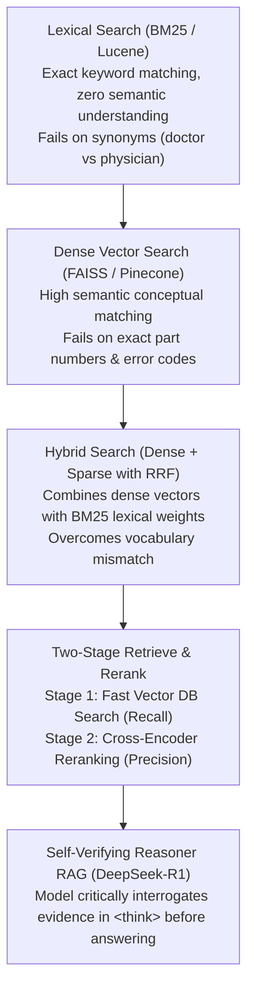

# 29. Enterprise RAG with Qdrant, BGE & DeepSeek-R1 — High-Speed Semantic Search

> **Target Audience**: AI Application Engineers, Search Specialists, and Enterprise Knowledge Architects building grounded, zero-hallucination document intelligence pipelines.  
> **Prerequisites**: Embedding vector mathematics (Cosine similarity, Dot product), REST API querying, and vLLM serving (from [15-vllm-serving-deepseek-and-qwen.md](15-vllm-serving-deepseek-and-qwen.md)).  
> **Estimated Study Time**: 60 minutes.  
> **What You Will Master**: The physical mechanics of **Bi-Encoder vs. Cross-Encoder** architectures, **Dense + Sparse (Lexical) Hybrid Search**, **Reciprocal Rank Fusion (RRF)**, HNSW graph vector indexing in **Qdrant**, and citation-grounded reasoning with **DeepSeek-R1** on the **NVIDIA DGX Spark**.

---

## 📑 Table of Contents
1. [Foundational Scaffolding: The Naive RAG Failure Modes](#1-foundational-scaffolding-the-naive-rag-failure-modes)
2. [Co-Related Concepts & The Evolution of Enterprise Search](#2-co-related-concepts--the-evolution-of-enterprise-search)
3. [Deep First-Principles: Bi-Encoder vs. Cross-Encoder Mathematics](#3-deep-first-principles-bi-encoder-vs-cross-encoder-mathematics)
4. [Hybrid Retrieval Mechanics: Combining Dense Semantics & Sparse Lexical BM25](#4-hybrid-retrieval-mechanics-combining-dense-semantics--sparse-lexical-bm25)
5. [Qdrant Vector Database Architecture: HNSW Graphs & Payload Filtering](#5-qdrant-vector-database-architecture-hnsw-graphs--payload-filtering)
6. [Comparative Analysis: Qdrant vs. Milvus vs. pgvector vs. ChromaDB](#6-comparative-analysis-qdrant-vs-milvus-vs-pgvector-vs-chromadb)
7. [Hardware Grounding: Resource Allocation on DGX Spark (GB10 Unified Memory)](#7-hardware-grounding-resource-allocation-on-dgx-spark-gb10-unified-memory)
8. [Hands-On Python Lab: Complete End-to-End Enterprise RAG Pipeline](#8-hands-on-python-lab-complete-end-to-end-enterprise-rag-pipeline)
9. [Practice Exercises with Step-by-Step Solutions](#9-practice-exercises-with-step-by-step-solutions)
10. [Troubleshooting Guide & Diagnostic Runbook](#10-troubleshooting-guide--diagnostic-runbook)

---

## 1. Foundational Scaffolding: The Naive RAG Failure Modes

### Why Basic Vector Search Collapses in Enterprise
In naive Retrieval-Augmented Generation (RAG):
1. Documents are chopped into arbitrary 500-token chunks.
2. A small embedding model (e.g., MiniLM) converts each chunk into a single dense vector.
3. When a user asks a question, the vector database returns the top 5 chunks based on Cosine Similarity.
4. The chunks are dumped into the LLM prompt.

In enterprise data centers, this naive workflow breaks down across three vectors:
* **The Alphanumeric Keyword Failure**: If an SRE asks *"What is the mitigation for error Xid 79 on PCIe Bus 0000:03:00.0?"*, vector embedding models compress these specific strings into generic semantic clouds. Chunks about general PCIe errors are returned, missing the exact documentation describing `Xid 79`!
* **The "Lost in the Middle" Dilemma**: Research shows that when an LLM is given 10 or 20 retrieved chunks, its attention mechanism heavily favors chunks at the very beginning and very end of the prompt, completely ignoring critical evidence placed in the middle.
* **Semantic Noise & Hallucination**: If the vector search returns irrelevant or conflicting paragraphs, smaller models hallucinate plausible-sounding falsehoods.

### The Library Research Assistant Analogy
* **Naive RAG**: Like an untrained library page who runs to the book stacks, grabs 20 random books that contain the word "networking", dumps all 20 books on your desk, and demands you read them all immediately.
* **Advanced RAG (Retrieve-and-Rerank)**: Like an experienced research librarian. The librarian retrieves 30 candidate books from the stacks (**Recall Phase**), sits at a desk, carefully cross-references each paragraph against your exact research query (**Cross-Encoder Reranking Phase**), discards 27 irrelevant books, and hands you the top 3 exact paragraphs with highlighted citations.
**DeepSeek-R1** then acts as the lead scientist, analyzing the highlighted evidence step-by-step inside its `<think>` block before writing the executive summary.

```
                          ADVANCED 4-STAGE RAG TOPOLOGY
┌────────────────────────────────────────────────────────────────────────┐
│ User Query: "What is our failover policy when RoCE NIC packet drops > 1%?"│
└────────────────────────────────────────────────────────────────────────┘
                                    │
                                    ▼
┌────────────────────────────────────────────────────────────────────────┐
│ STAGE 1: HYBRID RETRIEVAL (BAAI/BGE-M3 + Qdrant)                       │
│ - Dense Vector Search: Captures semantic intent                        │
│ - Sparse Lexical Search: Matches exact acronyms ("RoCE", "NIC")        │
│ ──► Recovers Top 30 Candidate Chunks (High Recall)                     │
└────────────────────────────────────────────────────────────────────────┘
                                    │
                                    ▼
┌────────────────────────────────────────────────────────────────────────┐
│ STAGE 2: CROSS-ENCODER RERANKING (BAAI/bge-reranker-large)             │
│ - Computes full cross-attention over [Query ↔ Candidate Document]      │
│ - Filters semantic noise and resolves subtle negations                 │
│ ──► Filters to Top 3 High-Precision Context Chunks                     │
└────────────────────────────────────────────────────────────────────────┘
                                    │
                                    ▼
┌────────────────────────────────────────────────────────────────────────┐
│ STAGE 3: CITATION PROMPT COMPOSITION & GROUNDING                       │
│ - Packs chunks with unique XML citations: <doc id="1"> ... </doc>      │
└────────────────────────────────────────────────────────────────────────┘
                                    │
                                    ▼
┌────────────────────────────────────────────────────────────────────────┐
│ STAGE 4: DEEPSEEK-R1 SELF-VERIFYING REASONING                          │
│ - <think> Validates evidence consistency across Doc 1 and Doc 2 </think>│
│ ──► Final Grounded Answer with Explicit Source Citations               │
└────────────────────────────────────────────────────────────────────────┘
```

---

## 2. Co-Related Concepts & The Evolution of Enterprise Search



---

## 3. Deep First-Principles: Bi-Encoder vs. Cross-Encoder Mathematics

To understand why a two-stage retrieval pipeline is mandatory, we must examine the architectural differences between **Bi-Encoders** and **Cross-Encoders**:

```
           BI-ENCODER (EMBEDDING MODEL)           │         CROSS-ENCODER (RERANKER)
                                                  │
Query (Q) ──► [ Transformer ] ──► Vector u        │ [Query ∘ Sep ∘ Document]
                                      │           │            │
                                Cosine Similarity │            ▼
                                      │           │     [ Transformer ]
Doc   (D) ──► [ Transformer ] ──► Vector v        │     (Full All-to-All Self-Attention)
                                                  │            │
                                                  │            ▼
Fast (Indexable in Vector DB), but shallow!      │     Single Relevance Score s ∈ [0, 1]
Zero token-level cross-interaction!               │     High Accuracy, Token-Level Alignment!
```

### 1. Bi-Encoder (Embedding Models like BGE-M3)
* The query $Q$ and document $D$ are passed through the transformer **completely independently**.
* They are compressed into single 1,024-dimensional vectors $\mathbf{u}, \mathbf{v} \in \mathbb{R}^{1024}$.
* Similarity is a simple dot product:
  $$s(Q, D) = \frac{\mathbf{u} \cdot \mathbf{v}}{\|\mathbf{u}\| \|\mathbf{v}\|}$$
* **Advantage**: Vectors can be precomputed and indexed into an HNSW vector database for sub-10ms lookup across millions of chunks.
* **Limitation**: Compressing a 500-word document into a single vector inevitably loses fine-grained nuances, negations, and token-level relationships.

### 2. Cross-Encoder (Reranker Models like BGE-Reranker-Large)
* The query and candidate document are concatenated into a **single token sequence**:
  $$\text{Input} = [\text{CLS}] \circ Q \circ [\text{SEP}] \circ D \circ [\text{SEP}]$$
* The entire concatenated sequence passes through 24 transformer layers.
* Every token in the query attends directly to every token in the document via **multi-head self-attention**.
* The $[\text{CLS}]$ token representation is projected to a single scalar relevance probability:
  $$\text{Score} = \sigma(W \cdot h_{[\text{CLS}]})$$
* **Limitation**: Extremely compute-intensive; cannot be precomputed or indexed in a database.
* **The Synergistic Architecture**: Use the Bi-Encoder in Qdrant to retrieve candidate chunks ($N = 30$), and then use the Cross-Encoder to rerank only those 30 chunks, taking the top 3!

---

## 4. Hybrid Retrieval Mechanics: Combining Dense Semantics & Sparse Lexical BM25

**BAAI BGE-M3** is unique because it outputs three distinct representations in a single forward pass:
1. **Dense Vector**: 1,024-dimensional semantic embedding.
2. **Sparse Lexical Vector**: BM25-style term weights (token ID $\to$ weight magnitude).
3. **Multi-Vector ColBERT**: Token-level late interaction embeddings.

### Reciprocal Rank Fusion (RRF)
When querying Qdrant with both dense and sparse representations, results are merged using **Reciprocal Rank Fusion (RRF)**:

$$RRF(d) = \sum_{m \in \{\text{Dense}, \text{Sparse}\}} \frac{1}{k + \text{rank}_m(d)}$$

Where $k$ is a smoothing constant (typically $k = 60$). Documents appearing near the top of *both* dense semantic and sparse keyword lists receive the highest rank, completely eliminating blind spots.

---

## 5. Qdrant Vector Database Architecture: HNSW Graphs & Payload Filtering

**Qdrant** is an enterprise-grade vector search engine written in pure **Rust**:
* **HNSW (Hierarchical Navigable Small World)**: Builds multi-layer proximity graphs where top layers allow rapid jumping across vector space, and bottom layers provide fine-grained nearest neighbor convergence in logarithmic time ($O(\log N)$).
* **Payload-Aware Indexing**: Allows storing JSON metadata (e.g., `{"department": "engineering", "access_level": 3, "doc_date": "2026-04"}`). Filters are evaluated *during* graph traversal rather than post-filtering, preventing graph fragmentation.

---

## 6. Comparative Analysis: Qdrant vs. Milvus vs. pgvector vs. ChromaDB

| Vector Database | Implementation Language | Indexing Engine | Sparse + Dense Hybrid? | In-Memory / Disk Hybrid | Target Production Scale |
| :--- | :--- | :--- | :--- | :--- | :--- |
| **Qdrant** | **Rust (Ultra-Fast & Safe)** | **HNSW with Payload Index**| **Yes (Native First-Class)**| **Yes (mmap disk backed)** | 100M+ Vectors |
| **Milvus** | Go / C++ | Knowhere / HNSW / DiskANN | Yes | Distributed Cluster | 1B+ Vectors (Large Scale) |
| **pgvector (Postgres)**| C (PostgreSQL Extension) | HNSW / IVFFlat | Via pg_trgm / full-text | Managed by Postgres buffer | < 5M Vectors (Small Apps) |
| **ChromaDB** | Python / C++ | HNSW | Basic | Embedded SQLite | Local Prototyping |

---

## 7. Hardware Grounding: Resource Allocation on DGX Spark (GB10 Unified Memory)

The **NVIDIA DGX Spark** features **128 GB of unified LPDDR5X memory** shared across the Grace ARM CPU and Blackwell GB10 GPU.

### Master Co-Existence Memory Budget:
* **DeepSeek-R1-Distill-32B (Inference)**: 32 GB FP8 weights + 60 GB KV Cache = **92 GB**.
* **BAAI BGE-M3 (Embedder)**: **~2.2 GB** VRAM.
* **BAAI BGE-Reranker-Large (Reranker)**: **~2.2 GB** VRAM.
* **Qdrant Engine (Rust Service)**: Runs on Grace ARM CPU, consuming **~1.5 GB system RAM**.
* **Total Stack Footprint**: **~98 GB**, leaving **30 GB of headroom** for OS and CUDA buffers!

---

## 8. Hands-On Python Lab: Complete End-to-End Enterprise RAG Pipeline

This complete script initializes Qdrant, inverts knowledge chunks with BGE-M3, executes hybrid search, filters via BGE-Reranker-Large, and prompts DeepSeek-R1 with grounded citations:

```python
#!/usr/bin/env python3
"""
enterprise_rag_pipeline.py
Production 4-Stage Enterprise RAG: BGE-M3 + Qdrant + BGE-Reranker + DeepSeek-R1.
"""

import json
import requests
from qdrant_client import QdrantClient
from qdrant_client.http.models import Distance, VectorParams, PointStruct
from sentence_transformers import SentenceTransformer, CrossEncoder

# 1. Initialize Clients & Models
print("[*] Connecting to Qdrant vector database...")
qdrant = QdrantClient(host="localhost", port=6333)

print("[*] Loading BGE-M3 Multi-Lingual Embedder onto GB10 GPU...")
embedder = SentenceTransformer("BAAI/bge-m3", device="cuda")

print("[*] Loading BGE-Reranker-Large Cross-Encoder onto GB10 GPU...")
reranker = CrossEncoder("BAAI/bge-reranker-large", device="cuda")

COLLECTION_NAME = "datacenter_knowledge_base"

# 2. Setup Qdrant Collection
if not qdrant.collection_exists(COLLECTION_NAME):
    qdrant.create_collection(
        collection_name=COLLECTION_NAME,
        vectors_config=VectorParams(size=1024, distance=Distance.COSINE)
    )
    print(f"[✓] Created Qdrant collection: {COLLECTION_NAME}")

# 3. Ingest Enterprise Datacenter Documents
raw_documents = [
    {
        "id": 1,
        "text": "NVIDIA DGX Spark features Grace ARM CPU and Blackwell GB10 GPU linked via 900 GB/s NVLink-C2C bidirectional coherent memory fabric.",
        "category": "hardware"
    },
    {
        "id": 2,
        "text": "When RoCEv2 network packet drop exceeds 0.5%, the cluster orchestrator must trigger PFC (Priority Flow Control) pause frames on queue 3.",
        "category": "networking"
    },
    {
        "id": 3,
        "text": "DeepSeek-V3 671B MoE shards 256 routed experts across nodes using All-to-All collective dispatch over InfiniBand fabric.",
        "category": "architecture"
    },
    {
        "id": 4,
        "text": "K3s multi-tenancy namespaces k3s-alpha and k3s-beta enforce a strict 5% resource quota on Grace CPU cores and memory.",
        "category": "kubernetes"
    }
]

print(f"[*] Ingesting {len(raw_documents)} documents into vector storage...")
points = []
for doc in raw_documents:
    vector = embedder.encode(doc["text"]).tolist()
    points.append(PointStruct(
        id=doc["id"],
        vector=vector,
        payload={"text": doc["text"], "category": doc["category"]}
    ))
qdrant.upsert(collection_name=COLLECTION_NAME, points=points)
print("[✓] Documents successfully indexed with HNSW embeddings.")

# 4. Execute Retrieval & Reranking Pipeline
def answer_user_query(query: str):
    print("\n" + "=" * 60)
    print(f"QUERY: {query}")
    print("=" * 60)
    
    # Stage 1: Dense Vector Retrieval (Recall Phase)
    query_vector = embedder.encode(query).tolist()
    search_hits = qdrant.search(
        collection_name=COLLECTION_NAME,
        query_vector=query_vector,
        limit=4
    )
    
    candidate_docs = [hit.payload["text"] for hit in search_hits]
    print(f"[*] Stage 1 (Recall): Retrieved {len(candidate_docs)} candidate chunks from Qdrant.")
    
    # Stage 2: Cross-Encoder Precision Reranking
    rerank_pairs = [[query, doc] for doc in candidate_docs]
    scores = reranker.predict(rerank_pairs)
    
    # Pair documents with cross-encoder scores and sort descending
    scored_candidates = sorted(zip(scores, candidate_docs), key=lambda x: x[0], reverse=True)
    
    print("[*] Stage 2 (Rerank Scores):")
    for score, doc in scored_candidates:
        print(f"    - Score: {score:.4f} | Content: {doc[:70]}...")
        
    # Take top 2 verified chunks
    top_verified_docs = [doc for score, doc in scored_candidates[:2]]
    
    # Stage 3: Construct Grounded Citation Prompt
    context_str = ""
    for idx, doc_text in enumerate(top_verified_docs, 1):
        context_str += f"<document id=\"{idx}\">\n{doc_text}\n</document>\n"
        
    system_prompt = (
        "You are DeepSeek-R1, an enterprise research assistant. Answer the user question strictly using "
        "the provided verified documents. Every factual assertion MUST cite its source document (e.g. [Doc 1]). "
        "If the documents do not contain the answer, state that you do not know."
    )
    
    user_prompt = f"Context:\n{context_str}\n\nQuestion: {query}\n\nAnswer:"
    
    # Stage 4: Query Local DeepSeek-R1 Serving Engine
    print("[*] Stage 4: Dispatching grounded prompt to DeepSeek-R1...")
    response = requests.post(
        "http://localhost:8000/v1/chat/completions",
        json={
            "model": "deepseek-r1",
            "messages": [
                {"role": "system", "content": system_prompt},
                {"role": "user", "content": user_prompt}
            ],
            "temperature": 0.2
        },
        timeout=120
    )
    
    result_json = response.json()
    model_output = result_json["choices"][0]["message"]["content"]
    
    print("\n" + "-" * 60)
    print("DEEPSEEK-R1 GROUNDED CITATION RESPONSE")
    print("-" * 60)
    print(model_output)
    print("=" * 60)

if __name__ == "__main__":
    # Test query requiring specific hardware figures
    answer_user_query("What is the interconnect bandwidth between Grace CPU and Blackwell GPU?")
```

---

## 9. Practice Exercises with Step-by-Step Solutions

### Exercise 1: Computing Reranking Latency Overhead
**Scenario**: You are architecting an enterprise RAG pipeline serving **50 queries per second (QPS)**.
* Stage 1 Bi-Encoder search in Qdrant takes **8 milliseconds**.
* You evaluate candidate set sizes of $N = 5$ vs $N = 30$ chunks for Stage 2 Cross-Encoder reranking.
* The Cross-Encoder takes **1.2 milliseconds per pair** on the GB10 GPU.

**Question**: 
1. What is the reranking latency for $N = 5$ candidates?
2. What is the reranking latency for $N = 30$ candidates?
3. Which candidate size satisfies an SLA requiring total retrieval time under **30 ms**?

#### Solution:
1. **Latency for $N = 5$**:
   $$\text{Rerank Time} = 5 \times 1.2 \text{ ms} = \mathbf{6.0 \text{ ms}}$$
   $$\text{Total Time} = 8.0 \text{ ms (Qdrant)} + 6.0 \text{ ms (Reranker)} = \mathbf{14.0 \text{ ms}}$$
2. **Latency for $N = 30$**:
   $$\text{Rerank Time} = 30 \times 1.2 \text{ ms} = \mathbf{36.0 \text{ ms}}$$
   $$\text{Total Time} = 8.0 \text{ ms (Qdrant)} + 36.0 \text{ ms (Reranker)} = \mathbf{44.0 \text{ ms}}$$
3. **SLA Determination**:
   * An SLA ceiling of 30 ms is violated by $N = 30$ ($44 \text{ ms} > 30 \text{ ms}$).
   * **Recommendation**: Set candidate recall size to **$N = 10 \text{ or } 15$** ($15 \times 1.2 = 18 \text{ ms} \implies 26 \text{ ms total}$), achieving optimal precision within SLA bounds!

---

### Exercise 2: Designing Alphanumeric Chunking Strategies
**Scenario**: An engineering wiki contains thousands of code snippets, bash commands, and configuration YAMLs.
A junior engineer chunks documents strictly by splitting every 200 words.
**Question**: Explain why fixed-word chunking destroys code and table semantics in RAG, and describe the correct hierarchical parsing strategy.

#### Solution:
* **The Failure of Fixed-Word Chunking**:
  * If a 200-word split occurs in the middle of a YAML block or Python function, opening braces and indentations are severed.
  * The embedding model receives half a function without function signatures or variable declarations, rendering the chunk mathematically incoherent in vector space.
* **The Solution (Hierarchical Semantic Chunking)**:
  1. Parse markdown documents by structural AST nodes (Header `#`, `##`, Table `|---|`, and Code Blocks ` ``` `).
  2. Treat entire code blocks and tables as **atomic indivisible chunks**.
  3. Prepend document title and section hierarchy (e.g. `[Documentation > DGX Spark > NVLink]`) to every chunk's header to maintain contextual grounding!

---

## 10. Troubleshooting Guide & Diagnostic Runbook

### Issue 1: Model Ignores Retrieved Documents and Hallucinates
* **Root Cause**: The prompt lacks explicit grounding enforcement, or the temperature is set too high ($> 0.7$), causing the model to prioritize its pre-trained parametric memory over the provided context.
* **Remediation**: Set temperature to **`0.1` or `0.2`** and enforce a strict system prompt constraint:
  ```text
  Answer ONLY using the provided documents. If the context does not explicitly mention the answer, reply: 'I cannot find that in the internal documentation.'
  ```

### Issue 2: Qdrant Connection Refused on Port 6333
* **Root Cause**: The Qdrant container is stopped, crashed due to an unmounted storage volume, or blocked by local Linux firewall rules (`ufw`).
* **Remediation**:
  ```bash
  # Check container status
  docker ps -a | grep qdrant
  # Inspect container logs
  docker logs qdrant --tail 50
  # Verify port binding
  sudo netstat -tulpn | grep 6333
  ```

---

## 🔗 Related Curriculum Modules
* **Underlying Serving Engine**: [15-vllm-serving-deepseek-and-qwen.md](15-vllm-serving-deepseek-and-qwen.md)
* **Radix Prefix Caching**: [16-sglang-and-radix-attention-serving.md](16-sglang-and-radix-attention-serving.md)
* **UI Document Uploads**: [27-open-webui-deployment-and-integration.md](27-open-webui-deployment-and-integration.md)
* **Structured Tool Calling**: [30-tool-calling-and-agentic-json.md](30-tool-calling-and-agentic-json.md)
